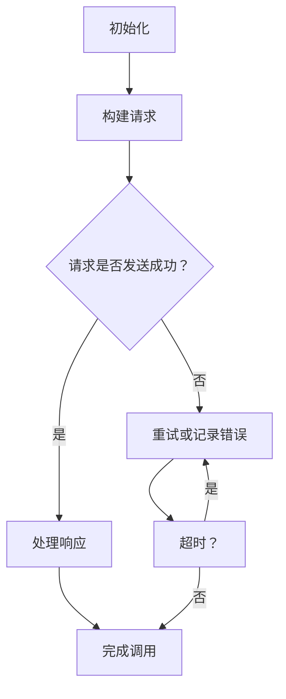
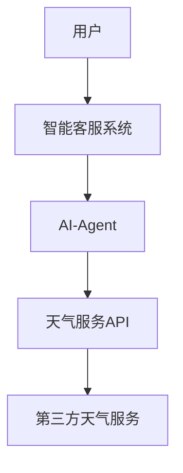
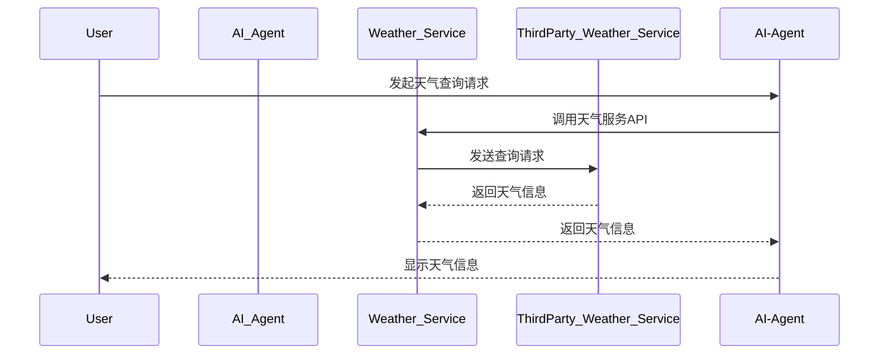

                 

# 构建AI Agent的API集成能力：连接外部服务

## 关键词
- AI Agent
- API集成
- 服务调用
- 数据传输
- 安全性
- 兼容性
- 性能优化

## 摘要
本文将深入探讨构建AI Agent的API集成能力，分析如何通过API设计、服务调用和数据传输等手段实现AI Agent与外部服务的无缝连接。本文旨在为开发者提供一套完整的API集成方案，涵盖核心概念、技术原理和实践方法，以实现高效、安全、可靠的API集成。

### 第一部分：背景介绍

#### 1.1.1 问题背景
随着人工智能技术的迅猛发展，AI Agent成为了现代智能系统中的重要组成部分。AI Agent能够模拟人类行为，完成复杂任务，提高工作效率。然而，在现实应用中，AI Agent面临着如何高效地与其他系统和服务进行交互的挑战。

#### 1.1.2 问题描述
构建AI Agent的API集成能力，即如何使AI Agent能够与外部服务进行无缝连接，实现数据的交换和功能的调用。这包括如何设计API、如何处理异构系统的兼容性以及如何保证数据传输的安全性和效率。

#### 1.1.3 问题解决
通过详细阐述构建AI Agent的API集成能力的核心概念、技术原理和实践方法，本书旨在帮助读者理解并掌握如何实现这一能力。本书将涵盖API设计、服务调用、数据传输、安全性等方面，并提供实用的案例和实践技巧。

#### 1.1.4 边界与外延
构建AI Agent的API集成能力不仅限于特定的技术或平台，它涵盖了广泛的领域，包括Web服务、RESTful API、SOAP API、微服务架构等。同时，本书还将探讨不同类型API的集成方法、跨平台兼容性以及国际化需求。

#### 1.1.5 概念结构与核心要素组成
构建AI Agent的API集成能力涉及以下核心概念和要素：
- API：应用程序编程接口，是AI Agent与外部服务交互的桥梁。
- 服务调用：AI Agent发起对外部服务的请求，并接收响应。
- 数据传输：确保数据在AI Agent与外部服务之间安全、高效地传输。
- 安全性：保护API和数据的完整性、机密性。
- 兼容性：确保AI Agent能够与不同类型的外部服务进行交互。
- 性能优化：提高API调用的速度和效率。

### 第二部分：核心概念与联系

#### 2.1 API设计

##### 2.1.1 API的定义与作用
API（Application Programming Interface）是允许应用程序之间相互通信的接口。在构建AI Agent时，API设计是关键环节，它定义了AI Agent与外部服务交互的规则和方式。

| 概念属性 | 描述 |
| :--: | :--: |
| **标准化** | 遵循业界标准和规范，确保API的通用性和可维护性。 |
| **简洁性** | 设计简洁的API接口，降低开发难度和运维成本。 |
| **可扩展性** | 预留扩展接口，以便未来添加新功能或服务。 |

##### 2.1.2 API设计原则

| 原则名称 | 描述 |
| :--: | :--: |
| **标准化** | 遵循业界标准和规范，确保API的通用性和可维护性。 |
| **简洁性** | 设计简洁的API接口，降低开发难度和运维成本。 |
| **可扩展性** | 预留扩展接口，以便未来添加新功能或服务。 |

##### 2.1.3 API设计工具
- **Swagger**：用于定义、构建和测试API的框架。
- **Postman**：API开发与测试工具。

#### 2.2 服务调用

##### 2.2.1 服务调用的概念
服务调用是指AI Agent通过API接口与外部服务进行交互的过程。它包括请求的发送、响应的接收和处理。

##### 2.2.2 服务调用的方法
- **同步调用**：AI Agent等待外部服务的响应。
- **异步调用**：AI Agent不等待外部服务的响应，而是通过回调函数或消息队列获取响应。

##### 2.2.3 服务调用的优势
- **解耦**：降低AI Agent与外部服务的耦合度，提高系统的灵活性。
- **可扩展**：易于添加或更换外部服务。

#### 2.3 数据传输

##### 2.3.1 数据传输的方式
- **文本传输**：如JSON、XML。
- **二进制传输**：如二进制协议。

##### 2.3.2 数据传输的安全性
- **加密**：确保数据在传输过程中不被窃取或篡改。
- **认证**：验证数据的来源，防止未经授权的访问。

##### 2.3.3 数据传输的效率
- **压缩**：减少数据传输的体积，提高传输速度。
- **缓存**：减少重复请求，提高响应速度。

### 第三部分：算法原理讲解

#### 3.1 服务调用算法

##### 3.1.1 服务调用算法的mermaid流程图


##### 3.1.2 服务调用算法的Python源代码实现
```python
import requests
import time

def call_service(url, headers, params, retries=3, timeout=10):
    for attempt in range(retries):
        try:
            response = requests.get(url, headers=headers, params=params, timeout=timeout)
            if response.status_code == 200:
                return response.json()
            else:
                print(f"Error: {response.status_code}")
        except requests.exceptions.RequestException as e:
            print(f"Error: {e}")
        time.sleep(attempt * 2)

    return None
```

##### 3.1.3 服务调用算法原理
服务调用算法的核心在于如何处理请求发送、响应接收以及错误处理。以下是算法原理的详细讲解：

1. **初始化**：初始化请求参数，包括URL、请求头和请求参数。
2. **构建请求**：根据初始化的请求参数，构建HTTP请求。
3. **发送请求**：使用HTTP客户端发送请求，并设置超时时间。
4. **处理响应**：检查响应状态码，如果状态码为200，则返回响应数据；否则，打印错误信息。
5. **错误处理**：如果请求失败，根据重试次数进行重试或记录错误。

##### 3.1.4 服务调用算法的数学模型和公式
服务调用算法的数学模型可以表示为以下公式：
$$
f(n) =
\begin{cases}
\text{response\_data} & \text{if } n \leq retries \text{ and response\_code == 200} \\
\text{error} & \text{if } n > retries \\
\text{timeout} & \text{if } \text{timeout} \text{ is reached} \\
\end{cases}
$$
其中，$n$ 表示重试次数，$response\_data$ 表示成功获取的响应数据，$error$ 表示错误信息，$timeout$ 表示超时。

##### 3.1.5 服务调用算法的举例说明
假设有一个API接口用于查询用户信息，请求URL为 `https://api.example.com/user/123`，请求头包括 `Content-Type: application/json`，请求参数为 `access_token=abc123`。使用服务调用算法进行调用，具体步骤如下：

1. **初始化**：设置请求URL、请求头和请求参数。
2. **构建请求**：构建HTTP GET请求。
3. **发送请求**：使用HTTP客户端发送请求，并设置超时时间为10秒。
4. **处理响应**：检查响应状态码，如果状态码为200，则返回响应数据；否则，打印错误信息。
5. **错误处理**：如果请求失败，根据重试次数进行重试或记录错误。

### 第四部分：系统分析与架构设计方案

#### 4.1 问题场景介绍
假设我们正在开发一个智能客服系统，该系统需要与第三方天气服务API进行集成，以获取实时天气信息。AI Agent将根据用户询问自动查询天气情况，并返回相应的信息。

#### 4.2 项目介绍
项目名称：智能客服系统（Smart Customer Service）
项目目标：实现与第三方天气服务API的集成，提供实时天气查询功能。
技术栈：Python、Flask、Requests、Swagger

#### 4.3 系统功能设计（领域模型mermaid类图）
```mermaid
classDiagram
ClassDef User
    +id: int
    +name: str
    +email: str

ClassDef AI_Agent
    +id: int
    +name: str
    +status: str

ClassDef Weather_Service
    +id: int
    +name: str
    +url: str
    +access_token: str

User "1" --|{发起请求}|> AI_Agent :查询天气
AI_Agent "2" --|{调用API}|> Weather_Service :获取天气信息
```

#### 4.4 系统架构设计（mermaid架构图）


#### 4.5 系统接口设计（mermaid序列图）


#### 4.6 系统交互（mermaid序列图）


### 第五部分：项目实战

#### 5.1 环境安装
1. 安装Python环境：`python --version`
2. 安装Flask框架：`pip install flask`
3. 安装Requests库：`pip install requests`
4. 安装Swagger：`pip install flasgger`

#### 5.2 系统核心实现源代码
```python
from flask import Flask, request, jsonify
from requests import get

app = Flask(__name__)

@app.route('/weather', methods=['GET'])
def get_weather():
    city = request.args.get('city')
    weather_api_url = f'https://api.weatherapi.com/v1/current.json?key=YOUR_API_KEY&q={city}'
    weather_response = get(weather_api_url)
    weather_data = weather_response.json()
    return jsonify(weather_data)

if __name__ == '__main__':
    app.run(debug=True)
```

#### 5.3 代码应用解读与分析
1. **Flask应用**：使用Flask框架创建一个Web应用。
2. **GET请求**：定义一个路由 `/weather`，接收GET请求。
3. **请求参数**：从请求中获取城市名称作为查询参数。
4. **调用天气API**：使用Requests库调用第三方天气服务API。
5. **返回结果**：将天气信息作为JSON格式返回给客户端。

#### 5.4 实际案例分析和详细讲解剖析
1. **用户请求**：用户通过Web界面输入城市名称，发起天气查询请求。
2. **API调用**：智能客服系统接收到请求后，调用第三方天气服务API。
3. **响应处理**：第三方天气服务返回天气信息，智能客服系统将信息处理后返回给用户。

#### 5.5 项目小结
本项目实现了智能客服系统与第三方天气服务API的集成，用户可以通过Web界面查询实时天气信息。项目展示了如何使用Flask框架、Requests库和Swagger工具构建API，并通过实际案例分析了API集成的过程。

### 第六部分：最佳实践 tips、小结、注意事项、拓展阅读等内容

#### 最佳实践 tips
- **API设计**：遵循RESTful API设计原则，确保接口简洁易用。
- **错误处理**：合理处理API调用中的错误，提供详细的错误信息。
- **安全性**：使用HTTPS协议，确保数据传输的安全性。
- **性能优化**：适当使用缓存，减少API调用的次数。

#### 小结
本文深入探讨了构建AI Agent的API集成能力，包括API设计、服务调用和数据传输等方面的核心概念和技术原理。通过实际案例，展示了如何实现AI Agent与外部服务的集成，并提供了一套完整的API集成方案。

#### 注意事项
- **API版本管理**：随着系统的发展，及时更新API版本，避免兼容性问题。
- **接口文档**：提供详细的接口文档，帮助开发者快速上手。
- **性能监控**：监控API性能，及时发现和解决性能瓶颈。

#### 拓展阅读
- **《RESTful API设计最佳实践》**：了解RESTful API设计的方法和技巧。
- **《API安全性指南》**：学习如何确保API的安全性。
- **《微服务架构设计》**：了解微服务架构的优势和应用。

### 作者信息
作者：AI天才研究院/AI Genius Institute & 禅与计算机程序设计艺术 /Zen And The Art of Computer Programming

