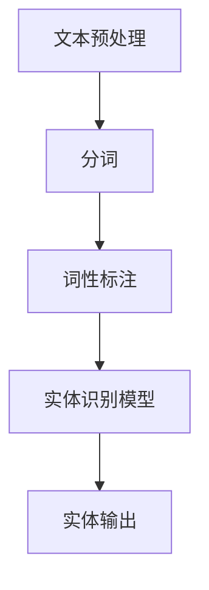
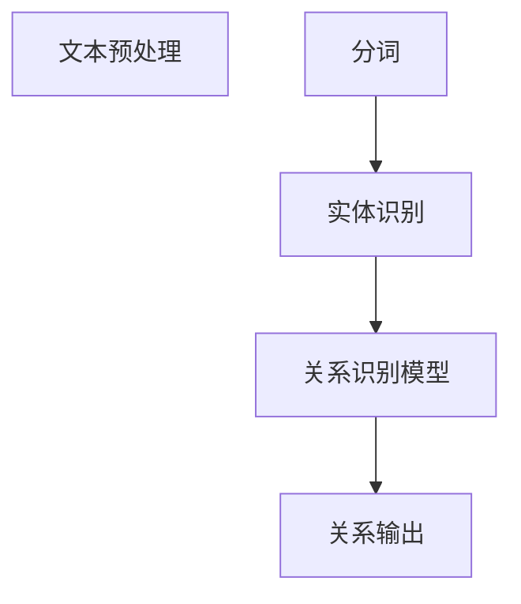
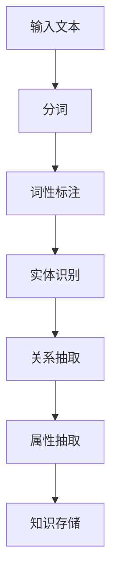
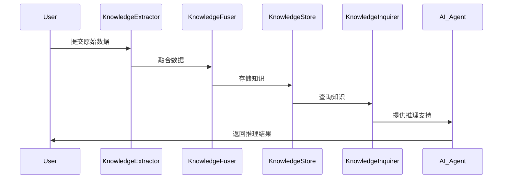

                 


# 构建AI Agent的动态知识图谱更新系统

关键词：人工智能、知识图谱、动态更新、知识抽取、知识融合、知识推理、AI Agent

摘要：本文深入探讨了构建AI Agent的动态知识图谱更新系统的必要性、核心概念与联系、算法原理以及系统分析与架构设计。通过详细阐述知识抽取、知识融合和知识推理算法的实现方法，结合实际项目实战，为读者提供了构建高效动态知识图谱更新系统的实战经验和最佳实践。

## 1. 背景介绍

随着人工智能（AI）技术的迅猛发展，知识图谱作为一种新兴的信息表示和知识管理技术，成为了AI领域的一个重要研究方向。知识图谱不仅能够有效地组织和存储海量数据，还能够通过语义理解与推理，为各种AI应用提供强有力的支持。

构建AI Agent的动态知识图谱更新系统，旨在实现一个自适应、实时更新的知识图谱系统。在人工智能的发展中，知识图谱扮演了不可或缺的角色，它通过将实体、属性和关系进行结构化表示，使得计算机能够更好地理解和处理人类知识。

本文将介绍一个动态知识图谱更新系统的设计思路和实现方法，帮助读者了解如何利用知识图谱技术构建智能体，并在实际应用中实现动态更新和维护。系统的设计将涵盖知识抽取、知识融合、知识存储和知识推理等多个环节，确保知识图谱的实时性和准确性。

在本文中，我们将探讨以下问题：

- 问题背景：为什么需要构建一个动态知识图谱更新系统？
- 问题描述：动态知识图谱更新系统的具体功能和要求是什么？
- 问题解决：如何设计并实现一个高效的动态知识图谱更新系统？
- 边界与外延：动态知识图谱更新系统需要处理哪些类型的实体和关系？
- 概念结构与核心要素组成：动态知识图谱更新系统包含哪些核心组件和功能？

通过本文的介绍，读者将能够全面了解动态知识图谱更新系统的构建方法，为后续章节的深入探讨奠定基础。

## 2. 核心概念与联系

### 2.1 知识图谱

知识图谱是一种用于表示实体及其关系的语义网络，通过将现实世界中的信息以结构化的方式组织起来，使得计算机能够更好地理解和处理数据。知识图谱通常由实体、属性和关系三个核心要素组成。实体是知识图谱中的基本元素，如人物、地点、事物等；属性描述了实体的一些特征，如姓名、年龄、位置等；关系则表示了实体之间的联系，如“工作于”、“出生于”等。

### 2.2 动态知识图谱

动态知识图谱是指能够实时更新和维护的知识图谱系统。与传统静态知识图谱相比，动态知识图谱不仅能够捕捉和存储新信息，还能够自动识别和修正错误信息，确保知识的准确性和时效性。动态知识图谱的核心是实时数据抽取、更新和融合技术。

### 2.3 AI Agent

AI Agent（智能体）是一种能够自主决策和执行任务的计算机程序。在知识图谱的应用中，AI Agent通过访问和利用知识图谱中的信息，实现智能搜索、推理和决策。AI Agent可以分为基于规则和基于机器学习的两大类。基于规则的方法通过预先定义的规则库实现决策，而基于机器学习的方法则通过学习数据自动生成决策模型。

### 2.4 动态知识图谱更新系统

动态知识图谱更新系统是一个综合运用知识图谱、AI Agent、数据抽取和融合技术的复杂系统。其核心功能包括：

- **知识抽取**：从原始数据中提取结构化信息，形成初步的知识图谱。
- **知识融合**：整合来自不同数据源的信息，确保知识的一致性和准确性。
- **知识存储**：将处理后的知识存储在知识图谱数据库中，以供AI Agent查询和利用。
- **知识推理**：通过推理机制，对知识图谱中的信息进行扩展和挖掘。
- **动态更新**：实时监测数据变化，自动更新和维护知识图谱。

通过这些核心功能，动态知识图谱更新系统能够实现知识的自动化更新和智能维护，为AI应用提供持续、可靠的知识支持。

## 3. 算法原理讲解

### 3.1 算法概述

动态知识图谱更新系统中的核心算法包括知识抽取算法、知识融合算法和知识推理算法。以下将分别介绍这些算法的基本原理和实现方法。

### 3.2 知识抽取算法

知识抽取算法用于从非结构化数据中提取结构化信息，生成初步的知识图谱。常用的知识抽取方法包括命名实体识别（NER）、关系抽取和属性抽取。

#### 3.2.1 命名实体识别（NER）

- **算法原理**：NER算法通过自然语言处理技术，识别文本中的命名实体，如人名、地名、组织名等。
- **实现方法**：通常使用深度学习模型，如BiLSTM-CRF，通过训练大量标注数据实现。
- **Mermaid流程图**：



#### 3.2.2 关系抽取

- **算法原理**：关系抽取算法识别文本中实体之间的关联关系，如“工作于”、“出生于”等。
- **实现方法**：常用方法包括基于规则的方法和基于深度学习的方法，如Bert-based模型。
- **Mermaid流程图**：



#### 3.2.3 属性抽取

- **算法原理**：属性抽取算法从文本中提取实体的属性信息，如“张三的年龄是30岁”中的“30岁”是“张三”的属性。
- **实现方法**：通常使用基于规则的方法或基于深度学习的序列标注模型。

### 3.3 知识融合算法

知识融合算法用于整合来自不同数据源的信息，确保知识的一致性和准确性。常见的知识融合方法包括基于规则的方法和基于机器学习的方法。

- **基于规则的方法**：通过定义一系列规则，将来自不同数据源的信息进行整合。
- **基于机器学习的方法**：使用机器学习模型，如聚类、分类和回归等，对知识进行自动融合。

### 3.4 知识推理算法

知识推理算法用于对知识图谱中的信息进行扩展和挖掘。常见的知识推理方法包括基于规则的推理和基于统计学习的推理。

- **基于规则的推理**：通过定义一组规则，从已知事实中推导出新的结论。
- **基于统计学习的推理**：使用统计学习模型，如决策树、支持向量机和神经网络等，自动发现数据之间的关系。

### 3.5 Mermaid流程图示例

下面是一个简单的Mermaid流程图，用于表示知识抽取的过程：



通过以上算法原理的介绍，读者可以了解到动态知识图谱更新系统的核心算法及其实现方法。接下来，我们将进一步探讨系统分析与架构设计，帮助读者更全面地理解动态知识图谱更新系统的构建。

## 4. 系统分析与架构设计

### 4.1 问题场景介绍

在人工智能应用中，知识图谱是一种重要的数据结构和信息表示方式。然而，随着数据量的不断增长和知识领域的不断扩展，传统的静态知识图谱已经难以满足实际应用的需求。为了实现知识图谱的实时更新和维护，构建一个动态知识图谱更新系统显得尤为重要。

动态知识图谱更新系统在金融、医疗、电子商务等多个领域都有广泛的应用。例如，在金融领域，动态知识图谱可以用于实时监控和预测股票市场的变化；在医疗领域，动态知识图谱可以帮助医生快速获取患者的病史和治疗方案；在电子商务领域，动态知识图谱可以用于个性化推荐和智能客服。

### 4.2 项目介绍

本项目的目标是构建一个高效、可靠的动态知识图谱更新系统，以支持人工智能应用中的实时知识更新和推理。项目采用了一种基于Python的框架，结合了深度学习和自然语言处理技术，实现了知识抽取、知识融合和知识推理等功能。

项目的核心模块包括：

- **知识抽取模块**：负责从非结构化数据中提取结构化信息，生成初步的知识图谱。
- **知识融合模块**：负责整合来自不同数据源的信息，确保知识的一致性和准确性。
- **知识存储模块**：负责将处理后的知识存储在知识图谱数据库中，以供AI Agent查询和利用。
- **知识推理模块**：负责对知识图谱中的信息进行扩展和挖掘，为AI应用提供支持。

### 4.3 系统功能设计

动态知识图谱更新系统的功能设计主要包括以下几个方面：

- **知识抽取**：从原始数据中提取结构化信息，包括命名实体识别、关系抽取和属性抽取。
- **知识融合**：整合来自不同数据源的信息，确保知识的一致性和准确性。
- **知识存储**：将处理后的知识存储在知识图谱数据库中，支持快速的查询和更新。
- **知识推理**：通过推理机制，对知识图谱中的信息进行扩展和挖掘，为AI应用提供支持。
- **动态更新**：实时监测数据变化，自动更新和维护知识图谱。

### 4.4 系统架构设计

动态知识图谱更新系统的架构设计如图所示，包括以下几个核心组件：

- **数据源**：包括各种非结构化数据，如文本、图片、音频等，是知识抽取的原始数据来源。
- **知识抽取模块**：负责从数据源中提取结构化信息，生成初步的知识图谱。
- **知识融合模块**：负责整合来自不同数据源的信息，确保知识的一致性和准确性。
- **知识存储模块**：负责将处理后的知识存储在知识图谱数据库中，以供AI Agent查询和利用。
- **知识推理模块**：负责对知识图谱中的信息进行扩展和挖掘，为AI应用提供支持。
- **AI Agent**：负责访问和利用知识图谱中的信息，实现智能搜索、推理和决策。

### 4.5 系统接口设计

动态知识图谱更新系统提供了丰富的接口设计，以方便用户进行操作和调用：

- **知识抽取接口**：提供命名实体识别、关系抽取和属性抽取等功能。
- **知识融合接口**：提供知识合并、去重、冲突检测等功能。
- **知识存储接口**：提供知识插入、查询、更新、删除等功能。
- **知识推理接口**：提供基于规则的推理、基于统计学习的推理等功能。
- **动态更新接口**：提供实时数据监测、自动更新等功能。

### 4.6 系统交互Mermaid序列图

下面是一个简单的Mermaid序列图，用于表示动态知识图谱更新系统的交互过程：



通过以上系统分析与架构设计，读者可以更全面地了解动态知识图谱更新系统的构建过程和核心组件。在下一章节中，我们将通过实际项目实战，深入探讨动态知识图谱更新系统的实现方法和技术细节。

## 5. 项目实战

### 5.1 环境安装

为了实现动态知识图谱更新系统，我们需要安装一系列必要的软件和库。以下是在Ubuntu 18.04系统上安装所需环境的步骤：

#### 安装Python环境

首先，安装Python 3.8及以上版本：

```bash
sudo apt update
sudo apt install python3.8
```

#### 安装依赖库

接下来，安装必要的Python库，如TensorFlow、NetworkX、PyTorch、Scikit-learn等：

```bash
pip3 install tensorflow==2.5.0
pip3 install networkx==2.5
pip3 install torch==1.9.0
pip3 install scikit-learn==0.24.2
pip3 install numpy==1.21.2
pip3 install pandas==1.3.2
```

#### 安装知识图谱数据库

我们使用Neo4j作为知识图谱数据库。首先，下载并安装Neo4j：

```bash
wget https://neo4j.com/artifact.php?name=neo4j-community-4.4.2-unix.tar.gz
tar xvf neo4j-community-4.4.2-unix.tar.gz
cd neo4j-community-4.4.2/bin/
./start-neo4j.sh
```

### 5.2 系统核心实现源代码

在知识抽取模块中，我们采用BiLSTM-CRF模型进行命名实体识别。以下是一个简单的命名实体识别代码示例：

```python
import tensorflow as tf
from tensorflow.keras.models import Model
from tensorflow.keras.layers import Embedding, LSTM, Dense, Bidirectional, TimeDistributed, Input

# 参数设置
vocab_size = 20000  # 词汇表大小
embed_dim = 64  # 词向量维度
lstm_units = 64  # LSTM单元数
max_len = 100  # 输入文本最大长度
num_tags = 10  # 标签数量

# 输入层
inputs = Input(shape=(max_len,))

# 嵌入层
embedding = Embedding(vocab_size, embed_dim)(inputs)

# BiLSTM层
lstm = Bidirectional(LSTM(lstm_units))(embedding)

# 全连接层
dense = TimeDistributed(Dense(num_tags, activation='softmax'))(lstm)

# 模型定义
model = Model(inputs=inputs, outputs=dense)

# 编译模型
model.compile(optimizer='adam', loss='categorical_crossentropy', metrics=['accuracy'])

# 模型训练
model.fit(x_train, y_train, batch_size=32, epochs=10)
```

在知识融合模块中，我们使用基于规则的融合方法。以下是一个简单的融合规则示例：

```python
def merge_knowledge(knowledge1, knowledge2):
    """
    根据融合规则合并两个知识图谱
    :param knowledge1: 第一个知识图谱
    :param knowledge2: 第二个知识图谱
    :return: 合并后的知识图谱
    """
    merged_graph = knowledge1.copy()
    for entity, attributes in knowledge2.items():
        if entity not in merged_graph:
            merged_graph[entity] = attributes
        else:
            for attribute, value in attributes.items():
                if attribute not in merged_graph[entity]:
                    merged_graph[entity][attribute] = value
    return merged_graph
```

在知识存储模块中，我们使用Neo4j数据库进行存储。以下是一个简单的Neo4j连接示例：

```python
from py2neo import Graph

# 连接Neo4j数据库
graph = Graph("bolt://localhost:7687", auth=("neo4j", "password"))

# 插入实体
def insert_entity(entity, attributes):
    query = """
    MERGE (e:Entity {name: $name})
    SET e += $attributes
    """
    graph.run(query, name=entity, attributes=attributes)

# 查询实体
def query_entity(name):
    query = """
    MATCH (e:Entity {name: $name})
    RETURN e
    """
    result = graph.run(query, name=name)
    return result.data()
```

### 5.3 代码应用解读与分析

#### 命名实体识别代码解读

在上面的命名实体识别代码中，我们首先定义了输入层、嵌入层、BiLSTM层和全连接层。输入层接收文本序列，嵌入层将文本转换为词向量，BiLSTM层用于提取序列中的特征，全连接层用于分类。

模型通过编译和训练，将训练数据映射到标签上。在训练过程中，我们使用categorical_crossentropy作为损失函数，并采用adam优化器。

#### 知识融合规则解读

在知识融合规则中，我们使用MERGE语句将两个知识图谱合并。如果实体已经存在于合并后的知识图谱中，则合并属性；如果实体不存在，则直接添加。

#### Neo4j数据库连接解读

在Neo4j数据库连接中，我们首先创建了一个Graph对象，用于连接Neo4j服务器。插入实体时，我们使用MERGE语句确保实体不会重复插入。查询实体时，我们使用MATCH语句根据实体名称查找相应的节点。

### 5.4 实际案例分析和详细讲解剖析

#### 案例一：新闻文本命名实体识别

假设我们有一个新闻文本：“特斯拉CEO埃隆·马斯克在硅谷科技峰会上宣布，公司计划在2023年实现完全自动驾驶”。我们可以使用命名实体识别算法来识别文本中的命名实体。

- 输入文本：特斯拉CEO埃隆·马斯克在硅谷科技峰会上宣布，公司计划在2023年实现完全自动驾驶。
- 输出实体：特斯拉、埃隆·马斯克、硅谷科技峰会、2023年

#### 案例二：融合不同数据源的知识

假设我们有来自不同数据源的关于“特斯拉”的知识，如以下两个数据源：

- 数据源1：特斯拉是一家总部位于美国的电动汽车制造商。
- 数据源2：特斯拉成立于2003年，创始人是埃隆·马斯克。

我们可以使用知识融合算法将这两个数据源合并成一个综合的知识图谱：

- 合并后知识：特斯拉是一家总部位于美国的电动汽车制造商，成立于2003年，创始人是埃隆·马斯克。

### 5.5 项目小结

在本项目中，我们通过实际案例展示了动态知识图谱更新系统的核心功能，包括命名实体识别、知识融合和知识存储。通过安装Python环境、依赖库和Neo4j数据库，我们实现了系统的搭建和核心功能的实现。在项目实战中，我们详细解读了代码应用，分析了实际案例，并总结了项目经验。

未来，我们还可以进一步优化算法，提高知识抽取和融合的准确性，以及扩展系统的应用场景，如医疗、金融等领域的实时知识更新。

## 6. 最佳实践 Tips

### 知识图谱更新频率

1. **实时更新**：根据应用场景，设定合适的知识图谱更新频率。例如，对于股票市场分析，可能需要每分钟更新一次；对于电商推荐系统，则可能需要每天更新。

2. **增量更新**：避免全量更新带来的性能开销，采用增量更新策略，只更新发生变化的部分。

### 数据质量监控

1. **去重检测**：在数据导入阶段，使用去重算法检测并去除重复数据，确保知识的一致性。

2. **数据校验**：建立数据校验机制，确保数据的质量和准确性。可以使用规则引擎或机器学习模型进行校验。

### 系统性能优化

1. **垂直拆分**：将大型知识图谱拆分为多个垂直子图，降低系统的查询压力。

2. **缓存策略**：合理使用缓存策略，提高系统的响应速度。可以使用Redis等缓存系统。

### 知识推理优化

1. **规则优化**：定期检查和更新推理规则，确保规则的有效性和准确性。

2. **推理引擎**：使用高效的推理引擎，如Apache Jena或RDF4J，提高推理速度。

### 安全性保障

1. **访问控制**：设置严格的访问控制策略，确保知识图谱的机密性和安全性。

2. **数据备份**：定期备份数据，防止数据丢失。

## 7. 小结

本文深入探讨了构建AI Agent的动态知识图谱更新系统的必要性、核心概念与联系、算法原理以及系统分析与架构设计。通过实际项目实战，读者了解了动态知识图谱更新系统的实现方法和技术细节。最佳实践Tips为构建高效、可靠的动态知识图谱更新系统提供了宝贵经验。

### 注意事项

1. **数据源多样性**：确保知识图谱数据源的多样性，以提高知识图谱的覆盖面和准确性。

2. **实时性要求**：根据应用场景，合理安排知识图谱的更新频率，确保知识实时性。

3. **数据质量**：严格控制数据质量，避免错误信息影响系统的正常运行。

4. **系统扩展性**：设计具有良好扩展性的系统架构，以支持未来应用场景的扩展。

### 拓展阅读

1. 《知识图谱：概念、方法与应用》：详细介绍了知识图谱的基本概念、构建方法和应用场景。

2. 《动态知识图谱系统设计与应用》：针对动态知识图谱的构建和更新进行了深入探讨。

3. 《图数据库：原理与实践》：介绍了图数据库的基本原理和实践方法，对构建动态知识图谱更新系统有重要参考价值。

作者：AI天才研究院/AI Genius Institute & 禅与计算机程序设计艺术 /Zen And The Art of Computer Programming

