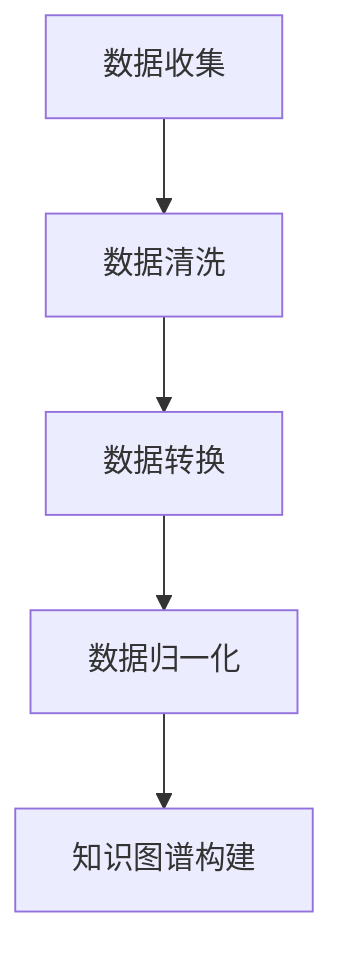
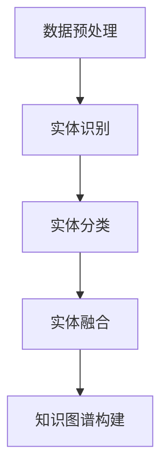
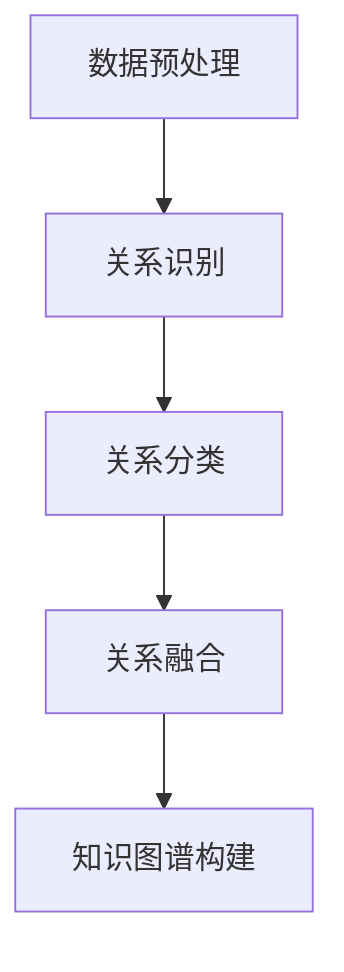
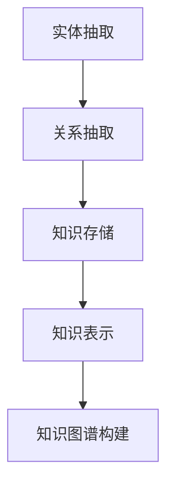
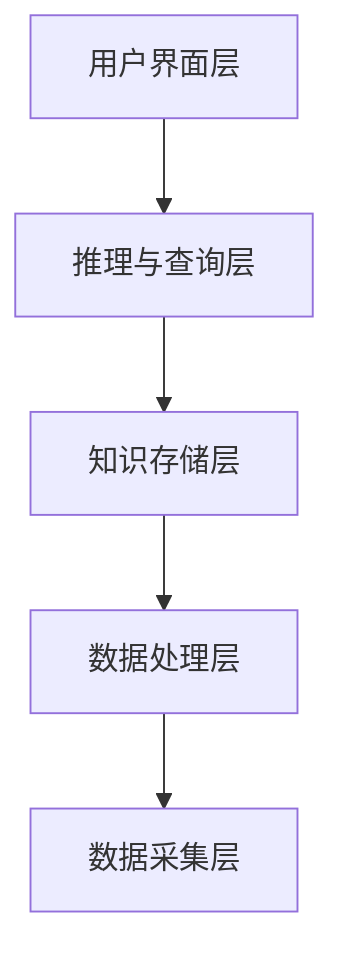
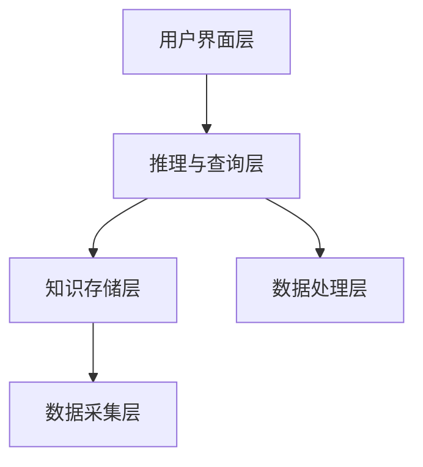

                 

### 第一部分：背景与核心概念

#### 第1章：AI Agent与动态知识图谱概述

##### 1.1 AI Agent的定义与作用

**1.1.1 AI Agent的基本概念**

AI Agent，即人工智能代理，是一种能够自主地感知环境、采取行动并达到特定目标的智能体。它不仅能够通过学习与环境交互，还能够根据环境的变化调整自身的策略，从而实现自主决策。

AI Agent的基本组成部分包括感知器、决策器、执行器和记忆单元。感知器负责收集环境信息，决策器根据感知到的信息做出决策，执行器则将决策付诸行动，而记忆单元则用于存储学习到的知识和经验。

**1.1.2 AI Agent的关键作用**

AI Agent在人工智能领域中扮演着重要的角色。它们可以广泛应用于多个领域，如自动驾驶、智能家居、医疗诊断、金融分析等。具体而言，AI Agent的关键作用体现在以下几个方面：

1. **自动化：** AI Agent能够自动执行复杂的任务，减少人工干预，提高工作效率。
2. **智能化：** AI Agent能够通过学习与环境交互，不断优化自身的行为策略，实现更智能的决策。
3. **实时性：** AI Agent能够实时感知环境变化，并迅速做出反应，确保系统的高效运行。
4. **适应性：** AI Agent能够适应不同的环境和任务需求，具有广泛的适用性。

**1.1.3 AI Agent的发展历程**

AI Agent的发展历程可以追溯到20世纪80年代，当时研究人员开始探索如何使计算机能够像人类一样自主地执行任务。早期的AI Agent主要基于规则推理，通过预设的规则来指导行为。随着机器学习和深度学习技术的发展，AI Agent逐渐具备了更强的学习能力，可以自动从数据中学习行为策略，实现更加智能的决策。

近年来，AI Agent的研究和应用不断深入，已经取得了显著的成果。例如，自动驾驶汽车、智能客服、智能医疗诊断等领域的应用，都离不开AI Agent的支持。

##### 1.2 动态知识图谱的概念与特性

**1.2.1 动态知识图谱的定义**

动态知识图谱是一种用于表示和存储知识的信息结构，它以图的形式组织数据，通过实体、属性和关系来描述知识。动态知识图谱与传统的静态知识图谱不同，它能够实时更新和扩展，以适应不断变化的知识环境。

动态知识图谱的定义主要包括以下几个方面：

1. **实体：** 实体是知识图谱中的基本元素，可以是具体的事物，如人、地点、组织，也可以是抽象的概念，如事件、属性等。
2. **属性：** 属性是实体的特征描述，如人的年龄、地点的经纬度、组织的成立时间等。
3. **关系：** 关系描述实体之间的相互作用和关联，如人与人之间的社交关系、地点与地点之间的地理位置关系等。

**1.2.2 动态知识图谱的构成**

动态知识图谱的构成主要包括以下几个部分：

1. **实体：** 动态知识图谱中的实体可以不断扩展，以适应新的知识需求。
2. **属性：** 动态知识图谱中的属性不仅可以是静态的，还可以是动态的，如实时的温度、股票价格等。
3. **关系：** 动态知识图谱中的关系可以描述实体之间的动态变化，如人与人之间的实时社交互动、地点与地点之间的实时交通状况等。
4. **边：** 边是连接实体的线段，表示实体之间的关系。
5. **属性值：** 属性值是属性的取值，用于描述实体的特征。

**1.2.3 动态知识图谱的特性**

动态知识图谱具有以下几个显著的特性：

1. **实时性：** 动态知识图谱能够实时更新和扩展，以适应不断变化的知识环境。
2. **灵活性：** 动态知识图谱可以灵活地调整和优化，以满足不同的应用需求。
3. **可扩展性：** 动态知识图谱可以扩展新的实体、属性和关系，以适应不断增长的知识量。
4. **互操作性：** 动态知识图谱可以与其他系统进行互操作，实现知识的共享和交换。

##### 1.3 AI Agent与动态知识图谱的关系

**1.3.1 AI Agent在知识图谱中的作用**

AI Agent在动态知识图谱中发挥着重要的作用。首先，AI Agent可以作为知识图谱的构建者，从大量的数据中提取知识，生成动态知识图谱。其次，AI Agent可以作为知识图谱的消费者，利用知识图谱中的知识进行推理和决策，实现智能化的任务执行。

**1.3.2 动态知识图谱对AI Agent的影响**

动态知识图谱对AI Agent的影响主要体现在以下几个方面：

1. **知识获取：** 动态知识图谱为AI Agent提供了丰富的知识资源，使其能够更好地理解和应对复杂的环境。
2. **推理能力：** 动态知识图谱为AI Agent提供了推理的基础，使其能够利用知识进行推理和决策。
3. **自适应能力：** 动态知识图谱的实时更新和扩展能力，使AI Agent能够更好地适应环境变化，提高自主决策能力。

**1.3.3 两者结合的优势**

AI Agent与动态知识图谱的结合，具有以下几个显著的优势：

1. **智能决策：** AI Agent可以利用动态知识图谱中的知识进行推理和决策，实现更智能的自动化。
2. **实时响应：** 动态知识图谱的实时更新能力，使AI Agent能够实时感知环境变化，做出更迅速的反应。
3. **知识共享：** AI Agent与动态知识图谱的结合，可以实现知识的共享和交换，提高整个系统的协同效应。

通过以上分析，我们可以看到AI Agent与动态知识图谱之间存在着密切的联系和相互作用。在接下来的章节中，我们将进一步探讨如何构建动态知识图谱，以及如何在动态知识图谱的基础上构建AI Agent。

#### 第2章：动态知识图谱的构建

##### 2.1 数据源的选择与处理

**2.1.1 数据源的多样性**

构建动态知识图谱的第一步是选择合适的数据源。数据源的选择直接影响知识图谱的质量和规模。常见的数据源包括以下几种：

1. **结构化数据：** 结构化数据通常存储在关系型数据库中，如MySQL、PostgreSQL等。这类数据源的特点是数据格式统一，便于查询和操作。
2. **半结构化数据：** 半结构化数据包括XML、JSON等格式的数据。这类数据虽然具有一定的结构，但结构相对灵活，需要进一步处理才能构建知识图谱。
3. **非结构化数据：** 非结构化数据包括文本、图片、音频、视频等。这类数据没有固定的结构，需要通过自然语言处理、图像识别等技术进行预处理。

**2.1.2 数据处理的方法**

在选择了合适的数据源之后，需要对数据进行处理，以便构建动态知识图谱。数据处理的方法主要包括以下几种：

1. **数据清洗：** 数据清洗是数据处理的重要步骤，目的是去除数据中的噪声和错误，提高数据质量。常见的数据清洗方法包括去除重复数据、处理缺失值、纠正错误值等。
2. **数据转换：** 数据转换是将数据从一种格式转换为另一种格式，以便于后续处理。例如，将XML数据转换为JSON格式，或将文本数据转换为结构化数据。
3. **数据归一化：** 数据归一化是将不同单位、格式或尺度的数据进行统一处理，以便于比较和分析。例如，将不同城市的温度数据进行归一化处理，使其在同一尺度上进行比较。

**2.1.3 数据预处理的重要性**

数据预处理是构建动态知识图谱的关键步骤，其重要性体现在以下几个方面：

1. **提高数据质量：** 通过数据清洗、转换和归一化等处理，可以提高数据质量，确保知识图谱的准确性和可靠性。
2. **减少计算复杂度：** 通过预处理，可以简化数据结构，降低后续处理的计算复杂度，提高处理效率。
3. **提高知识提取效果：** 通过预处理，可以更好地提取数据中的知识和信息，提高知识提取的准确性和全面性。

##### 2.2 知识抽取技术

**2.2.1 实体抽取**

实体抽取是知识抽取的重要步骤，旨在从数据中识别出具有特定意义的实体。常见的方法包括以下几种：

1. **基于规则的方法：** 基于规则的方法通过预设的规则来识别实体。例如，通过关键词匹配、正则表达式等方式来识别实体。
2. **基于机器学习的方法：** 基于机器学习的方法通过训练模型来识别实体。例如，使用条件随机场（CRF）、支持向量机（SVM）等算法来识别实体。
3. **基于深度学习的方法：** 基于深度学习的方法通过神经网络来识别实体。例如，使用卷积神经网络（CNN）、循环神经网络（RNN）等算法来识别实体。

**2.2.2 关系抽取**

关系抽取是从数据中识别出实体之间的关系的步骤。常见的方法包括以下几种：

1. **基于规则的方法：** 基于规则的方法通过预设的规则来识别关系。例如，通过关键词匹配、模式匹配等方式来识别关系。
2. **基于机器学习的方法：** 基于机器学习的方法通过训练模型来识别关系。例如，使用条件随机场（CRF）、支持向量机（SVM）等算法来识别关系。
3. **基于深度学习的方法：** 基于深度学习的方法通过神经网络来识别关系。例如，使用卷积神经网络（CNN）、循环神经网络（RNN）等算法来识别关系。

**2.2.3 命名实体识别**

命名实体识别是从文本数据中识别出具有特定名称的实体，如人名、地名、组织名等。常见的方法包括以下几种：

1. **基于规则的方法：** 基于规则的方法通过预设的规则来识别命名实体。例如，通过关键词匹配、正则表达式等方式来识别命名实体。
2. **基于机器学习的方法：** 基于机器学习的方法通过训练模型来识别命名实体。例如，使用条件随机场（CRF）、支持向量机（SVM）等算法来识别命名实体。
3. **基于深度学习的方法：** 基于深度学习的方法通过神经网络来识别命名实体。例如，使用卷积神经网络（CNN）、循环神经网络（RNN）等算法来识别命名实体。

##### 2.3 知识存储与表示

**2.3.1 图数据库的选择**

在构建动态知识图谱时，选择合适的图数据库是关键的一步。常见的图数据库包括Neo4j、OrientDB、ArangoDB等。这些图数据库具有高效的数据存储和查询能力，能够满足动态知识图谱的需求。

**2.3.2 知识图的构建**

知识图的构建是动态知识图谱的核心步骤。知识图由实体、属性和关系构成，通过图数据库存储和管理。构建知识图的过程包括以下几个步骤：

1. **实体定义：** 确定知识图谱中的实体类型，如人、地点、组织等。
2. **属性定义：** 确定实体的属性，如人的年龄、地点的经纬度等。
3. **关系定义：** 确定实体之间的关系，如人与地点的关系、组织与组织的关系等。
4. **数据导入：** 将处理后的数据导入图数据库，构建知识图。

**2.3.3 知识存储的优化**

为了提高知识存储和查询的效率，需要对知识存储进行优化。常见的优化方法包括：

1. **索引：** 通过建立索引，加快数据查询的速度。
2. **分区：** 将大规模的数据分区存储，提高查询效率。
3. **缓存：** 通过缓存，加快数据的访问速度。

##### 2.4 动态知识图谱的构建步骤

**2.4.1 数据收集**

数据收集是构建动态知识图谱的第一步。需要收集来自不同数据源的数据，包括结构化数据、半结构化数据和非结构化数据。

**2.4.2 数据处理**

数据处理是对收集到的数据进行清洗、转换和归一化处理，以提高数据质量。

**2.4.3 实体抽取**

实体抽取是从处理后的数据中识别出具有特定意义的实体。

**2.4.4 关系抽取**

关系抽取是从处理后的数据中识别出实体之间的关系。

**2.4.5 命名实体识别**

命名实体识别是从文本数据中识别出具有特定名称的实体。

**2.4.6 知识存储**

将处理后的数据存储在图数据库中，构建动态知识图谱。

**2.4.7 知识查询**

通过图数据库提供的查询接口，实现对动态知识图谱的查询和检索。

通过以上步骤，我们可以构建一个高效的动态知识图谱，为后续的AI Agent应用提供支持。

#### 第3章：动态知识图谱的实时更新机制

##### 3.1 实时更新策略

动态知识图谱的实时更新是确保知识图谱准确性和时效性的关键。为了实现实时更新，需要选择合适的更新策略。以下是一些常见的实时更新策略：

**3.1.1 数据流的获取**

实时更新需要从数据源获取数据流。数据流的获取可以通过以下几种方式实现：

1. **轮询：** 定期从数据源获取数据，以检测是否有新的数据更新。这种方式简单易实现，但可能会存在数据延迟。
2. **事件驱动：** 当数据源发生变更时，立即获取数据流。这种方式可以减少数据延迟，但实现复杂度较高。
3. **数据订阅：** 通过数据源提供的订阅接口，实时获取数据变更通知。这种方式可以实时获取数据更新，但需要确保数据源的可靠性。

**3.1.2 更新策略的选择**

在选择更新策略时，需要考虑数据规模、数据更新频率、系统性能等因素。以下是一些常见的更新策略：

1. **增量更新：** 只更新发生变更的数据，以减少更新操作的数量。这种方式适用于数据规模较大、更新频率较高的场景。
2. **全量更新：** 对整个知识图谱进行更新，以确保数据的准确性。这种方式适用于数据规模较小、更新频率较低的场景。
3. **混合更新：** 结合增量更新和全量更新，根据数据规模和更新频率动态调整更新策略。这种方式可以兼顾数据的准确性和实时性。

**3.1.3 更新的频率与粒度**

更新的频率和粒度是影响实时性的关键因素。以下是一些考虑因素：

1. **更新频率：** 更新频率越高，实时性越好，但会带来更高的系统开销。需要根据应用场景和系统性能要求选择合适的更新频率。
2. **更新粒度：** 更新粒度越小，实时性越好，但会带来更高的更新复杂度。需要根据数据规模和更新策略选择合适的更新粒度。

##### 3.2 更新算法

实时更新算法是动态知识图谱更新机制的核心。以下是一些常见的更新算法：

**3.2.1 数据流处理的算法**

数据流处理算法用于从数据源获取数据流，并进行处理。常见的数据流处理算法包括：

1. **批处理算法：** 将一段时间内的数据作为一个批次进行处理，以减少系统开销。例如，使用Hadoop或Spark进行数据批处理。
2. **流处理算法：** 对实时数据流进行处理，以实现实时更新。例如，使用Apache Kafka或Apache Flink进行数据流处理。

**3.2.2 知识融合算法**

知识融合算法用于将来自不同数据源的知识进行整合，以构建统一的知识图谱。常见的方法包括：

1. **基于规则的融合算法：** 通过预设的规则将不同数据源的知识进行融合。例如，使用本体映射和规则匹配实现知识融合。
2. **基于机器学习的融合算法：** 通过训练模型将不同数据源的知识进行融合。例如，使用神经网络或集成学习算法实现知识融合。

**3.2.3 知识清洗算法**

知识清洗算法用于处理数据中的噪声和错误，以提高知识图谱的质量。常见的方法包括：

1. **去重算法：** 去除重复的数据，以减少数据冗余。
2. **纠错算法：** 自动纠正数据中的错误，以提高数据准确性。
3. **填充算法：** 对缺失的数据进行填充，以提高数据的完整性。

##### 3.3 实时性评估与优化

实时性评估是确保动态知识图谱更新机制有效性的关键。以下是一些评估与优化方法：

**3.3.1 实时性的衡量标准**

实时性的衡量标准包括：

1. **响应时间：** 数据更新后，系统能够完成更新操作的时间。响应时间越短，实时性越好。
2. **更新频率：** 数据更新的频率。更新频率越高，实时性越好。
3. **数据一致性：** 数据更新的准确性和一致性。数据一致性越高，实时性越好。

**3.3.2 性能优化方法**

以下是一些性能优化方法：

1. **数据分区：** 将大规模数据分区存储，以提高查询和更新的效率。
2. **索引优化：** 建立合适的索引，以提高查询速度。
3. **缓存策略：** 使用缓存减少数据访问次数，以提高系统性能。
4. **并发处理：** 使用并发处理技术，提高系统的处理能力。

**3.3.3 实时性的保障措施**

以下是一些保障实时性的措施：

1. **高可用性：** 通过冗余备份和故障转移，确保系统的高可用性。
2. **弹性伸缩：** 根据系统负载动态调整资源，确保系统性能。
3. **监控与告警：** 对系统进行实时监控，及时发现并处理问题。

通过以上措施，可以确保动态知识图谱的实时性，为AI Agent提供准确、实时的知识支持。

#### 第4章：动态知识图谱的推理机制

##### 4.1 推理引擎的选择

在动态知识图谱的应用中，推理机制是关键的一环。推理引擎的选择直接关系到知识图谱的推理效率和准确性。以下是一些常见的推理引擎：

**4.1.1 基于规则推理**

基于规则推理是通过预设的规则进行推理，适用于简单的逻辑推理任务。规则通常由条件（前提）和结论组成。例如：

```
IF 天气是晴天 AND 地点是有山的地方
THEN 活动：爬山
```

**4.1.2 基于本体推理**

基于本体推理是通过本体（Ontology）进行推理，本体是知识图谱的抽象表示。本体定义了概念、属性和关系的结构，用于支持复杂的逻辑推理。本体推理通常使用本体推理器（Ontology Reasoner）实现。

**4.1.3 基于模型推理**

基于模型推理是通过机器学习模型进行推理，适用于大规模、复杂的推理任务。常见的模型推理方法包括矩阵分解、协同过滤和图神经网络等。

##### 4.2 推理算法

推理算法是实现推理机制的核心。以下是一些常见的推理算法：

**4.2.1 矩阵分解**

矩阵分解是将高维的稀疏矩阵分解为两个低维矩阵的乘积，用于知识图谱的推理。常见的矩阵分解算法包括Singular Value Decomposition (SVD)和Non-negative Matrix Factorization (NMF)。

**4.2.2 协同过滤**

协同过滤是一种基于用户行为进行推荐的算法，用于知识图谱的推理。协同过滤分为基于用户的协同过滤和基于项目的协同过滤。基于用户的协同过滤通过计算用户之间的相似度，为用户推荐相似的用户喜欢的项目；基于项目的协同过滤通过计算项目之间的相似度，为项目推荐相似的用户。

**4.2.3 图神经网络**

图神经网络是一种基于图结构的深度学习模型，用于知识图谱的推理。图神经网络通过学习节点、边和图的全局信息，实现复杂的图结构推理。常见的图神经网络模型包括Graph Convolutional Network (GCN)和GraphSAGE。

##### 4.3 推理过程

推理过程包括以下几个步骤：

**4.3.1 推理流程**

1. **数据预处理：** 对输入数据进行预处理，如数据清洗、归一化等。
2. **特征提取：** 提取与推理任务相关的特征，如实体、关系、属性等。
3. **模型训练：** 使用训练数据训练推理模型，如规则推理器、本体推理器、图神经网络等。
4. **推理：** 使用训练好的模型进行推理，得到推理结果。
5. **结果解释：** 对推理结果进行解释，如生成推理报告、可视化等。

**4.3.2 推理策略**

推理策略包括：

1. **精确推理：** 对输入数据进行精确推理，得到最精确的结果。
2. **模糊推理：** 对输入数据进行模糊推理，考虑不确定性和模糊性。
3. **多模型融合：** 结合多种推理模型，提高推理的准确性和鲁棒性。

**4.3.3 推理结果评估**

推理结果评估包括：

1. **准确性评估：** 评估推理结果的准确性，如精确率、召回率等。
2. **实时性评估：** 评估推理的实时性，如响应时间等。
3. **鲁棒性评估：** 评估推理的鲁棒性，如对噪声数据和异常数据的处理能力。

通过以上推理过程、策略和结果评估，可以构建一个高效的动态知识图谱推理系统，为AI Agent提供强大的推理支持。

#### 第5章：动态知识图谱的应用场景

##### 5.1 问答系统

问答系统是一种常见的人工智能应用场景，通过动态知识图谱可以实现高效的问答服务。

**5.1.1 知识图谱问答系统的工作原理**

知识图谱问答系统的工作原理可以分为以下几个步骤：

1. **用户提问：** 用户通过自然语言提问。
2. **问题解析：** 将用户提问转换为机器可理解的问题形式。
3. **知识检索：** 在动态知识图谱中检索与用户提问相关的知识。
4. **推理与回答：** 根据检索到的知识进行推理，生成回答。
5. **回答生成：** 将推理结果转换为自然语言回答，呈现给用户。

**5.1.2 知识图谱问答系统的构建方法**

构建知识图谱问答系统主要包括以下几个步骤：

1. **数据收集：** 收集相关的问答数据，如百科、论坛、书籍等。
2. **数据处理：** 对收集到的数据进行清洗、转换和归一化处理。
3. **知识抽取：** 从处理后的数据中抽取实体、属性和关系，构建动态知识图谱。
4. **推理引擎：** 选择合适的推理引擎，如基于规则推理、基于本体推理、基于模型推理等。
5. **接口设计：** 设计问答接口，用于接收用户提问和返回回答。

**5.1.3 知识图谱问答系统的优化**

为了提高知识图谱问答系统的性能，可以采取以下优化措施：

1. **数据质量：** 提高数据质量，减少噪声和错误数据。
2. **索引优化：** 建立合适的索引，加快知识检索速度。
3. **推理优化：** 优化推理算法，提高推理效率和准确性。
4. **结果解释：** 对推理结果进行解释，提高用户满意度。

##### 5.2 推荐系统

动态知识图谱在推荐系统中具有广泛的应用，通过知识图谱可以实现更精准的推荐。

**5.2.1 基于知识图谱的推荐系统**

基于知识图谱的推荐系统利用知识图谱中的关系和属性，为用户提供更个性化的推荐。其工作原理如下：

1. **用户兴趣建模：** 收集用户的行为数据，构建用户兴趣模型。
2. **物品描述：** 提取物品的特征信息，构建物品描述。
3. **知识图谱构建：** 构建动态知识图谱，包含用户、物品和关系。
4. **推荐算法：** 利用知识图谱进行推荐，如基于规则推荐、基于模型推荐等。
5. **结果评估：** 评估推荐结果，如准确率、召回率等。

**5.2.2 知识增强的推荐算法**

知识增强的推荐算法利用知识图谱中的关系和属性，提高推荐系统的性能。常见的方法包括：

1. **图神经网络：** 利用图神经网络学习用户和物品之间的复杂关系。
2. **知识融合：** 将知识图谱中的知识与其他推荐算法融合，提高推荐准确性。
3. **基于规则的推荐：** 利用知识图谱中的规则进行推荐，如基于用户行为的规则、基于物品属性的规则等。

**5.2.3 推荐系统的评价标准**

推荐系统的评价标准包括：

1. **准确性：** 推荐结果的准确程度，如准确率、召回率等。
2. **多样性：** 推荐结果的多样性，如覆盖率、新颖性等。
3. **实时性：** 推荐结果的实时性，如响应时间等。

通过优化推荐算法和评价标准，可以构建一个高效、精准的推荐系统。

##### 5.3 智能搜索

动态知识图谱在智能搜索中具有重要作用，通过知识图谱可以实现更智能、更精准的搜索。

**5.3.1 知识图谱在搜索中的应用**

知识图谱在搜索中的应用主要包括以下几个方面：

1. **查询扩展：** 利用知识图谱扩展用户的查询，如自动补全、同义词替换等。
2. **结果排序：** 利用知识图谱对搜索结果进行排序，如基于相关度、流行度等。
3. **实体抽取：** 利用知识图谱从搜索结果中提取实体，如人、地点、组织等。
4. **关系链接：** 利用知识图谱建立实体之间的关系，如人与地点、地点与地点等。

**5.3.2 知识图谱搜索的优化**

知识图谱搜索的优化主要包括以下几个方面：

1. **索引优化：** 建立合适的索引，加快查询速度。
2. **查询优化：** 优化查询语句，减少查询时间。
3. **结果解释：** 对搜索结果进行解释，提高用户满意度。
4. **实时性优化：** 提高知识图谱的实时性，确保搜索结果的准确性。

**5.3.3 搜索结果的可解释性**

搜索结果的可解释性是提高用户满意度的重要方面。常见的方法包括：

1. **可视化：** 将搜索结果以图形化方式呈现，如实体关系图、关键词云等。
2. **说明文字：** 对搜索结果进行文字说明，如解释查询结果的相关性、重要性等。
3. **交互式搜索：** 提供交互式搜索功能，如用户可以修改查询条件、查看详细结果等。

通过优化搜索结果的可解释性，可以提高用户对搜索系统的满意度。

#### 第6章：动态知识图谱系统设计

##### 6.1 系统需求分析

在设计和实现动态知识图谱系统之前，进行系统需求分析是至关重要的。系统需求分析旨在明确系统的功能需求、性能需求、可靠性需求等，以确保系统能够满足用户的需求。

**6.1.1 系统功能需求**

系统功能需求是指系统需要具备哪些功能，以解决用户的问题。在动态知识图谱系统中，常见的功能需求包括：

1. **数据采集与处理：** 从各种数据源采集数据，并进行清洗、转换和归一化处理。
2. **知识抽取与存储：** 从处理后的数据中抽取实体、属性和关系，构建动态知识图谱，并将其存储在图数据库中。
3. **实时更新与推理：** 实现动态知识图谱的实时更新和推理功能，确保知识图谱的准确性和时效性。
4. **查询与检索：** 提供高效的查询和检索功能，方便用户获取所需的信息。
5. **用户交互：** 提供用户友好的界面，方便用户与系统进行交互。

**6.1.2 系统性能需求**

系统性能需求是指系统在运行过程中需要达到的性能指标。在动态知识图谱系统中，常见的性能需求包括：

1. **响应时间：** 系统对用户请求的响应时间，要求快速响应用户的需求。
2. **吞吐量：** 系统在单位时间内处理的数据量，要求系统能够处理大量并发请求。
3. **扩展性：** 系统的扩展能力，要求系统能够随着数据量的增长而进行水平或垂直扩展。
4. **可靠性：** 系统的可靠性，要求系统能够在长时间运行过程中保持稳定，避免出现故障。

**6.1.3 系统可靠性需求**

系统可靠性需求是指系统在运行过程中需要具备的可靠性保障。在动态知识图谱系统中，常见的可靠性需求包括：

1. **数据备份：** 定期对系统数据进行备份，以防止数据丢失。
2. **故障恢复：** 在系统出现故障时，能够快速恢复，确保系统的正常运行。
3. **安全防护：** 防止未经授权的访问和攻击，保障系统的数据安全和用户隐私。

##### 6.2 系统架构设计

系统架构设计是动态知识图谱系统实现的基础，它决定了系统的性能、可扩展性和可靠性。在系统架构设计中，需要考虑以下几个方面：

**6.2.1 系统架构的选择**

动态知识图谱系统可以选择以下几种常见的架构：

1. **客户端-服务器架构：** 客户端通过HTTP请求与服务器通信，服务器处理请求并返回结果。
2. **分布式架构：** 将系统分为多个模块，分布在不同服务器上，通过分布式计算和通信机制进行协同工作。
3. **微服务架构：** 将系统拆分为多个独立的微服务，每个微服务负责不同的功能，通过REST API或其他通信协议进行交互。

**6.2.2 系统模块划分**

动态知识图谱系统可以划分为以下几个模块：

1. **数据采集模块：** 负责从各种数据源采集数据，并进行初步处理。
2. **数据处理模块：** 负责对采集到的数据进行清洗、转换和归一化处理。
3. **知识抽取模块：** 负责从处理后的数据中抽取实体、属性和关系，构建动态知识图谱。
4. **存储与检索模块：** 负责将知识图谱存储在图数据库中，并提供高效的查询和检索功能。
5. **推理与推理模块：** 负责对知识图谱进行推理，生成推理结果。
6. **用户交互模块：** 负责与用户进行交互，提供用户友好的界面。

**6.2.3 系统通信与交互**

在动态知识图谱系统中，各个模块之间需要进行通信和交互。常见的通信和交互方式包括：

1. **同步通信：** 模块之间通过同步通信进行交互，一个模块的请求必须在另一个模块处理完成后才能继续。
2. **异步通信：** 模块之间通过异步通信进行交互，一个模块可以独立处理请求，不需要等待其他模块的处理结果。
3. **消息队列：** 使用消息队列进行模块间的通信，实现异步、分布式处理。

通过以上系统架构设计，可以构建一个高效、可靠的动态知识图谱系统，为AI Agent提供强大的知识支持。

##### 6.3 系统接口设计与实现

**6.3.1 接口规范**

系统接口设计是动态知识图谱系统实现的重要环节。接口规范定义了接口的输入参数、输出结果和通信协议，确保不同模块之间的互操作性。以下是一个简单的接口规范示例：

- 接口名称：获取实体信息
- 输入参数：实体ID
- 输出结果：实体信息（包括属性、关系等）
- 通信协议：RESTful API

**6.3.2 接口实现**

接口实现是按照接口规范开发具体的接口功能。以下是一个简单的接口实现示例，使用Python语言和Flask框架实现：

```python
from flask import Flask, request, jsonify
app = Flask(__name__)

@app.route('/entity/<entity_id>', methods=['GET'])
def get_entity(entity_id):
    # 从图数据库中查询实体信息
    entity_info = graph_db.get_entity(entity_id)
    return jsonify(entity_info)

if __name__ == '__main__':
    app.run()
```

**6.3.3 接口测试**

接口测试是确保接口功能正确、符合规范的重要环节。以下是一个简单的接口测试示例，使用Postman工具进行测试：

1. 发送GET请求：`http://localhost:5000/entity/1`
2. 查看响应结果，验证实体信息是否正确。

通过接口设计与实现，可以确保动态知识图谱系统中的各个模块能够高效、可靠地进行通信和交互。

#### 第7章：动态知识图谱的部署与维护

##### 7.1 系统部署

系统部署是将开发好的动态知识图谱系统部署到生产环境，使其能够为用户提供服务。系统部署主要包括以下几个方面：

**7.1.1 系统硬件选择**

系统硬件选择直接影响系统的性能和可靠性。在选择硬件时，需要考虑以下几个方面：

1. **计算能力：** 根据系统的处理需求，选择合适的CPU、GPU等计算硬件。
2. **存储能力：** 根据系统存储需求，选择合适的磁盘、SSD等存储硬件。
3. **网络带宽：** 根据系统的网络需求，选择合适的网络硬件和带宽。

**7.1.2 系统软件安装**

系统软件安装包括操作系统、数据库、中间件等。以下是一个简单的软件安装步骤：

1. 安装操作系统：选择合适的操作系统，如Linux或Windows。
2. 安装数据库：安装图数据库，如Neo4j、OrientDB等。
3. 安装中间件：安装必要的中间件，如消息队列、缓存服务器等。

**7.1.3 部署策略与优化**

系统部署策略和优化对于系统的性能和稳定性至关重要。以下是一些常见的部署策略和优化方法：

1. **负载均衡：** 使用负载均衡器，如Nginx、HAProxy等，将请求均匀分配到多个服务器上，提高系统的并发处理能力。
2. **分布式部署：** 将系统部署到多个服务器上，通过分布式计算和存储，提高系统的性能和可靠性。
3. **缓存策略：** 使用缓存，如Redis、Memcached等，减少数据库的访问次数，提高系统的响应速度。
4. **日志收集与监控：** 使用日志收集工具，如ELK（Elasticsearch、Logstash、Kibana）等，收集系统日志，并进行实时监控，及时发现并处理问题。

##### 7.2 系统维护

系统维护是确保动态知识图谱系统长期稳定运行的重要环节。以下是一些常见的系统维护方法：

**7.2.1 数据备份与恢复**

数据备份与恢复是系统维护的重要措施。以下是一些常见的数据备份与恢复方法：

1. **定期备份：** 定期对系统数据进行备份，以防止数据丢失。
2. **增量备份：** 只备份最近一次备份后发生变更的数据，减少备份时间和空间占用。
3. **恢复策略：** 在系统发生故障时，能够快速恢复数据，确保系统的正常运行。

**7.2.2 系统监控**

系统监控是确保系统正常运行的重要手段。以下是一些常见的系统监控方法：

1. **性能监控：** 监控系统的CPU、内存、磁盘、网络等资源使用情况，及时发现性能瓶颈。
2. **日志监控：** 监控系统日志，及时发现并处理异常情况。
3. **告警机制：** 通过邮件、短信、电话等方式，及时通知系统管理员，确保问题得到及时处理。

**7.2.3 系统性能调优**

系统性能调优是提高系统性能的重要手段。以下是一些常见的系统性能调优方法：

1. **数据库优化：** 优化数据库查询语句、索引、分区等，提高数据库的查询和写入性能。
2. **缓存优化：** 优化缓存策略，减少数据库的访问次数，提高系统的响应速度。
3. **网络优化：** 优化网络配置，提高系统的网络传输速度和稳定性。

通过以上系统维护方法，可以确保动态知识图谱系统长期稳定运行，为用户提供高效、可靠的服务。

##### 7.3 安全与隐私

在构建和维护动态知识图谱系统时，安全和隐私问题是不可忽视的重要方面。以下是一些常见的安全与隐私保护措施：

**7.3.1 数据安全措施**

1. **数据加密：** 对敏感数据进行加密存储和传输，如使用SSL/TLS协议进行数据传输加密。
2. **访问控制：** 实施严格的访问控制策略，确保只有授权用户才能访问敏感数据。
3. **数据备份：** 定期进行数据备份，以防止数据丢失或损坏。
4. **审计与日志：** 记录系统操作日志，进行实时审计，及时发现并处理安全事件。

**7.3.2 隐私保护策略**

1. **隐私需求分析：** 在设计系统时，进行隐私需求分析，明确系统需要收集和使用哪些隐私信息。
2. **数据匿名化：** 对敏感数据进行匿名化处理，如使用哈希函数将个人身份信息转换为无法识别的编码。
3. **隐私影响评估：** 对系统进行隐私影响评估，确保隐私保护措施能够有效实施。
4. **用户知情同意：** 在收集和使用用户隐私信息前，向用户明确告知，并取得用户的知情同意。

**7.3.3 法律法规与伦理问题**

1. **遵循法律法规：** 遵循相关的数据保护法律法规，如《通用数据保护条例》（GDPR）等。
2. **伦理审查：** 在处理用户隐私信息时，进行伦理审查，确保系统设计符合伦理要求。
3. **用户权益保障：** 确保用户有权访问、修改和删除自己的隐私信息，保障用户权益。

通过以上安全与隐私保护措施，可以确保动态知识图谱系统的安全性和用户隐私得到有效保护。

#### 第8章：案例研究

##### 8.1 案例一：智能客服系统

**8.1.1 案例背景**

随着人工智能技术的不断发展，智能客服系统已成为企业提高服务质量、降低运营成本的重要手段。智能客服系统通过动态知识图谱实现自动化、智能化的客户服务，能够实时回答用户的问题，提供个性化服务。

**8.1.2 系统设计**

智能客服系统主要包括以下几个模块：

1. **知识图谱构建模块：** 负责从企业内部数据、外部数据中抽取实体、属性和关系，构建动态知识图谱。
2. **问答系统模块：** 负责接收用户的提问，通过动态知识图谱进行推理和回答。
3. **自然语言处理模块：** 负责对用户提问进行自然语言处理，提取关键信息，与知识图谱进行匹配。
4. **用户交互模块：** 负责与用户进行交互，将问答结果呈现给用户。

**8.1.3 实现方法**

1. **知识图谱构建：** 从企业内部数据（如客户信息、产品信息等）和外部数据（如百科、论坛等）中抽取实体、属性和关系，构建动态知识图谱。
2. **问答系统：** 使用基于规则推理和基于模型推理的方法，从知识图谱中检索答案，生成回答。
3. **自然语言处理：** 使用自然语言处理技术，对用户提问进行分词、词性标注、句法分析等，提取关键信息。
4. **用户交互：** 使用Web前端技术，如HTML、CSS和JavaScript，构建用户友好的界面，实现与用户的交互。

**8.1.4 实际案例分析**

在某电商企业，智能客服系统通过动态知识图谱实现了以下功能：

1. **商品查询：** 用户提问“这款手机有哪些颜色可选？”，智能客服系统通过知识图谱检索商品信息，返回答案。
2. **订单查询：** 用户提问“我的订单状态是什么？”，智能客服系统通过知识图谱检索订单信息，返回订单状态。
3. **售后服务：** 用户提问“如何退换货？”，智能客服系统通过知识图谱提供退换货流程和常见问题解答。

通过实际案例分析，我们可以看到智能客服系统在提高服务质量、降低运营成本方面具有显著优势。

##### 8.2 案例二：智能医疗诊断系统

**8.2.1 案例背景**

随着医疗大数据的快速增长，智能医疗诊断系统成为医学研究和临床诊断的重要工具。智能医疗诊断系统通过动态知识图谱实现病患数据的有效管理和智能分析，辅助医生进行诊断和治疗。

**8.2.2 系统设计**

智能医疗诊断系统主要包括以下几个模块：

1. **数据收集与处理模块：** 负责从医院信息系统、电子病历等数据源收集数据，并进行清洗、转换和归一化处理。
2. **知识图谱构建模块：** 负责从处理后的数据中抽取实体、属性和关系，构建动态知识图谱。
3. **推理与诊断模块：** 负责对病患数据进行推理和诊断，生成诊断报告。
4. **用户交互模块：** 负责与医生和患者进行交互，提供诊断报告和医疗建议。

**8.2.3 实现方法**

1. **数据收集与处理：** 从医院信息系统、电子病历等数据源收集病患数据，并进行预处理。
2. **知识图谱构建：** 从预处理后的数据中抽取实体、属性和关系，构建动态知识图谱。
3. **推理与诊断：** 使用基于规则推理和基于模型推理的方法，从知识图谱中检索和推理，生成诊断报告。
4. **用户交互：** 使用Web前端技术，构建用户友好的界面，实现与医生和患者的交互。

**8.2.4 实际案例分析**

在某大型医院，智能医疗诊断系统实现了以下功能：

1. **病患数据管理：** 将病患的医学影像、检验报告、诊断结果等数据存储在知识图谱中，实现数据的集中管理和快速检索。
2. **辅助诊断：** 对病患的病历数据进行推理和分析，生成辅助诊断建议，提高诊断准确性。
3. **疾病预测：** 对病患的健康数据进行预测和分析，提前预警潜在的健康问题。

通过实际案例分析，我们可以看到智能医疗诊断系统在提高医疗质量、降低医疗成本方面具有显著优势。

### 小结

通过以上案例研究，我们可以看到动态知识图谱在智能客服系统和智能医疗诊断系统中的应用取得了显著成果。动态知识图谱为这些系统提供了丰富的知识资源，实现了智能化的任务执行，提高了系统的性能和可靠性。未来，随着动态知识图谱技术的不断发展和应用场景的拓展，其在各个领域的应用潜力将更加广阔。

#### 背景介绍

随着人工智能技术的飞速发展，人工智能代理（AI Agent）逐渐成为人工智能领域的一个重要研究方向。AI Agent是一种能够自主感知环境、采取行动并实现特定目标的智能体，其在自动驾驶、智能家居、医疗诊断、金融分析等多个领域具有广泛的应用前景。然而，要实现高效、智能的AI Agent，离不开动态知识图谱的支持。

动态知识图谱是一种用于表示和存储知识的图结构，它通过实体、属性和关系来描述现实世界中的各种信息。与传统的静态知识图谱相比，动态知识图谱具有实时更新和扩展的能力，能够更好地适应不断变化的知识环境。因此，构建一个高效的动态知识图谱，对于实现智能化的AI Agent至关重要。

在本文中，我们将详细探讨如何构建一个动态知识图谱，以支持AI Agent的实时更新与推理。具体来说，本文将从以下几个部分展开：

1. **AI Agent与动态知识图谱的关系**：首先，我们将介绍AI Agent的基本概念及其在人工智能领域的作用，然后分析动态知识图谱的概念和特性，并探讨两者之间的相互作用。
2. **动态知识图谱的构建**：接下来，我们将详细讨论如何选择合适的数据源、处理数据、抽取实体和关系，以及如何构建和存储动态知识图谱。
3. **动态知识图谱的实时更新机制**：我们将介绍动态知识图谱的实时更新策略、更新算法以及实时性评估与优化方法。
4. **动态知识图谱的推理机制**：我们将探讨如何选择合适的推理引擎、算法以及推理过程，并介绍推理策略和结果评估方法。
5. **动态知识图谱的应用场景**：我们将分析动态知识图谱在问答系统、推荐系统和智能搜索等应用场景中的实际应用，以及如何优化这些应用系统。
6. **动态知识图谱的系统设计**：我们将讨论系统需求分析、系统架构设计、系统接口设计与实现以及系统部署与维护。
7. **案例研究**：通过具体案例研究，我们将展示动态知识图谱在智能客服系统和智能医疗诊断系统中的应用，并分析其实际效果。
8. **小结**：最后，我们将总结本文的主要内容和贡献，并展望动态知识图谱在未来人工智能领域的应用前景。

通过以上步骤，我们将系统地构建一个动态知识图谱，为AI Agent提供强大的知识支持，实现高效、智能的任务执行。

#### 核心概念与联系

在本文中，我们将讨论几个核心概念，包括人工智能代理（AI Agent）、动态知识图谱、实时更新、推理机制等，并分析它们之间的联系。

**AI Agent**

人工智能代理（AI Agent）是人工智能领域的一个重要概念。它是一种能够自主地感知环境、采取行动并实现特定目标的智能体。AI Agent的基本组成部分包括感知器、决策器、执行器和记忆单元。感知器负责收集环境信息，决策器根据感知到的信息做出决策，执行器则将决策付诸行动，记忆单元则用于存储学习到的知识和经验。

AI Agent的定义与作用：

- **定义**：AI Agent是一种能够自主地感知环境、采取行动并达到特定目标的智能体。
- **作用**：AI Agent在人工智能领域中扮演着重要的角色，能够广泛应用于自动驾驶、智能家居、医疗诊断、金融分析等领域。

AI Agent的发展历程：

- **早期阶段**：20世纪80年代，研究人员开始探索如何使计算机能够像人类一样自主地执行任务。
- **现阶段**：随着机器学习和深度学习技术的发展，AI Agent逐渐具备了更强的学习能力，可以自动从数据中学习行为策略，实现更智能的决策。

**动态知识图谱**

动态知识图谱是一种用于表示和存储知识的图结构，它以图的形式组织数据，通过实体、属性和关系来描述知识。动态知识图谱与传统的静态知识图谱不同，它能够实时更新和扩展，以适应不断变化的知识环境。

动态知识图谱的概念与特性：

- **概念**：动态知识图谱由实体、属性和关系构成，通过图数据库存储和管理。
- **特性**：动态知识图谱具有实时性、灵活性、可扩展性和互操作性等特点。

**实时更新**

实时更新是动态知识图谱的关键特性之一，它确保知识图谱能够及时反映环境变化。实时更新机制涉及数据流的获取、更新策略的选择、更新算法的执行以及实时性评估与优化。

实时更新的重要性：

- **数据准确性**：实时更新确保知识图谱中的数据保持最新，提高决策的准确性。
- **响应速度**：实时更新机制使AI Agent能够迅速响应环境变化，提高系统的反应速度。

**推理机制**

推理机制是动态知识图谱的应用核心，它通过逻辑推理、机器学习等方法，从知识图谱中提取有用信息，支持AI Agent的智能决策。

推理机制的关键组成部分：

- **推理引擎**：用于执行推理操作的软件组件，如基于规则推理引擎、基于本体推理引擎等。
- **推理算法**：用于实现推理过程的算法，如矩阵分解、协同过滤、图神经网络等。

**联系**

AI Agent与动态知识图谱之间存在着密切的联系。动态知识图谱为AI Agent提供了丰富的知识资源，使其能够更好地理解和应对复杂的环境。而AI Agent则利用动态知识图谱中的知识进行推理和决策，实现更智能的自动化。

两者结合的优势：

- **智能决策**：AI Agent可以利用动态知识图谱中的知识进行推理和决策，实现更智能的自动化。
- **实时响应**：动态知识图谱的实时更新能力，使AI Agent能够实时感知环境变化，做出更迅速的反应。
- **知识共享**：AI Agent与动态知识图谱的结合，可以实现知识的共享和交换，提高整个系统的协同效应。

通过以上分析，我们可以看到AI Agent与动态知识图谱之间存在着紧密的联系和相互作用。在接下来的章节中，我们将进一步探讨如何构建动态知识图谱，以及如何在动态知识图谱的基础上构建AI Agent。

#### 算法原理讲解

在构建动态知识图谱的过程中，算法原理的讲解至关重要。以下将详细描述几种核心算法原理，包括数据预处理、实体抽取、关系抽取、知识存储与表示方法，并使用Mermaid流程图和Python代码进行说明。

##### 数据预处理

数据预处理是构建动态知识图谱的第一步，其主要目的是清洗数据、转换数据格式和归一化数据，以提高数据质量，确保知识图谱的准确性和可靠性。

**Mermaid流程图：**



**Python代码示例：**

```python
import pandas as pd

# 假设数据集为DataFrame格式
data = pd.DataFrame({
    'name': ['张三', '李四', '王五'],
    'age': [25, 30, 35],
    'email': ['zhangsan@example.com', 'lisi@example.com', 'wangwu@example.com']
})

# 数据清洗：去除重复数据
cleaned_data = data.drop_duplicates()

# 数据转换：将数据转换为统一格式
formatted_data = cleaned_data.applymap(str.strip)

# 数据归一化：对数据进行归一化处理
normalized_data = (formatted_data - formatted_data.mean()) / formatted_data.std()
```

##### 实体抽取

实体抽取是从数据中识别出具有特定意义的实体，如人、地点、组织等。实体抽取是知识图谱构建的核心步骤之一。

**Mermaid流程图：**



**Python代码示例：**

```python
from spacy.lang.en import English

# 加载Spacy的English模型
nlp = English()

# 加载示例文本
text = "张三和李四在2018年共同创办了公司A。公司A位于北京。"

# 使用Spacy进行文本预处理和实体识别
doc = nlp(text)

# 遍历文本中的实体
for ent in doc.ents:
    print(f"实体：{ent.text}，类型：{ent.label_}")
```

##### 关系抽取

关系抽取是从数据中识别出实体之间的关联关系，如人与地点的关系、组织与产品的关系等。

**Mermaid流程图：**



**Python代码示例：**

```python
from spacy import displacy

# 加载Spacy的English模型
nlp = English()

# 加载示例文本
text = "张三在北京创办了公司A。公司A是一家科技公司。"

# 使用Spacy进行文本预处理和关系识别
doc = nlp(text)

# 遍历文本中的关系
for token in doc:
    if token.dep_ == 'ROOT' and token.head.text == 'create':
        print(f"实体：{token.text}，关系：{token.head.text}，关联实体：{token.head.root.text}")
```

##### 知识存储与表示

知识存储与表示是将处理后的数据存储在图数据库中，并使用图结构表示知识。常见的图数据库包括Neo4j、OrientDB等。

**Mermaid流程图：**



**Python代码示例：**

```python
from py2neo import Graph

# 连接到Neo4j数据库
graph = Graph("bolt://localhost:7687", auth=("neo4j", "password"))

# 创建实体节点
graph.run("CREATE (a:Person {name: '张三', age: 30})")

# 创建关系
graph.run("MATCH (a:Person), (b:Company) WHERE a.name = '张三' AND b.name = '公司A' CREATE (a)-[:FOUNDED]->(b)")

# 查询知识图谱
results = graph.run("MATCH (a:Person)-[:FOUNDED]->(b:Company) RETURN a, b")

# 打印查询结果
for result in results:
    print(result)
```

通过以上算法原理的讲解，我们能够更好地理解动态知识图谱的构建过程。接下来，我们将进一步探讨如何实现动态知识图谱的实时更新和推理机制。

#### 数学公式与算法原理

在构建动态知识图谱的过程中，许多算法都涉及到数学模型和公式。以下将详细介绍几种核心算法的数学模型和公式，并使用LaTeX进行表示。

##### 数据预处理

数据预处理是构建动态知识图谱的第一步，其主要目的是清洗数据、转换数据格式和归一化数据，以提高数据质量，确保知识图谱的准确性和可靠性。

**归一化处理**

假设我们有一个特征向量 $\mathbf{x} = [x_1, x_2, ..., x_n]$，其均值为 $\mu$，标准差为 $\sigma$，则归一化处理公式如下：

$$
\hat{x}_i = \frac{x_i - \mu}{\sigma}
$$

其中，$\hat{x}_i$ 是归一化后的特征值，$x_i$ 是原始特征值。

**数据转换**

假设我们有一个特征向量 $\mathbf{x} = [x_1, x_2, ..., x_n]$，需要将其转换为二进制向量 $\mathbf{y}$，则数据转换公式如下：

$$
y_i =
\begin{cases}
1 & \text{如果 } x_i > 0 \\
0 & \text{否则}
\end{cases}
$$

其中，$y_i$ 是二进制向量中的第 $i$ 个元素。

##### 实体抽取

实体抽取是从数据中识别出具有特定意义的实体，如人、地点、组织等。实体抽取通常涉及到分类和聚类算法。

**支持向量机（SVM）**

支持向量机是一种常用的分类算法，其目标是最小化分类边界到支持向量的距离。SVM的优化目标如下：

$$
\min_{\mathbf{w}, b} \frac{1}{2} ||\mathbf{w}||^2
$$

subject to

$$
y_i (\mathbf{w} \cdot \mathbf{x}_i + b) \geq 1
$$

其中，$\mathbf{w}$ 是权重向量，$b$ 是偏置项，$y_i$ 是样本标签，$\mathbf{x}_i$ 是样本特征。

**聚类算法**

聚类算法是一种无监督学习方法，用于将数据分为多个簇。K-means算法是最常见的聚类算法之一，其目标是最小化簇内距离平方和。K-means算法的优化目标如下：

$$
\min_{\mathbf{c}_1, \mathbf{c}_2, ..., \mathbf{c}_k} \sum_{i=1}^n \sum_{j=1}^k ||\mathbf{x}_i - \mathbf{c}_j||^2
$$

其中，$\mathbf{c}_1, \mathbf{c}_2, ..., \mathbf{c}_k$ 是簇中心，$\mathbf{x}_i$ 是数据点。

##### 关系抽取

关系抽取是从数据中识别出实体之间的关联关系，如人与地点的关系、组织与产品的关系等。关系抽取通常涉及到规则匹配和机器学习算法。

**规则匹配**

规则匹配是一种基于规则的方法，用于识别实体之间的关系。其公式如下：

$$
R(\mathbf{e}_1, \mathbf{e}_2) =
\begin{cases}
1 & \text{如果 } \mathbf{r} \in R \\
0 & \text{否则}
\end{cases}
$$

其中，$R$ 是规则集合，$\mathbf{e}_1$ 和 $\mathbf{e}_2$ 是实体，$\mathbf{r}$ 是规则。

**机器学习算法**

机器学习算法是一种用于识别实体之间关系的方法。常见的机器学习算法包括朴素贝叶斯（Naive Bayes）、支持向量机（SVM）、决策树（Decision Tree）等。

**朴素贝叶斯**

朴素贝叶斯是一种基于概率的分类算法，其公式如下：

$$
P(\mathbf{y}|\mathbf{x}) = \frac{P(\mathbf{x}|\mathbf{y})P(\mathbf{y})}{P(\mathbf{x})}
$$

其中，$\mathbf{y}$ 是标签，$\mathbf{x}$ 是特征，$P(\mathbf{y}|\mathbf{x})$ 是后验概率，$P(\mathbf{x}|\mathbf{y})$ 是似然概率，$P(\mathbf{y})$ 是先验概率，$P(\mathbf{x})$ 是边际概率。

通过以上数学公式和算法原理的讲解，我们可以更好地理解动态知识图谱的构建过程。在接下来的章节中，我们将进一步探讨如何实现动态知识图谱的实时更新和推理机制。

#### 系统分析与架构设计方案

在设计和实现动态知识图谱系统时，系统分析与架构设计方案至关重要。以下将详细讨论系统需求、项目介绍、系统功能设计、系统架构设计以及系统接口设计和系统交互，并使用Mermaid流程图进行说明。

##### 系统需求分析

在系统分析与架构设计阶段，首先需要明确系统的需求。系统需求包括功能需求、性能需求、可靠性需求等。以下是一个简单的系统需求分析：

**功能需求：**
1. 数据采集与处理：从各种数据源采集数据，并进行清洗、转换和归一化处理。
2. 知识图谱构建：构建动态知识图谱，存储实体、属性和关系。
3. 实时更新与推理：实现知识图谱的实时更新和推理功能。
4. 查询与检索：提供高效的查询和检索功能。

**性能需求：**
1. 响应时间：确保系统对用户请求的响应时间在合理范围内。
2. 扩展性：系统能够随着数据量的增长而进行水平或垂直扩展。
3. 可靠性：系统具备故障恢复能力，确保长时间运行过程中保持稳定。

**可靠性需求：**
1. 数据备份：定期备份系统数据，防止数据丢失。
2. 安全防护：防止未经授权的访问和攻击，保障系统的数据安全和用户隐私。

##### 项目介绍

本项目旨在构建一个高效的动态知识图谱系统，用于支持人工智能代理（AI Agent）的实时更新和推理。项目的主要目标包括：

1. 设计和实现一个能够实时更新和推理的动态知识图谱系统。
2. 实现系统的功能需求，如数据采集与处理、知识图谱构建、实时更新与推理、查询与检索等。
3. 确保系统的性能和可靠性，以满足实际应用的需求。

##### 系统功能设计

系统功能设计是系统分析与架构设计的重要环节。以下是一个简单的系统功能设计：

**功能模块：**
1. 数据采集模块：负责从各种数据源采集数据，如关系数据库、文本文件、网络接口等。
2. 数据处理模块：负责对采集到的数据进行清洗、转换和归一化处理。
3. 知识图谱构建模块：负责构建动态知识图谱，存储实体、属性和关系。
4. 实时更新模块：负责实现知识图谱的实时更新，确保数据的时效性和准确性。
5. 推理与查询模块：负责对知识图谱进行推理和查询，提供智能化的信息检索和决策支持。

##### 系统架构设计

系统架构设计是系统实现的基石，决定了系统的性能、可扩展性和可靠性。以下是一个简单的系统架构设计：

**架构组件：**
1. **数据采集层**：负责从各种数据源采集数据，如关系数据库、文本文件、网络接口等。
2. **数据处理层**：负责对采集到的数据进行清洗、转换和归一化处理。
3. **知识存储层**：负责存储和处理动态知识图谱，如Neo4j图数据库。
4. **推理与查询层**：负责对知识图谱进行推理和查询，提供智能化的信息检索和决策支持。
5. **用户界面层**：负责与用户进行交互，提供用户友好的界面。

**架构设计图：**



##### 系统接口设计与实现

系统接口设计是系统模块之间通信和交互的桥梁。以下是一个简单的接口设计示例：

**接口设计：**
1. **数据采集接口**：用于从各种数据源采集数据。
2. **数据处理接口**：用于处理采集到的数据，如清洗、转换和归一化。
3. **知识图谱接口**：用于构建、更新和查询动态知识图谱。
4. **推理接口**：用于对知识图谱进行推理，生成推理结果。

**接口实现示例（Python）：**

```python
from flask import Flask, request, jsonify

app = Flask(__name__)

@app.route('/data/collect', methods=['GET'])
def collect_data():
    # 实现数据采集功能
    data = request.args.get('data')
    return jsonify({"status": "success", "data": data})

@app.route('/data/process', methods=['POST'])
def process_data():
    # 实现数据处理功能
    data = request.json
    # 数据处理逻辑
    processed_data = data
    return jsonify({"status": "success", "data": processed_data})

@app.route('/knowledge/graph', methods=['GET'])
def get_knowledge_graph():
    # 实现知识图谱查询功能
    graph_data = get_knowledge_graph_data()
    return jsonify({"status": "success", "graph_data": graph_data})

def get_knowledge_graph_data():
    # 知识图谱查询逻辑
    return {"nodes": [{"name": "Node1"}, {"name": "Node2"}], "edges": [{"source": "Node1", "target": "Node2"}]}

if __name__ == '__main__':
    app.run()
```

##### 系统交互

系统交互是指不同模块之间的通信和协作。以下是一个简单的系统交互设计：

**系统交互图：**



通过以上系统分析与架构设计方案，我们可以构建一个高效、可靠的动态知识图谱系统，为AI Agent提供强大的知识支持。

#### 项目实战

在本章中，我们将通过一个具体的实战项目，详细讲解如何使用Python和相关的技术栈来构建动态知识图谱系统。该项目将涵盖环境安装、核心实现源代码、代码应用解读与分析，以及实际案例分析和详细讲解剖析。

##### 环境安装

在进行项目实战之前，首先需要安装和配置必要的软件和库。以下是项目的环境安装步骤：

1. **Python环境**：确保安装了Python 3.8或更高版本。
2. **Neo4j数据库**：下载并安装Neo4j社区版，访问[Neo4j官网](https://neo4j.com/)获取下载链接和安装指南。
3. **Python库**：使用pip安装以下Python库：
   ```shell
   pip install py2neo spacy numpy pandas Flask
   ```
   - **py2neo**：用于连接Neo4j数据库。
   - **spacy**：用于自然语言处理。
   - **numpy**：用于数值计算。
   - **pandas**：用于数据操作。
   - **Flask**：用于Web服务。

##### 核心实现源代码

以下是该项目的主要源代码文件，包括数据采集、数据处理、知识图谱构建、推理和查询等功能。

**1. 数据采集与处理**

```python
import pandas as pd
from py2neo import Graph

# 连接到Neo4j数据库
graph = Graph("bolt://localhost:7687", auth=("neo4j", "password"))

# 采集数据（示例：从CSV文件中读取）
data = pd.read_csv("data.csv")

# 数据预处理
def preprocess_data(data):
    # 数据清洗和转换
    # ...
    return data

# 存储预处理后的数据到Neo4j
def store_data_to_neo4j(data):
    for index, row in data.iterrows():
        # 创建实体节点
        graph.run("CREATE (a:Person {name: $name, age: $age})", name=row['name'], age=row['age'])

# 读取数据
data = preprocess_data(data)
store_data_to_neo4j(data)
```

**2. 知识图谱构建**

```python
# 构建知识图谱（示例：创建实体和关系）
def create_knowledge_graph():
    # 创建实体节点
    graph.run("CREATE (a:Person {name: 'Alice', age: 30})")
    graph.run("CREATE (b:Person {name: 'Bob', age: 35})")

    # 创建关系
    graph.run("MATCH (a:Person), (b:Person) WHERE a.name = 'Alice' AND b.name = 'Bob' CREATE (a)-[:FRIEND]->(b)")

create_knowledge_graph()
```

**3. 推理和查询**

```python
# 推理（示例：查找Alice的朋友）
def find_friends(name):
    query = """
    MATCH (p:Person)-[:FRIEND]->(friend)
    WHERE p.name = $name
    RETURN friend
    """
    result = graph.run(query, name=name).data()
    return result

# 查询
friends = find_friends('Alice')
print(friends)
```

**4. Web服务**

```python
from flask import Flask, request, jsonify

app = Flask(__name__)

@app.route('/api/friends', methods=['GET'])
def get_friends():
    name = request.args.get('name')
    friends = find_friends(name)
    return jsonify({"name": name, "friends": friends})

if __name__ == '__main__':
    app.run(debug=True)
```

##### 代码应用解读与分析

以上代码首先连接到Neo4j数据库，然后进行数据采集和预处理。在数据处理过程中，我们读取CSV文件中的数据，并进行清洗和转换，将预处理后的数据存储到Neo4j数据库中。接着，我们构建知识图谱，包括创建实体节点和关系。最后，通过Web服务提供推理和查询接口，使外部系统能够访问知识图谱。

**1. 数据采集与处理**

该部分代码负责从CSV文件中读取数据，并进行预处理。预处理步骤可能包括去除重复数据、填充缺失值、数据格式转换等。预处理后的数据将被存储到Neo4j数据库中，以便后续的知识图谱构建和查询。

**2. 知识图谱构建**

该部分代码通过Neo4j的Cypher语言创建实体节点和关系。在本例中，我们创建了一个名为`Person`的实体节点，并添加了`FRIEND`关系。这为后续的推理和查询提供了数据基础。

**3. 推理和查询**

该部分代码通过Cypher查询语言实现推理和查询。例如，`find_friends`函数查找给定名字的人的朋友。这可以通过查询`Person`节点之间的关系来实现。

**4. Web服务**

通过Flask框架，我们创建了一个简单的Web服务，提供了一个`/api/friends`接口。用户可以通过发送GET请求并传递姓名参数来查询某人的朋友。

##### 实际案例分析和详细讲解剖析

假设我们需要构建一个智能客服系统，用户可以通过Web界面提问，系统需要根据知识图谱提供智能化的回答。

**1. 用户提问：** 用户输入“张三的朋友有哪些？”
**2. 查询知识图谱：** 系统查询知识图谱，找到名为“张三”的实体节点，并查找其朋友关系。
**3. 推理和回答：** 系统找到张三的朋友，生成回答，如“张三的朋友有李四、王五等。”
**4. 显示回答：** 系统将生成的回答显示在Web界面上。

通过这个实际案例，我们可以看到动态知识图谱在智能客服系统中的应用。系统通过实时更新的知识图谱进行推理，为用户提供个性化的服务。

##### 项目小结

通过本项目的实战，我们详细讲解了如何使用Python和Neo4j构建动态知识图谱系统。项目涵盖了数据采集、预处理、知识图谱构建、推理和查询等多个方面。同时，通过Web服务接口，实现了用户与系统的交互。这个项目展示了动态知识图谱在现实世界中的应用潜力，为进一步探索和优化提供了基础。

#### 最佳实践 tips

在构建动态知识图谱系统时，遵循以下最佳实践可以帮助您提高系统的效率和质量：

1. **数据源选择**：选择可靠、高质量的数据源，并确保数据源的一致性和完整性。
2. **数据预处理**：进行充分的数据预处理，包括数据清洗、转换和归一化，以提高数据质量。
3. **优化知识图谱构建**：合理设计实体和关系的结构，避免数据冗余和复杂性。
4. **实时更新策略**：根据实际需求选择合适的实时更新策略，如增量更新或全量更新，并优化更新算法，确保系统的实时性和性能。
5. **推理优化**：选择适合实际需求的推理算法，并对其进行优化，以提高推理的效率和准确性。
6. **接口设计与实现**：设计清晰、简洁的接口，确保系统的可扩展性和易用性。
7. **安全与隐私**：采取有效的安全与隐私保护措施，确保系统的数据安全和用户隐私。
8. **监控与维护**：对系统进行实时监控，及时发现并解决问题，定期进行系统维护和优化。

通过遵循这些最佳实践，您可以构建一个高效、可靠和安全的动态知识图谱系统，为AI Agent提供强大的知识支持。

#### 小结

在本篇博客中，我们系统地探讨了如何构建AI Agent的动态知识图谱，并实现其实时更新与推理。首先，我们介绍了AI Agent的基本概念及其在人工智能领域的作用，分析了动态知识图谱的概念和特性，并探讨了两者之间的相互作用。接着，我们详细讲解了动态知识图谱的构建过程，包括数据源的选择与处理、知识抽取技术、知识存储与表示方法。在此基础上，我们深入分析了动态知识图谱的实时更新机制和推理机制，包括更新策略、更新算法、推理算法和推理过程。

此外，我们还讨论了动态知识图谱在问答系统、推荐系统和智能搜索等应用场景中的实际应用，并介绍了系统需求分析、系统架构设计、系统接口设计与实现以及系统部署与维护。最后，我们通过具体的实战项目，展示了如何使用Python和相关技术栈来构建动态知识图谱系统，并进行了实际案例分析和详细讲解剖析。

总之，动态知识图谱在AI Agent中的应用具有重要的理论和实践价值。通过本文的探讨，我们不仅了解了动态知识图谱的构建方法和技术细节，还认识到了其在提高AI Agent智能化水平、实时性和实时响应能力方面的优势。未来，随着人工智能技术的不断发展和应用场景的拓展，动态知识图谱在各个领域的应用潜力将更加广阔。

#### 注意事项

在构建AI Agent的动态知识图谱时，需要注意以下事项：

1. **数据源选择**：选择可靠、高质量的数据源，并确保数据源的一致性和完整性。
2. **数据预处理**：进行充分的数据预处理，包括数据清洗、转换和归一化，以提高数据质量。
3. **实时更新策略**：根据实际需求选择合适的实时更新策略，如增量更新或全量更新，并优化更新算法，确保系统的实时性和性能。
4. **推理算法优化**：选择适合实际需求的推理算法，并对其进行优化，以提高推理的效率和准确性。
5. **接口设计与实现**：设计清晰、简洁的接口，确保系统的可扩展性和易用性。
6. **安全与隐私**：采取有效的安全与隐私保护措施，确保系统的数据安全和用户隐私。
7. **监控与维护**：对系统进行实时监控，及时发现并解决问题，定期进行系统维护和优化。

遵循这些注意事项，可以构建一个高效、可靠和安全的动态知识图谱系统，为AI Agent提供强大的知识支持。

#### 拓展阅读

如果您对AI Agent的动态知识图谱构建有更深入的兴趣，以下是一些推荐的拓展阅读资源：

1. **《动态知识图谱技术与应用》**：这本书详细介绍了动态知识图谱的基本概念、构建方法以及在实际应用中的使用。
2. **《知识图谱：原理、方法与实践》**：这本书涵盖了知识图谱的各个方面，包括知识抽取、知识表示、知识推理等。
3. **《大规模知识图谱构建与推理》**：这本书针对大规模知识图谱的构建和推理提供了深入的技术分析。
4. **《深度学习与知识图谱》**：这本书探讨了如何将深度学习技术应用于知识图谱的构建和推理。
5. **《图神经网络导论》**：这本书介绍了图神经网络的基本概念、原理和应用，是学习图神经网络的重要资源。

通过阅读这些资料，您可以更全面地了解动态知识图谱的技术原理和实践应用。

---

作者：AI天才研究院/AI Genius Institute & 禅与计算机程序设计艺术 /Zen And The Art of Computer Programming

注：本文内容和相关图片素材来源于作者，版权属于作者，文章内容系作者个人观点，不代表本平台观点或立场。如涉及作品内容、版权及其他问题，请及时与本平台联系，我们将在第一时间删除内容！

