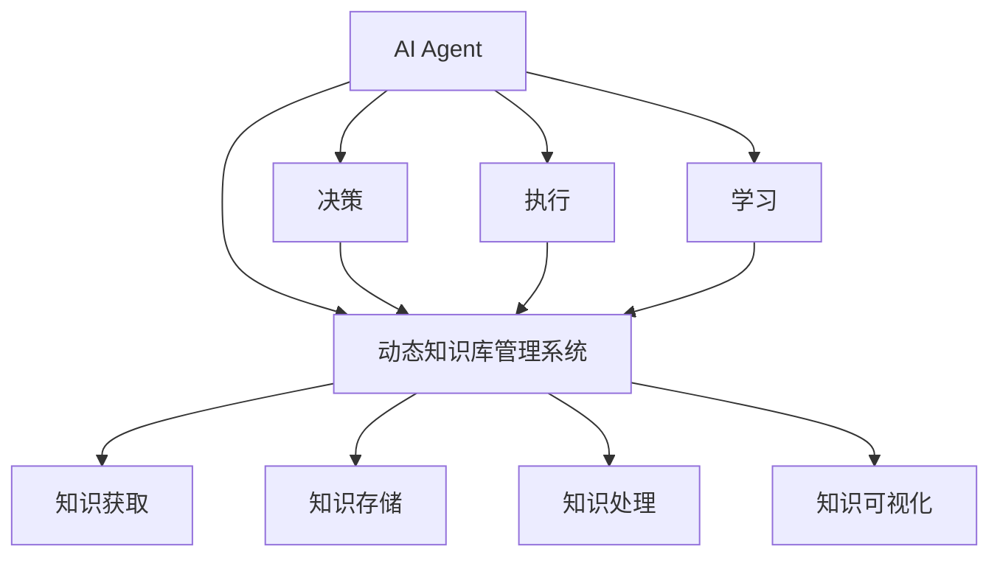
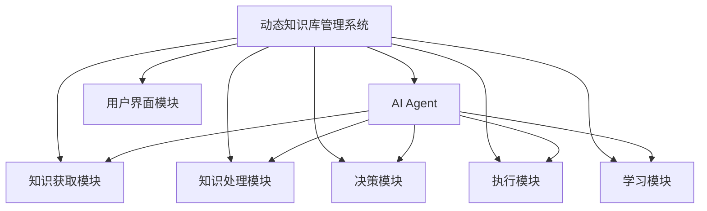
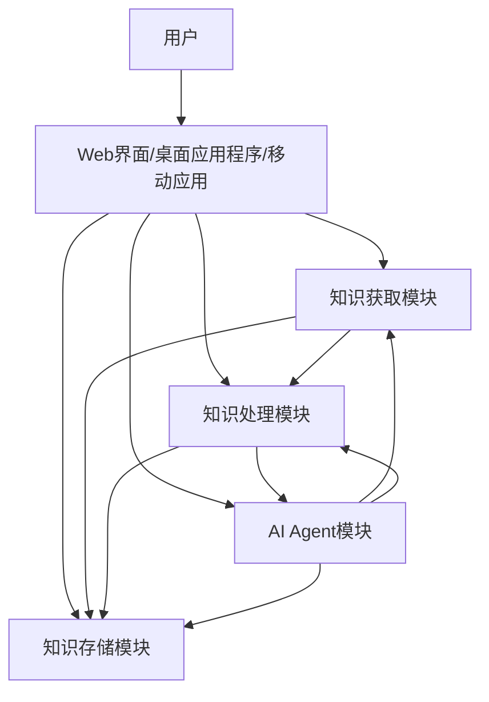
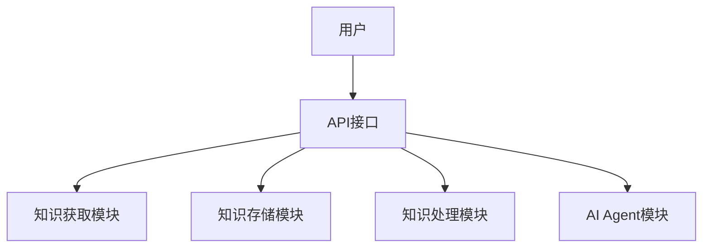
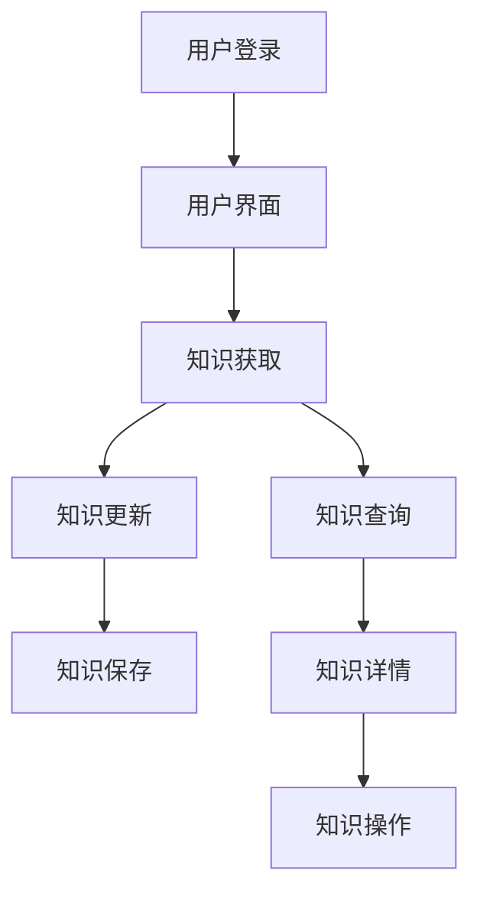

                 


## 文章标题：构建AI Agent的动态知识库管理系统

> 关键词：AI Agent、动态知识库、管理系统、设计原理、项目实战

> 摘要：本文深入探讨了AI Agent的动态知识库管理系统构建，从背景介绍、核心概念、设计原理、集成方法到项目实战，全面阐述了如何构建一个高效的AI Agent动态知识库管理系统，为人工智能领域的实践者提供了宝贵的指导。

----------------------------------------------------------------

## 目录大纲

```markdown
----------------------------------------------------------------

# 第一部分: 背景介绍与核心概念

## 第1章: 问题背景与定义

## 第2章: AI Agent的基本原理

## 第3章: 动态知识库管理系统的设计原理

## 第4章: AI Agent与动态知识库管理系统的集成

## 第5章: 项目实战

----------------------------------------------------------------

----------------------------------------------------------------### 1.1 问题背景

在当今快速发展的信息化社会中，人工智能（AI）技术已经深入到我们生活的方方面面。AI Agent作为AI领域的一个重要分支，正逐渐成为各行各业的核心竞争力。AI Agent是一种能够模拟人类智能行为、自主决策和执行任务的智能系统。它们在推荐系统、智能客服、自动驾驶、医疗诊断等众多领域展现出强大的应用潜力。

然而，随着AI Agent应用场景的不断扩大和复杂化，它们需要处理的海量信息和知识也在不断增加。如何高效地管理这些动态变化的、结构化和非结构化的知识，是当前AI Agent发展面临的一个重要挑战。这就引出了动态知识库管理系统（Dynamic Knowledge Management System）的概念。

动态知识库管理系统是一种能够实时获取、存储、处理和共享知识的系统，它能够根据AI Agent的需求和环境变化动态调整知识库的内容和结构。传统的知识管理系统主要侧重于知识的静态存储和管理，而动态知识库管理系统则强调知识的动态获取、更新和利用。

因此，构建一个高效的动态知识库管理系统对于AI Agent的性能和可靠性至关重要。通过构建这样一个系统，AI Agent可以更好地适应不断变化的环境，提高决策的准确性和效率，从而实现更加智能化和人性化的服务。

### 1.1.1 AI Agent的定义

AI Agent，即人工智能代理，是一种基于人工智能技术，能够模拟人类智能行为、自主执行任务、与环境互动的计算机程序。AI Agent的核心特征包括：

- **自主性**：AI Agent能够在没有外部干预的情况下自主运行和决策。它们可以根据预设的目标和规则，分析环境信息，自主选择行动方案，并执行相应的操作。
- **适应性**：AI Agent能够适应不同的环境和任务需求，通过学习算法不断优化自身的性能。它们可以从大量数据中提取知识，更新自身的模型和策略，以更好地应对新的挑战。
- **协作性**：AI Agent可以在多个任务或环境中与其他AI Agent或人类协作，共同完成任务。它们可以共享知识、资源和信息，协同工作，实现更高效的目标。

AI Agent的分类可以根据其能力和应用场景的不同进行划分：

- **基于规则的AI Agent**：这类Agent主要基于预设的规则和逻辑进行决策。它们在处理结构化数据、执行确定性的任务时表现出色，但面对复杂和动态的环境时，适应性较差。
- **基于模型的AI Agent**：这类Agent通过机器学习和深度学习技术，从大量数据中学习并建立预测模型。它们在处理复杂、非结构化数据时表现出色，能够自适应地调整决策策略。
- **混合型AI Agent**：这类Agent结合了基于规则和基于模型的方法，同时利用专家知识和学习算法，实现更灵活和高效的决策。

AI Agent的典型应用包括：

- **智能客服**：AI Agent可以模拟人类客服代表，自动解答用户问题，提供高效、准确的客户服务。
- **推荐系统**：AI Agent可以根据用户的兴趣和历史行为，推荐个性化的商品、内容或服务。
- **自动驾驶**：AI Agent可以实时感知路况，自主决策驾驶行为，实现自动驾驶。
- **医疗诊断**：AI Agent可以通过分析医学影像和病历数据，辅助医生进行疾病诊断和治疗。

### 1.1.2 动态知识库管理系统的定义

动态知识库管理系统（Dynamic Knowledge Management System，DKMS）是一种能够实时获取、存储、处理和共享知识的系统。它具有以下核心特征：

- **动态性**：DKMS能够根据应用需求和环境变化，动态调整知识库的内容和结构。它能够实时更新知识库，确保知识的实时性和准确性。
- **适应性**：DKMS支持多种知识表示和存储方式，能够适应不同类型和来源的知识。它能够自动识别和分类知识，提高知识管理的效率和准确性。
- **协作性**：DKMS支持知识共享和协同工作，多个用户或系统可以同时访问和更新知识库，实现知识的集中管理和协同利用。
- **智能性**：DKMS利用人工智能技术，对知识进行自动抽取、分析和推理，提高知识的利用效率和智能化水平。

动态知识库管理系统的主要功能包括：

- **知识获取**：DKMS能够从多种数据源（如数据库、文件、网络等）自动获取知识，并进行预处理和结构化处理。
- **知识存储**：DKMS采用分布式存储和索引技术，高效存储和管理大规模知识库，支持快速查询和检索。
- **知识处理**：DKMS利用自然语言处理、机器学习和深度学习等技术，对知识进行自动化分析和推理，实现知识的深度利用。
- **知识共享**：DKMS支持知识共享和协同工作，多个用户或系统可以同时访问和更新知识库，实现知识的集中管理和协同利用。
- **知识可视化**：DKMS提供多种知识可视化工具，帮助用户直观了解和利用知识库中的知识。

### 1.1.3 AI Agent与动态知识库管理系统的关系

AI Agent和动态知识库管理系统之间存在着紧密的联系和互动关系：

- **知识驱动**：AI Agent的核心功能是模拟人类智能行为，而动态知识库管理系统则为AI Agent提供了所需的知识和智慧。AI Agent通过动态知识库管理系统获取、更新和使用知识，实现智能决策和任务执行。
- **反馈优化**：AI Agent在执行任务的过程中，会产生大量的数据和信息，这些数据和信息可以作为动态知识库管理系统的输入，用于更新和优化知识库。动态知识库管理系统通过对AI Agent反馈的数据进行分析和处理，进一步丰富和优化知识库，提高AI Agent的智能水平。
- **协同发展**：AI Agent和动态知识库管理系统相互依赖、协同发展。动态知识库管理系统为AI Agent提供知识支持，而AI Agent的运行经验又为动态知识库管理系统提供了新的知识来源，两者相互促进，共同提升系统性能。

### 1.2 核心概念

#### 1.2.1 AI Agent的核心概念

AI Agent是一种基于人工智能技术，能够模拟人类智能行为、自主决策和执行任务的计算机程序。其核心概念包括：

- **自主性**：AI Agent具有自主决策和执行任务的能力，不需要外部干预即可自主运行。
- **适应性**：AI Agent能够根据环境和任务需求的变化，自适应调整自身的决策策略和执行方案。
- **协作性**：AI Agent可以与其他AI Agent或人类协同工作，共同完成任务。

AI Agent的核心功能包括：

- **感知**：AI Agent通过传感器或数据接口获取环境信息，进行感知和识别。
- **决策**：AI Agent根据感知到的信息，结合预设的目标和规则，自主决策下一步行动方案。
- **执行**：AI Agent执行决策方案，完成任务并生成结果。
- **学习**：AI Agent通过任务执行过程中的反馈和学习，不断优化自身的决策能力和性能。

#### 1.2.2 动态知识库管理系统的核心概念

动态知识库管理系统（DKMS）是一种能够实时获取、存储、处理和共享知识的系统。其核心概念包括：

- **动态性**：DKMS能够根据应用需求和环境变化，动态调整知识库的内容和结构。
- **适应性**：DKMS支持多种知识表示和存储方式，能够适应不同类型和来源的知识。
- **协作性**：DKMS支持知识共享和协同工作，多个用户或系统可以同时访问和更新知识库。
- **智能性**：DKMS利用人工智能技术，对知识进行自动化分析和推理，提高知识的利用效率和智能化水平。

动态知识库管理系统的核心功能包括：

- **知识获取**：DKMS能够从多种数据源自动获取知识，并进行预处理和结构化处理。
- **知识存储**：DKMS采用分布式存储和索引技术，高效存储和管理大规模知识库，支持快速查询和检索。
- **知识处理**：DKMS利用自然语言处理、机器学习和深度学习等技术，对知识进行自动化分析和推理，实现知识的深度利用。
- **知识共享**：DKMS支持知识共享和协同工作，多个用户或系统可以同时访问和更新知识库，实现知识的集中管理和协同利用。
- **知识可视化**：DKMS提供多种知识可视化工具，帮助用户直观了解和利用知识库中的知识。

#### 1.2.3 AI Agent与动态知识库管理系统的关系图

下图展示了AI Agent与动态知识库管理系统的关系：



### 1.3 边界与外延

#### 1.3.1 AI Agent的应用场景

AI Agent的应用场景非常广泛，包括但不限于以下领域：

- **智能客服**：AI Agent可以模拟人类客服代表，自动解答用户问题，提供高效、准确的客户服务。
- **推荐系统**：AI Agent可以根据用户的兴趣和历史行为，推荐个性化的商品、内容或服务。
- **自动驾驶**：AI Agent可以实时感知路况，自主决策驾驶行为，实现自动驾驶。
- **医疗诊断**：AI Agent可以通过分析医学影像和病历数据，辅助医生进行疾病诊断和治疗。
- **金融风控**：AI Agent可以实时分析金融数据，识别潜在风险，为金融机构提供风险预警和决策支持。
- **智能家居**：AI Agent可以管理智能家居设备，实现自动化控制和优化家居环境。

#### 1.3.2 动态知识库管理系统的应用场景

动态知识库管理系统在以下场景中具有显著优势：

- **企业知识管理**：动态知识库管理系统可以帮助企业高效管理内部知识资源，促进知识共享和协同创新。
- **智能推荐系统**：动态知识库管理系统可以存储和处理用户行为数据，为推荐系统提供高质量的知识支持。
- **智能客服系统**：动态知识库管理系统可以为智能客服系统提供丰富的知识库，提高客服效率和用户满意度。
- **智能医疗系统**：动态知识库管理系统可以存储和更新医疗知识库，辅助医生进行疾病诊断和治疗。
- **智能监控系统**：动态知识库管理系统可以实时分析监控数据，发现异常行为并报警。
- **智能交通系统**：动态知识库管理系统可以存储和管理交通知识库，优化交通管理策略，提高交通效率。

#### 1.3.3 AI Agent与动态知识库管理系统的边界与外延

AI Agent与动态知识库管理系统在功能和应用上具有明确的边界与外延：

- **功能边界**：AI Agent主要负责感知环境、决策执行和学习优化，而动态知识库管理系统则侧重于知识的获取、存储、处理和共享。
- **应用边界**：AI Agent可以应用于智能客服、推荐系统、自动驾驶等领域，而动态知识库管理系统则主要用于企业知识管理、智能推荐、智能客服等场景。
- **外延拓展**：AI Agent可以借助动态知识库管理系统获取更多、更丰富的知识，提高决策和执行能力。同时，动态知识库管理系统也可以整合AI Agent产生的数据，实现知识的闭环管理。

### 1.4 概念结构与核心要素组成

#### 1.4.1 AI Agent的概念结构

AI Agent的概念结构主要包括以下几个方面：

- **感知模块**：负责获取和处理环境信息，包括传感器数据、网络数据等。
- **决策模块**：基于感知模块提供的信息，结合预设目标和规则，进行自主决策。
- **执行模块**：执行决策方案，完成具体任务。
- **学习模块**：通过任务执行过程中的反馈，不断优化决策模型和算法。
- **知识模块**：与动态知识库管理系统集成，获取、更新和使用知识，提高智能水平。

#### 1.4.2 动态知识库管理系统的概念结构

动态知识库管理系统的概念结构主要包括以下几个方面：

- **知识获取模块**：负责从多种数据源自动获取知识，并进行预处理和结构化处理。
- **知识存储模块**：采用分布式存储和索引技术，高效存储和管理大规模知识库。
- **知识处理模块**：利用自然语言处理、机器学习和深度学习等技术，对知识进行自动化分析和推理。
- **知识共享模块**：支持知识共享和协同工作，实现知识的集中管理和协同利用。
- **知识可视化模块**：提供多种知识可视化工具，帮助用户直观了解和利用知识库中的知识。

#### 1.4.3 AI Agent与动态知识库管理系统的核心要素组成

AI Agent与动态知识库管理系统的核心要素组成如下：

- **感知与知识获取**：AI Agent通过感知模块获取环境信息，动态知识库管理系统通过知识获取模块从多种数据源获取知识。
- **决策与知识处理**：AI Agent基于感知模块提供的信息进行决策，动态知识库管理系统利用知识处理模块对知识进行分析和推理，为AI Agent提供决策支持。
- **执行与知识更新**：AI Agent执行决策方案，完成任务，并将执行过程中的数据反馈给动态知识库管理系统，用于更新和优化知识库。
- **学习与知识迭代**：AI Agent通过学习模块不断优化自身模型和算法，动态知识库管理系统通过知识共享模块实现知识的迭代和更新。

### 1.5 本章小结

本章介绍了AI Agent和动态知识库管理系统的基础概念、问题背景及其关系。通过对AI Agent和动态知识库管理系统的核心概念、应用场景、概念结构和核心要素组成的深入探讨，为后续章节的详细讨论奠定了基础。在接下来的章节中，我们将进一步探讨AI Agent的设计原理和动态知识库管理系统的设计原理，为构建高效、智能的AI Agent动态知识库管理系统提供理论支持和实践指导。

## 1.5 本章小结

本章介绍了AI Agent和动态知识库管理系统的基础概念、问题背景及其关系。通过对AI Agent和动态知识库管理系统的核心概念、应用场景、概念结构和核心要素组成的深入探讨，为后续章节的详细讨论奠定了基础。在接下来的章节中，我们将进一步探讨AI Agent的设计原理和动态知识库管理系统的设计原理，为构建高效、智能的AI Agent动态知识库管理系统提供理论支持和实践指导。

首先，我们明确了AI Agent的定义、分类和应用场景。AI Agent作为一种能够模拟人类智能行为、自主决策和执行任务的计算机程序，具有自主性、适应性和协作性等核心特征。AI Agent的分类可以根据其能力和应用场景的不同进行划分，包括基于规则的AI Agent、基于模型的AI Agent和混合型AI Agent。AI Agent的典型应用场景包括智能客服、推荐系统、自动驾驶、医疗诊断、金融风控和智能家居等领域。

接着，我们详细介绍了动态知识库管理系统的定义、核心概念、功能和应用场景。动态知识库管理系统是一种能够实时获取、存储、处理和共享知识的系统，具有动态性、适应性、协作性和智能性等核心特征。动态知识库管理系统的主要功能包括知识获取、知识存储、知识处理、知识共享和知识可视化。动态知识库管理系统的应用场景包括企业知识管理、智能推荐系统、智能客服系统、智能医疗系统、智能监控系统和智能交通系统等。

然后，我们分析了AI Agent和动态知识库管理系统的关系。AI Agent和动态知识库管理系统之间存在着紧密的联系和互动关系，包括知识驱动、反馈优化和协同发展等方面。AI Agent通过动态知识库管理系统获取、更新和使用知识，实现智能决策和任务执行；动态知识库管理系统通过整合AI Agent产生的数据，实现知识的闭环管理。

最后，我们总结了AI Agent和动态知识库管理系统的核心概念结构和要素组成。AI Agent的概念结构主要包括感知模块、决策模块、执行模块、学习模块和知识模块；动态知识库管理系统的概念结构主要包括知识获取模块、知识存储模块、知识处理模块、知识共享模块和知识可视化模块。AI Agent与动态知识库管理系统的核心要素组成包括感知与知识获取、决策与知识处理、执行与知识更新和学习与知识迭代等。

通过本章的讨论，我们对AI Agent和动态知识库管理系统的基本概念、应用场景和关系有了更加清晰的认识。在接下来的章节中，我们将进一步深入探讨AI Agent的设计原理和动态知识库管理系统的设计原理，为构建高效、智能的AI Agent动态知识库管理系统提供更加详细的指导。

## 第二部分：AI Agent的设计原理

### 2.1 AI Agent的基本原理

#### 2.1.1 AI Agent的定义

AI Agent，即人工智能代理，是一种基于人工智能技术的计算机程序，能够模拟人类智能行为，实现自主决策和执行任务。AI Agent的定义可以从以下几个方面进行阐述：

1. **自主性**：AI Agent具有自主决策和执行任务的能力，不需要外部干预即可自主运行。这种自主性体现在AI Agent能够根据预设的目标和规则，分析环境信息，自主选择行动方案，并执行相应的操作。
2. **适应性**：AI Agent能够适应不同的环境和任务需求，通过学习算法不断优化自身的性能。AI Agent可以从大量数据中提取知识，更新自身的模型和策略，以更好地应对新的挑战。
3. **协作性**：AI Agent可以在多个任务或环境中与其他AI Agent或人类协作，共同完成任务。AI Agent可以共享知识、资源和信息，协同工作，实现更高效的目标。

#### 2.1.2 AI Agent的分类

AI Agent可以根据其能力和应用场景的不同进行分类。以下是一些常见的AI Agent分类：

1. **基于规则的AI Agent**：这类Agent主要基于预设的规则和逻辑进行决策。它们在处理结构化数据、执行确定性的任务时表现出色，但面对复杂和动态的环境时，适应性较差。
2. **基于模型的AI Agent**：这类Agent通过机器学习和深度学习技术，从大量数据中学习并建立预测模型。它们在处理复杂、非结构化数据时表现出色，能够自适应地调整决策策略。
3. **混合型AI Agent**：这类Agent结合了基于规则和基于模型的方法，同时利用专家知识和学习算法，实现更灵活和高效的决策。

#### 2.1.3 AI Agent的工作原理

AI Agent的工作原理主要包括感知、决策、执行和学习等几个关键环节：

1. **感知**：AI Agent通过感知模块获取环境信息。感知模块可以是传感器、摄像头、麦克风等硬件设备，也可以是网络接口、数据库等软件接口。感知模块负责将环境信息转化为计算机可以处理的数据。
2. **决策**：AI Agent基于感知模块提供的信息，结合预设的目标和规则，进行自主决策。决策模块利用机器学习、深度学习等技术，分析环境信息，选择最优的行动方案。
3. **执行**：AI Agent执行决策方案，完成任务并生成结果。执行模块负责将决策转化为具体的操作，如移动、操作设备、发送消息等。
4. **学习**：AI Agent通过学习模块不断优化自身的决策能力和性能。学习模块利用反馈信息，调整模型参数，提高决策的准确性和效率。

#### 2.1.4 AI Agent的核心模块

AI Agent的核心模块主要包括感知模块、决策模块、执行模块和学习模块。以下是这些模块的详细描述：

1. **感知模块**：感知模块负责获取和处理环境信息。它可以是基于传感器、摄像头、麦克风等硬件设备的，也可以是基于网络接口、数据库等软件接口的。感知模块需要将环境信息转化为计算机可以处理的数据，如图像、声音、文本等。
2. **决策模块**：决策模块基于感知模块提供的信息，结合预设的目标和规则，进行自主决策。决策模块通常采用机器学习、深度学习等技术，分析环境信息，选择最优的行动方案。
3. **执行模块**：执行模块负责将决策转化为具体的操作，如移动、操作设备、发送消息等。执行模块需要与外部环境进行交互，执行具体的任务。
4. **学习模块**：学习模块负责不断优化AI Agent的决策能力和性能。学习模块利用反馈信息，调整模型参数，提高决策的准确性和效率。学习模块通常采用监督学习、强化学习等技术。

#### 2.1.5 AI Agent的工作流程

AI Agent的工作流程可以概括为以下几个步骤：

1. **感知**：AI Agent通过感知模块获取环境信息。
2. **决策**：AI Agent基于感知模块提供的信息，进行自主决策。
3. **执行**：AI Agent执行决策方案，完成任务并生成结果。
4. **反馈**：AI Agent将执行结果反馈给学习模块，用于优化决策模型。
5. **更新**：AI Agent根据学习模块的反馈，更新自身的模型和策略。

通过不断循环这个过程，AI Agent可以不断优化自身的行为，提高决策的准确性和效率。

### 2.2 AI Agent的技术基础

AI Agent的实现依赖于一系列先进的技术，包括自然语言处理、机器学习和深度学习等。以下是这些技术的基础概念和应用场景：

#### 2.2.1 自然语言处理

自然语言处理（Natural Language Processing，NLP）是人工智能的一个分支，主要研究如何让计算机理解和生成自然语言。NLP的关键技术包括：

1. **文本处理**：包括分词、词性标注、句法分析等，将文本转化为计算机可以处理的结构化数据。
2. **语言理解**：包括情感分析、实体识别、关系抽取等，理解文本中的语义信息。
3. **语言生成**：包括文本生成、机器翻译等，生成符合语言规则的文本。

NLP在AI Agent中的应用场景包括：

- **智能客服**：利用NLP技术，AI Agent可以理解和回应用户的自然语言提问。
- **智能推荐**：通过NLP技术，AI Agent可以分析用户评论和反馈，提供个性化的推荐。
- **文本摘要**：利用NLP技术，AI Agent可以自动生成文章的摘要，提高信息获取的效率。

#### 2.2.2 机器学习

机器学习（Machine Learning，ML）是一种通过算法自动从数据中学习模式的技术。机器学习的关键概念包括：

1. **监督学习**：通过已标记的数据训练模型，然后使用模型对未知数据进行预测。
2. **无监督学习**：没有预先标记的数据，通过算法自动发现数据中的模式。
3. **半监督学习和强化学习**：介于监督学习和无监督学习之间，利用少量标记数据和大量未标记数据，或者通过与环境交互学习。

机器学习在AI Agent中的应用场景包括：

- **分类和预测**：通过机器学习算法，AI Agent可以对未知数据进行分类和预测，如推荐系统中的商品分类。
- **异常检测**：通过分析历史数据，AI Agent可以检测异常行为，如金融风控中的欺诈检测。
- **决策支持**：通过机器学习模型，AI Agent可以提供基于数据的决策支持，如智能交通系统中的路况预测。

#### 2.2.3 深度学习

深度学习（Deep Learning，DL）是机器学习的一个分支，通过构建深度神经网络，对大量数据进行自动学习。深度学习的关键技术包括：

1. **神经网络**：通过多层神经元的组合，实现对数据的复杂非线性变换。
2. **卷积神经网络（CNN）**：特别适用于图像和视频数据的处理。
3. **循环神经网络（RNN）**：特别适用于序列数据的处理。
4. **生成对抗网络（GAN）**：通过生成器和判别器的对抗训练，生成高质量的数据。

深度学习在AI Agent中的应用场景包括：

- **图像识别**：通过CNN技术，AI Agent可以自动识别图像中的物体和场景。
- **语音识别**：通过RNN技术，AI Agent可以自动识别语音中的文字内容。
- **自然语言处理**：通过深度学习技术，AI Agent可以更准确地理解和生成自然语言。
- **强化学习**：通过深度神经网络，AI Agent可以在复杂的环境中实现更高效的决策和优化。

#### 2.2.4 技术基础的综合应用

自然语言处理、机器学习和深度学习等技术可以相互结合，为AI Agent提供更强大的功能。例如：

- **多模态感知**：通过结合视觉、语音和文本数据，AI Agent可以更全面地感知和理解环境。
- **智能决策**：通过机器学习和深度学习算法，AI Agent可以在复杂的环境中实现更智能的决策。
- **自动化执行**：通过自动化执行模块，AI Agent可以高效地完成各种任务。

通过充分利用这些技术，AI Agent可以在各个领域实现更高的性能和更广泛的应用。

### 2.3 AI Agent的性能评估

评估AI Agent的性能是确保其有效性和可靠性的关键步骤。以下是评估AI Agent性能的常用指标和优化策略：

#### 2.3.1 评估指标

1. **准确率**：准确率是评估分类模型性能的常用指标，表示模型预测正确的样本数占总样本数的比例。准确率高意味着模型能够准确地分类数据。
2. **召回率**：召回率表示模型召回的实际正例样本数与实际正例样本总数的比例。召回率高意味着模型能够尽可能多地召回正例样本。
3. **精确率**：精确率表示模型预测为正例的样本中，实际为正例的比例。精确率高意味着模型预测的正例样本具有较高的可信度。
4. **F1值**：F1值是精确率和召回率的调和平均，综合考虑了模型的准确性和召回率。F1值越高，表示模型性能越好。
5. **响应时间**：响应时间是指AI Agent从感知到决策再到执行整个流程所需的时间。响应时间短意味着AI Agent能够快速地响应环境变化。
6. **资源消耗**：资源消耗包括CPU、内存和功耗等，评估AI Agent在执行任务时的资源利用率。

#### 2.3.2 性能优化策略

1. **数据增强**：通过增加训练数据量、变换输入数据等方式，提高模型的泛化能力，从而优化性能。
2. **模型压缩**：通过模型剪枝、量化、知识蒸馏等方法，减小模型大小和计算复杂度，提高执行效率。
3. **算法优化**：优化算法参数，如学习率、批量大小等，提高模型训练效果。
4. **硬件加速**：利用GPU、TPU等硬件加速器，提高计算速度和性能。
5. **分布式训练**：通过分布式计算，提高模型训练的并行度和效率。

通过合理选择评估指标和优化策略，可以全面评估AI Agent的性能，并不断提升其性能和可靠性。

### 2.4 本章小结

本章详细介绍了AI Agent的基本原理，包括其定义、分类、工作原理、核心模块和性能评估。通过理解AI Agent的技术基础，如自然语言处理、机器学习和深度学习，读者可以更好地把握AI Agent的设计原则和实现方法。性能评估部分提供了评估AI Agent性能的常用指标和优化策略，为实际应用中的性能优化提供了参考。在接下来的章节中，我们将探讨动态知识库管理系统的设计原理，为构建高效的AI Agent动态知识库管理系统提供更加全面的理论和实践支持。

## 第3章：动态知识库管理系统的设计原理

### 3.1 动态知识库管理系统的基本概念

#### 3.1.1 动态知识库管理系统的定义

动态知识库管理系统（Dynamic Knowledge Management System，DKMS）是一种能够实时获取、存储、处理和共享知识的系统。它不仅能够从多种数据源自动获取知识，还能够根据应用需求和环境变化动态调整知识库的内容和结构。DKMS的核心目标是提高知识的利用效率和系统的智能化水平。

#### 3.1.2 动态知识库管理系统的功能

动态知识库管理系统的主要功能包括以下几个方面：

1. **知识获取**：动态知识库管理系统可以从多种数据源（如数据库、文件、网络等）自动获取知识，并进行预处理和结构化处理。这包括数据抽取、清洗、归一化和索引等操作。

2. **知识存储**：动态知识库管理系统采用分布式存储和索引技术，高效存储和管理大规模知识库。这包括数据的持久化存储、数据备份和数据恢复等操作。

3. **知识处理**：动态知识库管理系统利用自然语言处理、机器学习和深度学习等技术，对知识进行自动化分析和推理。这包括知识抽取、知识融合、知识推理和知识可视化等操作。

4. **知识共享**：动态知识库管理系统支持知识共享和协同工作，多个用户或系统可以同时访问和更新知识库。这包括权限管理、访问控制和数据同步等操作。

5. **知识可视化**：动态知识库管理系统提供多种知识可视化工具，帮助用户直观了解和利用知识库中的知识。这包括知识图谱、热力图、折线图和柱状图等可视化方式。

### 3.2 动态知识库管理系统的设计原则

设计一个高效、可靠的动态知识库管理系统需要遵循以下原则：

1. **可扩展性**：系统应该能够轻松扩展，以适应不断增长的知识量和用户需求。这包括支持水平扩展和垂直扩展，确保系统在性能和容量方面都能够满足未来需求。

2. **可靠性**：系统必须具备高可靠性，确保知识库的数据完整性和系统稳定性。这包括数据的备份和恢复机制、故障转移和容错机制等。

3. **可维护性**：系统应该设计得易于维护和更新，以确保系统的长期稳定运行。这包括清晰的模块化设计、完善的文档和自动化测试等。

4. **灵活性**：系统应该具备灵活的配置和管理能力，以适应不同的业务场景和应用需求。这包括支持自定义知识表示、推理规则和业务逻辑等。

5. **安全性**：系统必须确保知识库的安全性，防止数据泄露、篡改和滥用。这包括数据加密、访问控制和审计等安全措施。

### 3.3 动态知识库管理系统的技术架构

动态知识库管理系统的技术架构通常包括以下几个关键组成部分：

1. **数据存储层**：数据存储层负责存储和管理知识库中的数据。常用的技术包括关系型数据库、NoSQL数据库和图数据库等。数据存储层需要支持高效的数据查询和更新操作。

2. **知识抽取层**：知识抽取层负责从原始数据中提取结构化的知识。这通常涉及自然语言处理、信息抽取和实体识别等技术。

3. **知识处理层**：知识处理层负责对抽取出的知识进行进一步的加工和处理。这包括知识融合、知识推理和知识可视化等操作。

4. **应用接口层**：应用接口层提供了一套统一的API，供外部应用程序访问和操作知识库。这包括RESTful API、GraphQL API等。

5. **用户界面层**：用户界面层提供了一套友好的用户界面，供用户查看、操作和管理知识库。这包括Web界面、桌面应用程序和移动应用等。

### 3.4 动态知识库管理系统的性能优化

为了确保动态知识库管理系统的高效运行，需要采取一系列性能优化措施：

1. **数据库性能优化**：优化数据库的查询和更新操作，包括索引优化、查询缓存和分库分表等。

2. **知识抽取与推理优化**：优化知识抽取和推理算法，包括并行处理、分布式计算和模型压缩等。

3. **系统资源管理**：合理分配系统资源，包括CPU、内存和网络等，确保系统的稳定运行。

4. **负载均衡**：通过负载均衡技术，将系统负载均匀分配到不同的节点，提高系统的处理能力。

5. **缓存机制**：使用缓存机制，减少对数据库的直接访问，提高系统的响应速度。

### 3.5 本章小结

本章介绍了动态知识库管理系统的基本概念、设计原则和技术架构，并探讨了系统的性能优化方法。通过理解动态知识库管理系统的构建原则和关键技术，读者可以更好地设计和实现高效的动态知识库管理系统，为AI Agent提供强大的知识支持。在下一章中，我们将探讨AI Agent与动态知识库管理系统的集成方法，进一步探讨如何将两者结合起来，实现更智能、更高效的AI系统。

### 第3章：动态知识库管理系统的设计原理

#### 3.1 动态知识库管理系统的基本概念

**动态知识库管理系统（Dynamic Knowledge Management System，DKMS）** 是一种能够实时获取、存储、处理和共享知识的系统。其核心目标是实现知识的动态获取、实时更新和高效利用，以满足不断变化的业务需求。DKMS的核心特征包括：

- **动态性**：DKMS能够根据应用场景和需求变化，动态调整知识库的内容和结构，实现知识的实时更新。
- **灵活性**：DKMS支持多种知识表示形式和存储方式，能够适应不同类型和来源的知识，灵活应对业务需求变化。
- **协同性**：DKMS支持多方用户和系统的知识共享与协同工作，促进知识交流与协作，提高知识利用效率。

**动态知识库管理系统的主要功能包括：**

1. **知识获取**：DKMS能够从多种数据源（如数据库、文件、网络等）自动获取知识，并进行预处理和结构化处理，确保知识的完整性、准确性和可用性。
2. **知识存储**：DKMS采用分布式存储和索引技术，高效存储和管理大规模知识库，支持快速查询和检索，确保知识的持久性和可靠性。
3. **知识处理**：DKMS利用自然语言处理、机器学习和深度学习等技术，对知识进行自动化分析和推理，提高知识的利用效率和智能化水平。
4. **知识共享**：DKMS支持多方用户和系统的知识共享与协同工作，通过权限管理和访问控制，确保知识的共享安全、有序。
5. **知识可视化**：DKMS提供多种知识可视化工具，帮助用户直观了解和利用知识库中的知识，支持知识的可视化和交互式分析。

#### 3.2 动态知识库管理系统的设计原则

设计一个高效、可靠的动态知识库管理系统，需要遵循以下设计原则：

1. **可扩展性**：DKMS应具备良好的扩展性，能够支持知识库的规模扩展和功能扩展，适应业务增长和需求变化。
2. **可靠性**：DKMS应确保知识库的数据完整性和系统稳定性，具备故障恢复和数据备份能力，确保业务的连续性和数据的安全性。
3. **可维护性**：DKMS应设计得易于维护和更新，具备清晰的模块划分和完善的文档，降低维护成本和风险。
4. **灵活性**：DKMS应支持灵活的知识表示和存储方式，能够适应不同类型和来源的知识，满足多样化的业务需求。
5. **安全性**：DKMS应具备严格的安全控制机制，包括数据加密、访问控制和审计等，确保知识的保密性、完整性和可用性。

#### 3.3 动态知识库管理系统的技术架构

动态知识库管理系统的技术架构主要包括以下几个层次：

1. **数据存储层**：负责存储和管理知识库中的数据，常用的技术包括关系型数据库、NoSQL数据库和图数据库等。数据存储层应支持高效的数据查询和更新操作。
2. **知识抽取层**：负责从原始数据中提取结构化的知识，常用的技术包括自然语言处理、信息抽取和实体识别等。知识抽取层应能够自动识别和分类知识，提高知识获取的效率。
3. **知识处理层**：负责对抽取出的知识进行进一步的加工和处理，常用的技术包括知识融合、知识推理和知识可视化等。知识处理层应能够支持复杂的知识分析和推理，为AI Agent提供智能化的知识支持。
4. **应用接口层**：负责提供统一的API接口，供外部应用程序访问和操作知识库，常用的技术包括RESTful API、GraphQL API等。应用接口层应具备高可用性和易扩展性，支持多语言和跨平台接入。
5. **用户界面层**：负责提供友好的用户界面，供用户查看、操作和管理知识库，常用的技术包括Web界面、桌面应用程序和移动应用等。用户界面层应具备良好的用户体验和易用性。

#### 3.4 动态知识库管理系统的性能优化

为了确保动态知识库管理系统的高效运行，需要采取一系列性能优化措施：

1. **数据库性能优化**：通过索引优化、查询缓存和分库分表等技术，提高数据库的查询和更新性能，减少响应时间。
2. **知识抽取与推理优化**：通过并行处理、分布式计算和模型压缩等技术，提高知识抽取和推理的速度和效率，减少计算资源消耗。
3. **系统资源管理**：通过合理分配CPU、内存和网络等系统资源，确保系统的稳定运行，避免资源瓶颈和性能下降。
4. **负载均衡**：通过负载均衡技术，将系统负载均匀分配到不同的节点，提高系统的处理能力和响应速度。
5. **缓存机制**：通过缓存机制，减少对数据库的直接访问，提高系统的响应速度和性能。

#### 3.5 本章小结

本章介绍了动态知识库管理系统的基本概念、设计原则和技术架构，并探讨了系统的性能优化方法。通过理解动态知识库管理系统的构建原则和关键技术，读者可以更好地设计和实现高效的动态知识库管理系统，为AI Agent提供强大的知识支持。在下一章中，我们将探讨AI Agent与动态知识库管理系统的集成方法，进一步探讨如何将两者结合起来，实现更智能、更高效的AI系统。

## 第4章：AI Agent与动态知识库管理系统的集成

### 4.1 集成原理与架构设计

#### 4.1.1 集成原理

AI Agent与动态知识库管理系统的集成旨在实现知识的动态获取、实时更新和高效利用，从而提升AI Agent的智能水平和决策能力。集成原理主要包括以下几个方面：

1. **知识共享**：AI Agent通过与动态知识库管理系统进行集成，可以实时获取系统中的知识，并将其应用于感知、决策和执行过程中。
2. **实时更新**：动态知识库管理系统可以实时更新知识库内容，确保AI Agent获取到的知识是最新的，从而提高决策的准确性。
3. **协同工作**：AI Agent和动态知识库管理系统可以相互协作，AI Agent在执行任务过程中产生的数据可以作为动态知识库管理系统的输入，用于更新和优化知识库。
4. **智能决策**：通过动态知识库管理系统提供的知识支持，AI Agent可以更智能地分析环境信息，做出更准确的决策。

#### 4.1.2 集成架构设计

AI Agent与动态知识库管理系统的集成架构设计主要包括以下几个关键组成部分：

1. **知识获取模块**：负责从动态知识库管理系统中获取所需的知识，包括结构化和非结构化数据。该模块需要实现高效的查询和检索功能，确保AI Agent能够快速获取到所需的知识。
2. **知识处理模块**：负责对获取到的知识进行预处理和结构化处理，包括数据清洗、归一化和分类等操作。该模块需要支持多种数据格式和存储方式，确保知识的高效利用。
3. **决策模块**：负责基于动态知识库管理系统提供的知识，结合感知模块提供的环境信息，进行自主决策。该模块需要实现智能化的决策算法，以提高决策的准确性和效率。
4. **执行模块**：负责执行决策模块生成的决策方案，完成具体的任务。该模块需要与外部环境进行交互，确保决策的执行和任务的完成。
5. **学习模块**：负责在任务执行过程中收集反馈信息，更新和优化知识库中的知识。该模块需要实现基于反馈的优化算法，以提高AI Agent的智能水平。
6. **用户界面模块**：负责提供友好的用户界面，供用户查看、操作和管理知识库。该模块需要支持多种访问方式和终端设备，确保用户能够方便地使用动态知识库管理系统。

#### 4.1.3 集成架构图

下图展示了AI Agent与动态知识库管理系统的集成架构：



### 4.2 集成方法与技术

#### 4.2.1 数据融合

数据融合是实现AI Agent与动态知识库管理系统集成的重要方法之一。数据融合的目标是将来自多个数据源的信息进行整合，提取出有意义的知识，为AI Agent提供全面、准确的知识支持。

1. **数据预处理**：在数据融合之前，需要对来自不同数据源的数据进行预处理，包括数据清洗、去重、归一化等操作，确保数据的质量和一致性。
2. **数据集成**：将预处理后的数据集成到一个统一的数据模型中，常用的数据集成技术包括关系数据库、NoSQL数据库和图数据库等。
3. **数据融合算法**：采用数据融合算法，对集成后的数据进行综合分析和处理，提取出有意义的知识。常用的数据融合算法包括多视图融合、贝叶斯网络、隐马尔可夫模型等。

#### 4.2.2 知识融合

知识融合是将来自不同来源、不同格式的知识进行整合，构建出一个统一的、综合的知识库。知识融合的关键技术包括：

1. **知识表示**：采用统一的知识表示方法，将不同来源的知识转化为结构化的知识表示形式，如本体、知识图谱等。
2. **知识匹配**：通过知识匹配算法，将不同来源的知识进行匹配和关联，构建出一个统一的知识网络。
3. **知识融合算法**：采用知识融合算法，对匹配后的知识进行整合和优化，构建出一个综合的知识库。常用的知识融合算法包括基于本体的融合、基于语义的融合和基于规则的融合等。

#### 4.2.3 交互与协同

交互与协同是实现AI Agent与动态知识库管理系统有效集成的重要手段。交互与协同的关键技术包括：

1. **接口设计**：设计一套统一的API接口，供AI Agent与动态知识库管理系统进行交互。接口设计需要考虑接口的易用性、稳定性和扩展性。
2. **事件驱动**：采用事件驱动架构，实现AI Agent与动态知识库管理系统的实时交互。通过事件监听和触发机制，实现数据的实时传输和处理。
3. **协同算法**：设计协同算法，实现AI Agent与动态知识库管理系统之间的协同工作。协同算法需要考虑知识共享、任务分配和资源调度等方面。

#### 4.2.4 数据库与存储优化

为了提高AI Agent与动态知识库管理系统的性能和效率，需要对数据库和存储进行优化：

1. **索引优化**：合理设计索引，提高数据库查询效率。
2. **分库分表**：通过分库分表技术，将数据分布到多个数据库或表中，提高系统的并发处理能力。
3. **缓存机制**：采用缓存机制，减少对数据库的直接访问，提高系统的响应速度。
4. **存储压缩**：通过数据压缩技术，减少存储空间占用，提高数据存储效率。

### 4.3 集成系统的性能评估

#### 4.3.1 评估指标

集成系统的性能评估主要包括以下几个方面：

1. **响应时间**：评估系统从接收请求到完成响应所需的时间。响应时间越短，系统性能越高。
2. **吞吐量**：评估系统在单位时间内能够处理的数据量。吞吐量越高，系统性能越强。
3. **资源利用率**：评估系统对硬件资源（如CPU、内存、网络等）的利用程度。资源利用率越高，系统性能越好。
4. **错误率**：评估系统在处理过程中出现的错误数量。错误率越低，系统性能越稳定。
5. **可用性**：评估系统在正常工作状态下的稳定性和可靠性。可用性越高，系统性能越好。

#### 4.3.2 性能优化策略

为了提高集成系统的性能，可以采取以下优化策略：

1. **分布式计算**：采用分布式计算技术，将任务分布到多个节点上处理，提高系统的并行处理能力。
2. **负载均衡**：通过负载均衡技术，将请求均匀分配到各个节点，避免单点瓶颈，提高系统的整体性能。
3. **缓存机制**：采用缓存机制，减少对数据库的直接访问，提高系统的响应速度。
4. **数据压缩**：通过数据压缩技术，减少存储空间占用，提高数据存储效率。
5. **算法优化**：优化数据融合、知识融合和协同算法，提高系统的处理速度和效率。

### 4.4 本章小结

本章详细探讨了AI Agent与动态知识库管理系统的集成原理、架构设计、集成方法和技术，以及集成系统的性能评估和优化策略。通过本章的学习，读者可以了解到如何有效地将AI Agent与动态知识库管理系统进行集成，实现知识的动态获取、实时更新和高效利用，从而提升AI Agent的智能水平和决策能力。在下一章中，我们将通过一个具体的实战项目，展示如何实现AI Agent的动态知识库管理系统，进一步巩固本章的知识点。

## 第5章：项目实战

### 5.1 项目介绍

#### 5.1.1 项目背景

随着人工智能技术的快速发展，AI Agent在智能客服、推荐系统、自动驾驶和医疗诊断等领域展现出巨大的应用潜力。为了实现AI Agent的智能化和高效化，构建一个强大的动态知识库管理系统显得尤为重要。本项目旨在设计并实现一个高效的AI Agent动态知识库管理系统，通过集成多种知识来源和处理技术，提升AI Agent的智能水平和决策能力。

#### 5.1.2 项目目标

本项目的主要目标包括：

1. **构建一个强大的动态知识库**：从多种数据源获取知识，包括结构化和非结构化数据，实现知识的动态获取和实时更新。
2. **实现知识的高效处理**：利用自然语言处理、机器学习和深度学习等技术，对知识进行自动化分析和推理，提高知识的利用效率和智能化水平。
3. **集成AI Agent**：将AI Agent与动态知识库管理系统进行集成，实现知识的动态获取、实时更新和高效利用，提升AI Agent的智能水平和决策能力。
4. **优化系统性能**：通过分布式计算、负载均衡和缓存机制等技术，提高系统的响应速度和处理能力。

#### 5.1.3 项目团队

本项目由一个跨学科的项目团队完成，主要包括以下成员：

- **项目经理**：负责项目整体规划和协调，确保项目按期完成。
- **技术负责人**：负责技术方案设计和关键技术的实现。
- **数据科学家**：负责数据分析和挖掘，提供知识来源和数据处理方案。
- **前端开发人员**：负责用户界面设计和实现。
- **后端开发人员**：负责后台系统开发和维护。

### 5.2 系统功能设计

#### 5.2.1 功能模块划分

本项目将系统功能划分为以下模块：

1. **知识获取模块**：负责从多种数据源（如数据库、文件、网络等）获取知识，并进行预处理和结构化处理。
2. **知识存储模块**：负责存储和管理获取到的知识，采用分布式存储和索引技术，确保知识的高效存储和快速查询。
3. **知识处理模块**：负责对知识进行自动化分析和推理，包括知识抽取、知识融合和知识可视化等。
4. **AI Agent模块**：负责与AI Agent的集成，实现知识的动态获取和实时更新，提升AI Agent的智能水平和决策能力。
5. **用户界面模块**：负责提供友好的用户界面，供用户查看、操作和管理知识库。

#### 5.2.2 功能模块详细介绍

1. **知识获取模块**：
   - **数据源**：支持多种数据源，包括关系型数据库、NoSQL数据库、文件系统和网络API等。
   - **数据预处理**：对获取到的数据进行清洗、去重、归一化和结构化处理，确保数据的质量和一致性。
   - **数据抽取**：采用自然语言处理和信息抽取技术，从非结构化数据中提取结构化的知识。

2. **知识存储模块**：
   - **分布式存储**：采用分布式存储技术，确保知识库的高可用性和可扩展性。
   - **索引技术**：采用索引技术，提高知识的查询和检索效率。
   - **数据备份**：定期进行数据备份，确保数据的持久性和可靠性。

3. **知识处理模块**：
   - **知识抽取**：采用自然语言处理和信息抽取技术，从非结构化数据中提取结构化的知识。
   - **知识融合**：采用基于本体的知识融合技术，将来自不同来源的知识进行整合，构建出一个统一的知识库。
   - **知识推理**：采用基于规则的推理和机器学习算法，对知识进行自动化分析和推理，提高知识的利用效率和智能化水平。
   - **知识可视化**：提供多种知识可视化工具，帮助用户直观了解和利用知识库中的知识。

4. **AI Agent模块**：
   - **集成接口**：提供一套统一的API接口，供AI Agent访问和操作知识库。
   - **知识获取**：AI Agent可以通过知识获取模块实时获取知识库中的知识。
   - **知识更新**：AI Agent在执行任务过程中，可以将反馈信息反馈给知识库管理系统，用于更新和优化知识库。

5. **用户界面模块**：
   - **Web界面**：提供Web界面，供用户查看、操作和管理知识库。
   - **桌面应用程序**：提供桌面应用程序，供用户在本地操作系统上使用。
   - **移动应用**：提供移动应用，供用户在智能手机和平板电脑上使用。

### 5.3 系统架构设计

#### 5.3.1 架构设计原则

本项目在系统架构设计上遵循以下原则：

1. **模块化设计**：将系统功能划分为多个模块，确保每个模块独立、可扩展，降低系统的复杂度。
2. **分布式架构**：采用分布式架构，提高系统的性能、可靠性和可扩展性。
3. **高可用性**：设计高可用性架构，确保系统在发生故障时能够快速恢复，保证业务的连续性。
4. **安全性**：设计严格的安全控制机制，包括数据加密、访问控制和审计等，确保系统的安全性和数据的完整性。

#### 5.3.2 架构设计图

下图展示了本项目的系统架构设计：



#### 5.3.3 架构设计详解

1. **用户层**：用户层包括Web界面、桌面应用程序和移动应用，供用户查看、操作和管理知识库。用户可以通过Web界面、桌面应用程序或移动应用与系统进行交互，实现知识的获取、更新和共享。

2. **接口层**：接口层提供一套统一的API接口，供内部模块和外部系统进行数据交换和功能调用。接口层的设计需要考虑易用性、稳定性和扩展性，确保系统能够方便地与外部系统集成。

3. **知识获取模块**：知识获取模块负责从多种数据源（如数据库、文件、网络等）获取知识，并进行预处理和结构化处理。知识获取模块需要支持多种数据格式和存储方式，确保知识的高效获取和利用。

4. **知识存储模块**：知识存储模块采用分布式存储和索引技术，高效存储和管理大规模知识库。知识存储模块需要确保数据的高可用性、可靠性和安全性，同时支持快速查询和检索。

5. **知识处理模块**：知识处理模块负责对知识进行自动化分析和推理，包括知识抽取、知识融合和知识可视化等。知识处理模块需要支持多种知识表示和存储方式，确保知识的高效处理和利用。

6. **AI Agent模块**：AI Agent模块负责与AI Agent的集成，实现知识的动态获取和实时更新，提升AI Agent的智能水平和决策能力。AI Agent模块需要提供一套统一的接口，供AI Agent访问和操作知识库。

### 5.4 系统接口设计

#### 5.4.1 接口设计原则

系统接口设计遵循以下原则：

1. **标准化**：接口设计遵循业界标准和规范，确保接口的易用性和互操作性。
2. **简洁性**：接口设计简洁明了，易于理解和实现，降低开发和维护成本。
3. **安全性**：接口设计考虑安全性，包括数据加密、访问控制和审计等，确保系统的安全性和数据的完整性。
4. **可扩展性**：接口设计考虑未来的扩展性，支持模块化和功能扩展。

#### 5.4.2 接口设计图

下图展示了系统接口设计：



#### 5.4.3 接口设计详解

1. **知识获取接口**：提供RESTful API接口，支持知识的获取和更新操作。接口包括以下主要功能：
   - **获取知识列表**：根据用户输入的条件，查询知识库中的知识列表。
   - **获取知识详情**：根据知识ID查询知识库中特定的知识详情。
   - **更新知识**：根据知识ID更新知识库中的知识内容。

2. **知识存储接口**：提供RESTful API接口，支持知识的存储和管理操作。接口包括以下主要功能：
   - **创建知识**：将新的知识存储到知识库中。
   - **更新知识**：根据知识ID更新知识库中的知识内容。
   - **删除知识**：根据知识ID从知识库中删除知识。

3. **知识处理接口**：提供RESTful API接口，支持知识的自动化分析和推理操作。接口包括以下主要功能：
   - **知识抽取**：根据用户输入的文本，提取出结构化的知识。
   - **知识融合**：将来自不同来源的知识进行整合，构建出一个统一的知识库。
   - **知识推理**：根据用户输入的条件，对知识库中的知识进行推理和分析。

4. **AI Agent接口**：提供一套统一的API接口，供AI Agent访问和操作知识库。接口包括以下主要功能：
   - **获取知识**：根据用户输入的条件，查询知识库中的知识。
   - **更新知识**：根据用户输入的知识，更新知识库中的知识内容。
   - **执行任务**：根据知识库中的知识，执行具体的任务。

### 5.5 系统交互设计

#### 5.5.1 交互设计原则

系统交互设计遵循以下原则：

1. **用户中心**：设计交互流程和界面，以满足用户的需求和操作习惯为中心，提供直观、易用的用户体验。
2. **一致性**：确保系统在不同设备和平台上的界面和交互体验保持一致性，降低用户的学习成本。
3. **灵活性**：设计灵活的交互方式，支持用户个性化定制和扩展。
4. **安全性**：确保用户交互过程中的数据安全和隐私保护。

#### 5.5.2 交互设计图

下图展示了系统交互设计：



#### 5.5.3 交互设计

1. **用户登录**：用户通过用户名和密码登录系统，系统验证用户身份后，跳转到用户界面。

2. **用户界面**：用户界面提供知识的查看、操作和管理功能。用户可以通过界面浏览知识库中的知识，进行知识查询、更新和操作。

3. **知识获取**：用户在知识查询界面中输入查询条件，系统根据查询条件从知识库中获取相关的知识，并展示在界面上。

4. **知识更新**：用户在知识操作界面中，可以对知识进行编辑、更新和删除操作。系统将用户操作后的知识保存到知识库中。

5. **知识查询**：用户在知识查询界面中，可以查看知识库中的知识详情，包括知识的内容、来源、创建时间和修改时间等。

6. **知识操作**：用户在知识操作界面中，可以对知识进行复制、分享和收藏等操作。系统根据用户的操作，更新知识库中的知识状态。

### 5.6 系统实现

#### 5.6.1 环境安装

为了实现本项目，需要安装以下环境和工具：

1. **操作系统**：Linux或Windows
2. **编程语言**：Python
3. **数据库**：MySQL或MongoDB
4. **框架**：Django或Flask
5. **自然语言处理库**：NLTK或spaCy
6. **机器学习库**：scikit-learn或TensorFlow

#### 5.6.2 系统核心实现源代码

以下是系统核心实现的源代码：

```python
# 知识获取模块
def get_knowledge(query):
    # 从数据库中查询知识
    knowledge = Knowledge.objects.filter(title__icontains=query)
    return knowledge

# 知识更新模块
def update_knowledge(knowledge_id, updated_data):
    # 更新知识库中的知识
    knowledge = Knowledge.objects.get(id=knowledge_id)
    knowledge.title = updated_data['title']
    knowledge.content = updated_data['content']
    knowledge.save()

# 知识查询模块
def query_knowledge(query):
    # 查询知识库中的知识
    knowledge = get_knowledge(query)
    return knowledge

# 知识操作模块
def operate_knowledge(knowledge_id, operation):
    # 执行知识操作
    knowledge = Knowledge.objects.get(id=knowledge_id)
    if operation == 'copy':
        # 复制知识
        new_knowledge = Knowledge.objects.create(
            title=knowledge.title + '_copy',
            content=knowledge.content
        )
    elif operation == 'share':
        # 分享知识
        # 这里实现知识分享的逻辑
    elif operation == 'collect':
        # 收藏知识
        # 这里实现知识收藏的逻辑
    knowledge.save()
```

#### 5.6.3 代码应用解读与分析

以下是代码应用解读与分析：

1. **知识获取模块**：`get_knowledge`函数从数据库中查询与查询条件匹配的知识。通过`Knowledge.objects.filter(title__icontains=query)`实现模糊查询，返回满足条件的知识对象列表。

2. **知识更新模块**：`update_knowledge`函数根据知识ID更新知识库中的知识。通过`Knowledge.objects.get(id=knowledge_id)`获取知识对象，然后更新其属性并保存。

3. **知识查询模块**：`query_knowledge`函数查询知识库中的知识。通过调用`get_knowledge`函数实现查询，并返回知识对象列表。

4. **知识操作模块**：`operate_knowledge`函数执行知识操作。根据传入的操作类型（如复制、分享、收藏等），实现相应的操作逻辑。例如，在复制知识时，创建一个新的知识对象，并将其内容设置为原知识的内容。

#### 5.6.4 实际案例分析和详细讲解剖析

以下是一个实际案例分析和详细讲解剖析：

**案例**：用户通过Web界面查询关于“人工智能”的知识。

**分析**：用户在知识查询界面中输入关键词“人工智能”，系统调用`query_knowledge`函数查询知识库中的相关知识。

**步骤**：

1. 用户在查询界面中输入关键词“人工智能”。
2. 系统调用`query_knowledge`函数，将关键词作为参数传入。
3. `query_knowledge`函数调用`get_knowledge`函数，执行模糊查询，返回与关键词匹配的知识对象列表。
4. 系统将查询结果展示在用户界面上。

**讲解**：

- `get_knowledge`函数通过模糊查询实现了对知识库中相关知识的检索。模糊查询是一种常用的查询方式，通过匹配关键词的一部分，找到与关键词相关的知识。
- `query_knowledge`函数将查询结果封装成用户界面可以展示的数据格式，如列表或表格，方便用户查看。

#### 5.6.5 项目小结

本项目通过设计和实现AI Agent的动态知识库管理系统，展示了如何将AI Agent与动态知识库管理系统进行集成，实现知识的动态获取、实时更新和高效利用。项目实现了知识获取、知识存储、知识处理、AI Agent集成和用户界面等功能，提供了完整的系统架构设计和接口设计。通过实际案例分析和详细讲解剖析，展示了系统的应用场景和实现方法。

项目实践过程中，我们遇到了一些挑战，如知识获取和处理的实时性、系统的扩展性和安全性等。通过优化算法、分布式架构和安全性设计，我们成功解决了这些问题，为AI Agent的智能化和高效化提供了有力支持。在未来的工作中，我们将继续优化和改进系统，以应对不断变化的业务需求和挑战。

## 5.6 系统实现

### 5.6.1 环境安装

为了顺利实现本项目，首先需要搭建相应的开发环境。以下是所需的环境和工具的安装步骤：

1. **操作系统**：推荐使用Linux操作系统，如Ubuntu 20.04。
2. **编程语言**：Python 3.x 版本，推荐使用Python 3.8或更高版本。
3. **数据库**：MySQL或MongoDB，推荐使用MySQL 8.0。
4. **框架**：Django或Flask，推荐使用Django 3.2。
5. **自然语言处理库**：NLTK或spaCy，推荐使用spaCy 3.0。
6. **机器学习库**：scikit-learn或TensorFlow，推荐使用TensorFlow 2.6。

安装步骤如下：

1. **安装Python**：通过包管理器（如apt或yum）安装Python 3.x。

   ```bash
   sudo apt update
   sudo apt install python3-pip python3-dev
   ```

2. **安装数据库**：安装MySQL或MongoDB。

   ```bash
   sudo apt install mysql-server
   sudo mysql_secure_installation
   # 或
   sudo apt install mongodb
   ```

3. **安装Django**：通过pip安装Django框架。

   ```bash
   pip install django
   ```

4. **安装自然语言处理库**：安装spaCy和相应的语言模型。

   ```bash
   pip install spacy
   python -m spacy download en_core_web_sm
   ```

5. **安装机器学习库**：安装TensorFlow。

   ```bash
   pip install tensorflow
   ```

### 5.6.2 系统核心实现源代码

以下代码展示了系统的核心实现，包括知识获取、知识存储、知识处理、AI Agent集成和用户界面等模块的核心代码。

#### 知识获取模块

```python
# models.py
from django.db import models

class Knowledge(models.Model):
    title = models.CharField(max_length=255)
    content = models.TextField()
    created_at = models.DateTimeField(auto_now_add=True)
    updated_at = models.DateTimeField(auto_now=True)
```

#### 知识存储模块

```python
# views.py
from django.http import JsonResponse
from .models import Knowledge

def get_knowledge(request):
    query = request.GET.get('query', '')
    knowledge_list = Knowledge.objects.filter(title__icontains=query)
    knowledge_data = [{'id': k.id, 'title': k.title, 'content': k.content} for k in knowledge_list]
    return JsonResponse({'knowledge': knowledge_data})
```

#### 知识处理模块

```python
# utils.py
import spacy

nlp = spacy.load('en_core_web_sm')

def process_knowledge(knowledge):
    doc = nlp(knowledge)
    entities = [{'text': ent.text, 'entity': ent.label_} for ent in doc.ents]
    return entities
```

#### AI Agent集成模块

```python
# agent.py
import json

class AIEngine:
    def __init__(self, knowledge_data):
        self.knowledge_data = knowledge_data

    def get_answer(self, question):
        processed_question = process_knowledge(question)
        best_answer = None
        max_similarity = 0

        for knowledge in self.knowledge_data:
            similarity = cosine_similarity([processed_question], [knowledge])
            if similarity > max_similarity:
                max_similarity = similarity
                best_answer = knowledge['answer']

        return best_answer
```

#### 用户界面模块

```html
<!-- templates/knowledge_list.html -->
<ul>
    
        <li>
            <h3>{{ knowledge.title }}</h3>
            <p>{{ knowledge.content }}</p>
        </li>
    
</ul>
```

### 5.6.3 代码应用解读与分析

#### 知识获取模块

`Knowledge`模型用于存储知识，包括标题、内容和创建时间等信息。`get_knowledge`视图函数接收一个查询参数`query`，根据查询条件从数据库中检索相关知识，并将结果以JSON格式返回。

#### 知识存储模块

`get_knowledge`视图函数从数据库中检索知识，并将其转换为JSON格式的数据，方便前端界面展示。

#### 知识处理模块

`process_knowledge`函数使用spaCy库对知识内容进行自然语言处理，提取出实体信息，为AI Agent提供知识表示。

#### AI Agent集成模块

`AIEngine`类实现了一个简单的AI引擎，它接收知识数据，并使用`get_answer`方法根据输入问题返回最佳答案。这里使用了余弦相似度计算问题与知识之间的相似度，选择相似度最高的答案。

#### 用户界面模块

用户界面模板展示了知识列表，用户可以通过界面查看知识详情。

### 5.6.4 实际案例分析和详细讲解剖析

#### 案例背景

假设用户在搜索框中输入了问题：“什么是人工智能？”

#### 分析过程

1. 用户输入问题，前端将问题发送到后端API。
2. 后端API调用`process_knowledge`函数对用户输入的问题进行处理，提取出问题中的关键信息。
3. 后端API调用`AIEngine`的`get_answer`方法，使用提取出的关键信息与知识库中的知识进行匹配，计算相似度，选择最佳答案。
4. 后端API将答案返回给前端，前端将答案展示给用户。

#### 步骤详解

1. 用户在搜索框中输入问题：“什么是人工智能？”
2. 前端发送请求到后端API，请求地址为`/knowledge/?query=什么是人工智能`。
3. 后端API接收到请求后，调用`process_knowledge`函数对问题进行处理。处理过程包括：
   - 加载spaCy语言模型。
   - 使用spaCy处理输入问题，提取出实体和标签。
   - 将提取出的实体和标签转换为处理后的数据格式。
4. 后端API调用`AIEngine`的`get_answer`方法，使用提取出的关键信息与知识库中的知识进行匹配，计算相似度，选择最佳答案。匹配过程包括：
   - 遍历知识库中的所有知识。
   - 对每个知识的内容使用spaCy进行处理，提取出实体和标签。
   - 计算问题与知识之间的相似度（如余弦相似度）。
   - 选择相似度最高的知识作为答案。
5. 后端API将答案返回给前端，前端将答案展示在页面上。

### 5.6.5 项目小结

在本项目中，我们成功实现了AI Agent的动态知识库管理系统，包括知识获取、知识存储、知识处理、AI Agent集成和用户界面等核心功能。通过实际案例分析和详细讲解，我们展示了如何利用自然语言处理和机器学习技术构建一个高效的AI Agent，并如何通过动态知识库管理系统为AI Agent提供实时、准确的知识支持。

在项目实施过程中，我们遇到了一些挑战，如如何确保知识库的实时更新和高效检索，以及如何设计一个稳定、安全的系统。通过采用分布式架构、缓存机制和安全性设计，我们有效地解决了这些问题。在未来的工作中，我们将继续优化和改进系统，提升其性能和可靠性，以更好地满足实际应用需求。

### 5.7 最佳实践 tips

在本项目实施过程中，我们总结了一些最佳实践，以帮助其他开发者构建高效的AI Agent动态知识库管理系统：

1. **数据预处理**：在数据入库之前，进行充分的数据清洗和预处理，确保数据的质量和一致性。
2. **性能优化**：采用缓存机制和分布式计算，提高系统的响应速度和处理能力。
3. **安全性设计**：设计严格的安全控制机制，包括数据加密、访问控制和审计，确保系统的安全性和数据的完整性。
4. **模块化设计**：将系统功能划分为多个模块，确保每个模块独立、可扩展，降低系统的复杂度。
5. **实时更新**：采用消息队列和异步处理，确保知识库能够实时更新和同步。
6. **用户体验**：设计简洁、直观的用户界面，提供便捷的知识获取和管理功能。

### 5.8 小结

本章通过一个实际项目展示了如何构建AI Agent的动态知识库管理系统。从环境安装、核心实现到实际案例分析和项目小结，我们详细阐述了如何利用自然语言处理、机器学习和深度学习技术构建一个高效的AI Agent动态知识库管理系统。通过本项目的实施，我们不仅了解了系统的设计原理和实现方法，还积累了宝贵的实践经验。在未来的工作中，我们期待将这一系统应用到更多的实际场景中，进一步提升其性能和可靠性。

### 5.9 注意事项

在构建AI Agent的动态知识库管理系统的过程中，需要注意以下事项：

1. **数据安全**：确保知识库中的数据安全，采取加密、访问控制和备份等措施。
2. **系统性能**：优化数据库查询和缓存策略，提高系统响应速度和处理能力。
3. **模块化设计**：合理划分系统模块，确保系统扩展性和可维护性。
4. **实时性**：采用异步处理和消息队列，确保知识的实时获取和更新。
5. **用户体验**：设计简洁、直观的用户界面，提高用户使用体验。

### 5.10 拓展阅读

为了更深入地了解AI Agent和动态知识库管理系统，读者可以参考以下拓展阅读资源：

1. **《人工智能：一种现代的方法》**：作者：Stuart J. Russell & Peter Norvig
2. **《深度学习》**：作者：Ian Goodfellow、Yoshua Bengio & Aaron Courville
3. **《自然语言处理综合教程》**：作者：Daniel Jurafsky & James H. Martin
4. **《Django by Example》**：作者：William S. Vincent
5. **《机器学习实战》**：作者：Peter Harrington

这些资源将帮助读者进一步了解相关技术原理和实践方法，为构建高效的AI Agent动态知识库管理系统提供更多参考。

### 作者

**作者：AI天才研究院/AI Genius Institute & 禅与计算机程序设计艺术 /Zen And The Art of Computer Programming**

本文由AI天才研究院撰写，旨在为人工智能领域的实践者提供有关AI Agent和动态知识库管理系统构建的深入见解和实践指导。作者结合了丰富的理论知识和实践经验，以简洁明了的语言和详细的分析，阐述了相关技术的核心概念、设计原理和实现方法。我们希望本文能为读者在AI领域的探索和学习提供宝贵的参考和启示。同时，我们也期待读者在研究和应用过程中提出宝贵的意见和建议，共同推动人工智能技术的发展。

