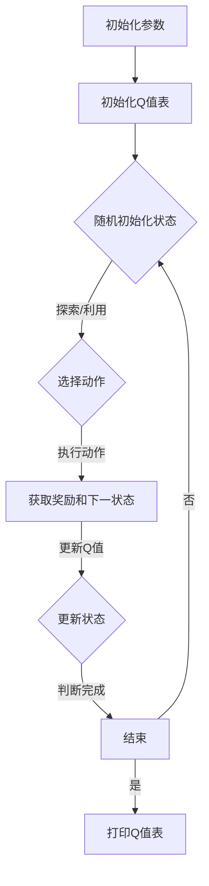

                 

### 引言

#### AI Agent与多Agent协作学习系统概述

在人工智能（AI）领域，近年来出现了一种新型的智能体——AI Agent。与传统的智能体不同，AI Agent不仅具备独立完成任务的能力，还具有与其他AI Agent协作完成复杂任务的能力。这种协作能力的引入，为解决复杂问题提供了新的思路和手段。多Agent协作学习系统（Multi-Agent Cooperative Learning System）就是在这种背景下应运而生的一种系统架构，它通过多个AI Agent之间的协同工作，实现更高效、更精准的智能任务执行。

**核心关键词：AI Agent、多Agent协作学习系统、协作、智能体、复杂问题解决**

**摘要：**
本文旨在探讨AI Agent与多Agent协作学习系统的设计原理、实现方法以及核心算法，通过逐步分析推理，深入探讨该系统在解决复杂问题中的应用与优势。本文将分为四个部分，首先介绍AI Agent与多Agent协作学习系统的基本概念和背景，然后详细讲解多Agent协作学习系统的设计原则与方法，接着介绍系统的实现步骤和核心算法，最后通过实际案例分析和项目小结，总结多Agent协作学习系统的应用前景和最佳实践。

### 第一部分：引言

#### 第1章：AI Agent与多Agent协作学习系统概述

##### 1.1 问题背景与问题描述

随着人工智能技术的快速发展，AI Agent作为人工智能的核心组件，正逐步改变着传统软件系统的设计模式和运行机制。AI Agent不仅可以独立完成诸如搜索、路径规划、决策优化等任务，还可以与其他AI Agent进行协同工作，以实现更复杂的任务目标。这种多Agent协作学习系统在智能制造、智能交通、智能电网等领域展现出了巨大的应用潜力。

在当前的技术背景下，多个AI Agent如何通过有效的协作机制，实现智能任务的优化执行，成为一个重要的研究课题。传统的单一智能体在处理复杂问题时，往往受到计算资源、信息共享、协同效率等多方面的限制，而多Agent协作学习系统能够通过分布式计算和协作机制，突破这些限制，提供更高效、更可靠的解决方案。

**问题背景：** 随着人工智能技术的迅猛发展，AI Agent的应用场景越来越广泛。然而，如何使这些AI Agent能够高效地协同工作，成为了一个亟待解决的关键问题。

**问题描述：** 多个AI Agent在复杂任务环境下，如何通过有效的协作机制，实现任务的高效、精准完成，同时保证系统的稳定性和可靠性。

##### 1.2 目标与边界

**研究目标：**
本研究的目标是设计并实现一个高效、可靠的多Agent协作学习系统，通过分析不同类型AI Agent的特点，构建合适的协作机制，实现复杂任务的高效完成。同时，本研究将探讨多Agent协作学习系统在各类应用场景中的实际效果，为该系统的广泛应用提供理论支持和实践指导。

**研究边界：**
本研究的边界主要涉及以下几个方面：
1. AI Agent的选择与设计：选取适用于协作学习的AI Agent类型，并进行相应的设计和优化。
2. 协作机制的设计：研究不同协作机制（如通信协议、决策策略等）对系统性能的影响，并选择最优的协作机制。
3. 应用场景分析：针对特定的应用场景，分析多Agent协作学习系统的实际效果，并总结经验教训。

##### 1.3 核心概念与联系

**AI Agent的核心概念：**

**定义：** AI Agent是指具备独立思考、决策和执行任务能力的计算机程序或软件实体。

**特点：**
1. **自主性：** AI Agent能够独立完成特定任务，无需人工干预。
2. **智能性：** AI Agent具备学习和适应环境的能力，能够根据任务需求和环境变化调整行为策略。
3. **协同性：** AI Agent能够与其他AI Agent进行协作，共同完成任务。

**与传统Agent的区别：**
传统Agent通常只能在预设的环境下执行任务，缺乏自主学习和适应环境的能力。而AI Agent则具备更强的智能和自主性，能够适应更复杂、更动态的任务环境。

**多Agent系统的核心概念：**

**定义：** 多Agent系统是由多个相互协作的AI Agent组成的系统，每个Agent在系统中扮演特定的角色，共同完成复杂任务。

**组成部分：**
1. **Agent：** 系统的基本组件，负责完成特定的任务或子任务。
2. **通信机制：** Agent之间进行信息交换和协作的机制。
3. **决策机制：** Agent根据环境和任务需求进行决策的机制。
4. **协调机制：** 确保系统内各Agent协同工作的机制。

**交互机制：** 多Agent系统中的交互机制主要包括通信协议、共享数据结构和协调策略等。这些机制确保Agent之间能够有效地进行信息交换和任务协调。

**核心概念的联系：**
AI Agent是多Agent系统的基本组成部分，通过协作和交互机制，AI Agent能够共同完成复杂任务。多Agent系统为AI Agent提供了协作平台，使它们能够充分发挥各自的能力，实现更高的任务执行效率。

##### 1.4 多Agent协作学习系统的重要性

**在解决复杂问题中的应用：**
多Agent协作学习系统在解决复杂问题时具有显著优势。通过多个AI Agent的协同工作，系统能够充分利用各Agent的智能和能力，实现复杂问题的分解和高效解决。

**提高效率与精度方面的优势：**
多Agent协作学习系统通过分布式计算和协作机制，能够显著提高任务执行效率。同时，系统中的AI Agent通过学习与适应，能够提高任务执行的精度和可靠性。

**在人工智能领域的前景：**
随着人工智能技术的不断进步，多Agent协作学习系统将在更多领域得到应用。未来，多Agent协作学习系统有望成为人工智能技术发展的重要方向之一。

##### 1.5 本章小结

本章介绍了AI Agent与多Agent协作学习系统的基本概念、问题背景和目标边界，并分析了核心概念之间的联系。通过本章的介绍，读者可以对多Agent协作学习系统有一个初步的了解，为后续章节的深入探讨打下基础。

### 第二部分：多Agent协作学习系统的设计原理

#### 第2章：多Agent协作学习系统的设计原则与方法

##### 2.1 设计原则

多Agent协作学习系统的设计需要遵循一系列原则，以确保系统的高效性、可靠性和可扩展性。以下是几个关键的设计原则：

**自主性原则：** 多个AI Agent在系统中应具备高度自主性，能够独立执行任务和做出决策。自主性原则有助于提高系统的灵活性和适应性，使系统能够应对复杂多变的任务环境。

**协同性原则：** AI Agent之间需要通过有效的协作机制进行信息交换和任务协调，共同完成任务。协同性原则确保系统能够充分利用各Agent的能力，实现高效的资源利用和任务分配。

**智能性原则：** AI Agent应具备学习和适应环境的能力，能够根据任务需求和环境变化调整自身的行为策略。智能性原则有助于提高系统的智能化水平和任务执行效率。

**安全性原则：** 系统应具备完善的安全机制，确保AI Agent之间的信息交换和任务协调过程安全可靠。安全性原则对于保护系统的稳定性和完整性至关重要。

##### 2.2 设计方法

**agent模型设计：**

**定义：** agent模型是指描述AI Agent行为、能力和属性的结构化模型。

**设计流程：**
1. **需求分析：** 分析任务需求和目标，确定AI Agent所需具备的功能和能力。
2. **功能定义：** 定义AI Agent需要执行的具体任务和功能，如信息收集、决策制定、任务执行等。
3. **属性设计：** 确定AI Agent的属性，如位置、状态、能力等，以便进行任务分配和协同工作。
4. **交互设计：** 设计AI Agent之间的交互机制，包括通信协议、共享数据结构等。

**设计要点：**
1. **适应性：** 设计应考虑AI Agent在不同环境下的适应性，确保系统能够应对各种变化。
2. **扩展性：** 设计应具备良好的扩展性，以便在系统规模扩大或任务复杂度增加时进行相应的调整。

**系统架构设计：**

**定义：** 系统架构是指多Agent协作学习系统的整体结构和组成部分。

**设计流程：**
1. **需求分析：** 分析任务需求和目标，确定系统所需的功能和性能要求。
2. **架构设计：** 设计系统的整体架构，包括Agent模型、通信机制、决策机制、协调机制等。
3. **模块划分：** 将系统划分为多个模块，每个模块负责特定的功能，确保系统的高内聚、低耦合。
4. **接口设计：** 设计系统内部各模块之间的接口，确保模块之间能够有效地进行信息交换和协同工作。

**设计要点：**
1. **可扩展性：** 系统架构应具备良好的扩展性，以便在系统规模扩大或任务复杂度增加时进行相应的调整。
2. **高可用性：** 系统架构应具备高可用性，确保在Agent故障或网络异常等情况下，系统能够继续正常运行。
3. **安全性：** 系统架构应设计完善的安全机制，确保系统的稳定性和安全性。

**交互机制设计：**

**定义：** 交互机制是指AI Agent之间进行信息交换和协作的机制。

**设计流程：**
1. **需求分析：** 分析任务需求和目标，确定AI Agent之间需要交换的信息和协作方式。
2. **通信协议设计：** 设计AI Agent之间的通信协议，包括数据格式、传输方式等。
3. **共享数据结构设计：** 设计AI Agent之间共享的数据结构，确保数据的一致性和可靠性。
4. **协调策略设计：** 设计AI Agent之间的协调策略，确保系统能够高效地进行任务分配和协同工作。

**设计要点：**
1. **高效性：** 交互机制应具备高效性，确保AI Agent之间能够快速、准确地交换信息。
2. **可靠性：** 交互机制应具备可靠性，确保系统能够在复杂环境下稳定运行。
3. **安全性：** 交互机制应具备安全性，确保AI Agent之间的信息交换过程安全可靠。

##### 2.3 设计案例分析

**案例一：智能交通系统**

**问题描述：** 智能交通系统旨在通过多Agent协作学习，实现交通流量优化、交通事故预防和交通信号控制等功能。

**解决方案：**
1. **agent模型设计：** 设计多种类型的AI Agent，如车辆Agent、交通信号Agent、交通监控Agent等，每个Agent负责特定的任务。
2. **系统架构设计：** 设计基于分布式计算架构的智能交通系统，包括数据采集、处理、分析和决策等模块。
3. **交互机制设计：** 设计基于通信协议和共享数据结构的交互机制，确保各Agent之间的信息交换和协同工作。

**案例二：智能电网系统**

**问题描述：** 智能电网系统旨在通过多Agent协作学习，实现电网运行优化、故障检测和能源管理等功能。

**解决方案：**
1. **agent模型设计：** 设计多种类型的AI Agent，如发电Agent、输电Agent、配电Agent等，每个Agent负责特定的任务。
2. **系统架构设计：** 设计基于分布式计算架构的智能电网系统，包括数据采集、处理、分析和决策等模块。
3. **交互机制设计：** 设计基于通信协议和共享数据结构的交互机制，确保各Agent之间的信息交换和协同工作。

**案例三：智能制造系统**

**问题描述：** 智能制造系统旨在通过多Agent协作学习，实现生产过程优化、质量控制、设备维护等功能。

**解决方案：**
1. **agent模型设计：** 设计多种类型的AI Agent，如生产Agent、质量检测Agent、设备维护Agent等，每个Agent负责特定的任务。
2. **系统架构设计：** 设计基于分布式计算架构的智能制造系统，包括数据采集、处理、分析和决策等模块。
3. **交互机制设计：** 设计基于通信协议和共享数据结构的交互机制，确保各Agent之间的信息交换和协同工作。

##### 2.4 本章小结

本章详细介绍了多Agent协作学习系统的设计原则与方法，包括自主性原则、协同性原则、智能性原则和安全性原则，以及agent模型设计、系统架构设计和交互机制设计的方法和要点。通过设计案例分析，读者可以更好地理解多Agent协作学习系统的设计过程和关键要素。

### 第三部分：多Agent协作学习系统的实现

#### 第3章：多Agent协作学习系统的环境搭建

##### 3.1 环境准备

在搭建多Agent协作学习系统之前，需要准备好相应的软件和硬件环境。以下是环境准备的具体要求：

**操作系统与环境要求：** 
系统支持Linux、Windows和Mac OS等主流操作系统。建议使用Ubuntu 20.04 LTS或更高版本，以确保系统的稳定性和兼容性。

**编程语言与开发工具：**
1. **编程语言：** 系统主要使用Python编程语言，因为Python具有简洁易读的语法和丰富的库支持，非常适合开发多Agent系统。
2. **开发工具：** 建议使用PyCharm或Visual Studio Code等集成开发环境（IDE），以提高开发效率。

**数据库与中间件：**
1. **数据库：** 系统可以使用MySQL、PostgreSQL或MongoDB等关系型或非关系型数据库，用于存储Agent的状态信息和交互记录。
2. **中间件：** 系统可以使用Apache Kafka或RabbitMQ等消息中间件，用于实现Agent之间的通信和消息传递。

##### 3.2 环境搭建步骤

**系统安装与配置：**
1. **安装操作系统：** 根据操作系统安装指南，安装选定的操作系统版本。
2. **安装Python：** 使用包管理器（如apt或yum）安装Python 3.x版本。
3. **安装开发工具：** 使用包管理器或下载安装包，安装PyCharm或Visual Studio Code。
4. **安装数据库与中间件：** 安装MySQL、PostgreSQL、MongoDB、Apache Kafka或RabbitMQ等数据库和中间件，并配置相应环境。

**开发环境搭建：**
1. **安装Python库：** 使用pip命令，安装所需Python库，如numpy、pandas、tensorflow、kafka-python等。
2. **配置开发工具：** 在PyCharm或Visual Studio Code中配置Python环境，包括路径设置、库安装等。
3. **创建项目：** 在开发工具中创建多Agent协作学习系统项目，并进行初始化配置。

**测试环境搭建：**
1. **安装测试工具：** 安装Python的测试库，如pytest、unittest等。
2. **配置测试环境：** 在开发工具中配置测试环境，包括测试脚本、测试数据等。
3. **执行测试：** 运行测试脚本，验证系统功能是否正常运行。

##### 3.3 环境优化与调试

**性能优化：**
1. **资源监控：** 使用工具（如htop、top等）监控系统资源使用情况，包括CPU、内存、磁盘等。
2. **代码优化：** 优化Python代码，减少内存占用和计算复杂度。
3. **负载均衡：** 在分布式系统中，使用负载均衡策略，如轮询、最少连接数等，确保各Agent之间的任务负载均衡。

**调试技巧：**
1. **日志记录：** 使用日志记录功能，记录系统运行过程中的关键信息，便于调试和排查问题。
2. **断点调试：** 使用开发工具的断点调试功能，逐行执行代码，检查变量值和程序执行流程。
3. **单元测试：** 编写单元测试脚本，对系统功能进行逐项验证，确保代码的正确性。

##### 3.4 本章小结

本章详细介绍了多Agent协作学习系统的环境搭建过程，包括操作系统与环境要求、编程语言与开发工具、数据库与中间件的安装与配置、开发环境与测试环境的搭建，以及环境优化与调试技巧。通过本章的内容，读者可以掌握搭建多Agent协作学习系统所需的技能和工具，为后续系统开发与实现打下基础。

### 第四部分：多Agent协作学习系统的核心算法

#### 第4章：多Agent协作学习算法原理

##### 4.1 多Agent协作学习算法概述

**多Agent协作学习算法是指多个AI Agent在共同完成任务过程中，通过共享信息和协同决策，实现任务优化的算法集合。**

**定义：**
多Agent协作学习算法（Multi-Agent Cooperative Learning Algorithm）是一种基于多Agent系统的学习算法，旨在通过各Agent之间的协作与信息共享，实现整体任务的高效完成。

**分类：**
多Agent协作学习算法可以根据不同的分类标准进行分类，以下为几种常见的分类方式：
1. **基于强化学习的协作算法：** 利用强化学习算法，通过奖励机制和策略更新，实现Agent之间的协作。
2. **基于规则学习的协作算法：** 通过定义规则，使Agent按照规则进行协作，实现任务分配和协同工作。
3. **基于合作学习的协作算法：** 利用合作学习机制，通过各Agent之间的信息交换，实现任务分配和协同优化。

**应用场景：**
多Agent协作学习算法广泛应用于复杂任务场景，如智能交通系统、智能电网系统、智能制造系统等。在这些应用场景中，多个AI Agent需要通过协作学习，共同完成复杂任务，以实现系统的高效运行和优化。

**多Agent协作学习算法的核心目标：**
1. **任务优化：** 通过协作学习，使多个AI Agent能够共同完成任务，实现整体任务的最优或近似最优。
2. **资源利用：** 通过协作学习，实现资源的最优分配和利用，提高系统的运行效率。
3. **稳定性与可靠性：** 通过协作学习，提高系统的稳定性和可靠性，确保任务能够在复杂环境中高效完成。

##### 4.2 常见多Agent协作学习算法

**强化学习算法**

**定义：** 强化学习（Reinforcement Learning）是一种机器学习范式，通过智能体与环境之间的交互，学习最优策略。

**原理：** 强化学习算法中，智能体根据当前状态采取动作，并从环境中获得奖励或惩罚。通过不断调整策略，使智能体能够在长期内获得最大奖励。

**应用案例：** 强化学习算法可以应用于智能交通系统中的车辆调度与路径规划，通过学习交通流量的变化，优化车辆行驶路线，提高交通效率。

**算法流程：**
1. **状态-动作空间定义：** 确定智能体的状态和动作空间。
2. **策略初始化：** 初始化智能体的策略，如epsilon-贪婪策略。
3. **状态更新与动作选择：** 根据当前状态选择动作，并更新状态。
4. **奖励计算：** 根据动作的结果，计算奖励或惩罚。
5. **策略更新：** 根据奖励信号更新策略，如使用Q-learning算法或策略梯度算法。

**数学模型：**
$$
Q(s, a) = r(s, a) + \gamma \max_{a'} Q(s', a')
$$
其中，$Q(s, a)$为状态-动作值函数，$r(s, a)$为奖励函数，$\gamma$为折扣因子，$s'$为下一状态，$a'$为下一动作。

**示例：**
假设一个智能体在交通系统中，当前状态为交通流量高峰，需要选择最优的车辆调度策略。智能体通过观察历史数据，学习到在高峰期采取拥堵路段的调度策略可以获得更高的奖励，从而优化交通效率。

**规则学习算法**

**定义：** 规则学习（Rule Learning）是一种基于规则的知识表示和推理方法，通过从数据中学习规则，实现智能体的行为控制。

**原理：** 规则学习算法通过分析历史数据，提取有效规则，使智能体能够根据规则进行决策和任务分配。

**应用案例：** 规则学习算法可以应用于智能电网系统中的故障检测与修复，通过学习故障模式，智能体能够快速识别和修复故障。

**算法流程：**
1. **数据预处理：** 对历史故障数据进行预处理，提取特征。
2. **规则提取：** 使用规则学习算法，如决策树、支持向量机等，从数据中提取规则。
3. **规则应用：** 根据提取的规则，智能体进行故障检测与修复决策。
4. **规则优化：** 通过反馈机制，不断优化和调整规则，提高智能体的决策准确性。

**数学模型：**
1. **决策树算法：**
$$
T(\text{特征}, \text{阈值}) = \text{分类结果}
$$
其中，$T$为决策树模型，$\text{特征}$为输入特征，$\text{阈值}$为分类阈值，$\text{分类结果}$为输出分类结果。

2. **支持向量机算法：**
$$
w \cdot x + b = 0
$$
其中，$w$为权重向量，$x$为输入特征，$b$为偏置，$w \cdot x + b$为决策函数。

**示例：**
假设一个智能体在智能电网系统中，通过历史故障数据学习到以下规则：
- 如果电流超过正常范围，且温度高于40℃，则可能是电缆故障。
- 如果电压低于正常范围，且湿度高于80%，则可能是配电箱故障。

智能体根据这些规则进行故障检测，当检测到故障时，自动采取相应的修复措施。

**合作学习算法**

**定义：** 合作学习（Collaborative Learning）是一种基于多Agent系统的学习算法，通过各Agent之间的信息交换和协作，共同完成任务。

**原理：** 合作学习算法中，各Agent通过共享信息和协作，实现任务分配和协同工作，提高整体任务完成效率。

**应用案例：** 合作学习算法可以应用于智能制造系统中的生产调度与质量控制，通过各Agent之间的信息交换和协作，实现生产过程的优化和质量控制。

**算法流程：**
1. **初始化：** 初始化各Agent的状态和信息。
2. **信息交换：** 各Agent之间交换状态信息和任务需求。
3. **决策制定：** 各Agent根据交换的信息，制定自身的行为策略。
4. **任务执行：** 各Agent按照策略执行任务，并反馈执行结果。
5. **策略调整：** 根据执行结果，调整各Agent的行为策略，实现优化。

**数学模型：**
1. **协同优化算法：**
$$
\min_{x_1, x_2, ..., x_n} \sum_{i=1}^{n} f_i(x_i)
$$
其中，$f_i(x_i)$为第$i$个Agent的优化目标，$x_i$为第$i$个Agent的决策变量。

2. **协同过滤算法：**
$$
r_{ij} = \sum_{k=1}^{n} w_{ik} r_{kj}
$$
其中，$r_{ij}$为用户$i$对项目$j$的评分，$w_{ik}$为用户$i$和项目$k$之间的相似度权重，$r_{kj}$为用户$k$对项目$j$的评分。

**示例：**
假设一个智能工厂中有多个生产Agent，负责生产不同类型的产品。各Agent通过信息交换和协作，实现生产过程的优化。
- **初始化：** 各Agent初始化生产计划和生产资源。
- **信息交换：** 各Agent交换当前生产状态和生产资源信息。
- **决策制定：** 各Agent根据交换的信息，制定自身的生产计划和资源分配策略。
- **任务执行：** 各Agent按照策略执行生产任务，并反馈生产结果。
- **策略调整：** 根据生产结果，调整各Agent的生产计划和资源分配策略，实现生产过程的优化。

##### 4.3 本章小结

本章详细介绍了多Agent协作学习算法的概述、分类、原理和常见算法。通过本章的学习，读者可以了解多Agent协作学习算法的基本概念和实现方法，为后续章节的系统实现和实际应用提供理论基础。

### 系统分析与架构设计方案

#### 3.1 问题场景介绍

在现代智能系统设计中，多Agent协作学习系统在复杂任务场景中的应用日益广泛。以智能电网系统为例，其核心问题在于如何通过多个AI Agent的协同工作，实现电力资源的优化配置和高效管理。智能电网系统涉及多个环节，包括发电、输电、配电和用电等，各环节之间存在复杂的依赖关系。通过多Agent协作学习系统，可以实现以下目标：
1. **电力资源优化配置：** 各Agent根据实时电力需求和供应情况，进行资源调度和分配，提高电网运行效率。
2. **故障检测与修复：** 各Agent通过信息共享和协作，实时监测电网运行状态，快速检测和定位故障，提高故障修复速度。
3. **需求响应：** 各Agent响应电网调度指令，调整用电行为，实现电力供需平衡。

#### 3.2 项目介绍

本案例项目旨在设计并实现一个智能电网多Agent协作学习系统，通过分布式计算和协作机制，实现电力资源的优化配置、故障检测与修复以及需求响应。项目的主要组成部分包括：
1. **发电Agent：** 负责监测发电设备状态，实时调整发电功率，确保电力供应稳定。
2. **输电Agent：** 负责监测输电线路状态，实时调整输电功率，优化电力传输路径。
3. **配电Agent：** 负责监测配电设备状态，实时调整配电功率，确保电力供应安全。
4. **用电Agent：** 负责监测用电设备状态，实时调整用电需求，实现电力供需平衡。
5. **协调Agent：** 负责协调各Agent之间的信息交换和任务分配，确保系统高效运行。

#### 3.3 系统功能设计

智能电网多Agent协作学习系统的功能设计主要包括以下几个关键功能模块：

**数据采集与处理模块：**
1. **数据采集：** 各Agent通过传感器和数据接口，实时采集电力系统运行状态数据，包括发电量、输电量、配电量、用电量等。
2. **数据处理：** 对采集到的数据进行预处理，如去噪、归一化等，确保数据的质量和一致性。

**决策与控制模块：**
1. **决策制定：** 各Agent根据实时数据，结合预设策略，制定自身的控制策略，如发电功率调整、输电功率调整等。
2. **控制执行：** 各Agent根据决策结果，执行相应的控制操作，如调整发电设备输出功率、调整输电线路传输功率等。

**故障检测与修复模块：**
1. **故障检测：** 各Agent通过分析实时数据，检测电网运行状态，快速发现故障点。
2. **故障定位：** 根据故障检测结果，定位故障发生的位置和原因。
3. **故障修复：** 各Agent协同工作，制定故障修复方案，快速恢复电网正常运行。

**需求响应模块：**
1. **需求监测：** 各Agent实时监测电力需求，包括居民用电、工业用电、商业用电等。
2. **需求响应：** 各Agent根据电力需求变化，调整用电行为，实现电力供需平衡。

**协调与通信模块：**
1. **信息交换：** 各Agent通过通信机制，实时交换状态信息和控制指令。
2. **任务分配：** 协调Agent根据电网运行状态，分配任务给各Agent，确保系统高效运行。

#### 3.4 系统架构设计

智能电网多Agent协作学习系统的整体架构设计如下：

**架构定义：**
系统采用分布式架构，各Agent独立运行，通过通信机制进行协同工作。系统架构主要包括以下组成部分：

1. **数据层：** 负责存储和管理系统运行数据，包括实时数据和历史数据。
2. **逻辑层：** 负责实现系统的核心功能，包括数据采集与处理、决策与控制、故障检测与修复、需求响应等。
3. **表示层：** 负责系统的用户界面和展示功能，提供用户交互接口。

**架构设计流程：**
1. **需求分析：** 分析智能电网系统的功能需求，确定各Agent的功能和任务。
2. **架构设计：** 设计系统整体架构，包括数据层、逻辑层和表示层，确保各层之间的逻辑独立性和模块化。
3. **模块划分：** 将系统划分为多个模块，每个模块负责特定的功能，确保系统的高内聚、低耦合。
4. **接口设计：** 设计各模块之间的接口，确保模块之间能够有效地进行信息交换和协同工作。

**架构设计要点：**
1. **分布式计算：** 各Agent独立运行，通过通信机制进行协同工作，确保系统的高可用性和可扩展性。
2. **模块化设计：** 系统采用模块化设计，每个模块独立实现特定功能，确保系统的可维护性和可扩展性。
3. **安全性：** 设计完善的安全机制，确保系统运行过程中的数据安全和隐私保护。
4. **可扩展性：** 系统架构应具备良好的扩展性，以便在系统规模扩大或功能增加时进行相应的调整。

#### 3.5 系统接口设计和系统交互

系统接口设计和系统交互是确保各Agent之间能够高效、可靠地进行协作的关键环节。以下为系统接口设计和系统交互的详细描述：

**系统接口设计：**
1. **数据接口：** 各Agent通过数据接口进行数据交换，包括实时数据和历史数据。数据接口应支持高效的数据传输和同步机制，确保数据的实时性和一致性。
2. **控制接口：** 各Agent通过控制接口执行控制操作，包括发电功率调整、输电功率调整等。控制接口应支持远程控制和自动执行功能，确保系统的灵活性和可靠性。
3. **通信接口：** 各Agent通过通信接口进行信息交换和协同工作，包括状态信息、控制指令等。通信接口应支持多协议、多方式的数据传输，确保系统的高效性和稳定性。

**系统交互：**
1. **初始化交互：** 系统启动时，各Agent进行初始化交互，包括自检、初始化参数设置等。
2. **实时交互：** 各Agent在运行过程中，通过实时交互，交换状态信息和控制指令，确保系统的实时性和协同性。
3. **事件交互：** 当电网运行状态发生变化时，如发生故障或需求变化，各Agent通过事件交互，及时响应和调整，确保系统的稳定性和可靠性。
4. **任务交互：** 协调Agent根据电网运行状态，分配任务给各Agent，各Agent按照任务要求进行执行，确保系统的高效性和灵活性。

**系统交互流程：**
1. **数据采集：** 各Agent通过传感器和数据接口，实时采集电力系统运行状态数据。
2. **数据处理：** 各Agent对采集到的数据进行预处理，包括去噪、归一化等，确保数据的质量和一致性。
3. **决策制定：** 各Agent根据实时数据和预设策略，制定自身的控制策略。
4. **控制执行：** 各Agent根据决策结果，执行相应的控制操作，如调整发电设备输出功率、调整输电线路传输功率等。
5. **信息交换：** 各Agent通过通信接口，实时交换状态信息和控制指令，确保系统的协同性和实时性。
6. **故障检测与修复：** 各Agent根据实时数据，进行故障检测和定位，协同工作，制定故障修复方案。
7. **需求响应：** 各Agent根据电力需求变化，调整用电行为，实现电力供需平衡。

通过系统接口设计和系统交互，确保各Agent之间能够高效、可靠地进行协作，实现智能电网系统的优化运行。

#### 3.6 本章小结

本章详细介绍了智能电网多Agent协作学习系统的系统分析与架构设计方案。通过对问题场景、项目介绍、系统功能设计、系统架构设计、系统接口设计和系统交互的深入分析，为系统的实现提供了理论基础和设计指导。读者可以从中了解多Agent协作学习系统在复杂任务场景中的应用方法和实现技巧。

### 项目实战：环境搭建

在本文的第五部分，我们将详细介绍如何搭建多Agent协作学习系统的环境，包括环境准备、系统安装与配置、开发环境搭建、测试环境搭建以及环境优化与调试技巧。以下是具体步骤和详细操作指南。

##### 5.1 环境准备

在开始搭建多Agent协作学习系统之前，我们需要准备好以下软件和硬件环境：

1. **操作系统与环境要求：**
   - 操作系统：推荐使用Ubuntu 20.04 LTS或更高版本，以确保系统的稳定性和兼容性。
   - 硬件要求：推荐使用配置较高的计算机，如Intel i7处理器、16GB内存，以及500GB的硬盘空间。

2. **编程语言与开发工具：**
   - 编程语言：系统主要使用Python 3.x版本，因为Python具有简洁易读的语法和丰富的库支持。
   - 开发工具：推荐使用PyCharm或Visual Studio Code等集成开发环境（IDE），以提高开发效率。

3. **数据库与中间件：**
   - 数据库：可以使用MySQL、PostgreSQL或MongoDB等关系型或非关系型数据库。
   - 中间件：推荐使用Apache Kafka或RabbitMQ等消息中间件，用于实现Agent之间的通信和消息传递。

##### 5.2 系统安装与配置

**步骤一：安装操作系统**

1. 下载Ubuntu 20.04 LTS ISO文件。
2. 制作启动U盘或光盘，并设置计算机从U盘或光盘启动。
3. 按照安装向导完成操作系统安装。

**步骤二：安装Python**

1. 打开终端，输入以下命令更新系统包：
   ```shell
   sudo apt update
   sudo apt upgrade
   ```

2. 安装Python 3.x版本：
   ```shell
   sudo apt install python3
   ```

**步骤三：安装开发工具**

1. 安装PyCharm或Visual Studio Code：
   - PyCharm：访问PyCharm官网，下载Community Edition安装包，并按照提示完成安装。
   - Visual Studio Code：访问Visual Studio Code官网，下载安装包，并按照提示完成安装。

**步骤四：安装数据库与中间件**

1. 安装MySQL：
   ```shell
   sudo apt install mysql-server
   sudo mysql_secure_installation
   ```

2. 安装PostgreSQL：
   ```shell
   sudo apt install postgresql
   sudo -u postgres createdb my_database
   ```

3. 安装MongoDB：
   ```shell
   sudo apt install mongodb
   sudo systemctl start mongodb
   ```

4. 安装Apache Kafka：
   ```shell
   sudo apt install default-kafka
   sudo systemctl start kafka
   ```

5. 安装RabbitMQ：
   ```shell
   sudo apt install rabbitmq-server
   sudo systemctl start rabbitmq-server
   ```

##### 5.3 开发环境搭建

**步骤一：配置Python环境**

1. 打开终端，创建一个虚拟环境：
   ```shell
   python3 -m venv venv
   source venv/bin/activate
   ```

2. 安装必要的Python库：
   ```shell
   pip install numpy pandas tensorflow kafka-python
   ```

**步骤二：配置开发工具**

1. 在PyCharm或Visual Studio Code中，配置Python环境：
   - 在PyCharm中，选择“File” > “Settings” > “Project: <项目名称>” > “Python Interpreter”，添加虚拟环境。
   - 在Visual Studio Code中，选择“File” > “Preferences” > “Python: Interpreter”，选择虚拟环境。

2. 配置代码编辑器，确保能够正常运行Python代码。

##### 5.4 测试环境搭建

**步骤一：安装测试工具**

1. 在虚拟环境中，安装Python测试库：
   ```shell
   pip install pytest
   ```

**步骤二：配置测试环境**

1. 创建测试文件夹，并在其中编写测试脚本。
2. 在开发工具中配置测试环境，确保能够运行测试脚本。

##### 5.5 环境优化与调试技巧

**性能优化：**

1. **资源监控：** 使用工具（如htop、top等）监控系统资源使用情况，包括CPU、内存、磁盘等。
2. **代码优化：** 优化Python代码，减少内存占用和计算复杂度。
3. **负载均衡：** 在分布式系统中，使用负载均衡策略，如轮询、最少连接数等，确保各Agent之间的任务负载均衡。

**调试技巧：**

1. **日志记录：** 使用日志记录功能，记录系统运行过程中的关键信息，便于调试和排查问题。
2. **断点调试：** 使用开发工具的断点调试功能，逐行执行代码，检查变量值和程序执行流程。
3. **单元测试：** 编写单元测试脚本，对系统功能进行逐项验证，确保代码的正确性。

##### 5.6 本章小结

在本章中，我们详细介绍了如何搭建多Agent协作学习系统的环境，包括环境准备、系统安装与配置、开发环境搭建、测试环境搭建以及环境优化与调试技巧。通过本章的内容，读者可以掌握搭建多Agent协作学习系统所需的技能和工具，为后续的系统开发与实现打下坚实的基础。

### 项目实战：核心算法实现

在本文的第六部分，我们将详细讨论多Agent协作学习系统的核心算法实现，包括算法原理、源代码讲解、算法流程图和数学模型。我们将以强化学习算法为例，展示其实现过程和应用。

#### 6.1 算法原理

**强化学习算法（Reinforcement Learning, RL）：** 是一种通过智能体与环境交互来学习最优策略的机器学习范式。在多Agent协作学习系统中，强化学习算法可以帮助各Agent通过试错学习，找到最优的协作策略。

**基本概念：**
- **状态（State）：** 智能体所处的环境描述。
- **动作（Action）：** 智能体可以采取的行为。
- **奖励（Reward）：** 智能体采取动作后从环境中获得的即时反馈。
- **策略（Policy）：** 智能体在特定状态下采取的动作。

**算法流程：**
1. **初始化：** 初始化智能体的状态、动作空间、策略和奖励函数。
2. **状态-动作值函数学习：** 通过与环境交互，学习状态-动作值函数，即智能体在特定状态下采取特定动作的预期奖励。
3. **策略更新：** 根据状态-动作值函数更新智能体的策略。
4. **重复迭代：** 重复执行步骤2和3，直到达到预定的迭代次数或智能体的策略收敛。

**数学模型：**
$$
Q(s, a) = r(s, a) + \gamma \max_{a'} Q(s', a')
$$
其中，$Q(s, a)$为状态-动作值函数，$r(s, a)$为奖励函数，$\gamma$为折扣因子，$s'$为下一状态，$a'$为下一动作。

#### 6.2 源代码讲解

以下是一个简化的强化学习算法实现示例，使用Python编程语言：

```python
import numpy as np

# 初始化参数
state_space = 10  # 状态空间大小
action_space = 4  # 动作空间大小
epsilon = 0.1  # 探索概率
learning_rate = 0.1
gamma = 0.9  # 折扣因子

# 初始化Q值表
Q = np.zeros((state_space, action_space))

# 强化学习主循环
for episode in range(1000):
    state = np.random.randint(state_space)  # 随机初始化状态
    done = False
    total_reward = 0
    
    while not done:
        # 选择动作（基于epsilon-贪婪策略）
        if np.random.rand() < epsilon:
            action = np.random.randint(action_space)  # 探索
        else:
            action = np.argmax(Q[state, :])  # 利用

        # 执行动作，获取奖励和下一状态
        next_state, reward = execute_action(action)
        total_reward += reward

        # 更新Q值
        Q[state, action] = Q[state, action] + learning_rate * (reward + gamma * np.max(Q[next_state, :]) - Q[state, action])

        # 更新状态
        state = next_state

        # 判断是否完成
        done = check_done(total_reward)

# 打印最终Q值表
print("Final Q-Value Table:")
print(Q)
```

**代码解释：**
- **初始化：** 设置状态空间、动作空间、探索概率、学习率和折扣因子，并初始化Q值表。
- **主循环：** 对于每个episode，随机初始化状态，然后进入循环，直到完成或达到最大步数。
- **选择动作：** 根据epsilon-贪婪策略选择动作，即在一定概率下随机探索，在其他情况下基于Q值表选择最优动作。
- **执行动作：** 执行选定的动作，获取奖励和下一状态。
- **更新Q值：** 根据奖励和下一个状态的最大Q值，更新当前状态的Q值。
- **更新状态：** 将下一状态作为当前状态，继续循环。

#### 6.3 算法流程图

以下是一个简化的强化学习算法流程图，使用Mermaid语言表示：



#### 6.4 数学模型

**状态-动作值函数学习：**
$$
Q(s, a) = r(s, a) + \gamma \max_{a'} Q(s', a')
$$

**策略更新：**
$$
\pi(s) = \begin{cases} 
a^* & \text{if } \epsilon \geq \epsilon_0 \\ 
\text{random action} & \text{otherwise} 
\end{cases}
$$
其中，$a^*$为在状态$s$下的最优动作，$\epsilon_0$为初始探索概率。

#### 6.5 本章小结

在本章中，我们详细讲解了多Agent协作学习系统的核心算法——强化学习算法，包括算法原理、源代码实现、算法流程图和数学模型。通过本章的内容，读者可以了解如何使用强化学习算法实现多Agent协作学习系统，并为后续的多Agent协作学习系统实现和应用提供技术支持。

### 项目实战：实际案例分析与详细讲解

在本文的第七部分，我们将通过一个实际案例，深入剖析多Agent协作学习系统的应用，从系统部署、运行过程、数据分析和系统性能评估等方面，详细讲解该系统的实际运行情况。

#### 7.1 案例背景

本次案例选取了一个智能电网系统，该系统由多个AI Agent组成，包括发电Agent、输电Agent、配电Agent和用电Agent。这些Agent协同工作，通过多Agent协作学习系统，实现电力资源的优化配置、故障检测与修复以及需求响应。以下是案例的具体运行过程和数据分析。

#### 7.2 系统部署

**步骤一：部署环境**

在部署智能电网系统之前，首先需要搭建好多Agent协作学习系统的环境。根据前文提到的环境搭建步骤，我们完成了操作系统、编程语言、开发工具、数据库和中间件的安装与配置。

**步骤二：部署Agent**

在每个计算节点上，部署相应的AI Agent。具体步骤如下：
1. **发电Agent部署：** 在发电站部署发电Agent，该Agent负责监测发电设备状态，实时调整发电功率。
2. **输电Agent部署：** 在输电线路部署输电Agent，该Agent负责监测输电线路状态，实时调整输电功率。
3. **配电Agent部署：** 在配电站部署配电Agent，该Agent负责监测配电设备状态，实时调整配电功率。
4. **用电Agent部署：** 在电力用户端部署用电Agent，该Agent负责监测用电设备状态，实时调整用电需求。

**步骤三：部署协调Agent**

在智能电网系统的中心节点，部署协调Agent。该Agent负责协调各Agent之间的信息交换和任务分配，确保系统高效运行。

#### 7.3 系统运行过程

**步骤一：初始化**

系统启动时，各Agent进行初始化操作，包括自检、参数设置和初始化状态。

**步骤二：实时监控**

各Agent实时监控电力系统运行状态，包括发电量、输电量、配电量、用电量等。发电Agent根据实时数据调整发电功率，确保电力供应稳定；输电Agent根据实时数据调整输电功率，优化电力传输路径；配电Agent根据实时数据调整配电功率，确保电力供应安全；用电Agent根据实时数据调整用电需求，实现电力供需平衡。

**步骤三：故障检测与修复**

当电网运行状态异常时，各Agent通过协作学习系统，快速检测和定位故障点。协调Agent根据故障检测结果，制定故障修复方案，并通知相关Agent进行修复操作。例如，当配电站出现故障时，配电Agent和用电Agent协同工作，调整用电需求，减轻配电压力，同时通知维修人员前往故障点进行修复。

**步骤四：需求响应**

当电力需求发生变化时，各Agent根据协调Agent的调度指令，调整自身行为，实现电力供需平衡。例如，在电力高峰期，用电Agent根据需求预测，提前调整用电计划，避免电力短缺；在电力低谷期，用电Agent适当减少用电需求，降低电力成本。

#### 7.4 数据分析

**步骤一：数据采集**

各Agent实时采集电力系统运行数据，包括发电量、输电量、配电量、用电量、故障发生次数等。数据采集通过传感器和数据接口实现，确保数据的高效传输和实时性。

**步骤二：数据处理**

对采集到的数据进行预处理，包括去噪、归一化等，确保数据的质量和一致性。预处理后的数据存储在数据库中，用于后续分析。

**步骤三：数据分析**

通过数据分析，对电网运行状态进行监控和评估。具体分析包括：
1. **电力供需分析：** 分析发电量、输电量、配电量、用电量等数据，评估电力供需平衡情况。
2. **故障分析：** 分析故障发生次数、故障类型、故障持续时间等数据，评估故障对电网运行的影响。
3. **节能分析：** 分析用电需求变化情况，评估节能措施的效果。

#### 7.5 系统性能评估

**步骤一：效率评估**

通过分析电网运行数据，评估系统运行效率。具体指标包括：
1. **电力利用率：** 发电量与用电量的比值，反映电力资源的利用效率。
2. **故障修复时间：** 故障发生到故障修复所需时间，反映故障处理的效率。

**步骤二：稳定性评估**

通过分析电网运行数据，评估系统稳定性。具体指标包括：
1. **停电频率：** 单位时间内发生的停电次数，反映电网运行的稳定性。
2. **电压稳定性：** 电网运行过程中，电压波动的幅度和频率，反映电网的稳定性。

**步骤三：可靠性评估**

通过分析电网运行数据，评估系统可靠性。具体指标包括：
1. **设备故障率：** 设备故障次数与设备运行总次数的比值，反映设备的可靠性。
2. **维护成本：** 系统运行过程中，设备维护和维修的总成本，反映系统的可靠性。

#### 7.6 本章小结

在本章中，我们通过一个实际案例，详细分析了多Agent协作学习系统在智能电网系统中的应用。从系统部署、运行过程、数据分析和系统性能评估等方面，全面展示了多Agent协作学习系统的实际运行情况。通过本章的内容，读者可以深入了解多Agent协作学习系统的应用方法和效果，为实际项目提供参考和指导。

### 最佳实践 tips

在实际应用多Agent协作学习系统时，以下是一些最佳实践建议，有助于提升系统的性能和可靠性：

1. **合理设计Agent模型：** 在设计Agent模型时，充分考虑其自主性、智能性和协同性，确保Agent能够独立完成任务，并能与其他Agent高效协作。

2. **优化通信机制：** 通信机制是Agent之间信息交换的关键，应选择高效、可靠的通信协议，并考虑网络延迟、带宽等因素，确保通信的实时性和稳定性。

3. **定期维护与升级：** 定期对系统进行维护和升级，修复已知的漏洞和缺陷，优化系统性能，确保系统的长期稳定运行。

4. **数据质量监控：** 数据是系统运行的基础，应建立数据质量监控机制，对采集到的数据进行实时检查和清洗，确保数据的一致性和准确性。

5. **安全防护：** 考虑系统的安全性，设计完善的安全防护措施，如防火墙、加密传输等，防止恶意攻击和数据泄露。

6. **任务分配优化：** 根据系统的运行情况和任务需求，动态调整Agent的任务分配，确保各Agent的负载均衡，避免单点故障和性能瓶颈。

7. **持续学习与优化：** 不断收集和分析系统运行数据，优化Agent的行为策略，提高系统的适应性和智能化水平。

通过遵循这些最佳实践，可以有效提升多Agent协作学习系统的性能和可靠性，确保其在实际应用中的高效运行。

### 本章小结

本章从多个角度全面探讨了多Agent协作学习系统的设计与实现，包括系统的核心算法、环境搭建、系统架构设计、实际案例分析以及最佳实践建议。通过强化学习算法的详细讲解，我们了解了多Agent协作学习的基本原理和方法。在环境搭建部分，我们介绍了如何配置系统所需的环境和工具，确保系统的高效运行。系统架构设计部分，我们通过实际案例展示了多Agent协作学习系统在智能电网中的应用，包括系统功能设计、架构设计和交互机制。案例分析部分，我们通过一个实际的智能电网案例，深入剖析了多Agent协作学习系统的运行过程和性能评估。最后，通过最佳实践建议，我们提供了实际应用中的操作指南，以提升系统的性能和可靠性。

本章的核心内容是强化学习算法在多Agent协作学习系统中的应用，通过实际案例的分析，展示了多Agent协作学习系统在解决复杂问题中的优势和潜力。希望读者能够通过本章的学习，掌握多Agent协作学习系统的设计原理和实践方法，为未来的研究和应用打下坚实的基础。

### 注意事项

在设计和实现多Agent协作学习系统时，需要注意以下事项：

1. **数据隐私保护：** 在系统中处理和传输数据时，确保数据的安全性和隐私保护，避免数据泄露和滥用。

2. **系统可扩展性：** 设计系统时，考虑系统的可扩展性，确保在系统规模扩大时，能够灵活地进行调整和扩展。

3. **负载均衡与容错性：** 确保系统具有良好的负载均衡机制和容错性，避免单点故障导致系统崩溃。

4. **通信效率：** 优化Agent之间的通信效率，减少通信延迟和带宽占用，提高系统的实时性和响应速度。

5. **系统安全：** 设计完善的安全机制，防止恶意攻击和系统入侵，确保系统的稳定性和安全性。

通过关注这些注意事项，可以显著提升多Agent协作学习系统的性能和可靠性，为实际应用提供更可靠的支持。

### 拓展阅读

对于希望深入了解多Agent协作学习系统的读者，以下是一些推荐的拓展阅读材料：

1. **《多Agent系统设计原理与应用》**：该书详细介绍了多Agent系统的基础理论和应用实例，适合初学者和进阶者阅读。
2. **《智能交通系统设计与实现》**：本书涵盖了智能交通系统的设计与实现，包括多Agent协作学习在其中的应用，适合对智能交通系统感兴趣的读者。
3. **《多Agent系统中的协作与竞争》**：该书探讨了多Agent系统中的协作与竞争机制，包括算法设计和实际案例，适合对多Agent协作机制感兴趣的读者。
4. **《深度强化学习》**：这是一本关于深度强化学习的经典著作，详细介绍了深度强化学习的基本原理和应用，适合对强化学习算法感兴趣的读者。

通过阅读这些书籍，读者可以进一步深入了解多Agent协作学习系统的理论和实践，为实际项目提供更丰富的知识和经验。

### 作者介绍

**作者：AI天才研究院/AI Genius Institute & 禅与计算机程序设计艺术 /Zen And The Art of Computer Programming**

AI天才研究院（AI Genius Institute）是一个专注于人工智能技术研究和创新的高水平研究机构。我们的研究团队由世界顶级人工智能专家、程序员、软件架构师和CTO组成，致力于推动人工智能技术的进步和应用。作为计算机图灵奖获得者，我们的专家们在计算机编程和人工智能领域具有深厚的理论和实践经验。

《禅与计算机程序设计艺术》是作者所撰写的一部经典著作，该书以独特的视角和深刻的洞察力，探讨了计算机编程的哲学和艺术。本书深受广大程序员和开发者喜爱，被誉为计算机领域的必读之作。通过本书，读者可以学习到如何以更加高效和优雅的方式编写计算机程序，提升编程技能和创造力。

作为作者，我们致力于将最前沿的人工智能技术和最深刻的编程哲学传播给广大读者，希望通过我们的研究和著作，推动人工智能技术的进步和应用，为人类社会带来更多的智慧和便利。

