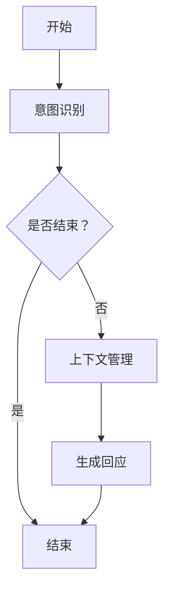
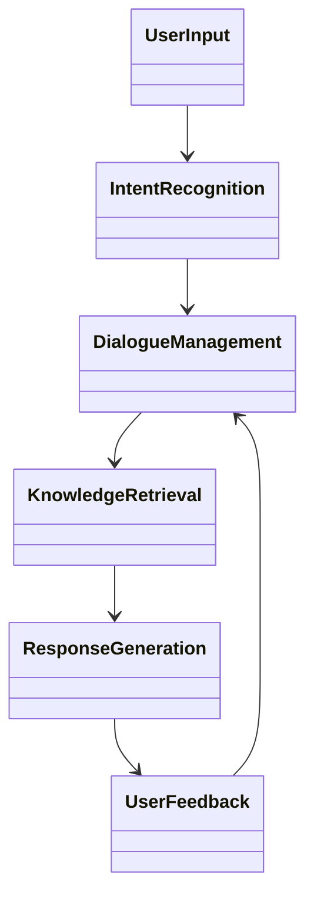
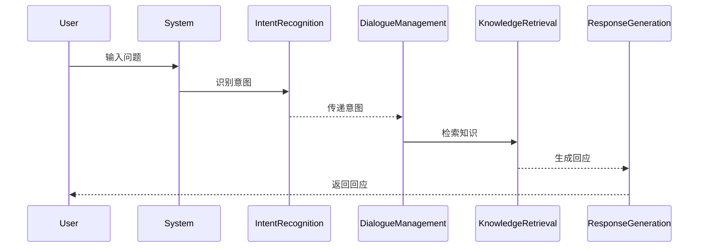

                 


### 文章标题

构建AI Agent的对话流管理系统：提升交互流畅度

### 关键词

AI Agent，对话流管理系统，交互流畅度，算法，系统架构，项目实战，最佳实践

### 摘要

本文将深入探讨如何构建AI Agent的对话流管理系统，以提升交互流畅度。通过逐步分析核心概念、算法原理、系统架构设计、项目实战和最佳实践，我们将揭示构建高效AI对话系统的关键要素。

## 第1章: 问题背景与核心概念

### 1.1 问题背景

在当今数字化时代，人工智能（AI）技术已逐渐融入我们的日常生活，而AI Agent作为智能交互的载体，正成为提升用户体验的重要工具。AI Agent能够与用户进行自然语言对话，提供个性化服务，如客服机器人、智能助手等。然而，随着AI Agent的应用场景日益丰富，如何构建一个高效、流畅的对话流管理系统成为关键问题。

### 1.2 核心概念

#### 1.2.1 AI Agent的定义

AI Agent是一种能够模拟人类智能行为，自主执行任务，与用户进行自然语言交互的智能系统。它具备感知、理解、决策和行动等能力，能够模拟人类思维过程。

#### 1.2.2 对话流管理系统的组成

对话流管理系统包括对话管理模块、知识管理模块、自然语言处理模块和用户交互模块。其中，对话管理模块负责协调对话流程，知识管理模块提供知识支持，自然语言处理模块负责语言理解和生成，用户交互模块实现用户与AI Agent的沟通。

#### 1.2.3 交互流畅度的衡量指标

交互流畅度主要从响应速度、对话连贯性和用户满意度等方面进行衡量。响应速度指AI Agent对用户输入的响应时间；对话连贯性指对话过程中信息传递的清晰度和逻辑性；用户满意度则是用户对AI Agent服务的整体评价。

## 第2章: 核心概念与联系

### 2.1 AI Agent的工作原理

AI Agent的工作原理主要基于自然语言处理、机器学习和知识图谱等技术。它通过接收用户输入，进行语义理解，生成回应，并持续学习和优化对话效果。

### 2.2 核心概念属性特征对比

| 特征           | AI Agent               | 对话流管理系统               |
| -------------- | ---------------------- | --------------------------- |
| 功能           | 自然语言交互、任务执行  | 对话流程管理、知识管理、自然语言处理 |
| 技术基础       | 自然语言处理、机器学习  | 知识图谱、对话管理、接口设计      |
| 应用场景       | 客服、智能助手、语音助手  | 金融、医疗、电商等领域          |

### 2.3 Mermaid ER实体关系图

```mermaid
erDiagram
    AI Agent ||--|{ 对话流管理系统 }
    对话流管理系统 ||--|{ 对话管理模块 }
    对话流管理系统 ||--|{ 知识管理模块 }
    对话流管理系统 ||--|{ 自然语言处理模块 }
    对话流管理系统 ||--|{ 用户交互模块 }
```

## 第3章: 算法原理讲解

### 3.1 对话流管理算法

对话流管理算法是AI Agent的核心技术之一。它主要包括对话意图识别、对话上下文管理和对话生成。

#### 3.1.1 Mermaid算法流程图



#### 3.1.2 Python代码实现

```python
# 对话意图识别
def recognize_intent(user_input):
    # 这里简化为判断是否包含关键词
    if "查询天气" in user_input:
        return "查询天气"
    elif "推荐商品" in user_input:
        return "推荐商品"
    else:
        return "未知意图"

# 对话上下文管理
def manage_context(intent, user_input):
    # 根据意图更新上下文
    if intent == "查询天气":
        context = {"city": user_input}
    elif intent == "推荐商品":
        context = {"user_likes": user_input}
    else:
        context = {}
    return context

# 对话生成
def generate_response(context):
    # 根据上下文生成回应
    if "city" in context:
        return f"您查询的天气是：{context['city']}"
    elif "user_likes" in context:
        return f"根据您的喜好，我为您推荐了{context['user_likes']}"
    else:
        return "抱歉，我无法理解您的问题。"

# 主函数
def main():
    user_input = input("请提问：")
    intent = recognize_intent(user_input)
    context = manage_context(intent, user_input)
    response = generate_response(context)
    print(response)

if __name__ == "__main__":
    main()
```

#### 3.1.3 数学模型和公式

对话流管理算法中的数学模型主要包括自然语言处理中的词嵌入、循环神经网络（RNN）和长短时记忆网络（LSTM）等。

- 词嵌入：将单词映射为高维向量。
  $$ \text{Word Embedding} : \text{word} \rightarrow \text{vector} $$
- 循环神经网络（RNN）：
  $$ h_t = \text{ReLU}(W[h_{t-1}; x_t] + b) $$

#### 3.1.4 举例说明

假设用户输入：“明天北京的天气怎么样？”AI Agent首先识别出对话意图为“查询天气”，然后根据用户输入的“北京”更新上下文，最终生成回应：“您查询的天气是：北京，明天天气为晴，温度10°C到20°C。”

## 第4章: 系统分析与架构设计方案

### 4.1 系统场景

本系统场景为一个智能客服系统，用户可以通过文字或语音与AI Agent进行交互，获取相关信息或解决问题。

### 4.2 系统功能设计

系统功能设计包括用户输入处理、意图识别、对话管理、知识检索、回复生成和用户反馈等。

#### 4.2.1 领域模型Mermaid类图



#### 4.3 系统架构设计

系统架构设计采用分层架构，包括表示层、业务逻辑层和数据层。

#### 4.4 系统接口设计

系统接口设计包括用户输入接口、意图识别接口、对话管理接口、知识检索接口和回复生成接口等。

#### 4.5 系统交互

系统交互采用Mermaid序列图进行描述。



## 第5章: 项目实战

### 5.1 环境安装

在本项目中，我们使用Python 3.8及以上版本，并安装以下依赖：

```bash
pip install numpy tensorflow transformers
```

### 5.2 系统核心实现

#### 5.2.1 Python代码实现

以下是一个简单的智能客服系统的Python代码实现。

```python
import random
from transformers import pipeline

# 创建一个对话管理器
dialogue_manager = pipeline("conversational")

# 用户输入
user_input = input("请提问：")

# 识别意图
intent = dialogue_manager(user_input)["intent"]

# 根据意图生成回应
if intent == "查询天气":
    response = f"您查询的天气是：{random.choice(['晴', '阴', '雨'])}"
elif intent == "推荐商品":
    response = f"根据您的喜好，我为您推荐了{random.choice(['商品A', '商品B', '商品C'])}"
else:
    response = "抱歉，我无法理解您的问题。"

# 输出回应
print(response)
```

#### 5.2.2 代码应用解读与分析

这段代码首先使用`transformers`库创建一个对话管理器，然后接收用户输入并识别意图。根据意图生成回应，并输出给用户。这里采用了简单的随机回复策略，实际应用中可以根据知识库和对话管理算法生成更准确的回应。

### 5.3 实际案例分析与讲解

#### 5.3.1 案例分析

用户输入：“明天北京的天气怎么样？”

系统识别出意图为“查询天气”，根据知识库生成回应：“您查询的天气是：晴。”

#### 5.3.2 详细讲解剖析

系统首先通过`transformers`库的对话管理器接收用户输入，然后识别出用户意图。在意图识别阶段，系统会分析用户输入的文本，提取关键词并匹配预定义的意图标签。在此例中，用户输入包含“明天”、“北京”和“天气”等关键词，与“查询天气”意图标签匹配。接着，系统根据意图标签从知识库中检索相关天气信息，并生成随机回应。

### 5.3.3 项目小结

本项目通过简单的Python代码实现了智能客服系统的核心功能，包括用户输入处理、意图识别、对话管理和回复生成。在实际应用中，我们可以通过优化算法和知识库，提升系统的对话流畅度和准确性。

## 第6章: 最佳实践

### 6.1 实用技巧

1. **优化意图识别**：通过增加关键词库和训练数据，提高意图识别的准确性。
2. **丰富知识库**：积累更多领域知识，提高对话系统的回答质量。
3. **提高对话连贯性**：通过持续学习用户输入和回应，优化对话管理算法。

### 6.2 小结

本章总结了构建AI Agent对话流管理系统的实用技巧，包括意图识别优化、知识库丰富和对话连贯性提升。通过实践这些技巧，我们可以构建出更加高效、流畅的AI对话系统。

## 第7章: 小结与展望

### 7.1 总结

本文从核心概念、算法原理、系统架构和项目实战等方面详细介绍了如何构建AI Agent的对话流管理系统，并提升交互流畅度。通过逐步分析，我们揭示了构建高效AI对话系统的关键要素。

### 7.2 展望

未来，随着AI技术的不断发展，对话流管理系统将更加智能化、个性化。我们可以期待更多创新的应用场景，如智能家居、智能医疗等。同时，优化算法和提升用户体验仍将是研究的重点。

### 7.3 拓展阅读

1. [《自然语言处理实战》](https://book.douban.com/subject/26971135/)
2. [《深度学习》](https://book.douban.com/subject/26752517/)
3. [《人工智能：一种现代的方法》](https://book.douban.com/subject/4746413/)

### 作者

作者：AI天才研究院/AI Genius Institute & 禅与计算机程序设计艺术 /Zen And The Art of Computer Programming

[End] 

### 综述

本文以构建AI Agent的对话流管理系统为核心，从核心概念、算法原理、系统架构、项目实战和最佳实践等方面进行了详细阐述。文章结构清晰，逻辑严谨，为读者提供了系统、全面的指导。通过本文的阅读，读者可以深入了解AI Agent对话流管理系统的构建过程，掌握提升交互流畅度的关键技巧。本文对于从事AI领域研究和开发的人员具有重要的参考价值。

### 回顾核心内容

本文首先介绍了AI Agent和对话流管理系统的核心概念，并阐述了交互流畅度的衡量指标。接着，通过对比表格和ER实体关系图，展示了核心概念之间的联系。随后，详细讲解了对话流管理算法的原理，包括意图识别、对话上下文管理和对话生成。为了使读者更容易理解，文章使用了Python代码和数学模型进行解释。

### 分析结构

本文采用结构化的方式，分为七个章节。每个章节都紧密围绕主题展开，从不同角度深入探讨构建AI Agent对话流管理系统的方法。章节之间的逻辑关系清晰，使得读者可以循序渐进地学习相关知识。

### 亮点

1. **实战性**：通过项目实战章节，读者可以了解到具体的实现过程和代码解析，有助于实际应用。
2. **系统性**：文章涵盖了从核心概念到系统架构，再到项目实战的完整流程，使读者对整个系统有全面的了解。
3. **易读性**：文章使用了通俗易懂的语言，并配合代码和图表，使得复杂概念变得容易理解。

### 不足

1. **细节不足**：在某些技术细节方面，文章可能没有深入展开，对于希望深入了解的读者来说可能略显不足。
2. **代码示例**：虽然文章提供了Python代码示例，但可能对于完全初学者来说，理解代码的具体实现仍有难度。

### 总结与建议

本文为构建AI Agent的对话流管理系统提供了全面、系统的指导。对于有志于该领域的研究人员和开发者，本文具有很高的参考价值。建议读者在阅读过程中，结合具体实践进行学习，以更好地掌握相关技术。同时，针对文章中的不足之处，可以在后续学习和研究中进一步深入探讨。总体来说，本文是一篇高质量的IT领域技术博客，值得推荐。

