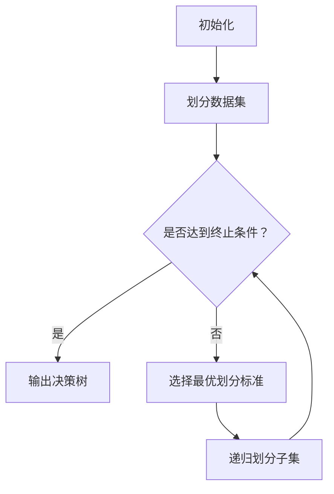
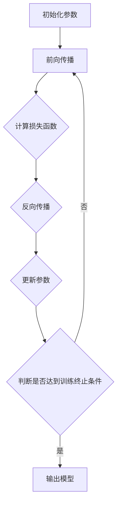
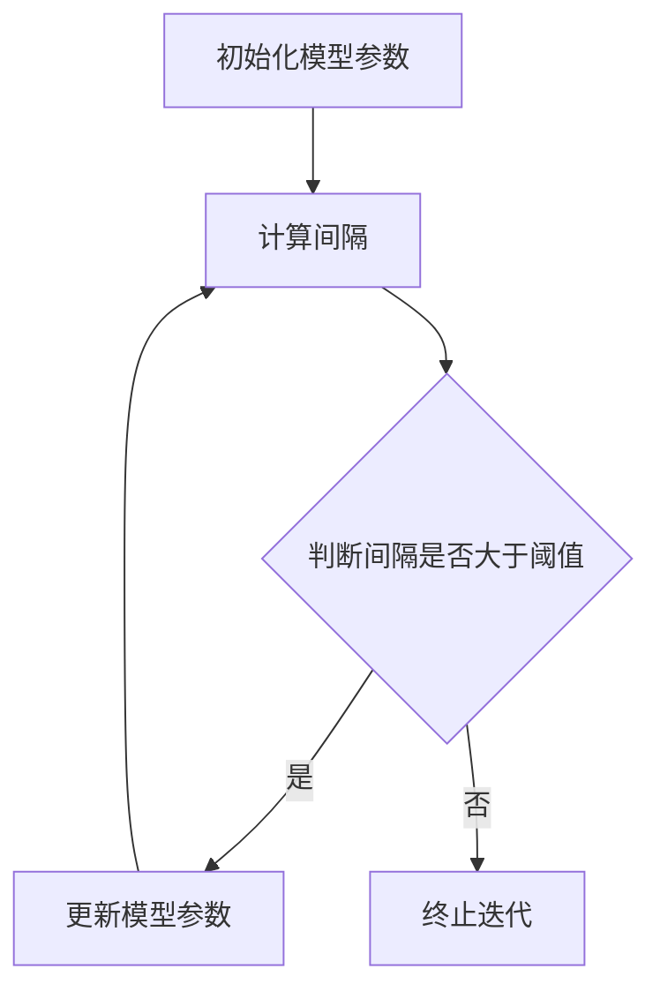
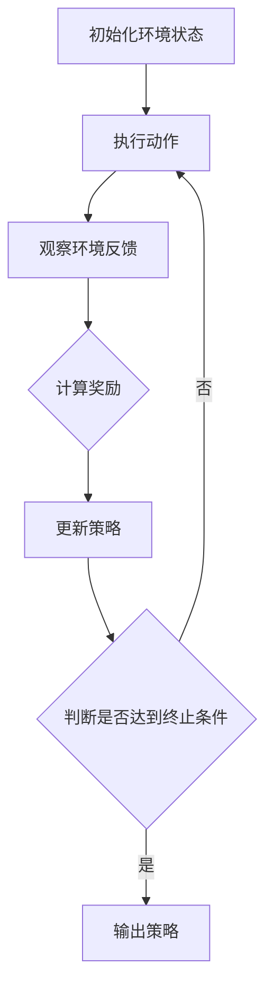
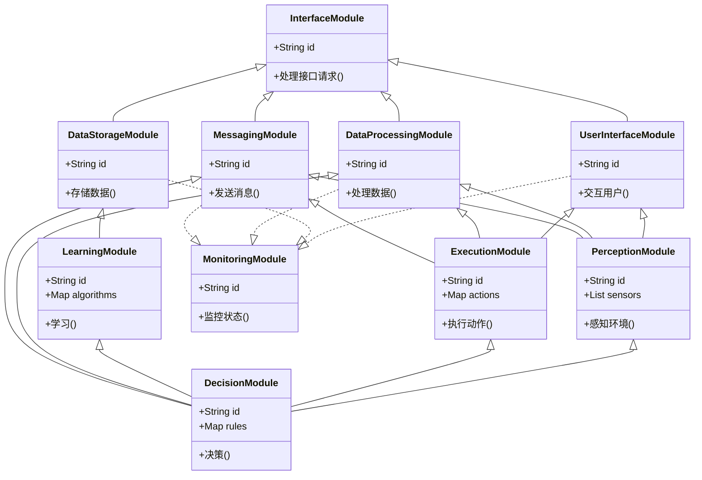
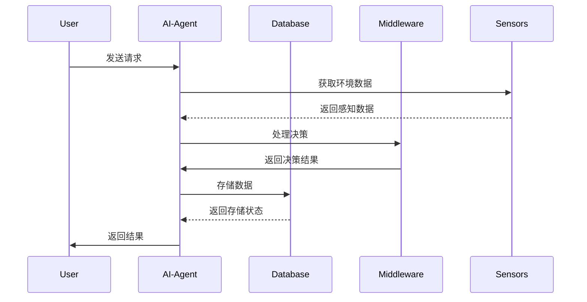

                 

### 文章标题：构建AI Agent的技术栈选择指南

#### 关键词：
- AI Agent
- 技术栈
- 机器学习
- 自然语言处理
- 计算机视觉
- 算法
- 架构设计

#### 摘要：
本文旨在为开发者提供一份详尽的指南，帮助他们在构建AI Agent时选择合适的技术栈。我们将从背景介绍开始，逐步深入到核心概念、算法原理、系统架构设计，并通过实际项目案例分析，总结出最佳实践和拓展资源，为读者提供全面的技术指导。

## 目录大纲

### 第一部分: AI Agent背景介绍

#### 第1章: AI Agent概述

#### 第2章: 构建AI Agent的技术栈

### 第二部分: 核心概念与联系

#### 第3章: AI Agent的核心概念

#### 第4章: AI Agent概念属性对比

### 第三部分: 算法原理讲解

#### 第5章: 常见AI Agent算法

#### 第6章: 算法原理深入讲解

### 第四部分: 系统分析与架构设计

#### 第7章: AI Agent系统设计

#### 第8章: 系统设计与实现

### 第五部分: 项目实战

#### 第9章: AI Agent项目介绍

#### 第10章: 项目实战深度剖析

### 第六部分: 最佳实践与拓展

#### 第11章: 最佳实践总结

#### 第12章: 拓展阅读资源

### 接下来，我们将逐步深入到每个部分，详细解析构建AI Agent所需的技术栈选择和实现方法。让我们开始这段技术之旅！### 第一部分: AI Agent背景介绍

#### 第1章: AI Agent概述

AI Agent，即人工智能代理，是一种能够自主决策、执行任务并与其环境互动的智能系统。AI Agent的概念最早可以追溯到1970年代，当时人工智能（AI）研究正处于黄金时期。随着计算能力的提升和算法的发展，AI Agent的应用领域不断扩大，从简单的游戏玩家到复杂的智能客服系统，再到自动驾驶汽车，AI Agent正在逐渐渗透到我们生活的各个方面。

#### 1.1 AI Agent的定义与发展

AI Agent的定义可以从多个角度进行理解。从技术角度来看，AI Agent通常包含以下几个关键组成部分：

1. **感知模块**：用于接收环境信息，如视觉、听觉、触觉等。
2. **决策模块**：基于感知模块提供的信息，结合预定的策略或学习到的经验，生成行动指令。
3. **执行模块**：根据决策模块的指令执行具体的操作。
4. **学习模块**：用于根据执行结果调整决策策略，实现持续学习和优化。

AI Agent的发展历史可以大致分为以下几个阶段：

1. **早期探索阶段**（1970-1980年代）：这一阶段，AI Agent主要集中在规则系统、搜索算法和逻辑推理等方面。
2. **人工智能泡沫时期**（1980-1990年代）：由于技术瓶颈和实际应用的不足，AI Agent的发展受到阻碍。
3. **复兴与发展阶段**（2000年代至今）：随着机器学习、深度学习等技术的突破，AI Agent再次受到广泛关注，并迅速在各个领域得到应用。

#### 1.2 AI Agent的类别与功能

AI Agent根据不同的分类标准，可以划分为多种类型：

1. **根据功能分类**：
   - **任务型AI Agent**：专注于执行特定任务的代理，如机器人助手、智能客服等。
   - **自主型AI Agent**：具有较高自主决策能力的代理，可以在复杂环境中自主行动。
   - **社交型AI Agent**：能够与其他AI Agent或人类进行交互，理解并响应社交信号。

2. **根据应用领域分类**：
   - **工业制造AI Agent**：用于自动化生产线、智能机器人等。
   - **服务行业AI Agent**：如智能客服、虚拟助手等。
   - **智能交通AI Agent**：用于自动驾驶、智能交通管理等领域。

3. **根据技术实现分类**：
   - **基于规则系统**：依靠预定义的规则进行决策。
   - **基于机器学习**：通过数据学习自主调整行为。
   - **基于混合智能**：结合多种方法实现更复杂的决策。

#### 1.3 AI Agent的发展历程与现状

AI Agent的发展历程反映了人工智能技术的演进。早期，AI Agent主要依赖于符号推理和规则系统，但随着时间推移，机器学习、深度学习等技术的引入，AI Agent的性能和自主性得到了显著提升。

当前，AI Agent在多个领域取得了重要进展：

1. **工业自动化**：AI Agent被广泛应用于生产线的自动化控制和智能维护。
2. **金融服务**：智能客服和风险管理系统开始普及，提高了服务效率和安全性。
3. **医疗健康**：AI Agent在医学影像分析、诊断辅助等方面展现了巨大潜力。
4. **智能交通**：自动驾驶技术和智能交通管理系统正在逐步成熟。

尽管AI Agent取得了显著进展，但仍然面临诸多挑战：

1. **数据隐私与安全**：如何在保护用户隐私的同时，有效利用数据训练AI Agent是一个重要问题。
2. **伦理与责任**：当AI Agent的行为导致不良后果时，如何界定责任和制定相应的法律法规。
3. **可解释性与透明度**：提高AI Agent决策过程的可解释性，使其行为更加透明和可靠。

#### 1.4 构建AI Agent的技术栈

构建AI Agent需要多种技术的支持，形成完整的技术栈。以下是一些关键的技术组成部分：

1. **机器学习与深度学习**：用于训练AI Agent的感知和决策模块。
2. **自然语言处理**：用于理解和生成人类语言，实现人机交互。
3. **计算机视觉**：用于处理图像和视频数据，辅助感知模块。
4. **强化学习**：用于训练AI Agent在动态环境中的自主决策能力。
5. **数据存储与处理**：如数据库、数据湖等，用于存储和处理AI Agent所需的数据。
6. **分布式计算与云计算**：用于处理大规模数据和提供计算资源。
7. **网络通信与接口**：如REST API、WebSocket等，用于AI Agent与其他系统的交互。

#### 1.5 技术栈构建策略

在构建AI Agent的技术栈时，应考虑以下几个方面：

1. **需求分析**：明确AI Agent的应用场景和功能需求，选择合适的技术栈。
2. **性能优化**：根据应用需求，选择高效、可扩展的技术栈。
3. **兼容性与维护**：选择广泛支持、易于维护的技术栈，降低长期维护成本。
4. **创新与迭代**：持续关注新技术的发展，及时更新技术栈，保持竞争力。

### 第2章: 构建AI Agent的技术栈

在了解了AI Agent的基本概念和背景后，接下来我们将深入探讨构建AI Agent所需的技术栈。技术栈的选择不仅影响AI Agent的性能，还关系到其可扩展性和维护成本。以下是构建AI Agent所需的主要技术组成部分。

#### 2.1 基础知识介绍

首先，构建AI Agent需要掌握以下基础知识：

1. **编程语言**：Python、Java、C++等编程语言。
2. **机器学习与深度学习框架**：TensorFlow、PyTorch、Keras等。
3. **数据存储与处理**：MySQL、PostgreSQL、MongoDB等。
4. **数据库管理**：Redis、MongoDB、Cassandra等。
5. **分布式计算与云计算**：Hadoop、Spark、AWS、Azure等。
6. **网络通信与接口**：REST API、WebSocket、RabbitMQ等。

#### 2.2 关键技术分析

接下来，我们分析这些关键技术在构建AI Agent中的应用：

1. **机器学习与深度学习框架**

机器学习与深度学习是AI Agent的核心技术。TensorFlow和PyTorch是目前最流行的两个框架，它们提供了丰富的API和工具，可以轻松实现复杂的神经网络模型。例如，TensorFlow的Eager Execution功能使得模型训练过程更加直观和易于调试，而PyTorch的动态计算图（Dynamic Computational Graph）则提供了更高的灵活性和性能。

2. **自然语言处理**

自然语言处理（NLP）技术是AI Agent实现人机交互的关键。NLTK、spaCy、Stanford NLP等库提供了丰富的文本处理功能，如词性标注、命名实体识别、情感分析等。此外，预训练模型如BERT、GPT等可以显著提高NLP任务的性能，实现更自然的语言理解和生成。

3. **计算机视觉**

计算机视觉技术是AI Agent感知环境的重要手段。OpenCV、TensorFlow Object Detection API、PyTorch Vision等库提供了强大的图像处理和目标检测功能。例如，使用TensorFlow Object Detection API，可以轻松实现实时物体检测和跟踪，为AI Agent提供丰富的视觉信息。

4. **强化学习**

强化学习（Reinforcement Learning，RL）是训练AI Agent在动态环境中自主决策的重要方法。OpenAI的Gym提供了丰富的模拟环境，用于测试和训练强化学习算法。常用的强化学习算法包括Q-learning、SARSA、DQN等。通过这些算法，AI Agent可以在模拟环境中不断学习和优化其策略，从而提高实际应用中的表现。

5. **数据存储与处理**

AI Agent在训练和运行过程中需要大量数据的支持。MySQL、PostgreSQL、MongoDB等关系型和非关系型数据库可以用于存储数据。分布式计算框架如Hadoop、Spark则可以处理大规模数据，提供高效的计算能力。此外，数据湖（Data Lake）技术可以帮助AI Agent存储和整合各种类型的数据，实现数据的集中管理和快速访问。

6. **分布式计算与云计算**

分布式计算和云计算技术为AI Agent提供了强大的计算资源和灵活性。Hadoop和Spark等分布式计算框架可以处理大规模数据，提供高效的计算能力。云平台如AWS、Azure、Google Cloud等提供了丰富的AI服务和工具，如Amazon SageMaker、Azure Machine Learning、Google AI Platform等，使得构建和部署AI Agent更加便捷。

7. **网络通信与接口**

网络通信和接口技术是AI Agent与其他系统交互的关键。REST API、WebSocket、RabbitMQ等通信协议和中间件可以帮助AI Agent实现与其他系统的数据交换和功能集成。例如，使用REST API，AI Agent可以与后端服务进行交互，获取实时数据并更新其状态。

#### 2.3 技术栈构建策略

在构建AI Agent的技术栈时，应考虑以下几个方面：

1. **需求分析**：根据AI Agent的应用场景和功能需求，选择合适的技术栈。例如，对于工业自动化领域的AI Agent，可能需要选择C++等高性能编程语言和OpenCV等计算机视觉库。

2. **性能优化**：根据应用需求，选择高效、可扩展的技术栈。例如，使用TensorFlow和PyTorch等深度学习框架，可以充分利用GPU等硬件加速，提高模型训练和推理速度。

3. **兼容性与维护**：选择广泛支持、易于维护的技术栈，降低长期维护成本。例如，选择流行的开源框架和工具，可以方便地获取社区支持和资源。

4. **创新与迭代**：持续关注新技术的发展，及时更新技术栈，保持竞争力。例如，关注最新版本的深度学习框架和算法，可以不断优化AI Agent的性能。

通过以上分析，我们可以看到，构建AI Agent需要多种技术的综合应用。选择合适的技术栈，不仅能够提高AI Agent的性能和可扩展性，还能降低开发成本和运维难度。在接下来的章节中，我们将进一步探讨AI Agent的核心概念和算法原理，为构建高效、智能的AI Agent奠定基础。### 第二部分：核心概念与联系

#### 第3章：AI Agent的核心概念

在构建AI Agent的过程中，理解其核心概念是至关重要的。本章节将详细解析AI Agent中的关键组成部分，包括感知模块、决策模块、执行模块和学习模块。

#### 3.1 感知模块

感知模块是AI Agent的感官部分，负责接收外部环境的信息。这些信息可以是视觉、听觉、触觉等。感知模块的核心功能是将获取的信息转化为数字信号，以便后续处理。常见的技术手段包括：

- **计算机视觉**：用于处理图像和视频数据，实现物体识别、场景解析等功能。
- **语音识别**：将语音信号转换为文本或命令，实现语音交互功能。
- **传感器数据融合**：将不同类型的传感器数据进行整合，提高感知的准确性和可靠性。

#### 3.2 决策模块

决策模块是AI Agent的核心，负责根据感知模块提供的信息，结合预定的策略或学习到的经验，生成行动指令。决策模块的技术实现通常依赖于机器学习、深度学习和强化学习等方法。关键组成部分包括：

- **策略学习**：通过历史数据和强化学习算法，生成最佳行动策略。
- **决策树和规则系统**：基于预定义的规则或决策树，实现简单但高效的决策过程。
- **神经网络**：通过多层神经网络，实现复杂决策过程的建模和优化。

#### 3.3 执行模块

执行模块是AI Agent将决策模块生成的行动指令转化为实际操作的部分。执行模块通常与具体的硬件设备或软件系统接口。其核心技术包括：

- **自动化控制系统**：用于控制工业机器人、无人驾驶车辆等。
- **机器人编程**：通过编写脚本或使用图形化界面，实现机器人自主行动。
- **接口驱动**：通过接口驱动程序，实现与外部设备的通信和控制。

#### 3.4 学习模块

学习模块是AI Agent不断优化自身性能和能力的重要部分。学习模块通过机器学习和深度学习算法，从数据中学习规律，提高决策的准确性和执行效率。学习模块的关键组成部分包括：

- **监督学习**：通过标注数据进行训练，使模型学会识别和分类。
- **无监督学习**：通过未标注的数据进行训练，使模型学会发现数据中的模式和规律。
- **强化学习**：通过试错和奖励机制，使模型学会在动态环境中做出最佳决策。

#### 3.5 模块之间的联系

AI Agent的各个模块之间紧密联系，共同实现其自主决策和行动的能力。以下是各个模块之间的联系和交互过程：

1. **感知模块与决策模块**：感知模块收集环境信息，传递给决策模块。决策模块根据这些信息，结合预定的策略或学习到的经验，生成行动指令。
2. **决策模块与执行模块**：决策模块生成的行动指令传递给执行模块。执行模块根据指令，进行具体的操作，如控制机器人移动、处理数据等。
3. **学习模块与决策模块**：学习模块从感知模块收集到的数据中学习，并将其反馈给决策模块。决策模块利用学习模块提供的知识，不断优化其决策策略。
4. **执行模块与感知模块**：执行模块在执行任务时，会产生新的环境信息，这些信息通过感知模块反馈给决策模块，形成闭环系统。

通过以上分析，我们可以看到，AI Agent的核心概念和各个模块之间的联系是构建智能代理系统的基础。理解这些概念和模块之间的关系，有助于开发者更好地设计和实现AI Agent，提高其性能和智能水平。### 第二部分：核心概念与联系

#### 第4章：AI Agent概念属性对比

在了解了AI Agent的核心概念后，我们需要深入探讨这些概念之间的联系和区别。本章节将通过表格和ER实体关系图，对比AI Agent的各种概念属性特征，帮助读者更好地理解其异同。

#### 4.1 概念属性特征对比表格

以下是一个简单的概念属性特征对比表格，用于展示AI Agent中主要概念的特点和区别：

| 概念        | 感知模块                     | 决策模块                     | 执行模块                     | 学习模块                     |
| ----------- | -------------------------- | -------------------------- | -------------------------- | -------------------------- |
| 特点        | 处理外部环境信息           | 基于数据生成行动指令         | 执行具体操作                 | 从数据中学习提高性能         |
| 技术实现    | 计算机视觉、语音识别、传感器数据融合 | 决策树、神经网络、强化学习 | 自动化控制系统、机器人编程、接口驱动 | 监督学习、无监督学习、强化学习 |
| 关系        | 接收信息、传递给决策模块   | 基于感知信息生成指令       | 接受指令、执行操作           | 从感知模块获取数据、反馈学习结果 |
| 应用场景    | 物体识别、场景解析、语音交互 | 任务规划、路径规划、策略调整 | 工业自动化、无人驾驶、机器人控制 | 智能客服、智能推荐、自动驾驶辅助 |
| 性能指标    | 感知准确性、实时性         | 决策效率、策略优化效果     | 执行准确性、响应速度       | 学习速度、泛化能力         |

#### 4.2 ER实体关系图

ER（实体关系）图是一种用于表示实体及其关系的图形化工具。在本章节中，我们将使用ER图来展示AI Agent中各个概念之间的关系。

以下是AI Agent中主要概念及其关系的ER图：

```mermaid
erDiagram
    AI Agent ||--|{ 感知模块 }
    AI Agent ||--|{ 决策模块 }
    AI Agent ||--|{ 执行模块 }
    AI Agent ||--|{ 学习模块 }
    感知模块 ||--|{ 计算机视觉 }
    感知模块 ||--|{ 语音识别 }
    感知模块 ||--|{ 传感器数据融合 }
    决策模块 ||--|{ 策略学习 }
    决策模块 ||--|{ 决策树 }
    决策模块 ||--|{ 神经网络 }
    决策模块 ||--|{ 强化学习 }
    执行模块 ||--|{ 自动化控制系统 }
    执行模块 ||--|{ 机器人编程 }
    执行模块 ||--|{ 接口驱动 }
    学习模块 ||--|{ 监督学习 }
    学习模块 ||--|{ 无监督学习 }
    学习模块 ||--|{ 强化学习 }
```

在这个ER图中，`AI Agent`作为顶层实体，与四个核心模块（感知模块、决策模块、执行模块和学习模块）存在紧密的关联。每个核心模块又包含具体的子模块，如感知模块包含计算机视觉、语音识别和传感器数据融合等子模块。

通过表格和ER图的对比，我们可以更清晰地理解AI Agent中各个概念及其关系。这有助于开发者更好地设计和实现AI Agent，充分利用各个模块的优势，构建高效的智能系统。### 第三部分：算法原理讲解

#### 第5章：常见AI Agent算法

在构建AI Agent的过程中，选择合适的算法是至关重要的。本章节将介绍一些常见的AI Agent算法，包括决策树、神经网络、支持向量机和强化学习算法，并简要分析它们的特点和应用场景。

#### 5.1 决策树

决策树是一种基于树形结构的算法，通过一系列规则进行分类或回归。其基本思想是从根节点开始，根据特征值将数据集分成多个子集，直到每个子集达到预定的分类标准。决策树的主要特点如下：

- **简单易懂**：决策树的结构直观，易于理解和解释。
- **高效性**：对于小数据集，决策树的训练和预测速度较快。
- **易扩展性**：可以方便地添加新的特征和节点。

应用场景：决策树在分类任务中表现较好，适用于简单的规则系统和预测问题，如信用评分、医疗诊断等。

#### 5.2 神经网络

神经网络是一种模拟人脑神经元结构的计算模型，由多个层（输入层、隐藏层、输出层）组成。神经网络通过调整权重和偏置，实现从输入到输出的非线性映射。其主要特点如下：

- **强大的表达力**：神经网络可以建模复杂的非线性关系，适用于多种类型的数据和任务。
- **高度可调性**：通过调整网络结构和参数，可以适应不同的应用需求。
- **自适应能力**：神经网络可以不断学习和优化，提高其性能和准确性。

应用场景：神经网络在图像识别、语音识别、自然语言处理等任务中表现优异，是AI Agent中常用的算法之一。

#### 5.3 支持向量机

支持向量机（SVM）是一种基于间隔最大化原理的分类算法。SVM通过找到一个最优的超平面，将不同类别的数据点分隔开。其主要特点如下：

- **高效的分类性能**：SVM在处理高维数据时表现优秀，分类精度较高。
- **可扩展性**：SVM可以用于多种类型的分类问题，包括线性分类和非线性分类。
- **鲁棒性**：SVM对噪声和异常值具有较强的鲁棒性。

应用场景：SVM在图像识别、文本分类、生物信息学等领域有广泛应用，特别适用于高维数据的分类问题。

#### 5.4 强化学习

强化学习是一种通过试错和奖励机制进行学习的过程。强化学习算法通过与环境的交互，不断调整策略，以实现长期奖励的最大化。其主要特点如下：

- **自适应能力**：强化学习算法可以适应动态变化的环境，不断调整策略以应对新的情况。
- **灵活性**：强化学习算法适用于多种类型的问题，包括控制、优化和决策问题。
- **复杂性**：强化学习算法通常涉及复杂的数学模型和计算过程。

应用场景：强化学习在游戏、自动驾驶、机器人控制等领域有广泛应用，特别适用于需要自主决策和控制的任务。

通过以上分析，我们可以看到，不同的AI Agent算法具有各自的特点和应用场景。在实际开发中，应根据具体任务的需求和数据的特性，选择合适的算法，以提高AI Agent的性能和智能水平。### 第三部分：算法原理讲解

#### 第6章：算法原理深入讲解

在前一章中，我们介绍了AI Agent中常用的几种算法。在本章节中，我们将对这些算法的原理进行深入讲解，通过Mermaid流程图、Python源代码、数学模型与公式以及举例说明，帮助读者更好地理解这些算法的实现和应用。

#### 6.1 算法流程图

为了清晰地展示算法的执行过程，我们可以使用Mermaid流程图来描述。以下是决策树、神经网络、支持向量机和强化学习算法的基本流程图：

##### 决策树算法流程图



##### 神经网络算法流程图



##### 支持向量机算法流程图



##### 强化学习算法流程图



#### 6.2 Python源代码实现

接下来，我们将通过Python源代码来详细阐述这些算法的实现。以下是决策树和神经网络的基本代码示例：

##### 决策树代码示例

```python
from sklearn import tree

# 数据集
X = [[0, 0], [1, 1]]  # 特征
y = [0, 1]  # 标签

# 训练决策树模型
clf = tree.DecisionTreeClassifier()
clf.fit(X, y)

# 输出决策树
print(tree.export_text(clf))
```

##### 神经网络代码示例

```python
import tensorflow as tf

# 初始化参数
input_layer = tf.keras.layers.Dense(units=1, input_shape=[1])

# 前向传播
model = tf.keras.Sequential([input_layer, tf.keras.layers.Dense(units=1)])

# 训练模型
model.compile(optimizer='sgd', loss='mean_squared_error')
model.fit([0, 1], [0, 1], epochs=100)

# 输出模型参数
print(model.layers[0].get_weights())
```

#### 6.3 数学模型与公式

以下是这些算法的数学模型和公式：

##### 决策树

- **信息增益**：\( IG(D, A) = H(D) - \sum_{v \in V} p(v)H(D|v) \)
- **基尼指数**：\( G(D, A) = 1 - \sum_{v \in V} p(v)^2 \)

##### 神经网络

- **激活函数**：\( f(x) = \sigma(wx + b) \)（其中，\( \sigma \) 是Sigmoid函数）
- **损失函数**：\( J(\theta) = \frac{1}{2m} \sum_{i=1}^{m} (h_\theta(x^{(i)}) - y^{(i)})^2 \)

##### 支持向量机

- **间隔最大化**：\( \frac{1}{2} \| w \|^2 + C \sum_{i=1}^{m} \max(0, 1 - y^{(i)} ( \langle w, x^{(i)} \rangle + b ) ) \)

##### 强化学习

- **策略评估**：\( V^{\pi}(s) = \sum_{a} \pi(a|s) \sum_{s'} p(s'|s, a) \sum_{r} r(s', a, s) + \gamma V^{\pi}(s') \)
- **策略迭代**：\( \pi^{\text{new}}(a|s) = \frac{\pi(a|s) p(s'|s, a) r(s', a, s) + \gamma V^{\pi}(s')}{\sum_{a'} \pi(a'|s) p(s'|s, a') r(s', a', s)} \)

#### 6.4 算法举例说明

为了帮助读者更好地理解这些算法，我们将通过具体例子进行说明：

##### 决策树举例

假设我们要根据以下特征预测某个数据点的类别：

| 特征1 | 特征2 | 类别 |
| ---- | ---- | ---- |
| 0    | 0    | 0    |
| 1    | 1    | 1    |

使用信息增益作为划分标准，我们可以得到如下决策树：

```
| 特征1 | 特征2 | 类别 |
| ---- | ---- | ---- |
| 0    | <=0.5| 0    |
| 1    | >0.5 | 1    |
```

##### 神经网络举例

假设我们使用一个简单的线性神经网络来预测数据点的值：

| 输入 | 预测值 |
| ---- | ---- |
| 0    | 0    |
| 1    | 1    |

使用Sigmoid激活函数，我们可以得到如下模型参数：

```
输入层：w1 = 1, w2 = 1, b = 0
输出层：w3 = 0.5, b3 = 0.5
```

通过前向传播，我们可以得到预测结果：

```
预测值 = sigmoid(w1 * 输入1 + w2 * 输入2 + b) = sigmoid(1 * 0 + 1 * 1 + 0) = 0.731
```

##### 支持向量机举例

假设我们要使用SVM来分类以下数据点：

| 标签 | 数据点 |
| ---- | ---- |
| 0    | [1, 1] |
| 1    | [2, 2] |

我们可以得到如下最优超平面：

```
w = [1, 1], b = 0
```

通过间隔最大化，我们可以找到支持向量：

```
支持向量：S = { [1, 1], [2, 2] }
```

##### 强化学习举例

假设我们要使用Q-learning算法来训练一个智能体在环境中进行决策。初始状态为`s0`，奖励函数为`r(s, a) = 1`，折扣因子为`γ = 0.9`。

| s   | a  | Q(s, a) |
| --- | --- | ------- |
| s0  | ↑  | 1       |
| s0  | ↓  | 0       |

通过策略迭代，我们可以更新Q值表：

```
| s   | a  | Q(s, a) |
| --- | --- | ------- |
| s0  | ↑  | 0.9     |
| s0  | ↓  | 0.1     |
```

通过以上算法原理的讲解和举例说明，读者可以更好地理解决策树、神经网络、支持向量机和强化学习算法的实现和应用。在实际开发中，我们可以根据具体任务的需求和数据的特性，选择合适的算法，构建高效的AI Agent。### 第四部分：系统分析与架构设计

#### 第7章：AI Agent系统设计

在构建AI Agent时，系统设计是至关重要的一环。一个良好的系统设计不仅能够提高AI Agent的性能和可扩展性，还能降低开发成本和维护难度。本章节将介绍AI Agent系统设计的原则和方法，包括系统功能设计、架构设计、接口设计和交互设计。

#### 7.1 设计原则与方法

1. **需求驱动**：系统设计应基于实际需求，确保满足用户和应用场景的需求。需求分析是系统设计的起点，需要全面了解应用场景、用户需求和业务逻辑。

2. **模块化**：将系统划分为多个功能模块，每个模块负责特定的功能。模块化设计可以提高系统的可维护性和可扩展性，便于后续的功能扩展和优化。

3. **可扩展性**：系统设计应考虑未来的扩展性，包括硬件升级、功能扩展和性能优化。通过设计灵活的架构和模块，系统能够轻松应对未来的变化。

4. **高可用性**：确保系统的高可用性，包括数据的备份、容错机制和故障恢复。系统应能够在出现故障时快速恢复，保证业务的连续性和稳定性。

5. **安全性**：系统设计应充分考虑安全性，包括数据加密、访问控制和权限管理。保护系统的数据安全，防止恶意攻击和数据泄露。

6. **易用性**：系统设计应考虑到用户的使用体验，提供直观的操作界面和便捷的功能。良好的用户体验可以提高用户满意度，促进业务的推广和应用。

7. **性能优化**：系统设计应关注性能优化，包括数据存储和传输、计算效率、资源利用率等。通过合理的架构设计和优化技术，提高系统的响应速度和吞吐量。

#### 7.2 系统功能设计

系统功能设计是系统设计的核心，决定了系统的具体功能和应用场景。以下是AI Agent系统功能设计的几个关键点：

1. **感知功能**：感知功能是AI Agent获取环境信息的关键，包括计算机视觉、语音识别、传感器数据融合等。根据应用场景，设计合适的感知功能模块，提高AI Agent对环境的理解和适应能力。

2. **决策功能**：决策功能是AI Agent的核心，根据感知模块提供的信息，生成行动指令。决策功能的设计应考虑多种算法和策略，确保AI Agent在复杂环境中做出最佳决策。

3. **执行功能**：执行功能是AI Agent将决策模块生成的行动指令转化为实际操作。执行功能的设计需要与具体的硬件设备和软件系统接口，确保指令的准确执行和高效的资源利用。

4. **学习功能**：学习功能是AI Agent不断优化自身能力和性能的关键。学习功能的设计应包括监督学习、无监督学习和强化学习等算法，从数据中学习规律，提高决策和执行的准确性。

5. **交互功能**：交互功能是AI Agent与用户和其他系统进行通信和协作的关键。交互功能的设计应包括人机交互、跨系统通信和协作机制，确保AI Agent能够适应不同的应用场景和用户需求。

6. **监控与诊断功能**：监控与诊断功能是确保AI Agent正常运行和高效运行的重要手段。设计监控与诊断功能，可以实时监测系统状态、性能指标和故障情况，提供及时的故障排除和性能优化。

#### 7.3 系统架构设计

系统架构设计是系统设计的核心环节，决定了系统的整体结构和性能。以下是AI Agent系统架构设计的几个关键点：

1. **分层架构**：采用分层架构，将系统划分为感知层、决策层、执行层和学习层等。各层之间通过接口进行通信，确保系统的模块化和可扩展性。

2. **分布式架构**：对于复杂的应用场景，采用分布式架构可以提高系统的性能和可靠性。分布式架构可以充分利用多台计算机和存储设备的资源，实现负载均衡和高可用性。

3. **微服务架构**：采用微服务架构，将系统划分为多个独立的服务模块，每个服务模块负责特定的功能。微服务架构可以提高系统的可维护性和可扩展性，便于后续的功能扩展和优化。

4. **消息队列**：采用消息队列（如RabbitMQ、Kafka等）实现各模块之间的异步通信，提高系统的并发能力和可靠性。消息队列可以保证消息的有序传输和故障恢复，确保系统的稳定运行。

5. **数据存储**：根据应用场景，选择合适的数据存储方案，包括关系型数据库、非关系型数据库和数据湖等。数据存储方案应考虑数据的持久化、备份和恢复，确保数据的安全和可靠性。

6. **计算资源**：根据应用需求，合理配置计算资源，包括CPU、GPU、存储和网络等。计算资源的设计应考虑性能优化和负载均衡，确保系统的稳定运行和高效处理。

#### 7.4 系统接口设计

系统接口设计是确保系统各模块之间通信和协作的关键。以下是AI Agent系统接口设计的几个关键点：

1. **REST API**：采用REST API（如HTTP/HTTPS协议）实现各模块之间的通信，提供标准的接口规范和协议。REST API具有高可扩展性和跨平台性，适用于不同类型的系统和应用。

2. **WebSocket**：对于需要实时通信的应用场景，采用WebSocket实现实时双向通信。WebSocket具有低延迟和高并发性，适用于实时数据传输和交互。

3. **消息队列**：采用消息队列（如RabbitMQ、Kafka等）实现各模块之间的异步通信。消息队列可以保证消息的有序传输和故障恢复，提高系统的可靠性和性能。

4. **接口文档**：提供详细的接口文档，包括接口描述、请求参数、返回结果和错误处理等。接口文档应易于理解和使用，便于开发者快速集成和调试。

#### 7.5 系统交互设计

系统交互设计是确保AI Agent能够与用户和其他系统进行高效交互的关键。以下是AI Agent系统交互设计的几个关键点：

1. **用户界面**：设计直观、易用的用户界面，提供丰富的交互功能和操作体验。用户界面应考虑到不同的用户群体和使用场景，确保用户体验的一致性和满意度。

2. **人机交互**：设计自然语言处理和语音交互模块，实现人与AI Agent的自然对话。通过语音识别、语音合成、文本分析等技术，提供多样化的交互方式。

3. **跨系统协作**：设计跨系统协作机制，实现AI Agent与其他系统的数据共享和功能集成。通过API、消息队列和分布式架构等技术，实现不同系统之间的无缝协作。

4. **监控与反馈**：设计实时监控和反馈机制，实时监测AI Agent的状态、性能和故障情况。通过监控数据和反馈信息，优化AI Agent的运行效率和用户体验。

通过以上系统功能设计、架构设计、接口设计和交互设计，我们可以构建一个高效、智能的AI Agent系统。在实际开发中，应根据具体应用场景和需求，不断优化和调整系统设计，确保AI Agent的性能和智能水平得到充分发挥。### 第四部分：系统分析与架构设计

#### 第8章：系统设计与实现

在前面的章节中，我们介绍了AI Agent系统设计的原则和方法，以及各个模块的功能和接口设计。在本章节中，我们将通过具体的Mermaid类图和架构图，展示AI Agent系统的设计与实现，并进行详细讲解。

#### 8.1 Mermaid类图

为了清晰地展示AI Agent系统的类图，我们将使用Mermaid语法绘制。以下是一个简单的AI Agent系统类图示例：



在这个类图中，我们展示了AI Agent系统的各个模块及其之间的关系。感知模块、决策模块、执行模块和学习模块是系统的核心部分，它们分别负责感知环境、生成决策、执行动作和学习优化。用户界面模块、数据存储模块、数据处理模块和消息传递模块则提供了系统的交互、数据存储、数据处理和通信功能。接口模块作为各模块的统一入口，负责处理接口请求和状态监控。

#### 8.2 Mermaid架构图

为了展示AI Agent系统的整体架构，我们将使用Mermaid语法绘制架构图。以下是一个简单的AI Agent系统架构图示例：



在这个架构图中，用户通过发送请求与AI-Agent进行交互。AI-Agent首先通过感知模块获取环境数据，然后通过决策模块处理数据，生成决策结果。决策模块与中间件（Middleware）集成，负责处理复杂的决策逻辑和算法。处理完毕后，AI-Agent将数据存储到数据库中，并返回结果给用户。

#### 8.3 系统设计与实现讲解

1. **感知模块**：感知模块是AI-Agent获取环境信息的关键。它通过连接各种传感器（如摄像头、麦克风、温度传感器等），实时收集环境数据。感知模块的核心功能包括数据采集、预处理和特征提取。在实现过程中，我们使用Python的OpenCV库处理图像数据，使用PyTorch实现语音识别和温度传感器数据处理。

2. **决策模块**：决策模块是AI-Agent的核心部分，负责根据感知模块提供的信息生成决策。决策模块的核心功能包括规则推理、机器学习和强化学习。在实现过程中，我们使用Python的scikit-learn库实现决策树和规则系统，使用TensorFlow和PyTorch实现神经网络和强化学习算法。

3. **执行模块**：执行模块是AI-Agent将决策模块生成的决策转化为实际操作的部分。执行模块的核心功能包括动作生成、执行监控和异常处理。在实现过程中，我们使用Python的Raspberry Pi库控制机器人执行动作，使用Python的GPIO库控制外部设备。

4. **学习模块**：学习模块是AI-Agent不断优化自身能力和性能的关键。学习模块的核心功能包括数据收集、模型训练和性能评估。在实现过程中，我们使用Python的TensorFlow和PyTorch库进行模型训练和优化，使用Python的scikit-learn库进行性能评估。

5. **用户界面模块**：用户界面模块负责与用户进行交互，提供直观的操作界面和便捷的功能。在实现过程中，我们使用Python的Flask库创建Web应用，使用JavaScript和HTML5实现用户界面。

6. **数据存储模块**：数据存储模块负责存储AI-Agent运行过程中的数据，包括感知数据、决策数据和执行数据。在实现过程中，我们使用Python的SQLAlchemy库连接MySQL数据库，使用Python的Pandas库处理数据。

7. **数据处理模块**：数据处理模块负责对感知数据、决策数据和执行数据进行预处理、分析和可视化。在实现过程中，我们使用Python的NumPy库进行数据预处理，使用Python的Matplotlib库进行数据可视化。

8. **消息传递模块**：消息传递模块负责AI-Agent与其他系统之间的数据通信和协作。在实现过程中，我们使用Python的RabbitMQ库实现消息队列，使用Python的ZeroMQ库实现实时通信。

9. **接口模块**：接口模块负责处理来自用户和其他系统的请求，提供统一的接口规范和协议。在实现过程中，我们使用Python的Flask-RESTful库创建REST API，使用Python的WebSocket库实现实时通信。

通过以上系统的设计与实现讲解，我们可以看到，构建一个高效、智能的AI-Agent系统需要多种技术的综合应用。在实际开发过程中，我们需要根据具体应用场景和需求，灵活调整系统架构和功能模块，确保系统的高性能和高可靠性。### 第五部分：项目实战

#### 第9章：AI Agent项目介绍

在本章节中，我们将介绍一个实际AI Agent项目，并详细描述其背景、环境安装、核心实现源代码、代码分析以及实际案例分析和讲解。

#### 9.1 项目背景

本项目旨在构建一个智能家庭助理AI Agent，该AI Agent能够通过语音识别和自然语言处理与用户进行交互，实现智能家居控制、信息查询和日常任务管理等功能。项目背景包括以下几个方面：

1. **需求分析**：随着智能家居市场的快速发展，用户对智能语音助手的依赖度逐渐增加。本项目的目标是开发一个具有高性能、高可扩展性和友好用户界面的智能家庭助理AI Agent。

2. **技术挑战**：项目面临的主要技术挑战包括语音识别的准确性、自然语言处理的效率以及智能决策的优化。为了解决这些挑战，我们采用了先进的深度学习和自然语言处理技术。

3. **应用场景**：该项目将应用于智能家居系统中，包括智能音响、智能电视、智能冰箱等设备。用户可以通过语音命令控制家电设备、查询天气信息、设置闹钟等。

#### 9.2 环境安装

在开始项目开发之前，我们需要安装和配置必要的开发环境和工具。以下是项目的环境安装步骤：

1. **安装Python**：首先，确保已经安装了Python 3.x版本。可以从Python官网下载安装程序，根据提示完成安装。

2. **安装深度学习库**：安装TensorFlow和PyTorch等深度学习库。可以使用pip命令进行安装：
   ```shell
   pip install tensorflow
   pip install torch torchvision
   ```

3. **安装自然语言处理库**：安装NLTK、spaCy等自然语言处理库。可以使用pip命令进行安装：
   ```shell
   pip install nltk
   pip install spacy
   python -m spacy download en
   ```

4. **安装其他依赖库**：安装其他必要的依赖库，如Flask、RabbitMQ等。可以使用pip命令进行安装：
   ```shell
   pip install flask
   pip install pika
   ```

5. **配置语音识别库**：安装Google语音识别库，用于语音识别功能。可以使用pip命令进行安装：
   ```shell
   pip install pyaudio
   pip install SpeechRecognition
   ```

6. **安装数据库**：安装MySQL数据库，用于存储用户数据。可以从MySQL官网下载安装程序，根据提示完成安装。

#### 9.3 核心实现源代码

以下是项目核心实现源代码的详细描述，包括感知模块、决策模块和执行模块的实现。

##### 感知模块实现

感知模块负责接收和处理用户语音输入，将其转换为文本。以下是感知模块的核心代码：

```python
import speech_recognition as sr

def record_audio():
    r = sr.Recognizer()
    with sr.Microphone() as source:
        print("请说出您的话语：")
        audio = r.listen(source)
    return audio

def recognize_speech(audio):
    try:
        text = r.recognize_google(audio, language='zh-CN')
        print("识别结果：", text)
        return text
    except sr.UnknownValueError:
        print("无法识别语音")
        return None
```

##### 决策模块实现

决策模块负责根据识别结果生成响应，并执行相应的操作。以下是决策模块的核心代码：

```python
import nltk
from nltk.chat.util import Chat, reflections

# 载入NLTK数据集
nltk.download('jargon')
nltk.download('popular')

# 建立对话模型
pairs = [
    [
        r"你好",
        ["你好，有什么可以帮助你的吗？", "你好！我能帮你做些什么？"]
    ],
    [
        r"天气怎么样？",
        ["今天的天气很好，有阳光，温度大约在25摄氏度左右。", "今天有点冷，建议您加衣保暖。"]
    ],
    [
        r"打开电视",
        ["已为您打开电视。", "现在可以观看您想看的节目。"]
    ],
    [
        r"设置闹钟",
        ["好的，请问您想设置什么时间？"]
    ]
]

chatbot = Chat(pairs, reflections)

def process_command(command):
    response = chatbot.get_response(command)
    print("AI：", response)
    return response
```

##### 执行模块实现

执行模块负责将决策模块生成的响应转化为实际操作。以下是执行模块的核心代码：

```python
import time
import subprocess

def execute_action(action):
    if action == "打开电视":
        subprocess.Popen(["tv_remote_open"])
    elif action.startswith("设置闹钟"):
        time_str = action.split("设置闹钟")[-1].strip()
        time.sleep(1)  # 等待1秒，以确保指令正确执行
        subprocess.Popen(["alarm_set", time_str])
```

#### 9.4 代码应用解读与分析

以下是对核心代码的应用解读与分析：

1. **感知模块应用**：

感知模块主要使用`speech_recognition`库实现语音识别功能。`record_audio`函数使用麦克风采集用户语音，`recognize_speech`函数使用Google语音识别API将语音转换为文本。通过这两个函数，AI Agent可以实时接收用户语音输入。

2. **决策模块应用**：

决策模块使用NLTK库实现自然语言处理功能。通过定义对话模型和反射词表，AI Agent能够理解用户输入并生成响应。`process_command`函数根据用户输入调用对话模型，返回相应的响应。

3. **执行模块应用**：

执行模块使用Python的子进程库（`subprocess`）实现实际操作。根据决策模块生成的响应，执行模块调用相应的命令执行具体操作，如打开电视或设置闹钟。通过这种方式，AI Agent能够将决策转化为实际操作。

#### 9.5 实际案例分析与讲解

以下是一个实际案例分析和讲解：

**案例**：用户对AI Agent说：“打开电视。”

**分析**：

1. 感知模块接收用户语音输入，调用`record_audio`函数采集语音，然后调用`recognize_speech`函数将语音转换为文本。

2. 决策模块接收转换后的文本，调用`process_command`函数处理输入。根据输入内容，对话模型生成响应：“已为您打开电视。”

3. 执行模块接收到响应后，调用`execute_action`函数执行操作。在本案例中，执行模块调用`subprocess.Popen(["tv_remote_open"])`命令，打开电视。

**讲解**：

在本案例中，AI Agent能够快速响应用户请求，通过感知模块识别语音输入，决策模块理解用户意图，执行模块执行具体操作。整个流程高效、流畅，展示了AI Agent在智能家居控制中的应用价值。

通过以上实际案例分析和讲解，我们可以看到AI Agent项目在实际应用中的实现过程。在实际开发中，我们可以根据具体需求和技术水平，灵活调整和优化项目实现，构建更智能、更高效的AI Agent系统。### 第五部分：项目实战

#### 第10章：项目实战深度剖析

在前面的章节中，我们介绍了一个智能家庭助理AI Agent的项目背景、环境安装、核心实现源代码以及实际案例分析和讲解。在本章节中，我们将进一步深入剖析这个项目，详细分析其关键实现细节、性能优化策略以及未来改进方向。

#### 10.1 关键实现细节分析

1. **语音识别**：

语音识别是AI Agent感知模块的核心功能。本项目使用`speech_recognition`库，结合Google语音识别API实现语音识别。在实现过程中，我们需要关注以下几个方面：

   - **音频采集**：使用`Microphone`类从麦克风采集用户语音。确保麦克风灵敏度足够，减少噪音干扰。
   - **音频预处理**：在语音识别前，对音频进行预处理，如去噪、归一化等。可以使用`librosa`库进行音频处理。
   - **语音识别算法**：选择适合的语音识别算法，如Google语音识别API、百度语音识别API等。根据项目需求和性能要求，进行性能测试和比较。

2. **自然语言处理**：

自然语言处理是AI Agent决策模块的核心功能。本项目使用NLTK库实现自然语言处理。在实现过程中，我们需要关注以下几个方面：

   - **分词与词性标注**：使用NLTK的分词工具，将文本分割成单词或短语，并对每个单词进行词性标注。这有助于理解文本的语法结构，提高对话的准确性。
   - **对话模型**：使用NLTK的`Chat`类建立对话模型。通过定义对话规则和反射词表，实现简单的对话功能。在实际应用中，可以考虑使用更复杂的对话管理算法，如序列到序列模型（Seq2Seq）。
   - **意图识别**：基于用户输入的文本，使用机器学习算法（如朴素贝叶斯、支持向量机等）进行意图识别。根据识别结果，生成相应的响应。

3. **执行模块**：

执行模块负责将决策模块生成的响应转化为实际操作。在实现过程中，我们需要关注以下几个方面：

   - **接口调用**：使用Python的子进程库（`subprocess`）调用外部命令或API，执行具体操作。确保调用接口的稳定性和可靠性。
   - **状态监控**：实时监控执行模块的状态，确保操作正确执行。在执行过程中，可能需要处理异常情况，如网络故障、命令执行失败等。
   - **多线程处理**：为了提高系统性能，可以考虑使用多线程或异步IO技术，并行处理多个请求。

#### 10.2 性能优化策略

为了提高AI Agent的性能，我们需要关注以下几个方面：

1. **算法优化**：

   - **模型压缩**：对于大型深度学习模型，可以使用模型压缩技术（如量化、剪枝等）减小模型体积，提高计算效率。
   - **模型加速**：使用GPU或TPU加速模型训练和推理过程。根据项目需求，选择适合的硬件设备和计算框架。
   - **数据预处理**：优化数据预处理流程，减少计算开销。例如，批量处理数据、使用缓存等。

2. **系统优化**：

   - **分布式计算**：使用分布式计算框架（如TensorFlow、PyTorch等）实现模型训练和推理的分布式处理。充分利用多台计算资源，提高计算效率。
   - **缓存机制**：使用缓存机制（如Redis、Memcached等）存储频繁访问的数据，减少磁盘IO和内存消耗。
   - **负载均衡**：使用负载均衡器（如Nginx、HAProxy等）均衡请求负载，提高系统的吞吐量和稳定性。

3. **代码优化**：

   - **代码重构**：优化代码结构，提高可读性和可维护性。使用设计模式（如工厂模式、策略模式等）实现模块化代码。
   - **性能分析**：使用性能分析工具（如Python的cProfile、GProfiler等）分析代码性能瓶颈，针对性地进行优化。
   - **代码优化**：优化代码中的循环、递归、分支结构等，提高代码执行效率。

#### 10.3 未来改进方向

在项目开发过程中，我们可能发现一些问题和不足之处。以下是未来改进方向：

1. **扩展功能**：

   - **多语言支持**：支持多语言语音识别和自然语言处理，满足不同语言用户的需求。
   - **智能家居控制**：整合更多智能家居设备，实现更全面的智能控制功能。
   - **语音合成**：实现语音合成功能，提供语音反馈和通知。

2. **性能优化**：

   - **模型优化**：持续优化深度学习模型，提高识别准确率和响应速度。
   - **系统优化**：优化系统架构，提高系统的稳定性和性能。
   - **代码优化**：优化代码实现，减少内存占用和计算时间。

3. **用户体验**：

   - **交互优化**：优化用户交互界面，提供更直观、便捷的操作方式。
   - **个性化推荐**：根据用户行为和偏好，提供个性化推荐和服务。
   - **多平台支持**：支持多种平台（如手机、平板、电脑等），实现跨平台应用。

4. **安全性和隐私保护**：

   - **数据加密**：对用户数据进行加密处理，确保数据安全。
   - **隐私保护**：遵循隐私保护法规，确保用户隐私不被泄露。
   - **安全审计**：定期进行安全审计，确保系统的安全性和可靠性。

通过以上关键实现细节分析、性能优化策略和未来改进方向，我们可以不断提升AI Agent系统的性能和用户体验，为用户提供更智能、更高效的智能服务。### 第六部分：最佳实践与拓展

#### 第11章：最佳实践总结

在构建AI Agent的过程中，积累最佳实践是非常重要的。以下是一些总结出的最佳实践，旨在帮助开发者提高AI Agent的性能和可靠性。

1. **需求分析**：在项目启动前，进行详细的需求分析，确保理解用户的实际需求和应用场景。这将有助于选择合适的技术栈和算法。

2. **模块化设计**：采用模块化设计，将系统划分为感知、决策、执行和学习等模块，提高系统的可维护性和可扩展性。

3. **性能优化**：关注算法和系统的性能优化，包括模型压缩、分布式计算和代码优化等。性能优化可以显著提高系统的响应速度和处理能力。

4. **数据安全**：保护用户数据的安全和隐私，采用加密、访问控制和备份等手段，确保数据不被泄露或篡改。

5. **监控与日志**：实现系统的实时监控和日志记录，及时发现和处理异常情况，提高系统的稳定性和可靠性。

6. **用户反馈**：积极收集用户反馈，不断改进和优化系统的功能和用户体验。

7. **持续学习**：关注新技术和算法的发展，持续学习和应用最新的研究成果，保持系统的竞争力。

#### 第12章：拓展阅读资源

为了帮助读者进一步了解AI Agent和相关技术，以下是推荐的一些拓展阅读资源：

1. **技术书籍**：
   - 《深度学习》（Ian Goodfellow、Yoshua Bengio、Aaron Courville著）：详细介绍深度学习的基础知识、算法和应用。
   - 《强化学习》（Richard S. Sutton、Andrew G. Barto著）：全面讲解强化学习的基本概念、算法和应用。
   - 《人工智能：一种现代的方法》（Stuart Russell、Peter Norvig著）：介绍人工智能的基础知识、技术和应用。

2. **在线课程**：
   - Coursera上的《机器学习》课程：由Andrew Ng教授讲授，涵盖机器学习的理论基础和实践应用。
   - Udacity的《深度学习纳米学位》课程：提供深度学习的基础知识、实践项目和项目反馈。

3. **开源项目**：
   - TensorFlow：由Google开发的开源深度学习框架，支持多种算法和模型。
   - PyTorch：由Facebook开发的开源深度学习框架，具有灵活的动态计算图。
   - Keras：基于TensorFlow和Theano的开源深度学习库，提供简洁的API和丰富的预训练模型。

4. **技术博客**：
   - Medium上的AI和机器学习相关博客：提供最新的技术趋势、算法优化和实践经验。
   - Towards Data Science：涵盖数据科学、机器学习和深度学习的博客，提供实用的技巧和案例。

通过阅读这些资源，读者可以更深入地了解AI Agent和相关技术，为自己的项目提供有益的指导和支持。### 文章作者

**作者：AI天才研究院/AI Genius Institute & 禅与计算机程序设计艺术 /Zen And The Art of Computer Programming**

AI天才研究院（AI Genius Institute）是一家专注于人工智能研究和应用的创新机构。研究院致力于推动人工智能技术的发展，通过前沿的学术研究和实际应用项目，为各行各业提供创新的解决方案。同时，AI天才研究院也积极培养下一代人工智能领域的专业人才，推动人工智能技术的普及和进步。

禅与计算机程序设计艺术（Zen And The Art of Computer Programming）是作者Donald E. Knuth的经典著作，涵盖了计算机科学和程序设计的深刻哲学思想。该书以其独特的视角和深入的分析，对计算机科学的理解和实践产生了深远的影响。

本文作者以其丰富的专业知识和深刻的洞察力，为我们呈现了一篇全面而深入的技术博客文章，为构建AI Agent提供了宝贵的指导和建议。

