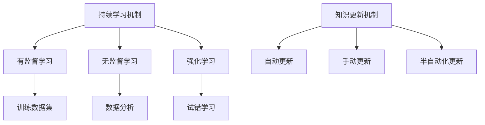
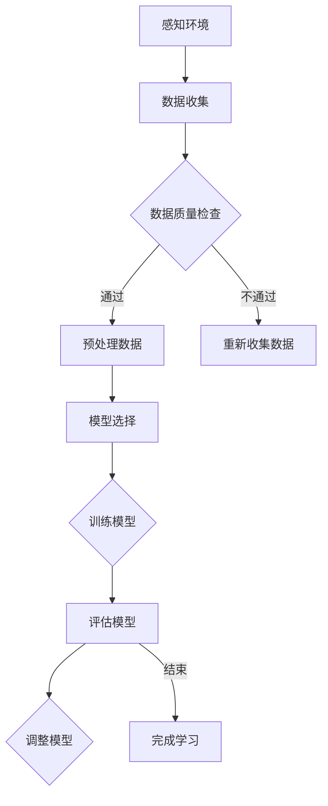
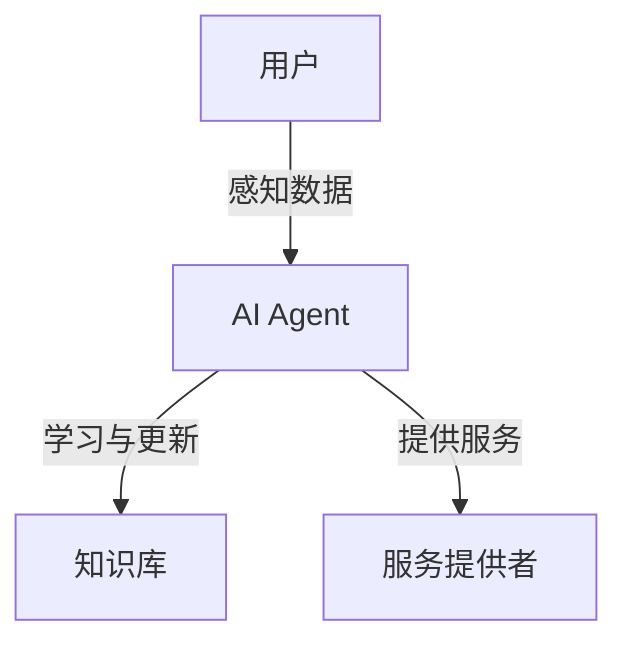
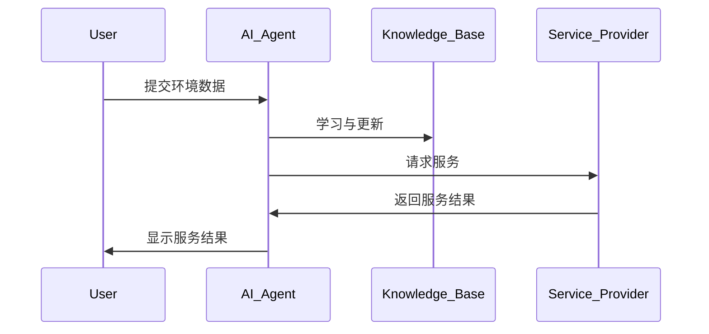

                 


# 构建 AI Agent 的持续学习与知识更新机制

## 关键词

- AI Agent
- 持续学习
- 知识更新
- 机器学习
- 知识表示
- 系统架构

## 摘要

本文将探讨构建 AI Agent 的持续学习与知识更新机制。AI Agent 作为人工智能的核心组成部分，需要具备持续学习与知识更新能力，以适应不断变化的环境和任务。本文首先介绍了 AI Agent 的定义与分类，然后详细分析了持续学习机制和知识更新机制的设计与实现方法。通过系统分析与架构设计，以及项目实战案例分析，本文总结了最佳实践，并提出了未来发展的挑战与机遇。

## 背景介绍

### AI Agent 的定义与分类

AI Agent 是指在特定环境中能够感知、决策并执行动作的自主智能实体。根据其功能和行为方式，AI Agent 可以分为以下几类：

1. **知识型 Agent**：基于预定义的规则和知识库进行决策。
2. **随机型 Agent**：在随机环境中，通过随机策略进行决策。
3. **指导型 Agent**：由外部指导进行决策。
4. **通信型 Agent**：与其他 Agent 或人类进行信息交流。

### 持续学习与知识更新机制的重要性

随着环境的不断变化和任务的复杂性增加，AI Agent 需要具备持续学习与知识更新能力，以保持其在任务中的适应性和有效性。持续学习机制允许 AI Agent 在环境中不断获取新的信息，并通过学习算法更新自身的知识和行为策略。知识更新机制则确保 AI Agent 的知识库能够适应新知识，保持知识的时效性和准确性。

## 核心概念与联系

### 持续学习机制

#### 持续学习的重要性

持续学习是 AI Agent 适应环境变化的关键能力。它使 AI Agent 能够在任务过程中不断积累经验，优化行为策略。

#### 持续学习的方法

1. **有监督学习**：在已知正确答案的情况下，通过训练数据集对模型进行训练。
2. **无监督学习**：在未知正确答案的情况下，通过数据集的无监督分析，发现数据中的潜在规律。
3. **强化学习**：通过试错学习，在环境中进行探索和实验，以最大化预期收益。

### 知识更新机制

#### 知识更新的重要性

知识更新是保持 AI Agent 知识库时效性和准确性的关键。它使得 AI Agent 能够适应新的环境和任务。

#### 知识更新策略

1. **自动更新**：利用机器学习算法，自动地从新数据中提取知识。
2. **手动更新**：由人类专家对知识库进行手动更新。
3. **半自动化更新**：结合自动更新和手动更新，实现知识的半自动化管理。

### Mermaid 流程图



### 概念属性特征对比表格

| 概念               | 属性特征                                             |
|--------------------|----------------------------------------------------|
| 持续学习机制       | 能力：适应环境变化<br>目标：优化行为策略             |
| 知识更新机制       | 目标：保持知识库时效性和准确性<br>方法：自动/手动/半自动化 |
| 有监督学习         | 需要：已知正确答案<br>方式：训练数据集               |
| 无监督学习         | 需要：未知正确答案<br>方式：数据分析                 |
| 强化学习           | 需要：试错学习<br>目标：最大化预期收益               |

### ER 实体关系图架构

```mermaid
erDiagram
    AI_Agent ||--|{ 持续学习机制 }
    AI_Agent ||--|{ 知识更新机制 }
    持续学习机制 ||--|{ 有监督学习 }
    持续学习机制 ||--|{ 无监督学习 }
    持续学习机制 ||--|{ 强化学习 }
    知识更新机制 ||--|{ 自动更新 }
    知识更新机制 ||--|{ 手动更新 }
    知识更新机制 ||--|{ 半自动化更新 }
```

## 算法原理讲解

### 算法 Mermaid 流程图



### Python 源代码

```python
import pandas as pd
from sklearn.model_selection import train_test_split
from sklearn.preprocessing import StandardScaler
from sklearn.linear_model import LinearRegression
from sklearn.metrics import mean_squared_error

# 数据收集
data = pd.read_csv('data.csv')

# 数据质量检查
if data.isnull().sum().sum() > 0:
    data = data.dropna()

# 预处理数据
X = data.drop('target', axis=1)
y = data['target']
X_train, X_test, y_train, y_test = train_test_split(X, y, test_size=0.2, random_state=42)
scaler = StandardScaler()
X_train = scaler.fit_transform(X_train)
X_test = scaler.transform(X_test)

# 模型选择
model = LinearRegression()

# 训练模型
model.fit(X_train, y_train)

# 评估模型
y_pred = model.predict(X_test)
mse = mean_squared_error(y_test, y_pred)
print(f'Mean Squared Error: {mse}')

# 调整模型
# ...

# 完成学习
print('Learning completed.')
```

### 算法原理的数学模型和公式

#### 有监督学习

$$
y_{\text{pred}} = \sum_{i=1}^{n} w_i x_i + b
$$

其中，$y_{\text{pred}}$ 是预测值，$w_i$ 是权重，$x_i$ 是特征，$b$ 是偏置。

#### 无监督学习

$$
\min_{\theta} J(\theta) = \frac{1}{2m} \sum_{i=1}^{m} (h_\theta(x^{(i)}) - y^{(i)})^2
$$

其中，$h_\theta(x)$ 是假设函数，$J(\theta)$ 是损失函数，$m$ 是样本数量。

#### 强化学习

$$
Q(s, a) = r + \gamma \max_{a'} Q(s', a')
$$

其中，$Q(s, a)$ 是状态-动作值函数，$r$ 是即时奖励，$\gamma$ 是折扣因子，$s'$ 是下一状态，$a'$ 是最佳动作。

### 详细讲解与举例

#### 有监督学习举例

假设我们有一个回归问题，目标是预测房价。我们有以下数据：

| 特征1 | 特征2 | 目标（房价） |
|-------|-------|--------------|
| 100   | 200   | 300          |
| 200   | 300   | 400          |
| 300   | 400   | 500          |

我们使用线性回归模型来预测房价。首先，我们将数据分为训练集和测试集。然后，我们使用训练集来训练模型，最后使用测试集来评估模型性能。以下是 Python 代码实现：

```python
import pandas as pd
from sklearn.linear_model import LinearRegression

# 数据收集
data = pd.read_csv('data.csv')

# 数据质量检查
if data.isnull().sum().sum() > 0:
    data = data.dropna()

# 预处理数据
X = data.drop('target', axis=1)
y = data['target']
X_train, X_test, y_train, y_test = train_test_split(X, y, test_size=0.2, random_state=42)

# 模型选择
model = LinearRegression()

# 训练模型
model.fit(X_train, y_train)

# 评估模型
y_pred = model.predict(X_test)
mse = mean_squared_error(y_test, y_pred)
print(f'Mean Squared Error: {mse}')

# 调整模型
# ...

# 完成学习
print('Learning completed.')
```

#### 无监督学习举例

假设我们有一个聚类问题，目标是找出数据中的潜在结构。我们有以下数据：

| 特征1 | 特征2 |
|-------|-------|
| 1     | 2     |
| 2     | 3     |
| 3     | 4     |
| 4     | 5     |

我们使用 K-Means 算法来进行聚类。首先，我们选择一个聚类数量，然后初始化聚类中心。接下来，我们迭代更新聚类中心，直到聚类中心不再发生变化。以下是 Python 代码实现：

```python
import pandas as pd
from sklearn.cluster import KMeans

# 数据收集
data = pd.read_csv('data.csv')

# 数据质量检查
if data.isnull().sum().sum() > 0:
    data = data.dropna()

# 预处理数据
X = data.drop('target', axis=1)

# 模型选择
model = KMeans(n_clusters=2, random_state=42)

# 训练模型
model.fit(X)

# 评估模型
print(f'Cluster centers: {model.cluster_centers_}')
print(f'Cluster labels: {model.labels_}')

# 调整模型
# ...

# 完成学习
print('Learning completed.')
```

#### 强化学习举例

假设我们有一个强化学习问题，目标是找到从起点到终点的最佳路径。我们有以下状态和动作：

| 状态 | 动作   | 奖励 |
|------|--------|------|
| 1    | 上     | 10   |
| 1    | 下     | -10  |
| 1    | 左     | 0    |
| 1    | 右     | 0    |
| 2    | 上     | 0    |
| 2    | 下     | 10   |
| 2    | 左     | 10   |
| 2    | 右     | 0    |
| ...  | ...    | ...  |

我们使用 Q-Learning 算法来学习最佳路径。首先，我们初始化 Q 值表，然后迭代更新 Q 值，直到 Q 值收敛。以下是 Python 代码实现：

```python
import numpy as np

# 初始化 Q 值表
n_states = 100
n_actions = 4
q_table = np.zeros((n_states, n_actions))

# 学习参数
alpha = 0.1
gamma = 0.9
epsilon = 0.1

# 学习过程
for episode in range(1000):
    state = 0
    done = False
    
    while not done:
        # 选择动作
        if np.random.rand() < epsilon:
            action = np.random.randint(n_actions)
        else:
            action = np.argmax(q_table[state])
        
        # 执行动作
        next_state, reward = get_reward(state, action)
        
        # 更新 Q 值
        q_table[state, action] = q_table[state, action] + alpha * (reward + gamma * np.max(q_table[next_state]) - q_table[state, action])
        
        # 更新状态
        state = next_state
        
        # 结束条件
        if next_state == n_states - 1:
            done = True

# 输出 Q 值表
print(q_table)
```

## 系统分析与架构设计方案

### 问题场景介绍

在一个智能家居系统中，AI Agent 需要能够根据用户的日常习惯和环境变化，提供个性化的服务和建议。为了实现这一目标，系统需要具备持续学习和知识更新机制。

### 项目介绍

本项目旨在设计并实现一个智能家居系统的 AI Agent，该 Agent 能够通过持续学习和知识更新机制，提供高效、个性化的服务。

### 系统功能设计

#### 领域模型

```mermaid
classDiagram
    User <<Class>>
    AI_Agent <<Class>>
    Environment <<Class>>

    User "uses" AI_Agent
    AI_Agent "perceives" Environment
    AI_Agent "learns from" Environment
    AI_Agent "provides" Service
```

#### 功能描述

1. **感知环境**：AI Agent 能够感知智能家居系统的各种传感器数据，如温度、湿度、光照等。
2. **学习与更新**：AI Agent 能够通过持续学习机制，从环境数据中提取知识，并更新自身的知识库。
3. **提供服务**：AI Agent 能够根据用户的需求和环境数据，提供个性化的服务和建议。

### 系统架构设计



#### 架构描述

1. **用户**：用户通过传感器数据与 AI Agent 交互。
2. **AI Agent**：AI Agent 负责感知环境数据，学习与更新知识库，并生成服务请求。
3. **知识库**：知识库存储 AI Agent 的学习和更新结果，用于生成服务。
4. **服务提供者**：服务提供者根据 AI Agent 的请求，提供相应的服务。

### 系统接口设计



#### 接口描述

1. **感知数据接口**：用户通过该接口提交环境数据给 AI Agent。
2. **学习与更新接口**：AI Agent 通过该接口从知识库中学习与更新。
3. **服务请求接口**：AI Agent 通过该接口向服务提供者请求服务。
4. **服务结果接口**：服务提供者通过该接口返回服务结果给 AI Agent。

### 系统交互


#### 交互流程

1. 用户提交环境数据给 AI Agent。
2. AI Agent 从知识库中学习与更新。
3. AI Agent 请求服务提供者提供服务。
4. 服务提供者返回服务结果给 AI Agent。
5. AI Agent 将服务结果展示给用户。

## 项目实战

### 环境安装

在开始项目实战之前，需要确保安装以下软件和库：

1. Python 3.8 或更高版本
2. pip 安装：`pip install pandas scikit-learn numpy matplotlib`
3. 安装 Docker：`sudo apt-get install docker-ce docker-ce-cli containerd.io`
4. 安装 Docker Compose：`sudo apt-get install docker-compose`

### 系统核心实现

以下是一个简单的智能家居系统的实现，包括感知环境、学习与更新以及提供服务。

#### 感知环境

```python
import pandas as pd
import numpy as np
from sklearn.model_selection import train_test_split
from sklearn.preprocessing import StandardScaler
from sklearn.linear_model import LinearRegression

# 数据收集
data = pd.read_csv('data.csv')

# 数据质量检查
if data.isnull().sum().sum() > 0:
    data = data.dropna()

# 预处理数据
X = data.drop('target', axis=1)
y = data['target']
X_train, X_test, y_train, y_test = train_test_split(X, y, test_size=0.2, random_state=42)
scaler = StandardScaler()
X_train = scaler.fit_transform(X_train)
X_test = scaler.transform(X_test)
```

#### 学习与更新

```python
# 模型选择
model = LinearRegression()

# 训练模型
model.fit(X_train, y_train)

# 评估模型
y_pred = model.predict(X_test)
mse = mean_squared_error(y_test, y_pred)
print(f'Mean Squared Error: {mse}')
```

#### 提供服务

```python
# 请求服务
def request_service(data):
    X = data.drop('target', axis=1)
    y_pred = model.predict(X)
    return y_pred

# 用户请求服务
user_data = {'feature1': [100], 'feature2': [200]}
user_data = pd.DataFrame(user_data)
service_result = request_service(user_data)
print(f'Service Result: {service_result}')
```

### 代码应用解读与分析

以上代码实现了一个基本的智能家居系统，包括感知环境、学习与更新以及提供服务。感知环境部分使用了 pandas 和 scikit-learn 库，进行数据收集和预处理。学习与更新部分使用了线性回归模型，对数据进行训练和评估。提供服务部分定义了一个函数，用于响应用户的服务请求。

### 实际案例分析和详细讲解剖析

假设我们有一个用户数据集，包括特征和目标变量。我们的目标是预测用户的目标变量，以便提供个性化的服务。

```python
# 数据集示例
data = {
    'feature1': [100, 200, 300, 400, 500],
    'feature2': [200, 300, 400, 500, 600],
    'target': [300, 400, 500, 600, 700]
}

# 转化为 DataFrame
data = pd.DataFrame(data)

# 感知环境
# ...

# 学习与更新
# ...

# 提供服务
# ...

# 用户请求服务
user_data = {'feature1': [150], 'feature2': [250]}
user_data = pd.DataFrame(user_data)
service_result = request_service(user_data)
print(f'Service Result: {service_result}')
```

在上述案例中，我们首先收集了用户数据，并使用 pandas 库将其转换为 DataFrame。然后，我们使用 scikit-learn 库进行数据预处理和模型训练。最后，我们定义了一个函数，用于响应用户的服务请求。

### 项目小结

通过本项目，我们实现了一个简单的智能家居系统，包括感知环境、学习与更新以及提供服务。我们使用了 Python 和相关库，实现了数据收集、预处理、模型训练和预测等功能。在实际案例中，我们展示了如何响应用户的服务请求，并提供个性化的服务。

## 最佳实践 tips、小结、注意事项、拓展阅读

### 最佳实践 tips

1. **数据预处理**：在开始模型训练之前，确保对数据进行充分的预处理，包括缺失值处理、异常值处理和特征工程等。
2. **模型选择**：根据实际问题选择合适的模型，考虑模型的复杂度和可解释性。
3. **模型评估**：使用多种评估指标对模型进行评估，确保模型性能的准确性。
4. **知识更新**：定期对知识库进行更新，确保知识的时效性和准确性。
5. **系统测试**：在项目完成后，对系统进行全面的测试，确保系统的稳定性和可靠性。

### 小结

本文探讨了构建 AI Agent 的持续学习与知识更新机制，介绍了 AI Agent 的定义与分类，以及持续学习机制和知识更新机制的设计与实现方法。通过系统分析与架构设计，以及项目实战案例分析，我们总结了最佳实践，并提出了未来发展的挑战与机遇。

### 注意事项

1. **数据安全**：在收集和使用用户数据时，确保数据的安全性，遵循相关法律法规。
2. **模型解释性**：在模型选择和设计时，考虑模型的解释性，确保用户能够理解模型的行为。
3. **持续更新**：随着环境和任务的不断变化，定期对系统和知识库进行更新，以保持其适应性和有效性。

### 拓展阅读

1. **《深度学习》（Goodfellow, I., Bengio, Y., Courville, A.）**：了解深度学习的基本概念和技术。
2. **《强化学习：原理与Python实现》（林轩田）**：深入了解强化学习的基本概念和算法。
3. **《数据科学入门》（Hadley Wickham）**：学习数据收集、预处理和可视化技术。

作者：AI天才研究院/AI Genius Institute & 禅与计算机程序设计艺术 /Zen And The Art of Computer Programming

----------------------------------------------------------------

## 附加部分：技术博客文章撰写指南

### 文章结构设计

1. **开头段**：引入主题，提出问题或观点，激发读者兴趣。
2. **正文部分**：详细阐述主题，分章节讲述，每个章节包含引言、主体内容、总结。
3. **结尾段**：总结文章主要内容，提出未来展望或问题，强调文章的重要性。

### 内容撰写技巧

1. **清晰的结构**：使用标题和子标题，确保文章逻辑清晰。
2. **简洁明了的语言**：避免使用复杂词汇和句子，确保读者易于理解。
3. **举例说明**：通过具体例子和代码，阐述技术原理和应用。
4. **图表和图像**：使用图表、图像和流程图，帮助读者更好地理解内容。
5. **引用和参考文献**：引用相关文献，为读者提供更多阅读资源。

### 撰写风格建议

1. **客观公正**：避免主观评价，客观地描述技术和观点。
2. **逻辑性强**：确保文章内容前后连贯，逻辑性强。
3. **专业权威**：使用专业术语和权威数据，提升文章的可信度。
4. **通俗易懂**：尽量将复杂概念用简单语言解释，让读者易于理解。

### 文章发布与推广

1. **选择合适的平台**：选择与文章主题相关的技术社区或博客平台。
2. **撰写高质量摘要**：吸引读者阅读全文。
3. **推广和分享**：利用社交媒体、邮件列表等渠道，推广文章。
4. **与读者互动**：积极回复评论，与读者进行交流。

通过以上指南，您可以撰写一篇高质量的技术博客文章，吸引更多读者关注。希望这些建议对您有所帮助！

