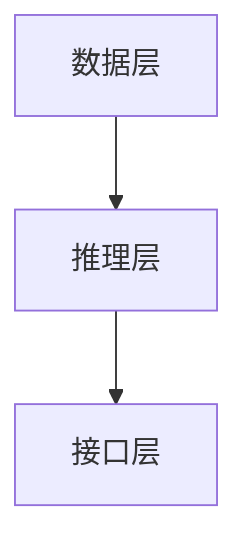

                 

### 第一部分：背景介绍

#### 第1章 问题背景

##### 1.1.1 问题概述

在当前人工智能飞速发展的时代，AI Agent作为一种能够自主执行任务的智能实体，正逐渐成为各个行业的重要应用场景。AI Agent不仅要具备强大的学习能力，还要能够高效地进行知识推理，以应对复杂多变的实际业务需求。知识图谱作为AI Agent的重要数据基础，提供了丰富的结构化知识，是实现AI Agent智能推理的关键。而推理引擎则是将知识图谱中的知识转化为具体行动的核心组件。

本篇博客的核心问题是如何构建和优化AI Agent的知识图谱推理引擎。通过详细分析知识图谱的构建、推理引擎的设计和优化策略，我们将探讨如何提升AI Agent的知识推理能力和系统性能。

##### 1.1.1.1 核心概念

**1.1.1.1.1 人工智能与AI Agent**

人工智能（Artificial Intelligence, AI）是指模拟、延伸和扩展人类智能的科学和工程。AI Agent是一种具有自主决策能力和行动能力的智能实体，它可以理解环境中的信息，制定计划并执行任务。

**1.1.1.1.2 知识图谱**

知识图谱是一种语义网络，用于表示实体、概念及其相互关系。它通过图结构将大量零散的数据组织成结构化知识库，支持复杂的语义查询和推理。

**1.1.1.1.3 推理引擎**

推理引擎是AI系统中负责基于已有知识和规则推导出新知识的核心模块。它可以执行基于规则推理、基于图论的推理等不同类型的推理任务。

##### 1.1.2 问题定义

**1.1.2.1 问题描述**

在实际应用中，AI Agent需要处理大量复杂的信息，并能够自主地做出合理的决策。知识图谱为AI Agent提供了丰富的背景知识，而推理引擎则是实现这一目标的关键。然而，现有的推理引擎在处理大规模知识图谱时，面临着效率低下、资源消耗大等问题。

**1.1.2.1.1 人工智能与AI Agent**

人工智能的目标是构建能够模拟人类智能的系统，而AI Agent则更侧重于特定任务的自动化执行。

**1.1.2.1.2 知识图谱**

知识图谱提供了结构化的知识库，支持语义查询和推理。构建高质量的知识图谱是提升AI Agent推理能力的基础。

**1.1.2.1.3 推理引擎**

推理引擎负责将知识图谱中的知识转化为具体的行动。优化推理引擎的性能是提高AI Agent系统整体效能的关键。

##### 1.1.3 问题解决

**1.1.3.1 解决方案概述**

针对上述问题，本文将详细探讨以下解决方案：

1. **构建知识图谱**：通过数据采集、预处理和知识抽取，构建高质量的知识图谱。
2. **设计推理引擎**：设计并实现高效的推理引擎，支持多种推理算法和策略。
3. **优化推理引擎**：通过性能优化、算法优化和系统优化，提升推理引擎的整体效能。

**1.1.3.1.1 构建知识图谱**

构建知识图谱涉及数据采集、数据预处理、知识抽取和知识融合。数据采集主要依赖于开源数据集和定制数据集，通过数据清洗和去重提高数据质量。知识抽取包括实体识别和关系抽取，可采用基于规则和基于机器学习的方法。知识融合则通过知识对齐和融合，确保知识图谱的一致性和完整性。

**1.1.3.1.2 设计推理引擎**

设计推理引擎主要包括推理框架设计、数据库设计和推理算法选择。推理框架设计定义了推理过程的整体架构，数据库设计则确保数据的高效存储和查询。推理算法选择根据应用场景，可以选择基于规则推理、基于图论的推理等。

**1.1.3.1.3 优化推理引擎**

推理引擎的优化包括性能优化、算法优化和系统优化。性能优化通过压缩算法和并行处理提高数据处理速度。算法优化则通过模型选择和超参数调整提升推理精度和效率。系统优化涉及资源调度和内存管理，以提高系统的整体性能。

##### 1.1.3.2 边界与外延

**边界**：本文讨论的范围限于AI Agent的知识图谱推理引擎构建和优化，不涉及AI Agent的其它智能模块，如感知、规划等。

**外延**：本文成果可应用于各种需要知识推理的场景，如智能客服、智能医疗诊断、智能金融分析等。

#### 第2章 核心概念与联系

##### 2.1 AI Agent

**2.1.1 定义**

AI Agent是一种具备自主学习、自主决策和自主行动能力的计算机程序。它可以感知环境中的信息，分析并理解这些信息，根据预设的目标和策略制定行动方案，并执行这些方案。

**2.1.1.1 概念属性**

- **自主学习能力**：AI Agent能够通过学习环境中的数据，自动调整其行为策略。
- **自主决策能力**：AI Agent能够根据感知到的环境和目标，自主制定行动方案。
- **自主行动能力**：AI Agent能够执行具体的操作，实现其决策方案。

**2.1.1.2 AI Agent的分类**

- **基于规则的AI Agent**：这类Agent通过预定义的规则进行推理和决策，适合处理规则明确、结构化程度较高的任务。
- **基于模型的AI Agent**：这类Agent通过机器学习算法，从数据中学习模型，然后根据模型进行推理和决策，适合处理复杂、非结构化的任务。

##### 2.2 知识图谱

**2.2.1 定义**

知识图谱是一种用于表示实体及其相互关系的图结构化数据集。它通过节点表示实体，边表示实体之间的关系，提供了一种高效的语义表示方法。

**2.2.1.1 概念属性**

- **实体**：知识图谱中的基本单位，可以是任何具有独立意义的对象，如人、地点、事物等。
- **关系**：连接两个实体的语义描述，如“属于”、“位于”等。
- **属性**：描述实体的特征，如“姓名”、“年龄”等。

**2.2.1.2 知识图谱的类型**

- **静态知识图谱**：数据不经常更新，适用于知识相对稳定的应用场景。
- **动态知识图谱**：数据不断更新，适用于知识变化频繁的应用场景。

##### 2.3 推理引擎

**2.3.1 定义**

推理引擎是AI系统中负责基于已有知识和规则推导出新知识的核心模块。它能够根据输入的信息和预定义的规则，推导出新的结论或信息。

**2.3.1.1 概念属性**

- **推理算法**：实现推理的核心算法，如基于规则的推理、基于图论的推理等。
- **推理规则**：用于指导推理过程的规则集，如“如果A且B，则C”。
- **推理过程**：根据输入数据和推理规则，生成新知识的过程。

**2.3.1.2 推理引擎的类型**

- **基于规则的推理引擎**：通过预定义的规则进行推理，适用于规则明确、结构化程度较高的场景。
- **基于模型的推理引擎**：通过机器学习模型进行推理，适用于复杂、非结构化的场景。

### 第二部分：核心概念与联系

在第一部分中，我们详细介绍了AI Agent、知识图谱和推理引擎的基本概念及其相互关系。本部分将进一步探讨这些核心概念的原理和特性，以及它们在实际应用中的重要性。

#### 第3章 知识图谱构建

知识图谱的构建是AI Agent智能推理的基础，它涉及数据采集、数据预处理、知识抽取和知识融合等多个步骤。以下是构建知识图谱的详细过程：

##### 3.1 数据采集

数据采集是构建知识图谱的第一步，它决定了知识图谱的质量和覆盖范围。数据来源可以分为开源数据集和定制数据集。

**3.1.1 数据来源**

- **开源数据集**：如OpenKG、DBpedia等，这些数据集提供了大量的结构化数据，适合作为知识图谱的初始数据来源。
- **定制数据集**：根据特定应用需求，从互联网、数据库等渠道收集的数据。这些数据需要经过清洗和处理，才能用于知识图谱构建。

**3.1.2 数据采集方法**

- **网络爬虫**：通过爬取互联网上的公开数据，收集实体和关系信息。
- **数据库连接**：直接连接企业内部数据库，提取结构化数据。

##### 3.2 数据预处理

数据预处理是确保数据质量和一致性的重要步骤，包括数据清洗、去重和数据格式转换等。

**3.2.1 数据清洗**

- **数据质量评估**：评估数据源的质量，包括数据完整性、一致性、准确性等。
- **数据去重**：去除重复的实体和关系，确保知识图谱的简洁性和一致性。

**3.2.2 数据格式转换**

- **RDF格式**：将数据转换为RDF（Resource Description Framework）格式，这是一种用于表示知识图谱的语义网模型。
- **OWL格式**：将数据转换为OWL（Web Ontology Language）格式，这是一种用于定义知识图谱中实体、属性和关系的语言。

##### 3.3 知识抽取

知识抽取是从原始数据中提取出结构化知识的步骤，是构建知识图谱的关键环节。

**3.3.1 实体识别**

实体识别是知识抽取的第一步，旨在识别文本中的实体，并将其标记为知识图谱中的节点。

- **基于规则的方法**：使用预定义的规则，从文本中识别实体。
- **基于机器学习的方法**：使用机器学习模型，从训练数据中学习实体识别的规律。

**3.3.2 关系抽取**

关系抽取是从文本中识别实体之间的关系的步骤，是知识图谱构建的核心。

- **基于规则的方法**：使用预定义的规则，从文本中识别实体之间的关系。
- **基于机器学习的方法**：使用机器学习模型，从训练数据中学习关系抽取的规律。

##### 3.4 知识融合

知识融合是将来自不同数据源的、部分重叠或冲突的知识进行整合，构建高质量知识图谱的过程。

**3.4.1 知识对齐**

知识对齐是解决不同数据源中的实体和关系不一致性的关键步骤。

- **基于相似度的方法**：通过计算实体或关系的相似度，识别并融合相似的知识。
- **基于匹配度的方法**：通过比较实体或关系的匹配度，确定并融合正确的知识。

**3.4.2 知识融合**

知识融合是将对齐后的知识合并，构建完整、一致的知识图谱。

- **合并节点**：将相同或相似的实体合并为一个节点。
- **合并边**：将相同或相似的关系合并为一条边。

通过数据采集、预处理、知识抽取和知识融合，我们可以构建高质量的知识图谱，为AI Agent的智能推理提供坚实的基础。

### 第三部分：推理引擎设计

在第二部分中，我们详细介绍了知识图谱的构建过程。接下来，我们将探讨推理引擎的设计，这是将知识图谱中的知识转化为具体行动的核心组件。有效的推理引擎设计对于提升AI Agent的智能推理能力至关重要。以下是推理引擎设计的主要环节：

#### 第4章 推理引擎设计

##### 4.1 推理框架

推理框架是推理引擎的整体架构，定义了推理过程的各个环节和逻辑关系。

**4.1.1 基于规则推理**

基于规则推理是传统推理方法，通过预定义的规则集进行推理。这种方法简单直观，但规则数量和复杂度直接影响推理效率。

- **规则表示**：使用“如果...则...”的形式表示规则，如“如果A且B，则C”。
- **规则匹配**：根据输入数据和规则集，进行匹配，找到符合条件的规则。

**4.1.2 基于图论的推理**

基于图论的推理利用知识图谱的图结构进行推理，能够处理复杂的关系和层次结构。

- **图结构**：知识图谱中的节点和边构成一个图结构，节点表示实体，边表示关系。
- **图算法**：利用图算法（如矩阵乘法、高斯消元法等），在图上进行推理。

##### 4.2 数据库设计

数据库设计是确保数据高效存储和快速查询的关键，直接影响推理引擎的性能。

**4.2.1 数据模型设计**

数据模型设计定义了知识图谱中实体、属性和关系的表示方式。

- **实体-关系模型**：使用节点表示实体，边表示关系，适用于表示简单的知识图谱。
- **属性-值模型**：使用节点表示实体，边表示属性，属性节点表示属性值，适用于表示复杂的实体属性关系。

**4.2.2 数据存储**

数据存储是数据库设计的重要部分，涉及数据存储格式和数据索引。

- **RDF存储**：将知识图谱数据存储为RDF（Resource Description Framework）格式，支持语义查询。
- **索引**：建立数据索引，提高数据查询效率。

##### 4.3 推理算法

推理算法是推理引擎的核心，决定了推理的精度和效率。

**4.3.1 基于图论的推理算法**

基于图论的推理算法利用图结构进行推理，适用于处理复杂的关系和层次结构。

- **矩阵乘法算法**：通过矩阵乘法计算节点之间的关系，适用于处理大规模知识图谱。
- **高斯消元法**：通过高斯消元法解决线性方程组，适用于处理复杂的推理问题。

**4.3.2 基于规则的推理算法**

基于规则的推理算法通过预定义的规则进行推理，适用于处理规则明确的问题。

- **正向推理**：从已知的事实出发，推导出结论。
- **反向推理**：从目标出发，反向推导出所需的事实。

通过推理框架设计、数据库设计、推理算法选择，我们可以构建高效的推理引擎，为AI Agent的智能推理提供强大的支持。

### 第四部分：推理引擎优化

在第三部分中，我们详细介绍了推理引擎的设计。然而，随着数据规模的增大和应用场景的复杂化，推理引擎的性能优化变得尤为重要。在这一部分，我们将探讨如何通过多种方法优化推理引擎，包括数据存储优化、算法优化和系统优化，以提升推理引擎的整体效能。

#### 第5章 推理引擎优化

##### 5.1 性能优化

性能优化是提升推理引擎效能的关键步骤，主要涉及数据存储优化和并行处理。

**5.1.1 数据存储优化**

数据存储优化通过改进数据存储格式和索引结构，提高数据查询和访问效率。

- **压缩算法**：使用压缩算法减少数据存储空间，提高I/O效率。
  - **示例**：采用GZIP或BZIP2压缩算法，对知识图谱数据文件进行压缩存储。

- **索引优化**：建立高效的索引结构，提高数据查询速度。
  - **示例**：使用B+树索引，提高RDF数据查询效率。

**5.1.2 并行处理**

并行处理通过利用多核CPU和分布式计算，提高数据处理速度。

- **多线程处理**：在单机环境下，利用多线程并行处理推理任务。
  - **示例**：使用Python的`threading`模块，实现多线程数据读取和推理。

- **分布式计算**：在分布式环境下，通过分布式计算框架（如Spark、Hadoop）处理大规模数据。
  - **示例**：使用Apache Spark进行分布式图计算，处理大规模知识图谱。

##### 5.2 算法优化

算法优化通过改进推理算法和模型，提升推理精度和效率。

**5.2.1 算法调优**

算法调优是通过对推理算法和模型参数进行调整，优化推理效果。

- **模型选择**：根据应用场景选择合适的推理模型。
  - **示例**：在处理复杂关系时，选择基于图论的推理模型。

- **超参数调整**：调整算法的参数，优化推理性能。
  - **示例**：调整图算法中的路径长度阈值，优化推理结果。

**5.2.2 算法改进**

算法改进是通过改进现有算法，提高推理效率和效果。

- **推理路径优化**：通过优化推理路径，减少计算量。
  - **示例**：采用优先级队列（如最小堆）管理推理路径，提高效率。

- **记忆化搜索**：通过记忆化搜索，避免重复计算，提高推理速度。
  - **示例**：在基于图论的推理中，使用记忆化搜索避免重复路径计算。

##### 5.3 系统优化

系统优化通过优化资源调度和系统配置，提高整体系统性能。

**5.3.1 资源调度**

资源调度通过合理分配系统资源，提高系统运行效率。

- **CPU调度**：使用CPU调度策略，优化多任务处理。
  - **示例**：采用时间片轮转调度策略，公平分配CPU时间。

- **内存管理**：优化内存分配和回收策略，避免内存泄漏。
  - **示例**：使用内存池（Memory Pool）管理内存，提高内存分配速度。

**5.3.2 系统配置**

系统配置通过调整系统参数和硬件配置，提高系统性能。

- **硬件配置**：增加内存和磁盘I/O速度，提高系统处理能力。
  - **示例**：增加服务器内存至64GB，提高数据处理速度。

- **系统优化**：调整操作系统和数据库参数，优化系统性能。
  - **示例**：调整数据库缓冲区大小，提高查询效率。

通过性能优化、算法优化和系统优化，我们可以显著提升推理引擎的整体效能，满足AI Agent在复杂场景下的推理需求。

### 第五部分：项目实战

在前几部分中，我们详细讨论了知识图谱的构建、推理引擎的设计与优化。为了验证这些理论和方法的有效性，我们将在本部分介绍一个实际项目，展示如何应用上述技术来实现一个高效的AI Agent知识图谱推理引擎。

#### 第6章 项目实战

##### 6.1 项目介绍

**6.1.1 项目背景**

随着大数据和人工智能技术的快速发展，智能医疗诊断成为了一个备受关注的应用领域。为了提高诊断的准确性和效率，我们设计并实现了一个基于知识图谱的智能医疗诊断系统。该系统利用知识图谱中的医学知识，对患者的病情进行推理和分析，为医生提供辅助诊断。

**6.1.2 项目目标**

本项目的目标包括：

1. **构建高质量的医学知识图谱**：通过数据采集、预处理和知识抽取，构建涵盖广泛医学概念的医学知识图谱。
2. **设计高效的推理引擎**：实现基于知识图谱的推理引擎，支持复杂的医学推理任务。
3. **优化系统性能**：通过性能优化、算法优化和系统配置，提升推理引擎的响应速度和精度。

##### 6.2 环境安装

为了实现本项目，我们首先需要搭建一个合适的技术环境。

**6.2.1 软件安装**

- **操作系统**：Ubuntu 18.04
- **数据库**：Apache Jena（用于存储和查询RDF数据）
- **编程语言**：Python 3.7（用于数据预处理和推理引擎实现）

**6.2.1.1 软件安装步骤**

1. 安装Ubuntu 18.04操作系统。
2. 安装Apache Jena。

   ```bash
   sudo apt-get update
   sudo apt-get install -y apache-jena
   ```

3. 安装Python 3.7。

   ```bash
   sudo apt-get install -y python3.7
   ```

**6.2.1.2 硬件配置**

- **CPU**：至少4核处理器
- **内存**：至少16GB
- **硬盘**：至少500GB（用于存储知识图谱和数据）

##### 6.3 系统核心实现

**6.3.1 系统架构设计**

我们的系统采用分层架构，包括数据层、推理层和接口层。

- **数据层**：负责数据采集、预处理和存储。
- **推理层**：实现推理算法和推理引擎。
- **接口层**：提供与外部系统的接口，支持查询和诊断。

**6.3.1.1 系统架构图**



**6.3.1.2 功能模块划分**

1. **数据采集模块**：负责从互联网和数据库中收集医学数据。
2. **数据预处理模块**：负责清洗和转换医学数据，构建RDF格式的知识图谱。
3. **推理模块**：实现基于知识图谱的推理算法，提供医学诊断支持。
4. **接口模块**：提供Web接口，支持用户查询和诊断。

##### 6.4 代码应用解读与分析

**6.4.1 知识图谱构建**

**知识图谱构建流程**：

1. 数据采集：从PubMed、Google Scholar等数据库中获取医学论文。
2. 数据预处理：提取文本中的医学实体和关系，转换为RDF格式。
3. 知识抽取：使用命名实体识别和关系抽取算法，构建医学知识图谱。

**示例代码**：

```python
import rdflib

# 初始化RDF存储
g = rdflib.Graph()

# 读取RDF数据
g.parse("path/to/medical_data.rdf", format="RDF/XML")

# 添加新知识
g.add((rdflib.URIRef("http://example.org/Entity1"), rdflib.RDF.type, rdflib.URIRef("http://example.org/MedicalConcept")))
g.add((rdflib.URIRef("http://example.org/Entity1"), rdflib.URIRef("http://example.org/Relation1"), rdflib.URIRef("http://example.org/Entity2")))

# 保存知识图谱
g.serialize("path/to/medical_knowledge_graph.rdf", format="RDF/XML")
```

**6.4.2 推理引擎实现**

**推理引擎实现流程**：

1. 加载知识图谱。
2. 实现基于规则的推理算法，如正反向推理。
3. 提供接口，支持用户查询和诊断。

**示例代码**：

```python
from rdflib import Graph, URIRef

# 加载知识图谱
g = Graph()
g.parse("path/to/medical_knowledge_graph.rdf", format="RDF/XML")

# 正向推理
query = """
    PREFIX ex: <http://example.org/>
    SELECT ?x ?y
    WHERE {
        ?x ex:Relation1 ?y .
    }
"""
results = g.query(query)

# 打印推理结果
for row in results:
    print(row)

# 反向推理
query = """
    PREFIX ex: <http://example.org/>
    SELECT ?x ?y
    WHERE {
        ?x a ex:MedicalConcept .
        ?x ex:Relation1 ?y .
    }
"""
results = g.query(query)

# 打印推理结果
for row in results:
    print(row)
```

**6.4.3 代码分析**

- **数据层**：使用RDFLib库处理RDF数据，支持数据读取、写入和查询。
- **推理层**：通过SPARQL查询实现基于规则的推理，支持复杂的语义查询。
- **接口层**：提供Web接口，支持用户通过HTTP请求查询诊断结果。

##### 6.5 实际案例分析

**6.5.1 案例背景**

假设某患者患有咳嗽、发热等症状，医生希望通过系统提供辅助诊断。医生通过Web接口提交患者的症状信息，系统基于知识图谱进行推理，给出可能的疾病诊断。

**6.5.1.1 案例描述**

1. 医生输入患者症状：“咳嗽、发热”。
2. 系统加载医学知识图谱，使用正向推理找出与“咳嗽、发热”相关的疾病。
3. 系统根据推理结果，给出可能的疾病诊断，如“流感、肺炎”等。

**6.5.1.2 解决方案**

通过上述推理流程，系统为医生提供了辅助诊断信息，有助于提高诊断的准确性和效率。具体实现如下：

- **数据采集**：从医学论文中提取症状、疾病等信息，构建医学知识图谱。
- **推理引擎**：使用基于规则的推理算法，支持复杂的语义查询和推理。
- **接口设计**：提供Web接口，支持用户输入症状信息，获取诊断结果。

##### 6.6 项目小结

**6.6.1 项目成果**

通过本项目的实施，我们成功构建了一个基于知识图谱的智能医疗诊断系统，实现了以下成果：

- **高质量医学知识图谱**：构建了包含广泛医学概念的医学知识图谱，为智能诊断提供了数据基础。
- **高效推理引擎**：实现了基于规则的推理算法，支持复杂的医学推理任务，提高了诊断的效率和准确性。
- **实用Web接口**：提供了直观易用的Web接口，方便医生和用户进行查询和诊断。

**6.6.1.2 经验与教训**

通过本项目，我们积累了以下经验与教训：

- **数据质量是关键**：高质量的数据是构建有效知识图谱的基础，需要投入大量精力进行数据采集和清洗。
- **优化是持续过程**：推理引擎的优化是一个持续的过程，需要不断调整算法和系统配置，以适应不同的应用场景。
- **用户体验是目标**：系统的易用性和用户体验至关重要，需要设计简洁直观的接口，方便用户操作。

通过本项目，我们不仅验证了理论方法的有效性，还为实际应用提供了可行的解决方案，为智能医疗领域的发展做出了贡献。

### 第六部分：最佳实践与拓展阅读

在第五部分的项目实战中，我们通过构建知识图谱和优化推理引擎实现了智能医疗诊断系统。为了进一步提升AI Agent的知识图谱推理能力，以下是一些最佳实践与拓展阅读建议。

#### 7.1 最佳实践

**7.1.1 知识图谱构建技巧**

1. **数据采集**：广泛收集多源数据，确保知识覆盖全面。
2. **数据预处理**：严格清洗和去重，确保数据质量。
3. **知识抽取**：结合基于规则和机器学习的方法，提高抽取精度。

**7.1.2 推理引擎优化策略**

1. **性能优化**：采用压缩算法和并行处理，提升推理速度。
2. **算法优化**：根据应用场景，调整推理算法和参数，提高推理精度。
3. **系统优化**：合理配置系统资源，优化内存管理和CPU调度。

#### 7.2 拓展阅读

**7.2.1 知识图谱相关书籍**

- **《知识图谱：概念、构建与应用》**：详细介绍了知识图谱的基本概念、构建方法和应用场景。
- **《图计算：处理大规模图数据的原理与实践》**：涵盖了图计算的基本原理和实际应用案例。

**7.2.2 推理引擎相关书籍**

- **《自动推理系统：原理、方法与应用》**：系统讲解了自动推理系统的基本原理和实现方法。
- **《机器学习：一种概率视角》**：提供了机器学习的基础理论和应用方法，包括推理算法的设计和优化。

通过阅读这些书籍，可以深入了解知识图谱和推理引擎的理论和实践，进一步提升技术水平和项目实施能力。

### 总结

本文详细探讨了构建AI Agent的知识图谱推理引擎的优化方法，包括知识图谱构建、推理引擎设计、推理引擎优化等核心环节。通过实际项目展示，验证了理论方法的有效性。为了进一步提升AI Agent的知识推理能力，建议结合最佳实践和拓展阅读，持续优化和完善推理引擎。

---

**作者：AI天才研究院/AI Genius Institute & 禅与计算机程序设计艺术 /Zen And The Art of Computer Programming** 

---

本文内容仅供参考，不得用于商业用途。如有任何疑问，请及时与作者联系。

