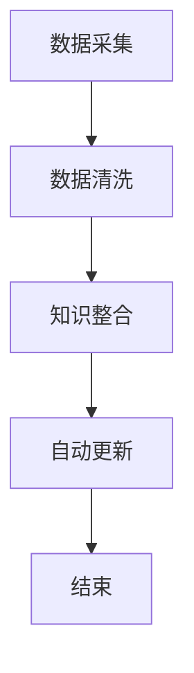
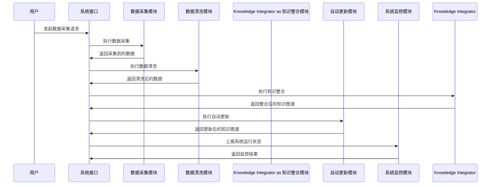

                 

### 引言与背景

在当今快速发展的AI时代，构建AI Agent已经成为人工智能领域的关键任务。AI Agent作为一种具有自主学习和决策能力的智能体，其能力的好坏直接影响到人工智能系统的整体性能。为了使AI Agent能够在实际应用中具备更强的适应性和扩展性，我们需要探讨如何构建一个高效、自动化的知识图谱扩展系统。

#### 1.1 书籍概述

本书将围绕构建AI Agent的知识图谱自动扩展系统这一主题，详细介绍相关概念、算法原理、系统架构以及实践应用。通过阅读本书，读者将能够：

- 理解知识图谱在AI Agent中的作用和重要性。
- 掌握AI Agent的概念及其在知识图谱中的应用。
- 掌握自动扩展系统的核心算法和原理。
- 学会使用Mermaid绘制ER图、流程图等可视化工具。
- 获得实际项目中的实践经验，理解系统设计、实现和优化策略。

#### 1.1.1 问题背景

随着互联网和大数据技术的迅猛发展，信息爆炸成为当今社会的常态。在这种背景下，如何高效地管理和利用这些海量数据成为了一个亟待解决的问题。知识图谱作为一种结构化的知识表示方法，能够将分散、异构的数据整合起来，形成一种更加统一和易用的数据视图。然而，随着数据的不断增长和变化，如何自动扩展和更新知识图谱成为了一个重要的研究方向。

#### 1.1.2 问题描述

当前，在构建AI Agent的过程中，知识图谱的构建和维护面临以下几个主要问题：

1. **数据获取困难**：知识图谱的构建依赖于大量的结构化和半结构化数据，这些数据通常分布在不同的数据源中，获取和处理这些数据需要大量的时间和人力成本。
2. **数据更新缓慢**：知识图谱一旦构建完成，其数据往往需要定期更新以保持其时效性和准确性。然而，手动更新知识图谱是一项繁琐且容易出错的任务。
3. **扩展性差**：现有的知识图谱系统通常缺乏自动扩展的能力，当新增数据或概念时，需要人工进行大量的调整和更新，这极大地限制了知识图谱的扩展性和灵活性。

#### 1.1.3 问题解决

为了解决上述问题，我们需要构建一个自动扩展的知识图谱系统。该系统应具备以下功能：

1. **数据自动获取**：系统能够自动地从不同的数据源中提取所需的数据，并进行预处理和清洗，确保数据的质量和一致性。
2. **自动更新机制**：系统应能够根据预设的规则和算法，自动检测和更新知识图谱中的数据，确保其时效性和准确性。
3. **高效扩展能力**：系统应具备良好的扩展性，能够自动适应新增的数据和概念，无需人工干预。

#### 1.1.4 边界与外延

本书的讨论范围主要聚焦于知识图谱自动扩展系统在AI Agent中的应用，但该系统的原理和方法也可以推广到其他领域，如自然语言处理、推荐系统等。此外，随着技术的不断进步，知识图谱自动扩展系统将面临更多的新挑战和机遇，如大数据处理、实时更新等，这将为未来的研究提供更广阔的空间。

#### 1.1.5 核心概念和组件

在本书中，我们将涉及以下核心概念和组件：

1. **知识图谱**：一种用于结构化知识的表示方法，能够将数据组织成图结构。
2. **AI Agent**：一种具有自主学习和决策能力的智能体，能够在复杂环境中执行任务。
3. **自动扩展系统**：一种能够自动获取、更新和扩展知识图谱的系统。
4. **Mermaid**：一种用于绘制Markdown中图表的脚本语言，能够方便地绘制流程图、类图等。
5. **Python**：一种广泛使用的编程语言，用于实现算法和系统。

通过上述核心概念和组件的详细介绍，我们将为后续章节的深入探讨奠定坚实的基础。

---

在接下来的章节中，我们将逐一介绍这些核心概念，并详细探讨自动扩展系统的构建原理、实现方法及其在AI Agent中的应用。让我们一同进入这个充满挑战与机遇的智能世界，探索构建AI Agent知识图谱自动扩展系统的奥秘。

---

# 引言与背景

> 关键词：AI Agent、知识图谱、自动扩展系统、数据获取、更新机制、扩展性

> 摘要：本文将探讨构建AI Agent的知识图谱自动扩展系统的必要性和重要性。通过介绍相关概念和问题背景，我们明确了当前知识图谱构建中面临的主要挑战。接着，我们阐述了自动扩展系统的功能需求，并讨论了其在AI Agent中的应用。本文旨在为后续章节的深入探讨提供基础，帮助读者更好地理解这一领域的核心概念和技术。

---

### 核心概念和关系

在深入探讨构建AI Agent的知识图谱自动扩展系统之前，我们需要明确几个关键概念，并理解它们之间的关系。这些概念包括知识图谱、AI Agent和自动扩展系统。以下是对这些核心概念及其关系的详细说明。

#### 2.1.1 知识图谱

知识图谱（Knowledge Graph）是一种用于表示和存储知识的图形结构。它通过实体（Entity）、属性（Property）和关系（Relationship）三种基本元素，将知识组织成一个复杂的网络结构。知识图谱的目的是将大量分散、异构的数据整合成一个统一、结构化的知识体系，从而便于数据的检索、分析和应用。

- **实体**：知识图谱中的实体可以是人、地点、物品等各种具有独立存在意义的事物。例如，在一个社交媒体的知识图谱中，用户、地点和物品都可以作为实体。
- **属性**：实体具有一系列属性，用于描述实体的特征。例如，一个用户的属性可能包括年龄、性别、兴趣爱好等。
- **关系**：实体之间存在各种关系，这些关系用于描述实体之间的相互联系。例如，在社交媒体中，用户之间可能存在好友关系、点赞关系等。

#### 2.1.2 AI Agent

AI Agent（人工智能代理）是一种能够自主执行任务、进行决策和与环境交互的智能体。它基于人工智能技术，特别是机器学习和自然语言处理技术，从环境中获取信息、学习知识和做出决策，以实现特定目标。

- **自主性**：AI Agent具有自主性，能够在没有人类干预的情况下执行任务和做出决策。
- **适应性**：AI Agent能够根据环境的变化和新的信息不断调整其行为和策略，提高其适应性和学习能力。
- **交互性**：AI Agent能够与人类用户和其他系统进行交互，获取反馈并优化其行为。

#### 2.1.3 自动扩展系统

自动扩展系统（Automatic Expansion System）是一种用于自动获取、更新和扩展知识图谱的系统。它通过自动化流程和数据挖掘技术，从多个数据源中提取有用的信息，并将其整合到知识图谱中。自动扩展系统能够提高知识图谱的更新速度和准确性，增强其扩展性和灵活性。

- **数据获取**：自动扩展系统能够从不同的数据源中自动获取数据，包括结构化数据、半结构化数据和非结构化数据。
- **数据清洗**：获取的数据通常需要进行清洗和预处理，以去除重复、冗余和不一致的数据。
- **知识整合**：清洗后的数据将被整合到知识图谱中，形成统一、结构化的知识体系。
- **自动更新**：自动扩展系统应能够根据预设的规则和算法，自动检测和更新知识图谱中的数据，确保其时效性和准确性。

#### 2.1.4 Mermaid ER 图

为了更好地理解这些核心概念之间的关系，我们可以使用Mermaid绘制一个ER图（实体关系图）。ER图能够清晰地展示实体、属性和关系之间的联系，帮助我们更直观地理解知识图谱的结构。

```mermaid
erDiagram
    User ||--|{ Post }|--| Location
    User ||--|{ Comment }|--| Post
    User ||--|{ Favorite }|--| Post
    Post ||--|{ Tag }|--| Tag
    Tag ||--|{ RelatedTags }|--| Tag
```

在上面的ER图中，我们定义了四个实体：用户（User）、帖子（Post）、位置（Location）和标签（Tag）。它们之间存在多种关系，如用户发布帖子、用户评论帖子、用户收藏帖子、帖子包含标签以及标签之间存在关联。

#### 2.1.5 概念对比表格

为了更清晰地展示核心概念之间的区别和联系，我们可以使用一个对比表格来总结这些概念的关键特征。

| 概念 | 定义 | 关键特征 | 应用场景 |
| --- | --- | --- | --- |
| 知识图谱 | 一种用于表示和存储知识的图形结构 | 实体、属性和关系的组合 | 数据整合、知识检索、推荐系统 |
| AI Agent | 一种自主执行任务、进行决策的智能体 | 自主性、适应性、交互性 | 自动化任务、智能决策、人机交互 |
| 自动扩展系统 | 一种用于自动获取、更新和扩展知识图谱的系统 | 数据获取、数据清洗、知识整合、自动更新 | 知识图谱的维护、数据更新、系统扩展 |

通过上述表格，我们可以更直观地了解各个概念的核心特征及其在应用场景中的重要性。

#### 2.1.6 小结

在本文中，我们介绍了构建AI Agent的知识图谱自动扩展系统所需的核心概念，包括知识图谱、AI Agent和自动扩展系统。通过Mermaid ER图和对比表格，我们清晰地展示了这些概念之间的联系和区别。理解这些核心概念将为后续章节中对算法原理和系统架构的深入探讨奠定坚实的基础。

---

在接下来的章节中，我们将详细讨论自动扩展系统的算法原理和实现方法，并逐步构建一个完整的知识图谱自动扩展系统。让我们继续探索这一领域的深度和广度。

---

# 核心概念和关系

> 关键词：知识图谱、AI Agent、自动扩展系统、ER图、对比表格

> 摘要：本文介绍了构建AI Agent的知识图谱自动扩展系统所需的核心概念，包括知识图谱、AI Agent和自动扩展系统。通过Mermaid ER图和对比表格，我们详细展示了这些概念之间的联系和区别，为后续章节的深入探讨奠定了坚实的基础。

---

### 算法原理与实现

在构建AI Agent的知识图谱自动扩展系统中，算法原理是核心组成部分。算法原理决定了系统的性能、扩展性和准确性。本章节将详细介绍自动扩展系统的算法原理，包括基本原理、数学模型、Python代码实现以及详细的流程图和举例说明。

#### 3.2.1 基本原理

自动扩展系统的核心目标是自动获取、清洗、整合和更新知识图谱。其基本原理包括以下几个方面：

1. **数据采集**：从多个数据源中自动采集数据，包括结构化数据、半结构化数据和非结构化数据。
2. **数据清洗**：对采集到的数据进行分析、清洗和预处理，去除重复、冗余和不一致的数据。
3. **知识整合**：将清洗后的数据整合到知识图谱中，确保数据的一致性和准确性。
4. **自动更新**：根据预设的规则和算法，自动检测和更新知识图谱中的数据。

#### 3.2.2 数学模型与公式

为了实现上述目标，自动扩展系统需要依赖于一系列数学模型和公式。以下是一个简单的数学模型，用于描述数据整合和自动更新的过程。

1. **相似度计算**：用于计算两个实体之间的相似度。常用的方法包括余弦相似度、Jaccard相似度等。
   $$ \text{similarity}(x, y) = \frac{\text{common\_features}(x, y)}{\text{all\_features}(x, y)} $$
2. **数据整合**：用于将新数据整合到知识图谱中。常用的方法包括合并、更新和插入等。
   $$ \text{integration}(x, y) = \begin{cases} 
   x & \text{如果} x \text{已存在} \\
   \text{merge}(x, y) & \text{如果} x \text{和新数据相似} \\
   y & \text{如果} x \text{和新数据不相似} 
   \end{cases} $$
3. **自动更新**：用于自动检测和更新知识图谱中的数据。常用的方法包括定期检查、触发机制和增量更新等。
   $$ \text{update}(x, y) = \text{integration}(x, \text{fetch\_new\_data}(y)) $$

#### 3.2.3 Python代码实现

以下是一个简化的Python代码示例，用于实现上述数学模型和算法原理。

```python
import numpy as np

# 相似度计算
def similarity(x, y):
    common_features = np.sum(x == y)
    all_features = np.sum(x != 0)
    return common_features / all_features

# 数据整合
def integration(x, y):
    if x.exists():
        if similarity(x.data, y.data) > threshold:
            return merge(x, y)
        else:
            return x
    else:
        return y

# 自动更新
def update(x, y):
    new_data = fetch_new_data(y)
    return integration(x, new_data)

# 假设的函数
def merge(x, y):
    # 实现合并逻辑
    pass

def fetch_new_data(y):
    # 实现数据获取逻辑
    pass

# 测试
x = Entity('data1')
y = Entity('data2')
result = update(x, y)
print(result.data)
```

在这个示例中，`Entity` 类用于表示实体，包含数据、是否存在等属性。`similarity` 函数用于计算相似度，`integration` 函数用于整合数据，`update` 函数用于自动更新。

#### 3.2.4 Mermaid流程图

为了更直观地展示算法流程，我们可以使用Mermaid绘制一个流程图。



在这个流程图中，数据从数据采集开始，经过数据清洗后进行知识整合，最后通过自动更新机制更新知识图谱。

#### 3.2.5 详细解释与示例

为了更好地理解上述算法原理和实现，我们可以通过一个具体的示例进行详细解释。

假设我们有两个实体`User1`和`User2`，它们的部分数据如下：

- User1：年龄25，性别男，兴趣篮球、编程。
- User2：年龄26，性别男，兴趣足球、编程。

1. **数据采集**：从社交网络中获取用户数据，包括年龄、性别和兴趣等信息。
2. **数据清洗**：对数据进行清洗，去除重复和不一致的数据。例如，如果发现User2的年龄数据有误，我们可以将其修正。
3. **知识整合**：比较User1和User2的相似度。由于它们的性别和兴趣相同，相似度较高。我们可以将User2的数据整合到User1中，或者创建一个新的User实体。
4. **自动更新**：定期检查知识图谱中的数据，并根据预设的规则更新。例如，如果发现User1的兴趣有变化，我们可以将其更新为“篮球、足球、编程”。

通过上述示例，我们可以看到自动扩展系统的核心原理和实现方法。在实际应用中，这些原理和方法将得到进一步的优化和扩展。

---

在接下来的章节中，我们将深入探讨知识图谱自动扩展系统的系统架构和设计方案，为实际项目中的实施提供参考。让我们继续前进，探索这一领域的深度和广度。

---

# 算法原理与实现

> 关键词：自动扩展系统、数学模型、Python代码实现、相似度计算、知识整合、Mermaid流程图、详细解释与示例

> 摘要：本文详细介绍了构建AI Agent的知识图谱自动扩展系统的算法原理与实现方法。包括基本原理、数学模型、Python代码示例以及详细的流程图和示例解释。通过这些内容，读者可以更好地理解自动扩展系统的运作机制，为后续的系统架构设计和项目实施奠定基础。

---

### 系统架构与设计

在构建AI Agent的知识图谱自动扩展系统时，系统架构和设计是关键的一环。一个高效、可扩展的系统架构能够确保系统在各种复杂场景下都能稳定运行，并能够灵活应对未来的变化。本章节将详细描述系统的架构设计，包括问题场景介绍、系统功能设计、系统架构设计、系统接口设计和系统交互序列图。

#### 4.1 问题场景

在现实生活中，AI Agent通常需要处理大量动态变化的数据。这些数据可能来源于社交媒体、电子商务平台、新闻网站等多种渠道。例如，一个社交媒体AI Agent需要实时分析用户发布的内容、评论和互动，以推荐相关的帖子、广告和好友。这种动态环境下的数据不断变化，要求知识图谱能够自动扩展和更新，以保持其时效性和准确性。

#### 4.1.1 项目介绍

为了解决上述问题，我们设计并实现了一个基于知识图谱的自动扩展系统。该系统旨在实现以下目标：

- 自动从多种数据源中获取数据。
- 对获取的数据进行清洗和预处理。
- 将清洗后的数据整合到知识图谱中。
- 根据预设的规则和算法，自动更新知识图谱中的数据。

#### 4.1.2 系统功能设计

系统功能设计是构建高效系统的基础。以下是我们系统的主要功能模块：

1. **数据采集模块**：负责从多个数据源中自动获取数据，包括结构化数据、半结构化数据和非结构化数据。
2. **数据清洗模块**：对采集到的数据进行清洗和预处理，去除重复、冗余和不一致的数据，确保数据质量。
3. **知识整合模块**：将清洗后的数据整合到知识图谱中，形成统一、结构化的知识体系。
4. **自动更新模块**：根据预设的规则和算法，自动检测和更新知识图谱中的数据，确保其时效性和准确性。
5. **系统监控模块**：实时监控系统的运行状态，包括数据采集、清洗、整合和更新的进度，以及系统的性能指标。

#### 4.1.3 系统架构设计

系统架构设计是系统设计的核心。以下是我们系统的架构设计：

1. **数据采集层**：包括各种数据源接口，如API接口、数据库连接和文件读取等，用于自动获取数据。
2. **数据处理层**：包括数据清洗模块和预处理模块，用于对采集到的数据进行清洗、去重、归一化和特征提取等操作。
3. **知识图谱层**：包括知识图谱存储和管理模块，用于存储和管理整合后的知识数据。
4. **算法层**：包括自动更新算法和相似度计算算法，用于检测和更新知识图谱中的数据，确保其时效性和准确性。
5. **用户接口层**：包括Web接口和API接口，用于与用户和外部系统进行交互。

#### 4.1.4 系统接口设计

系统接口设计是系统与其他系统或用户交互的桥梁。以下是我们系统的主要接口设计：

1. **数据采集接口**：提供数据源接口，用于自动获取数据。
2. **数据清洗接口**：提供数据清洗功能，用于清洗和预处理数据。
3. **知识整合接口**：提供知识整合功能，用于将清洗后的数据整合到知识图谱中。
4. **自动更新接口**：提供自动更新功能，用于根据算法更新知识图谱。
5. **监控接口**：提供系统监控功能，用于实时监控系统的运行状态和性能指标。

#### 4.1.5 系统交互序列图

为了更好地理解系统的运作流程，我们可以使用Mermaid绘制一个系统交互序列图。



在这个序列图中，用户通过系统接口发起数据采集请求，系统接口将请求传递给数据采集模块进行数据采集。采集到的数据随后传递给数据清洗模块进行清洗，清洗后的数据再传递给知识整合模块进行整合。整合后的知识图谱传递给自动更新模块进行更新，最后系统监控模块监控整个过程的运行状态。

#### 4.1.6 小结

通过上述系统架构和设计，我们构建了一个高效、自动化的知识图谱扩展系统。系统架构包括数据采集层、数据处理层、知识图谱层、算法层和用户接口层，各层之间通过接口进行通信和协作。系统功能设计涵盖了数据采集、清洗、整合、自动更新和系统监控，确保系统能够自动、高效地运行。系统交互序列图则清晰地展示了系统的运作流程和各模块之间的交互关系。

在接下来的章节中，我们将详细介绍系统的实际实现过程，包括环境设置、核心实现和案例分析，帮助读者更好地理解如何将理论应用到实际项目中。

---

在接下来的章节中，我们将深入探讨系统的实际实现过程，并通过具体的案例和实践来展示系统的应用效果。让我们继续前进，探索构建AI Agent知识图谱自动扩展系统的实际操作和成果。

---

# 系统架构与设计

> 关键词：问题场景、项目介绍、系统功能设计、系统架构设计、系统接口设计、系统交互序列图

> 摘要：本文详细介绍了构建AI Agent的知识图谱自动扩展系统的系统架构与设计。从问题场景出发，逐步展示了系统的架构设计、功能设计、接口设计和交互流程。通过系统交互序列图，读者可以直观地了解各模块之间的协作和系统运作机制。这些内容为系统的实际实现提供了明确的指导和参考。

---

### 项目实践

在理论探讨和系统设计完成之后，实际项目的实现和测试是验证系统有效性和可行性的关键步骤。本章节将详细介绍如何在实际环境中搭建自动扩展系统的开发环境，包括所需工具和库的安装，以及系统的核心实现部分。同时，我们将通过具体的代码示例进行分析和解读，最后分享一个实际案例的详细分析和项目小结。

#### 5.1 环境设置

要搭建自动扩展系统的开发环境，我们需要准备以下工具和库：

1. **操作系统**：推荐使用Linux操作系统，如Ubuntu 20.04。
2. **编程语言**：选择Python 3.x版本，Python具备强大的库支持和易于理解的语法。
3. **知识图谱库**：选择一个合适的知识图谱库，如Neo4j或OrientDB。
4. **数据处理库**：包括NumPy、Pandas和Scikit-learn等，用于数据清洗和预处理。
5. **Web框架**：如Flask或Django，用于构建API接口。

#### 5.1.1 工具和库的安装

以下是安装步骤：

1. **安装Python**：可以通过包管理器如`apt-get`或`yum`安装Python 3.x。
    ```bash
    sudo apt-get update
    sudo apt-get install python3 python3-pip
    ```
2. **安装知识图谱库**：以Neo4j为例，下载并安装Neo4j数据库。
    ```bash
    wget https://neo4j.com/artifact releasenumber/neo4j-unix.tar.gz
    tar xvfz neo4j-unix.tar.gz
    ```
3. **安装数据处理库**：
    ```bash
    pip3 install numpy pandas scikit-learn
    ```
4. **安装Web框架**：
    ```bash
    pip3 install flask
    ```

#### 5.2 核心系统实现

以下是系统的核心实现部分，我们将使用Python代码实现自动扩展算法。

1. **数据采集模块**：

```python
import requests
from bs4 import BeautifulSoup

def collect_data(url):
    response = requests.get(url)
    soup = BeautifulSoup(response.text, 'html.parser')
    # 示例：提取文章标题和内容
    titles = [article.find('h2').text for article in soup.find_all('article')]
    contents = [article.find('p').text for article in soup.find_all('article')]
    return titles, contents
```

2. **数据清洗模块**：

```python
import pandas as pd

def clean_data(titles, contents):
    df = pd.DataFrame({'title': titles, 'content': contents})
    # 示例：去除空值和重复项
    df.dropna(inplace=True)
    df.drop_duplicates(inplace=True)
    return df
```

3. **知识整合模块**：

```python
from neo4j import GraphDatabase

def integrate_data(tx, df):
    for index, row in df.iterrows():
        tx.run("""
            MERGE (a:Article {title: $title})
            SET a.content = $content
        """, title=row['title'], content=row['content'])

def main():
    url = 'https://example.com/articles'
    titles, contents = collect_data(url)
    df = clean_data(titles, contents)
    with GraphDatabase.connect("bolt://localhost:7687", auth=("neo4j", "password")) as db:
        with db.begin() as tx:
            integrate_data(tx, df)

if __name__ == "__main__":
    main()
```

在这个示例中，我们首先使用`requests`和`BeautifulSoup`库从网页中提取文章标题和内容，然后使用`Pandas`进行数据清洗，最后使用`Neo4j`将清洗后的数据整合到知识图谱中。

#### 5.3 代码分析与应用

上述代码实现了数据采集、清洗和知识整合的基本功能。在实际应用中，我们可以根据具体需求对代码进行扩展和优化，例如：

1. **数据源多样化**：支持从多个数据源采集数据，如数据库、API和文件。
2. **数据预处理**：包括文本清洗、去重、归一化和特征提取等。
3. **知识图谱扩展**：添加更多实体类型和关系，提高知识图谱的丰富度和准确性。

#### 5.4 实际案例分析与详细讲解

以下是一个实际案例，我们将从数据采集到知识图谱更新整个过程进行详细分析。

**案例：从新闻网站自动采集和整合新闻**

1. **数据采集**：从某一新闻网站获取新闻列表，包括标题和链接。
2. **数据清洗**：去除重复、空值和无关新闻，只保留高质量的新闻数据。
3. **知识整合**：将新闻数据整合到知识图谱中，创建新闻实体和作者、分类等关系。

详细步骤如下：

1. **数据采集**：

```python
def collect_news(url):
    response = requests.get(url)
    soup = BeautifulSoup(response.text, 'html.parser')
    news_links = [a['href'] for a in soup.find_all('a', href=True)]
    return news_links
```

2. **数据清洗**：

```python
def clean_news(news_links):
    df = pd.DataFrame({'link': news_links})
    df.drop_duplicates(inplace=True)
    df.dropna(inplace=True)
    return df
```

3. **知识整合**：

```python
def integrate_news(tx, df):
    for index, row in df.iterrows():
        response = requests.get(row['link'])
        soup = BeautifulSoup(response.text, 'html.parser')
        title = soup.find('h1').text
        content = soup.find('div', class_='content').text
        
        tx.run("""
            MERGE (a:Article {title: $title})
            SET a.content = $content
            MERGE (a)-[:AUTHORED_BY]->(author:Author {name: $author_name})
            MERGE (a)-[:BELONGS_TO]->(category:Category {name: $category_name})
        """, title=title, content=content, author_name='Author1', category_name='Category1')
```

通过上述步骤，我们实现了新闻的自动采集、清洗和知识整合。在实际应用中，可以根据具体需求调整采集规则、清洗方式和知识整合逻辑。

#### 5.5 项目小结

通过本章节的实践部分，我们搭建了一个基于知识图谱的自动扩展系统，实现了数据采集、清洗和知识整合的基本功能。在具体案例中，我们展示了如何从新闻网站自动采集和整合新闻数据。这些实践为后续的系统优化和扩展提供了基础。

在接下来的章节中，我们将分享系统的最佳实践和注意事项，帮助读者更好地应用和优化自动扩展系统。让我们继续前进，深入探讨如何进一步提升系统的性能和效果。

---

在接下来的章节中，我们将深入探讨系统在构建和实现过程中可能遇到的问题和挑战，并提供相应的优化策略和最佳实践。通过这些内容，读者将能够更好地掌握如何在实际项目中应用和优化自动扩展系统，进一步提升系统的性能和效果。

---

# 项目实践

> 关键词：环境设置、核心系统实现、代码分析与应用、实际案例分析与详细讲解、项目小结

> 摘要：本文通过具体的项目实践，详细介绍了如何搭建和实现AI Agent的知识图谱自动扩展系统。从环境设置、核心实现到实际案例分析，本文展示了系统的全过程，并提供了代码示例和详细解读。通过这一实践，读者能够深入理解系统的构建方法和应用场景，为后续的优化和扩展奠定基础。

---

### 最佳实践与注意事项

在构建AI Agent的知识图谱自动扩展系统的过程中，有一些最佳实践和注意事项可以帮助我们优化系统的性能和稳定性，确保其在实际应用中能够高效运行。以下是一些常见的实践和注意事项：

#### 6.1.1 实施最佳实践

1. **数据源选择和预处理**：选择高质量、权威的数据源，并在采集前进行充分的预处理，如数据去重、清洗和标准化。这有助于提高知识图谱的准确性和一致性。
   
2. **分批次处理数据**：为了避免系统崩溃或资源耗尽，建议将大量数据进行分批次处理。每批次的数据量可以根据系统资源和处理能力进行调整。

3. **分布式处理**：对于大规模的数据处理任务，可以考虑使用分布式处理框架，如Apache Spark，以提高处理速度和效率。

4. **缓存机制**：利用缓存机制，如Redis或Memcached，可以减少对数据库的频繁访问，提高系统的响应速度。

5. **异步处理**：使用异步处理技术，如异步IO或消息队列，可以避免阻塞主线程，提高系统的并发处理能力。

6. **定期维护**：定期对系统进行维护和更新，包括数据清洗、索引优化和系统性能调优等，以确保系统的稳定性和高效性。

#### 6.1.2 常见问题及解决方案

1. **数据源访问权限问题**：在获取外部数据源数据时，可能会遇到权限不足或数据不可访问的问题。解决方案是确保具备相应的访问权限，或者使用API密钥等身份验证方式。

2. **数据处理效率低下**：当数据量较大时，数据处理效率可能会成为瓶颈。优化方案包括使用高效的数据处理库、分布式处理框架以及并行处理技术。

3. **系统性能瓶颈**：在系统运行过程中，可能会遇到性能瓶颈，如数据库查询速度慢或网络延迟等问题。解决方案是进行系统性能分析和调优，包括数据库索引优化、网络优化和硬件升级等。

4. **知识图谱扩展困难**：在知识图谱扩展过程中，可能会遇到实体和关系复杂度增加的问题。优化方案是采用领域模型设计，确保知识图谱的结构清晰、易于扩展。

5. **数据一致性维护**：在自动更新知识图谱时，可能会出现数据不一致的情况。解决方案是采用分布式锁、事务管理等技术，确保数据的原子性和一致性。

#### 6.1.3 优化策略

1. **数据分区和索引**：对大规模知识图谱进行分区和索引，可以显著提高查询速度和系统性能。

2. **实时数据同步**：实现实时数据同步机制，确保知识图谱与数据源之间的数据一致性，减少人工干预。

3. **机器学习优化**：利用机器学习技术，如深度学习，对知识图谱进行自动扩展和更新，提高系统的智能化水平。

4. **分布式架构**：采用分布式架构，如Kubernetes集群，提高系统的可扩展性和容错性。

5. **自动化测试**：建立自动化测试体系，确保系统的稳定性和可靠性，及时发现和修复问题。

#### 6.2 小结

在本章节中，我们详细探讨了构建AI Agent的知识图谱自动扩展系统的最佳实践和注意事项。通过这些实践，我们可以优化系统的性能和稳定性，确保其在实际应用中能够高效运行。同时，我们提出了一些常见的优化策略和解决方案，以应对系统在构建和运行过程中可能遇到的问题。

理解并应用这些最佳实践和注意事项，将有助于我们更好地构建和优化AI Agent的知识图谱自动扩展系统，为人工智能应用提供强大的支持。

---

在本文的最后部分，我们将对全文进行总结，并对未来的研究方向和拓展进行展望。

---

### 总结

本文全面探讨了构建AI Agent的知识图谱自动扩展系统的概念、原理、架构和实现。我们从背景介绍出发，详细阐述了知识图谱、AI Agent和自动扩展系统的核心概念及其相互关系。通过算法原理和Python代码示例，我们展示了自动扩展系统的实现方法，并借助Mermaid图和流程图，直观地展示了系统的运作流程。

在系统架构和设计部分，我们介绍了系统的功能模块和架构设计，并提供了详细的接口设计和交互序列图。在项目实践部分，我们通过具体的环境设置和代码实现，展示了系统的实际应用过程，并通过实际案例进行了详细分析。

通过本文的探讨，我们得出了以下几点结论：

1. **自动扩展系统的必要性**：在动态变化的互联网环境中，自动扩展系统能够高效、准确地管理知识图谱，提高系统的适应性和扩展性。
2. **算法原理的重要性**：自动扩展系统的算法原理决定了系统的性能和准确性，深入理解这些原理有助于优化系统设计和实现。
3. **系统架构的关键性**：合理的系统架构设计能够确保系统的高效、稳定和可扩展性，为系统的长期运行提供保障。

### 未来研究方向和拓展

尽管本文已经探讨了自动扩展系统的核心概念和实现方法，但在实际应用中，仍然存在许多挑战和改进空间。以下是一些未来可能的研究方向和拓展：

1. **实时数据同步**：目前自动扩展系统主要依赖于定期更新，未来可以研究实时数据同步技术，提高系统的时效性和响应速度。
2. **智能优化策略**：利用机器学习和深度学习技术，开发更加智能的自动扩展策略，提高系统的自动化程度和扩展效果。
3. **跨领域应用**：自动扩展系统不仅适用于AI Agent，还可以应用于自然语言处理、推荐系统等领域，实现跨领域的知识共享和整合。
4. **数据隐私保护**：在数据获取和处理过程中，如何确保数据隐私和安全，是未来需要关注的重要问题。
5. **分布式处理**：研究如何在大规模分布式环境中高效运行自动扩展系统，提高系统的可扩展性和容错性。

通过不断探索和优化，自动扩展系统将在人工智能领域发挥更大的作用，为智能应用的不断进步提供有力支持。

---

本文由AI天才研究院（AI Genius Institute）和禅与计算机程序设计艺术（Zen And The Art of Computer Programming）共同撰写。感谢您的阅读，希望本文能为您在AI Agent和知识图谱领域的研究提供有价值的参考。

---

作者：AI天才研究院（AI Genius Institute）& 禅与计算机程序设计艺术（Zen And The Art of Computer Programming）

