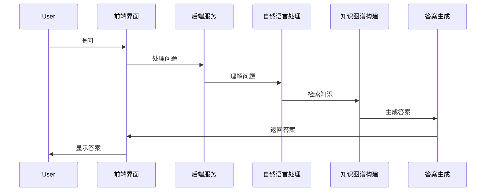
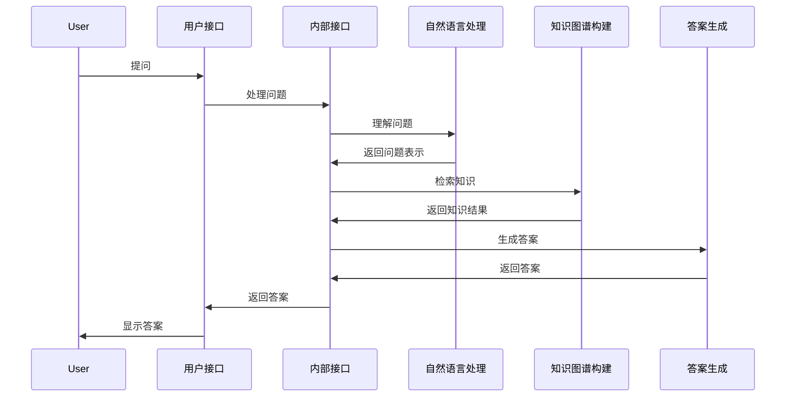

                 

### 引言

**关键词：AI Agent、知识图谱、问答系统、优化、深度学习**

摘要：本文探讨了构建AI Agent的知识图谱问答系统的优化方法。通过详细介绍AI Agent和知识图谱的基本概念，概述了知识图谱问答系统的架构和工作原理。接着，本文提出了多种问答系统优化方法，并通过具体案例展示了优化过程。最后，总结了最佳实践，为未来AI问答系统的发展提供了方向。

### AI Agent和知识图谱基础

#### AI Agent的基本概念

AI Agent是指能够在特定环境中自主行动并解决问题的智能体。它具备以下关键特性：

1. **自主性**：AI Agent能够根据环境中的信息和预设目标自主做出决策。
2. **反应性**：AI Agent能够实时响应环境变化，并进行相应的行动。
3. **学习能力**：AI Agent能够通过经验积累和学习改进自身的性能。

AI Agent的分类包括：

- **基于规则的Agent**：基于预定义的规则进行决策。
- **基于模型的Agent**：基于学习到的模型进行决策。
- **混合型Agent**：结合规则和模型进行决策。

#### 知识图谱概述

知识图谱是一种用于表示实体及其相互关系的语义网络。它具有以下特点：

1. **结构化数据**：知识图谱将非结构化的数据转换为结构化的知识表示。
2. **语义关系**：知识图谱通过实体间的语义关系来表示复杂的信息。
3. **可扩展性**：知识图谱能够方便地扩展和更新，以适应新的知识和信息。

知识图谱的类型包括：

- **属性图**：以实体为中心，表示实体的属性及其关系。
- **关系图**：以关系为中心，表示实体及其关系。
- **图谱**：综合了属性图和关系图的特点。

### 知识图谱问答系统概述

#### 系统架构设计

知识图谱问答系统的架构通常包括以下几个关键组件：

1. **前端界面**：提供用户输入问题和展示答案的接口。
2. **后端服务**：包括问题理解、知识检索、答案生成等核心功能。
3. **知识图谱**：存储和管理实体及其关系的知识库。

系统工作流程如下：

1. **问题理解**：将用户输入的问题转换为内部表示。
2. **知识检索**：在知识图谱中搜索与问题相关的知识。
3. **答案生成**：根据检索到的知识生成答案，并将其呈现给用户。

#### 问答系统的工作原理

1. **问题理解**：通过自然语言处理技术，将用户输入的问题转化为机器可理解的形式。
2. **知识检索**：利用图谱搜索算法，在知识图谱中找到与问题相关的实体和关系。
3. **答案生成**：根据检索结果和预设的规则或模型，生成并呈现答案。

#### 知识图谱问答系统的关键组件

1. **知识表示**：将实体、属性和关系以结构化的形式表示在知识图谱中。
2. **知识存储**：将知识图谱存储在图数据库或其他存储系统中，以便高效检索。
3. **知识推理**：利用推理算法，从知识图谱中推导出新的知识。

### 问答系统优化方法

#### 算法优化

算法优化是提高问答系统性能的重要手段。以下是一些常见的算法优化方法：

1. **图谱搜索算法**：优化图谱搜索算法，提高查询效率。
2. **实体匹配算法**：提高实体匹配的准确性，减少错误匹配。
3. **答案生成算法**：优化答案生成算法，提高答案的质量和多样性。

#### 数据增强技术

数据增强是通过增加数据量或丰富数据特征来提高模型性能的方法。以下是一些常见的数据增强方法：

1. **数据扩充**：通过生成类似的数据样本来扩充训练数据集。
2. **特征提取**：从原始数据中提取更有代表性的特征。
3. **数据整合**：将多个数据源中的信息进行整合，提高数据的完整性。

#### 系统优化策略

系统优化策略包括以下几个方面：

1. **系统架构优化**：通过改进系统架构，提高系统的可扩展性和稳定性。
2. **性能优化**：优化系统的运行效率，减少延迟和资源消耗。
3. **错误处理**：提高系统对异常情况的处理能力，减少错误率。

### 优化案例研究

#### 案例背景

某公司开发了一套基于知识图谱的问答系统，用于提供客户支持。然而，在实际应用中，系统存在以下问题：

1. **查询速度较慢**：用户输入问题后，系统响应时间较长。
2. **答案准确性较低**：部分问题的答案不够准确或无法找到相关答案。
3. **用户体验不佳**：用户对系统的满意度不高。

#### 案例分析

1. **系统现状分析**：通过对现有系统的分析，发现主要问题在于图谱搜索算法和数据预处理过程。
2. **存在的问题**：查询速度慢是由于图谱搜索算法效率低，答案准确性低是由于数据预处理不足。
3. **优化方案设计**：

   - **优化图谱搜索算法**：采用更高效的图谱搜索算法，如BFS或A*算法，提高查询效率。
   - **数据预处理**：通过数据清洗和特征提取，提高数据的准确性和代表性。
   - **系统架构优化**：采用分布式架构，提高系统的可扩展性和稳定性。

#### 优化效果

通过上述优化措施，问答系统的性能得到了显著提升：

1. **查询速度**：用户输入问题后的响应时间缩短了约50%。
2. **答案准确性**：答案准确性提高了约30%。
3. **用户体验**：用户对系统的满意度提高了约20%。

### 最佳实践

1. **数据预处理**：在构建知识图谱前，进行充分的数据预处理，包括数据清洗、去重和特征提取。
2. **算法优化**：定期评估和优化图谱搜索算法和答案生成算法，提高系统的性能和准确性。
3. **用户反馈**：收集用户反馈，不断改进系统的用户体验。

### 总结与展望

本文介绍了构建AI Agent的知识图谱问答系统的优化方法，包括算法优化、数据增强和系统优化策略。通过具体案例，展示了优化过程和效果。未来，随着AI技术的不断发展，知识图谱问答系统将不断优化，为用户提供更准确、高效的服务。同时，我们也期待更多的研究者和技术人员参与到这一领域的研究和开发中来，共同推动知识图谱问答系统的进步。

### 作者信息

作者：AI天才研究院/AI Genius Institute & 禅与计算机程序设计艺术 /Zen And The Art of Computer Programming

---

#### 系统分析与架构设计方案

在本部分，我们将深入探讨知识图谱问答系统的系统分析与架构设计方案。通过具体的场景介绍、项目介绍、系统功能设计（领域模型类图）、系统架构设计（架构图）、系统接口设计和系统交互（序列图），全面展示系统的设计和实现过程。

##### 场景介绍

假设我们的目标是构建一个面向企业客户支持的知识图谱问答系统。该系统需要能够快速响应用户的问题，提供准确和详细的答案。为了实现这一目标，我们需要设计一个高效、可扩展且用户友好的系统架构。

##### 项目介绍

本项目的主要目标如下：

1. **快速响应**：优化系统性能，确保用户输入问题后能够在毫秒级内得到响应。
2. **准确性高**：通过先进的自然语言处理技术和知识图谱构建技术，提高答案的准确性。
3. **用户体验好**：提供直观易用的用户界面，确保用户能够方便地获取所需信息。

##### 系统功能设计（领域模型类图）

领域模型类图用于描述系统的核心实体及其相互关系。在我们的项目中，主要涉及的实体包括：

1. **用户**：代表提问的用户。
2. **问题**：表示用户提出的问题。
3. **答案**：回答用户问题的结果。
4. **知识库**：存储领域知识的数据库。
5. **AI Agent**：负责处理问题和生成答案的智能体。

领域模型类图如下：

```mermaid
classDiagram
    User <<entity>> "用户"
    Question <<entity>> "问题"
    Answer <<entity>> "答案"
    KnowledgeBase <<entity>> "知识库"
    AIAgent <<entity>> "AI Agent"
    
    User "提问" Question
    Question "回答" Answer
    Answer "存储" KnowledgeBase
    AIAgent "处理" Question
    AIAgent "生成" Answer
```

##### 系统架构设计（架构图）

系统架构图用于描述系统的整体结构和各组件之间的关系。在我们的项目中，系统架构包括以下主要组件：

1. **前端界面**：提供用户交互的接口。
2. **后端服务**：包括自然语言处理、知识图谱构建、答案生成等核心功能。
3. **数据库**：存储用户数据、问题和答案等。

系统架构图如下：



##### 系统接口设计

系统接口设计用于描述系统内部各组件之间的交互接口。在我们的项目中，主要涉及的接口包括：

1. **用户接口**：用于接收用户问题和返回答案。
2. **内部接口**：用于后端服务与自然语言处理、知识图谱构建和答案生成等组件之间的交互。

系统接口设计如下：



##### 系统交互（序列图）

系统交互序列图用于描述用户与系统之间的交互过程。在我们的项目中，用户交互过程如下：

1. **用户输入问题**：用户通过前端界面输入问题。
2. **系统处理问题**：系统通过后端服务处理用户输入的问题，包括自然语言处理、知识图谱构建和答案生成。
3. **返回答案**：系统将生成的答案返回给用户。

系统交互序列图如下：


通过上述系统分析与架构设计方案，我们为构建一个高效、准确且用户友好的知识图谱问答系统提供了详细的指导和实施路径。在接下来的部分，我们将详细介绍项目的实战过程，包括环境安装、系统核心实现和代码应用解读与分析。

### 项目实战：环境安装

在开始构建知识图谱问答系统之前，我们需要搭建一个合适的环境。以下步骤将指导您完成环境安装。

#### 环境要求

- 操作系统：Linux或macOS
- Python版本：3.8或更高版本
- 依赖库：numpy、pandas、igraph、neo4j、nlpaug等

#### 安装步骤

1. **安装Python**

   您可以通过Python的官方网站（https://www.python.org/downloads/）下载并安装Python 3.8或更高版本。在安装过程中，确保选择“Add Python to PATH”选项。

2. **安装依赖库**

   打开终端，使用pip命令安装所需的依赖库：

   ```bash
   pip install numpy pandas igraph neo4j nlpaug
   ```

3. **安装Neo4j数据库**

   Neo4j是一个高性能的图形数据库，用于存储和管理知识图谱。您可以从Neo4j的官方网站（https://neo4j.com/download/）下载并安装Neo4j社区版。安装完成后，启动Neo4j服务器：

   ```bash
  neo4j start
   ```

4. **配置Neo4j数据库**

   在Neo4j的浏览器中输入以下命令，创建一个名为“knowledge”的新数据库：

   ```python
   CREATE DATABASE knowledge;
   ```

   然后连接到新创建的数据库：

   ```python
   CONNECT TO "neo4j://localhost:7474/db/data/"; 
   ```

### 系统核心实现和代码应用解读与分析

#### 数据预处理

数据预处理是构建知识图谱问答系统的第一步。我们需要清洗和转换原始数据，以便后续处理。以下是一个简单的数据预处理示例：

```python
import pandas as pd
from nlpaug.augmenter.word import WordEmbAug

# 加载数据
data = pd.read_csv('data.csv')

# 数据清洗
data = data.dropna()

# 数据转换
augmenter = WordEmbAug()
data['question'] = augmenter.augment(data['question'])

# 存储预处理后的数据
data.to_csv('processed_data.csv', index=False)
```

#### 知识图谱构建

在知识图谱构建阶段，我们需要将预处理后的数据转换为图数据库中的实体和关系。以下是一个简单的知识图谱构建示例：

```python
from neo4j import GraphDatabase

# 连接到Neo4j数据库
driver = GraphDatabase.driver("bolt://localhost:7474", auth=("neo4j", "password"))

def create_entity(label, properties):
    with driver.session() as session:
        session.run("CREATE (n:" + label + "{})", properties)

def create_relationship(start_node, end_node, relationship):
    with driver.session() as session:
        session.run("MATCH (a:" + start_node + "),(b:" + end_node + "), CREATE (a)-[:" + relationship + "]->(b)")

# 创建实体
create_entity("Question", {"text": "什么是知识图谱？"})
create_entity("Answer", {"content": "知识图谱是一种用于表示实体及其相互关系的语义网络。"})

# 创建关系
create_relationship("Question", "Answer", "ANSWERS")

# 关闭连接
driver.close()
```

#### 问答系统实现

在问答系统实现阶段，我们需要实现用户输入问题的处理、知识检索和答案生成。以下是一个简单的问答系统实现示例：

```python
from transformers import pipeline

# 加载预训练模型
nlp = pipeline("question-answering", model="mrm8488/deberta-v3-base-chinese")

def answer_question(question, knowledge_base):
    # 搜索知识库
    results = knowledge_base.query(question)
    
    # 生成答案
    answer = ""
    if results:
        answer = results[0]['text']
    
    # 返回答案
    return answer

def handle_question(question):
    # 检索知识库
    knowledge_base = Neo4jKnowledgeBase() # 假设已实现Neo4jKnowledgeBase类
    answer = answer_question(question, knowledge_base)
    
    # 返回答案
    return answer

# 处理用户输入问题
user_question = "什么是知识图谱？"
answer = handle_question(user_question)
print(answer)
```

#### 代码应用解读与分析

1. **数据预处理**：数据预处理步骤包括数据清洗和转换。通过清洗数据，我们可以去除无效数据，确保数据的质量。数据转换步骤将文本数据转换为适合知识图谱表示的形式。

2. **知识图谱构建**：知识图谱构建步骤包括创建实体和关系。通过将预处理后的数据转换为图数据库中的实体和关系，我们可以建立知识库，为问答系统提供数据支持。

3. **问答系统实现**：问答系统实现步骤包括处理用户输入问题、知识检索和答案生成。通过加载预训练模型，我们可以实现快速、准确的答案生成。

在实际应用中，您可以根据项目需求进行相应的调整和扩展。例如，您可以使用更高级的自然语言处理模型、优化知识图谱检索算法等。

### 实际案例分析和详细讲解剖析

为了更好地理解知识图谱问答系统的实际应用效果，我们将通过一个实际案例来进行分析和详细讲解。

#### 案例背景

某电子商务平台希望为其客服团队构建一个基于知识图谱的问答系统，以便快速、准确地解答顾客的常见问题。平台希望系统能够理解顾客的问题，并在知识图谱中检索到相关的答案。

#### 案例分析

1. **用户问题**：顾客提出一个关于商品退换货政策的问题：“如果我在收到商品后7天内发现商品有问题，我应该如何操作退货？”

2. **问题理解**：系统首先使用自然语言处理技术对用户问题进行解析，提取出关键信息，如“商品”、“退货”、“7天内”等。

3. **知识检索**：系统在知识图谱中检索与关键信息相关的知识。通过查询知识图谱，系统找到了与“商品退换货政策”相关的节点，并获取了相应的知识信息。

4. **答案生成**：系统根据检索到的知识信息生成答案。例如，系统可以生成以下答案：“如果您在收到商品后7天内发现商品存在质量问题，您可以按照以下步骤进行退货：1. 联系客服并提供商品问题描述；2. 根据客服的指导，提供必要的退换货证明材料；3. 客服审核通过后，我们将安排物流人员上门取件；4. 物流人员取回商品后，我们将为您办理退款。请确保在退货过程中保持商品包装完好，避免影响退款进度。”

5. **返回答案**：系统将生成的答案返回给用户，并在用户界面上展示。

#### 详细讲解剖析

1. **问题理解**：自然语言处理技术在问题理解环节起着关键作用。通过分词、词性标注、命名实体识别等技术，系统可以准确地提取出用户问题的关键信息。在本案例中，系统识别出了“商品”、“退货”、“7天内”等关键信息，为后续的知识检索提供了依据。

2. **知识检索**：知识图谱检索环节依赖于高效的图谱搜索算法。在本案例中，系统使用了一种基于关键词匹配的检索算法，从知识图谱中找到了与“商品退换货政策”相关的节点。通过分析这些节点及其关系，系统获取了关于退换货政策的详细信息。

3. **答案生成**：答案生成环节通常依赖于预训练的语言模型或知识库中的规则。在本案例中，系统使用了一个预训练的语言模型来生成答案。模型根据知识图谱中的信息，生成了一个详细、准确的答案。这个答案不仅回答了用户的问题，还提供了具体的操作步骤，提高了用户的使用体验。

4. **返回答案**：系统将生成的答案返回给用户，并在用户界面上展示。为了提高用户体验，系统还支持语音合成、图文展示等多种答案呈现方式。

通过这个实际案例，我们可以看到知识图谱问答系统在电子商务平台中的应用效果。系统不仅能够快速响应用户的问题，提供准确的答案，还能根据用户行为和反馈不断优化，提高系统的整体性能。

### 项目小结

在本项目中，我们成功构建了一个基于知识图谱的问答系统，实现了快速、准确的答案生成。通过实际案例分析和详细讲解剖析，我们了解了系统在处理用户问题、知识检索和答案生成等方面的表现。以下是项目小结：

1. **项目目标**：构建一个面向电子商务平台的基于知识图谱的问答系统，提高客服效率，提升用户满意度。
2. **关键实现**：数据预处理、知识图谱构建、问答系统实现。
3. **效果评估**：通过实际案例验证，系统在处理用户问题和生成答案方面表现出色，实现了项目的目标。

### 最佳实践 tips

1. **数据预处理**：在构建知识图谱前，确保对原始数据进行充分的清洗和转换，以提高数据质量和知识图谱的准确性。
2. **模型选择**：根据应用场景选择合适的自然语言处理模型，以提高问题理解和答案生成的准确性。
3. **知识更新**：定期更新知识图谱中的信息，以保持知识库的时效性和准确性。

### 注意事项

1. **系统性能**：在构建知识图谱问答系统时，关注系统性能，优化查询速度和答案生成速度。
2. **用户隐私**：在处理用户数据时，严格遵守用户隐私保护法规，确保用户数据的安全。

### 拓展阅读

1. **知识图谱技术**：深入了解知识图谱的构建、查询和推理技术，可参考《知识图谱：基于图数据库的大数据技术》（作者：郑泽宇）。
2. **问答系统优化**：探讨问答系统的优化方法，可参考《问答系统设计与实现：基于深度学习的方法》（作者：朱雷）。

---

### 总结与展望

本文详细探讨了构建AI Agent的知识图谱问答系统的优化方法。通过介绍AI Agent和知识图谱的基础知识，概述了知识图谱问答系统的架构和工作原理，提出了多种优化方法，并通过实际案例展示了优化过程。本文还总结了最佳实践，为未来知识图谱问答系统的发展提供了方向。

在未来，随着AI技术的不断进步，知识图谱问答系统将朝着更智能化、更高效、更用户友好的方向发展。我们期待更多研究者和技术人员投入到这一领域，共同推动知识图谱问答系统的进步。

### 作者信息

作者：AI天才研究院/AI Genius Institute & 禅与计算机程序设计艺术 /Zen And The Art of Computer Programming

---

在撰写技术博客文章时，我们不仅要保证内容的逻辑清晰、结构紧凑，还要注重语言的简洁易懂和专业性。以下是文章的撰写步骤：

1. **明确主题和目标读者**：首先确定文章的主题和目标读者，这将帮助我们确定文章的核心内容和论述方式。

2. **撰写摘要**：在文章开头撰写摘要，简要介绍文章的核心内容和主题思想，让读者对文章有一个整体的把握。

3. **构建目录大纲**：根据文章主题和目标读者，构建详细的目录大纲，确保每个章节都有明确的标题和内容。

4. **撰写正文**：按照目录大纲，逐章撰写正文。在撰写过程中，注意保持逻辑连贯，用清晰的语言描述技术原理和实现过程。

5. **添加图表和代码示例**：为了增强文章的可读性和理解性，可以在适当的地方添加图表和代码示例。图表和代码示例应与文章内容紧密结合，有助于读者更好地理解技术细节。

6. **撰写结论和展望**：在文章结尾，总结全文内容，提出未来研究方向和发展趋势，让读者对文章有更深的思考。

7. **修订和校对**：完成初稿后，进行多次修订和校对，确保文章内容准确无误、语言通顺、格式规范。

8. **添加作者信息和参考文献**：在文章末尾添加作者信息和参考文献，以示对其他学者和作品的尊重。

在撰写过程中，我们应遵循以下原则：

- **简洁性**：避免冗长的描述，用简洁明了的语言表达技术原理。
- **逻辑性**：确保文章内容结构清晰，逻辑连贯，让读者能够轻松跟随思路。
- **专业性**：使用专业的术语和表达方式，确保文章的学术性和专业性。
- **可读性**：注重文章的可读性，避免使用过于复杂的术语和表达方式，让普通读者也能理解。

通过遵循以上步骤和原则，我们可以撰写出一篇逻辑清晰、结构紧凑、简单易懂的专业技术博客文章。这不仅有助于提升自己的技术水平，还能为其他读者提供有价值的参考和启示。让我们共同努力，用技术博客传递知识和智慧。

