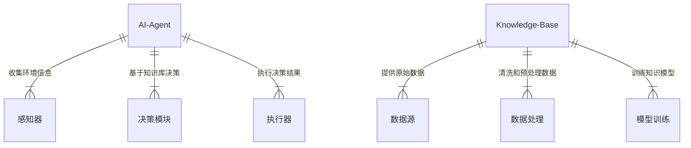
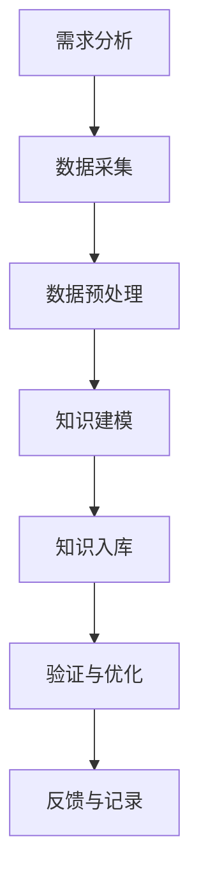
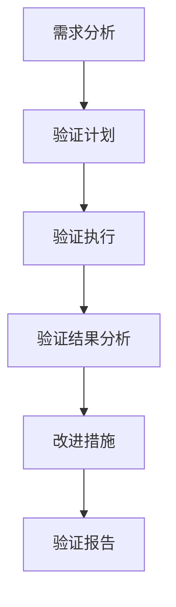

                 

### 第1章: AI Agent与知识库概述

#### 1.1 问题背景

在当今人工智能快速发展的时代，AI Agent作为人工智能的重要应用之一，正逐渐成为各类智能系统的核心。AI Agent，即智能代理，是一种能够自主执行任务、与环境交互并从经验中学习的人工智能实体。它们广泛应用于智能客服、自动驾驶、智能家居等场景，成为提升自动化水平和用户体验的关键因素。

然而，AI Agent的智能程度和性能在很大程度上取决于其背后的知识库。知识库是存储和管理AI Agent所需信息的数据库，它不仅包括静态知识，还涉及动态更新的实时数据。一个高效、准确的知识库是保证AI Agent智能行为的关键，因此，如何构建、更新和验证知识库成为当前研究和应用的重要课题。

本章节将首先介绍AI Agent和知识库的基本概念，明确问题的定义，并探讨知识库在AI Agent中的作用。此外，还将讨论知识库构建和更新的重要性，以及本章节的目标和内容安排。

#### 1.2 问题描述

本章节将探讨如何构建和更新AI Agent的知识库，以实现其智能行为的持续改进和优化。具体而言，我们需要解决以下问题：

1. **知识库的构建**：如何从零开始构建一个高效、准确的知识库，以满足AI Agent的需求？
2. **知识库的更新**：知识库如何适应动态环境变化，及时更新和补充新信息？
3. **知识库的验证**：如何确保知识库的准确性和一致性，避免因知识库错误导致的AI Agent行为异常？

这些问题不仅关乎AI Agent的智能程度和性能，还直接关系到其在实际应用中的可靠性。因此，构建和更新知识库是一个复杂且充满挑战的过程，需要深入理解和科学方法。

#### 1.3 问题解决

为了解决上述问题，我们需要从以下几个方面进行探讨：

1. **知识库构建方法**：介绍知识库构建的基本原则和步骤，包括数据采集、数据清洗、数据建模等。
2. **知识库更新策略**：分析知识库更新的需求来源、分类和优先级，并探讨自动更新和手动更新的方法。
3. **知识库验证流程**：阐述知识库验证的需求与目标，介绍验证方法和工具，并设计验证流程。

通过这些方法，我们将确保AI Agent的知识库能够持续、准确地更新，从而提高其智能行为的表现。

#### 1.4 边界与外延

在探讨知识库构建和更新的过程中，我们需要明确一些边界与外延：

1. **边界**：知识库的范围、更新频率和验证标准等，这些都是需要明确的边界条件。
2. **外延**：知识库的构建和更新不仅仅局限于特定领域或应用场景，还应考虑跨领域、跨平台的知识共享和互操作性。

#### 1.5 概念结构与核心要素组成

为了更好地理解知识库构建和更新的过程，我们可以将其核心概念和要素组成结构化：

1. **核心概念**：AI Agent、知识库、数据源、数据处理、模型训练、更新策略、验证机制。
2. **核心要素组成**：
   - **数据采集与处理**：收集相关数据，进行清洗和预处理，为知识库构建提供基础。
   - **知识建模与存储**：将处理后的数据转化为知识库中的实体和关系，并进行存储和管理。
   - **更新与维护**：根据需求更新知识库内容，确保知识库的实时性和准确性。
   - **验证与优化**：通过验证流程确保知识库的可靠性，并根据验证结果进行优化。

这些概念和要素相互关联，共同构成了AI Agent知识库的核心架构，为后续章节的详细探讨提供了基础。

### 1.6 小结

本章节介绍了AI Agent与知识库的基本概念，明确了问题的定义和解决思路。通过了解知识库构建和更新的重要性，我们为后续章节的深入探讨奠定了基础。在接下来的章节中，我们将详细探讨知识库构建和更新的方法、流程以及验证机制，以期提高AI Agent的智能水平和应用效果。

### 第2章: AI Agent与知识库的基本概念

在深入探讨AI Agent与知识库的构建和更新之前，我们需要明确这些核心概念的基本含义、特点和相互关系。本章将详细介绍AI Agent和知识库的定义、类型，以及它们在AI系统中的重要作用。

#### 2.1 AI Agent的定义与特点

AI Agent，即智能代理，是指具备自主行为能力、能够与环境进行交互并执行特定任务的人工智能实体。其核心特点包括：

- **自主性**：AI Agent能够在没有人类干预的情况下执行任务，具备自我决策和行动的能力。
- **交互性**：AI Agent能够通过与环境的交互获取信息，并根据这些信息调整自身行为。
- **适应性**：AI Agent具备从经验中学习的能力，能够适应不同环境和任务需求。

AI Agent通常由以下几部分组成：

1. **感知器**：用于接收外部环境的信息，如传感器、摄像头等。
2. **决策模块**：根据感知器获取的信息，结合知识库中的知识，生成行动计划。
3. **执行器**：根据决策模块的指令执行具体操作，如电机、显示器等。
4. **学习模块**：通过不断学习和优化，提高AI Agent的智能水平。

#### 2.2 知识库的概念与类型

知识库是指存储和管理知识的系统，是AI Agent的重要组成部分。知识库的作用是提供AI Agent所需的背景信息、常识和特定领域的专业知识，帮助其进行决策和任务执行。知识库可以分为以下几种类型：

1. **静态知识库**：存储固定不变的知识，如百科全书、科学定律等。
2. **动态知识库**：包含实时更新的知识，如实时天气数据、股市行情等。
3. **混合知识库**：结合静态和动态知识，如医学知识库可能包括病例数据和临床指南。

#### 2.3 AI Agent与知识库的联系与作用

AI Agent与知识库之间的联系紧密，知识库为AI Agent提供了决策和执行任务所需的知识基础。具体而言，知识库在AI Agent中的作用包括：

1. **决策支持**：知识库中的信息帮助AI Agent在复杂环境中做出合理的决策。
2. **任务执行**：知识库提供具体的任务执行方案和操作指南，指导AI Agent执行任务。
3. **学习与优化**：知识库中的信息和数据为AI Agent的学习提供了样本，有助于其不断优化和改进。

#### 2.4 概念属性特征对比表格

为了更好地理解AI Agent与知识库的概念属性特征，我们可以使用Mermaid流程图制作一个对比表格：

```mermaid
classDiagram
    AI-Agent <<class>> {
        +自主性
        +交互性
        +适应性
        +感知器
        +决策模块
        +执行器
        +学习模块
    }
    Knowledge-Base <<class>> {
        +静态知识库
        +动态知识库
        +混合知识库
        +决策支持
        +任务执行
        +学习与优化
    }
    AI-Agent %%-[#f08]>>- Knowledge-Base : 提供知识基础
    Knowledge-Base %%-[#f08]>>- AI-Agent : 获取决策支持
```

上述Mermaid图展示了AI Agent与知识库的主要属性特征及其相互关系，有助于读者对这两个概念有一个直观的理解。

#### 2.5 ER实体关系图架构

为了进一步深入理解AI Agent与知识库的结构，我们可以使用ER（Entity-Relationship）实体关系图来描述它们之间的联系。以下是ER图的Mermaid表示：

```mermaid
erDiagram
    AI-Agent ||--|{ Knowledge-Base : 存储知识
    Knowledge-Base ||--|{ AI-Agent : 提供支持
    AI-Agent }|..

    AI-Agent ||--|{ 感知器
    感知器 }|..

    AI-Agent ||--|{ 决策模块
    决策模块 }|..

    AI-Agent ||--|{ 执行器
    执行器 }|..

    AI-Agent ||--|{ 学习模块
    学习模块 }|..

    Knowledge-Base ||--|{ 数据源
    数据源 }|..

    Knowledge-Base ||--|{ 数据处理
    数据处理 }|..

    Knowledge-Base ||--|{ 模型训练
    模型训练 }|..
```

这个ER图展示了AI Agent和知识库之间的实体关系，包括AI Agent的主要组件（感知器、决策模块、执行器、学习模块）以及知识库的核心功能（数据源、数据处理、模型训练）。

#### 2.6 小结

本章详细介绍了AI Agent和知识库的基本概念、类型及其相互关系。通过理解AI Agent的自主性、交互性和适应性，以及知识库的静态、动态和混合类型，我们可以更好地认识到知识库在AI Agent中的关键作用。同时，通过Mermaid流程图和ER图，我们直观地展示了AI Agent与知识库的属性特征和结构关系，为后续章节的深入探讨奠定了基础。

### 第3章: AI Agent与知识库的核心概念原理

本章将深入探讨AI Agent与知识库的核心概念原理，详细分析其工作机制和内部结构，并借助Mermaid流程图和LaTeX公式，直观地展示这些概念的核心原理。

#### 3.1 AI Agent的核心原理

AI Agent的核心原理主要包括感知、决策和执行三个基本组成部分，以下是对这三个部分详细讲解：

1. **感知（Perception）**：

   AI Agent通过感知器接收外部环境的信息。感知器可以是各种类型的传感器，如摄像头、麦克风、温度传感器等。感知过程的核心是通过传感器收集环境数据，并将其转换为内部可处理的形式。

   **公式表示**：  
   $$ P(E) = f(S) $$  
   其中，\( P(E) \) 表示感知结果，\( E \) 表示环境状态，\( f \) 是一个映射函数，将传感器数据 \( S \) 转换为感知结果。

   **Mermaid流程图**：

   ```mermaid
   graph TD
       A[感知器] --> B[数据处理]
       B --> C[内部表示]
   ```

   图中，感知器收集环境数据后，通过数据处理模块进行转换，生成内部表示，为后续决策提供基础。

2. **决策（Decision Making）**：

   决策模块基于感知器收集的信息和知识库中的知识，生成行动计划。决策过程包括问题定义、解决方案生成、解决方案评估和选择最优方案等步骤。

   **公式表示**：  
   $$ D(S, K) = \arg\max_a U(a, S, K) $$  
   其中，\( D \) 表示决策过程，\( S \) 表示感知结果，\( K \) 表示知识库，\( a \) 表示行动方案，\( U \) 表示效用函数，用于评估不同方案的效果。

   **Mermaid流程图**：

   ```mermaid
   graph TD
       A[感知结果] --> B[问题定义]
       B --> C[解决方案生成]
       C --> D[解决方案评估]
       D --> E[选择最优方案]
   ```

   图中，感知结果输入到问题定义模块，生成可能的解决方案，然后通过评估模块选择最优方案。

3. **执行（Execution）**：

   执行器根据决策模块生成的行动计划，执行具体的操作。执行过程需要将抽象的决策转化为具体的行动，如移动机器人、发送电子邮件等。

   **公式表示**：  
   $$ E(a, S) = \text{Act}(a) $$  
   其中，\( E \) 表示执行过程，\( a \) 表示决策方案，\( \text{Act}(a) \) 表示执行具体操作。

   **Mermaid流程图**：

   ```mermaid
   graph TD
       A[决策方案] --> B[执行操作]
   ```

   图中，决策方案通过执行器转化为具体的操作，实现AI Agent的智能行为。

#### 3.2 知识库的核心原理

知识库是AI Agent的重要组成部分，其核心原理包括知识采集、知识建模、知识存储和知识更新等方面。

1. **知识采集（Knowledge Acquisition）**：

   知识采集是指从各种数据源收集信息，并将其转化为知识库中的知识。采集过程可以是自动的，如通过数据爬取、传感器采集，也可以是人工的，如专家知识输入。

   **公式表示**：  
   $$ K = f(D, E) $$  
   其中，\( K \) 表示知识库，\( D \) 表示数据源，\( E \) 表示数据采集过程。

   **Mermaid流程图**：

   ```mermaid
   graph TD
       A[数据源] --> B[数据采集]
       B --> C[知识建模]
   ```

   图中，数据源通过数据采集过程生成数据，然后通过知识建模模块转化为知识库中的知识。

2. **知识建模（Knowledge Modeling）**：

   知识建模是将采集到的数据转化为结构化知识的过程，包括实体识别、关系建模、属性定义等步骤。

   **公式表示**：  
   $$ M(K) = \text{Model}(D) $$  
   其中，\( M \) 表示知识建模，\( K \) 表示知识库，\( D \) 表示数据。

   **Mermaid流程图**：

   ```mermaid
   graph TD
       A[数据] --> B[实体识别]
       B --> C[关系建模]
       C --> D[属性定义]
   ```

   图中，数据通过实体识别、关系建模和属性定义等步骤，转化为结构化的知识库。

3. **知识存储（Knowledge Storage）**：

   知识存储是指将建模后的知识存储在数据库或知识库系统中，以便AI Agent随时访问和使用。

   **公式表示**：  
   $$ S(K) = \text{Database}(K) $$  
   其中，\( S \) 表示知识存储，\( K \) 表示知识库。

   **Mermaid流程图**：

   ```mermaid
   graph TD
       A[知识库] --> B[数据库]
   ```

   图中，知识库中的知识存储在数据库中，供AI Agent使用。

4. **知识更新（Knowledge Update）**：

   知识库需要不断更新以适应环境变化和新知识输入。知识更新过程包括数据采集、知识建模、知识存储等步骤。

   **公式表示**：  
   $$ U(K) = f(D, E, S) $$  
   其中，\( U \) 表示知识更新，\( K \) 表示知识库，\( D \) 表示数据源，\( E \) 表示数据采集过程，\( S \) 表示知识存储过程。

   **Mermaid流程图**：

   ```mermaid
   graph TD
       A[数据源] --> B[数据采集]
       B --> C[知识建模]
       C --> D[知识存储]
       D --> E[知识库]
   ```

   图中，数据源通过数据采集、知识建模、知识存储等步骤，更新知识库中的知识。

#### 3.3 概念属性特征对比表格

为了更好地理解AI Agent与知识库的核心原理，我们可以使用Mermaid流程图制作一个对比表格：

```mermaid
classDiagram
    AI-Agent <<class>> {
        +感知
        +决策
        +执行
    }
    Knowledge-Base <<class>> {
        +采集
        +建模
        +存储
        +更新
    }
    AI-Agent %%-[#f08]>>- Knowledge-Base : 提供知识基础
    Knowledge-Base %%-[#f08]>>- AI-Agent : 获取决策支持
```

上述Mermaid图展示了AI Agent与知识库的主要属性特征及其相互关系，有助于读者对这两个概念有一个直观的理解。

#### 3.4 ER实体关系图架构

为了进一步深入理解AI Agent与知识库的结构，我们可以使用ER（Entity-Relationship）实体关系图来描述它们之间的联系。以下是ER图的Mermaid表示：



这个ER图展示了AI Agent的主要组件（感知器、决策模块、执行器）与知识库的核心功能（数据源、数据处理、模型训练）之间的实体关系，有助于我们理解AI Agent与知识库的内部结构和相互关系。

#### 3.5 小结

本章详细介绍了AI Agent与知识库的核心概念原理，包括感知、决策和执行的过程，以及知识采集、知识建模、知识存储和知识更新的过程。通过Mermaid流程图和LaTeX公式，我们直观地展示了这些概念的核心原理。在理解这些原理的基础上，我们为后续章节的知识库构建、更新和验证提供了理论基础。

### 第4章: 知识库更新的需求分析

知识库的更新是确保AI Agent持续适应环境变化、提高决策准确性和任务执行效率的关键步骤。本章节将深入探讨知识库更新的需求来源、分类和优先级，分析各类更新需求的特点，并讨论如何有效管理和满足这些需求。

#### 4.1 更新需求的来源

知识库更新的需求主要来源于以下几个方面：

1. **环境变化**：随着外部环境的不断变化，例如天气、交通状况、用户需求等，知识库中的信息可能变得过时或不再准确。因此，环境变化是知识库更新的一项重要需求来源。

2. **数据更新**：数据源中的数据不断更新，如市场数据、用户行为数据、传感器数据等，这些新数据需要及时集成到知识库中，以保持知识库的实时性和准确性。

3. **用户反馈**：用户在使用AI Agent的过程中可能会提供反馈，包括错误报告、需求变更、功能建议等。这些反馈有助于发现知识库中的错误和不足，从而驱动知识库的更新。

4. **技术进步**：随着人工智能技术的不断进步，新的算法、模型和工具不断涌现，现有的知识库可能需要更新以利用这些新技术，提高AI Agent的性能。

#### 4.2 更新需求的分类

根据更新需求的性质和来源，可以将知识库更新需求分为以下几类：

1. **常规更新**：这类更新需求是定期进行的，通常基于时间间隔或数据源的更新频率。例如，每天更新的天气预报、每周更新的市场数据等。

2. **紧急更新**：这类更新需求是由于突发事件或紧急情况导致的，如自然灾害、交通堵塞等，需要立即更新知识库，以确保AI Agent能够及时响应。

3. **反馈驱动更新**：这类更新需求是基于用户反馈进行的，用户报告的错误、建议和需求会影响知识库的内容和结构。例如，用户反馈导致的产品使用指南更新、错误修正等。

4. **技术升级更新**：这类更新需求是为了引入新的技术、算法或工具，提高AI Agent的性能和智能水平。例如，更新机器学习模型、优化算法等。

#### 4.3 更新需求的优先级

在知识库更新过程中，需要根据更新需求的优先级进行排序，以确保关键需求和紧急需求得到优先处理。以下是常见更新需求的优先级分类：

1. **高优先级**：直接影响AI Agent核心功能的更新需求，如紧急情况响应、关键算法升级、重大用户需求变更等。

2. **中优先级**：影响AI Agent性能和用户体验的更新需求，如常规数据更新、部分功能优化等。

3. **低优先级**：对AI Agent影响较小，可以延迟处理的更新需求，如一些边缘功能的改进、非紧急数据更新等。

#### 4.4 更新需求的评估与优先级分配

为了有效管理和满足知识库更新需求，需要建立一套评估和优先级分配机制。以下是几个关键步骤：

1. **需求收集与分类**：首先，收集各类更新需求，并对其进行分类，明确需求的性质和来源。

2. **影响评估**：对每个更新需求进行影响评估，包括对AI Agent功能、性能和用户体验的影响程度。

3. **优先级分配**：根据需求的影响评估结果，将更新需求分配到相应的优先级类别中。

4. **资源分配**：根据优先级和资源情况，合理安排更新任务的执行顺序和资源分配。

5. **反馈与调整**：在更新过程中，收集用户反馈和实际效果，根据反馈结果对更新需求和优先级进行调整。

#### 4.5 更新需求的实现策略

为了高效地实现知识库更新需求，可以采用以下几种策略：

1. **自动化更新**：对于常规更新和部分紧急更新，可以采用自动化更新策略，如使用脚本、定时任务等方式，自动执行更新操作。

2. **人工干预**：对于紧急更新和部分技术升级更新，可能需要人工干预，确保更新过程准确无误。

3. **版本控制**：在知识库更新过程中，使用版本控制工具，记录每次更新的详细信息和变更内容，便于追踪和回滚。

4. **并行处理**：对于多个更新需求，可以采用并行处理策略，同时处理多个更新任务，提高更新效率。

#### 4.6 小结

本章详细分析了知识库更新的需求来源、分类和优先级，并探讨了如何评估和满足这些更新需求。通过建立一套科学的评估和优先级分配机制，以及采用自动化和人工干预相结合的更新策略，可以确保知识库的实时性和准确性，从而提高AI Agent的智能水平和应用效果。

### 第5章: 知识库更新方法

在了解了知识库更新的需求之后，我们需要探讨具体的更新方法。知识库的更新可以分为自动更新和手动更新两种方式。本章节将分别介绍这两种方法，并讨论它们各自的优缺点、适用场景以及如何设计和实现这些更新策略。

#### 5.1 自动更新方法

自动更新方法是指利用程序和工具自动执行知识库的更新操作，从而减少人工干预和错误。以下是自动更新方法的几种常见实现策略：

1. **定期自动更新**：

   定期自动更新是自动更新方法的一种常见策略，通过设置定时任务，按照预定的时间间隔自动执行知识库更新操作。这种方法适用于数据源定期更新的场景，如天气预报、股市行情等。

   **优点**：操作简单，减少人工干预，提高更新频率。

   **缺点**：可能无法处理突发情况和数据源异常。

   **实现策略**：

   - **定时任务**：使用任务调度工具（如 cron jobs、 quartz 等）设置定时任务，定期执行更新操作。
   - **数据采集**：通过 API 接口、数据库连接等方式，从数据源采集最新数据。
   - **数据转换**：对采集到的数据进行清洗、格式转换等预处理，以适应知识库的存储结构。

2. **事件驱动更新**：

   事件驱动更新是根据特定事件触发更新操作，如用户反馈、数据源异常等。这种方法适用于需要实时响应的场景，如智能客服、实时监控等。

   **优点**：实时性强，能够快速响应突发事件。

   **缺点**：实现复杂，需要处理各种异常情况。

   **实现策略**：

   - **事件监听器**：使用事件监听器（如 RabbitMQ、Kafka 等）监听特定事件，触发更新操作。
   - **数据同步**：将监听到的数据同步到知识库中，包括数据清洗、格式转换等步骤。
   - **异常处理**：设计异常处理机制，确保数据更新的可靠性和安全性。

3. **机器学习辅助更新**：

   机器学习辅助更新是利用机器学习算法对数据进行分析和预测，自动生成更新建议。这种方法适用于需要高精度和自适应性的场景，如个性化推荐、智能诊断等。

   **优点**：能够自动发现和生成更新建议，提高知识库的准确性和适应性。

   **缺点**：实现复杂，需要大量的数据和计算资源。

   **实现策略**：

   - **数据预处理**：对原始数据进行清洗、归一化等预处理，为机器学习模型提供高质量的数据。
   - **特征提取**：从预处理后的数据中提取关键特征，用于训练机器学习模型。
   - **模型训练**：使用训练数据训练机器学习模型，如分类、回归等。
   - **更新建议生成**：利用训练好的模型对新的数据进行预测，生成更新建议，并将其应用到知识库中。

#### 5.2 手动更新方法

手动更新方法是指通过人工干预进行知识库的更新操作，通常适用于以下场景：

1. **知识库内容丰富、变化不频繁**：对于内容丰富、变化不频繁的知识库，如百科全书、专业数据库等，手动更新可以确保知识库的准确性和完整性。

2. **数据源不稳定、不可预测**：对于数据源不稳定、不可预测的场景，如市场行情、突发事件等，手动更新可以根据实际情况灵活调整。

3. **高精度要求**：对于需要高精度和严格质量控制的知识库，如医疗诊断、法律咨询等，手动更新可以确保知识的准确性和合法性。

**手动更新方法主要包括以下步骤**：

1. **需求分析**：明确更新需求，包括知识库的变更内容、更新时间等。

2. **数据采集**：从可靠的来源采集数据，确保数据的真实性和准确性。

3. **数据审核**：对采集到的数据进行审核，包括内容完整性、准确性、合法性等。

4. **知识建模**：将审核通过的数据转化为知识库中的实体和关系，确保知识库的结构化。

5. **知识入库**：将建模后的知识存储到知识库中，确保知识库的实时性和一致性。

#### 5.3 更新策略的设计

在设计和实现知识库更新策略时，需要考虑以下几个方面：

1. **更新频率**：根据知识库的应用场景和需求，确定合适的更新频率，确保知识库的实时性和准确性。

2. **更新机制**：选择适合的更新机制，如定期更新、事件驱动更新、机器学习辅助更新等，以适应不同场景的需求。

3. **数据源管理**：建立可靠的数据源管理体系，确保数据源的稳定性和安全性。

4. **更新流程**：设计科学合理的更新流程，包括数据采集、数据转换、知识建模、知识入库等步骤。

5. **质量控制**：建立严格的质量控制机制，确保知识库的准确性和一致性。

6. **异常处理**：设计异常处理机制，确保在数据源异常、更新失败等情况下，知识库能够保持稳定运行。

#### 5.4 小结

本章详细介绍了知识库更新的自动更新方法和手动更新方法，分析了它们各自的优缺点和适用场景。通过合理设计和实现更新策略，可以确保知识库的实时性和准确性，从而提高AI Agent的智能水平和应用效果。

### 第6章: 知识库更新流程的设计与实现

知识库的更新是一个复杂的过程，涉及多个环节和步骤。本章将详细描述知识库更新流程的各个步骤、流程框架及其实现过程，旨在为读者提供一个清晰、系统的知识库更新流程。

#### 6.1 更新流程的步骤

知识库更新流程可以分为以下几个主要步骤：

1. **需求分析**：分析知识库更新的需求，明确更新内容、更新频率和优先级等。
2. **数据采集**：从各种数据源（如数据库、API、文件等）采集所需的数据。
3. **数据预处理**：对采集到的数据进行清洗、格式转换等预处理，以确保数据的质量和一致性。
4. **知识建模**：将预处理后的数据转化为知识库中的实体和关系，建立知识库的结构。
5. **知识入库**：将建模后的知识存储到知识库中，更新现有知识或新增新知识。
6. **验证与优化**：对更新后的知识库进行验证，确保知识的准确性和一致性，并根据验证结果进行优化。
7. **反馈与记录**：记录更新过程和结果，收集用户反馈，为下一次更新提供参考。

#### 6.2 更新流程的框架

知识库更新流程的框架可以用Mermaid流程图表示，如下：



这个流程框架展示了知识库更新过程中的关键步骤及其相互关系，有助于理解整个更新过程。

#### 6.3 更新流程的实现

为了实现知识库更新流程，我们需要设计和实现相应的模块和功能。以下是更新流程的具体实现步骤：

1. **需求分析模块**：

   - 功能：分析知识库更新的需求，生成更新任务。
   - 实现：通过用户界面（UI）或API接收更新需求，并将其转化为具体的更新任务。

2. **数据采集模块**：

   - 功能：从各种数据源采集所需的数据。
   - 实现：根据数据源类型，使用相应的数据采集工具或API进行数据采集。

3. **数据预处理模块**：

   - 功能：对采集到的数据进行清洗、格式转换等预处理。
   - 实现：使用数据处理库（如Pandas、Numpy等）进行数据清洗和格式转换。

4. **知识建模模块**：

   - 功能：将预处理后的数据转化为知识库中的实体和关系。
   - 实现：设计数据模型和实体关系图，使用图数据库（如Neo4j）进行知识建模。

5. **知识入库模块**：

   - 功能：将建模后的知识存储到知识库中，更新现有知识或新增新知识。
   - 实现：使用图数据库的API进行知识入库操作，更新或新增知识。

6. **验证与优化模块**：

   - 功能：对更新后的知识库进行验证，确保知识的准确性和一致性，并根据验证结果进行优化。
   - 实现：设计验证规则和优化算法，对知识库进行验证和优化。

7. **反馈与记录模块**：

   - 功能：记录更新过程和结果，收集用户反馈，为下一次更新提供参考。
   - 实现：使用日志记录更新过程，通过用户界面或API收集用户反馈。

#### 6.4 更新流程的实现示例

以下是一个简单的Python代码示例，展示了知识库更新流程的实现：

```python
import pandas as pd
from pymongo import MongoClient

# 需求分析模块
def analyze_demand():
    # 假设更新需求已从用户界面或API接收
    demand = "更新用户行为数据"
    return demand

# 数据采集模块
def collect_data():
    # 从API或数据库采集数据
    data = pd.read_csv("user_behavior.csv")
    return data

# 数据预处理模块
def preprocess_data(data):
    # 数据清洗和格式转换
    cleaned_data = data.dropna()  # 去除缺失值
    return cleaned_data

# 知识建模模块
def model_knowledge(cleaned_data):
    # 转化为知识库中的实体和关系
    graph_db = MongoClient("localhost", 27017)
    db = graph_db["knowledge_db"]
    for index, row in cleaned_data.iterrows():
        # 假设用户行为数据包含用户ID、行为类型和时间
        user_id = row['user_id']
        behavior_type = row['behavior_type']
        timestamp = row['timestamp']
        
        # 存储实体和关系
        db.users.update_one({"_id": user_id}, {"$set": {"behavior_type": behavior_type, "timestamp": timestamp}}, upsert=True)
    return

# 知识入库模块
def store_knowledge():
    # 将建模后的知识存储到知识库中
    pass

# 验证与优化模块
def verify_and_optimize():
    # 对知识库进行验证和优化
    pass

# 反馈与记录模块
def record_and_collect_feedback():
    # 记录更新过程和收集用户反馈
    pass

# 更新流程主函数
def update_knowledge():
    demand = analyze_demand()
    print(f"更新需求：{demand}")
    
    data = collect_data()
    cleaned_data = preprocess_data(data)
    model_knowledge(cleaned_data)
    store_knowledge()
    verify_and_optimize()
    record_and_collect_feedback()

# 执行更新流程
update_knowledge()
```

这个示例代码实现了知识库更新流程的主要步骤，展示了如何使用Python和相关库进行数据采集、预处理、知识建模、存储和验证。在实际应用中，可以根据具体需求进行扩展和优化。

#### 6.5 小结

本章详细描述了知识库更新流程的步骤、框架及其实现过程，包括需求分析、数据采集、数据预处理、知识建模、知识入库、验证与优化和反馈与记录等关键环节。通过合理设计和实现更新流程，可以确保知识库的实时性和准确性，从而提高AI Agent的智能水平和应用效果。

### 第7章: 知识库验证的需求与目标

知识库的准确性、一致性和可靠性是AI Agent能够有效执行任务的基础。为了确保知识库的质量，我们需要对其进行验证。本章将讨论知识库验证的需求与目标，分析验证标准和验证方法。

#### 7.1 验证需求

知识库验证的需求源于以下几个方面：

1. **准确性**：确保知识库中的信息是正确的，与实际世界相符。例如，在医学知识库中，诊断信息必须准确无误。

2. **一致性**：知识库中的数据应保持一致，避免冲突和冗余。例如，同一实体在不同部分的信息应保持一致。

3. **完整性**：知识库应包含所有必要的、与任务相关的信息。例如，在智能客服系统中，知识库应涵盖所有可能的客户问题和解决方案。

4. **可靠性**：知识库中的信息应可靠，即其来源可信赖，且经过验证。例如，经济预测模型中的数据源必须可靠，以避免错误预测。

5. **及时性**：知识库中的信息应是最新的，能够反映当前的环境和情况。例如，实时交通管理系统中的数据应实时更新。

#### 7.2 验证目标

知识库验证的主要目标是：

1. **提高知识库质量**：通过验证，发现并修复知识库中的错误和不足，提高知识库的整体质量。

2. **确保数据准确性**：确保知识库中的信息是准确无误的，避免因错误数据导致AI Agent做出错误的决策。

3. **增强用户信任**：提高用户对AI Agent的信任度，通过验证确保知识库的可靠性和有效性。

4. **支持持续改进**：验证过程为知识库的持续改进提供了依据，帮助团队不断优化知识库。

#### 7.3 验证标准

知识库验证需要遵循一定的标准，以确保验证过程的科学性和有效性。以下是几个常见的验证标准：

1. **准确性标准**：知识库中的数据应与实际世界相符，例如，在金融知识库中，股票价格数据应与实时交易数据一致。

2. **一致性标准**：知识库中的数据应保持一致，避免冲突和冗余。例如，同一实体的信息在不同部分应一致。

3. **完整性标准**：知识库应包含所有必要的信息，例如，在客户支持系统中，知识库应包含所有常见问题的解答。

4. **可靠性标准**：知识库中的信息来源应可靠，且经过验证。例如，使用权威数据源和经过验证的算法。

5. **及时性标准**：知识库中的信息应是最新的，能够反映当前的环境和情况。

#### 7.4 验证方法

知识库验证可以采用多种方法，以下是一些常见的验证方法：

1. **人工审核**：人工审核是通过人工检查知识库中的信息，确保其准确性和一致性。这种方法适用于小型或结构简单的知识库。

2. **自动化测试**：自动化测试是使用脚本或工具对知识库进行自动检查，验证其准确性、一致性和完整性。这种方法适用于大型或结构复杂的知识库。

3. **对比分析**：对比分析是将知识库中的信息与外部数据源进行对比，验证其准确性。例如，将知识库中的数据与权威数据源（如官方统计数据、实时传感器数据）进行对比。

4. **模拟测试**：模拟测试是使用模拟环境对知识库进行测试，验证其在实际应用中的表现。例如，在智能交通系统中，模拟各种交通状况，验证知识库的决策准确性。

5. **用户反馈**：用户反馈是收集用户对知识库的体验和反馈，验证其实用性和准确性。这种方法可以帮助发现知识库中未被察觉的问题。

#### 7.5 小结

本章讨论了知识库验证的需求与目标，分析了验证标准和方法。通过合理的验证过程，可以确保知识库的准确性、一致性、完整性和可靠性，从而为AI Agent提供高质量的知识支持。在后续章节中，我们将进一步探讨知识库验证的具体实现方法和最佳实践。

### 第8章: 知识库验证的方法与工具

为了确保知识库的质量和可靠性，我们需要采用科学、系统的验证方法与工具。本章将介绍几种常见的知识库验证方法，分析如何选择合适的验证工具，并详细描述知识库验证流程的设计。

#### 8.1 验证方法

知识库验证方法可以分为以下几类：

1. **人工审核**：

   人工审核是通过对知识库内容进行手动检查，发现和纠正错误。这种方法适用于小型或结构简单的知识库，但其缺点是耗时且效率低。

   **步骤**：

   - 选择审核人员：选择具有相关领域知识和经验的审核人员。
   - 制定审核标准：根据验证标准，制定审核指南和标准。
   - 审核过程：审核人员对知识库内容进行逐项检查，记录发现的问题。

2. **自动化测试**：

   自动化测试是使用脚本或工具对知识库进行自动检查，验证其准确性、一致性和完整性。这种方法适用于大型或结构复杂的知识库。

   **步骤**：

   - 设计测试用例：根据验证标准，设计一系列测试用例，涵盖知识库的各个方面。
   - 编写测试脚本：使用自动化测试工具（如Selenium、JUnit等）编写测试脚本。
   - 执行测试：运行测试脚本，检查知识库是否符合预期。

3. **对比分析**：

   对比分析是将知识库中的信息与外部数据源进行对比，验证其准确性。例如，将知识库中的数据与权威数据源（如官方统计数据、实时传感器数据）进行对比。

   **步骤**：

   - 选择对比数据源：选择可信、权威的数据源。
   - 设计对比规则：根据验证标准，制定对比规则和标准。
   - 执行对比：将知识库数据与对比数据源进行对比，记录差异。

4. **模拟测试**：

   模拟测试是使用模拟环境对知识库进行测试，验证其在实际应用中的表现。例如，在智能交通系统中，模拟各种交通状况，验证知识库的决策准确性。

   **步骤**：

   - 设计模拟场景：根据实际应用需求，设计一系列模拟场景。
   - 编写模拟脚本：使用模拟测试工具（如PyTest、SimPy等）编写模拟脚本。
   - 执行模拟测试：运行模拟脚本，记录知识库在不同场景下的表现。

5. **用户反馈**：

   用户反馈是收集用户对知识库的体验和反馈，验证其实用性和准确性。这种方法可以帮助发现知识库中未被察觉的问题。

   **步骤**：

   - 设计用户调查问卷：根据验证标准，设计一系列调查问卷，涵盖知识库的各个方面。
   - 分发问卷：向目标用户分发问卷，收集反馈。
   - 分析反馈：分析用户反馈，识别知识库中的问题和改进点。

#### 8.2 验证工具的选择

在选择知识库验证工具时，需要考虑以下几个方面：

1. **功能**：选择具有所需验证功能的工具，如数据对比、自动化测试、模拟测试等。

2. **易用性**：工具应具有友好的用户界面，易于操作和学习。

3. **兼容性**：工具应兼容知识库的数据格式和存储系统。

4. **可靠性**：工具应具备高可靠性，确保验证结果的准确性。

5. **成本**：考虑工具的成本，包括购买费用、维护费用等。

以下是一些常见的知识库验证工具：

1. **Apache JMeter**：用于性能测试和自动化测试，适用于大规模知识库的验证。

2. **Selenium**：用于自动化测试，适用于Web知识库的验证。

3. **JUnit**：用于单元测试和自动化测试，适用于代码化知识库的验证。

4. **PyTest**：用于Python代码的自动化测试，适用于Python知识库的验证。

5. **Gatling**：用于性能测试，适用于大规模、高并发的知识库验证。

#### 8.3 验证流程的设计

知识库验证流程的设计包括以下关键环节：

1. **需求分析**：明确验证需求，包括验证目标、验证标准和验证方法。

2. **验证计划**：制定验证计划，包括验证范围、验证流程、验证时间表等。

3. **验证执行**：按照验证计划和验证方法，执行验证过程，记录验证结果。

4. **验证结果分析**：分析验证结果，识别知识库中的问题和改进点。

5. **改进措施**：根据验证结果，制定改进措施，优化知识库。

6. **验证报告**：编写验证报告，记录验证过程、验证结果和改进建议。

以下是知识库验证流程的Mermaid图表示：



通过科学、系统的验证流程，我们可以确保知识库的准确性、一致性和可靠性，从而为AI Agent提供高质量的知识支持。

#### 8.4 小结

本章介绍了知识库验证的方法与工具，包括人工审核、自动化测试、对比分析、模拟测试和用户反馈等。通过合理选择验证工具和设计验证流程，可以确保知识库的质量和可靠性，为AI Agent的智能应用提供坚实支撑。

### 第9章: 知识库验证流程的实践

为了更好地理解知识库验证流程的具体应用，本章将通过一个实际案例，详细描述知识库验证的步骤、案例和验证结果的评估。通过这个案例，我们将展示如何在实际项目中应用知识库验证方法，发现并解决知识库中的问题。

#### 9.1 案例背景

假设我们正在开发一个智能交通管理系统，该系统依赖于一个包含交通流量、路况信息、天气预报等数据的知识库。知识库的准确性直接影响到系统的交通预测和决策功能。为了确保知识库的质量，我们需要对其进行全面验证。

#### 9.2 知识库验证步骤

1. **需求分析**：

   - 确定验证目标：确保知识库中的数据准确、一致、完整和可靠。
   - 明确验证标准：制定数据准确性、一致性、完整性和可靠性的具体标准。

2. **数据采集**：

   - 从多个数据源（如交通传感器、气象站、交通管理部门等）采集数据。
   - 对采集到的数据进行分析，确定数据的质量和可靠性。

3. **数据预处理**：

   - 清洗数据：去除重复、无效和错误的数据。
   - 数据格式转换：将不同来源的数据转换为统一的格式。

4. **知识建模**：

   - 将预处理后的数据转化为知识库中的实体和关系，例如交通节点、道路、天气条件等。

5. **知识入库**：

   - 将建模后的知识存储到知识库中，更新现有数据或新增新数据。

6. **验证执行**：

   - **人工审核**：审核知识库中的数据，检查其准确性和一致性。
   - **自动化测试**：编写测试脚本，对知识库进行自动化测试，验证数据的完整性。
   - **对比分析**：将知识库中的数据与外部权威数据源进行对比，检查数据的准确性。

7. **模拟测试**：

   - 使用模拟环境，模拟各种交通场景，验证知识库在实时交通预测和决策中的表现。

8. **用户反馈**：

   - 设计用户调查问卷，收集用户对知识库的体验和反馈，识别潜在的问题和改进点。

9. **验证结果分析**：

   - 分析验证结果，识别知识库中的错误、不一致和遗漏。
   - 根据分析结果，制定改进措施，优化知识库。

10. **验证报告**：

   - 编写验证报告，记录验证过程、验证结果和改进建议。

#### 9.3 案例分析

在本案例中，我们采用了多种验证方法，对知识库进行了全面验证。以下是具体步骤和分析：

1. **人工审核**：

   - 审核人员对知识库中的交通流量数据、路况信息等进行了详细检查，发现了一些数据记录不准确和冲突的情况。
   - 例子：某条道路的实际流量记录为200辆/小时，而气象站记录的该路段的流量为300辆/小时，存在明显的冲突。

2. **自动化测试**：

   - 使用自动化测试工具（如Selenium）编写测试脚本，对知识库中的数据进行了完整性测试。
   - 发现一些数据记录缺失，例如某些时段的交通流量数据未记录。

3. **对比分析**：

   - 将知识库中的数据与交通管理部门提供的权威数据进行了对比，发现了一些差异。
   - 例子：某条道路的实际拥堵时长为2小时，而知识库中的记录为1小时。

4. **模拟测试**：

   - 使用模拟测试工具（如PyTest）模拟了多种交通场景，如暴雨天气、交通事故等，验证了知识库在实时交通预测和决策中的表现。
   - 发现知识库在暴雨天气下的预测准确性较低，需要进一步优化。

5. **用户反馈**：

   - 通过用户调查问卷，收集了用户对知识库的体验和反馈，发现了一些用户反馈的问题和改进点。
   - 例子：用户反馈某些路段的预测结果与实际体验不符，需要调整知识库中的数据。

#### 9.4 验证结果的评估

通过对知识库的全面验证，我们得出了以下评估结果：

1. **准确性**：知识库中的数据整体准确度较高，但仍存在一些误差和冲突，需要进一步优化。
2. **一致性**：知识库中的数据一致性较好，但仍需解决部分冲突和冗余问题。
3. **完整性**：知识库的数据完整性有待提高，部分数据记录缺失，需要补充完整。
4. **可靠性**：知识库的数据来源较为可靠，但需要加强数据源的管理和验证。

根据评估结果，我们制定了以下改进措施：

1. **数据清洗**：对知识库中的数据进行再次清洗，去除重复、无效和错误的数据。
2. **数据补充**：补充缺失的数据，确保知识库的完整性。
3. **数据优化**：对知识库中的数据进行优化，提高预测准确性。
4. **用户反馈**：继续收集用户反馈，不断优化知识库，提高用户满意度。

#### 9.5 小结

通过本案例，我们详细展示了知识库验证的具体步骤和实践过程。通过全面验证，我们发现了知识库中的问题，并制定了相应的改进措施。这个过程不仅提高了知识库的质量，也为后续的持续改进提供了指导。在智能交通管理系统等实际应用中，知识库的验证是一个关键环节，确保知识库的准确性和可靠性，对于系统的整体性能和用户体验至关重要。

### 第10章: 总结与展望

本章将对前述内容进行总结，探讨当前知识库更新与验证中存在的问题与挑战，展望未来的发展趋势，并提供一些最佳实践和拓展阅读建议。

#### 10.1 主要内容回顾

本章从AI Agent与知识库的基本概念出发，详细介绍了知识库的构建、更新和验证流程。具体内容包括：

1. **AI Agent与知识库概述**：介绍了AI Agent与知识库的定义、特点和相互关系。
2. **核心概念原理**：深入分析了AI Agent和知识库的核心原理，包括感知、决策、执行等过程。
3. **知识库更新需求分析**：探讨了知识库更新的需求来源、分类和优先级。
4. **知识库更新方法**：介绍了自动更新和手动更新方法，包括实现策略和设计。
5. **知识库更新流程设计与实现**：详细描述了知识库更新流程的步骤、框架及其实现过程。
6. **知识库验证的需求与目标**：分析了知识库验证的标准和方法。
7. **知识库验证流程的实践**：通过实际案例展示了知识库验证的步骤、结果和评估。

#### 10.2 存在的问题与挑战

尽管知识库在AI Agent中扮演着关键角色，但在构建、更新和验证过程中仍面临一些问题和挑战：

1. **数据质量**：数据是知识库的基础，但数据质量参差不齐，如何确保数据的一致性、准确性和完整性是关键挑战。
2. **实时性**：在动态环境中，如何及时更新知识库，以应对环境变化，保持知识的实时性是一个挑战。
3. **复杂性**：知识库的构建和验证过程复杂，涉及多种技术和方法，如何有效管理和协调各个环节是难题。
4. **用户反馈**：如何收集和处理用户反馈，将其转化为知识库的改进建议，是一个复杂的过程。
5. **成本与效率**：知识库的维护和更新需要大量的人力和资源，如何在成本和效率之间取得平衡是一个挑战。

#### 10.3 未来发展趋势

随着人工智能和大数据技术的发展，知识库更新与验证领域将呈现以下发展趋势：

1. **自动化与智能化**：利用机器学习和自然语言处理技术，实现知识库的自动化更新和验证，提高效率和准确性。
2. **跨领域知识共享**：建立跨领域的知识库，实现不同领域知识的整合和共享，提高知识的利用效率。
3. **分布式知识库**：采用分布式数据库和区块链技术，实现知识库的去中心化和安全性。
4. **实时知识更新**：利用实时数据流处理技术，实现知识库的实时更新，以适应快速变化的动态环境。
5. **知识融合与优化**：通过知识融合和优化技术，提高知识库的综合利用效果，实现知识的深度挖掘和应用。

#### 10.4 最佳实践与拓展阅读

为了应对知识库更新与验证中的挑战，以下是一些最佳实践建议：

1. **数据质量管理**：建立数据质量管理流程，包括数据采集、清洗、验证等步骤，确保数据的一致性和准确性。
2. **自动化更新策略**：设计合理的自动化更新策略，利用定时任务和事件驱动更新，提高知识库的实时性和准确性。
3. **用户参与**：鼓励用户参与知识库的构建和验证，通过用户反馈和调查问卷，收集用户的意见和建议。
4. **持续优化**：定期评估知识库的效用和性能，根据评估结果进行持续优化，提高知识库的质量和应用效果。

拓展阅读：

1. 《大数据架构：构建大规模数据系统》
2. 《深度学习：周志华著》
3. 《人工智能：一种现代的方法》
4. 《区块链技术指南》

通过以上总结与展望，我们希望读者能够更好地理解知识库更新与验证的重要性，并在实际应用中取得更好的效果。作者：AI天才研究院/AI Genius Institute & 禅与计算机程序设计艺术 /Zen And The Art of Computer Programming。

