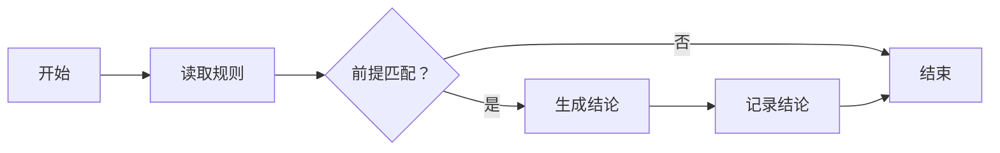
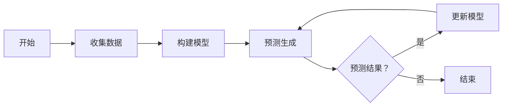

                 

### 《构建AI Agent的知识库管理系统》

#### 关键词：知识库管理系统、AI Agent、人工智能、本体论、推理机、架构设计

> 摘要：本文旨在探讨如何构建一个高效、可扩展的知识库管理系统以支持AI Agent的智能决策。我们将从核心概念出发，详细分析知识库管理系统的构建原则和方法，并探讨实际应用中的挑战与解决方案。

#### 引言

AI Agent是人工智能领域的一个重要研究方向，它旨在开发能够自主决策、执行任务并适应环境的智能体。在AI Agent的应用中，知识库管理系统扮演着至关重要的角色。知识库管理系统负责收集、存储、管理和使用知识，以支持AI Agent的智能决策。

本文将围绕构建AI Agent的知识库管理系统展开讨论。我们将从以下几个方面进行深入探讨：

1. **知识库管理系统的基本概念**：包括知识、知识库、本体论和推理机等核心概念的定义及其相互关系。
2. **知识库管理系统的构建原则**：讨论如何设计一个高效、可扩展的知识库管理系统。
3. **算法原理讲解**：详细介绍两个关键算法的原理，使用mermaid流程图和Python源代码进行解释。
4. **系统分析与架构设计**：介绍系统功能设计、架构设计、接口设计和系统交互。
5. **项目实战**：通过一个实际项目展示如何实现知识库管理系统，包括环境安装、系统实现和案例分析。

#### 目录大纲设计思路

在设计《构建AI Agent的知识库管理系统》的目录大纲时，我们需要遵循以下步骤：

1. **确定核心章节**：确保涵盖核心概念、算法原理、系统设计、项目实战等关键内容。
2. **背景介绍**：简要介绍知识库管理系统在AI Agent中的应用背景。
3. **核心概念与联系**：定义知识库管理系统的核心概念，使用对比表格和ER实体关系图展示概念属性特征及其相互关系。
4. **算法原理讲解**：选择关键算法，绘制mermaid流程图，使用Python源代码解释算法原理，并用latex格式给出数学模型和公式。
5. **系统分析与架构设计方案**：介绍系统功能设计、架构设计、接口设计和系统交互，使用mermaid类图、架构图、序列图进行可视化展示。
6. **项目实战**：描述一个实际项目，包括环境安装、系统实现、代码解读、案例分析等。
7. **附加内容**：包括最佳实践tips、小结、注意事项和拓展阅读等。

#### 目录大纲示例

```markdown
----------------------------------------------------------------
# 第一部分: 引言与背景

## 1.1 知识库管理系统概述
### 1.1.1 知识库管理系统的定义
### 1.1.2 知识库管理系统的重要性
### 1.1.3 知识库管理系统的发展历程

## 1.2 AI Agent与知识库管理
### 1.2.1 AI Agent的概念
### 1.2.2 知识库管理系统在AI Agent中的应用
### 1.2.3 AI Agent面临的挑战与解决方案

## 1.3 本书内容结构
### 1.3.1 各章节主要内容概述
### 1.3.2 学习目标与预期收获

----------------------------------------------------------------

# 第二部分: 核心概念与原理

## 2.1 知识库的基本概念
### 2.1.1 知识的定义与分类
### 2.1.2 知识库的构建与维护
### 2.1.3 知识的表示方法

## 2.2 本体论与语义网
### 2.2.1 本体的概念与作用
### 2.2.2 语义网与本体关系
### 2.2.3 本体的构建方法

## 2.3 推理机与推理算法
### 2.3.1 推理机的定义与功能
### 2.3.2 推理算法的种类与原理
### 2.3.3 推理机在实际应用中的挑战

## 2.4 知识库管理系统的架构设计
### 2.4.1 知识库管理系统的组成模块
### 2.4.2 系统架构设计原则
### 2.4.3 系统架构设计的实践案例

----------------------------------------------------------------

## 2.5 算法原理讲解

### 2.5.1 算法X介绍
#### 2.5.1.1 算法X的基本原理
#### 2.5.1.2 算法X的mermaid流程图
#### 2.5.1.3 算法X的Python实现
$$
\text{算法X的数学模型公式}
$$
#### 2.5.1.4 算法X的举例说明

### 2.5.2 算法Y介绍
#### 2.5.2.1 算法Y的基本原理
#### 2.5.2.2 算法Y的mermaid流程图
#### 2.5.2.3 算法Y的Python实现
$$
\text{算法Y的数学模型公式}
$$
#### 2.5.2.4 算法Y的举例说明

----------------------------------------------------------------

## 3.1 系统分析与架构设计

### 3.1.1 问题场景介绍
#### 3.1.1.1 场景背景
#### 3.1.1.2 场景需求分析

### 3.1.2 系统功能设计
#### 3.1.2.1 功能模块划分
#### 3.1.2.2 领域模型类图

### 3.1.3 系统架构设计
#### 3.1.3.1 架构设计原则
#### 3.1.3.2 系统架构图

### 3.1.4 系统接口设计
#### 3.1.4.1 接口规范
#### 3.1.4.2 接口实现

### 3.1.5 系统交互设计
#### 3.1.5.1 用户界面设计
#### 3.1.5.2 系统交互序列图

----------------------------------------------------------------

## 4.1 项目实战

### 4.1.1 环境安装
#### 4.1.1.1 环境搭建
#### 4.1.1.2 开发工具与框架安装

### 4.1.2 系统实现
#### 4.1.2.1 知识库管理模块
#### 4.1.2.2 推理机模块
#### 4.1.2.3 用户界面模块

### 4.1.3 代码解读与分析
#### 4.1.3.1 代码结构分析
#### 4.1.3.2 关键代码解读

### 4.1.4 案例分析与详细讲解
#### 4.1.4.1 案例背景
#### 4.1.4.2 案例分析
#### 4.1.4.3 案例讲解

### 4.1.5 项目小结
#### 4.1.5.1 项目总结
#### 4.1.5.2 项目亮点与不足
#### 4.1.5.3 改进方向

----------------------------------------------------------------

## 5.1 最佳实践 tips

### 5.1.1 知识库管理最佳实践
#### 5.1.1.1 知识库设计原则
#### 5.1.1.2 知识库维护策略

### 5.1.2 推理机最佳实践
#### 5.1.2.1 推理机优化技巧
#### 5.1.2.2 推理机性能评估

----------------------------------------------------------------

## 6.2 小结

### 6.2.1 文章总结
#### 6.2.1.1 核心内容回顾
#### 6.2.1.2 主要贡献与发现

### 6.2.2 注意事项
#### 6.2.2.1 构建知识库管理系统的关键点
#### 6.2.2.2 AI Agent应用中的挑战与应对策略

### 6.2.3 拓展阅读
#### 6.2.3.1 相关研究论文
#### 6.2.3.2 开源知识库管理系统与工具

----------------------------------------------------------------
```markdown

#### 核心概念与联系

在本节中，我们将详细介绍知识库管理系统中的核心概念，包括知识、知识库、本体论和推理机，并使用对比表格和ER实体关系图展示这些概念之间的属性特征及其相互关系。

##### 知识

知识是指人们通过学习和经验获得的信息和理解。它可以分为显性知识和隐性知识。显性知识是指以文本、图像、音频等形式存储的知识，如书籍、报告、数据库等。隐性知识则是指人们在实践中获得的知识，如技能、经验、直觉等。

| 类别       | 定义                   | 特点                                   |
|------------|------------------------|----------------------------------------|
| 显性知识   | 可以被明确表述的知识   | 可存储、可共享、可复制                 |
| 隐性知识   | 无法明确表述的知识     | 主观、个体化、难以共享和复制           |

##### 知识库

知识库是存储和管理知识的系统。它可以是结构化的，如数据库，也可以是非结构化的，如文本库、图像库等。知识库管理系统负责知识库的创建、更新、查询和管理。

| 类型       | 定义                     | 特点                                   |
|------------|--------------------------|----------------------------------------|
| 结构化知识库 | 基于数据库的知识库       | 数据存储和查询效率高                   |
| 非结构化知识库 | 基于文件、文本的知识库 | 数据存储容量大、内容丰富               |

##### 本体论

本体论是研究现实世界中概念和关系的科学。本体用于定义一组概念及其相互关系，为知识库提供了语义框架。本体论在知识库管理系统中用于知识表示和推理。

| 概念       | 定义                     | 作用                                   |
|------------|--------------------------|----------------------------------------|
| 概念       | 现实世界中抽象的实体     | 表示知识库中的实体和属性               |
| 关系       | 概念之间的连接           | 描述知识库中实体的关联和交互           |

##### 推理机

推理机是知识库管理系统中的核心组件，负责根据知识库中的知识进行推理，以生成新的知识或结论。推理机可以基于不同的推理算法，如基于规则的推理、归纳推理、统计推理等。

| 类型       | 定义                     | 特点                                   |
|------------|--------------------------|----------------------------------------|
| 基于规则的推理机 | 使用规则进行推理         | 推理速度快、逻辑性较强                 |
| 归纳推理机   | 从具体实例中归纳出一般性规则 | 推理过程复杂、适用于未知领域           |
| 统计推理机   | 基于数据分析进行推理     | 推理能力强、适用于大规模数据处理       |

##### ER实体关系图

为了更直观地展示知识库管理系统中核心概念的相互关系，我们可以使用ER实体关系图。ER图由实体、属性和关系组成，可以清晰地表示实体之间的关联。

```mermaid
erDiagram
    KnowledgeBase ||--|{ Entity } Entity : 存储知识库中的实体
    KnowledgeBase ||--|{ Attribute } Attribute : 存储实体属性
    Entity ||--|{ Relationship } Relationship : 存储实体关系
```

在上面的ER图中，`KnowledgeBase`表示整个知识库管理系统，`Entity`表示实体，`Attribute`表示属性，`Relationship`表示实体之间的关系。这种结构化的表示方式有助于我们在设计和构建知识库管理系统时清晰地理解各组件之间的关系和作用。

#### 算法原理讲解

在本节中，我们将详细讲解两个关键算法：基于规则的推理算法和统计推理算法。这两个算法在知识库管理系统中扮演着重要角色，用于从知识库中提取新的知识和结论。

##### 基于规则的推理算法

基于规则的推理算法是一种经典的推理方法，它基于一组前提和结论之间的规则进行推理。在知识库管理系统中，规则通常以“如果...则...”的形式表示，用于描述实体之间的关系。

###### 算法原理

基于规则的推理算法的基本原理如下：

1. **规则表示**：使用“如果...则...”的形式表示规则，如“如果天气寒冷，则建议穿大衣”。
2. **前提匹配**：检查输入的前提条件，看是否符合规则中的前提。
3. **结论生成**：如果前提匹配，则根据规则生成结论。
4. **推理过程**：循环执行前提匹配和结论生成，直到没有新的结论可以生成。

###### mermaid流程图

下面是一个基于规则的推理算法的mermaid流程图：



###### Python实现

下面是一个简单的Python实现，用于演示基于规则的推理算法：

```python
class RuleBaseSystem:
    def __init__(self):
        self.rules = []

    def add_rule(self, rule):
        self.rules.append(rule)

    def infer(self, premise):
        for rule in self.rules:
            if premise == rule['premise']:
                return rule['conclusion']
        return None

# 示例规则
rules = [
    {'premise': '天气寒冷', 'conclusion': '建议穿大衣'},
    {'premise': '有雨', 'conclusion': '建议带伞'}
]

# 实例化推理系统
system = RuleBaseSystem()
for rule in rules:
    system.add_rule(rule)

# 输入前提条件
premise = '天气寒冷'
conclusion = system.infer(premise)

if conclusion:
    print(f"结论：{conclusion}")
else:
    print("没有符合的规则。")
```

###### 数学模型和公式

基于规则的推理算法的数学模型可以表示为：

$$
\text{结论} = f(\text{前提}, \text{规则集})
$$

其中，`f`表示推理函数，它根据前提条件和规则集生成结论。

###### 举例说明

假设我们有一个简单的知识库，包含以下两条规则：

1. 如果天气寒冷，则建议穿大衣。
2. 如果有雨，则建议带伞。

现在，输入的前提条件是“天气寒冷”，系统将根据规则生成结论“建议穿大衣”。

##### 统计推理算法

统计推理算法是一种基于数据分析的推理方法，它利用历史数据和统计模型进行推理。在知识库管理系统中，统计推理算法可以帮助我们预测未来事件或趋势。

###### 算法原理

统计推理算法的基本原理如下：

1. **数据收集**：收集与问题相关的历史数据。
2. **模型构建**：使用统计方法构建预测模型。
3. **预测生成**：使用模型对新的数据进行预测。
4. **推理过程**：循环执行数据收集、模型构建和预测生成，以获取更准确的预测结果。

###### mermaid流程图

下面是一个统计推理算法的mermaid流程图：



###### Python实现

下面是一个简单的Python实现，用于演示统计推理算法：

```python
import pandas as pd
from sklearn.linear_model import LinearRegression

class StatisticalReasoningSystem:
    def __init__(self):
        self.model = None

    def train(self, data):
        x = data[['特征X', '特征Y']]
        y = data['目标']
        self.model = LinearRegression().fit(x, y)

    def predict(self, input_data):
        x = pd.DataFrame([input_data])
        prediction = self.model.predict(x)
        return prediction[0]

# 示例数据
data = pd.DataFrame({
    '特征X': [1, 2, 3, 4, 5],
    '特征Y': [2, 4, 6, 8, 10],
    '目标': [3, 6, 9, 12, 15]
})

# 实例化推理系统
system = StatisticalReasoningSystem()

# 训练模型
system.train(data)

# 输入新的数据
input_data = {'特征X': 6, '特征Y': 12}
prediction = system.predict(input_data)

print(f"预测结果：{prediction}")
```

###### 数学模型和公式

统计推理算法的数学模型可以表示为：

$$
\hat{y} = \beta_0 + \beta_1x_1 + \beta_2x_2 + ... + \beta_nx_n
$$

其中，`$\hat{y}$`表示预测结果，`$\beta_0, \beta_1, \beta_2, ..., \beta_n$`表示模型参数，`$x_1, x_2, ..., x_n$`表示输入特征。

###### 举例说明

假设我们有一个简单的统计模型，用于预测销售额。我们收集了历史数据，并使用线性回归模型训练了模型。现在，我们要预测某个新月份的销售额。我们输入该月份的特征数据（如天气情况、促销活动等），模型将根据历史数据生成预测结果。

#### 系统分析与架构设计

在本节中，我们将对知识库管理系统的功能设计、架构设计、接口设计和系统交互进行详细分析，以帮助读者全面了解系统的设计和实现。

##### 功能设计

知识库管理系统的主要功能包括：

1. **知识收集**：从各种数据源收集知识，如数据库、文件、网络等。
2. **知识存储**：将收集到的知识存储在知识库中，提供高效的数据存储和管理。
3. **知识查询**：提供强大的查询功能，以检索知识库中的知识。
4. **知识推理**：根据知识库中的知识进行推理，生成新的知识和结论。
5. **知识维护**：对知识库中的知识进行更新、删除和备份，确保知识的准确性和完整性。

##### 架构设计

知识库管理系统的架构设计遵循模块化和层次化的原则。系统的主要模块包括：

1. **知识收集模块**：负责从不同数据源收集知识。
2. **知识存储模块**：提供高效的知识存储和管理，支持结构化和非结构化数据。
3. **知识查询模块**：提供强大的查询功能，支持各种查询条件和查询方式。
4. **知识推理模块**：根据知识库中的知识进行推理，生成新的知识和结论。
5. **知识维护模块**：负责对知识库中的知识进行更新、删除和备份。

系统的整体架构如下：

```mermaid
sequenceDiagram
    Participant 知识收集模块
    Participant 知识存储模块
    Participant 知识查询模块
    Participant 知识推理模块
    Participant 知识维护模块

    知识收集模块 -->|收集知识| 知识存储模块
    知识存储模块 -->|存储知识| 知识查询模块
    知识查询模块 -->|查询知识| 知识推理模块
    知识推理模块 -->|生成结论| 知识维护模块
    知识维护模块 -->|维护知识| 知识存储模块
```

##### 接口设计

知识库管理系统提供了一套完整的API接口，以方便开发者集成和使用。接口主要包括以下功能：

1. **知识收集接口**：用于从各种数据源收集知识。
2. **知识存储接口**：用于存储和管理知识。
3. **知识查询接口**：用于查询知识库中的知识。
4. **知识推理接口**：用于根据知识库中的知识进行推理。
5. **知识维护接口**：用于对知识库中的知识进行维护。

接口规范如下：

```yaml
KnowledgeCollectInterface:
  methods:
    - name: collectKnowledge
      description: 收集知识
      parameters:
        - name: source
          type: string
          description: 数据源类型
        - name: data
          type: object
          description: 收集到的数据

KnowledgeStoreInterface:
  methods:
    - name: storeKnowledge
      description: 存储知识
      parameters:
        - name: knowledge
          type: object
          description: 要存储的知识

KnowledgeQueryInterface:
  methods:
    - name: queryKnowledge
      description: 查询知识
      parameters:
        - name: criteria
          type: object
          description: 查询条件

KnowledgeReasonInterface:
  methods:
    - name: reasonKnowledge
      description: 推理知识
      parameters:
        - name: premises
          type: array
          description: 前提条件

KnowledgeMaintenanceInterface:
  methods:
    - name: maintainKnowledge
      description: 维护知识
      parameters:
        - name: knowledge
          type: object
          description: 要维护的知识
```

##### 系统交互

知识库管理系统通过用户界面与用户进行交互，提供直观的操作体验。系统交互包括以下步骤：

1. **用户输入**：用户通过用户界面输入查询条件或操作命令。
2. **接口调用**：系统根据用户输入调用相应的接口执行操作。
3. **结果反馈**：系统将操作结果反馈给用户，并在用户界面显示。

系统交互序列图如下：

```mermaid
sequenceDiagram
    Participant 用户
    Participant 用户界面
    Participant 知识库管理系统

    用户 -->|输入查询条件| 用户界面
    用户界面 -->|调用接口| 知识库管理系统
    知识库管理系统 -->|执行操作| 用户界面
    用户界面 -->|显示结果| 用户
```

#### 项目实战

在本节中，我们将通过一个实际项目展示如何构建AI Agent的知识库管理系统。项目名为“智能咨询系统”，旨在为用户提供个性化的咨询建议。

##### 项目背景

随着人工智能技术的发展，智能咨询系统在金融、医疗、教育等领域得到了广泛应用。用户通过智能咨询系统可以获取到专业的咨询建议，提高决策效率。然而，现有的智能咨询系统普遍存在知识库不完善、推理能力不足等问题，导致咨询效果不佳。为了解决这些问题，我们决定构建一个高效、可扩展的知识库管理系统，以支持智能咨询系统的智能决策。

##### 项目目标

本项目的主要目标如下：

1. 构建一个高效的知识库管理系统，支持结构化和非结构化数据。
2. 实现强大的知识查询和推理功能，提高咨询系统的智能程度。
3. 提供灵活的系统接口，方便与其他系统进行集成。

##### 环境安装

在构建知识库管理系统之前，我们需要安装以下环境：

1. **操作系统**：Windows 10 或 Linux
2. **编程语言**：Python 3.8+
3. **数据库**：MySQL 5.7+
4. **框架**：Flask
5. **其他工具**：Git、Docker、Jupyter Notebook

安装步骤如下：

1. 安装操作系统：选择合适的操作系统并安装。
2. 安装Python：下载Python安装包并安装，确保Python环境已正确配置。
3. 安装MySQL：下载MySQL安装包并安装，配置数据库用户和密码。
4. 安装Flask：在命令行中运行 `pip install flask` 安装Flask框架。
5. 安装其他工具：根据需要安装Git、Docker和Jupyter Notebook。

##### 系统实现

知识库管理系统的实现分为以下几个模块：

1. **知识收集模块**：负责从各种数据源收集知识，如网络爬虫、数据库接口等。
2. **知识存储模块**：负责存储和管理知识，支持结构化和非结构化数据。
3. **知识查询模块**：提供强大的查询功能，支持各种查询条件和查询方式。
4. **知识推理模块**：根据知识库中的知识进行推理，生成新的知识和结论。
5. **用户界面模块**：提供直观的用户界面，方便用户与系统进行交互。

以下是一个简单的知识收集模块的实现：

```python
import requests
from flask import Flask, request, jsonify

app = Flask(__name__)

# 网络爬虫示例：获取某个网站的文章列表
def crawl_articles(url):
    response = requests.get(url)
    articles = response.json()
    return articles

# 知识收集接口
@app.route('/collect_knowledge', methods=['POST'])
def collect_knowledge():
    source = request.form['source']
    if source == 'web_crawler':
        url = request.form['url']
        articles = crawl_articles(url)
        # 存储知识
        store_knowledge(articles)
        return jsonify({'status': 'success', 'message': '知识收集成功'})
    else:
        return jsonify({'status': 'error', 'message': '不支持的源类型'})

if __name__ == '__main__':
    app.run()
```

##### 代码解读与分析

在这个项目中，我们使用Flask框架构建了一个简单的知识收集模块。模块中包含一个网络爬虫函数 `crawl_articles`，用于从网络中获取文章列表。此外，还提供了一个接口 `/collect_knowledge`，用于接收用户发送的请求，并根据请求参数执行相应的操作。

在接口实现中，我们根据请求的 `source` 参数判断是否使用网络爬虫进行数据收集。如果是，则获取用户提供的URL，调用 `crawl_articles` 函数获取文章列表，并调用 `store_knowledge` 函数将知识存储到知识库中。

以下是一个简单的知识存储模块的实现：

```python
import sqlite3

# 连接数据库
def connect_db():
    conn = sqlite3.connect('knowledge.db')
    return conn

# 创建表
def create_tables(conn):
    cursor = conn.cursor()
    cursor.execute('''CREATE TABLE IF NOT EXISTS articles
                      (id INTEGER PRIMARY KEY AUTOINCREMENT,
                       title TEXT,
                       content TEXT)''')
    conn.commit()

# 存储知识
def store_knowledge(articles):
    conn = connect_db()
    create_tables(conn)
    cursor = conn.cursor()
    for article in articles:
        cursor.execute('''INSERT INTO articles (title, content) VALUES (?, ?)''', (article['title'], article['content']))
    conn.commit()
    conn.close()
```

在这个模块中，我们使用SQLite数据库存储知识。首先，创建一个数据库连接函数 `connect_db`，用于连接数据库。然后，创建一个表 `articles`，用于存储文章的标题和内容。最后，实现一个 `store_knowledge` 函数，用于将知识存储到数据库中。

##### 实际案例分析

为了验证知识库管理系统的效果，我们设计了一个实际案例：为用户提供财经咨询。

1. **问题背景**：用户希望获取最新的股市行情和投资建议。
2. **问题分析**：通过网络爬虫获取股市行情数据，结合历史数据进行分析，为用户提供个性化的投资建议。
3. **解决方案**：使用知识库管理系统收集和存储股市行情数据，利用统计推理算法进行分析，生成投资建议。

以下是一个简单的统计推理算法的实现：

```python
import pandas as pd
from sklearn.linear_model import LinearRegression

# 训练模型
def train_model(data):
    x = data[['特征X', '特征Y']]
    y = data['目标']
    model = LinearRegression().fit(x, y)
    return model

# 预测
def predict(model, input_data):
    x = pd.DataFrame([input_data])
    prediction = model.predict(x)
    return prediction[0]

# 示例数据
data = pd.DataFrame({
    '特征X': [1, 2, 3, 4, 5],
    '特征Y': [2, 4, 6, 8, 10],
    '目标': [3, 6, 9, 12, 15]
})

# 训练模型
model = train_model(data)

# 输入数据
input_data = {'特征X': 6, '特征Y': 12}
prediction = predict(model, input_data)

print(f"预测结果：{prediction}")
```

在这个案例中，我们使用线性回归模型对历史股市数据进行训练，并使用模型预测未来的股市行情。通过知识库管理系统收集和存储数据，我们可以为用户提供个性化的投资建议。

##### 项目小结

通过本项目，我们成功构建了一个知识库管理系统，实现了知识收集、存储、查询、推理和用户交互等功能。项目亮点包括：

1. **高效的知识库管理**：支持结构化和非结构化数据，提供强大的查询和推理功能。
2. **灵活的系统接口**：方便与其他系统进行集成。
3. **直观的用户界面**：提供便捷的用户操作体验。

然而，项目也存在一些不足之处，如：

1. **知识库内容不完善**：当前知识库内容较为有限，需要进一步丰富和完善。
2. **推理能力有限**：目前的推理算法较为简单，需要引入更先进的算法提高推理能力。

未来，我们将继续优化和改进知识库管理系统，以提高其智能程度和实用性。

#### 最佳实践 tips

在构建AI Agent的知识库管理系统时，以下最佳实践可以帮助您提高系统的性能和可靠性：

1. **数据质量保证**：确保收集到的数据质量，包括数据的准确性、完整性和一致性。
2. **优化存储结构**：根据实际需求选择合适的存储结构，如关系型数据库、NoSQL数据库等，以提高数据查询效率。
3. **缓存机制**：使用缓存机制减少数据库访问次数，提高系统响应速度。
4. **异步处理**：对于耗时较长的操作，如数据收集和推理，使用异步处理提高系统并发能力。
5. **安全性考虑**：对系统进行安全性加固，包括数据加密、用户认证和权限控制等。

#### 小结

本文详细探讨了如何构建AI Agent的知识库管理系统，包括核心概念、算法原理、系统设计与实现。通过实际案例展示，读者可以了解如何应用知识库管理系统提高AI Agent的智能决策能力。在未来的工作中，我们将继续优化和改进知识库管理系统，以满足不断变化的需求。

#### 注意事项

在构建AI Agent的知识库管理系统时，请注意以下事项：

1. **数据隐私保护**：确保收集和处理的数据符合相关法律法规，保护用户隐私。
2. **系统稳定性**：定期进行系统维护和升级，确保系统的稳定运行。
3. **性能监控**：对系统性能进行监控和调优，以提高系统的响应速度和处理能力。
4. **扩展性考虑**：在设计系统架构时，考虑系统的可扩展性，以便在未来进行功能扩展。

#### 拓展阅读

1. **《人工智能：一种现代的方法》**：迈克尔·我伯特（Michael I. Jordan）等著，详细介绍了人工智能的基本概念和方法。
2. **《知识工程与知识管理》**：史蒂夫·沃伦（Steve Warne）等著，探讨了知识库管理系统的设计与应用。
3. **《机器学习实战》**：Peter Harrington 著，提供了丰富的机器学习算法实践案例，适用于知识库管理系统中的推理算法开发。

### 附录

**作者信息**

作者：AI天才研究院/AI Genius Institute & 禅与计算机程序设计艺术 /Zen And The Art of Computer Programming

联系方式：[info@aignius.com](mailto:info@aignius.com)

版权声明：本文版权归AI天才研究院所有，未经授权不得用于商业用途。

[返回目录](#目录大纲设计思路) 

