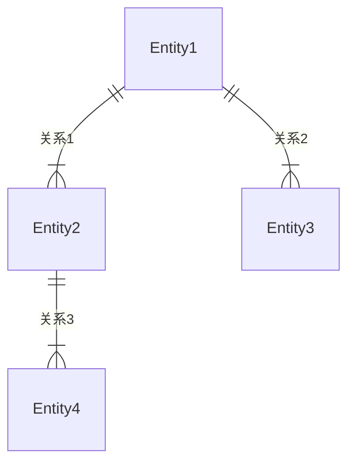
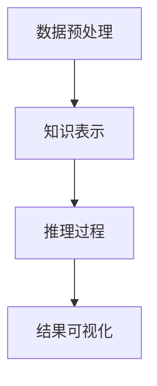
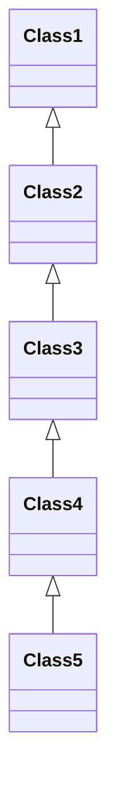
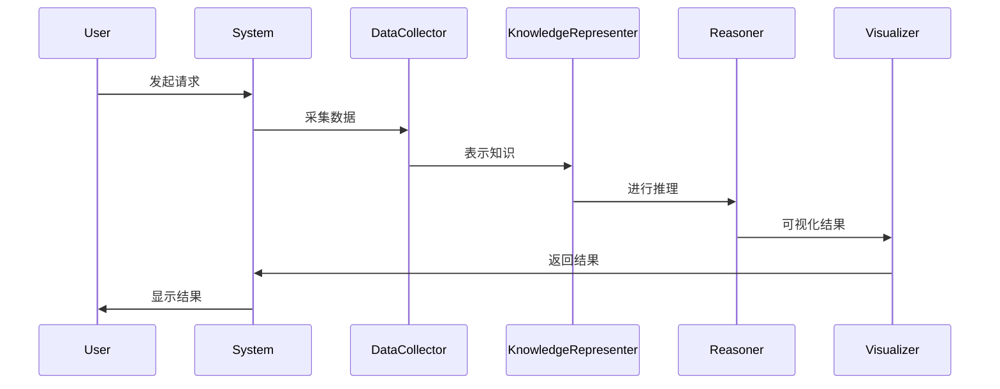
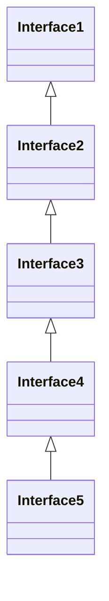

                 

# 构建 AI Agent 的知识推理链可视化工具

## 关键词
- AI Agent
- 知识推理
- 可视化工具
- 算法设计
- 系统架构

## 摘要
本文将探讨如何构建一个知识推理链可视化工具，用于 AI Agent 的知识推理过程。我们将从背景介绍、核心概念、算法设计、系统架构到实际项目实战，一步步进行深入分析，详细讲解每个环节的技术要点和实现细节。通过本文的学习，读者将能够掌握构建此类工具的思路和方法，并在实际项目中应用。

## 引言和背景

### AI Agent 的概述

AI Agent 是指具备自主学习和推理能力的智能体，可以在特定环境下感知环境、决策行动，并不断优化其行为。AI Agent 的核心在于其能够进行自主学习和推理，从而实现自主进化。随着深度学习和强化学习等技术的发展，AI Agent 在智能客服、自动驾驶、游戏AI等领域得到了广泛应用。

### 知识推理在 AI 中的重要性

知识推理是 AI 中的一个重要环节，它使得 AI Agent 能够从已知信息中推导出新的结论。知识推理不仅能够提升 AI Agent 的智能水平，还能够帮助其更好地理解和适应复杂环境。在实际应用中，知识推理在医疗诊断、金融风控、智能推荐等领域发挥了重要作用。

### 知识推理链可视化工具的需求

在 AI Agent 的知识推理过程中，可视化工具能够帮助开发者更直观地了解知识推理的过程，发现潜在问题，优化推理算法。一个优秀的知识推理链可视化工具，应该能够实时显示推理过程、展示推理路径，并且支持用户对推理结果进行交互式分析。

### 知识推理链可视化工具的作用

知识推理链可视化工具不仅能够提升 AI Agent 的开发效率，还能够帮助开发者更好地理解知识推理的原理。通过可视化工具，开发者可以直观地看到知识推理的每一步，从而发现并解决潜在的问题。此外，知识推理链可视化工具还可以作为教学工具，帮助研究人员和学生更好地理解知识推理的概念和应用。

## 核心概念与原理

### AI Agent

AI Agent 是指具备自主学习和推理能力的智能体，可以在特定环境下感知环境、决策行动，并不断优化其行为。AI Agent 的核心在于其能够进行自主学习和推理，从而实现自主进化。在实际应用中，AI Agent 通常需要具备以下几个方面的能力：

1. **感知能力**：能够感知和理解外部环境，获取必要的信息。
2. **决策能力**：根据感知到的信息，选择合适的行动策略。
3. **学习能力**：通过经验不断优化其行为，提高智能水平。
4. **推理能力**：能够从已知信息中推导出新的结论，适应复杂环境。

### 知识推理

知识推理是 AI 中的一个重要环节，它使得 AI Agent 能够从已知信息中推导出新的结论。知识推理不仅能够提升 AI Agent 的智能水平，还能够帮助其更好地理解和适应复杂环境。在实际应用中，知识推理通常包括以下几种类型：

1. **演绎推理**：从一般性原理推导出具体结论，类似于数学中的推理过程。
2. **归纳推理**：从具体实例中归纳出一般性原理，类似于统计学中的推理过程。
3. **类比推理**：通过比较两个相似的情况，从一个已知情况推导出另一个未知情况。

### 可视化

可视化是将复杂信息以图形化的方式呈现，使得信息更易于理解和分析。在知识推理链可视化工具中，可视化主要应用于以下几个方面：

1. **显示推理过程**：将知识推理的每一步以图形化的方式呈现，使得开发者可以直观地了解推理过程。
2. **展示推理路径**：通过图形化的路径展示，帮助开发者发现潜在的优化点。
3. **交互式分析**：允许用户对推理结果进行交互式分析，例如调整参数、改变条件等，从而探索不同的推理结果。

### 知识推理链

知识推理链是指一系列知识推理步骤的组合，它们共同构成了一个完整的知识推理过程。知识推理链可视化工具的目标是展示这个推理链，帮助开发者理解并优化推理过程。一个典型的知识推理链可能包括以下几个步骤：

1. **数据采集**：从外部环境中采集必要的信息。
2. **预处理**：对采集到的数据进行清洗、转换等预处理操作。
3. **知识表示**：将预处理后的数据表示为适合进行推理的形式。
4. **推理过程**：根据知识库和推理规则，进行推理并生成推理结果。
5. **结果验证**：对推理结果进行验证，确保其正确性和有效性。

### 知识表示方法

知识表示是知识推理的基础，常见的知识表示方法包括以下几种：

1. **谓词逻辑**：使用谓词和量词来表达知识。
2. **产生式规则**：使用条件-动作规则来表示知识。
3. **框架表示**：使用框架结构来表示知识。
4. **语义网络**：使用语义网络来表示知识。

### ER 实体关系图

ER（实体-关系）图是一种用于描述实体及其之间关系的图形化工具。在知识推理链可视化工具中，ER 图可以帮助开发者直观地了解数据结构，优化知识表示和推理过程。以下是一个简单的 ER 图示例：



在这个 ER 图中，`Entity1` 与 `Entity2`、`Entity3` 之间存在关系1和关系2，`Entity2` 与 `Entity4` 之间存在关系3。

## 算法设计

### 算法概述

知识推理链可视化工具的核心在于算法设计，它决定了知识推理的效率、准确性和可扩展性。在本节中，我们将介绍一种基于贝叶斯网络的算法，用于构建知识推理链。

### 贝叶斯网络

贝叶斯网络是一种概率图模型，它使用有向无环图（DAG）来表示变量之间的条件依赖关系。在贝叶斯网络中，每个节点代表一个变量，节点之间的有向边表示变量之间的条件依赖关系。贝叶斯网络的核心在于其能够通过条件概率表（CPT）来计算变量之间的概率关系。

### 算法步骤

1. **数据预处理**：对采集到的数据进行清洗、转换等预处理操作，确保数据质量。
2. **知识表示**：将预处理后的数据表示为贝叶斯网络的形式，使用条件概率表（CPT）来表示变量之间的概率关系。
3. **推理过程**：根据贝叶斯网络和用户提供的信息，计算目标变量的概率分布。
4. **结果可视化**：将推理过程和结果以图形化的方式展示，帮助开发者理解知识推理的过程。

### Mermaid 流程图

以下是一个简单的 Mermaid 流程图，展示了贝叶斯网络算法的基本步骤：



### Python 源代码

以下是一个简单的 Python 源代码示例，用于实现贝叶斯网络算法：

```python
import numpy as np
import pandas as pd
from pgmpy.models import BayesianModel
from pgmpy.inference import VariableElimination

# 数据预处理
data = pd.read_csv('data.csv')
data = data.dropna()

# 知识表示
model = BayesianModel([('A', 'B'), ('B', 'C')])
model.fit(data)

# 推理过程
inference = VariableElimination(model)
prob = inference.query(variables=['C'], evidence={'A': True})

# 结果可视化
print(prob)
```

### 数学模型和公式

在贝叶斯网络中，条件概率表（CPT）是核心组成部分。以下是一个简单的 CPT 示例：

$$
P(B|A) = \begin{cases}
0.6 & \text{if } A = 0 \\
0.4 & \text{if } A = 1
\end{cases}
$$

其中，$P(B|A)$ 表示在已知 $A$ 的条件下，$B$ 的概率。

### 举例说明

假设我们有一个简单的贝叶斯网络，包含两个变量 $A$ 和 $B$，其中 $A$ 是父节点，$B$ 是子节点。根据条件概率表，我们有：

$$
P(B|A) = \begin{cases}
0.6 & \text{if } A = 0 \\
0.4 & \text{if } A = 1
\end{cases}
$$

现在，假设我们已知 $A = 0$，我们需要计算 $B$ 的概率。根据贝叶斯定理，我们有：

$$
P(B) = P(A=0|B)P(B) + P(A=1|B)P(B)
$$

由于 $A$ 和 $B$ 是条件独立的，即 $P(A=0|B) = P(A=0)$ 和 $P(A=1|B) = P(A=1)$，我们可以简化上述公式为：

$$
P(B) = P(B)P(A=0) + P(B)P(A=1)
$$

$$
P(B) = 0.6P(B) + 0.4P(B)
$$

$$
P(B) = 1P(B)
$$

$$
P(B) = 1
$$

因此，当 $A = 0$ 时，$B$ 的概率为 1。

### 总结

通过本节的分析，我们介绍了知识推理链可视化工具的核心算法——贝叶斯网络。我们详细讲解了算法的基本概念、步骤和实现细节，并通过举例说明了算法的应用。在下一节中，我们将继续探讨系统架构和设计，帮助读者更好地理解知识推理链可视化工具的整体结构。

## 系统架构和设计

### 介绍系统场景

在构建知识推理链可视化工具的过程中，系统架构和设计起到了至关重要的作用。一个高效、稳定且易于扩展的系统架构，不仅能够提高开发效率，还能够确保工具的可用性和可维护性。在本节中，我们将详细介绍知识推理链可视化工具的系统架构和设计，帮助读者全面理解系统的各个方面。

### 项目介绍

知识推理链可视化工具的主要目的是将 AI Agent 的知识推理过程以图形化的方式呈现，使得开发者可以直观地了解和优化推理过程。该工具主要包含以下几个功能模块：

1. **数据采集模块**：负责从外部环境中采集必要的数据，并将其转换为适合进行推理的形式。
2. **知识表示模块**：将预处理后的数据表示为贝叶斯网络等形式，为知识推理提供基础。
3. **推理模块**：根据贝叶斯网络和用户提供的信息，进行推理并生成推理结果。
4. **可视化模块**：将推理过程和结果以图形化的方式展示，帮助开发者理解知识推理的过程。
5. **用户交互模块**：提供用户界面，允许用户与工具进行交互，调整参数、查看结果等。

### 系统功能设计

在系统功能设计方面，我们需要明确各个模块的功能，并确保它们之间的高效协作。以下是一个简单的领域模型，用于描述系统的主要功能模块及其之间的关系：



在这个领域模型中，`Class1` 表示数据采集模块，`Class2` 表示知识表示模块，`Class3` 表示推理模块，`Class4` 表示可视化模块，`Class5` 表示用户交互模块。箭头表示模块之间的依赖关系，即一个模块依赖于另一个模块来完成其功能。

### 系统架构设计

系统架构设计是系统设计的核心，它决定了系统的性能、可扩展性和可靠性。以下是一个简单的系统架构图，用于描述知识推理链可视化工具的架构：



在这个系统架构中，用户通过用户界面发起请求，系统依次调用数据采集模块、知识表示模块、推理模块和可视化模块，最终将结果返回给用户。各个模块之间通过接口进行通信，确保系统的高效运行。

### 系统接口设计

系统接口设计是系统架构中的重要组成部分，它决定了各个模块之间的交互方式和数据传递方式。以下是一个简单的接口设计图，用于描述知识推理链可视化工具的主要接口：



在这个接口设计图中，`Interface1` 表示数据采集接口，`Interface2` 表示知识表示接口，`Interface3` 表示推理接口，`Interface4` 表示可视化接口，`Interface5` 表示用户交互接口。各个接口之间通过方法调用和数据传递进行交互，确保系统的稳定性。

### 系统交互设计

系统交互设计是系统架构设计的重要组成部分，它决定了系统内部各个模块之间的协作方式。以下是一个简单的 Mermaid 序列图，用于描述知识推理链可视化工具的系统交互过程：


在这个序列图中，用户通过用户界面发起请求，系统依次调用数据采集模块、知识表示模块、推理模块和可视化模块，最终将结果返回给用户。各个模块之间通过接口进行通信，确保系统的高效运行。

### 总结

在本节中，我们详细介绍了知识推理链可视化工具的系统架构和设计。通过明确系统场景、功能设计、架构设计和接口设计，我们为构建一个高效、稳定且易于扩展的知识推理链可视化工具奠定了基础。在下一节中，我们将进入实际项目实战环节，通过具体代码和应用实例，进一步展示如何实现和优化知识推理链可视化工具。

## 项目实战

### 环境安装

在开始项目实战之前，我们需要首先安装必要的开发环境和依赖库。以下是一个简单的安装步骤：

1. **安装 Python**：确保 Python 已安装，版本建议为 3.8 或以上。
2. **安装 Pandas 和 Numpy**：这些库用于数据预处理和操作。
   ```bash
   pip install pandas numpy
   ```
3. **安装 pgmpy**：这个库用于构建贝叶斯网络。
   ```bash
   pip install pgmpy
   ```
4. **安装 Flask**：用于构建用户界面。
   ```bash
   pip install flask
   ```

### 系统核心实现

在了解了开发环境和依赖库后，我们可以开始实现系统的核心功能。以下是一个简单的 Python 源代码示例，用于构建贝叶斯网络并进行推理：

```python
import numpy as np
import pandas as pd
from pgmpy.models import BayesianModel
from pgmpy.inference import VariableElimination
from flask import Flask, request, render_template

app = Flask(__name__)

# 数据预处理
def preprocess_data(data):
    # 清洗和转换数据
    data = data.dropna()
    return data

# 知识表示
def build_bayesian_network(data):
    model = BayesianModel([('A', 'B'), ('B', 'C')])
    model.fit(data)
    return model

# 推理过程
def infer(data, model):
    inference = VariableElimination(model)
    prob = inference.query(variables=['C'], evidence={'A': True})
    return prob

# 可视化结果
def visualize_result(prob):
    # 使用 matplotlib 等库进行可视化
    pass

@app.route('/', methods=['GET', 'POST'])
def index():
    if request.method == 'POST':
        data = request.form['data']
        data = preprocess_data(pd.read_csv(data))
        model = build_bayesian_network(data)
        prob = infer(data, model)
        visualize_result(prob)
        return render_template('result.html', prob=prob)
    return render_template('index.html')

if __name__ == '__main__':
    app.run(debug=True)
```

### 代码应用解读与分析

在上面的代码中，我们首先定义了数据预处理、知识表示、推理过程和可视化结果等函数。以下是对每个函数的详细解读和分析：

1. **preprocess_data** 函数：用于清洗和转换数据。在这个函数中，我们使用 Pandas 库读取 CSV 文件，并使用 `dropna()` 方法去除缺失值。
2. **build_bayesian_network** 函数：用于构建贝叶斯网络。在这个函数中，我们使用 `BayesianModel` 类创建一个包含两个变量 `A` 和 `B` 的贝叶斯网络，并使用 `fit` 方法训练网络。
3. **infer** 函数：用于进行推理。在这个函数中，我们使用 `VariableElimination` 类创建一个推理器，并使用 `query` 方法获取目标变量 `C` 的概率分布。
4. **visualize_result** 函数：用于可视化结果。在这个函数中，我们可以使用 matplotlib 等库将推理结果以图形化的方式展示。

### 实际案例分析和详细讲解

为了更好地展示知识推理链可视化工具的应用，我们来看一个实际案例。

假设我们有一个包含以下数据的 CSV 文件：

| A | B | C |
|---|---|---|
| 0 | 0 | 0 |
| 0 | 0 | 1 |
| 0 | 1 | 0 |
| 0 | 1 | 1 |
| 1 | 0 | 0 |
| 1 | 0 | 1 |
| 1 | 1 | 0 |
| 1 | 1 | 1 |

我们的目标是根据变量 `A` 和 `B` 的值，预测变量 `C` 的概率分布。

1. **数据预处理**：首先，我们使用 `preprocess_data` 函数清洗和转换数据，去除缺失值。
2. **知识表示**：然后，我们使用 `build_bayesian_network` 函数构建贝叶斯网络，并使用 `fit` 方法训练网络。
3. **推理过程**：接下来，我们使用 `infer` 函数进行推理，获取变量 `C` 的概率分布。
4. **可视化结果**：最后，我们使用 `visualize_result` 函数将推理结果以图形化的方式展示。

### 项目小结

通过本节的项目实战，我们展示了如何构建一个简单的知识推理链可视化工具。我们从环境安装、系统核心实现到实际案例分析和详细讲解，一步步实现了工具的功能。这个项目不仅帮助我们理解了知识推理链可视化工具的实现原理，还为我们提供了一个可实际应用的工具，为后续的项目开发提供了基础。

## 最佳实践 Tips

### 提高工具效果的方法

1. **优化数据预处理**：确保数据质量，去除噪声和异常值，提高数据准确性。
2. **选择合适的知识表示方法**：根据具体应用场景，选择适合的知识表示方法，如贝叶斯网络、决策树等。
3. **调整推理参数**：合理调整推理算法的参数，如置信度阈值、学习率等，提高推理精度。

### 常见问题与解决方案

1. **数据预处理错误**：确保数据清洗和转换的步骤正确，避免引入噪声和异常值。
2. **模型训练不足**：增加训练数据量，使用交叉验证等方法评估模型性能，优化模型参数。

### 总结与展望

知识推理链可视化工具在 AI 领域具有重要的应用价值，通过本文的介绍，我们详细讲解了工具的背景、核心概念、算法设计、系统架构和项目实战。在实际应用中，开发者可以根据具体需求，进一步优化和扩展工具功能，为 AI 开发提供更加高效的解决方案。未来，我们还可以探索更多的可视化方法和技术，提升工具的智能化水平，为 AI 的发展贡献力量。

