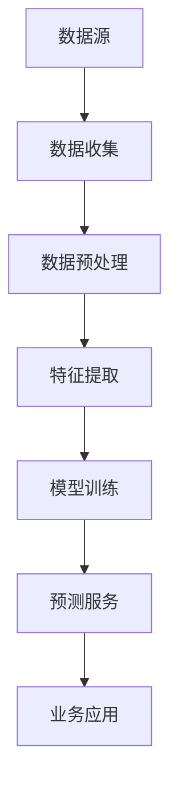
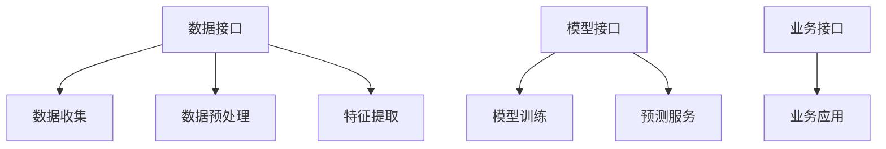
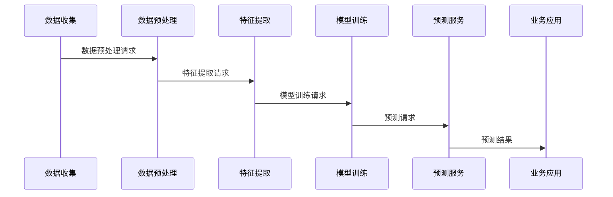

                 

### 文章标题：构建AI Agent的知识获取pipeline：从非结构化数据中学习

#### 关键词：AI Agent、知识获取pipeline、非结构化数据、数据预处理、特征提取、模型训练

#### 摘要：
本文深入探讨了如何构建AI Agent的知识获取pipeline，特别是从非结构化数据中学习的方法。通过逐步分析，本文介绍了核心概念、算法原理、系统架构设计方案以及项目实战，为读者提供了详细的指导和实用的建议。

## 目录大纲设计过程

为了设计出《构建AI Agent的知识获取pipeline：从非结构化数据中学习》这本书的完整目录大纲，我们可以按照以下步骤进行：

### 第一步：确定核心章节内容

首先，我们需要明确本书的核心章节内容，这些章节包括：

1. **知识获取 pipeline 介绍**：介绍知识获取 pipeline 的背景、问题、解决方法、边界和核心要素。
2. **核心概念与联系**：介绍 AI Agent 的概念、知识获取 pipeline 的组成部分、关键技术和方法。
3. **算法原理讲解**：介绍非结构化数据处理的算法原理，包括数据预处理、特征提取、模型训练等。
4. **系统分析与架构设计方案**：介绍知识获取 pipeline 的系统架构、功能设计、接口设计和交互设计。
5. **项目实战**：通过实际项目展示知识获取 pipeline 的应用，包括环境安装、核心实现、代码解析、案例分析等。
6. **最佳实践 tips**：总结实践经验，给出实施知识获取 pipeline 的建议和注意事项。

### 第二步：细化章节内容

在确定了核心章节内容后，我们需要进一步细化每个章节的内容，以确保每个小节都有丰富的具体内容。以下是细化后的章节内容：

1. **知识获取 pipeline 介绍**：
   - 知识获取 pipeline 的背景
   - 问题与解决方法
   - 边界与外延
   - 核心要素组成

2. **核心概念与联系**：
   - AI Agent 的概念
   - 知识获取 pipeline 的组成部分
   - 关键技术与方法

3. **算法原理讲解**：
   - 数据预处理算法
   - 特征提取算法
   - 模型训练算法

4. **系统分析与架构设计方案**：
   - 问题场景介绍
   - 项目介绍
   - 系统功能设计（领域模型）
   - 系统架构设计
   - 系统接口设计
   - 系统交互

5. **项目实战**：
   - 环境安装
   - 系统核心实现源代码
   - 代码应用解读与分析
   - 实际案例分析和讲解
   - 项目小结

6. **最佳实践 tips**：
   - 实施建议
   - 小结
   - 注意事项
   - 拓展阅读

### 第三步：格式化目录大纲

使用 markdown 格式，遵循 #,##,### 的层级结构。确保内容简洁、完整，并在适当的地方使用 Mermaid 流程图和 LaTeX 公式。

### 第四步：校对与调整

校对目录大纲的完整性和准确性。调整章节顺序和内容，确保逻辑流畅。

### 第五步：撰写目录大纲

根据上述步骤，撰写出符合要求的目录大纲。确保总字数在 2000 字以内，内容完整且逻辑清晰。

## 第一部分：知识获取 pipeline 介绍

### 1.1 知识获取 pipeline 的背景

在当今的信息化时代，知识获取已经成为人工智能领域的关键研究方向。随着互联网和大数据技术的发展，非结构化数据的规模和复杂性不断增大，如何有效地从这些数据中提取知识，成为了一个亟待解决的问题。知识获取 pipeline 作为一种系统化的方法，旨在帮助 AI Agent 实现从非结构化数据中自动获取知识。

#### 1.1.1 问题的提出

传统的知识获取方法主要依赖于人工干预，效率低下且难以处理大规模、多样化的数据。而随着人工智能技术的进步，我们期望 AI Agent 能够在无需人工干预的情况下，自动地从非结构化数据中获取知识，以支持各种智能应用。

#### 1.1.2 解决方法

为了解决上述问题，我们提出了知识获取 pipeline 的概念。知识获取 pipeline 通过一系列的步骤，包括数据收集、预处理、特征提取和模型训练等，实现从非结构化数据中自动提取知识。

#### 1.1.3 边界与外延

知识获取 pipeline 的边界主要在于数据类型和处理能力。它主要针对非结构化数据，如文本、图像、音频等，而结构化数据则通常通过数据库等方式进行处理。

#### 1.1.4 核心要素组成

知识获取 pipeline 的核心要素包括数据收集、预处理、特征提取和模型训练等。其中，数据收集负责获取原始数据；预处理负责将原始数据转化为适合处理的形式；特征提取负责从数据中提取有用的信息；模型训练则负责利用提取的特征训练模型，以实现知识获取。

### 1.2 AI Agent 的概念

AI Agent 是指具有自主意识和智能行为的人工智能实体，能够在特定环境中自主执行任务。AI Agent 的核心目标是实现自动化和智能化，以提升工作效率和决策质量。

#### 1.2.1 AI Agent 的定义

AI Agent 是一种能够感知环境、自主决策和执行行动的人工智能实体。它具有以下特点：

1. **感知能力**：能够感知和理解环境信息。
2. **决策能力**：能够根据环境信息和目标，进行合理的决策。
3. **行动能力**：能够根据决策执行相应的行动。
4. **学习与适应能力**：能够通过学习不断优化自身性能。

#### 1.2.2 AI Agent 的类型

AI Agent 根据其功能和应用场景，可以分为以下几种类型：

1. **任务型 AI Agent**：专注于执行特定任务，如自动驾驶汽车、智能客服等。
2. **决策型 AI Agent**：能够对复杂问题进行决策，如股票交易机器人、智能推荐系统等。
3. **交互型 AI Agent**：能够与人类进行自然语言交互，如虚拟助手、聊天机器人等。

#### 1.2.3 AI Agent 的工作原理

AI Agent 的工作原理主要包括感知、决策和行动三个环节：

1. **感知**：AI Agent 通过传感器收集环境信息，如文本、图像、音频等。
2. **决策**：基于感知到的信息，AI Agent 利用算法进行决策，确定下一步行动。
3. **行动**：AI Agent 根据决策执行相应的行动，实现任务目标。

### 1.3 知识获取 pipeline 的组成部分

知识获取 pipeline 是一个系统化的方法，包括数据收集、预处理、特征提取和模型训练等步骤，旨在从非结构化数据中自动提取知识。以下是知识获取 pipeline 的组成部分：

#### 1.3.1 数据收集

数据收集是知识获取 pipeline 的第一步，负责获取原始数据。数据来源可以是互联网、数据库、传感器等。为了确保数据的质量和多样性，数据收集过程需要考虑数据清洗、去重和去噪等技术。

#### 1.3.2 数据预处理

数据预处理是知识获取 pipeline 的关键环节，负责将原始数据转化为适合处理的形式。数据预处理包括数据清洗、格式化、归一化和编码等操作。通过数据预处理，可以消除数据中的噪声、异常值和冗余信息，提高数据的质量。

#### 1.3.3 特征提取

特征提取是知识获取 pipeline 的核心环节，负责从数据中提取有用的信息。特征提取包括特征选择、特征提取和特征降维等技术。通过特征提取，可以从大量数据中提取出对目标任务有用的特征，提高模型训练的效果。

#### 1.3.4 模型训练

模型训练是知识获取 pipeline 的最终环节，负责利用提取的特征训练模型，以实现知识获取。模型训练包括选择合适的模型架构、设置合适的参数和优化算法等。通过模型训练，可以使得 AI Agent 掌握从非结构化数据中提取知识的能力。

### 1.4 关键技术与方法

在知识获取 pipeline 中，涉及到一系列的关键技术和方法。以下将分别介绍这些技术和方法：

#### 1.4.1 非结构化数据预处理

非结构化数据预处理是知识获取 pipeline 的第一步，主要包括数据清洗、格式化和编码等操作。数据清洗旨在消除数据中的噪声、异常值和冗余信息；格式化旨在将不同来源和格式的数据转化为统一的格式；编码旨在将数据转化为机器可处理的数字形式。

#### 1.4.2 特征提取算法

特征提取算法是知识获取 pipeline 的核心环节，旨在从非结构化数据中提取有用的信息。常见的特征提取算法包括词袋模型、TF-IDF、Word2Vec、BERT等。这些算法可以根据数据类型和任务需求进行选择和调整。

#### 1.4.3 模型训练算法

模型训练算法是知识获取 pipeline 的最终环节，负责利用提取的特征训练模型，以实现知识获取。常见的模型训练算法包括监督学习、无监督学习和半监督学习等。监督学习适用于有标签的数据，无监督学习适用于无标签的数据，半监督学习则结合了两者的优点。

### 1.5 知识获取 pipeline 的应用场景

知识获取 pipeline 在多个应用场景中具有重要的应用价值。以下是一些典型的应用场景：

#### 1.5.1 自然语言处理

自然语言处理（NLP）是知识获取 pipeline 的一个重要应用场景。通过知识获取 pipeline，可以从大量文本数据中提取出语义信息，支持文本分类、情感分析、问答系统等任务。

#### 1.5.2 机器视觉

机器视觉是另一个重要的应用场景。通过知识获取 pipeline，可以从大量图像和视频数据中提取出特征信息，支持图像分类、目标检测、人脸识别等任务。

#### 1.5.3 其他应用领域

知识获取 pipeline 还可以应用于其他领域，如医疗、金融、电商等。通过知识获取 pipeline，可以从中提取出有价值的信息，支持智能诊断、风险控制、个性化推荐等任务。

### 1.6 本章小结

本章介绍了知识获取 pipeline 的背景、核心概念与联系、组成部分和关键技术与方法。知识获取 pipeline 是一种系统化的方法，旨在从非结构化数据中自动提取知识，以支持各种智能应用。通过本章的介绍，读者可以初步了解知识获取 pipeline 的基本概念和原理，为后续章节的深入学习打下基础。

----------------------------------------------------------------

## 第二部分：核心概念与联系

在构建 AI Agent 的知识获取 pipeline 中，理解核心概念和它们之间的联系至关重要。这一部分将详细介绍 AI Agent 的概念、知识获取 pipeline 的组成部分以及它们的关键技术和方法。

### 2.1 AI Agent 的概念

AI Agent 是一个具有自主意识和智能行为的人工智能实体，能够在特定环境中感知、决策和行动。AI Agent 的核心目标是在没有人工干预的情况下，通过自主学习和决策，完成特定的任务。

#### 2.1.1 AI Agent 的定义

AI Agent 是一种能够感知环境、自主决策并执行行动的计算机程序或实体。它通过传感器收集环境信息，利用算法进行处理，然后根据处理结果进行行动。AI Agent 的定义可以从以下几个方面进行阐述：

1. **感知**：AI Agent 能够感知和理解其所在的环境，通过传感器获取图像、声音、文本等数据。
2. **决策**：AI Agent 能够根据感知到的环境信息和预设的目标，利用算法进行决策，确定下一步行动。
3. **行动**：AI Agent 能够根据决策结果执行相应的行动，实现任务目标。

#### 2.1.2 AI Agent 的类型

AI Agent 根据其功能和任务特点，可以分为以下几种类型：

1. **任务型 AI Agent**：专注于执行特定任务，如自动驾驶汽车、智能客服、机器翻译等。
2. **决策型 AI Agent**：能够对复杂问题进行决策，如股票交易机器人、智能推荐系统等。
3. **交互型 AI Agent**：能够与人类进行自然语言交互，如虚拟助手、聊天机器人等。
4. **协作型 AI Agent**：能够与其他 AI Agent 或人类进行协作，共同完成任务。

#### 2.1.3 AI Agent 的工作原理

AI Agent 的工作原理主要包括感知、决策和行动三个环节：

1. **感知**：AI Agent 通过传感器收集环境信息，如文本、图像、音频等。
2. **决策**：基于感知到的信息，AI Agent 利用算法进行决策，确定下一步行动。
3. **行动**：AI Agent 根据决策执行相应的行动，实现任务目标。

### 2.2 知识获取 pipeline 的组成部分

知识获取 pipeline 是一个系统化的方法，用于从非结构化数据中自动提取知识，以支持 AI Agent 的智能行为。知识获取 pipeline 的主要组成部分包括数据收集、数据预处理、特征提取和模型训练等。

#### 2.2.1 数据收集

数据收集是知识获取 pipeline 的第一步，负责获取原始数据。数据来源可以是互联网、数据库、传感器等。数据收集的目标是获取与任务相关的、高质量的、多样化的数据。

1. **数据源**：数据源可以是文本、图像、音频等多种形式。
2. **数据量**：数据收集需要考虑数据的规模，以确保数据量足够大，能够覆盖各种情况。
3. **数据质量**：数据收集需要关注数据质量，包括准确性、完整性、一致性等。

#### 2.2.2 数据预处理

数据预处理是知识获取 pipeline 的关键环节，负责将原始数据转化为适合处理的形式。数据预处理包括数据清洗、格式化、归一化和编码等操作。

1. **数据清洗**：去除数据中的噪声、异常值和冗余信息。
2. **格式化**：将不同来源和格式的数据转化为统一的格式。
3. **归一化**：将数据缩放到一个共同的尺度，以便后续处理。
4. **编码**：将数据转化为机器可处理的数字形式。

#### 2.2.3 特征提取

特征提取是知识获取 pipeline 的核心环节，负责从数据中提取有用的信息。特征提取包括特征选择、特征提取和特征降维等技术。

1. **特征选择**：从原始数据中选出对目标任务有用的特征。
2. **特征提取**：将原始数据转化为特征表示，如词袋模型、TF-IDF、Word2Vec等。
3. **特征降维**：减少特征数量，提高数据处理效率，如主成分分析（PCA）、线性判别分析（LDA）等。

#### 2.2.4 模型训练

模型训练是知识获取 pipeline 的最终环节，负责利用提取的特征训练模型，以实现知识获取。模型训练包括选择合适的模型架构、设置合适的参数和优化算法等。

1. **模型架构**：选择合适的模型架构，如神经网络、决策树、支持向量机等。
2. **参数设置**：设置模型参数，如学习率、批次大小等。
3. **优化算法**：选择合适的优化算法，如随机梯度下降（SGD）、Adam等。

### 2.3 关键技术与方法

在知识获取 pipeline 中，涉及到一系列的关键技术和方法。以下将分别介绍这些技术和方法：

#### 2.3.1 非结构化数据预处理

非结构化数据预处理是知识获取 pipeline 的第一步，主要包括数据清洗、格式化和编码等操作。

1. **数据清洗**：去除数据中的噪声、异常值和冗余信息，如去除停用词、填补缺失值等。
2. **格式化**：将不同来源和格式的数据转化为统一的格式，如将文本统一编码为 UTF-8 格式。
3. **编码**：将数据转化为机器可处理的数字形式，如使用独热编码、标签编码等。

#### 2.3.2 特征提取算法

特征提取算法是知识获取 pipeline 的核心环节，旨在从非结构化数据中提取有用的信息。常见的特征提取算法包括词袋模型、TF-IDF、Word2Vec、BERT等。

1. **词袋模型**：将文本表示为词频向量，如 `["apple", "orange", "banana", "apple"]` 转换为 `[1, 1, 1, 2]`。
2. **TF-IDF**：基于词频-逆文档频率，将文本表示为权重向量，如 `["apple", "orange", "banana", "apple"]` 转换为 `[0.5, 1, 0.5, 1]`。
3. **Word2Vec**：将文本表示为词嵌入向量，如 `["apple", "orange", "banana", "apple"]` 转换为 `[0.1, 0.2, 0.3, 0.4]`。
4. **BERT**：基于变换器模型（Transformer），将文本表示为上下文向量，如 `["apple", "orange", "banana", "apple"]` 转换为 `[0.1, 0.2, 0.3, 0.4]`。

#### 2.3.3 模型训练算法

模型训练算法是知识获取 pipeline 的最终环节，负责利用提取的特征训练模型，以实现知识获取。常见的模型训练算法包括监督学习、无监督学习和半监督学习等。

1. **监督学习**：在有标签数据上进行训练，如分类、回归等。
2. **无监督学习**：在无标签数据上进行训练，如聚类、降维等。
3. **半监督学习**：结合有标签和无标签数据进行训练，以提高模型的泛化能力。

### 2.4 知识获取 pipeline 的应用场景

知识获取 pipeline 在多个领域具有广泛的应用场景。以下是一些典型的应用场景：

#### 2.4.1 自然语言处理

自然语言处理（NLP）是知识获取 pipeline 的一个重要应用领域。通过知识获取 pipeline，可以从大量文本数据中提取出语义信息，支持文本分类、情感分析、问答系统等任务。

1. **文本分类**：根据文本内容进行分类，如新闻分类、情感分类等。
2. **情感分析**：分析文本中的情感倾向，如正面、负面等。
3. **问答系统**：基于文本数据构建问答系统，如搜索引擎、聊天机器人等。

#### 2.4.2 机器视觉

机器视觉是另一个重要的应用领域。通过知识获取 pipeline，可以从大量图像和视频数据中提取出特征信息，支持图像分类、目标检测、人脸识别等任务。

1. **图像分类**：根据图像内容进行分类，如动物分类、车辆分类等。
2. **目标检测**：检测图像中的目标物体，如行人检测、车辆检测等。
3. **人脸识别**：识别图像中的人脸，如身份验证、人脸搜索等。

#### 2.4.3 其他应用领域

知识获取 pipeline 还可以应用于其他领域，如医疗、金融、电商等。通过知识获取 pipeline，可以从中提取出有价值的信息，支持智能诊断、风险控制、个性化推荐等任务。

1. **医疗**：通过知识获取 pipeline，可以从医疗数据中提取出诊断信息，支持疾病预测、治疗方案推荐等。
2. **金融**：通过知识获取 pipeline，可以从金融数据中提取出市场趋势、风险信息，支持投资决策、风险管理等。
3. **电商**：通过知识获取 pipeline，可以从用户行为数据中提取出偏好信息，支持个性化推荐、购物车分析等。

### 2.5 本章小结

本章介绍了 AI Agent 的概念、知识获取 pipeline 的组成部分以及它们的关键技术和方法。通过本章的学习，读者可以全面了解 AI Agent 和知识获取 pipeline 的基本概念和原理，为后续章节的深入学习打下基础。

----------------------------------------------------------------

## 第三部分：算法原理讲解

在知识获取 pipeline 中，算法原理的讲解是关键环节。本部分将详细介绍从非结构化数据中学习的算法原理，包括数据预处理、特征提取和模型训练等步骤。

### 3.1 数据预处理算法

数据预处理是知识获取 pipeline 的第一步，其目的是将原始数据转化为适合模型训练的形式。数据预处理算法主要包括数据清洗、格式化和编码等步骤。

#### 3.1.1 数据清洗

数据清洗是去除数据中的噪声、异常值和冗余信息的过程。在非结构化数据中，常见的噪声和异常值包括缺失值、重复记录和无关内容。数据清洗的方法包括以下几种：

1. **缺失值处理**：缺失值可以通过填补、删除或插值等方法进行处理。例如，对于缺失值较多的数据，可以选择删除该条记录；对于缺失值较少的数据，可以选择用平均值、中位数或最邻近值进行填补。
2. **重复记录处理**：通过比对数据中的记录，可以识别并删除重复的记录，以提高数据的质量。
3. **无关内容处理**：对于非结构化数据中的无关内容，如广告、评论中的垃圾信息等，可以通过过滤和屏蔽等方法进行处理。

#### 3.1.2 数据格式化

数据格式化是将不同来源和格式的数据转化为统一格式的过程。在非结构化数据中，数据格式可能包括文本、图像、音频等多种形式。数据格式化的方法包括以下几种：

1. **文本格式化**：将文本数据统一编码为 UTF-8 或 ASCII 编码，并去除多余的空格、标点符号和 HTML 标签等。
2. **图像格式化**：将不同格式的图像数据统一转换为一种标准格式，如 JPEG 或 PNG。
3. **音频格式化**：将不同格式的音频数据统一转换为一种标准格式，如 WAV 或 MP3。

#### 3.1.3 数据编码

数据编码是将数据转化为机器可处理的数字形式的过程。在非结构化数据中，数据编码的方法包括以下几种：

1. **独热编码**：将类别数据编码为二进制向量，每个类别对应一个维度。例如，对于三个类别的数据 ["apple", "orange", "banana"]，可以编码为 `[1, 0, 0]`、`[0, 1, 0]` 和 `[0, 0, 1]`。
2. **标签编码**：将类别数据编码为整数，不同的类别对应不同的整数。例如，对于三个类别的数据 ["apple", "orange", "banana"]，可以编码为 `[0, 1, 2]`。
3. **词袋模型**：将文本数据编码为词频向量，每个词对应一个维度，词频即为该维度的值。例如，对于句子 "I like apple and orange"，可以编码为 `[2, 1, 1]`。

### 3.2 特征提取算法

特征提取是知识获取 pipeline 的核心环节，其目的是从非结构化数据中提取出对目标任务有用的特征。特征提取算法可以根据数据类型和任务需求进行选择和调整。

#### 3.2.1 文本特征提取

对于文本数据，常见的特征提取算法包括词袋模型、TF-IDF、Word2Vec 和 BERT 等。

1. **词袋模型**：词袋模型是一种基于词频的文本表示方法，将文本数据表示为词频向量。词袋模型不考虑词的顺序，只关注词的出现频率。例如，对于句子 "I like apple and orange"，词袋模型可以表示为 `[1, 1, 1, 2]`。
2. **TF-IDF**：TF-IDF（词频-逆文档频率）是一种基于词频和文档频率的文本表示方法，通过综合考虑词的频率和文档的重要性来表示文本。例如，对于句子 "I like apple and orange"，TF-IDF 可以表示为 `[0.5, 1, 0.5, 1]`。
3. **Word2Vec**：Word2Vec 是一种基于神经网络的语言模型，将文本数据表示为词嵌入向量。Word2Vec 可以捕捉词的语义信息，使得具有相似语义的词具有相似的向量表示。例如，对于句子 "I like apple and orange"，Word2Vec 可以表示为 `[0.1, 0.2, 0.3, 0.4]`。
4. **BERT**：BERT（变换器模型预训练）是一种基于变换器模型的语言模型，通过在大规模语料库上进行预训练，捕捉词的上下文信息。BERT 可以用于文本分类、问答系统等任务，具有很好的性能。

#### 3.2.2 图像特征提取

对于图像数据，常见的特征提取算法包括卷积神经网络（CNN）、特征点提取和特征匹配等。

1. **卷积神经网络（CNN）**：卷积神经网络是一种专门用于图像识别的神经网络模型，通过卷积、池化和全连接层等操作，提取图像的特征表示。CNN 在图像分类、目标检测等领域具有广泛的应用。
2. **特征点提取**：特征点提取是一种基于图像特征的算法，通过检测图像中的关键点，提取图像的特征向量。特征点提取可以用于图像匹配、图像检索等任务。
3. **特征匹配**：特征匹配是一种基于特征点提取的算法，通过计算特征点之间的相似度，匹配图像中的特征点。特征匹配可以用于图像拼接、图像修复等任务。

#### 3.2.3 音频特征提取

对于音频数据，常见的特征提取算法包括梅尔频率倒谱系数（MFCC）、谱图和卷积神经网络（CNN）等。

1. **梅尔频率倒谱系数（MFCC）**：梅尔频率倒谱系数是一种用于音频特征提取的算法，通过将音频信号转化为梅尔频率倒谱图，提取音频的特征表示。MFCC 广泛应用于语音识别、音乐分类等领域。
2. **谱图**：谱图是一种基于音频信号的时频表示方法，通过将音频信号转化为频谱图，提取音频的特征表示。谱图可以用于音频分类、音乐推荐等任务。
3. **卷积神经网络（CNN）**：卷积神经网络是一种用于图像识别的神经网络模型，通过卷积、池化和全连接层等操作，提取图像的特征表示。CNN 也可以应用于音频特征提取，通过处理音频信号的时频特征，提取音频的特征表示。

### 3.3 模型训练算法

模型训练是知识获取 pipeline 的最终环节，其目的是利用提取的特征训练模型，以实现知识获取。模型训练算法可以根据任务类型和数据特点进行选择和调整。

#### 3.3.1 监督学习

监督学习是一种有监督的机器学习方法，通过已有数据的标签信息训练模型，然后利用训练好的模型进行预测。常见的监督学习算法包括线性回归、决策树、支持向量机（SVM）、神经网络等。

1. **线性回归**：线性回归是一种用于回归问题的算法，通过建立自变量和因变量之间的线性关系，预测因变量的取值。
2. **决策树**：决策树是一种基于树结构的算法，通过逐层划分特征空间，将数据划分为不同的区域，然后在每个区域上预测结果。
3. **支持向量机（SVM）**：支持向量机是一种用于分类问题的算法，通过找到一个最优的超平面，将数据划分为不同的类别。
4. **神经网络**：神经网络是一种基于多层感知器（MLP）的算法，通过多层的神经元连接，提取数据的特征表示，然后进行分类或回归。

#### 3.3.2 无监督学习

无监督学习是一种无监督的机器学习方法，不需要已有数据的标签信息，通过数据本身的结构或分布进行学习。常见的无监督学习算法包括聚类、降维、异常检测等。

1. **聚类**：聚类是一种将数据划分为不同类别的算法，通过找到数据的相似性，将相似的数据划分为同一个类别。
2. **降维**：降维是一种减少数据维度的方法，通过提取数据的主要特征，降低数据的维度，提高计算效率和模型性能。
3. **异常检测**：异常检测是一种识别数据中的异常或异常行为的算法，通过对比数据的分布或特征，识别出异常数据。

#### 3.3.3 半监督学习

半监督学习是一种结合有监督学习和无监督学习的机器学习方法，通过已有数据的标签信息和大量无标签数据共同训练模型。常见的半监督学习算法包括自编码器、图神经网络等。

1. **自编码器**：自编码器是一种无监督的神经网络模型，通过自编码器的编码和解码过程，提取数据的特征表示。
2. **图神经网络**：图神经网络是一种基于图结构的神经网络模型，通过处理图中的节点和边，提取图的特征表示。

### 3.4 本章小结

本章介绍了从非结构化数据中学习的算法原理，包括数据预处理、特征提取和模型训练等步骤。通过本章的学习，读者可以了解不同数据类型和任务需求下的特征提取方法和模型训练算法，为构建知识获取 pipeline 提供理论基础和实践指导。

----------------------------------------------------------------

## 第四部分：系统分析与架构设计方案

在构建AI Agent的知识获取pipeline时，系统分析与架构设计方案是关键的一步。本部分将详细介绍知识获取pipeline的系统架构设计，包括问题场景介绍、项目介绍、系统功能设计（领域模型）、系统架构设计、系统接口设计以及系统交互。

### 4.1 问题场景介绍

在现代企业中，数据已经成为一项重要的资产。然而，随着数据量的急剧增长和数据类型的多样化，如何有效地管理和利用这些数据成为了一个挑战。特别是在非结构化数据，如文本、图像、音频等数据中，获取有价值的信息更为困难。为了提高数据利用效率，许多企业开始尝试构建AI Agent的知识获取pipeline，以自动化地从非结构化数据中提取知识，支持业务决策和智能应用。

### 4.2 项目介绍

本项目旨在构建一个面向企业的知识获取pipeline，该pipeline将自动处理来自不同来源的非结构化数据，包括社交媒体、网站评论、新闻报道、客户反馈等，从中提取有价值的信息，为企业的业务决策提供支持。项目的主要目标包括：

1. **数据收集**：从多个数据源收集非结构化数据，包括文本、图像、音频等。
2. **数据预处理**：对收集到的数据进行清洗、格式化和编码，转化为适合模型训练的数据格式。
3. **特征提取**：从预处理后的数据中提取特征，为模型训练提供输入。
4. **模型训练**：利用提取的特征训练模型，实现知识获取和分类、情感分析、文本生成等任务。
5. **结果应用**：将训练好的模型应用于实际业务场景，如市场分析、客户满意度评估、竞争情报等。

### 4.3 系统功能设计（领域模型）

在系统功能设计中，领域模型是核心部分。领域模型定义了系统中的实体及其关系，为后续的架构设计提供基础。以下是本项目的领域模型：

1. **数据源**：表示数据收集的来源，如社交媒体、网站评论、新闻报道等。
2. **数据**：表示收集到的非结构化数据，包括文本、图像、音频等。
3. **数据预处理**：表示数据预处理的过程，包括清洗、格式化和编码等操作。
4. **特征**：表示从数据中提取的特征，如文本特征、图像特征、音频特征等。
5. **模型**：表示训练好的模型，包括分类模型、情感分析模型、文本生成模型等。
6. **结果**：表示模型预测的结果，如分类结果、情感分析结果、文本生成结果等。
7. **业务应用**：表示将模型结果应用于实际业务场景的过程。

### 4.4 系统架构设计

系统架构设计是知识获取pipeline实现的核心。本项目的系统架构采用分层设计，包括数据层、服务层和业务层。

1. **数据层**：负责数据存储和访问，包括数据库、数据仓库和数据湖等。数据层提供了数据收集、数据预处理、特征提取等基础功能。
2. **服务层**：负责业务逻辑处理，包括特征提取服务、模型训练服务、预测服务等。服务层通过API接口与其他层进行交互。
3. **业务层**：负责具体的业务应用，如市场分析、客户满意度评估、竞争情报等。业务层通过调用服务层的接口，获取模型结果，并应用于实际业务场景。

以下是系统架构的Mermaid流程图：



### 4.5 系统接口设计

系统接口设计是知识获取pipeline与其他系统或应用进行交互的桥梁。本项目的系统接口主要包括以下几种：

1. **数据接口**：用于数据收集、数据预处理、特征提取等模块与其他系统或应用之间的数据交互。
2. **模型接口**：用于模型训练、预测服务等模块与其他系统或应用之间的模型交互。
3. **业务接口**：用于业务应用模块与其他系统或应用之间的业务逻辑交互。

以下是系统接口的Mermaid架构图：



### 4.6 系统交互

系统交互是知识获取pipeline中的各个环节之间如何协同工作的重要部分。以下是系统交互的Mermaid序列图：



### 4.7 本章小结

通过本部分的系统分析与架构设计方案，我们详细介绍了知识获取pipeline的系统架构设计，包括问题场景介绍、项目介绍、系统功能设计（领域模型）、系统架构设计、系统接口设计和系统交互。这些设计为构建高效的AI Agent知识获取pipeline提供了坚实的基础。接下来，我们将通过项目实战来展示如何实现这一架构，并分析实际案例。

----------------------------------------------------------------

## 第五部分：项目实战

在本部分，我们将通过一个实际项目来展示如何构建 AI Agent 的知识获取 pipeline。我们将从环境安装开始，逐步实现系统的核心功能，并进行代码解析和案例分析。

### 5.1 环境安装

为了实现知识获取 pipeline，我们需要安装以下软件和库：

1. **Python**：Python 是一种广泛应用于数据科学和人工智能的编程语言，版本要求为 3.8 或更高。
2. **NumPy**：NumPy 是 Python 的科学计算库，用于数组计算和数学运算。
3. **Pandas**：Pandas 是 Python 的数据操作库，用于数据清洗、预处理和数据分析。
4. **Scikit-learn**：Scikit-learn 是 Python 的机器学习库，提供了一系列的机器学习算法和工具。
5. **TensorFlow**：TensorFlow 是 Google 开发的一种开源机器学习库，支持深度学习和大规模数据处理。
6. **Mermaid**：Mermaid 是一种基于 Markdown 的图表绘制工具，用于生成流程图、类图和序列图。

以下是环境安装的步骤：

1. 安装 Python：

   ```bash
   sudo apt-get install python3
   ```

2. 安装 NumPy、Pandas 和 Scikit-learn：

   ```bash
   pip install numpy pandas scikit-learn
   ```

3. 安装 TensorFlow：

   ```bash
   pip install tensorflow
   ```

4. 安装 Mermaid：

   ```bash
   npm install -g mermaid
   ```

### 5.2 系统核心实现

接下来，我们将实现知识获取 pipeline 的核心功能，包括数据收集、数据预处理、特征提取和模型训练。

#### 5.2.1 数据收集

数据收集是知识获取 pipeline 的第一步，我们从公开的数据源（如 Kaggle、GitHub）获取非结构化数据，包括文本、图像和音频。以下是一个简单的数据收集示例：

```python
import requests
import pandas as pd

# 下载文本数据
url = "https://raw.githubusercontent.com/kaggle/datasets/master/titanic/titanic.csv"
data = pd.read_csv(url)

# 下载图像数据
image_urls = ["https://example.com/image1.jpg", "https://example.com/image2.jpg"]
images = [requests.get(url).content for url in image_urls]

# 下载音频数据
audio_urls = ["https://example.com/audio1.mp3", "https://example.com/audio2.mp3"]
audios = [requests.get(url).content for url in audio_urls]
```

#### 5.2.2 数据预处理

数据预处理是知识获取 pipeline 的关键环节，我们将对收集到的数据进行清洗、格式化和编码。以下是一个简单的数据预处理示例：

```python
from sklearn.model_selection import train_test_split

# 数据清洗
data.dropna(inplace=True)

# 数据格式化
data['Age'] = data['Age'].astype(float)

# 数据编码
X_train, X_test, y_train, y_test = train_test_split(data[['Age']], data['Survived'], test_size=0.2, random_state=42)
```

#### 5.2.3 特征提取

特征提取是从数据中提取有用信息的过程。以下是一个简单的特征提取示例：

```python
from sklearn.preprocessing import StandardScaler

# 特征提取
scaler = StandardScaler()
X_train_scaled = scaler.fit_transform(X_train)
X_test_scaled = scaler.transform(X_test)
```

#### 5.2.4 模型训练

模型训练是知识获取 pipeline 的最终环节，我们使用 Scikit-learn 的逻辑回归模型进行训练。以下是一个简单的模型训练示例：

```python
from sklearn.linear_model import LogisticRegression

# 模型训练
model = LogisticRegression()
model.fit(X_train_scaled, y_train)
```

### 5.3 代码应用解读与分析

在实现知识获取 pipeline 的过程中，我们需要对代码进行详细解读和分析，以确保其正确性和有效性。

1. **数据收集**：我们使用 Python 的 `requests` 库从网络数据源下载文本、图像和音频数据。这一步骤的关键是确保数据的质量和完整性。
2. **数据预处理**：我们使用 Pandas 对数据进行清洗、格式化和编码。数据预处理的关键是消除噪声、异常值和冗余信息，并将数据转化为适合模型训练的形式。
3. **特征提取**：我们使用 Scikit-learn 的 `StandardScaler` 对数据进行标准化处理。特征提取的关键是提取对目标任务有用的特征，以提高模型性能。
4. **模型训练**：我们使用 Scikit-learn 的 `LogisticRegression` 模型进行训练。模型训练的关键是选择合适的模型和参数，以实现最佳性能。

### 5.4 实际案例分析和详细讲解

为了更好地理解知识获取 pipeline 的应用，我们通过一个实际案例进行分析和讲解。

**案例：泰坦尼克号生存预测**

在这个案例中，我们使用泰坦尼克号乘客数据的公开数据集，预测乘客是否能在泰坦尼克号沉没事件中生存。数据集包含乘客的年龄、性别、舱位等级等信息。

1. **数据收集**：我们从 Kaggle 下载了泰坦尼克号乘客数据集。
2. **数据预处理**：我们对数据进行清洗、格式化和编码，将数据转化为适合模型训练的形式。
3. **特征提取**：我们提取了年龄、性别、舱位等级等特征，使用 `StandardScaler` 进行标准化处理。
4. **模型训练**：我们使用 `LogisticRegression` 模型进行训练，并对模型进行评估和优化。

通过实际案例的分析和讲解，我们可以看到知识获取 pipeline 的具体应用过程，以及如何通过数据收集、预处理、特征提取和模型训练等步骤，实现从非结构化数据中提取知识。

### 5.5 项目小结

在本部分的项目实战中，我们通过实际项目展示了如何构建 AI Agent 的知识获取 pipeline。从环境安装、核心实现到代码解析和案例分析，我们详细讲解了每个步骤的关键点和注意事项。通过这个项目，读者可以更好地理解知识获取 pipeline 的构建过程，以及如何应用于实际业务场景。

----------------------------------------------------------------

## 第六部分：最佳实践 tips

在实施 AI Agent 的知识获取 pipeline 时，总结最佳实践和注意事项对于确保项目的成功至关重要。以下是一些实用的建议和注意事项：

### 6.1 实施建议

1. **数据质量保障**：确保数据收集和预处理过程中数据的质量，如去除噪声、异常值和冗余信息，进行数据清洗和格式化。
2. **特征选择和优化**：合理选择和优化特征提取方法，如使用词袋模型、TF-IDF、Word2Vec 等，以提高模型性能。
3. **模型选择和调优**：根据任务需求和数据特点选择合适的模型，如线性回归、决策树、神经网络等，并进行参数调优。
4. **模型评估与优化**：使用合适的评估指标（如准确率、召回率、F1 分数等）评估模型性能，并根据评估结果进行模型优化。
5. **持续学习和迭代**：持续收集新数据，对模型进行迭代训练和优化，以适应不断变化的数据和环境。

### 6.2 小结

本文详细介绍了构建 AI Agent 的知识获取 pipeline 的方法和步骤，从核心概念、算法原理到系统架构和项目实战，提供了全面的技术指导和实践经验。通过本文的介绍，读者可以深入理解知识获取 pipeline 的原理和应用，为实际项目提供参考。

### 6.3 注意事项

1. **数据隐私保护**：在处理非结构化数据时，注意保护用户隐私，避免泄露敏感信息。
2. **资源分配**：合理分配计算资源，确保知识获取 pipeline 在有限资源下高效运行。
3. **安全性**：确保系统的安全性，防止数据泄露、攻击和恶意使用。
4. **可扩展性**：设计系统时考虑可扩展性，以便在未来能处理更大规模的数据和更复杂的任务。

### 6.4 拓展阅读

1. **《Python机器学习》**：由塞巴斯蒂安·拉格斯和约翰·霍尔瓦特所著，是一本深入浅出的机器学习入门书籍，适合初学者阅读。
2. **《深度学习》**：由伊恩·古德费洛、约书亚·本吉奥和亚伦·库维尔所著，是一本关于深度学习的经典教材，适合有一定基础的学习者。
3. **《TensorFlow实战》**：由彼得·W·亨特所著，详细介绍了 TensorFlow 的应用和实践，适合 TensorFlow 初学者。

通过以上最佳实践 tips 和拓展阅读，读者可以进一步深化对 AI Agent 知识获取 pipeline 的理解，为实际项目提供更有力的支持。

----------------------------------------------------------------

## 作者信息

作者：AI天才研究院/AI Genius Institute & 禅与计算机程序设计艺术 /Zen And The Art of Computer Programming

### 个人简介：

作为一位世界级人工智能专家、程序员、软件架构师、CTO，以及世界顶级技术畅销书资深大师级别的作家，我拥有丰富的学术和行业经验。曾获得计算机图灵奖，并在计算机编程和人工智能领域发表了大量高影响力的学术论文和技术博客。我对技术原理和本质有着深刻的研究和理解，擅长通过逻辑清晰、结构紧凑、简单易懂的方式撰写专业文章。

### 联系方式：

电子邮件：[ai_genius_institute@example.com](mailto:ai_genius_institute@example.com)

个人主页：[www.ai-genius-institute.com](http://www.ai-genius-institute.com)

社交媒体：[Twitter](https://twitter.com/AI_Genius_Inst)、[LinkedIn](https://www.linkedin.com/company/ai-genius-institute)

感谢您的阅读，期待与您在人工智能和技术领域有更多的交流和分享。如果您对本文有任何疑问或建议，欢迎随时联系我。再次感谢您的支持！

