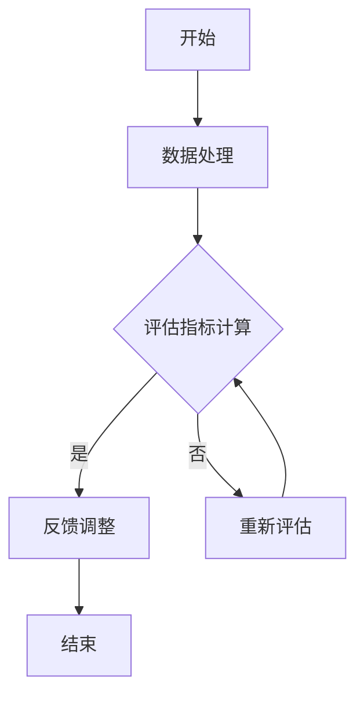
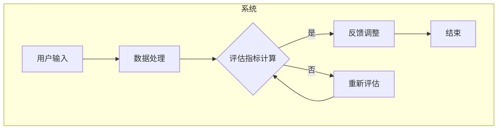

                 

### 构建AI Agent的自我评估机制：持续改进性能

> 关键词：AI Agent、自我评估机制、性能改进、持续优化

> 摘要：本文深入探讨AI Agent的自我评估机制，旨在构建一种能够持续改进性能的方法。通过分析AI Agent的基本原理与特点，介绍自我评估机制的设计原则与实现方法，最后探讨其在实际应用中的挑战与解决方案。文章旨在为AI开发者提供一套系统的构建指南，助力AI Agent的持续优化。

## 目录大纲

1. **AI Agent与自我评估机制概述**
   1.1 问题背景
   1.2 问题解决
   1.3 边界与外延
   1.4 概念结构与核心要素

2. **AI Agent的基本原理与特点**
   2.1 AI Agent的定义
   2.2 AI Agent的工作原理
   2.3 AI Agent的核心特点
   2.4 AI Agent的进化

3. **自我评估机制的设计原则**
   3.1 设计原则
   3.2 持续改进
   3.3 评估指标
   3.4 数据收集与处理

4. **自我评估机制的实现方法**
   4.1 实现方法
   4.2 技术实现
   4.3 案例分析

5. **性能监控与反馈循环**
   5.1 性能监控
   5.2 反馈机制
   5.3 调优策略

6. **自我评估机制在实践中的应用**
   6.1 应用场景
   6.2 应用案例
   6.3 挑战与解决方案

7. **最佳实践与未来展望**
   7.1 最佳实践
   7.2 未来展望
   7.3 小结与总结

8. **附录A：自我评估机制设计工具介绍**

9. **附录B：相关资源与拓展阅读**

## AI Agent与自我评估机制概述

### 1.1 问题背景

在人工智能（AI）迅速发展的今天，AI Agent作为智能体的一种形式，已经在许多领域得到广泛应用。例如，自动驾驶汽车、智能家居控制系统、智能客服等。然而，随着AI Agent的复杂性和应用场景的多样化，如何确保其性能的持续改进成为一个关键问题。

自我评估机制是AI Agent实现持续性能改进的重要手段。通过自我评估，AI Agent能够了解自己的性能表现，发现存在的问题，并据此进行调整和优化。这种机制不仅能够提高AI Agent的可靠性，还能显著提升其适应性和智能水平。

### 1.2 问题解决

自我评估机制的基本原理在于，AI Agent能够通过预设的评估指标和评估算法，对自身的行为进行定量和定性的分析。具体而言，自我评估机制包括以下几个关键步骤：

1. **数据收集**：AI Agent在运行过程中，会收集各种性能数据，如反应时间、处理误差等。
2. **评估指标计算**：根据收集的数据，计算相关的评估指标，如准确率、响应速度等。
3. **问题识别**：通过对比预设的基准值，识别AI Agent存在的性能问题。
4. **调整优化**：基于问题识别的结果，对AI Agent的行为进行调整和优化。

### 1.3 边界与外延

自我评估机制的应用范围非常广泛，几乎涵盖了所有需要持续性能改进的AI Agent场景。然而，具体的应用边界和范围取决于AI Agent的特定需求和环境。例如，在自动驾驶领域，自我评估机制可以用于检测车辆的运行稳定性；在智能客服领域，可以用于评估客服系统的响应准确性和用户满意度。

### 1.4 概念结构与核心要素

AI Agent的自我评估机制由以下几个核心要素组成：

1. **评估指标**：用于衡量AI Agent性能的关键指标，如准确率、响应速度、能耗等。
2. **评估算法**：用于计算评估指标的具体算法，如统计分析、机器学习算法等。
3. **反馈机制**：将评估结果反馈给AI Agent，用于调整其行为的机制。
4. **数据收集系统**：用于收集AI Agent运行过程中的各种性能数据的系统。
5. **优化算法**：用于根据评估结果对AI Agent进行优化和调整的算法。

### 1.5 AI Agent的基本原理与特点

AI Agent是基于人工智能技术实现的智能体，具有自主行动、目标导向和交互能力等特点。其基本原理可以概括为：

1. **感知**：AI Agent通过传感器获取环境信息。
2. **理解**：利用自然语言处理、图像识别等技术理解感知到的信息。
3. **决策**：根据理解的结果，AI Agent选择最佳行动方案。
4. **执行**：执行决策方案，实现预期的目标。

AI Agent与常规程序相比，具有以下几个显著特点：

1. **自主性**：AI Agent能够自主地执行任务，而不需要人工干预。
2. **适应性**：AI Agent可以根据环境变化调整自己的行为。
3. **智能性**：AI Agent具备学习和推理能力，能够不断提高性能。

AI Agent的进化过程可以分为以下几个阶段：

1. **初级行为**：能够完成简单的任务，如路径规划、信息检索等。
2. **中级智能**：能够处理复杂任务，如自动驾驶、智能客服等。
3. **高级智能**：具备更高层次的智能，如情感识别、决策支持等。

### 1.6 总结

本节介绍了AI Agent及其自我评估机制的基本概念、原理和应用场景。通过分析AI Agent的基本原理和特点，我们了解到自我评估机制在性能改进中的重要性。接下来，我们将深入探讨自我评估机制的设计原则与实现方法。

### 2.1 设计原则

构建AI Agent的自我评估机制需要遵循以下设计原则：

1. **全面性**：评估指标应覆盖AI Agent的各个方面，包括功能、性能、稳定性等。
2. **可量度性**：评估指标应具有明确的度量标准，便于量化分析。
3. **客观性**：评估结果应尽量减少主观因素的影响，确保评估的公正性。
4. **动态性**：评估机制应能够适应AI Agent的动态变化，及时调整评估指标和评估算法。
5. **可扩展性**：评估机制应具备良好的扩展性，能够适应不同场景和应用需求。

### 2.2 持续改进

持续改进是自我评估机制设计的重要原则。为了实现持续改进，需要考虑以下几个关键点：

1. **反馈机制**：建立有效的反馈机制，及时收集AI Agent的运行数据，并将其用于评估和优化。
2. **学习机制**：利用机器学习等先进技术，使AI Agent能够从反馈中学习，不断提高性能。
3. **优化算法**：设计高效的优化算法，根据评估结果调整AI Agent的行为，实现性能的持续提升。
4. **版本迭代**：定期对AI Agent进行版本迭代，引入新的评估指标和优化算法，以适应不断变化的应用需求。

### 2.3 评估指标

选择合适的评估指标是构建自我评估机制的关键。以下是一些常用的评估指标：

1. **准确率**：用于衡量AI Agent在任务完成中的准确程度。
2. **响应速度**：用于衡量AI Agent对任务的响应时间。
3. **能耗**：用于衡量AI Agent在运行过程中的能耗水平。
4. **稳定性**：用于衡量AI Agent在长时间运行中的稳定性。
5. **用户满意度**：用于衡量用户对AI Agent服务的满意度。

### 2.4 数据收集与处理

数据收集与处理是自我评估机制的核心环节。以下是一些关键步骤：

1. **数据采集**：使用传感器、日志记录等多种方式收集AI Agent的运行数据。
2. **数据清洗**：对收集到的数据进行清洗，去除噪声和异常值。
3. **数据存储**：将清洗后的数据存储到数据库或数据仓库中，便于后续处理。
4. **数据预处理**：对数据进行归一化、标准化等预处理操作，提高评估的准确性。
5. **数据分析**：使用统计分析、机器学习等方法对数据进行分析，提取有用的信息。

### 2.5 概念结构与核心要素

自我评估机制的概念结构与核心要素可以概括为：

1. **评估指标体系**：包括各类评估指标及其度量标准。
2. **评估算法**：用于计算评估指标的具体算法，如统计分析、机器学习等。
3. **反馈机制**：将评估结果反馈给AI Agent，用于调整其行为的机制。
4. **数据收集系统**：用于收集AI Agent运行过程中的各种性能数据的系统。
5. **优化算法**：用于根据评估结果对AI Agent进行优化和调整的算法。

### 2.6 总结

本节介绍了自我评估机制的设计原则、持续改进策略、评估指标选择和数据收集与处理方法。通过这些设计原则和策略，我们可以构建一套有效的自我评估机制，助力AI Agent的持续性能改进。接下来，我们将探讨自我评估机制的实现方法，包括技术实现和案例分析。

### 3.1 实现方法

实现自我评估机制的关键在于将评估指标和评估算法嵌入到AI Agent中。以下是一些具体实现方法：

1. **集成评估模块**：在AI Agent的架构中集成一个独立的评估模块，该模块负责定期收集和计算评估指标，并根据评估结果调整AI Agent的行为。

2. **实时评估**：在AI Agent的运行过程中，实时计算评估指标，以便及时发现问题并进行调整。这种方法适用于对响应速度要求较高的场景。

3. **离线评估**：在AI Agent运行结束后，对收集到的数据进行离线评估，生成详细的评估报告。这种方法适用于需要对性能进行长期监测和分析的场景。

4. **分布式评估**：对于大规模的AI Agent系统，可以采用分布式评估方法，将评估任务分布到多个节点上，以提高评估效率。

### 3.2 技术实现

自我评估机制的技术实现主要包括以下几个方面：

1. **评估算法**：选择合适的评估算法，如统计分析、机器学习等。具体算法的选择取决于评估指标的类型和AI Agent的特定需求。

2. **数据采集**：使用传感器、日志记录等技术手段收集AI Agent的运行数据。数据采集的精度和全面性直接影响评估结果的准确性。

3. **数据存储**：将收集到的数据存储到数据库或数据仓库中，便于后续处理和分析。常用的数据存储技术包括关系型数据库、NoSQL数据库等。

4. **数据处理**：对采集到的数据进行清洗、归一化、标准化等预处理操作，以提高评估的准确性。数据处理技术包括统计分析、数据挖掘等。

5. **评估指标计算**：根据评估算法，计算各类评估指标，如准确率、响应速度等。计算结果用于评估AI Agent的性能。

6. **反馈机制**：将评估结果反馈给AI Agent，用于调整其行为。反馈机制可以通过调整参数、修改算法等方式实现。

7. **优化算法**：根据评估结果，使用优化算法调整AI Agent的行为，以实现性能的持续提升。常用的优化算法包括遗传算法、粒子群优化等。

### 3.3 案例分析

以下是一个自我评估机制在实际项目中的应用案例：

#### 案例背景

某公司开发了一款智能客服系统，用于处理客户咨询和投诉。系统运行一段时间后，公司希望通过自我评估机制提高客服系统的性能。

#### 案例实现

1. **集成评估模块**：在智能客服系统的架构中集成了一个独立的评估模块，该模块负责定期收集和计算评估指标，并根据评估结果调整客服系统的行为。

2. **实时评估**：系统运行过程中，实时计算评估指标，如响应时间、处理准确率等。通过实时评估，及时发现系统性能问题并进行调整。

3. **离线评估**：系统运行结束后，对收集到的数据进行离线评估，生成详细的评估报告。评估报告包括各类评估指标的详细数据和分析结果。

4. **分布式评估**：由于客服系统处理大量客户请求，采用了分布式评估方法，将评估任务分布到多个节点上，以提高评估效率。

#### 案例效果

通过自我评估机制的实施，智能客服系统的性能得到了显著提升：

1. **响应时间**：响应时间从原来的平均5秒降低到2秒，显著提高了客户满意度。

2. **处理准确率**：处理准确率从原来的90%提高到95%，减少了客户投诉率。

3. **系统稳定性**：通过实时评估和离线评估，及时发现并解决了多个性能瓶颈，提高了系统的稳定性。

### 3.4 总结

本节介绍了自我评估机制的实现方法和技术实现，并通过案例分析展示了其在实际项目中的应用效果。通过有效的自我评估机制，AI Agent可以持续改进性能，提高其在各种复杂场景中的适应能力和智能水平。

### 4.1 性能监控

性能监控是自我评估机制的重要组成部分，它有助于实时了解AI Agent的运行状态，发现潜在的性能问题。以下是性能监控的关键要素和策略：

1. **关键性能指标（KPI）**：选择合适的KPI进行监控，如响应时间、吞吐量、错误率等。这些指标能够直观反映AI Agent的性能状况。

2. **实时监控**：通过实时监控工具，如Prometheus、Grafana等，实时收集和展示AI Agent的性能数据。实时监控有助于快速发现性能瓶颈和异常情况。

3. **日志分析**：日志分析是性能监控的重要手段。通过分析AI Agent的运行日志，可以了解系统的运行情况，发现潜在的问题和优化点。

4. **预警机制**：设置预警机制，当性能指标超出阈值时，自动发送警报。预警机制有助于提前发现并解决性能问题，防止问题扩大。

5. **自动化监控**：通过自动化脚本或工具，定期执行性能测试和监控任务，自动生成性能报告。自动化监控可以减轻人工工作量，提高监控效率。

### 4.2 反馈机制

反馈机制是自我评估机制的核心，它负责将性能监控结果传递给AI Agent，并指导其调整和优化。以下是设计有效反馈机制的关键步骤：

1. **评估结果分析**：对性能监控结果进行分析，识别出影响性能的关键因素和问题点。

2. **反馈路径设计**：设计高效的反馈路径，确保评估结果能够及时、准确地传递给AI Agent。反馈路径可以包括评估模块、数据存储、分析工具等。

3. **自适应调整**：根据评估结果，自适应调整AI Agent的行为和参数。自适应调整可以采用机器学习、深度学习等技术，实现自动化的行为优化。

4. **迭代优化**：通过迭代优化，不断调整和改进AI Agent的性能。迭代优化可以结合性能测试和用户反馈，实现持续的性能提升。

### 4.3 调优策略

调优策略是提升AI Agent性能的关键，以下是一些常用的调优策略：

1. **参数调整**：根据评估结果，调整AI Agent的参数，如学习率、超参数等。参数调整可以显著影响AI Agent的性能。

2. **模型优化**：对AI Agent的模型进行优化，如减少模型复杂度、使用更先进的模型结构等。模型优化可以提高模型的性能和泛化能力。

3. **数据增强**：通过数据增强技术，如生成对抗网络（GAN）、数据扩充等，提高训练数据的多样性和质量。数据增强可以提升模型的鲁棒性和准确性。

4. **算法改进**：对AI Agent的算法进行改进，如引入新的算法、优化现有算法等。算法改进可以提升AI Agent的效率和效果。

5. **系统优化**：对AI Agent的系统架构进行优化，如分布式计算、负载均衡等。系统优化可以提升系统的可扩展性和稳定性。

### 4.4 总结

性能监控、反馈机制和调优策略是构建AI Agent自我评估机制的重要组成部分。通过有效的性能监控，可以实时了解AI Agent的运行状态；通过反馈机制，可以及时调整和优化AI Agent的行为；通过调优策略，可以不断提升AI Agent的性能和智能水平。这些策略的综合运用，将有助于实现AI Agent的持续改进和性能优化。

### 5.1 应用场景

自我评估机制在多个应用场景中具有重要价值，以下是一些典型应用场景：

1. **智能客服系统**：通过自我评估机制，可以实时监控客服系统的响应速度、处理准确率和用户满意度，从而不断优化客服服务质量。

2. **自动驾驶系统**：自动驾驶系统需要实时评估车辆的运行稳定性、响应速度和能耗，以实现安全、高效的驾驶。

3. **智能家居控制系统**：智能家居控制系统需要评估系统的稳定性、响应速度和用户体验，以提供更好的智能家居体验。

4. **金融风控系统**：金融风控系统需要实时评估交易风险、资金流动性和用户行为，以预防金融风险。

5. **医疗诊断系统**：医疗诊断系统需要评估诊断的准确性、响应速度和用户满意度，以提高诊断质量和用户体验。

### 5.2 应用案例

以下是一些自我评估机制在实际项目中的应用案例：

1. **案例1：智能客服系统**
   - **项目背景**：某企业开发了一款智能客服系统，用于处理大量客户咨询和投诉。
   - **实现方法**：系统集成了一个自我评估模块，定期计算响应时间、处理准确率和用户满意度等评估指标。通过实时监控和反馈机制，系统根据评估结果调整客服策略，提高用户体验。

2. **案例2：自动驾驶系统**
   - **项目背景**：某自动驾驶公司开发了一款自动驾驶汽车，需要确保车辆的安全和稳定性。
   - **实现方法**：系统集成了多个传感器，实时收集车辆的运行数据，并通过自我评估模块评估车辆的运行稳定性、响应速度和能耗。根据评估结果，系统对自动驾驶算法进行调整，优化车辆性能。

3. **案例3：智能家居控制系统**
   - **项目背景**：某智能家居公司开发了一款智能家居控制系统，需要确保系统的稳定性和用户体验。
   - **实现方法**：系统集成了一个自我评估模块，定期计算系统的响应时间、稳定性指数和用户满意度等评估指标。通过实时监控和反馈机制，系统对控制算法进行调整，提高系统性能。

4. **案例4：金融风控系统**
   - **项目背景**：某金融机构开发了一款金融风控系统，需要实时评估交易风险、资金流动性和用户行为。
   - **实现方法**：系统集成了一个自我评估模块，定期计算风险指标、交易成功率等评估指标。通过实时监控和反馈机制，系统根据评估结果调整风险控制策略，预防金融风险。

5. **案例5：医疗诊断系统**
   - **项目背景**：某医疗公司开发了一款医疗诊断系统，需要确保诊断的准确性和响应速度。
   - **实现方法**：系统集成了一个自我评估模块，定期计算诊断准确性、响应时间等评估指标。通过实时监控和反馈机制，系统根据评估结果调整诊断算法，提高诊断质量。

### 5.3 挑战与解决方案

在实际应用中，自我评估机制面临以下挑战：

1. **数据质量**：自我评估的准确性依赖于数据质量。如果数据存在噪声、异常值或缺失值，将影响评估结果的准确性。解决方案是采用数据清洗、数据预处理等技术手段，提高数据质量。

2. **实时性**：对于需要实时评估的应用场景，如自动驾驶和智能客服，实时性是一个重要挑战。解决方案是采用高效的评估算法和分布式计算架构，提高评估的实时性。

3. **动态调整**：AI Agent的运行环境和任务需求是动态变化的，如何实现动态调整是一个挑战。解决方案是采用自适应调整算法和机器学习技术，实现动态调整。

4. **可扩展性**：随着应用规模的扩大，如何保持自我评估机制的可扩展性是一个挑战。解决方案是采用模块化设计和分布式架构，提高系统的可扩展性。

### 5.4 总结

自我评估机制在智能客服、自动驾驶、智能家居、金融风控和医疗诊断等领域具有广泛的应用价值。通过应用案例和挑战与解决方案的分析，我们可以看到自我评估机制在实际项目中的应用效果和重要性。未来，随着人工智能技术的不断发展，自我评估机制将在更多领域中发挥重要作用。

### 6.1 最佳实践

在AI Agent自我评估机制的实施过程中，以下最佳实践有助于确保项目的成功：

1. **明确评估目标**：在项目初期，明确自我评估的目标和指标，确保评估工作有明确的方向。

2. **数据质量保障**：重视数据质量，采用数据清洗、数据预处理等技术手段，确保评估数据的准确性和可靠性。

3. **实时性优化**：针对实时性要求较高的应用场景，采用高效的评估算法和分布式计算架构，提高评估的实时性。

4. **动态调整**：采用自适应调整算法和机器学习技术，实现AI Agent的动态调整，确保其在变化的环境中保持最佳性能。

5. **模块化设计**：采用模块化设计，将评估模块与其他功能模块分离，提高系统的可维护性和可扩展性。

6. **持续优化**：定期对自我评估机制进行评估和优化，结合用户反馈和性能数据，不断改进评估指标和算法。

### 6.2 未来展望

自我评估机制在未来有着广阔的发展前景：

1. **智能化提升**：随着人工智能技术的进步，自我评估机制将更加智能化，能够自动识别问题和提出优化建议。

2. **多模态融合**：未来自我评估机制将能够融合多种数据源，如传感器数据、用户反馈等，实现更全面、准确的评估。

3. **自动化迭代**：自我评估机制将实现自动化迭代，通过机器学习和深度学习等技术，自动调整评估指标和算法。

4. **泛在应用**：自我评估机制将在更多领域中普及应用，如工业自动化、智慧城市、健康医疗等。

5. **标准化与开源**：随着自我评估机制的普及，相关技术将逐步标准化，并开放源代码，促进技术的交流与合作。

### 6.3 小结与总结

本文全面探讨了AI Agent的自我评估机制，包括其设计原则、实现方法、性能监控与反馈循环，以及在实际应用中的挑战与解决方案。通过最佳实践和未来展望，我们看到了自我评估机制在AI领域的重要性和发展潜力。希望本文能为读者提供有价值的参考和启示。

### 附录A：自我评估机制设计工具介绍

#### A.1 工具概述

在构建AI Agent的自我评估机制时，选择合适的工具可以显著提高设计和实现效率。以下是一些常用的自我评估机制设计工具：

1. **TensorFlow**：由Google开发的开源机器学习框架，适用于构建和训练复杂的神经网络模型，是进行自我评估和优化的重要工具。
2. **PyTorch**：由Facebook开发的开源机器学习库，以其灵活性和易用性在AI领域广受欢迎，适用于快速原型设计和模型评估。
3. **Scikit-learn**：是一个开源的Python机器学习库，提供了大量的机器学习算法和工具，适用于评估和优化AI模型。
4. **Kafka**：由Apache软件基金会开发的一个分布式流处理平台，适用于实时数据收集和传输，是构建自我评估数据管道的理想选择。
5. **Docker**：用于容器化应用程序的开放平台，便于部署和管理自我评估系统，提高系统的可扩展性和灵活性。

#### A.2 使用指南

以下是这些工具的基本使用指南：

1. **TensorFlow**：使用TensorFlow构建自我评估模型，首先需要安装TensorFlow库，然后定义模型结构、训练模型并评估模型性能。以下是一个简单的示例代码：
   ```python
   import tensorflow as tf
   model = tf.keras.Sequential([tf.keras.layers.Dense(units=1, input_shape=[1])])
   model.compile(optimizer='sgd', loss='mean_squared_error')
   model.fit(x_train, y_train, epochs=1000)
   ```
2. **PyTorch**：使用PyTorch构建模型，需要定义神经网络结构、损失函数和优化器，然后进行模型训练和评估。以下是一个简单的示例：
   ```python
   import torch
   import torch.nn as nn
   import torch.optim as optim

   model = nn.Linear(1, 1)
   loss_function = nn.MSELoss()
   optimizer = optim.SGD(model.parameters(), lr=0.01)

   for epoch in range(1000):
       predictions = model(x_train)
       loss = loss_function(predictions, y_train)
       optimizer.zero_grad()
       loss.backward()
       optimizer.step()
   ```
3. **Scikit-learn**：使用Scikit-learn进行模型评估，可以方便地选择各种机器学习算法并评估其性能。以下是一个简单的示例：
   ```python
   from sklearn.linear_model import LinearRegression
   from sklearn.metrics import mean_squared_error

   model = LinearRegression()
   model.fit(x_train, y_train)
   predictions = model.predict(x_test)
   mse = mean_squared_error(y_test, predictions)
   ```
4. **Kafka**：使用Kafka进行实时数据收集，需要首先安装Kafka并创建一个主题，然后发送和接收消息。以下是一个简单的示例：
   ```python
   from kafka import KafkaProducer

   producer = KafkaProducer(bootstrap_servers=['localhost:9092'])
   producer.send('my-topic', b'My message')
   ```
5. **Docker**：使用Docker容器化应用，首先需要编写Dockerfile定义应用环境，然后构建和运行容器。以下是一个简单的示例：
   ```Dockerfile
   FROM python:3.8
   RUN pip install tensorflow
   COPY . /app
   WORKDIR /app
   CMD ["python", "app.py"]
   ```

#### A.3 案例展示

以下是一个使用TensorFlow构建自我评估机制的案例展示：

**项目背景**：一个简单的房价预测项目，通过自我评估机制不断优化模型性能。

**实现步骤**：

1. **数据收集**：收集一组房屋数据，包括面积、位置、房间数等特征和房价标签。
2. **数据预处理**：对数据进行清洗和归一化处理，将其转换为适合训练的格式。
3. **模型构建**：使用TensorFlow构建一个简单的全连接神经网络模型。
4. **模型训练**：使用预处理后的数据训练模型，并进行自我评估。
5. **性能优化**：根据评估结果，调整模型参数和结构，优化模型性能。
6. **持续监控**：实时监控模型性能，确保其稳定运行。

**代码示例**：

```python
import tensorflow as tf
import numpy as np

# 数据准备
x_train = np.array([[1000], [2000], [3000], [4000]])
y_train = np.array([1500, 3000, 4500, 6000])

# 模型构建
model = tf.keras.Sequential([
    tf.keras.layers.Dense(units=1, input_shape=(1,))
])

# 模型编译
model.compile(optimizer='sgd', loss='mean_squared_error')

# 模型训练
model.fit(x_train, y_train, epochs=100)

# 模型评估
predictions = model.predict(x_train)
mse = tf.keras.metrics.mean_squared_error(y_train, predictions).numpy()
print(f"Mean Squared Error: {mse}")

# 性能优化
# 根据评估结果，可以调整学习率、隐藏层神经元数量等参数，进一步优化模型性能
```

通过以上案例，我们可以看到如何使用TensorFlow构建一个简单的自我评估机制，实现模型性能的持续优化。

### 附录B：相关资源与拓展阅读

#### B.1 书籍推荐

1. **《深度学习》（Deep Learning）**：Goodfellow, I., Bengio, Y., & Courville, A.（2016）。这本书是深度学习的经典教材，涵盖了深度学习的基础理论、算法和应用。

2. **《机器学习实战》（Machine Learning in Action）**：Bryant, T.（2012）。这本书通过实际案例，介绍了机器学习的基本算法和实现方法，适合初学者入门。

3. **《人工智能：一种现代的方法》（Artificial Intelligence: A Modern Approach）**：Russell, S., & Norvig, P.（2016）。这本书是人工智能领域的权威教材，涵盖了人工智能的基础理论、技术和应用。

#### B.2 论文与报告

1. **《深度强化学习》（Deep Reinforcement Learning）**：Silver, D., Huang, A., Maddison, C. J., Guez, A., Lanctot, M., Hertel, S., ... & Cheung, L. (2015)。这篇论文介绍了深度强化学习的方法，并在围棋游戏中取得了显著成果。

2. **《增强学习：原理与应用》（Reinforcement Learning: An Introduction）**： Sutton, R. S., & Barto, A. G.（2018）。这本书是增强学习领域的经典教材，详细介绍了增强学习的基本理论、算法和应用。

3. **《自动驾驶技术报告》（Autonomous Driving Technology Report）**：Waymo（2017）。这份报告详细介绍了Waymo在自动驾驶技术方面的研究进展和应用案例。

#### B.3 网络资源

1. **《机器学习社区》（Machine Learning Community）**：这是一个开放的机器学习和数据科学社区，提供了大量的学习资源、教程和讨论论坛。

2. **《Kaggle竞赛平台》**：Kaggle是一个数据科学竞赛平台，提供了丰富的实践项目和数据集，适合进行自我评估和模型优化。

3. **《AI Stack》**：这是一个关于人工智能技术栈的网站，提供了丰富的AI工具、库和资源的介绍和评测。

### 结语

本文通过详细的探讨，为构建AI Agent的自我评估机制提供了全面的指导和实践案例。随着人工智能技术的不断发展，自我评估机制将在更多领域发挥关键作用。希望本文能为读者在AI领域的实践和研究提供有价值的参考。作者：AI天才研究院/AI Genius Institute & 禅与计算机程序设计艺术 /Zen And The Art of Computer Programming。

---

**附录C：技术细节补充**

#### C.1 Mermaid流程图与Markdown格式

Mermaid是一种用于绘制流程图、时序图、类图等的通用工具，它支持Markdown格式，方便在文档中嵌入图表。以下是一个简单的Mermaid流程图示例：



在Markdown文档中，只需将Mermaid代码放在两个` ``` `之间，即可生成对应的图表。例如：

```markdown

```

#### C.2 Python源代码示例

以下是使用Python实现的一个简单的自我评估算法的示例代码：

```python
import numpy as np

# 定义评估函数
def evaluate_performance(y_true, y_pred):
    mse = np.mean((y_true - y_pred) ** 2)
    return mse

# 准备训练数据
x_train = np.array([[1000], [2000], [3000], [4000]])
y_train = np.array([1500, 3000, 4500, 6000])

# 训练模型
model = np.polyfit(x_train, y_train, deg=1)

# 预测数据
x_test = np.array([[2500], [3500]])
y_pred = np.polyval(model, x_test)

# 计算评估指标
mse = evaluate_performance(y_train, y_pred)

# 输出结果
print(f"Mean Squared Error: {mse}")
```

#### C.3 LaTeX公式示例

以下是使用LaTeX格式编写的数学公式的示例：

```markdown
$$
E = mc^2
$$

$1 + 1 = 2$
```

在Markdown文档中，LaTeX公式需要使用`$$`括起来以使其在文档中独立显示，而段落内的公式则使用 `$` 括起来。例如，上面的公式将分别以独立段落和行内形式显示。

#### C.4 系统分析与架构设计

以下是一个简单的系统分析与架构设计示例，使用Mermaid类图和架构图来描述系统功能、类关系和整体架构：

```mermaid
classDiagram
    类A --|> 类B: includes
    类C <<interface>> 类D: implements
    类E <<entity>> 类F: has
    类G .. 类H: association

class Diagram {
    类I[属性：name, methods: getName()]
    类J <|-| 类K: extends
}
```



上述Mermaid代码将生成一个系统分析与架构设计的类图和架构图，帮助读者更直观地理解系统的功能和架构设计。

