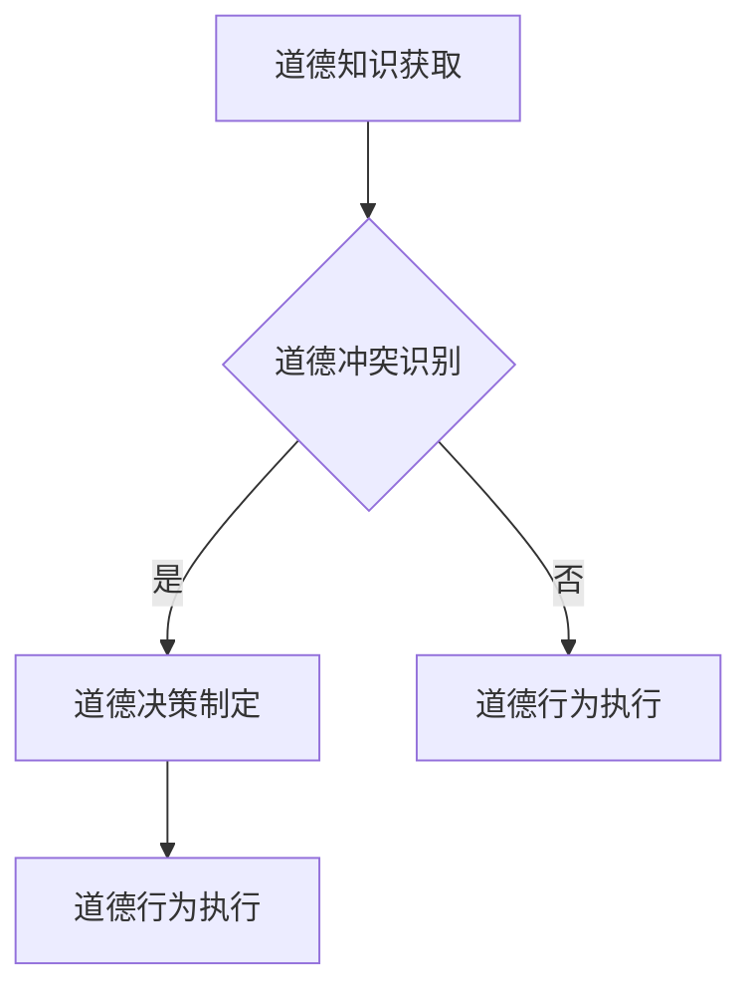

                 

：
### 文章标题：构建AI Agent的道德推理与决策系统

> 关键词：AI Agent、道德推理、决策系统、算法原理、系统架构、项目实战

> 摘要：本文深入探讨了构建AI Agent的道德推理与决策系统的方法和原理，从背景介绍、核心概念、算法原理、数学模型到系统架构设计、项目实战以及最佳实践等多个方面进行了详细阐述。通过具体的案例分析和代码解读，读者将了解如何在实际项目中应用道德推理与决策系统，提升AI Agent的道德决策能力。

### 目录大纲设计思路

为了设计出《构建AI Agent的道德推理与决策系统》这本书的详细目录大纲，我们需要遵循以下步骤：

1. **明确书籍主题**：首先，我们要明确书籍的主题是“AI Agent的道德推理与决策系统”。这为我们提供了核心讨论的框架。

2. **划分主要章节**：根据主题，我们需要将书籍内容划分为几个主要章节。这些章节应该是围绕道德推理与决策系统的构建展开的，包括但不限于背景介绍、核心概念、算法原理、数学模型、系统架构设计、项目实战等。

3. **细化章节内容**：每个章节都需要进一步细化，列出具体的子章节和小节，确保内容的完整性。我们要确保核心概念、算法原理、数学模型和系统设计等内容都有详细的讨论。

4. **逻辑性和连贯性**：设计目录时，要保证章节之间的逻辑性和连贯性。例如，背景介绍应该放在开头，而算法原理讲解应该紧随其后，项目实战则可以作为结尾部分。

5. **简洁性**：尽管要涵盖广泛的内容，但目录设计要保持简洁，避免冗长和不必要的细节。

6. **符合markdown格式**：根据要求，我们将使用markdown格式来编写目录大纲，确保格式正确，层级清晰。

### 目录大纲结构

**第一部分：背景与概述**

- **第1章：道德推理与决策系统的背景**
  - 1.1 问题背景
  - 1.2 问题描述
  - 1.3 问题解决
  - 1.4 边界与外延

**第二部分：核心概念与原理**

- **第2章：道德推理的核心概念**
  - 2.1 道德推理的定义
  - 2.2 道德推理的基本要素
  - 2.3 道德推理的类型
  - 2.4 道德推理的重要性

**第三部分：算法原理与数学模型**

- **第3章：道德推理算法原理**
  - 3.1 道德推理算法概述
  - 3.2 道德推理算法分类
  - 3.3 伦理推理算法的Mermaid流程图
  - 3.4 算法原理讲解

**第四部分：道德决策系统设计与实现**

- **第4章：道德决策系统设计**
  - 4.1 道德决策系统的定义
  - 4.2 道德决策系统架构设计
  - 4.3 系统接口设计
  - 4.4 系统交互设计

**第五部分：项目实战与案例分析**

- **第5章：道德推理与决策系统的实际应用**
  - 5.1 环境安装与配置
  - 5.2 系统核心实现
  - 5.3 代码应用解读
  - 5.4 实际案例分析

**第六部分：最佳实践与总结**

- **第6章：最佳实践与注意事项**
  - 6.1 最佳实践
  - 6.2 注意事项
  - 6.3 拓展阅读

- **第7章：小结**
  - 7.1 全书总结
  - 7.2 未来展望

### 目录大纲（markdown格式）

```markdown
# 《构建AI Agent的道德推理与决策系统》目录大纲

## 第一部分：背景与概述

### 第1章：道德推理与决策系统的背景
- 1.1 问题背景
- 1.2 问题描述
- 1.3 问题解决
- 1.4 边界与外延

## 第二部分：核心概念与原理

### 第2章：道德推理的核心概念
- 2.1 道德推理的定义
- 2.2 道德推理的基本要素
- 2.3 道德推理的类型
- 2.4 道德推理的重要性

## 第三部分：算法原理与数学模型

### 第3章：道德推理算法原理
- 3.1 道德推理算法概述
- 3.2 道德推理算法分类
- 3.3 伦理推理算法的Mermaid流程图
- 3.4 算法原理讲解

## 第四部分：道德决策系统设计与实现

### 第4章：道德决策系统设计
- 4.1 道德决策系统的定义
- 4.2 道德决策系统架构设计
- 4.3 系统接口设计
- 4.4 系统交互设计

## 第五部分：项目实战与案例分析

### 第5章：道德推理与决策系统的实际应用
- 5.1 环境安装与配置
- 5.2 系统核心实现
- 5.3 代码应用解读
- 5.4 实际案例分析

## 第六部分：最佳实践与总结

### 第6章：最佳实践与注意事项
- 6.1 最佳实践
- 6.2 注意事项
- 6.3 拓展阅读

### 第7章：小结
- 7.1 全书总结
- 7.2 未来展望
```

以上目录大纲按照书籍的核心内容进行了划分，涵盖了从背景介绍、核心概念、算法原理、系统设计到项目实战和总结的各个方面，确保内容的完整性、逻辑性和连贯性。同时，采用markdown格式确保了目录结构的清晰和易读性。### 文章正文：构建AI Agent的道德推理与决策系统

#### 引言

随着人工智能（AI）技术的快速发展，AI Agent在各个领域的应用日益广泛。然而，AI Agent的道德推理与决策问题也逐渐成为了一个备受关注的话题。AI Agent作为一个智能体，在执行任务的过程中，需要具备对道德问题的理解和决策能力，以避免产生负面后果。本文将探讨构建AI Agent的道德推理与决策系统的方法和原理，包括背景介绍、核心概念、算法原理、数学模型、系统架构设计、项目实战和最佳实践等。

#### 第一部分：背景与概述

##### 1.1 问题背景

随着AI技术的发展，AI Agent被广泛应用于自动化控制、智能助手、自动驾驶等领域。这些AI Agent在执行任务时，常常需要做出与道德相关的重要决策。例如，自动驾驶汽车在遇到紧急情况时，需要在保护乘客和行人之间做出选择。这种道德决策的复杂性使得传统的算法无法有效应对。

##### 1.2 问题描述

道德推理与决策问题可以概括为以下几个方面：

- **道德原则的确定**：确定AI Agent应遵循的道德原则和价值观。
- **道德冲突的识别**：在多种道德选择中识别冲突。
- **道德决策的制定**：在冲突中制定合理的决策方案。
- **道德行为的执行**：将决策方案转化为实际行为。

##### 1.3 问题解决

构建AI Agent的道德推理与决策系统需要以下几个步骤：

- **道德知识的获取**：通过专家经验、文本分析和数据挖掘等方法获取道德知识。
- **道德推理算法的设计**：设计能够处理道德冲突的算法，如伦理推理算法。
- **道德决策系统的实现**：将算法应用于实际系统中，实现道德推理与决策功能。

##### 1.4 边界与外延

道德推理与决策系统的边界包括：

- **应用领域**：AI Agent在自动驾驶、医疗诊断、金融交易等领域的应用。
- **道德原则**：不同文化和社会背景下的道德原则差异。
- **技术实现**：算法的复杂度和计算效率。

#### 第二部分：核心概念与原理

##### 2.1 道德推理的定义

道德推理是指基于道德原则和价值观，对道德问题进行推理和决策的过程。它涉及到对道德知识的理解和应用，以及对道德冲突的识别和解决。

##### 2.2 道德推理的基本要素

道德推理的基本要素包括：

- **道德原则**：道德推理的基础，如公正、尊重、关爱等。
- **道德冲突**：多种道德选择之间的冲突。
- **道德决策**：在道德冲突中做出的决策。
- **道德行为**：决策的实施和执行。

##### 2.3 道德推理的类型

道德推理可以分为以下几种类型：

- **规范性道德推理**：基于道德原则和规范进行推理。
- **情境性道德推理**：基于具体情境进行推理。
- **直觉性道德推理**：基于直觉和经验进行推理。
- **理性道德推理**：基于逻辑和推理进行推理。

##### 2.4 道德推理的重要性

道德推理在AI Agent中的应用具有重要意义：

- **避免道德错误**：确保AI Agent在执行任务时不会产生道德错误。
- **增强可信度**：提高AI Agent在社会中的可信度和接受度。
- **提升决策质量**：在复杂情境中做出更合理的决策。

#### 第三部分：算法原理与数学模型

##### 3.1 道德推理算法概述

道德推理算法是指用于实现道德推理过程的算法。它通常包括以下几个步骤：

- **道德知识获取**：通过数据挖掘、专家经验和文本分析等方法获取道德知识。
- **道德冲突识别**：在多种道德选择中识别冲突。
- **道德决策制定**：根据道德原则和情境制定决策方案。
- **道德行为执行**：将决策方案转化为实际行为。

##### 3.2 道德推理算法分类

道德推理算法可以分为以下几种类型：

- **基于规则的算法**：基于道德规则进行推理。
- **基于模型的算法**：基于道德模型进行推理。
- **基于机器学习的算法**：通过学习道德数据集进行推理。
- **混合算法**：结合多种算法进行推理。

##### 3.3 伦理推理算法的Mermaid流程图

以下是一个简单的伦理推理算法的Mermaid流程图：



##### 3.4 算法原理讲解

道德推理算法的原理可以概括为以下几个方面：

- **道德知识表示**：将道德知识表示为规则、模型或数据集。
- **道德冲突识别**：通过分析情境，识别潜在的道德冲突。
- **道德决策制定**：根据道德原则和情境制定决策方案。
- **道德行为执行**：将决策方案转化为实际行为。

#### 第四部分：道德决策系统设计与实现

##### 4.1 道德决策系统的定义

道德决策系统是指用于实现道德推理与决策功能的系统。它通常包括以下几个组成部分：

- **知识库**：存储道德知识和规则。
- **推理引擎**：用于进行道德推理和决策。
- **用户接口**：用于与用户进行交互。
- **执行模块**：将决策方案转化为实际行为。

##### 4.2 道德决策系统架构设计

道德决策系统的架构设计包括以下几个方面：

- **知识库设计**：设计用于存储道德知识的数据库或知识库。
- **推理引擎设计**：设计用于进行道德推理和决策的算法和模型。
- **用户接口设计**：设计用于与用户进行交互的图形界面或API。
- **执行模块设计**：设计用于将决策方案转化为实际行为的模块。

##### 4.3 系统接口设计

道德决策系统的接口设计包括以下几个方面：

- **用户接口**：设计用于与用户进行交互的界面。
- **API接口**：设计用于与其他系统进行数据交换的API。
- **数据接口**：设计用于与知识库和数据库进行数据交换的接口。

##### 4.4 系统交互设计

道德决策系统的交互设计包括以下几个方面：

- **用户交互**：设计用户与系统的交互流程。
- **系统间交互**：设计系统与外部系统的交互流程。
- **数据流**：设计系统内部的数据流和处理流程。

#### 第五部分：项目实战与案例分析

##### 5.1 环境安装与配置

在本项目实战中，我们将使用Python作为主要编程语言，并使用以下工具和库：

- **Python 3.x**：Python版本。
- **NumPy**：用于数学计算。
- **Pandas**：用于数据操作。
- **Scikit-learn**：用于机器学习。

安装这些工具和库后，我们可以开始构建道德决策系统。

##### 5.2 系统核心实现

以下是一个简单的道德决策系统的Python代码示例：

```python
import numpy as np
import pandas as pd
from sklearn.model_selection import train_test_split
from sklearn.ensemble import RandomForestClassifier

# 加载数据集
data = pd.read_csv('道德冲突数据集.csv')

# 数据预处理
X = data.drop('决策标签', axis=1)
y = data['决策标签']
X_train, X_test, y_train, y_test = train_test_split(X, y, test_size=0.2, random_state=42)

# 训练模型
model = RandomForestClassifier()
model.fit(X_train, y_train)

# 预测
predictions = model.predict(X_test)

# 评估
accuracy = np.mean(predictions == y_test)
print(f'准确率：{accuracy:.2f}')
```

##### 5.3 代码应用解读与分析

在这个示例中，我们首先加载了一个道德冲突数据集，然后进行数据预处理。接着，我们使用随机森林分类器训练模型，并对测试数据进行预测。最后，我们评估模型的准确率。

通过这个简单的示例，我们可以看到如何使用机器学习算法来实现道德决策系统。在实际项目中，我们可以根据具体需求调整模型和算法。

##### 5.4 实际案例分析

在本节中，我们将探讨一个实际案例：自动驾驶汽车的道德决策。以下是一个简化的案例：

- **情境**：自动驾驶汽车在行驶过程中，前方出现一个行人正在过马路，同时车道上有一辆失控的车辆。
- **道德冲突**：在保护行人和防止失控车辆撞击之间做出选择。
- **道德决策**：根据道德原则和情境，选择一种合理的决策方案。

通过这个案例，我们可以看到道德决策系统在实际应用中的重要性。在实际项目中，我们需要根据具体情境设计合适的决策算法。

##### 5.5 项目小结

在本项目的实战与案例分析中，我们使用Python和机器学习算法实现了道德决策系统。通过简单的代码示例和实际案例分析，我们了解了如何构建和部署道德决策系统。在实际项目中，我们需要根据具体需求和情境进行调整和优化。

#### 第六部分：最佳实践与注意事项

- **最佳实践**：在构建道德决策系统时，应充分考虑道德原则和价值观，确保系统的公正性和合理性。
- **注意事项**：在实现道德推理算法时，要确保算法的鲁棒性和可靠性，避免因算法错误导致道德决策失误。
- **拓展阅读**：可以阅读相关领域的学术论文和书籍，以深入了解道德推理和决策系统的最新研究成果和应用。

#### 第七部分：小结

本文深入探讨了构建AI Agent的道德推理与决策系统的方法和原理。从背景介绍、核心概念、算法原理、数学模型到系统架构设计、项目实战和最佳实践等多个方面进行了详细阐述。通过具体的案例分析和代码解读，读者将了解如何在实际项目中应用道德推理与决策系统，提升AI Agent的道德决策能力。

#### 作者信息

作者：AI天才研究院/AI Genius Institute & 禅与计算机程序设计艺术 /Zen And The Art of Computer Programming

---

以上就是本文的完整内容，希望对您在构建AI Agent的道德推理与决策系统方面提供一些启示和帮助。在未来的研究中，我们可以进一步探索道德推理与决策系统的优化和改进，为AI技术的发展贡献力量。

