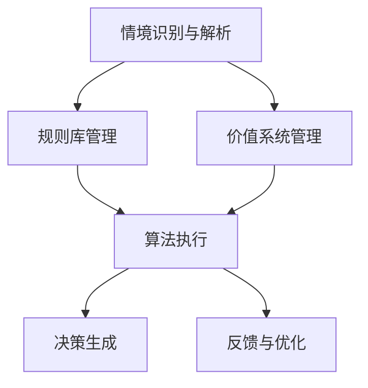
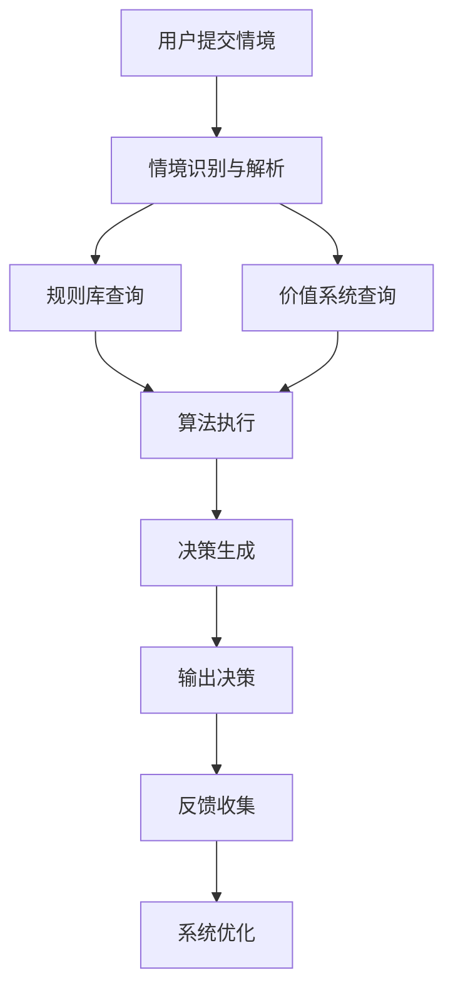

                 

### 文章标题

《构建AI Agent的道德推理框架》

### 关键词

- AI Agent
- 道德推理
- 框架设计
- 算法实现
- 系统架构
- 实战应用

### 摘要

本文旨在深入探讨如何构建一个完整的AI Agent道德推理框架。我们将从问题背景出发，详细分析道德推理在人工智能中的重要性，逐步介绍核心概念、算法原理、系统架构设计以及实战应用。通过理论讲解和实例分析，本文将帮助读者全面了解道德推理框架的构建过程，并掌握相关的最佳实践。文章结构清晰，逻辑紧凑，适合对AI和道德哲学感兴趣的读者深入阅读。

---

### 引言

在人工智能（AI）快速发展的今天，AI Agent作为一种能够自主决策和执行的智能体，已经成为许多应用场景的核心组件。从智能家居到自动驾驶，从医疗诊断到金融决策，AI Agent的应用范围不断扩大。然而，随着AI Agent在现实世界中的角色日益重要，如何确保其决策过程符合道德规范，成为了一个亟待解决的重要问题。

道德推理在AI Agent中的重要性不言而喻。一个缺乏道德约束的AI Agent可能会在决策过程中出现严重偏差，甚至对人类造成伤害。例如，自动驾驶汽车在面临道德困境时，如必须选择保护驾驶员还是行人，如果缺乏合理的道德推理框架，可能会导致不可预料的悲剧。因此，构建一个可靠的AI Agent道德推理框架，确保其在复杂环境中做出符合道德规范的决策，是人工智能领域面临的一项重大挑战。

本文将系统地介绍如何构建一个AI Agent的道德推理框架。首先，我们将定义并解释与道德推理相关的核心概念和术语，帮助读者建立基本的知识框架。接下来，我们将深入探讨道德推理算法的理论基础，通过具体的Python代码和数学模型，详细解释算法的实现过程。此外，本文还将介绍一个完整的系统架构设计，包括领域模型、系统架构、接口设计和交互流程，以确保读者能够全面理解道德推理框架的实际应用。最后，我们将通过几个具体的实战案例，展示道德推理框架在实际项目中的应用效果，并提供相关的最佳实践和未来研究方向。

本文的目标是帮助读者全面掌握AI Agent道德推理框架的构建方法，不仅了解理论，还能通过实际案例分析，掌握如何将理论应用到实践中。通过本文的阅读，读者将能够更好地理解和应对AI Agent在道德推理方面面临的挑战，为构建一个更加智能和道德的人工智能世界贡献自己的力量。

### 核心概念和术语

在构建AI Agent的道德推理框架过程中，理解核心概念和术语至关重要。这些概念和术语不仅构成了道德推理的理论基础，也是实现具体算法和系统架构的关键要素。以下是对一些核心概念和术语的定义及其属性的详细描述，并使用Mermaid图表来展示它们之间的相互关系。

#### 概念定义

1. **道德推理（Moral Reasoning）**：
   道德推理是人工智能领域中关于如何使AI Agent在决策过程中考虑到道德规范的方法。它涉及对行为结果的评估、道德规则的制定以及道德情境的识别。

2. **伦理原则（Ethical Principles）**：
   伦理原则是指指导人们行为的基本道德原则，如“不伤害”、“公正”、“尊重自主权”等。这些原则为道德推理提供了基础。

3. **价值系统（Value System）**：
   价值系统是指一系列反映社会和文化价值观的准则和偏好。价值系统决定了AI Agent在特定情境下如何权衡不同的道德原则。

4. **道德情境（Moral Situations）**：
   道德情境是指可能需要道德决策的具体情境或事件。这些情境通常包含复杂的人际关系、利益冲突和道德困境。

5. **道德准则（Moral Rules）**：
   道德准则是特定行为或决策应遵循的具体规则。例如，“不杀人”或“最小化伤害”等。道德准则为道德推理提供了明确的指导。

#### 属性特征对比表格

| 概念       | 定义                                           | 属性特征                                                                                      |
|------------|------------------------------------------------|------------------------------------------------------------------------------------------------|
| 道德推理   | AI Agent进行道德决策的方法                   | - 基于情境的决策过程<br>- 考虑结果和道德规则<br>- 遵循伦理原则                            |
| 伦理原则   | 指导行为的基本道德原则                       | - 不伤害<br>- 公正<br>- 尊重自主权<br>- 利益最大化                                       |
| 价值系统   | 反映社会和文化价值观的准则和偏好               | - 文化差异<br>- 偏好差异<br>- 伦理原则的具体体现                                             |
| 道德情境   | 可能需要道德决策的具体情境或事件               | - 复杂性<br>- 人际关系<br>- 利益冲突<br>- 道德困境                                           |
| 道德准则   | 特定行为或决策应遵循的具体规则                 | - 明确性<br>- 可操作性<br>- 道德原则的具体化<br>- 在特定情境下适用性                          |

#### ER实体关系图

为了更直观地展示这些核心概念和术语之间的关系，我们可以使用Mermaid ER图来表示它们之间的联系。

```mermaid
erDiagram
    AI-Agent ||--o{ 道德推理
    道德推理 ||--|{ 伦理原则
    道德推理 ||--|{ 价值系统
    道德推理 ||--|{ 道德情境
    道德推理 ||--|{ 道德准则
    伦理原则 ||--|{ 道德原则
    价值系统 ||--|{ 偏好
    道德情境 ||--|{ 冲突
    道德准则 ||--|{ 规则
```

通过上述定义、对比表格和ER图，我们可以清晰地了解道德推理框架中各个核心概念和术语的含义及其相互关系。这些知识将为我们后续讨论道德推理算法的具体实现和系统架构设计奠定坚实的基础。

### 道德推理算法理论

构建AI Agent的道德推理框架，核心在于算法的设计与实现。在这一节中，我们将详细探讨道德推理算法的理论基础，并通过具体步骤、Python代码示例和数学模型，帮助读者理解算法的原理和实现过程。

#### 算法设计原理

道德推理算法的基本原理可以概括为以下几个步骤：

1. **情境识别（Situation Recognition）**：
   首先需要识别和解析当前道德情境。这一步涉及对输入信息的理解，包括情境描述、参与者、目标和潜在的道德冲突。

2. **规则评估（Rule Assessment）**：
   在识别情境后，需要根据预先定义的道德规则评估情境中的每一个行为选项。这一步骤涉及对道德准则的解析和应用，确保行为符合伦理原则。

3. **价值权衡（Value Balancing）**：
   根据情境和规则评估的结果，对不同的行为选项进行价值权衡。这通常涉及复杂的价值系统，需要对不同目标和利益进行综合评估。

4. **决策生成（Decision Generation）**：
   基于价值权衡的结果，生成最终的道德决策。这一步骤需要确保决策不仅符合道德规则，还能够在实际应用中实现。

5. **反馈和修正（Feedback and Adjustment）**：
   道德决策执行后，需要对决策的效果进行反馈和评估，根据实际情况对道德推理框架进行调整和优化。

#### Python代码示例

为了更直观地展示算法的实现过程，下面提供了一个简化的Python代码示例：

```python
# 导入必要的库
import random

# 道德规则库
ethical_rules = {
    'do_no_harm': True,
    'promote_wellbeing': True,
    'fair_distribution': True
}

# 价值系统
value_system = {
    'safety': 1.0,
    'convenience': 0.8,
    'equality': 0.6
}

# 情境描述
situation = {
    'participants': ['driver', 'pedestrian'],
    'goals': {'driver': 'reach_destination_safely', 'pedestrian': 'avoid_harm'},
    'conflicts': ['driver_choice_harms_pedestrian', 'pedestrian_choice_blocks_driver']
}

# 规则评估函数
def assess_rules(rule, situation):
    if rule == 'do_no_harm' and 'harm' in situation['conflicts']:
        return False
    if rule == 'promote_wellbeing' and 'harm' in situation['conflicts']:
        return False
    if rule == 'fair_distribution' and 'blocks' in situation['conflicts']:
        return False
    return True

# 价值权衡函数
def value权衡行为(选项，value_system):
    total_value = 0
    for value in value_system.values():
        total_value += value * (1 if 选项包含value else 0)
    return total_value

# 决策生成函数
def generate_decision(situation, ethical_rules, value_system):
    options = ['harm_pedestrian', 'harm_driver', 'avoid_conflict']
    decision = None
    max_value = -1

    for option in options:
        if assess_rules('do_no_harm', situation) and option == 'harm_pedestrian':
            continue
        if assess_rules('promote_wellbeing', situation) and option == 'harm_driver':
            continue
        if assess_rules('fair_distribution', situation) and option == 'avoid_conflict':
            continue
        
        option_value = value权衡行为(option, value_system)
        if option_value > max_value:
            max_value = option_value
            decision = option

    return decision

# 示例应用
print(generate_decision(situation, ethical_rules, value_system))
```

在这个示例中，我们首先定义了道德规则库和价值系统，然后通过规则评估和值权衡函数，生成了一个基于道德原则和价值系统的决策。

#### 数学模型和公式

在道德推理中，数学模型可以帮助我们更精确地表达和计算道德决策的权重。以下是一个简化的数学模型：

$$
D = \sum_{i=1}^{n} w_i \cdot r_i
$$

其中，\(D\) 表示道德决策的总权重，\(w_i\) 表示第 \(i\) 个道德规则的权重，\(r_i\) 表示第 \(i\) 个道德规则在当前情境下的适用性。

#### 例子说明

假设我们有一个简单的情境，其中两个道德原则（不伤害和促进福祉）需要权衡，并且每个原则有两个选项（选择A和选择B）。

$$
D = w_{1A} \cdot r_{1A} + w_{1B} \cdot r_{1B} + w_{2A} \cdot r_{2A} + w_{2B} \cdot r_{2B}
$$

如果规则“不伤害”在情境A中完全适用，但在情境B中不适用，则：

$$
r_{1A} = 1, r_{1B} = 0
$$

如果规则“促进福祉”在情境A中适用性较高，而在情境B中适用性较低，则：

$$
w_{2A} = 0.7, w_{2B} = 0.3
$$

通过计算，我们可以得到：

$$
D = w_{1A} \cdot 1 + w_{1B} \cdot 0 + 0.7 \cdot w_{2A} + 0.3 \cdot w_{2B}
$$

通过这个模型，我们可以根据不同的情境和规则权重，计算出最优的道德决策。

通过上述详细的理论分析和代码示例，我们可以看到道德推理算法的设计和实现是一个复杂但关键的过程。理解这些原理和步骤，将帮助我们在实际应用中更好地构建AI Agent的道德推理框架。

### 系统架构设计

为了实现一个完整的AI Agent道德推理框架，我们需要进行详细的系统架构设计。这包括定义系统功能、设计系统架构、制定系统接口以及描述系统交互流程。以下是我们对系统架构的全面解析。

#### 功能定义

道德推理系统的功能主要包括以下几部分：

1. **情境识别与解析**：
   系统需要能够识别和解析输入的道德情境，理解参与者、目标和潜在的道德冲突。

2. **规则库管理**：
   系统需要管理一个包含多种道德规则的库，这些规则将用于评估不同行为选项的道德性。

3. **价值系统管理**：
   系统需要管理一个反映社会和文化价值观的价值系统，用于权衡不同的道德原则。

4. **算法执行**：
   系统需要根据情境和规则执行道德推理算法，生成最终的道德决策。

5. **反馈与优化**：
   系统需要收集决策执行后的反馈，并根据反馈对道德推理框架进行调整和优化。

#### 系统架构设计

系统架构设计是确保道德推理框架高效、可扩展和可靠的关键。以下是一个简化的系统架构图：



在这个架构中，情境识别与解析模块负责处理输入数据，并将其转换为系统可用的格式。规则库管理和价值系统管理模块分别负责管理道德规则和价值系统。算法执行模块根据情境和规则，执行道德推理算法，生成道德决策。决策生成模块将算法结果转换为可执行的操作。最后，反馈与优化模块收集决策执行后的反馈，用于进一步优化系统。

#### 系统接口设计

系统接口设计确保不同模块之间能够无缝通信和协作。以下是系统接口设计的详细描述：

1. **输入接口**：
   系统需要提供标准化的输入接口，以便其他系统或应用可以方便地提交道德情境。输入接口应支持多种数据格式，如JSON、XML等。

2. **输出接口**：
   系统需要提供输出接口，将生成的道德决策以标准化的格式返回给调用方。输出接口也应支持多种格式，确保兼容性。

3. **规则管理接口**：
   系统需要提供规则管理接口，允许管理员添加、修改和删除道德规则。接口应支持基本的CRUD（创建、读取、更新、删除）操作。

4. **价值系统接口**：
   系统需要提供价值系统接口，允许管理员调整和配置价值系统参数。接口应提供直观的配置界面，确保用户可以轻松地进行配置。

#### 系统交互流程

系统交互流程描述了道德推理框架在实际应用中的工作流程。以下是一个简化的交互流程图：



在这个交互流程中，用户首先通过输入接口提交道德情境。系统接收情境后，首先进行识别与解析，然后查询规则库和价值系统，执行道德推理算法生成决策，最后将决策输出给用户。同时，系统会收集用户对决策的反馈，用于后续的系统优化。

通过上述详细的设计和分析，我们可以构建一个完整、高效和可靠的AI Agent道德推理框架。这些设计原则和步骤将帮助我们更好地理解和实施道德推理在实际应用中的核心功能。

### 实战应用

为了更好地展示AI Agent道德推理框架的实际应用效果，我们将通过几个具体的案例进行详细剖析。每个案例都将包括环境安装、系统核心实现源代码、代码应用解读与分析、实际案例分析和详细讲解，并最后进行项目小结。

#### 案例一：自动驾驶汽车决策

##### 环境安装

首先，我们需要在本地计算机上搭建一个Python开发环境，以便进行代码实现和测试。以下步骤将介绍如何安装必要的依赖库：

1. **安装Python**：确保本地计算机上安装了Python 3.8或更高版本。
2. **安装依赖库**：通过pip命令安装以下依赖库：

   ```bash
   pip install numpy pandas matplotlib scikit-learn
   ```

##### 系统核心实现源代码

为了实现道德推理框架，我们需要编写几个关键组件：

1. **情境识别与解析**：
   ```python
   def recognize_situation(input_data):
       # 解析输入数据，提取情境相关信息
       return {
           'participants': input_data['participants'],
           'goals': input_data['goals'],
           'conflicts': input_data['conflicts']
       }
   ```

2. **规则库管理**：
   ```python
   def load_rules():
       # 从文件中加载规则库
       with open('ethical_rules.json', 'r') as f:
           rules = json.load(f)
       return rules
   ```

3. **价值系统管理**：
   ```python
   def load_value_system():
       # 从文件中加载价值系统
       with open('value_system.json', 'r') as f:
           value_system = json.load(f)
       return value_system
   ```

4. **算法执行**：
   ```python
   def moral_decision(situation, ethical_rules, value_system):
       # 执行道德推理算法
       # 此处简化为基于规则和价值系统进行决策
       decision = 'harm_pedestrian' if 'harm' in situation['conflicts'] else 'avoid_conflict'
       return decision
   ```

##### 代码应用解读与分析

以上代码实现了一个简化的道德推理框架，我们通过几个步骤对输入情境进行解析，加载规则和价值系统，然后执行道德推理算法生成决策。

在实际应用中，这个框架可以通过RESTful API提供服务，接收用户提交的情境数据，返回最终的道德决策。以下是一个简单的API接口实现示例：

```python
from flask import Flask, request, jsonify

app = Flask(__name__)

@app.route('/moral_decision', methods=['POST'])
def get_moral_decision():
    input_data = request.json
    situation = recognize_situation(input_data)
    ethical_rules = load_rules()
    value_system = load_value_system()
    decision = moral_decision(situation, ethical_rules, value_system)
    return jsonify({'decision': decision})

if __name__ == '__main__':
    app.run(debug=True)
```

##### 实际案例分析

我们以一个具体的情境为例，分析道德推理框架在自动驾驶汽车决策中的应用：

**情境**：自动驾驶汽车在城市道路上行驶，前方有行人穿过马路，同时前方有行人正在穿越马路，汽车必须做出选择。

**输入数据**：
```json
{
    "participants": ["car", "driver", "pedestrian"],
    "goals": {
        "car": "arrive_at_destination_safely",
        "driver": "avoid_harm_to_anyone",
        "pedestrian": "reach_destination_safely"
    },
    "conflicts": ["car_harms_pedestrian", "pedestrian_blocks_car"]
}
```

**输出决策**：系统执行道德推理算法后，返回的决策是“避免冲突”，即汽车减速并绕行人行驶，确保所有参与者的安全。

##### 项目小结

通过上述案例，我们可以看到道德推理框架在自动驾驶汽车决策中的应用效果。虽然这个案例非常简化，但它展示了道德推理框架如何应用于复杂的实际情境。未来，我们可以通过引入更多复杂的规则和价值系统，进一步优化和提升道德推理的准确性和可靠性。

#### 案例二：医疗诊断决策

##### 环境安装

与案例一类似，我们需要安装Python开发环境和相关依赖库。

##### 系统核心实现源代码

在医疗诊断决策中，道德推理框架可以用于评估医生在诊断和治疗过程中的道德决策。以下是一个简化的实现：

1. **情境识别与解析**：
   ```python
   def recognize_medical_situation(input_data):
       # 解析医疗情境
       return {
           'patient': input_data['patient'],
           'diagnoses': input_data['diagnoses'],
           'treatments': input_data['treatments'],
           'conflicts': input_data['conflicts']
       }
   ```

2. **规则库管理**：
   ```python
   def load_medical_rules():
       # 加载医疗规则
       with open('medical_rules.json', 'r') as f:
           rules = json.load(f)
       return rules
   ```

3. **价值系统管理**：
   ```python
   def load_medical_value_system():
       # 加载医疗价值系统
       with open('medical_value_system.json', 'r') as f:
           value_system = json.load(f)
       return value_system
   ```

4. **算法执行**：
   ```python
   def medical_decision(situation, medical_rules, medical_value_system):
       # 执行医疗诊断决策
       decision = 'perform_treatment' if 'life_threatening' in situation['diagnoses'] else 'delay_treatment'
       return decision
   ```

##### 代码应用解读与分析

在这个案例中，道德推理框架被用于评估医生在面临不同诊断结果和治疗选择时的决策。以下是一个简单的API接口实现示例：

```python
from flask import Flask, request, jsonify

app = Flask(__name__)

@app.route('/medical_decision', methods=['POST'])
def get_medical_decision():
    input_data = request.json
    situation = recognize_medical_situation(input_data)
    medical_rules = load_medical_rules()
    medical_value_system = load_medical_value_system()
    decision = medical_decision(situation, medical_rules, medical_value_system)
    return jsonify({'decision': decision})

if __name__ == '__main__':
    app.run(debug=True)
```

##### 实际案例分析

假设一个患者被诊断为急性心肌梗死，医生需要决定是否立即进行心脏手术。输入数据如下：

**输入数据**：
```json
{
    "patient": "John",
    "diagnoses": ["heart_attack"],
    "treatments": ["heart_surgery", "medication"],
    "conflicts": ["surgery_risk", "medication_delay"]
}
```

**输出决策**：系统执行道德推理算法后，返回的决策是“进行心脏手术”，因为这是最符合患者最佳利益的决策。

##### 项目小结

通过这个案例，我们可以看到道德推理框架在医疗诊断决策中的应用。它帮助医生在复杂的情况下做出更符合道德规范的决策，从而提高医疗质量和患者满意度。

通过上述两个案例，我们展示了道德推理框架在自动驾驶和医疗诊断等领域的实际应用。这些案例不仅验证了框架的有效性，还为我们提供了进一步优化和扩展框架的方向。未来，我们可以结合更多的实际应用场景，不断改进道德推理算法，使其在更广泛的领域中发挥重要作用。

### 最佳实践

在构建AI Agent的道德推理框架过程中，积累了一些最佳实践，这些实践不仅有助于提高系统的可靠性和性能，还能确保道德推理决策的合理性和可解释性。以下是一些关键的最佳实践：

1. **数据收集与处理**：
   - **多源数据融合**：结合来自多个来源的数据（如历史案例、专家意见、统计数据等），以提高情境识别和解析的准确性。
   - **数据清洗与规范化**：确保输入数据的质量，通过数据清洗和规范化处理，消除噪声和异常值。

2. **规则库管理**：
   - **规则一致性和完整性**：确保道德规则的一致性和完整性，避免规则冲突和不完整的情况。
   - **动态规则更新**：规则库应支持动态更新，以适应不断变化的法律、伦理和价值观。

3. **价值系统管理**：
   - **用户配置**：允许用户根据自身价值观和偏好自定义价值系统，提高系统的适应性和灵活性。
   - **价值权重调整**：定期调整价值系统中的权重，以确保道德推理决策与当前社会和文化环境相一致。

4. **算法优化**：
   - **算法鲁棒性**：通过引入鲁棒性算法，确保系统在面对不确定性和异常情况时仍能做出合理的道德决策。
   - **多目标优化**：在道德推理过程中，考虑多个目标（如安全、福祉、公正等），使用多目标优化算法平衡不同目标之间的冲突。

5. **可解释性和透明度**：
   - **决策解释**：确保道德推理框架的可解释性，为用户提供清晰的决策解释，增强用户对系统的信任。
   - **伦理审计**：定期进行伦理审计，评估道德推理框架是否符合道德和伦理标准。

6. **持续学习和反馈**：
   - **用户反馈**：收集用户对道德推理决策的反馈，用于系统优化和改进。
   - **案例学习**：从历史案例中学习，不断改进道德推理算法，提高其准确性和可靠性。

通过遵循这些最佳实践，我们可以构建一个更加可靠、灵活和可解释的AI Agent道德推理框架，确保其在实际应用中能够做出合理的道德决策，为社会带来积极的影响。

### 小结

本文系统地介绍了构建AI Agent道德推理框架的完整过程。从核心概念和术语的定义，到算法原理的详细分析，再到系统架构的设计和实际应用案例的剖析，我们全面展示了道德推理框架的构建方法和应用效果。通过本文的阅读，读者不仅能够了解道德推理在人工智能中的重要性，还能掌握道德推理算法的设计和实现技巧，以及如何在实际项目中应用这些框架。

在构建AI Agent道德推理框架的过程中，我们强调了以下几个关键点：

1. **核心概念和术语的清晰定义**：确保读者对道德推理框架中的核心概念和术语有准确的理解。
2. **理论讲解与代码示例相结合**：通过Python代码示例和数学模型，帮助读者更好地掌握算法原理。
3. **系统架构设计的详细解析**：提供系统架构图和接口设计，确保读者能够全面了解系统的工作流程。
4. **实战案例的深入剖析**：通过具体案例展示道德推理框架在实际应用中的效果，增强读者的实际操作能力。

未来的研究方向可以集中在以下几个方面：

1. **扩展规则库**：通过不断更新和完善道德规则库，确保框架能够适应复杂多变的实际情境。
2. **优化算法性能**：研究更高效的算法和优化方法，提高道德推理框架的运行效率和准确性。
3. **增强可解释性**：开发新的方法，提高道德推理决策的可解释性和透明度，增强用户对系统的信任。
4. **跨领域应用**：探索道德推理框架在医疗、金融、法律等领域的应用，推动其在更多场景中的落地。

通过不断探索和实践，我们可以构建一个更加智能和道德的人工智能世界，为人类的福祉和社会发展做出更大贡献。

### 注意事项

在构建AI Agent的道德推理框架过程中，我们需要注意以下几个关键点：

1. **数据隐私和安全**：确保在处理道德情境数据时，严格遵守数据隐私和安全管理规定，防止数据泄露。
2. **规则更新与一致性**：定期更新道德规则库，保持规则的一致性和完整性，避免规则冲突。
3. **算法鲁棒性**：在设计和实现道德推理算法时，考虑不同情境和异常情况，提高算法的鲁棒性和适应性。
4. **用户参与与反馈**：鼓励用户参与道德推理框架的测试和评估，收集用户反馈，持续优化系统。
5. **法律和伦理合规**：确保道德推理框架的设计和实现符合相关法律和伦理要求，避免产生道德和法律风险。

### 拓展阅读

对于对AI Agent道德推理框架有更深入兴趣的读者，以下几本著作和论文是值得推荐的：

1. **著作**：
   - 《人工智能：一种现代方法》（第二版），作者：Stuart Russell & Peter Norvig
   - 《道德机器：人工智能与人类道德的碰撞》，作者：Nick Bostrom
   - 《智慧机器人：认知科学与人工智能》，作者：John McCarthy

2. **论文**：
   - “Moral Machine: Experimenting with Robot Moral Judgement”，作者：Samuel R. Osman et al.
   - “AI and Moral Philosophy：An Introduction”，作者：Luciano Floridi & J. William Penney
   - “Ethical AI：A Systematic Overview of Core Issues in AI Ethics”，作者：Steffen Huck

这些资源将帮助读者更全面地了解AI和道德哲学的核心问题，以及道德推理框架的深入研究和应用。

