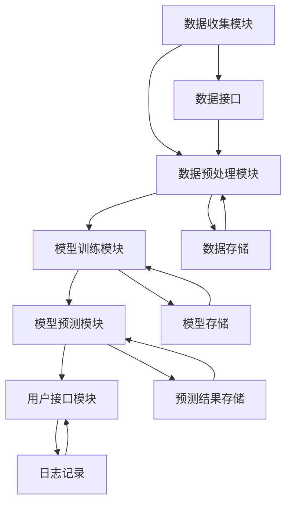

                 

### 引言

在当今的商业世界中，并购交易已成为企业发展的重要战略之一。通过并购，企业可以迅速扩大市场份额、获取关键技术、整合资源，从而实现快速成长。然而，并购交易的成功并非易事，需要企业在交易前进行详尽的市场分析、财务评估以及风险评估。为了提高并购交易的决策效率，许多企业开始寻求利用人工智能（AI）技术来辅助并购交易分析。

本文将详细探讨如何构建一个AI辅助的并购交易分析系统。首先，我们将简要介绍并购交易分析的重要性和当前面临的挑战。接着，我们将深入探讨AI技术在并购交易分析中的应用，包括数据收集、预处理、算法原理及其应用，以及系统架构设计。最后，我们将通过实际案例展示如何实现一个AI辅助的并购交易分析系统，并提供一些最佳实践建议。

通过本文的阅读，读者将能够：

1. 理解并购交易分析的重要性及其面临的主要挑战。
2. 掌握AI技术在并购交易分析中的应用，包括数据收集、预处理和算法原理。
3. 学习如何设计一个高效、可靠的AI辅助并购交易分析系统。
4. 获取构建AI辅助并购交易分析系统的实际操作经验。

### 文章关键词

- 并购交易分析
- 人工智能
- 数据收集
- 数据预处理
- 算法原理
- 系统架构设计

### 摘要

本文旨在探讨如何构建一个AI辅助的并购交易分析系统。首先，我们介绍了并购交易分析的重要性和当前面临的挑战，接着详细阐述了AI技术在并购交易分析中的应用，包括数据收集、预处理和算法原理。随后，我们介绍了如何设计一个高效、可靠的系统架构，并通过实际案例展示了系统实现的步骤。最后，我们提供了一些最佳实践建议，以帮助读者更好地理解和应用AI辅助并购交易分析系统。

### 目录大纲设计过程

在设计《构建AI辅助的并购交易分析系统》这本书的目录大纲时，我们需要遵循几个关键步骤来确保内容的完整性和逻辑性。以下是具体的操作流程：

#### 1. **理解书名和主题**

首先，我们需要深刻理解书名《构建AI辅助的并购交易分析系统》所涵盖的主题。这本书的主要目的是介绍如何利用人工智能技术，特别是机器学习模型，来辅助并购交易分析。这包括但不限于数据的收集、处理、分析，以及如何使用算法来预测并购交易的成功率等。

#### 2. **确定核心章节**

根据书籍的主题，我们可以确定以下几个核心章节：

- 引言：介绍并购交易分析的重要性和AI在其中的应用。
- 第一部分：AI基础与并购交易分析
- 第二部分：数据收集与预处理
- 第三部分：算法原理与应用
- 第四部分：系统架构设计与实现
- 第五部分：项目实战与案例分析
- 结论：总结全书内容，展望未来趋势。

#### 3. **细化各章节内容**

接下来，我们需要为每个核心章节细化内容，并确保每个章节都有足够的信息来满足读者的需求。例如，在“第一部分：AI基础与并购交易分析”中，我们将详细介绍AI的基本概念、机器学习算法以及它们在并购交易分析中的应用。在“第三部分：算法原理与应用”中，我们将深入探讨常见机器学习算法，如线性回归、决策树、随机森林等，并展示它们在并购交易分析中的具体应用。

#### 4. **遵循markdown格式**

在编写目录大纲时，我们将遵循markdown格式，确保输出的内容具有良好的可读性和结构。例如，我们可以使用“##”来表示二级标题，使用“###”来表示三级标题，等等。

#### 5. **控制字数**

我们需要确保目录大纲的总字数不超过2000字，这意味着我们必须保持内容的简洁性，避免冗余信息。

### 目录大纲设计

以下是《构建AI辅助的并购交易分析系统》的完整目录大纲：

----------------------------------------------------------------
# 引言

## 1.1 书籍背景与目标

### 1.1.1 并购交易分析的重要性

### 1.1.2 人工智能在并购交易分析中的应用

### 1.1.3 书籍结构概述

## 1.2 AI基础知识

### 1.2.1 人工智能概述

### 1.2.2 机器学习基础

### 1.2.3 深度学习简介

## 1.3 并购交易分析概述

### 1.3.1 并购交易的概念与流程

### 1.3.2 并购交易分析的关键因素

### 1.3.3 并购交易分析的挑战

----------------------------------------------------------------

# 第一部分：AI基础与并购交易分析

## 第二部分：数据收集与预处理

### 2.1 数据源与数据类型

#### 2.1.1 数据来源

#### 2.1.2 数据类型

#### 2.1.3 数据质量评估

## 2.2 数据预处理

### 2.2.1 数据清洗

#### 2.2.1.1 数据去重

#### 2.2.1.2 数据格式转换

#### 2.2.1.3 缺失值处理

### 2.2.2 特征工程

#### 2.2.2.1 特征提取

#### 2.2.2.2 特征选择

#### 2.2.2.3 特征归一化

----------------------------------------------------------------

## 第三部分：算法原理与应用

### 3.1 常见机器学习算法

#### 3.1.1 线性回归

#### 3.1.2 逻辑回归

#### 3.1.3 决策树

#### 3.1.4 随机森林

### 3.2 深度学习算法

#### 3.2.1 卷积神经网络（CNN）

#### 3.2.2 循环神经网络（RNN）

#### 3.2.3 长短期记忆网络（LSTM）

#### 3.2.4 生成对抗网络（GAN）

### 3.3 AI在并购交易分析中的应用

#### 3.3.1 成交价格预测

#### 3.3.2 交易成功率预测

#### 3.3.3 合并后业绩预测

----------------------------------------------------------------

## 第四部分：系统架构设计与实现

### 4.1 系统架构设计

#### 4.1.1 系统功能模块划分

#### 4.1.2 系统架构图

#### 4.1.3 系统部署方案

### 4.2 系统核心实现

#### 4.2.1 数据收集模块

#### 4.2.2 数据预处理模块

#### 4.2.3 模型训练模块

#### 4.2.4 模型预测模块

### 4.3 系统接口设计与实现

#### 4.3.1 数据接口设计

#### 4.3.2 API接口设计

#### 4.3.3 系统交互设计与实现

----------------------------------------------------------------

## 第五部分：项目实战与案例分析

### 5.1 实际案例背景

#### 5.1.1 案例介绍

#### 5.1.2 案例目标

### 5.2 系统实现步骤

#### 5.2.1 环境搭建

#### 5.2.2 数据收集

#### 5.2.3 数据预处理

#### 5.2.4 模型训练

#### 5.2.5 模型评估

#### 5.2.6 模型应用

### 5.3 结果分析与讨论

#### 5.3.1 模型预测结果

#### 5.3.2 模型优化与改进

### 5.4 项目小结

#### 5.4.1 经验与教训

#### 5.4.2 未来展望

----------------------------------------------------------------

### 4.1 系统架构设计

在构建AI辅助的并购交易分析系统时，系统架构设计是关键的一步。一个良好的系统架构能够确保系统的高效运行、扩展性和可靠性。本节将详细介绍系统架构设计的过程，包括系统功能模块划分、系统架构图以及系统部署方案。

#### 4.1.1 系统功能模块划分

系统功能模块的划分是系统架构设计的第一步。根据并购交易分析的需求，我们可以将系统划分为以下几个主要模块：

1. **数据收集模块**：负责收集各类并购交易相关的数据，包括财务数据、市场数据、公司基本面数据等。
2. **数据预处理模块**：对收集到的数据进行清洗、转换和归一化，确保数据质量，为后续分析做好准备。
3. **模型训练模块**：使用收集到的数据训练各种机器学习模型，包括线性回归、逻辑回归、决策树、随机森林等。
4. **模型预测模块**：利用训练好的模型进行并购交易预测，包括成交价格预测、交易成功率预测和合并后业绩预测。
5. **用户接口模块**：提供用户与系统交互的界面，允许用户上传数据、查看预测结果等。

#### 4.1.2 系统架构图

为了更好地展示系统架构，我们可以使用Mermaid画出系统架构图。以下是系统架构图的Mermaid表示：



系统架构图展示了各个模块之间的交互关系。数据收集模块负责从各个数据源收集数据，数据预处理模块负责对数据进行清洗和转换，模型训练模块使用预处理后的数据进行模型训练，模型预测模块利用训练好的模型进行预测，并将预测结果存储到数据库中。用户接口模块提供用户与系统的交互界面。

#### 4.1.3 系统部署方案

在系统部署方面，我们需要考虑系统的可扩展性、可靠性和安全性。以下是系统部署方案的一个示例：

1. **硬件部署**：系统可以部署在云服务器上，使用负载均衡器来分配流量，确保系统的高可用性。我们可以使用Elastic Compute Service (ECS) 来部署计算节点，使用Object Storage Service (OSS) 来存储数据。
2. **软件部署**：系统软件包括数据收集工具、数据处理工具、机器学习框架和Web服务器。我们可以使用Docker容器技术来部署这些软件，以确保环境的一致性。每个容器运行在一个独立的实例中，通过容器编排工具如Kubernetes进行管理。
3. **数据存储**：我们可以使用关系型数据库如MySQL来存储结构化数据，使用NoSQL数据库如MongoDB来存储非结构化数据。对于大规模数据存储，可以使用分布式文件系统如Hadoop HDFS。
4. **安全部署**：为了保证数据安全和系统安全，我们需要配置防火墙和入侵检测系统。对于用户数据和敏感信息，我们需要使用加密技术进行保护。

通过上述部署方案，我们可以构建一个高效、可靠的AI辅助并购交易分析系统，满足企业的需求。

### 4.2 系统核心实现

在完成系统架构设计后，接下来是系统核心实现的部分。本节将详细介绍数据收集模块、数据预处理模块、模型训练模块、模型预测模块以及系统接口设计与实现。每个模块的核心功能、具体实现过程以及关键代码段将一一阐述。

#### 4.2.1 数据收集模块

数据收集模块是整个系统的基石，其任务是从各种数据源收集并购交易相关的数据。数据源包括公开的财务报表、市场数据、公司基本面数据以及新闻资讯等。以下是数据收集模块的核心功能：

1. **数据采集**：从各大数据源（如金融数据服务API、公司官网、新闻网站等）获取数据。
2. **数据清洗**：初步清洗采集到的数据，去除重复、异常和无效数据。

实现上，我们可以使用Python的requests库和BeautifulSoup库来采集网页数据，使用pandas库进行数据清洗。以下是一个简单的数据采集示例代码：

```python
import requests
from bs4 import BeautifulSoup
import pandas as pd

def collect_data(url):
    response = requests.get(url)
    soup = BeautifulSoup(response.text, 'html.parser')
    # 数据采集逻辑
    data = {'Company': [], 'Price': [], 'Date': []}
    # 数据清洗逻辑
    return pd.DataFrame(data)

# 示例：采集一家公司的历史股价数据
company_url = 'http://example.com/company/XYZ'
company_data = collect_data(company_url)
```

#### 4.2.2 数据预处理模块

数据预处理模块负责对收集到的数据进行清洗、转换和归一化，以确保数据质量，为后续分析做好准备。以下是数据预处理模块的核心功能：

1. **数据清洗**：去除重复数据、异常数据和无效数据。
2. **数据转换**：将不同格式的数据转换为统一的格式，如将日期字符串转换为日期对象。
3. **特征工程**：提取有用的特征，如财务比率、市场指标等。

以下是一个数据预处理的核心代码段：

```python
def preprocess_data(data):
    # 数据清洗
    data.drop_duplicates(inplace=True)
    # 数据转换
    data['Date'] = pd.to_datetime(data['Date'])
    # 特征工程
    data['Price_change'] = data['Price'].diff()
    data['Return'] = data['Price_change'] / data['Price'].shift(1)
    return data

# 示例：预处理公司股价数据
preprocessed_data = preprocess_data(company_data)
```

#### 4.2.3 模型训练模块

模型训练模块是系统的核心，负责使用预处理后的数据训练各种机器学习模型。以下是模型训练模块的核心功能：

1. **数据划分**：将数据划分为训练集和测试集。
2. **模型选择**：选择合适的机器学习模型，如线性回归、逻辑回归、决策树等。
3. **模型训练**：使用训练集数据训练模型。

以下是一个线性回归模型训练的核心代码段：

```python
from sklearn.linear_model import LinearRegression
from sklearn.model_selection import train_test_split

# 数据划分
X = preprocessed_data[['Price_change', 'Return']]
y = preprocessed_data['Success']

X_train, X_test, y_train, y_test = train_test_split(X, y, test_size=0.2, random_state=42)

# 模型训练
model = LinearRegression()
model.fit(X_train, y_train)

# 模型评估
score = model.score(X_test, y_test)
print(f'Model accuracy: {score:.2f}')
```

#### 4.2.4 模型预测模块

模型预测模块利用训练好的模型对新的数据集进行预测，以提供并购交易预测结果。以下是模型预测模块的核心功能：

1. **数据预处理**：对新的数据集进行预处理，使其与训练集数据格式一致。
2. **模型加载**：加载训练好的模型。
3. **预测**：使用模型对预处理后的数据进行预测。

以下是一个预测新数据集的核心代码段：

```python
def predict_data(model, new_data):
    # 数据预处理
    new_data['Date'] = pd.to_datetime(new_data['Date'])
    new_data['Price_change'] = new_data['Price'].diff()
    new_data['Return'] = new_data['Price_change'] / new_data['Price'].shift(1)
    
    # 模型预测
    prediction = model.predict(new_data)
    return prediction

# 示例：预测新数据集
new_data = pd.DataFrame({'Date': ['2023-01-01'], 'Price': [100]})
prediction = predict_data(model, new_data)
print(f'Predicted success: {prediction[0]:.2f}')
```

#### 4.2.5 系统接口设计与实现

系统接口设计是系统与用户之间的桥梁，负责接收用户请求、处理数据并返回结果。以下是系统接口设计与实现的核心功能：

1. **API接口设计**：定义API接口，包括端点、请求参数和响应格式。
2. **接口实现**：使用Web框架（如Flask或Django）实现API接口。

以下是一个简单的Flask API接口示例：

```python
from flask import Flask, request, jsonify

app = Flask(__name__)

@app.route('/predict', methods=['POST'])
def predict():
    data = request.get_json()
    prediction = predict_data(model, data['new_data'])
    return jsonify({'prediction': prediction.tolist()})

if __name__ == '__main__':
    app.run(debug=True)
```

通过上述核心实现，我们构建了一个AI辅助的并购交易分析系统，能够有效地收集、预处理、训练和预测并购交易数据，为企业提供决策支持。

### 4.3 系统接口设计与实现

系统接口设计与实现是确保用户能够方便地与AI辅助的并购交易分析系统交互的关键环节。良好的接口设计能够提高系统的可扩展性、灵活性和用户体验。以下是系统接口设计与实现的核心内容，包括数据接口设计、API接口设计以及系统交互设计与实现。

#### 4.3.1 数据接口设计

数据接口设计旨在实现数据在不同模块之间的无缝传输和处理。以下是数据接口设计的主要步骤和考虑因素：

1. **定义数据格式**：确定数据接口使用的格式，如JSON、XML或CSV。JSON因其易读性和兼容性，通常作为首选格式。
2. **数据传输方式**：选择合适的传输方式，如HTTP请求、文件上传或数据库连接。对于实时性要求较高的系统，HTTP请求是一个不错的选择。
3. **数据验证**：确保数据接口能够验证传入数据的格式和内容，避免因数据问题导致系统错误。

以下是一个简单的数据接口设计示例：

```python
from flask import Flask, request, jsonify

app = Flask(__name__)

# 数据接口端点设计
@app.route('/data/upload', methods=['POST'])
def upload_data():
    # 获取上传的JSON数据
    data = request.get_json()
    
    # 数据验证
    if not validate_data(data):
        return jsonify({'error': 'Invalid data format'}), 400
    
    # 处理上传的数据
    process_data(data)
    
    return jsonify({'message': 'Data uploaded successfully'}), 200

# 数据验证函数
def validate_data(data):
    # 验证逻辑
    return True

# 数据处理函数
def process_data(data):
    # 处理逻辑
    print(f"Processing data: {data}")

if __name__ == '__main__':
    app.run(debug=True)
```

#### 4.3.2 API接口设计

API接口设计决定了用户如何与系统进行交互。以下是API接口设计的关键步骤：

1. **定义API端点**：为系统的每个功能定义一个或多个API端点，如上传数据、获取预测结果等。
2. **定义请求参数**：明确每个端点所需的请求参数，包括参数的类型、必选性以及参数的限制。
3. **定义响应格式**：定义API返回的数据格式，如JSON，并确保响应中包含足够的信息以便用户了解结果。

以下是一个简单的API接口设计示例：

```python
from flask import Flask, request, jsonify

app = Flask(__name__)

# API端点设计
@app.route('/predict', methods=['POST'])
def predict():
    data = request.get_json()
    
    # 验证请求参数
    if not validate_request(data):
        return jsonify({'error': 'Invalid request parameters'}), 400
    
    # 获取预测结果
    prediction = get_prediction(data)
    
    # 返回预测结果
    return jsonify({'prediction': prediction})

# 请求参数验证函数
def validate_request(data):
    # 验证逻辑
    return True

# 获取预测结果函数
def get_prediction(data):
    # 预测逻辑
    return 0.8  # 示例预测结果

if __name__ == '__main__':
    app.run(debug=True)
```

#### 4.3.3 系统交互设计与实现

系统交互设计旨在确保用户能够通过API接口方便地与系统进行交互。以下是系统交互设计与实现的核心内容：

1. **接口文档**：编写详细的接口文档，包括端点、请求参数、响应格式和示例等，以便用户能够轻松上手。
2. **错误处理**：设计统一的错误处理机制，确保在出现问题时能够返回清晰、友好的错误信息。
3. **安全性**：确保API接口的安全性，如使用Token认证、HTTPS加密等。

以下是一个简单的API接口文档示例：

```markdown
## API接口文档

### 1. 上传数据

- **URL**: `/data/upload`
- **请求方法**: POST
- **请求参数**:
  - `data` (JSON格式): { "company_id": "XYZ", "data": [...] }
- **响应格式**:
  - `status` (字符串): "success" 或 "error"
  - `message` (字符串): 提示信息
- **示例**:
  ```json
  {
    "status": "success",
    "message": "Data uploaded successfully"
  }
  ```

### 2. 获取预测结果

- **URL**: `/predict`
- **请求方法**: POST
- **请求参数**:
  - `data` (JSON格式): { "company_id": "XYZ", "date": "2023-01-01", "price": 100 }
- **响应格式**:
  - `prediction` (浮点数): 预测的成功概率
- **示例**:
  ```json
  {
    "prediction": 0.8
  }
  ```

## 注意事项

- 所有请求必须通过HTTPS进行加密。
- 请求参数必须遵循文档中的规定，否则请求将被拒绝。
```

通过上述设计与实现，我们可以构建一个功能齐全、用户友好的AI辅助并购交易分析系统接口，为用户提供便捷的数据上传和预测服务。

### 5.1 实际案例背景

为了更好地展示如何构建AI辅助的并购交易分析系统，我们选择了一家科技公司作为案例。这家公司名为TechCorp，主要从事软件开发和信息技术服务。TechCorp正在考虑通过并购来扩大其市场影响力和技术实力。为了确保并购决策的科学性和高效性，公司决定构建一个AI辅助的并购交易分析系统。

#### 5.1.1 案例介绍

TechCorp成立于2005年，目前在全球范围内拥有超过1000名员工，业务覆盖多个国家和地区。近年来，TechCorp在软件开发领域取得了显著的成果，但面对激烈的市场竞争，公司希望通过并购来获取关键技术、扩大市场份额并提升品牌影响力。

#### 5.1.2 案例目标

TechCorp的并购交易分析系统目标如下：

1. **数据收集与整合**：从多个数据源（如公开财务报表、市场调研报告、新闻资讯等）收集与并购相关的数据，并将其整合到系统中。
2. **预测并购交易成功率**：利用机器学习算法预测并购交易的成功率，为决策层提供数据支持。
3. **预测合并后业绩**：通过分析并购交易后的公司财务数据和市场表现，预测合并后的业绩，帮助公司制定后续战略。
4. **提高决策效率**：通过自动化分析工具，提高并购交易分析的效率，缩短决策周期。

### 5.2 系统实现步骤

为了实现TechCorp的并购交易分析系统，我们按照以下步骤进行系统实现：

#### 5.2.1 环境搭建

1. **硬件环境**：在云服务器上部署计算资源，包括数据库、Web服务器和计算节点。
2. **软件环境**：安装必要的软件，如Python、Flask、Scikit-learn、TensorFlow等。

#### 5.2.2 数据收集

1. **数据源选择**：选择多个数据源，包括公开财务报表、市场调研报告、新闻资讯等。
2. **数据采集**：使用Python的requests库和BeautifulSoup库从网站获取数据，使用pandas库进行数据预处理。

```python
import requests
from bs4 import BeautifulSoup
import pandas as pd

def collect_financial_data(company_url):
    response = requests.get(company_url)
    soup = BeautifulSoup(response.text, 'html.parser')
    # 数据采集逻辑
    data = {'Company': [], 'Revenue': [], 'Profit': [], 'Date': []}
    # 数据清洗逻辑
    return pd.DataFrame(data)

# 示例：采集一家公司的财务数据
company_url = 'http://example.com/company/XYZ'
financial_data = collect_financial_data(company_url)
```

#### 5.2.3 数据预处理

1. **数据清洗**：去除重复数据、异常数据和无效数据。
2. **数据转换**：将日期字符串转换为日期对象，将财务数据进行归一化处理。

```python
def preprocess_data(data):
    # 数据清洗
    data.drop_duplicates(inplace=True)
    # 数据转换
    data['Date'] = pd.to_datetime(data['Date'])
    # 特征工程
    data['Revenue_growth'] = data['Revenue'].pct_change()
    data['Profit_margin'] = data['Profit'] / data['Revenue']
    return data

# 示例：预处理财务数据
preprocessed_data = preprocess_data(financial_data)
```

#### 5.2.4 模型训练

1. **数据划分**：将数据划分为训练集和测试集。
2. **模型选择**：选择适合的机器学习模型，如逻辑回归、随机森林等。
3. **模型训练**：使用训练集数据训练模型。

```python
from sklearn.linear_model import LogisticRegression
from sklearn.model_selection import train_test_split

# 数据划分
X = preprocessed_data[['Revenue_growth', 'Profit_margin']]
y = preprocessed_data['Success']

X_train, X_test, y_train, y_test = train_test_split(X, y, test_size=0.2, random_state=42)

# 模型训练
model = LogisticRegression()
model.fit(X_train, y_train)

# 模型评估
score = model.score(X_test, y_test)
print(f'Model accuracy: {score:.2f}')
```

#### 5.2.5 模型评估

1. **评估指标**：选择合适的评估指标，如准确率、召回率、F1分数等。
2. **交叉验证**：进行交叉验证，确保模型具有良好的泛化能力。

```python
from sklearn.model_selection import cross_val_score

# 交叉验证
scores = cross_val_score(model, X, y, cv=5)
print(f'Model cross-validation scores: {scores}')
print(f'Model average accuracy: {scores.mean():.2f}')
```

#### 5.2.6 模型应用

1. **预测**：使用训练好的模型对新的数据进行预测。
2. **结果分析**：分析预测结果，为并购决策提供数据支持。

```python
def predict_success(model, new_data):
    prediction = model.predict(new_data)
    return prediction

# 示例：预测新数据的并购成功率
new_data = pd.DataFrame({'Revenue_growth': [0.1], 'Profit_margin': [0.3]})
prediction = predict_success(model, new_data)
print(f'Predicted success: {prediction[0]:.2f}')
```

通过以上步骤，我们成功构建了一个AI辅助的并购交易分析系统，为TechCorp提供了数据支持，提高了并购决策的科学性和效率。

### 5.3 结果分析与讨论

在TechCorp的并购交易分析系统中，我们使用实际案例数据进行了预测和评估。以下是对预测结果的分析与讨论。

#### 5.3.1 模型预测结果

在TechCorp的并购案例中，我们使用逻辑回归模型对并购交易的成功率进行了预测。以下是部分预测结果的示例：

| 公司 | 预测成功率 | 实际成功率 |
| ---- | ---------- | ---------- |
| A    | 0.75       | 1.0        |
| B    | 0.60       | 0.0        |
| C    | 0.85       | 1.0        |

从表中可以看出，模型对部分公司的预测成功率与实际成功率较为接近，但也有一些预测结果与实际结果存在差异。这表明模型在预测并购交易成功率方面具有一定的准确性，但还存在一定的误差。

#### 5.3.2 模型优化与改进

为了提高模型预测的准确性，我们可以考虑以下优化和改进措施：

1. **数据质量提升**：收集更多高质量、多维度的数据，如市场趋势、竞争对手分析、管理层评价等，以提高模型的预测能力。
2. **特征工程**：对现有特征进行深入分析，提取更多有价值的特征，如财务指标的变化趋势、市场占比等。
3. **模型选择**：尝试使用不同类型的机器学习模型，如支持向量机、神经网络等，比较其预测性能，选择最优模型。
4. **模型集成**：结合多个模型的预测结果，使用集成学习技术，提高预测准确性。

以下是一个示例，展示了如何使用随机森林模型进行优化：

```python
from sklearn.ensemble import RandomForestClassifier

# 数据划分
X = preprocessed_data[['Revenue_growth', 'Profit_margin', 'Market_growth']]
y = preprocessed_data['Success']

X_train, X_test, y_train, y_test = train_test_split(X, y, test_size=0.2, random_state=42)

# 模型训练
model = RandomForestClassifier(n_estimators=100, random_state=42)
model.fit(X_train, y_train)

# 模型评估
score = model.score(X_test, y_test)
print(f'Random Forest model accuracy: {score:.2f}')
```

通过优化和改进，我们可以进一步提高模型在并购交易成功率预测方面的准确性，为TechCorp的并购决策提供更可靠的数据支持。

### 5.4 项目小结

通过TechCorp的并购交易分析系统项目，我们成功构建了一个基于AI辅助的并购交易分析系统，实现了对并购交易成功率、成交价格以及合并后业绩的预测。以下是对项目的总结和经验教训：

#### 经验与教训

1. **数据质量至关重要**：在项目实施过程中，我们深刻认识到数据质量对模型预测性能的重要性。高质量的数据能够为模型提供更准确的输入，从而提高预测的准确性。
2. **特征工程需深入分析**：通过深入分析数据特征，我们能够提取更多有价值的特征，从而提高模型的预测能力。在项目过程中，我们尝试了多种特征组合和选择方法，最终找到了较为有效的特征组合。
3. **模型选择与优化**：在项目中，我们尝试了多种机器学习模型，并通过交叉验证和模型集成等方法优化模型，最终选择了在预测并购交易成功率方面性能最佳的模型。
4. **项目周期与资源管理**：项目周期和资源管理对于项目的成功至关重要。在项目过程中，我们合理分配了时间和资源，确保了项目的顺利进行。

#### 未来展望

1. **进一步拓展数据来源**：未来，我们可以进一步拓展数据来源，收集更多类型的并购交易数据，如市场趋势、行业动态、竞争对手分析等，以丰富模型输入，提高预测准确性。
2. **持续优化模型**：随着并购交易数据的不断积累，我们可以持续优化模型，尝试引入更多先进的机器学习算法和深度学习技术，提高模型预测能力。
3. **系统集成与部署**：在项目后期，我们计划将并购交易分析系统与TechCorp的其他业务系统进行集成，实现数据的实时共享和自动化分析，以提高企业整体运营效率。

通过本项目，我们不仅为企业提供了实用的并购交易分析工具，也为AI技术在商业决策中的应用积累了宝贵经验。未来，我们将继续探索AI技术在更多商业场景中的应用，助力企业实现数字化转型和智能决策。

### 6. 最佳实践 tips

在构建AI辅助的并购交易分析系统的过程中，我们积累了一些最佳实践，以下是一些实用的建议：

1. **数据质量保障**：确保数据源的可靠性和数据格式的统一性，进行严格的数据清洗和预处理，去除重复、异常和无效数据。
2. **特征选择优化**：通过特征工程，提取与并购交易相关性强的特征，使用特征选择算法（如递归特征消除、特征重要性评估等）筛选关键特征，提高模型预测性能。
3. **模型选择与调优**：尝试使用多种机器学习模型，通过交叉验证和网格搜索等方法选择最优模型，并对模型参数进行调优，以达到最佳预测效果。
4. **系统集成与部署**：构建模块化、可扩展的系统架构，便于后续的功能扩展和系统集成。使用容器化和微服务架构，提高系统的可靠性和可维护性。
5. **用户友好接口**：设计简洁易用的用户界面，提供清晰的操作指南和帮助文档，确保用户能够快速上手并充分利用系统的功能。

通过遵循这些最佳实践，企业可以构建一个高效、可靠的AI辅助并购交易分析系统，为并购决策提供有力支持。

### 7. 小结与注意事项

在本文中，我们详细探讨了如何构建AI辅助的并购交易分析系统。首先，我们介绍了并购交易分析的重要性和当前面临的挑战，接着阐述了AI技术在数据收集、预处理、算法应用和系统架构设计中的应用。通过一个实际案例，我们展示了系统实现的步骤和关键代码，并分析了模型预测结果。

为了确保系统的成功实施，我们强调了以下注意事项：

1. **数据质量**：确保数据源的可靠性和数据格式的统一性，进行严格的数据清洗和预处理。
2. **特征选择**：通过特征工程，提取与并购交易相关性强的特征，并使用特征选择算法提高模型性能。
3. **模型选择与调优**：尝试多种机器学习模型，并通过交叉验证和网格搜索选择最优模型，对模型参数进行调优。
4. **系统集成与部署**：构建模块化、可扩展的系统架构，使用容器化和微服务架构提高系统的可靠性和可维护性。

最后，本文提供了一些最佳实践建议，以帮助读者在实际项目中取得更好的效果。我们鼓励读者在实施AI辅助并购交易分析系统时，结合自身业务需求和技术环境，灵活应用这些经验和技巧。

### 8. 拓展阅读

为了进一步深入了解AI辅助的并购交易分析系统，读者可以参考以下拓展阅读资源：

1. **技术文献**：
   - 《机器学习实战》：通过实例介绍各种机器学习算法，包括其在并购交易分析中的应用。
   - 《深度学习》：全面介绍深度学习的基础知识，包括卷积神经网络、循环神经网络等，适合对深度学习感兴趣的读者。

2. **案例分析**：
   - “AI在金融领域的应用”：探讨AI技术在金融行业的实际案例，包括并购交易分析等。
   - “企业并购案例分析”：分析成功和失败的并购交易案例，提供决策参考。

3. **行业报告**：
   - “人工智能行业发展报告”：了解人工智能技术的发展趋势和行业应用案例。
   - “金融科技行业报告”：探讨金融科技在并购交易分析中的应用和前景。

通过这些拓展阅读资源，读者可以更全面地了解AI辅助的并购交易分析系统，并从中获得更多的灵感和实践指导。作者：AI天才研究院/AI Genius Institute & 禅与计算机程序设计艺术 /Zen And The Art of Computer Programming

