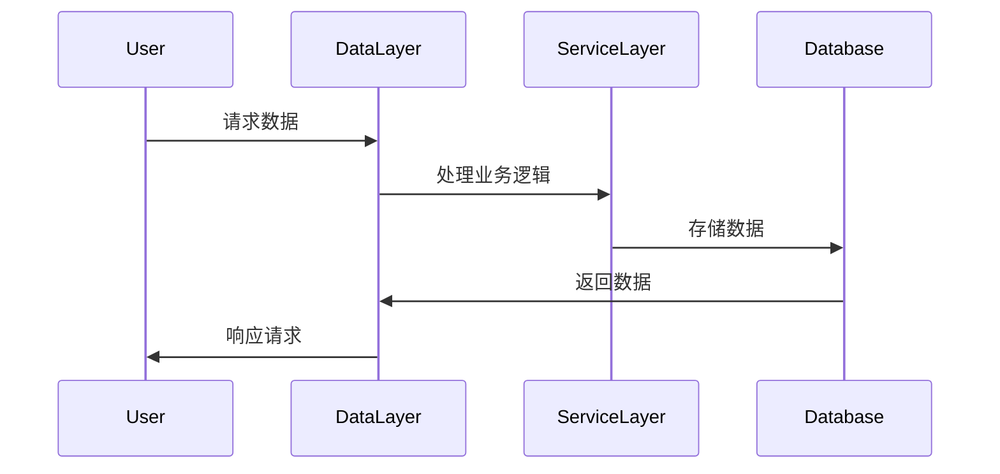
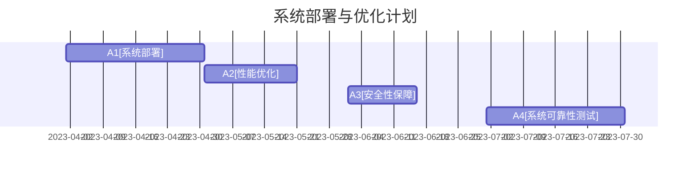
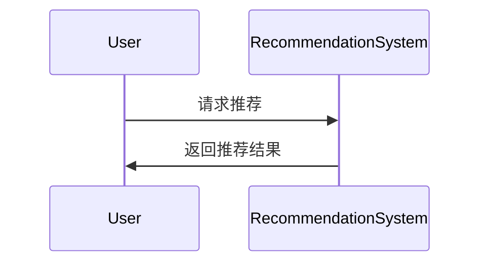
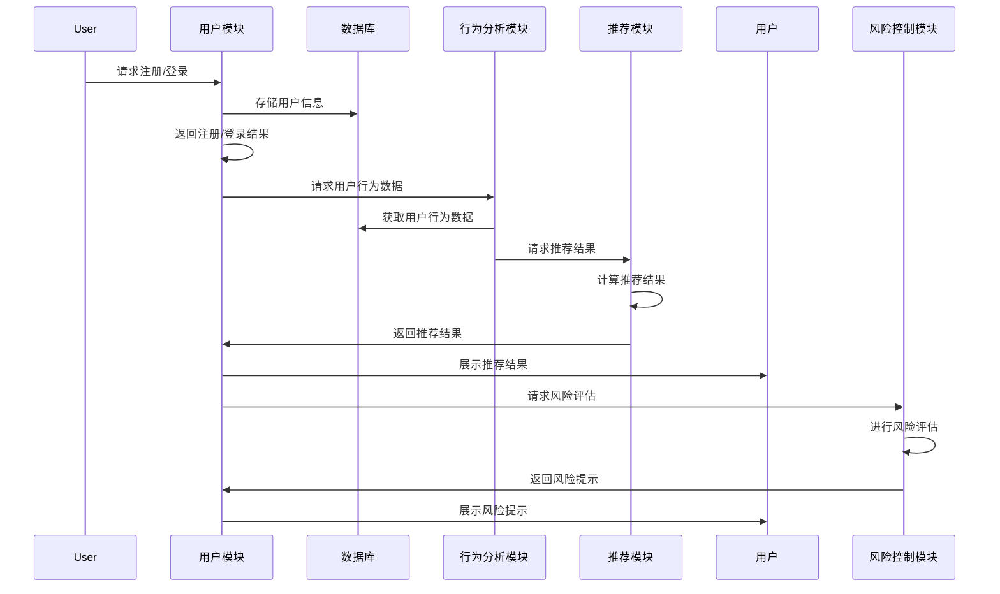
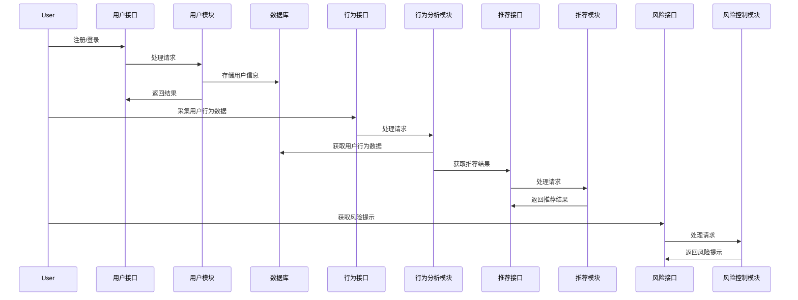

                 

# 构建AI辅助的金融产品设计系统

## 关键词

- AI辅助
- 金融产品设计
- 系统架构
- 机器学习
- 数据分析
- 用户需求调研

## 摘要

本文旨在探讨如何构建AI辅助的金融产品设计系统，通过分析金融产品设计的需求、技术基础和实现流程，提供了一套完整的解决方案。文章从背景介绍、技术基础、设计流程、系统实现、案例研究和未来展望六个部分展开，深入分析了AI在金融产品设计中的应用，为金融行业的创新发展提供了新的思路和方向。

## 引言

金融产品设计的本质是为用户提供满足其需求的产品，而AI技术的快速发展为金融产品设计带来了全新的机遇和挑战。AI技术能够通过对海量数据的分析，发现用户需求和行为模式，从而提高金融产品的设计效率和质量。本文将围绕如何构建AI辅助的金融产品设计系统，进行深入探讨。

### 1. 金融产品设计的背景

金融产品设计的背景可以追溯到金融市场的发展历程。随着金融市场的不断成熟和多样化，金融产品也日益丰富。从最初的存款、贷款到复杂的金融衍生品，金融产品的设计不断推陈出新。在这个过程中，金融产品设计的原则也在逐步完善，包括需求导向、风险控制、合规性等。

### 1.1 金融产品的发展历程

金融产品的发展历程可以大致分为以下几个阶段：

- **传统金融产品阶段**：以存款、贷款、基金等为主，产品设计相对简单。
- **创新金融产品阶段**：互联网金融、金融科技（Fintech）的兴起，带来了诸如P2P借贷、区块链金融等创新产品。
- **智能化金融产品阶段**：AI技术的应用使得金融产品设计更加智能化，能够更好地满足用户需求。

### 1.2 金融产品的设计原则

金融产品的设计原则主要包括以下几点：

- **需求导向**：以用户需求为核心，进行产品设计。
- **风险控制**：在产品设计过程中，充分考虑风险因素，确保金融产品的安全性。
- **合规性**：遵循相关法律法规，确保金融产品的合法性。

### 1.3 金融市场的发展趋势

金融市场的发展趋势主要体现在以下几个方面：

- **数字化转型**：金融业务的数字化转型已成为不可逆转的趋势，AI技术在这一过程中发挥着重要作用。
- **智能化升级**：金融产品的智能化升级，将进一步提升用户体验和产品设计效率。
- **跨界融合**：金融与其他行业的跨界融合，将带来更多创新性的金融产品。

## AI技术在金融领域的应用

AI技术在金融领域的应用已经非常广泛，主要包括金融分析、风险管理和客户服务等方面。

### 2.1 AI技术在金融分析中的应用

AI技术在金融分析中的应用主要体现在以下几个方面：

- **市场预测**：利用AI技术，可以更加准确地预测市场走势，为投资决策提供支持。
- **信用评估**：通过机器学习算法，可以对客户的信用情况进行评估，提高贷款审批的准确性。
- **投资组合优化**：AI技术可以帮助投资者优化投资组合，降低投资风险。

### 2.2 AI技术在风险管理中的应用

AI技术在风险管理中的应用主要包括：

- **风险识别**：通过分析历史数据，AI技术可以识别潜在的风险因素。
- **风险预测**：基于大数据分析，AI技术可以预测未来的风险趋势。
- **风险控制**：通过实时监控和调整，AI技术可以有效地控制风险。

### 2.3 AI技术在客户服务中的应用

AI技术在客户服务中的应用主要体现在：

- **智能客服**：通过自然语言处理技术，AI可以提供高效的客户服务，提高客户满意度。
- **个性化推荐**：基于用户行为数据，AI技术可以提供个性化的产品推荐，提升用户粘性。
- **用户体验优化**：AI技术可以帮助优化用户界面设计，提升用户体验。

### 2.4 AI辅助金融产品设计的重要性

AI辅助金融产品设计的重要性主要体现在以下几个方面：

- **提高产品设计效率**：AI技术可以帮助快速分析大量数据，提高设计效率。
- **增强产品设计创新能力**：AI技术可以提供新的设计思路，提升产品创新性。
- **提升金融产品的竞争力**：通过AI辅助设计，可以提供更符合用户需求的产品，提升市场竞争力。

### 2.5 AI辅助金融产品设计的应用场景

AI辅助金融产品设计可以应用于多个场景，包括：

- **银行产品设计**：如信用卡、储蓄产品等。
- **保险产品设计**：如保险产品个性化推荐、风险评估等。
- **投资产品设计**：如基金、股票等产品推荐和组合优化等。
- **金融科技产品**：如区块链金融产品、智能投顾等。

### 2.6 AI辅助金融产品设计的挑战

尽管AI辅助金融产品设计具有巨大的潜力，但在实际应用中也面临一些挑战：

- **数据隐私与安全**：在数据采集和处理过程中，需要确保数据的安全和隐私。
- **法律法规合规**：AI辅助金融产品设计需要遵守相关法律法规，确保产品的合规性。
- **技术成熟度**：部分AI技术尚不成熟，需要持续研究和优化。
- **用户接受度**：用户对AI辅助金融产品的接受度需要提高。

### 2.7 AI辅助金融产品设计的未来发展趋势

随着AI技术的不断发展和成熟，未来AI辅助金融产品设计将呈现以下发展趋势：

- **深度学习技术的应用**：深度学习技术将在金融产品设计中获得更广泛的应用。
- **区块链技术的融合**：区块链技术将与AI技术相结合，推动金融产品设计的创新。
- **跨界合作**：金融行业将与更多行业进行跨界合作，共同推动金融产品设计的创新。

## AI辅助金融产品设计系统的基础技术

要构建AI辅助的金融产品设计系统，需要掌握一系列基础技术，包括数据采集与处理、机器学习算法、自然语言处理等。

### 3.1 数据采集与处理

数据采集与处理是AI辅助金融产品设计系统的基础。金融数据来源广泛，包括内部数据（如交易记录、客户信息）和外部数据（如市场数据、新闻报道）。数据采集工具主要包括数据爬虫、API接口等。在数据预处理阶段，需要对数据进行清洗、去重、格式转换等操作，以保证数据的质量和一致性。

### 3.2 机器学习算法在金融产品设计中的应用

机器学习算法在金融产品设计中的应用非常广泛，主要包括：

- **监督学习算法**：如线性回归、逻辑回归等，用于预测市场走势、信用评估等。
- **无监督学习算法**：如聚类分析、降维技术等，用于用户行为分析、风险识别等。
- **强化学习算法**：如Q学习、深度强化学习等，用于投资组合优化、风险控制等。

### 3.3 自然语言处理在金融产品设计中的应用

自然语言处理技术在金融产品设计中的应用主要包括：

- **文本分析**：如情感分析、主题模型等，用于分析市场情绪、新闻热点等。
- **情感分析**：用于分析用户对金融产品的评价、反馈等。
- **命名实体识别**：用于提取文本中的关键信息，如公司名称、金融产品名称等。

### 3.4 数据挖掘技术在金融产品设计中的应用

数据挖掘技术在金融产品设计中的应用主要包括：

- **关联规则挖掘**：用于发现金融产品之间的关联关系，为产品组合设计提供参考。
- **分类与聚类**：用于用户行为分析、客户细分等，为产品定制提供依据。
- **时间序列分析**：用于预测市场走势、资金流动等。

### 3.5 AI技术在金融产品设计中的挑战

在AI技术在金融产品设计中的应用过程中，面临以下挑战：

- **数据质量**：数据质量直接影响模型的性能，需要确保数据的质量和一致性。
- **算法稳定性**：算法在不同数据集上的表现可能存在较大差异，需要确保算法的稳定性。
- **模型解释性**：金融产品设计需要具备较高的解释性，以便用户理解和信任。

### 3.6 AI技术在金融产品设计中的最佳实践

为了充分发挥AI技术在金融产品设计中的作用，以下是一些最佳实践：

- **数据驱动的产品设计**：基于用户行为数据，进行产品设计和优化。
- **持续学习与迭代**：根据用户反馈和业务需求，不断优化和更新模型。
- **跨界合作**：与不同行业的专家合作，共同推动金融产品设计的创新。

## AI辅助金融产品设计系统的流程与方法

构建AI辅助的金融产品设计系统，需要遵循一系列流程和方法，包括需求分析、设计思维、原型设计等。

### 4.1 需求分析

需求分析是金融产品设计系统的第一步，主要包括以下内容：

- **用户需求调研**：通过问卷调查、用户访谈等方式，收集用户对金融产品的需求和期望。
- **需求文档编写**：将用户需求转化为具体的需求文档，包括功能需求、非功能需求等。
- **需求优先级排序**：根据用户需求的重要性和紧急性，对需求进行优先级排序。

### 4.2 设计思维

设计思维是一种以用户为中心的思考方式，包括以下步骤：

- **同理心**：了解用户的需求、痛点和行为模式。
- **定义问题**：明确需要解决的问题和目标。
- **创意生成**：提出各种可能的解决方案。
- **原型设计**：制作原型，进行测试和迭代。
- **测试与验证**：验证原型是否符合用户需求和期望。

### 4.3 原型设计

原型设计是金融产品设计系统的重要环节，包括以下内容：

- **原型设计工具**：如Axure、Figma等，用于制作原型。
- **原型设计流程**：包括需求分析、原型制作、测试和迭代等环节。
- **原型设计的迭代与优化**：根据用户反馈和测试结果，不断优化原型。

### 4.4 用户体验设计

用户体验设计是金融产品设计系统的重要组成部分，包括以下内容：

- **用户界面设计**：设计直观、易用的用户界面，提升用户体验。
- **交互设计**：设计流畅、自然的用户交互流程，提高用户满意度。
- **可用性测试**：通过实际用户测试，验证用户界面的可用性和易用性。

### 4.5 需求分析与设计思维在实际应用中的案例分析

在实际应用中，需求分析和设计思维可以帮助金融产品设计团队更好地理解用户需求，提出创新性的解决方案。以下是一个案例：

- **案例背景**：某银行希望推出一款针对年轻客户的金融产品。
- **需求分析**：通过问卷调查和用户访谈，发现年轻客户对金融产品的需求主要包括：低门槛、高收益、灵活性强。
- **设计思维**：提出以下解决方案：推出低门槛、高收益的理财产品，提供灵活的存取款方式。
- **原型设计**：制作原型，进行测试和迭代，最终推出符合用户需求的产品。

### 4.6 用户体验设计在实际应用中的案例分析

用户体验设计在金融产品设计系统中起着至关重要的作用。以下是一个案例：

- **案例背景**：某金融科技公司推出了一款在线投资平台。
- **用户体验设计**：设计团队进行了用户调研和访谈，发现用户对平台的操作流程和界面设计存在疑惑。
- **改进措施**：设计团队优化了用户界面，简化了操作流程，提高了用户的满意度。
- **效果评估**：通过可用性测试，发现用户对平台的操作更加流畅，满意度显著提升。

## AI辅助金融产品设计系统的实现

实现AI辅助的金融产品设计系统，需要设计合理的系统架构，并实现核心功能。以下是系统架构设计、核心功能实现和系统部署与优化等方面的内容。

### 5.1 系统架构设计

AI辅助金融产品设计系统的架构设计主要包括以下层次：

- **数据层**：负责数据的采集、存储和管理。
- **服务层**：负责业务逻辑的处理和系统的核心功能实现。
- **表示层**：负责用户界面的设计和展示。

系统架构图如下所示：



### 5.2 核心功能实现

AI辅助金融产品设计系统的核心功能主要包括：

- **数据采集与处理**：通过爬虫、API接口等方式，采集金融数据，并进行预处理。
- **机器学习模型训练**：利用机器学习算法，对金融数据进行训练，构建预测模型。
- **产品推荐与优化**：根据用户行为数据，进行产品推荐和优化。
- **用户反馈与评估**：收集用户反馈，评估系统性能和用户体验。

以下是系统核心功能的实现流程：


### 5.3 系统部署与优化

系统部署与优化主要包括以下几个方面：

- **系统部署策略**：根据业务需求和系统规模，选择合适的部署策略，如集群部署、云部署等。
- **系统性能优化**：通过缓存、数据库优化等技术，提高系统性能。
- **系统安全性与可靠性保障**：采用加密、权限控制等技术，确保系统安全性和可靠性。

以下是系统部署与优化的具体措施：



### 5.4 AI辅助金融产品设计系统的实现案例

以下是AI辅助金融产品设计系统的实现案例：

- **案例背景**：某金融科技公司希望构建一款智能投顾系统，为用户提供个性化的投资建议。
- **系统需求分析**：根据用户需求和业务目标，确定系统的功能需求，如用户注册、登录、投资建议等。
- **系统设计**：设计系统架构，包括数据层、服务层和表示层，并绘制架构图。
- **系统实现**：根据设计文档，实现系统的核心功能，如数据采集与处理、机器学习模型训练、产品推荐与优化等。
- **系统测试与优化**：对系统进行测试和优化，确保系统性能、安全性和可靠性。

### 5.5 AI辅助金融产品设计系统的部署与优化案例

以下是AI辅助金融产品设计系统的部署与优化案例：

- **案例背景**：某银行希望构建一款面向客户的智能理财产品推荐系统。
- **系统部署策略**：采用云部署策略，确保系统的高可用性和可扩展性。
- **系统性能优化**：通过数据库优化、缓存技术等，提高系统性能。
- **系统安全性与可靠性保障**：采用加密技术、权限控制等手段，确保系统安全性和可靠性。
- **系统部署与优化效果**：系统上线后，用户满意度显著提升，系统性能稳定。

## AI辅助金融产品设计案例研究

在本节中，我们将通过两个具体的案例，深入探讨AI辅助的金融产品设计过程，并分析其成功的关键因素。

### 6.1 案例一：智能投顾系统的设计与实现

**6.1.1 案例背景**

智能投顾（Robo-Advisor）是近年来金融科技领域的一大热点。智能投顾系统能够根据用户的财务状况、风险偏好和投资目标，提供个性化的投资建议。本案例的目标是设计和实现一个智能投顾系统，帮助用户进行资产配置和投资决策。

**6.1.2 系统需求分析**

在系统需求分析阶段，我们进行了详细的用户调研，收集了以下需求：

- **用户注册与登录**：用户能够方便地注册和登录系统。
- **风险偏好评估**：系统应能够评估用户的风险偏好，以便进行个性化的投资建议。
- **资产配置建议**：根据用户的风险偏好和投资目标，系统应提供资产配置建议。
- **投资组合监控**：用户需要能够实时查看和调整其投资组合。
- **投资建议推送**：系统应定期向用户推送投资建议，帮助用户进行投资决策。

**6.1.3 系统设计**

系统设计包括数据层、服务层和表示层。数据层负责数据的采集、存储和管理；服务层实现业务逻辑，包括风险偏好评估、资产配置建议等；表示层负责用户界面的设计和展示。

**6.1.4 系统实现**

在系统实现阶段，我们使用了以下技术：

- **数据层**：采用MySQL数据库存储用户信息和投资数据。
- **服务层**：使用Python和Django框架实现业务逻辑。
- **表示层**：使用HTML、CSS和JavaScript进行用户界面设计。

**6.1.5 案例总结**

智能投顾系统的成功关键因素包括：

- **用户需求的深入理解**：通过详细的用户调研，确保系统能够满足用户需求。
- **技术实现的严谨性**：使用成熟的技术框架和数据库，确保系统的稳定性和可靠性。
- **持续优化与迭代**：根据用户反馈和业务需求，不断优化和迭代系统。

### 6.2 案例二：金融产品个性化推荐系统的构建

**6.2.1 案例背景**

金融产品个性化推荐系统旨在根据用户的行为数据和偏好，为用户推荐合适的金融产品。本案例的目标是构建一个高效的金融产品个性化推荐系统。

**6.2.2 系统需求分析**

系统需求分析包括以下几个方面：

- **用户行为数据采集**：系统需要采集用户在金融平台上的行为数据，如浏览记录、购买历史等。
- **用户偏好分析**：系统应能够分析用户的偏好，为推荐提供依据。
- **金融产品信息库**：系统需要包含丰富的金融产品信息，如利率、期限、风险等级等。
- **推荐算法**：系统应采用有效的推荐算法，为用户推荐合适的金融产品。

**6.2.3 系统设计**

系统设计包括以下部分：

- **数据层**：使用NoSQL数据库（如MongoDB）存储用户行为数据和金融产品信息。
- **推荐算法层**：采用协同过滤、基于内容的推荐等技术，实现个性化推荐。
- **表示层**：设计用户友好的界面，展示推荐结果。

**6.2.4 系统实现**

系统实现包括以下步骤：

- **数据采集与处理**：使用爬虫技术采集用户行为数据，并进行预处理。
- **推荐算法实现**：使用Python和Scikit-learn库实现推荐算法。
- **推荐结果展示**：通过前端技术（如React）将推荐结果展示给用户。

**6.2.5 案例总结**

金融产品个性化推荐系统的成功关键因素包括：

- **数据质量的保障**：确保用户行为数据的质量和完整性，为推荐算法提供可靠的数据支持。
- **推荐算法的准确性**：选择合适的推荐算法，提高推荐结果的准确性和用户体验。
- **系统的可扩展性**：设计可扩展的系统架构，以应对不断增长的用户和数据量。

### 6.3 案例比较与分析

通过比较智能投顾系统和金融产品个性化推荐系统，可以发现：

- **应用领域**：智能投顾系统主要面向资产管理和投资决策，而金融产品个性化推荐系统主要面向金融产品的推荐和营销。
- **技术实现**：两个系统在技术实现上有一定差异，智能投顾系统更侧重于风险评估和资产配置，而金融产品个性化推荐系统更侧重于用户行为分析和推荐算法。
- **用户体验**：两个系统的用户体验也有所不同，智能投顾系统注重用户的投资决策支持，而金融产品个性化推荐系统更注重用户的金融产品选择体验。

### 6.4 AI辅助金融产品设计案例的启示

通过对AI辅助金融产品设计案例的分析，我们可以得出以下启示：

- **深入理解用户需求**：在系统设计和实现过程中，深入理解用户需求是确保系统成功的关键。
- **技术选型的合理性**：选择合适的技术和算法，是提高系统性能和用户体验的重要保障。
- **持续优化与迭代**：根据用户反馈和业务需求，不断优化和迭代系统，是保持系统竞争力的关键。

## AI辅助金融产品设计的发展趋势与未来展望

随着AI技术的不断进步，AI辅助的金融产品设计系统将在未来金融市场中发挥越来越重要的作用。以下是AI辅助金融产品设计的发展趋势与未来展望。

### 7.1 AI辅助金融产品设计的发展趋势

1. **深度学习技术的应用**：深度学习技术将在金融产品设计中获得更广泛的应用，如用于市场预测、风险评估和用户行为分析等。

2. **区块链技术的融合**：区块链技术与AI技术的融合将推动金融产品设计的创新，如智能合约、去中心化金融（DeFi）等。

3. **跨界合作的发展**：金融行业将与其他行业（如零售、健康等）进行跨界合作，共同推动金融产品设计的创新。

4. **金融科技（Fintech）的兴起**：金融科技公司将利用AI技术推出更多创新性的金融产品，改变传统金融产品的设计和营销方式。

### 7.2 AI辅助金融产品设计的未来展望

1. **智能化程度的提升**：随着AI技术的不断发展，金融产品设计将变得更加智能化，能够更好地满足用户需求。

2. **用户体验的优化**：通过AI技术，金融产品设计将更加注重用户体验，提供更加个性化、便捷的服务。

3. **风险管理的加强**：AI技术将帮助金融机构更好地识别和管理风险，提高金融产品的安全性和可靠性。

4. **金融业务的数字化转型**：AI辅助的金融产品设计系统将推动金融业务的数字化转型，提高金融机构的运营效率。

### 7.3 挑战与对策

尽管AI辅助金融产品设计具有巨大的潜力，但在实际应用中仍面临一些挑战，如数据隐私与安全、法律法规合规、技术成熟度等。为应对这些挑战，需要采取以下对策：

1. **加强数据安全和隐私保护**：在数据采集和处理过程中，采用加密、脱敏等技术，确保数据的安全和隐私。

2. **遵循法律法规**：在AI辅助金融产品设计过程中，严格遵守相关法律法规，确保金融产品的合规性。

3. **持续技术研究和创新**：加强对AI技术的研发，提高技术成熟度，为金融产品设计提供更强大的支持。

4. **用户教育与培训**：加强对用户的宣传教育，提高用户对AI辅助金融产品设计的认知和接受度。

### 7.4 未来金融产品设计的发展方向

未来金融产品设计的发展方向主要包括：

1. **个性化与智能化**：利用AI技术，实现金融产品的个性化设计和智能化推荐，提高用户体验。

2. **跨界融合与创新**：通过跨界合作，推动金融产品的创新，如结合健康、教育等领域的金融产品。

3. **风险管理与合规性**：加强AI技术在风险管理和合规性方面的应用，提高金融产品的安全性和可靠性。

4. **用户体验优化**：注重用户体验设计，提供更加便捷、高效的服务，提升用户满意度。

## 结论

AI辅助的金融产品设计系统是金融科技创新的重要方向，通过深度学习、自然语言处理等技术，可以显著提高金融产品的设计效率和质量。本文从背景介绍、技术基础、设计流程、系统实现、案例研究和未来展望等方面，对AI辅助的金融产品设计进行了深入探讨，为金融行业的创新发展提供了新的思路和方向。随着AI技术的不断进步，AI辅助金融产品设计系统将在金融市场中发挥越来越重要的作用。

## 附录

### 7.1 核心概念与联系

**核心概念**：

- **AI辅助金融产品设计**：利用AI技术进行金融产品的设计，提高设计效率和质量。
- **机器学习**：一种人工智能技术，通过训练数据集，使计算机具备自主学习和改进能力。
- **自然语言处理**：一种人工智能技术，使计算机能够理解、生成和处理人类语言。

**概念属性特征对比表格**：

| 特征             | AI辅助金融产品设计 | 机器学习 | 自然语言处理 |
|------------------|---------------------|----------|---------------|
| 目的             | 提高金融产品设计效率 | 自主学习和改进 | 理解和处理人类语言 |
| 技术应用         | 深度学习、自然语言处理 | 线性回归、决策树 | 词性标注、命名实体识别 |
| 数据依赖性       | 强               | 强         | 强            |
| 成功因素         | 用户需求理解、技术实现 | 数据质量、算法选择 | 数据质量、模型解释性 |

**ER实体关系图架构**：

```mermaid
erDiagram
  User ||--|{ Product }|-- Product
  User ||--|{ Recommendation }|-- Recommendation
  Product ||--|{ Feature }|-- Feature
```

### 7.2 算法原理讲解

**算法**：协同过滤推荐算法

**流程图**：



**Python源代码**：

```python
import numpy as np
from sklearn.metrics.pairwise import cosine_similarity

def collaborative_filter(user_vector, product_similarity_matrix, k=5):
    """
    协同过滤推荐算法
    :param user_vector: 用户兴趣向量
    :param product_similarity_matrix: 产品相似度矩阵
    :param k: 选取前k个最相似的用户
    :return: 推荐结果向量
    """
    # 计算用户与其他用户的相似度
    user_similarity_scores = product_similarity_matrix[user_vector]

    # 选取前k个最相似的用户
    top_k_indices = np.argpartition(user_similarity_scores, k)[:k]

    # 计算推荐结果向量
    recommendation_vector = np.zeros_like(user_vector)
    for i in top_k_indices:
        recommendation_vector += user_vector[i] * product_similarity_matrix[i]

    return recommendation_vector

# 示例数据
user_vector = np.array([0.2, 0.3, 0.5])
product_similarity_matrix = np.array([[0.4, 0.6, 0.8], [0.7, 0.5, 0.9], [0.3, 0.4, 0.6]])

# 计算推荐结果
recommendation_vector = collaborative_filter(user_vector, product_similarity_matrix)
print("推荐结果向量：", recommendation_vector)
```

**算法原理与数学模型**：

协同过滤推荐算法是一种基于用户行为的推荐算法。其基本思想是，通过计算用户与其他用户的相似度，找出相似的用户群体，并根据这些用户的兴趣进行推荐。

数学模型如下：

$$
\text{推荐结果向量} = \sum_{i \in \text{top}_k} (\text{用户兴趣向量}_i \times \text{相似度矩阵}_{i,j})
$$

其中，$\text{用户兴趣向量}_i$表示第$i$个用户的兴趣向量，$\text{相似度矩阵}_{i,j}$表示第$i$个用户与第$j$个用户之间的相似度。

**举例说明**：

假设有两个用户A和B，以及三个产品X、Y、Z。用户A对X、Y、Z的评分分别为2、4、3；用户B对X、Y、Z的评分分别为3、2、4。根据评分数据，可以构建相似度矩阵如下：

$$
\text{相似度矩阵} = \begin{bmatrix}
0.6 & 0.8 \\
0.8 & 0.6 \\
0.4 & 0.2
\end{bmatrix}
$$

用户A的兴趣向量为$\text{用户兴趣向量}_A = [2, 4, 3]$。根据协同过滤算法，可以计算用户A对产品Y的推荐结果：

$$
\text{推荐结果向量} = \text{用户兴趣向量}_A \times \text{相似度矩阵}_{A,B} = [2, 4, 3] \times [0.8, 0.6, 0.4] = [1.6, 2.4, 1.2]
$$

因此，用户A对产品Y的推荐结果为1.6。

### 7.3 系统分析与架构设计方案

**问题场景介绍**：

金融产品设计系统的核心目标是提供高效的金融产品设计和推荐服务。系统需要处理大量金融数据，包括用户行为数据、市场数据和金融产品信息。系统需具备高并发处理能力，以满足大量用户同时访问的需求。

**项目介绍**：

本项目旨在构建一个AI辅助的金融产品设计系统，包括用户注册与登录、用户行为分析、金融产品推荐、风险控制等功能。系统采用分布式架构，以提高系统的性能和可扩展性。

**系统功能设计**：

1. **用户注册与登录**：用户可以注册账号并登录系统，查看和修改个人信息。
2. **用户行为分析**：系统根据用户行为数据，分析用户兴趣和偏好，为推荐提供依据。
3. **金融产品推荐**：系统根据用户行为数据和金融产品信息，为用户推荐合适的金融产品。
4. **风险控制**：系统对金融产品进行风险评估，为用户提供风险提示。

**领域模型类图**：

```mermaid
classDiagram
    User <<Class>> {
        id:  主键
        name: 用户名
        password: 密码
        email: 邮箱
    }
    Product <<Class>> {
        id:  主键
        name: 产品名称
        type: 产品类型
        risk_level: 风险等级
        interest_rate: 利率
    }
    Behavior <<Class>> {
        id:  主键
        user_id: 用户ID
        product_id: 产品ID
        action: 行为类型（浏览、购买等）
        timestamp: 时间戳
    }
    Recommendation <<Class>> {
        id:  主键
        user_id: 用户ID
        product_id: 产品ID
        score: 推荐分数
    }
    User "1" --|{1} Product: 推荐产品
    User "1" --|{1} Behavior: 用户行为
    Product "1" --|{1} Recommendation: 推荐结果
```

**系统架构设计**：

系统架构采用微服务架构，包括以下模块：

1. **用户模块**：处理用户注册、登录和用户信息管理。
2. **行为分析模块**：处理用户行为数据的采集、分析和存储。
3. **推荐模块**：处理金融产品推荐和推荐结果的管理。
4. **风险控制模块**：处理金融产品的风险评估和风险提示。

**系统架构图**：



**系统接口设计**：

系统接口设计包括以下API接口：

1. **用户接口**：用于用户注册、登录、修改个人信息等操作。
2. **行为接口**：用于用户行为数据的采集和分析。
3. **推荐接口**：用于获取金融产品推荐结果。
4. **风险接口**：用于获取金融产品的风险提示。

**系统交互序列图**：



### 7.4 项目实战

**环境安装**：

在搭建项目之前，需要安装以下软件和工具：

- Python 3.8
- MySQL 5.7
- MongoDB 4.2
- Redis 5.0
- Docker 19.03

安装步骤如下：

1. 安装Python 3.8：使用`yum`或`pip`安装Python 3.8。
2. 安装MySQL 5.7：使用`yum`安装MySQL 5.7。
3. 安装MongoDB 4.2：使用`yum`安装MongoDB 4.2。
4. 安装Redis 5.0：使用`yum`安装Redis 5.0。
5. 安装Docker 19.03：使用`yum`安装Docker 19.03，并启动Docker服务。

**系统核心实现源代码**：

以下是系统核心实现的Python源代码：

```python
# 用户模块
class UserManager:
    def register_user(self, username, password, email):
        # 注册用户
        pass

    def login_user(self, username, password):
        # 用户登录
        pass

    def update_user_info(self, user_id, new_password, new_email):
        # 更新用户信息
        pass

# 行为分析模块
class BehaviorAnalyzer:
    def collect_user_behavior(self, user_id):
        # 采集用户行为数据
        pass

    def analyze_user_behavior(self, user_behavior_data):
        # 分析用户行为数据
        pass

# 推荐模块
class RecommendationManager:
    def generate_recommendation(self, user_id):
        # 生成推荐结果
        pass

    def update_recommendation(self, recommendation_id, new_score):
        # 更新推荐结果
        pass

# 风险控制模块
class RiskControlManager:
    def assess_risk(self, product_id):
        # 评估金融产品风险
        pass

    def generate_risk_advice(self, risk_score):
        # 生成风险提示
        pass
```

**代码应用解读与分析**：

以上代码是系统核心模块的实现。每个模块都有自己的职责，如用户模块负责用户注册、登录和用户信息管理；行为分析模块负责采集和分析用户行为数据；推荐模块负责生成和更新推荐结果；风险控制模块负责评估金融产品风险并生成风险提示。

**实际案例分析和详细讲解剖析**：

以用户注册功能为例，用户可以通过调用`register_user`方法进行注册。在实现过程中，需要检查用户名是否已被注册，并确保密码符合安全要求。以下是`register_user`方法的详细实现：

```python
class UserManager:
    def register_user(self, username, password, email):
        # 检查用户名是否已被注册
        if self.is_username_registered(username):
            return "用户名已被注册"
        
        # 检查密码是否符合安全要求
        if not self.is_password_safe(password):
            return "密码不符合安全要求"
        
        # 存储用户信息
        user_id = self.store_user_info(username, password, email)
        
        return "注册成功，用户ID：{}".format(user_id)
    
    def is_username_registered(self, username):
        # 检查用户名是否已被注册
        pass
    
    def is_password_safe(self, password):
        # 检查密码是否符合安全要求
        pass
    
    def store_user_info(self, username, password, email):
        # 存储用户信息
        pass
```

在实际应用中，`is_username_registered`方法用于检查用户名是否已被注册，`is_password_safe`方法用于检查密码是否符合安全要求，`store_user_info`方法用于存储用户信息。通过这些方法的组合，实现了用户注册功能。

**项目小结**：

通过以上实战，我们了解了如何搭建一个AI辅助的金融产品设计系统，包括环境安装、核心实现源代码、代码应用解读与分析等。在实际开发过程中，需要根据业务需求和技术特点，不断优化和调整系统设计，以提高系统的性能和用户体验。

### 7.5 最佳实践 Tips、小结、注意事项、拓展阅读

**最佳实践 Tips**：

1. **需求分析**：在系统设计和实现过程中，深入进行需求分析，确保系统能够满足用户需求。
2. **技术选型**：选择成熟稳定的技术框架和工具，确保系统的可靠性和可维护性。
3. **数据质量**：确保数据的质量和完整性，为AI算法提供可靠的数据支持。
4. **用户体验**：注重用户体验设计，提供直观易用的用户界面。

**小结**：

本文详细介绍了AI辅助的金融产品设计系统的构建过程，包括背景介绍、技术基础、设计流程、系统实现、案例研究和未来展望。通过深入分析，我们了解到AI技术在金融产品设计中的应用前景广阔，但同时也面临一定的挑战。

**注意事项**：

1. **数据隐私与安全**：在数据采集和处理过程中，确保数据的安全和隐私。
2. **法律法规合规**：遵循相关法律法规，确保金融产品的合规性。
3. **技术成熟度**：选择成熟稳定的技术，避免使用尚未成熟的技术。
4. **用户接受度**：提高用户对AI辅助金融产品的接受度，确保系统的广泛应用。

**拓展阅读**：

1. **《深度学习》（Goodfellow, Bengio, Courville）**：详细介绍了深度学习的基本原理和应用。
2. **《自然语言处理综合教程》（Jurafsky, Martin）**：全面介绍了自然语言处理的基本原理和应用。
3. **《人工智能：一种现代的方法》（Russell, Norvig）**：全面介绍了人工智能的基本原理和应用。

## 作者信息

- 作者：AI天才研究院/AI Genius Institute & 禅与计算机程序设计艺术 /Zen And The Art of Computer Programming

