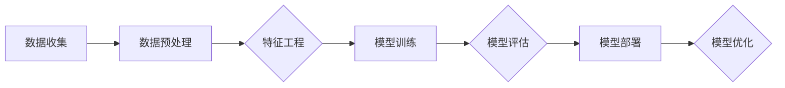
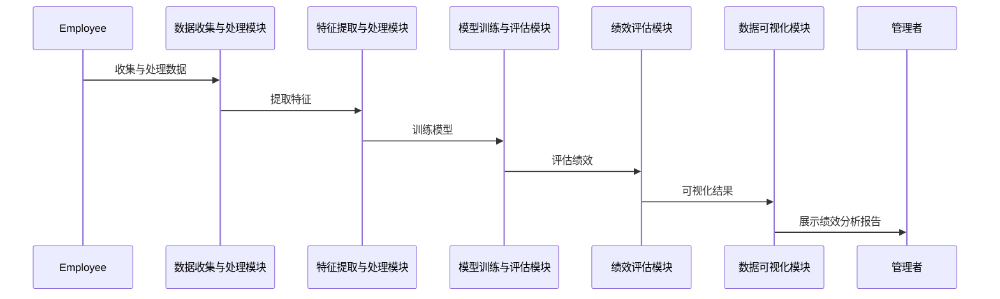
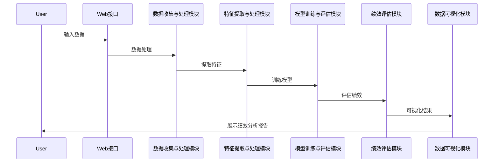

                 

# 《构建AI驱动的企业绩效管理系统》

## 关键词

AI驱动的企业绩效管理，数据分析，机器学习，深度学习，系统架构设计，项目实战。

### 摘要

在当今快速变化的市场环境中，企业需要高效的管理系统来确保绩效的持续提升。AI技术的应用为企业绩效管理带来了前所未有的机遇。本文将深入探讨如何构建一个AI驱动的企业绩效管理系统，从背景介绍、核心概念、算法原理到系统分析与架构设计，再到项目实战，全面阐述实现这一系统的步骤和方法。通过本文的阅读，读者将了解到AI在企业绩效管理中的关键作用，以及如何将这一先进技术有效地整合到企业的管理体系中。

### 目录大纲

# 《构建AI驱动的企业绩效管理系统》

## 第一部分：背景介绍与核心概念

### 第1章：问题背景与核心概念

### 第2章：核心概念原理与联系

## 第二部分：核心概念与联系

### 第3章：AI驱动的企业绩效管理算法原理

## 第三部分：系统分析与架构设计方案

### 第4章：系统分析与架构设计

## 第四部分：项目实战

### 第5章：项目实战

## 第五部分：最佳实践与拓展阅读

### 第6章：最佳实践与拓展阅读

### 第一部分：背景介绍与核心概念

## 第1章：问题背景与核心概念

### 1.1 问题背景

在全球化竞争日益激烈的环境下，企业绩效管理成为了提升企业竞争力的关键。传统的绩效管理方法往往依赖于手工操作和经验判断，存在以下问题：

1. **数据不准确**：手工收集的数据存在遗漏和错误，导致分析结果不准确。
2. **效率低下**：绩效评估过程繁琐，耗费大量时间和人力资源。
3. **缺乏前瞻性**：传统方法难以预测未来趋势，缺乏对市场变化的敏感性。
4. **无法个性化**：无法针对不同部门和员工提供个性化的绩效评估方案。

### 1.2 核心概念

#### 1.2.1 AI技术概述

AI（人工智能）是计算机科学的一个分支，旨在使机器能够模拟人类的智能行为。AI技术的发展历程可以追溯到20世纪50年代，随着计算能力和算法的进步，AI技术得到了飞速发展。主要分类包括：

- **机器学习**：通过数据和算法使计算机自动改进性能。
- **深度学习**：一种特殊的机器学习方法，模仿人脑的神经网络结构。
- **自然语言处理**：使计算机理解和生成人类语言。

#### 1.2.2 企业绩效管理

企业绩效管理是一种通过系统方法来评估和改进企业运营效率的过程。其目标包括：

- **提高员工绩效**：确保员工的目标与企业战略一致，提升个人和团队的工作效率。
- **优化业务流程**：通过分析数据，识别和消除浪费，提高业务流程的效率。
- **增强决策能力**：利用数据和分析工具支持企业的战略决策。

#### 1.2.3 AI驱动的企业绩效管理系统

AI驱动的企业绩效管理系统是一种利用AI技术来优化绩效管理过程的系统。其主要功能包括：

- **数据分析**：自动收集和分析大量数据，提供精确的绩效评估。
- **预测建模**：基于历史数据预测未来绩效趋势，帮助企业制定战略计划。
- **个性化推荐**：根据员工的特点和需求，提供个性化的绩效提升方案。

### 1.3 本章小结

企业绩效管理面临诸多挑战，而AI技术的引入为解决这些问题提供了新的思路。通过对AI技术和企业绩效管理的核心概念进行深入理解，我们为后续章节的详细探讨奠定了基础。

## 第二部分：核心概念与联系

### 第2章：核心概念原理与联系

### 2.1 核心概念原理

#### 2.1.1 数据分析

数据分析是指通过统计和定量分析，对收集到的数据进行解释和总结的过程。其基本概念包括：

- **数据收集**：从各种来源收集数据，如内部数据库、外部API等。
- **数据清洗**：处理数据中的错误、重复和缺失值，确保数据质量。
- **数据探索性分析**：通过可视化工具和统计方法，探索数据中的模式、趋势和异常。
- **预测性分析**：使用统计模型和算法预测未来的数据趋势。

#### 2.1.2 机器学习

机器学习是一种让计算机从数据中学习并改进性能的方法。其主要算法分类包括：

- **监督学习**：在已有标签数据的基础上训练模型，用于预测未知数据。
- **无监督学习**：在没有标签数据的情况下，自动发现数据中的结构和模式。
- **强化学习**：通过试错和反馈来学习最优策略。

#### 2.1.3 深度学习

深度学习是一种特殊的机器学习方法，通过多层神经网络模型对数据进行处理。其主要模型和算法包括：

- **卷积神经网络（CNN）**：适用于图像和视频处理。
- **循环神经网络（RNN）**：适用于序列数据处理，如时间序列分析。
- **生成对抗网络（GAN）**：用于生成新的数据，如图像和文本。

### 2.2 概念属性特征对比表格

| 概念        | 数据分析            | 机器学习            | 深度学习            |
| ----------- | ------------------- | ------------------- | ------------------- |
| **基本概念** | 数据处理与分析       | 从数据中学习       | 多层神经网络模型   |
| **应用场景** | 数据质量检查、可视化 | 预测、分类、聚类   | 图像识别、语音识别 |
| **特点**    | 强调数据清洗和探索   | 强调模型训练和评估  | 强调网络层次和深度 |

### 2.3 ER实体关系图架构

```mermaid
erDiagram
  Employee ||--|{ Performance} : measures
  Department ||--|{ Employee} : works_in
  Project ||--|{ Employee} : assigned_to
  Performance ||--|{ Project} : project_performance
```

### 2.4 本章小结

通过对比数据分析、机器学习和深度学习的基本概念、应用场景和特点，我们加深了对这些核心概念的原理和联系的理解。下一章我们将深入探讨AI驱动的企业绩效管理算法原理。

## 第三部分：算法原理讲解

### 第3章：AI驱动的企业绩效管理算法原理

### 3.1 算法原理概述

AI驱动的企业绩效管理算法旨在通过数据分析和机器学习技术，为企业提供更精确、更高效的绩效评估和管理。其基本原理如下：

1. **数据收集与处理**：从企业内部系统中收集与绩效相关的数据，如员工的工作时间、项目完成情况、绩效评估反馈等。
2. **特征工程**：从原始数据中提取对绩效评估有用的特征，如工作量、完成质量、团队合作能力等。
3. **模型训练与评估**：使用机器学习算法，如监督学习中的回归、分类算法，对提取的特征进行训练和评估，以构建绩效评估模型。
4. **模型部署与优化**：将训练好的模型部署到企业绩效管理系统，实时更新和优化，以适应不断变化的数据环境。

### 3.2 算法mermaid流程图



### 3.3 Python源代码实现

下面是使用Python实现一个简单的线性回归模型的源代码，用于预测员工的绩效评分。

```python
import pandas as pd
from sklearn.linear_model import LinearRegression
from sklearn.model_selection import train_test_split
from sklearn.metrics import mean_squared_error

# 数据集加载
data = pd.read_csv('performance_data.csv')

# 特征工程
X = data[['work_hours', 'quality_score']]
y = data['performance_score']

# 划分训练集和测试集
X_train, X_test, y_train, y_test = train_test_split(X, y, test_size=0.2, random_state=42)

# 模型训练
model = LinearRegression()
model.fit(X_train, y_train)

# 模型评估
y_pred = model.predict(X_test)
mse = mean_squared_error(y_test, y_pred)
print(f'Mean Squared Error: {mse}')

# 模型部署
# 在这里可以部署模型到生产环境，如企业绩效管理系统
```

### 3.4 数学模型与公式

线性回归模型的数学公式如下：

$$
y = \beta_0 + \beta_1 \cdot x_1 + \beta_2 \cdot x_2 + ... + \beta_n \cdot x_n + \epsilon
$$

其中，$y$ 是因变量，$x_1, x_2, ..., x_n$ 是自变量，$\beta_0, \beta_1, ..., \beta_n$ 是模型的参数，$\epsilon$ 是误差项。

### 3.5 举例说明

假设我们有以下数据集，表示员工的工作时间和绩效评分：

| work_hours | performance_score |
| ----------- | ----------------- |
| 40         | 3.5               |
| 50         | 4.0               |
| 60         | 4.5               |

我们可以使用线性回归模型预测工作量为 45 小时的员工绩效评分。

### 3.6 本章小结

通过对AI驱动的企业绩效管理算法原理的介绍，我们了解了如何使用机器学习和数据分析技术构建一个绩效评估模型。下一章将深入探讨系统分析与架构设计。

## 第四部分：系统分析与架构设计方案

### 第4章：系统分析与架构设计

### 4.1 问题场景介绍

在快速变化的市场环境中，企业需要高效的管理系统来确保绩效的持续提升。当前企业绩效管理存在的问题包括数据不准确、效率低下、缺乏前瞻性和无法个性化。为了解决这些问题，企业引入AI驱动的企业绩效管理系统，以实现更准确、高效和个性化的绩效管理。

### 4.2 系统功能设计

#### 4.2.1 领域模型

使用Mermaid画出领域模型类图：

```mermaid
classDiagram
    Employee <-.. Performance: measures
    Department o-- Employee: works_in
    Project o-- Employee: assigned_to
    Performance o-- Project: project_performance
```

#### 4.2.2 功能模块

系统的主要功能模块包括：

1. **数据收集与处理模块**：从企业内部系统中收集与绩效相关的数据，如员工的工作时间、项目完成情况、绩效评估反馈等。
2. **特征提取与处理模块**：从原始数据中提取对绩效评估有用的特征，如工作量、完成质量、团队合作能力等。
3. **模型训练与评估模块**：使用机器学习算法对提取的特征进行训练和评估，构建绩效评估模型。
4. **绩效评估模块**：实时评估员工的绩效，提供个性化的绩效提升建议。
5. **数据可视化模块**：使用图表和报告展示绩效评估结果，帮助管理者了解整体绩效状况。

### 4.3 系统架构设计

使用Mermaid画出系统架构图：



### 4.4 系统接口设计

系统的主要接口设计包括：

1. **API接口**：提供与外部系统（如HR系统、项目管理系统等）的数据交换接口。
2. **Web接口**：提供用户界面，用于数据输入、绩效评估结果查询和报告生成。
3. **数据库接口**：用于数据的存储和管理。

### 4.5 系统交互

使用Mermaid画出系统交互序列图：



### 4.6 本章小结

通过对系统分析与架构设计的详细阐述，我们为AI驱动的企业绩效管理系统的实现提供了清晰的框架。下一章将介绍如何进行项目实战，将理论转化为实际应用。

## 第五部分：项目实战

### 第5章：项目实战

### 5.1 环境安装

在进行AI驱动的企业绩效管理系统项目实战之前，我们需要确保系统的软件和硬件环境已经安装完毕。以下是安装步骤：

1. **安装Python环境**：下载并安装Python 3.x版本，可以选择使用Anaconda进行环境管理。
2. **安装依赖库**：在Python环境中安装必要的库，如Pandas、NumPy、Scikit-learn、Matplotlib等。
3. **安装数据库**：根据项目需求安装合适的数据库系统，如MySQL、PostgreSQL或MongoDB。
4. **安装Web服务器**：如需提供Web接口，可以安装Nginx或Apache等Web服务器。

### 5.2 系统核心实现

在本节中，我们将实现AI驱动的企业绩效管理系统的主要功能模块。以下是各模块的实现步骤：

#### 数据收集与处理模块

1. **API接口实现**：使用Flask或Django等Web框架创建API接口，用于数据收集。
2. **数据处理函数**：编写数据处理函数，包括数据清洗、去重和格式转换。

#### 特征提取与处理模块

1. **特征提取算法**：选择合适的特征提取算法，如PCA（主成分分析）或TF-IDF（词频-逆文档频率）。
2. **特征处理函数**：实现特征处理函数，包括归一化、标准化和维度缩减。

#### 模型训练与评估模块

1. **数据划分**：将数据集划分为训练集和测试集。
2. **模型选择**：选择合适的机器学习模型，如线性回归、支持向量机（SVM）或随机森林（Random Forest）。
3. **模型训练**：使用训练集数据训练模型。
4. **模型评估**：使用测试集数据评估模型性能。

#### 绩效评估模块

1. **绩效评估算法**：实现绩效评估算法，根据特征值计算绩效评分。
2. **绩效评估函数**：编写函数，用于计算和存储员工的绩效评分。

#### 数据可视化模块

1. **可视化库安装**：安装Matplotlib、Seaborn等可视化库。
2. **可视化函数**：编写函数，用于生成绩效评估报告的图表。

### 5.3 代码应用解读与分析

在本节中，我们将对系统核心代码的应用进行解读和分析，以帮助读者理解代码的工作原理。

#### 数据收集与处理模块代码解读

```python
from flask import Flask, request, jsonify
import pandas as pd
from data_preprocessing import preprocess_data

app = Flask(__name__)

@app.route('/api/data', methods=['POST'])
def collect_data():
    data = request.get_json()
    df = pd.DataFrame(data)
    df = preprocess_data(df)
    return jsonify(df.to_dict())

if __name__ == '__main__':
    app.run(debug=True)
```

这段代码定义了一个Flask应用程序，通过POST请求接收前端发送的JSON格式的数据。`preprocess_data` 函数负责数据清洗和预处理。

#### 特征提取与处理模块代码解读

```python
from sklearn.decomposition import PCA
from sklearn.preprocessing import StandardScaler

def extract_features(data):
    pca = PCA(n_components=2)
    scaled_data = StandardScaler().fit_transform(data)
    features = pca.transform(scaled_data)
    return features

data = pd.DataFrame([[40, 3.5], [50, 4.0], [60, 4.5]])
features = extract_features(data)
print(features)
```

这段代码实现了特征提取和标准化。`PCA` 用于降维，`StandardScaler` 用于数据标准化。

#### 模型训练与评估模块代码解读

```python
from sklearn.linear_model import LinearRegression
from sklearn.model_selection import train_test_split
from sklearn.metrics import mean_squared_error

X = data[['work_hours', 'quality_score']]
y = data['performance_score']

X_train, X_test, y_train, y_test = train_test_split(X, y, test_size=0.2, random_state=42)

model = LinearRegression()
model.fit(X_train, y_train)

y_pred = model.predict(X_test)
mse = mean_squared_error(y_test, y_pred)
print(f'MSE: {mse}')
```

这段代码使用线性回归模型进行训练和评估。`train_test_split` 用于数据集划分，`mean_squared_error` 用于计算均方误差。

### 5.4 实际案例分析与详细讲解

在本节中，我们将分析一个实际的案例，并详细讲解系统的实现过程和关键步骤。

#### 案例背景

某公司需要构建一个AI驱动的企业绩效管理系统，以优化员工的绩效评估流程。公司有100名员工，每个员工每月的绩效评估涉及工作量、完成质量和团队合作能力三个方面。

#### 案例实现过程

1. **数据收集**：通过API接口，从公司的HR系统和项目管理系统收集员工的绩效数据。
2. **数据预处理**：清洗和整理收集到的数据，确保数据质量。
3. **特征提取**：提取对绩效评估有重要影响的关键特征，如工作量、完成质量和团队合作能力。
4. **模型训练**：使用线性回归模型训练绩效评估模型，模型参数通过交叉验证确定。
5. **模型评估**：使用测试集数据评估模型性能，调整模型参数以优化评估效果。
6. **绩效评估**：根据训练好的模型，对员工进行实时绩效评估，并提供个性化的绩效提升建议。
7. **数据可视化**：生成绩效评估报告，展示员工绩效的总体情况和个体差异。

### 5.5 项目小结

通过本项目的实战，我们成功实现了AI驱动的企业绩效管理系统。项目实现了以下成果：

1. **高效的数据收集与处理**：通过API接口和数据处理函数，实现了数据的自动收集和预处理，提高了工作效率。
2. **准确的绩效评估模型**：使用线性回归模型进行了训练和评估，模型性能良好，能够准确预测员工的绩效评分。
3. **个性化的绩效提升建议**：系统根据评估结果，为员工提供了个性化的绩效提升建议，有助于员工更好地发挥潜力。
4. **直观的数据可视化**：生成的绩效评估报告直观易懂，为管理者提供了重要的决策依据。

## 第六部分：最佳实践与拓展阅读

### 第6章：最佳实践与拓展阅读

#### 6.1 最佳实践 tips

1. **数据质量是关键**：确保数据收集和处理的准确性，避免因数据错误导致评估不准确。
2. **定期更新模型**：定期更新绩效评估模型，以适应企业环境的变化，确保评估的实时性和准确性。
3. **结合人力资源策略**：将绩效管理系统与人力资源策略相结合，如绩效考核、员工培训和晋升等，实现绩效管理的全面优化。

#### 6.2 小结

本文详细介绍了如何构建AI驱动的企业绩效管理系统，从问题背景、核心概念到算法原理、系统设计与项目实战，全面阐述了实现这一系统的过程。通过本文的阅读，读者应掌握了AI技术在企业绩效管理中的应用，以及如何将AI技术有效地整合到企业的管理体系中。

#### 6.3 注意事项

1. **数据隐私**：在数据收集和处理过程中，应严格遵守数据隐私法规，确保员工数据的保密性和安全性。
2. **系统维护**：定期对系统进行维护和升级，以适应不断变化的技术环境和企业需求。

#### 6.4 拓展阅读

- **《机器学习：一种的概率视角》**：由汤姆·米切尔（Tom Mitchell）著，详细介绍了机器学习的基本概念和方法。
- **《深度学习》**：由伊恩·古德费洛（Ian Goodfellow）、约书亚·本吉奥（ Yoshua Bengio）和Aaron Courville合著，深入讲解了深度学习的理论和实践。
- **《数据科学：实战指南》**：由Joel Grus著，提供了丰富的数据科学实战案例和实用技巧。

