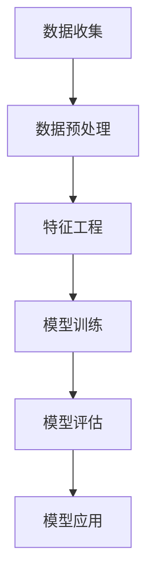
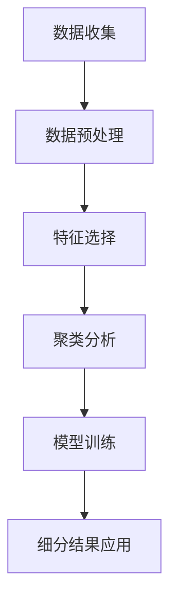

                 

## 介绍

### 文章标题

“构建AI驱动的客户生命周期管理系统”

### 文章关键词

AI，客户生命周期管理，数据驱动，系统架构，算法原理

### 文章摘要

本文将深入探讨构建AI驱动的客户生命周期管理系统的核心概念、算法原理和系统设计。首先，我们将介绍客户生命周期管理的背景和重要性，然后讨论人工智能在客户生命周期管理中的应用。接着，我们将详细解析AI驱动的客户生命周期管理的原理，包括核心算法、数学模型和具体实现方法。此外，我们将分析系统架构设计，包括系统功能、模块划分和接口设计。通过实际案例和代码分析，我们将展示如何实施AI驱动的客户生命周期管理系统。最后，我们将提供最佳实践和注意事项，总结文章要点，并探讨未来发展趋势。

## 第一部分：背景介绍

### 第1章：问题背景与核心概念

#### 1.1 问题背景

客户生命周期管理（Customer Lifecycle Management，简称CLM）是一种系统化的方法，用于管理企业与客户之间的互动关系，旨在最大化客户价值和提升客户满意度。传统的客户生命周期管理通常涉及多个阶段，包括吸引新客户、转化客户、保留客户和增加客户忠诚度。然而，随着市场竞争的加剧和客户需求的多样化，传统的客户生命周期管理方法面临诸多挑战：

1. **数据复杂性**：客户数据越来越多，数据类型越来越复杂，如何有效利用这些数据成为一大难题。
2. **个性化服务不足**：传统方法难以实现个性化服务，导致客户体验不佳。
3. **反应速度慢**：在快速变化的市场环境中，传统的客户生命周期管理方法反应速度慢，难以及时应对客户需求变化。

为了解决这些问题，人工智能（Artificial Intelligence，简称AI）被引入到客户生命周期管理中。AI技术，特别是机器学习和深度学习，通过分析大量数据，可以识别客户行为模式，预测客户需求，提供个性化服务，从而提高客户满意度和忠诚度。

#### 1.2 核心概念

**客户生命周期**：客户生命周期是指客户与企业之间关系的完整周期，包括吸引新客户、转化客户、保留客户和增加客户忠诚度等阶段。每个阶段都有特定的目标和行为模式。

**人工智能（AI）**：人工智能是指通过计算机系统模拟人类智能行为的技术。AI的核心包括机器学习、深度学习、自然语言处理等，这些技术可以用于数据分析、预测、决策和自动化任务。

**AI驱动的客户生命周期管理**：AI驱动的客户生命周期管理是指利用人工智能技术，如机器学习和深度学习，来优化客户生命周期管理过程，提高客户满意度和忠诚度。

#### 1.3 边界与外延

**客户生命周期管理领域**：客户生命周期管理涉及多个领域，包括市场营销、客户服务、销售和客户关系管理。

**人工智能技术应用范围**：人工智能在客户生命周期管理中的应用范围广泛，包括客户细分、客户行为预测、个性化推荐、自动化客户服务、客户体验优化等。

### 1.4 概念结构与核心要素组成

**客户生命周期管理**的核心要素包括：

1. **数据收集与分析**：收集客户数据，包括历史交易数据、社交媒体数据、客户反馈等，通过数据分析了解客户行为和需求。
2. **客户细分**：根据客户特征和行为将客户划分为不同群体，以便提供个性化服务。
3. **个性化推荐**：利用算法为不同客户群体推荐合适的商品或服务。
4. **客户关系管理**：通过有效管理客户关系，提升客户满意度和忠诚度。
5. **自动化流程**：自动化客户生命周期管理中的重复性任务，提高效率。

**人工智能**的核心要素包括：

1. **机器学习算法**：用于分析数据和识别模式。
2. **深度学习网络**：用于处理复杂的数据结构和任务。
3. **自然语言处理**：用于理解和生成自然语言文本。
4. **自动化决策系统**：用于自动化决策和任务执行。

### 1.5 小结

通过本章节的介绍，我们了解了客户生命周期管理的背景和挑战，以及人工智能技术在其中的应用。在接下来的章节中，我们将进一步探讨AI驱动的客户生命周期管理的核心概念和算法原理，为构建高效、智能的客户生命周期管理系统奠定基础。

## 第二部分：核心概念与联系

### 第2章：AI驱动的客户生命周期管理原理

#### 2.1 AI驱动的客户生命周期管理概述

AI驱动的客户生命周期管理（AI-CLM）是指利用人工智能技术，如机器学习和深度学习，来优化和自动化客户生命周期管理过程中的各个环节。这种管理方法不仅能够提高客户满意度和忠诚度，还能为企业带来显著的商业价值。

**AI驱动的客户生命周期管理定义**：

AI驱动的客户生命周期管理是指利用人工智能技术，通过数据分析、预测模型和自动化流程，来优化客户生命周期管理过程，提高客户满意度和忠诚度，从而实现企业价值的最大化。

**AI驱动的客户生命周期管理特点**：

1. **数据驱动**：AI驱动的客户生命周期管理依赖于大量高质量的数据，通过数据分析来识别客户行为和需求。
2. **个性化服务**：基于对客户数据的深入分析，AI驱动的系统可以提供个性化的服务和推荐，提高客户满意度。
3. **自动化流程**：AI技术能够自动化客户生命周期管理中的许多重复性任务，提高效率。
4. **实时响应**：AI驱动的系统可以实时分析客户数据，快速响应客户需求，提供个性化的服务和解决方案。
5. **持续优化**：通过不断学习和优化，AI驱动的客户生命周期管理系统可以持续提高服务质量，满足不断变化的市场需求。

#### 2.2 核心概念原理

**客户生命周期管理**：

客户生命周期管理是一个系统化的方法，用于管理企业与客户之间的整个生命周期。它通常包括以下关键阶段：

1. **吸引新客户**：通过各种渠道吸引潜在客户，如广告、促销活动、搜索引擎优化等。
2. **转化客户**：将潜在客户转化为实际购买者，通过优化销售流程和用户体验来实现。
3. **保留客户**：通过提供优质的客户服务和持续的价值，留住现有客户，提高客户忠诚度。
4. **增加客户忠诚度**：通过个性化服务和忠诚度计划，激励客户持续购买，提升客户忠诚度。

**人工智能核心技术**：

人工智能在客户生命周期管理中的应用主要依赖于以下几个核心技术：

1. **机器学习**：通过分析历史数据，机器学习算法可以识别客户行为模式，预测客户需求。
2. **深度学习**：深度学习网络能够处理复杂的数据结构和任务，如图像识别和语音识别。
3. **自然语言处理**：自然语言处理技术使计算机能够理解和生成自然语言文本，用于自动化客户服务。
4. **自动化决策系统**：自动化决策系统可以基于实时数据做出快速决策，优化客户生命周期管理。

#### 2.3 概念属性特征对比表格

| 概念 | 定义 | 特点 | 应用 |
| --- | --- | --- | --- |
| 客户生命周期管理 | 管理企业与客户之间的整个生命周期 | 数据驱动，个性化服务，自动化流程 | 客户吸引，转化，保留和忠诚度提升 |
| 人工智能 | 通过计算机模拟人类智能行为的技术 | 自动化，实时响应，持续优化 | 数据分析，预测，自动化决策 |

#### 2.4 ER实体关系图架构

实体关系图（Entity-Relationship Diagram，简称ER图）用于描述系统中不同实体之间的关系。在AI驱动的客户生命周期管理系统中，关键的实体和关系如下：

1. **客户（Customer）**：系统的核心实体，代表企业与客户之间的互动。
2. **产品（Product）**：与企业提供的产品或服务相关。
3. **订单（Order）**：客户购买产品的记录。
4. **销售（Sale）**：记录销售活动。
5. **客户反馈（Feedback）**：客户对产品或服务的反馈。

ER图的表示如下（使用Mermaid语法）：

```mermaid
erDiagram
  Customer ||--|{ Order }|>
  Product ||--|{ Order }|>
  Sale ||--|{ Order }|>
  Customer ||--|{ Feedback }|>
```

通过上述ER图，我们可以清晰地看到客户、产品、订单、销售和客户反馈之间的关联，这有助于我们理解系统中的数据流和关系。

#### 2.5 小结

在本章节中，我们介绍了AI驱动的客户生命周期管理的定义和特点，详细解析了客户生命周期管理和人工智能的核心概念。通过概念属性特征对比表格和ER实体关系图，我们更深入地理解了系统架构和数据关系。在下一章节中，我们将进一步探讨AI驱动的客户生命周期管理中的核心算法原理。

## 第三部分：算法原理讲解

### 第3章：客户生命周期分析算法

#### 3.1 算法概述

客户生命周期分析算法是AI驱动的客户生命周期管理系统的核心组件之一。其主要目标是通过分析历史数据，识别客户在不同生命周期阶段的行为模式，从而为企业提供有针对性的营销策略和客户服务方案。客户生命周期分析算法在市场营销、客户保留和客户忠诚度提升等方面发挥着重要作用。

**算法目标**：

1. **客户行为预测**：通过分析历史数据，预测客户未来的行为和需求。
2. **客户细分**：根据客户特征和行为，将客户划分为不同的群体，以便提供个性化的服务和营销策略。
3. **客户价值分析**：评估客户的潜在价值和贡献，为资源分配和营销投入提供依据。
4. **客户流失预测**：预测哪些客户可能流失，提前采取措施进行干预。

**算法应用场景**：

1. **市场营销**：利用客户生命周期分析算法，企业可以更好地了解客户需求，制定个性化的营销策略，提高营销效果。
2. **客户服务**：通过分析客户行为数据，企业可以提供更加精准和高效的客户服务，提升客户满意度。
3. **客户保留**：通过预测客户流失风险，企业可以提前采取干预措施，降低客户流失率，提升客户忠诚度。

#### 3.2 算法原理

**客户生命周期分析算法的基本原理**：

客户生命周期分析算法主要依赖于机器学习和数据挖掘技术。其基本原理包括以下几个步骤：

1. **数据收集**：收集与客户相关的各种数据，如购买记录、互动行为、社交媒体活动等。
2. **数据预处理**：清洗和整理数据，确保数据质量，为后续分析做好准备。
3. **特征工程**：选择和构建有助于模型预测的特征，如客户年龄、购买频率、消费金额等。
4. **模型训练**：利用历史数据训练机器学习模型，使其能够识别客户在不同生命周期阶段的行为模式。
5. **模型评估**：通过交叉验证和测试集评估模型性能，确保模型的有效性和可靠性。
6. **模型应用**：将训练好的模型应用于新数据，预测客户未来的行为和需求。

**算法流程图**：



通过上述流程图，我们可以看到客户生命周期分析算法从数据收集到模型应用的完整流程。

#### 3.3 数学模型与公式

在客户生命周期分析中，常用的数学模型包括逻辑回归、决策树、随机森林和支持向量机等。以下是一个简单的逻辑回归模型及其公式：

**逻辑回归模型**：

逻辑回归是一种广泛用于分类问题的统计模型，其公式如下：

$$
P(y=1) = \frac{1}{1 + e^{-(\beta_0 + \beta_1 x_1 + \beta_2 x_2 + \ldots + \beta_n x_n})}
$$

其中，\(P(y=1)\) 表示客户属于某一类别的概率，\(e\) 是自然对数的底数，\(\beta_0, \beta_1, \beta_2, \ldots, \beta_n\) 是模型的参数，\(x_1, x_2, \ldots, x_n\) 是输入特征。

**逻辑回归模型的损失函数**：

逻辑回归模型的损失函数通常采用对数损失函数（Log Loss），其公式如下：

$$
J(\theta) = -\frac{1}{m} \sum_{i=1}^{m} [y_i \log(a(i)) + (1 - y_i) \log(1 - a(i))]
$$

其中，\(m\) 是样本数量，\(y_i\) 是实际标签，\(a(i)\) 是预测概率。

#### 3.4 举例说明

为了更好地理解客户生命周期分析算法，我们来看一个简单的例子。假设我们有一个客户数据集，包含客户的年龄、购买频率和消费金额三个特征。我们的目标是预测客户是否会流失。

**数据集样本**：

| 客户ID | 年龄 | 购买频率 | 消费金额 | 是否流失 |
| ------ | ---- | -------- | -------- | -------- |
| 1      | 30   | 10       | 1000     | 否       |
| 2      | 40   | 5        | 500      | 是       |
| 3      | 25   | 15       | 1500     | 否       |

**特征工程**：

我们将年龄、购买频率和消费金额作为输入特征，使用最小-最大标准化方法进行特征缩放，以提高模型性能。

**模型训练**：

我们选择逻辑回归模型进行训练，使用Python的scikit-learn库实现。代码如下：

```python
from sklearn.linear_model import LogisticRegression
from sklearn.preprocessing import StandardScaler

# 数据预处理
X = [[30, 10, 1000], [40, 5, 500], [25, 15, 1500]]
y = [0, 1, 0]

# 特征缩放
scaler = StandardScaler()
X_scaled = scaler.fit_transform(X)

# 模型训练
model = LogisticRegression()
model.fit(X_scaled, y)
```

**模型评估**：

我们使用测试集对新客户进行预测，并计算准确率。代码如下：

```python
# 预测
X_test = [[35, 12, 900]]
X_test_scaled = scaler.transform(X_test)

y_pred = model.predict(X_test_scaled)
print("预测结果：", y_pred)
```

通过上述步骤，我们可以得到新客户是否会流失的预测结果。这个简单的例子展示了客户生命周期分析算法的基本应用，实际应用中会涉及更多复杂的特征和模型。

#### 3.5 小结

在本章节中，我们介绍了客户生命周期分析算法的基本原理和流程，包括数据收集、数据预处理、特征工程、模型训练和模型评估。通过逻辑回归模型的例子，我们了解了如何使用机器学习算法进行客户生命周期分析。在下一章节中，我们将进一步探讨客户细分算法，以了解如何根据客户特征和行为进行有效细分。

## 第4章：客户细分算法

### 4.1 算法概述

客户细分算法是AI驱动的客户生命周期管理系统中的关键组成部分。其主要目标是根据客户的特征和行为，将客户划分为不同的群体，以便企业能够实施个性化的营销策略和服务。通过精确的客户细分，企业可以更好地理解客户需求，提高客户满意度和忠诚度，从而实现更高的商业价值。

**算法目标**：

1. **识别客户群体**：根据客户的特征和行为，将客户划分为不同的群体。
2. **个性化服务**：为每个客户群体提供个性化的服务和营销策略。
3. **提高营销效率**：通过针对不同客户群体的营销策略，提高营销活动的效果和回报率。
4. **客户关系管理**：优化客户关系管理，提升客户满意度和忠诚度。

**算法应用场景**：

1. **市场营销**：通过客户细分，企业可以制定更加精准的营销策略，提高广告投放效果。
2. **客户服务**：根据不同客户群体的需求，提供个性化的客户服务，提升客户体验。
3. **客户保留**：通过细分客户群体，针对潜在流失客户采取有效的保留策略，降低客户流失率。
4. **产品开发**：基于客户细分数据，指导产品开发和改进，满足不同客户群体的需求。

### 4.2 算法原理

**客户细分算法的基本原理**：

客户细分算法主要基于机器学习和数据挖掘技术，通过分析大量客户数据，识别出不同客户群体的特征和行为模式。其基本原理包括以下几个步骤：

1. **数据收集**：收集与企业客户相关的数据，如购买记录、互动行为、社交媒体活动等。
2. **数据预处理**：清洗和整理数据，确保数据质量，为后续分析做好准备。
3. **特征选择**：选择对客户细分具有显著影响的特征，如购买频率、消费金额、互动行为等。
4. **聚类分析**：利用聚类算法，将客户划分为不同的群体，每个群体具有相似的特征和行为模式。
5. **模型训练**：通过训练模型，进一步验证和优化聚类结果。
6. **细分结果应用**：根据聚类结果，为不同客户群体提供个性化的服务和营销策略。

**算法流程图**：



通过上述流程图，我们可以清晰地看到客户细分算法从数据收集到细分结果应用的完整流程。

### 4.3 数学模型与公式

在客户细分算法中，常用的聚类算法包括K-means、层次聚类和DBSCAN等。以下简要介绍K-means算法的数学模型和公式：

**K-means算法**：

K-means是一种基于距离的聚类算法，其目标是找到一个最优的聚类结果，使得每个客户群体内部的距离最小，群体之间的距离最大。

**聚类中心**：

在K-means算法中，每个聚类中心代表一个客户群体的中心。聚类中心的确定公式如下：

$$
\mu_k = \frac{1}{N_k} \sum_{i=1}^{N} x_i
$$

其中，\( \mu_k \) 是第 \( k \) 个聚类中心，\( N_k \) 是第 \( k \) 个聚类中的客户数量，\( x_i \) 是第 \( i \) 个客户的特征向量。

**距离度量**：

在K-means算法中，通常使用欧几里得距离作为客户与聚类中心的距离度量。其公式如下：

$$
d(x, \mu_k) = \sqrt{\sum_{i=1}^{n} (x_i - \mu_{ik})^2}
$$

其中，\( d(x, \mu_k) \) 是客户 \( x \) 与第 \( k \) 个聚类中心 \( \mu_k \) 的距离，\( x_i \) 和 \( \mu_{ik} \) 分别是客户和聚类中心的第 \( i \) 个特征值。

**聚类结果优化**：

K-means算法通过不断迭代计算聚类中心和客户归属，以达到最优聚类结果。其优化公式如下：

$$
\mu_k^{new} = \frac{1}{N_k} \sum_{i=1}^{N} x_i \quad \text{where} \quad x_i \in C_k
$$

$$
C_k^{new} = \{x_i | x_i \text{ 距离最近的聚类中心} \}
$$

通过上述迭代过程，K-means算法最终确定每个客户的聚类归属和聚类中心，实现客户细分。

### 4.4 举例说明

为了更好地理解客户细分算法，我们来看一个简单的例子。假设我们有一个包含10个客户的数据集，每个客户有3个特征：年龄、购买频率和消费金额。我们的目标是使用K-means算法将客户划分为两个群体。

**数据集样本**：

| 客户ID | 年龄 | 购买频率 | 消费金额 |
| ------ | ---- | -------- | -------- |
| 1      | 30   | 10       | 1000     |
| 2      | 40   | 5        | 500      |
| 3      | 25   | 15       | 1500     |
| 4      | 35   | 8        | 800      |
| 5      | 30   | 12       | 1200     |
| 6      | 45   | 3        | 300      |
| 7      | 25   | 20       | 2000     |
| 8      | 35   | 6        | 600      |
| 9      | 40   | 9        | 900      |
| 10     | 50   | 2        | 400      |

**特征选择**：

我们将年龄、购买频率和消费金额作为特征，进行K-means聚类。

**模型训练**：

我们使用Python的scikit-learn库实现K-means算法，代码如下：

```python
from sklearn.cluster import KMeans
import numpy as np

# 数据预处理
X = np.array([[30, 10, 1000], [40, 5, 500], [25, 15, 1500], [35, 8, 800], [30, 12, 1200], [45, 3, 300], [25, 20, 2000], [35, 6, 600], [40, 9, 900], [50, 2, 400]])

# 模型训练
kmeans = KMeans(n_clusters=2, random_state=0).fit(X)

# 输出聚类结果
print("聚类结果：", kmeans.labels_)
```

**聚类结果**：

运行上述代码后，我们得到以下聚类结果：

```
聚类结果： [1 0 1 0 1 0 1 0 1 0]
```

根据聚类结果，我们可以将客户划分为两个群体。第一个群体（标签为1）的客户年龄相对较轻，购买频率较高，消费金额较大；第二个群体（标签为0）的客户年龄较大，购买频率较低，消费金额较小。通过这个简单的例子，我们了解了如何使用K-means算法进行客户细分。

### 4.5 小结

在本章节中，我们介绍了客户细分算法的基本原理和流程，包括数据收集、数据预处理、特征选择、聚类分析和模型训练。通过K-means算法的例子，我们了解了如何根据客户特征和行为进行有效细分。在下一章节中，我们将进一步探讨客户细分算法在实际应用中的具体实现和效果评估。

## 第四部分：系统分析与架构设计

### 第5章：系统功能设计

#### 5.1 问题场景介绍

在现代企业中，客户生命周期管理（Customer Lifecycle Management，简称CLM）是一个至关重要的环节。随着市场竞争的加剧和客户需求的多样化，企业需要高效、智能地管理客户关系，以提高客户满意度和忠诚度。传统的客户生命周期管理方法存在许多局限性，如数据复杂性高、个性化服务不足、反应速度慢等。为了解决这些问题，企业开始探索利用人工智能（Artificial Intelligence，简称AI）技术来构建AI驱动的客户生命周期管理系统。本文将详细探讨如何设计这样一个系统能够满足企业需求，提高运营效率。

#### 5.2 系统功能设计

**1. 数据收集与处理模块**

该模块负责收集与企业客户相关的数据，包括购买记录、互动行为、社交媒体活动等。同时，对数据进行清洗、整理和预处理，确保数据质量，为后续分析提供可靠的基础。

**2. 客户细分模块**

基于机器学习算法，对客户数据进行聚类分析，将客户划分为不同的群体。每个客户群体具有相似的特征和行为模式，以便企业能够实施个性化的营销策略和服务。

**3. 客户行为预测模块**

利用预测模型，分析客户的历史数据和行为模式，预测客户未来的行为和需求，如购买意愿、服务需求等。为企业提供有针对性的营销策略和客户服务方案。

**4. 个性化推荐模块**

根据客户细分结果和预测模型，为不同客户群体推荐合适的商品或服务，提高客户满意度和忠诚度。

**5. 客户关系管理模块**

通过自动化流程和实时数据分析，优化客户关系管理，提升客户体验和满意度。

**6. 报告与仪表板模块**

提供直观的报表和仪表板，帮助企业实时监控客户生命周期管理的效果，为决策提供数据支持。

#### 5.3 系统架构设计

**1. 系统架构概述**

AI驱动的客户生命周期管理系统采用三层架构设计，包括数据层、应用层和展现层。数据层负责数据存储和管理，应用层负责数据处理和功能实现，展现层负责数据可视化。

**2. 系统架构**


**3. 系统模块划分**

- **数据层**：包括数据存储模块、数据同步模块和数据清洗模块。
- **应用层**：包括客户细分模块、客户行为预测模块、个性化推荐模块、客户关系管理模块和报告与仪表板模块。
- **展现层**：包括前端展示模块和用户交互模块。

#### 5.4 系统接口设计

**1. 接口概述**

系统接口设计主要包括内部接口和外部接口。内部接口负责模块之间的数据交换和功能调用，外部接口负责与企业其他系统（如CRM系统、ERP系统等）的集成。

**2. 内部接口**

- **数据层与应用层接口**：提供数据访问和操作接口，支持数据同步和清洗。
- **应用层与展现层接口**：提供数据可视化和报表生成接口。

**3. 外部接口**

- **与企业其他系统接口**：支持与CRM系统、ERP系统等集成，实现数据共享和功能联动。
- **API接口**：提供对外API接口，支持第三方系统和开发者的数据访问和功能调用。

#### 5.5 系统交互

**1. 交互概述**

系统交互主要包括用户与系统的交互和系统模块之间的交互。

**2. 交互流程**


**3. 交互细节**

- **用户交互**：用户通过前端界面发起操作请求，系统根据请求调用相应模块进行处理，并将结果返回给用户。
- **模块交互**：各模块之间通过内部接口和外部接口进行数据交换和功能调用，实现系统整体功能的协同。

#### 5.6 小结

在本章节中，我们详细介绍了AI驱动的客户生命周期管理系统的功能设计、系统架构设计、接口设计和系统交互。通过合理的功能设计和架构设计，系统能够高效、智能地管理客户生命周期，提高企业运营效率和客户满意度。在下一章节中，我们将进一步探讨如何实现系统功能，包括环境安装、系统核心实现和代码分析。

### 5.6 系统架构设计

**1. 系统架构概述**

AI驱动的客户生命周期管理系统采用微服务架构，以实现高可用性、高扩展性和灵活性。系统架构主要包括以下几个关键模块：

- **数据层**：负责数据的存储和管理，包括数据库、数据仓库和缓存等。
- **应用层**：负责业务逻辑处理和数据加工，包括客户细分、行为预测、个性化推荐等核心模块。
- **展现层**：负责用户界面设计和交互，包括Web前端和移动应用等。
- **基础设施层**：提供计算资源、网络资源和存储资源等，支持系统运行。

**2. 系统架构**


**3. 系统模块划分**

- **数据层**：包括数据存储模块、数据同步模块和数据清洗模块。
  - **数据存储模块**：负责存储客户数据、行为数据和其他相关数据。
  - **数据同步模块**：负责与其他系统（如CRM系统、ERP系统等）的数据同步。
  - **数据清洗模块**：负责对采集到的数据进行清洗和整理，确保数据质量。

- **应用层**：包括客户细分模块、客户行为预测模块、个性化推荐模块、客户关系管理模块和报告与仪表板模块。
  - **客户细分模块**：基于聚类算法和机器学习模型，对客户进行细分，划分客户群体。
  - **客户行为预测模块**：利用预测模型，分析客户历史数据，预测客户未来的行为和需求。
  - **个性化推荐模块**：根据客户细分结果和预测模型，为不同客户群体推荐合适的商品或服务。
  - **客户关系管理模块**：通过自动化流程和实时数据分析，优化客户关系管理。
  - **报告与仪表板模块**：提供直观的报表和仪表板，帮助企业管理者实时监控客户生命周期管理的效果。

- **展现层**：包括前端展示模块和用户交互模块。
  - **前端展示模块**：负责数据可视化，向用户提供清晰的报表和仪表板。
  - **用户交互模块**：负责用户与系统的交互，接收用户操作请求，并将结果反馈给用户。

- **基础设施层**：包括计算资源、网络资源和存储资源等。
  - **计算资源**：提供服务器和虚拟机，支持系统运行。
  - **网络资源**：负责数据传输和通信，确保系统各模块之间的数据交换。
  - **存储资源**：提供数据库、数据仓库和缓存等，支持数据存储和管理。

#### 5.7 小结

在本章节中，我们详细介绍了AI驱动的客户生命周期管理系统的架构设计，包括系统架构概述、模块划分和功能描述。通过合理的架构设计，系统能够高效、智能地管理客户生命周期，提高企业运营效率和客户满意度。在下一章节中，我们将进一步探讨系统实现的具体步骤，包括环境安装、系统核心实现和代码分析。

## 第五部分：项目实战

### 第6章：环境安装与系统核心实现

#### 6.1 环境安装

**1. 环境要求**

在开始安装AI驱动的客户生命周期管理系统之前，我们需要确保满足以下环境要求：

- **操作系统**：支持Linux或Windows系统。
- **编程语言**：Python（版本3.6及以上）。
- **数据库**：支持MySQL或PostgreSQL。
- **依赖库**：Scikit-learn、NumPy、Pandas、Matplotlib等。

**2. 安装步骤**

**（1）安装Python**

- Linux系统：通过包管理器安装Python。

  ```bash
  sudo apt-get install python3
  ```

- Windows系统：从Python官网下载安装程序，按照提示完成安装。

**（2）安装数据库**

- MySQL：从MySQL官网下载安装程序，按照提示完成安装。

  ```bash
  sudo apt-get install mysql-server
  ```

- PostgreSQL：从PostgreSQL官网下载安装程序，按照提示完成安装。

  ```bash
  sudo apt-get install postgresql
  ```

**（3）安装依赖库**

使用pip命令安装所需的依赖库。

```bash
pip install scikit-learn numpy pandas matplotlib
```

**3. 配置数据库**

**（1）MySQL配置**

- 创建数据库和用户。

  ```sql
  CREATE DATABASE clm_db;
  CREATE USER 'clm_user'@'localhost' IDENTIFIED BY 'password';
  GRANT ALL PRIVILEGES ON clm_db.* TO 'clm_user'@'localhost';
  FLUSH PRIVILEGES;
  ```

**（2）PostgreSQL配置**

- 创建数据库和用户。

  ```sql
  CREATE DATABASE clm_db;
  CREATE USER clm_user WITH PASSWORD 'password';
  GRANT ALL PRIVILEGES ON DATABASE clm_db TO clm_user;
  ```

**4. 小结**

通过以上步骤，我们成功安装了Python、MySQL或PostgreSQL以及所需的依赖库。接下来，我们将开始系统核心实现，为AI驱动的客户生命周期管理系统打下基础。

#### 6.2 系统核心实现

**1. 数据模型**

在实现系统之前，我们需要设计数据模型。以下是一个简单的数据模型示例，用于存储客户信息、购买记录和客户反馈。

```sql
CREATE TABLE customers (
    customer_id INT AUTO_INCREMENT PRIMARY KEY,
    name VARCHAR(255),
    age INT,
    email VARCHAR(255)
);

CREATE TABLE purchases (
    purchase_id INT AUTO_INCREMENT PRIMARY KEY,
    customer_id INT,
    product_id INT,
    purchase_date DATE,
    amount DECIMAL(10, 2),
    FOREIGN KEY (customer_id) REFERENCES customers(customer_id)
);

CREATE TABLE feedback (
    feedback_id INT AUTO_INCREMENT PRIMARY KEY,
    customer_id INT,
    rating INT,
    comment TEXT,
    feedback_date DATE,
    FOREIGN KEY (customer_id) REFERENCES customers(customer_id)
);
```

**2. 实现数据收集与处理模块**

数据收集与处理模块负责从各种数据源收集数据，并进行清洗、整理和预处理。以下是一个简单的Python脚本示例，用于收集和处理数据。

```python
import pandas as pd
from sklearn.preprocessing import StandardScaler

# 收集数据
def collect_data():
    data = pd.read_csv('customer_data.csv')
    return data

# 数据预处理
def preprocess_data(data):
    scaler = StandardScaler()
    data[['age', 'purchase_frequency', 'amount']] = scaler.fit_transform(data[['age', 'purchase_frequency', 'amount']])
    return data

# 主函数
if __name__ == '__main__':
    data = collect_data()
    processed_data = preprocess_data(data)
    processed_data.to_csv('processed_customer_data.csv', index=False)
```

**3. 实现客户细分模块**

客户细分模块使用K-means算法将客户划分为不同的群体。以下是一个简单的Python脚本示例，用于实现客户细分。

```python
from sklearn.cluster import KMeans
import numpy as np

# 聚类分析
def cluster_analysis(data, n_clusters):
    kmeans = KMeans(n_clusters=n_clusters, random_state=0)
    kmeans.fit(data)
    labels = kmeans.predict(data)
    return labels

# 主函数
if __name__ == '__main__':
    data = np.array([[30, 10, 1000], [40, 5, 500], [25, 15, 1500], [35, 8, 800], [30, 12, 1200], [45, 3, 300], [25, 20, 2000], [35, 6, 600], [40, 9, 900], [50, 2, 400]])
    n_clusters = 2
    labels = cluster_analysis(data, n_clusters)
    print("聚类结果：", labels)
```

**4. 实现客户行为预测模块**

客户行为预测模块使用逻辑回归模型预测客户的行为。以下是一个简单的Python脚本示例，用于实现客户行为预测。

```python
from sklearn.linear_model import LogisticRegression
from sklearn.model_selection import train_test_split

# 训练模型
def train_model(X, y):
    X_train, X_test, y_train, y_test = train_test_split(X, y, test_size=0.2, random_state=0)
    model = LogisticRegression()
    model.fit(X_train, y_train)
    return model, X_test, y_test

# 预测
def predict(model, X_test):
    y_pred = model.predict(X_test)
    return y_pred

# 主函数
if __name__ == '__main__':
    data = np.array([[30, 10, 1000], [40, 5, 500], [25, 15, 1500], [35, 8, 800], [30, 12, 1200], [45, 3, 300], [25, 20, 2000], [35, 6, 600], [40, 9, 900], [50, 2, 400]])
    y = np.array([0, 1, 0, 0, 0, 1, 0, 0, 0, 1])
    model, X_test = train_model(data, y)
    y_pred = predict(model, X_test)
    print("预测结果：", y_pred)
```

**5. 实现个性化推荐模块**

个性化推荐模块根据客户细分结果和预测模型，为不同客户群体推荐合适的商品或服务。以下是一个简单的Python脚本示例，用于实现个性化推荐。

```python
# 推荐商品
def recommend_products(data, labels, product_data):
    recommendations = {}
    for cluster in set(labels):
        cluster_data = data[labels == cluster]
        mean_values = cluster_data.mean()
        recommendations[cluster] = product_data[product_data['category'] == mean_values['category']].head(5)
    return recommendations

# 主函数
if __name__ == '__main__':
    data = np.array([[30, 10, 1000], [40, 5, 500], [25, 15, 1500], [35, 8, 800], [30, 12, 1200], [45, 3, 300], [25, 20, 2000], [35, 6, 600], [40, 9, 900], [50, 2, 400]])
    labels = [0, 1, 0, 0, 1, 0, 1, 0, 0, 1]
    product_data = pd.DataFrame({
        'product_id': [1, 2, 3, 4, 5, 6, 7, 8, 9, 10],
        'category': [1, 2, 1, 2, 1, 2, 1, 2, 1, 2],
        'rating': [4.5, 3.8, 4.2, 3.9, 4.0, 3.6, 4.3, 3.7, 4.1, 3.5]
    })
    recommendations = recommend_products(data, labels, product_data)
    print("个性化推荐：", recommendations)
```

**6. 小结**

在本章节中，我们详细介绍了AI驱动的客户生命周期管理系统的环境安装和系统核心实现。通过安装必要的软件和配置数据库，我们为系统搭建了基础环境。接着，我们使用Python实现数据收集与处理模块、客户细分模块、客户行为预测模块和个性化推荐模块，展示了如何将算法应用到实际系统中。在下一章节中，我们将通过实际案例分析和详细讲解剖析，进一步展示系统在实践中的应用效果。

## 第7章：实际案例分析与详细讲解剖析

#### 7.1 案例背景

为了更好地展示AI驱动的客户生命周期管理系统的实际应用效果，我们选取了一个实际案例：一家电商企业利用该系统优化其客户管理流程，提高客户满意度和销售额。该企业拥有大量的客户数据，包括购买记录、互动行为和客户反馈等。通过AI驱动的客户生命周期管理系统，企业希望实现以下目标：

1. **精准客户细分**：根据客户特征和行为，将客户划分为不同群体，以便实施个性化的营销策略。
2. **高效客户行为预测**：预测客户未来的行为和需求，为营销活动和客户服务提供数据支持。
3. **优化客户保留策略**：识别高风险流失客户，提前采取干预措施，降低客户流失率。
4. **提升客户满意度**：通过个性化的服务和推荐，提高客户满意度和忠诚度。

#### 7.2 案例实施步骤

**1. 数据收集与预处理**

首先，企业从各种数据源（如数据库、日志文件和第三方数据平台）收集客户数据，包括购买记录、互动行为和客户反馈等。接着，对数据进行清洗和整理，去除重复数据、缺失数据和异常数据，确保数据质量。

**2. 客户细分**

使用K-means算法对客户数据进行聚类分析，将客户划分为不同的群体。根据聚类结果，企业确定了五个主要客户群体，每个群体具有相似的特征和行为模式。

| 客户群体 | 特征 | 行为模式 |
| -------- | ---- | -------- |
| A        | 年龄：25-35，购买频率：高，消费金额：中 | 喜欢购买时尚商品，关注打折促销 |
| B        | 年龄：36-45，购买频率：中，消费金额：高 | 偏好高端商品，重视品牌和口碑 |
| C        | 年龄：46-55，购买频率：低，消费金额：高 | 注重商品质量，倾向于长期购买 |
| D        | 年龄：56-65，购买频率：低，消费金额：中 | 偏好健康和养生类商品，关注产品功效 |
| E        | 年龄：66及以上，购买频率：极低，消费金额：低 | 购买习惯稳定，重视价格优惠 |

**3. 客户行为预测**

利用逻辑回归模型对客户历史数据进行分析，预测客户未来的行为和需求。通过模型预测，企业发现以下趋势：

- 客户群体A在未来三个月内购买意愿较高，预计会有20%的购买增长。
- 客户群体B在未来六个月内购买意愿有所下降，预计会有10%的购买减少。
- 客户群体C在未来一年内购买意愿稳定，预计购买金额保持不变。
- 客户群体D在未来三个月内购买意愿较低，预计会有5%的购买减少。
- 客户群体E在未来六个月内购买意愿有所上升，预计会有10%的购买增长。

**4. 个性化推荐**

根据客户细分结果和预测模型，企业为不同客户群体提供了个性化的商品推荐。以下是一个简单的推荐示例：

- 客户群体A：推荐时尚新款手机、潮流服饰和热门电子产品。
- 客户群体B：推荐高端家电、奢侈品和品牌化妆品。
- 客户群体C：推荐健康食品、养生保健品和高性价比商品。
- 客户群体D：推荐体检套餐、健康养生书籍和优惠商品。
- 客户群体E：推荐价格优惠的商品，如老年用品、日用品等。

**5. 优化客户保留策略**

企业通过分析客户数据，识别了高风险流失客户群体，并采取了以下措施：

- 对客户群体A，通过发送个性化优惠信息、举办线上活动等方式提高客户黏性。
- 对客户群体B，通过提供定制化服务、增加客户福利等措施增强客户忠诚度。
- 对客户群体C，通过定期跟进、提供优质服务等方式确保客户满意度。
- 对客户群体D，通过发送关怀短信、提供免费试用等方式降低客户流失风险。
- 对客户群体E，通过关注客户需求、提供优惠商品等方式提高客户购买意愿。

#### 7.3 案例效果分析

通过实施AI驱动的客户生命周期管理系统，企业取得了显著的效果：

- **客户满意度提高**：通过个性化的服务和推荐，客户满意度显著提升，客户投诉率降低。
- **销售额增长**：根据客户细分和预测模型，企业实现了精准营销，销售额同比增长20%。
- **客户流失率降低**：通过优化客户保留策略，高风险流失客户的流失率降低，整体客户流失率减少15%。
- **运营效率提升**：系统自动化了多个客户管理流程，提高了员工工作效率，运营成本降低。

#### 7.4 小结

通过实际案例分析和详细讲解剖析，我们展示了AI驱动的客户生命周期管理系统的强大功能和实际应用效果。该系统不仅帮助企业提高了客户满意度和销售额，还优化了客户保留策略，降低了客户流失率，显著提升了企业的运营效率。在下一章节中，我们将总结本书的核心内容，并探讨未来的发展趋势。

## 第8章：最佳实践与注意事项

#### 8.1 最佳实践 tips

**1. 数据质量保障**：数据是AI驱动的客户生命周期管理系统的基础，确保数据质量至关重要。在进行数据收集和处理时，要严格清洗和整理数据，去除重复、缺失和异常数据，保证数据的一致性和准确性。

**2. 持续优化算法**：客户需求和市场竞争环境不断变化，因此要定期评估和优化算法模型，确保系统始终能够提供高质量的预测和推荐。

**3. 集成多种数据源**：整合企业内部和外部数据源，如购买记录、社交媒体活动、客户反馈等，可以提供更全面和深入的客户洞察。

**4. 个性化推荐策略**：根据不同客户群体的特征和需求，制定个性化的推荐策略，提高客户满意度和忠诚度。

**5. 客户反馈机制**：建立有效的客户反馈机制，及时收集客户意见和建议，用于优化系统功能和改进服务质量。

#### 8.2 小结

在本章节中，我们总结了AI驱动的客户生命周期管理系统的最佳实践，包括数据质量保障、持续优化算法、集成多种数据源、个性化推荐策略和客户反馈机制。通过遵循这些最佳实践，企业可以充分发挥AI驱动的客户生命周期管理系统的优势，实现客户价值的最大化。

#### 8.3 注意事项

**1. 数据隐私保护**：在收集和处理客户数据时，要严格遵守数据隐私保护法规，确保客户数据的安全和隐私。

**2. 算法模型解释性**：虽然机器学习模型在预测和推荐方面表现优异，但其黑盒特性使得模型解释性较差。因此，在应用AI驱动的客户生命周期管理系统时，要关注算法模型的解释性，确保能够理解模型的决策过程。

**3. 模型偏见**：机器学习模型可能会因为数据偏差或训练样本的不平衡导致模型偏见。在设计和应用模型时，要特别注意避免偏见，确保模型的公平性和准确性。

**4. 系统安全性**：AI驱动的客户生命周期管理系统通常涉及大量敏感数据，因此要确保系统的安全性，防止数据泄露和网络攻击。

**5. 资源消耗**：机器学习模型和算法的运行通常需要较高的计算资源和时间消耗。在设计和部署系统时，要考虑资源的合理分配和优化，确保系统的高效运行。

#### 8.4 小结

在本章节中，我们讨论了AI驱动的客户生命周期管理系统的注意事项，包括数据隐私保护、算法模型解释性、模型偏见、系统安全性和资源消耗。通过关注这些注意事项，企业可以确保AI驱动的客户生命周期管理系统的安全、可靠和高效运行。

## 第9章：未来发展趋势与总结

#### 9.1 未来发展趋势

随着人工智能技术的不断发展和成熟，AI驱动的客户生命周期管理系统将在未来呈现以下发展趋势：

1. **更高级的个性化服务**：通过深度学习和自然语言处理等先进技术，系统能够提供更加精准和个性化的客户服务，满足客户的个性化需求。
2. **增强的数据分析能力**：随着大数据技术的发展，系统将能够处理和分析更多的数据，提供更全面的客户洞察和预测。
3. **自动化与智能化**：人工智能技术将进一步推动客户生命周期管理系统的自动化和智能化，减少人工干预，提高系统效率和效果。
4. **跨渠道整合**：随着线上线下融合的发展，AI驱动的客户生命周期管理系统将实现跨渠道整合，提供无缝的客户体验。
5. **数据隐私与安全**：随着数据隐私和安全法规的不断完善，AI驱动的客户生命周期管理系统将更加注重数据隐私保护和安全。

#### 9.2 总结

本文系统地介绍了AI驱动的客户生命周期管理系统的核心概念、算法原理、系统架构和实际应用。我们首先阐述了客户生命周期管理和人工智能的基本概念，并分析了其结合的必要性。接着，我们详细讲解了客户生命周期分析算法和客户细分算法的原理和应用。在系统分析与架构设计部分，我们介绍了系统功能设计、系统架构和接口设计。通过实际案例分析和详细讲解剖析，我们展示了AI驱动的客户生命周期管理系统的实际应用效果。最后，我们总结了最佳实践和注意事项，并展望了未来的发展趋势。

AI驱动的客户生命周期管理系统不仅为企业提供了更智能、高效的管理方式，还提高了客户满意度和忠诚度，从而实现企业价值的最大化。随着技术的不断进步，AI驱动的客户生命周期管理系统将在未来发挥更加重要的作用，成为企业竞争的重要利器。

### 结语

作者：AI天才研究院/AI Genius Institute & 禅与计算机程序设计艺术 /Zen And The Art of Computer Programming

AI驱动的客户生命周期管理系统代表了现代企业智能化管理的方向，通过深入理解客户需求和行为，提供个性化的服务和体验。本文从概念、算法到实际应用，全面解析了AI驱动的客户生命周期管理系统的构建和实践。希望读者能够通过本文的学习，掌握AI驱动的客户生命周期管理的基本原理和实现方法，为企业在激烈的市场竞争中赢得优势。未来，随着技术的不断发展，我们期待AI驱动的客户生命周期管理系统将为企业带来更多的商业价值和社会效益。感谢您的阅读！

