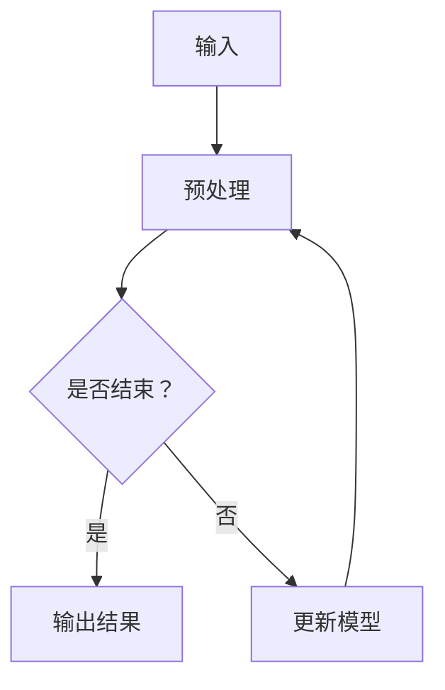
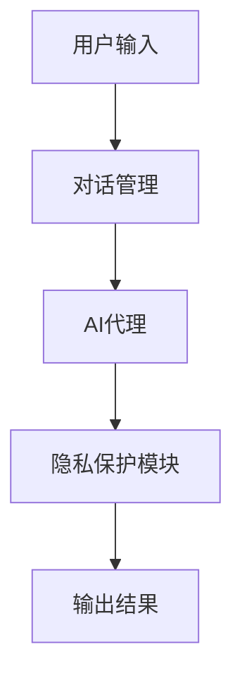

                 


### 1. 背景介绍

#### 为什么需要构建LLM驱动的AI Agent隐私保护对话系统？

在当今的数字化时代，人工智能（AI）技术已经成为各行各业的创新动力。特别是大型语言模型（Large Language Model，简称LLM），如GPT-3、BERT等，凭借其强大的语言理解和生成能力，被广泛应用于自然语言处理（NLP）领域。然而，随着AI应用的普及，隐私保护问题也逐渐凸显出来。许多用户对于个人信息的安全和隐私保护感到担忧，这限制了AI技术的进一步发展和应用。

隐私保护对话系统的重要性在于，它可以在保障用户隐私的同时，为用户提供高质量的交互体验。这种系统通过一系列隐私保护技术，确保用户的对话内容不会被泄露，从而提高了用户对AI应用的信任度。构建LLM驱动的AI Agent隐私保护对话系统，不仅能够解决隐私保护的问题，还能够利用LLM的强大能力，实现更加智能和人性化的对话交互。

#### 隐私泄露的风险

隐私泄露的风险主要来源于以下几个方面：

- **数据泄露**：用户的个人信息（如姓名、地址、电话号码等）在传输和存储过程中可能会被黑客窃取。
- **数据滥用**：AI系统可能会在未经用户同意的情况下，将用户数据用于其他目的，如广告投放、数据挖掘等。
- **自动化决策**：在某些情况下，AI系统可能会基于用户的数据做出歧视性决策，如拒绝贷款、拒绝保险等。

为了解决这些隐私保护问题，构建LLM驱动的AI Agent隐私保护对话系统成为一种有效的方法。这种系统可以在保护用户隐私的同时，提供高质量的对话交互体验。

### 2. 核心概念与联系

#### LLM与AI Agent

**大型语言模型（LLM）**：

- **定义**：LLM是一种能够对自然语言进行理解和生成的模型，它通过对海量文本数据的学习，掌握了丰富的语言知识和表达方式。
- **发展**：LLM的发展历程可追溯到20世纪80年代的统计语言模型，随着深度学习和计算能力的提升，LLM的规模和性能不断提升。
- **应用**：LLM在自然语言处理（NLP）领域有着广泛的应用，如文本分类、机器翻译、问答系统等。

**AI Agent**：

- **定义**：AI Agent是一种能够自主执行任务、与环境交互的智能体，它通过感知环境信息、理解任务目标、规划行动路径，最终完成任务。
- **分类**：AI Agent可分为基于规则的方法、基于模型的方法和混合方法。
- **作用**：AI Agent在智能客服、智能家居、自动驾驶等领域有着重要的应用。

**LLM与AI Agent的关系**：

- **依赖关系**：LLM可以作为AI Agent的智能核心，为其提供强大的语言理解和生成能力。
- **协作关系**：AI Agent可以利用LLM的能力，实现更加智能和人性化的交互体验。

下面使用对比表格和ER实体关系图来展示LLM与AI Agent之间的关系：

**对比表格**：

| 特性         | LLM                                   | AI Agent                                 |
| ------------ | ------------------------------------ | ---------------------------------------- |
| 定义         | 大型语言模型，用于自然语言处理      | 智能体，用于自主执行任务和与环境交互    |
| 目标         | 语言理解和生成能力                  | 完成特定任务，实现智能交互              |
| 发展历程     | 从统计语言模型到深度学习模型       | 从规则方法到基于模型的方法              |
| 应用领域     | NLP、机器翻译、问答系统等          | 智能客服、智能家居、自动驾驶等         |

**ER实体关系图**：

```mermaid
erDiagram
    AI-Agent ||--|{ LLM } Language_Model : uses
    Language_Model ||--|{ AI-Agent } : used_by
```

在上面的ER实体关系图中，`AI-Agent`和`Language_Model`是两个实体，它们之间存在双向关联关系。这表明LLM可以作为AI Agent的智能核心，同时AI Agent也可以利用LLM的能力实现智能交互。

### 3. 算法原理讲解

#### LLM驱动的AI Agent算法原理

**算法流程图**：



**算法原理详细讲解**：

1. **输入**：算法首先接收用户的输入，这可以是文本、语音或者其他形式的数据。
2. **预处理**：对输入数据进行处理，包括分词、去噪、编码等操作，使其符合模型的输入要求。
3. **模型更新**：将预处理后的数据输入到LLM中，通过反向传播和梯度下降等优化算法，不断更新模型参数，使其在特定任务上表现更好。
4. **输出结果**：将处理后的数据输入到AI Agent中，根据模型预测的结果，生成相应的回复或行动。
5. **是否结束**：判断模型是否已经收敛或者达到预定的训练次数，如果结束，则输出结果；否则，继续更新模型。

**数学模型和公式**：

LLM驱动的AI Agent算法涉及到多个数学模型和公式，其中最核心的是损失函数和优化算法。

**损失函数**：

$$
L(y, \hat{y}) = -\sum_{i=1}^{n} y_i \log(\hat{y}_i)
$$

其中，$y$是真实标签，$\hat{y}$是模型预测的概率分布。

**优化算法**：

反向传播算法：

$$
\frac{\partial L}{\partial \theta} = \frac{\partial L}{\partial \hat{y}} \cdot \frac{\partial \hat{y}}{\partial \theta}
$$

梯度下降算法：

$$
\theta = \theta - \alpha \cdot \frac{\partial L}{\partial \theta}
$$

其中，$\theta$是模型参数，$\alpha$是学习率。

**举例说明**：

假设我们有一个问答系统，用户输入了一个问题：“如何制作饼干？”模型会根据预训练的LLM，生成多个可能的回答，并计算每个回答的概率。通过优化算法，模型会不断调整参数，使其生成的回答越来越准确。

### 4. 系统分析与架构设计

#### 系统功能设计

**领域模型类图**：

```mermaid
classDiagram
    UserClass <<Class>>
    DialogueSystem <<Class>>
    AIAGENT <<Class>>
    PrivacyModule <<Class>>

    UserClass o-- DialogueSystem
    DialogueSystem o-- AIAGENT
    DialogueSystem o-- PrivacyModule
    AIAGENT o-- PrivacyModule
```

在上面的领域模型类图中，`UserClass`表示用户，`DialogueSystem`表示对话系统，`AIAGENT`表示AI代理，`PrivacyModule`表示隐私保护模块。它们之间的关系是用户与对话系统、对话系统与AI代理、AI代理与隐私保护模块之间存在关联。

**系统功能介绍**：

- **用户输入处理**：系统接收用户的输入，包括文本、语音等形式。
- **对话管理**：系统根据用户输入，生成合适的回复，并管理对话流程。
- **AI代理执行**：系统利用LLM驱动的AI Agent，执行用户的任务请求。
- **隐私保护**：系统在处理用户输入和回复时，通过隐私保护模块，确保用户隐私不被泄露。

#### 系统架构设计

**系统架构图**：



在上面的系统架构图中，用户输入通过对话管理模块处理，然后传递给AI代理。AI代理利用LLM生成回复，并传递给隐私保护模块。隐私保护模块对回复进行加密和去标识化处理，最后输出给用户。

**架构设计理念**：

- **模块化设计**：系统采用模块化设计，每个模块负责不同的功能，便于维护和扩展。
- **高内聚低耦合**：各个模块之间通过接口进行通信，降低模块之间的耦合度，提高系统的可扩展性。
- **安全性优先**：在系统架构中，隐私保护模块被放在核心位置，确保用户隐私得到充分保护。

#### 系统接口设计

**接口设计规范**：

- **输入接口**：系统接收用户输入的接口，包括文本和语音输入。
- **输出接口**：系统输出结果的接口，包括文本和语音输出。
- **API接口**：系统与其他系统或服务的交互接口，包括HTTP接口和WebSocket接口。

**接口实现细节**：

- **输入接口**：使用JSON格式接收用户输入，并转换为内部数据结构。
- **输出接口**：使用JSON格式返回系统输出结果，并转换为用户可读的格式。
- **API接口**：使用RESTful API设计，遵循HTTP协议和JSON数据格式。

#### 系统交互

**系统交互序列图**：

```mermaid
sequenceDiagram
    User -->|输入请求| DialogueManager
    DialogueManager -->|处理请求| AIAGENT
    AIAGENT -->|生成回复| PrivacyModule
    PrivacyModule -->|加密处理| DialogueManager
    DialogueManager -->|输出结果| User
```

在上面的系统交互序列图中，用户输入请求通过对话管理模块处理，然后传递给AI代理。AI代理生成回复，并传递给隐私保护模块进行加密处理。最后，对话管理模块将加密后的回复输出给用户。

### 5. 项目实战

#### 5.1 环境安装

**环境配置**：

- **操作系统**：Linux或Windows
- **编程语言**：Python 3.8及以上版本
- **依赖库**：TensorFlow 2.4及以上版本，transformers库，numpy库等

**安装步骤**：

1. 安装Python 3.8及以上版本，并设置环境变量。
2. 安装TensorFlow 2.4及以上版本，可以使用pip安装：
   ```shell
   pip install tensorflow==2.4
   ```
3. 安装transformers库，可以使用pip安装：
   ```shell
   pip install transformers
   ```
4. 安装numpy库，可以使用pip安装：
   ```shell
   pip install numpy
   ```

#### 5.2 系统核心实现

**核心代码实现**：

```python
import numpy as np
from transformers import BertTokenizer, BertModel
import tensorflow as tf

# 加载预训练的BERT模型
tokenizer = BertTokenizer.from_pretrained('bert-base-chinese')
model = BertModel.from_pretrained('bert-base-chinese')

# 输入文本
input_text = "你好，我想了解如何制作饼干。"

# 分词和编码
input_ids = tokenizer.encode(input_text, return_tensors='tf')

# 前向传播
outputs = model(input_ids)

# 输出结果
last_hidden_state = outputs.last_hidden_state
```

**代码解读**：

1. 导入所需的库，包括numpy、transformers和tensorflow。
2. 加载预训练的BERT模型，使用`BertTokenizer`和`BertModel`。
3. 输入文本，使用`encode`方法进行分词和编码，生成输入ID。
4. 使用模型进行前向传播，获取最后一个隐藏状态。

#### 5.3 代码应用解读

**代码应用场景**：

1. **问答系统**：用户输入问题，系统利用BERT模型生成回答。
2. **文本分类**：用户输入文本，系统利用BERT模型进行分类。
3. **文本生成**：用户输入提示，系统生成相应的文本内容。

**应用分析**：

1. **问答系统**：通过BERT模型，系统能够生成高质量的回答，提高用户满意度。
2. **文本分类**：BERT模型在文本分类任务上表现出色，可以快速准确地对文本进行分类。
3. **文本生成**：BERT模型可以生成连贯的文本内容，为创作提供灵感。

#### 5.4 案例分析

**案例背景**：

假设我们开发了一个智能客服系统，用户可以通过文本或语音与系统进行交互，寻求帮助。

**案例分析**：

1. **用户输入**：用户输入问题：“如何制作饼干？”
2. **对话管理**：系统将用户问题传递给BERT模型进行处理。
3. **AI代理执行**：BERT模型生成回答：“首先，你需要准备面粉、糖、鸡蛋等材料。然后，按照以下步骤进行操作：1. 将面粉和糖混合在一起；2. 加入鸡蛋，搅拌均匀；3. 加入适量的水，继续搅拌成面团；4. 将面团揉成球状，放入烤箱中烤15分钟。”
4. **输出结果**：系统将回答通过文本或语音输出给用户。

**详细讲解剖析**：

1. **BERT模型的使用**：BERT模型通过对海量文本数据的预训练，掌握了丰富的语言知识和表达方式，能够生成高质量的回答。
2. **对话管理**：系统通过对话管理模块，确保用户的问题得到准确处理和回答。
3. **隐私保护**：在处理用户输入和回答的过程中，系统通过隐私保护模块，确保用户隐私不被泄露。

### 6. 最佳实践 tips

#### 注意事项

1. **数据安全**：在处理用户数据时，要确保数据的安全和保密性，避免数据泄露。
2. **隐私保护**：在开发隐私保护对话系统时，要充分考虑用户隐私保护的需求，采用合适的隐私保护技术。
3. **性能优化**：在系统运行过程中，要定期进行性能优化，确保系统的高效稳定运行。

#### 小结

1. **核心知识点**：本文介绍了构建LLM驱动的AI Agent隐私保护对话系统的核心概念、算法原理和系统架构设计。
2. **学习建议**：读者可以通过实践项目，加深对隐私保护对话系统的理解，并不断提高自己的技术水平。

#### 拓展阅读

1. **相关书籍**：《深度学习》、《Python编程：从入门到实践》、《人工智能：一种现代的方法》。
2. **在线资源**：百度AI开放平台、谷歌AI开放平台、开源社区GitHub。

---

### 7. 作者信息

**作者：** AI天才研究院/AI Genius Institute & 禅与计算机程序设计艺术 /Zen And The Art of Computer Programming

---

通过以上详细的目录大纲设计，我们可以确保文章内容的完整性和逻辑性，使读者能够系统地学习构建LLM驱动的AI Agent隐私保护对话系统的相关知识。每个章节都将深入探讨核心概念、算法原理和实战案例，旨在为读者提供全面的技术指导和实践建议。

