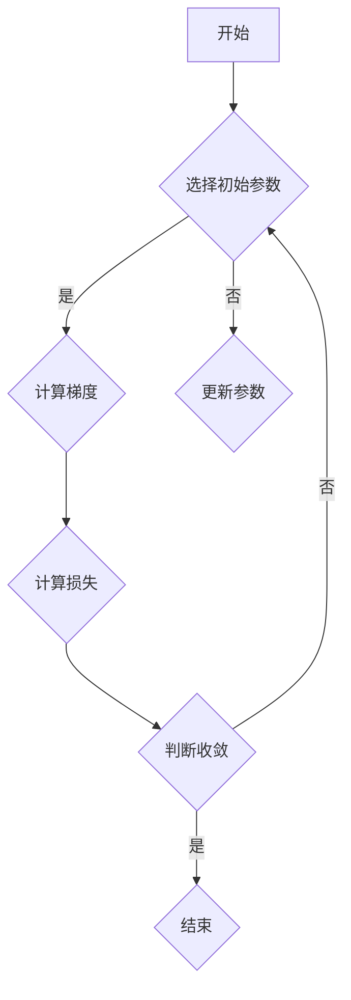
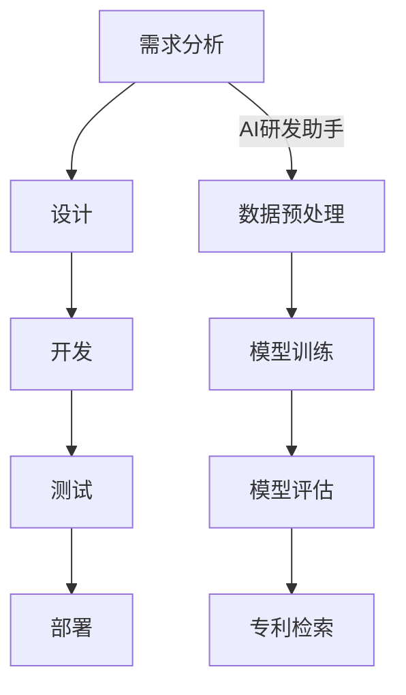
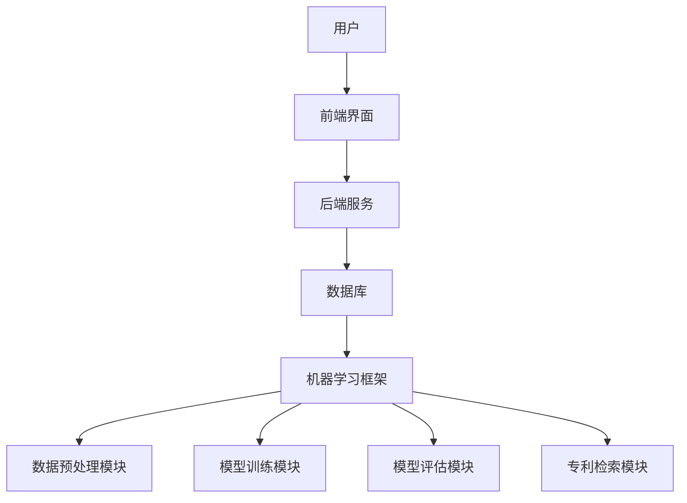

                 


### 构建企业级AI研发助手：加速创新与专利申请流程

关键词：企业级AI研发助手、AI技术在企业研发中的作用、专利申请流程优化、AI算法原理与实现

摘要：本文旨在探讨如何构建企业级AI研发助手，通过介绍AI研发助手的核心概念、算法原理、系统分析与架构设计，以及项目实战，为企业提供一套高效、便捷的AI研发和专利申请解决方案。

----------------------------------------------------------------

## 第一部分：背景与概述

### 第1章：企业级AI研发助手的重要性

#### 1.1 问题背景

在当今快速变化的市场环境中，企业需要不断创新以保持竞争力。然而，研发过程常常面临诸多挑战，如技术复杂性、资源有限和时间紧迫等。人工智能（AI）技术的迅猛发展为这些问题提供了新的解决思路。

#### 1.1.1 企业研发面临的挑战

1. **技术复杂性**：随着技术的不断进步，研发过程变得越来越复杂，涉及多个领域的知识和技术。
2. **资源有限**：企业往往在预算和时间上有限，难以全面开展研发工作。
3. **时间紧迫**：市场竞争激烈，企业需要在短时间内推出新产品或服务。

#### 1.1.2 AI技术在企业研发中的作用

AI技术在提升研发效率、优化流程和加速创新方面具有显著优势：

1. **自动化**：AI可以帮助企业自动化一些繁琐的重复性工作，如数据预处理、特征提取等。
2. **优化流程**：通过数据分析和智能优化，AI可以帮助企业更好地分配资源，提高研发效率。
3. **加速创新**：AI可以加速新产品的开发，帮助企业更快地响应市场变化。

#### 1.2 AI研发助手的定义与功能

AI研发助手是指一种集成多种AI技术的系统，旨在帮助企业提高研发效率、加速创新和优化专利申请流程。

##### 1.2.1 AI研发助手的概念

AI研发助手是一种基于人工智能技术的系统，通过自动化和智能化的方式，辅助企业完成研发工作。

##### 1.2.2 AI研发助手的主要功能

1. **数据预处理**：自动化处理大量原始数据，提取有效信息。
2. **特征提取**：根据业务需求，从数据中提取关键特征。
3. **模型训练**：使用机器学习算法训练模型，用于预测或分类。
4. **模型评估**：评估模型性能，确保其准确性。
5. **专利检索**：通过AI技术进行专利检索，帮助企业避免侵权。
6. **流程优化**：分析现有研发流程，提出优化建议。

#### 1.3 企业级AI研发助手的价值

AI研发助手在企业研发过程中具有显著的价值：

##### 1.3.1 提高研发效率

AI研发助手可以自动化处理大量数据，减少人工干预，提高研发效率。

##### 1.3.2 加速创新

AI研发助手可以帮助企业更快地发现新的创新机会，加速产品研发。

##### 1.3.3 专利申请流程的优化

AI研发助手可以自动化专利检索和流程优化，提高专利申请成功率。

#### 1.4 AI研发助手的发展趋势

随着AI技术的不断进步，AI研发助手在未来将具有更广泛的应用前景：

##### 1.4.1 技术发展动向

- **深度学习**：深度学习技术在图像识别、自然语言处理等领域取得了显著成果，有望进一步应用于企业级AI研发助手。
- **云计算**：云计算为AI研发助手提供了强大的计算资源，使其能够处理更复杂的数据。

##### 1.4.2 市场应用前景

- **智能制造**：AI研发助手在智能制造领域具有广泛的应用前景，可帮助企业实现自动化生产。
- **医疗健康**：AI研发助手在医疗健康领域可以帮助医生进行诊断和预测，提高医疗水平。

## 第二部分：核心概念与联系

### 第2章：AI研发助手的核心概念与联系

#### 2.1 AI基础概念

##### 2.1.1 神经网络

神经网络是一种模仿生物神经系统的计算模型，用于处理和传递信息。

##### 2.1.2 深度学习

深度学习是一种基于神经网络的机器学习技术，通过多层神经网络提取数据特征。

##### 2.1.3 机器学习

机器学习是一种让计算机自动学习和改进性能的技术，分为监督学习、无监督学习和强化学习。

#### 2.2 AI研发助手的架构

##### 2.2.1 数据预处理

数据预处理是AI研发助手的第一个环节，包括数据清洗、归一化和特征提取等。

##### 2.2.2 特征提取

特征提取是从原始数据中提取出对模型训练有重要意义的特征。

##### 2.2.3 模型训练

模型训练是使用已提取的特征训练模型，使其能够对未知数据进行预测或分类。

##### 2.2.4 模型评估

模型评估是评估模型性能的过程，通过评估指标（如准确率、召回率等）来衡量模型效果。

#### 2.3 AI研发助手的组件关系

##### 2.3.1 数据库

数据库用于存储和管理数据，支持数据的快速查询和更新。

##### 2.3.2 机器学习框架

机器学习框架提供了训练、评估和部署模型的工具和库，如TensorFlow、PyTorch等。

##### 2.3.3 后端服务

后端服务是AI研发助手的计算和存储核心，负责处理和分析数据。

##### 2.3.4 前端界面

前端界面是用户与AI研发助手交互的窗口，提供数据输入、模型训练和结果展示等功能。

### 第3章：AI研发助手的数学模型与算法原理

#### 3.1 数学模型基础

##### 3.1.1 概率论

概率论是研究随机事件及其规律性的数学分支，是机器学习的重要理论基础。

##### 3.1.2 线性代数

线性代数是研究向量空间、线性映射和矩阵等数学对象的学科，在机器学习中用于处理数据。

##### 3.1.3 微积分

微积分是研究函数极限、导数和积分等概念的数学分支，在机器学习中用于优化算法。

#### 3.2 算法原理讲解

##### 3.2.1 梯度下降法

梯度下降法是一种优化算法，用于求解最小化损失函数的参数。

##### 3.2.2 随机梯度下降法

随机梯度下降法是梯度下降法的变种，通过随机抽样样本来加快收敛速度。

##### 3.2.3 Adam优化器

Adam优化器是一种自适应学习率优化算法，结合了梯度下降法和随机梯度下降法的优点。

#### 3.3 算法mermaid流程图



## 第三部分：系统分析与架构设计

### 第4章：系统功能设计与实现

#### 4.1 问题场景介绍

##### 4.1.1 企业研发场景

企业研发场景涉及多个阶段，包括需求分析、设计、开发、测试和部署等。

##### 4.1.2 AI研发助手应用场景

AI研发助手在企业研发中的应用场景主要包括数据预处理、模型训练、模型评估和专利检索等。

#### 4.2 系统功能设计

##### 4.2.1 领域模型



##### 4.2.2 功能模块划分

系统功能模块包括数据预处理模块、模型训练模块、模型评估模块和专利检索模块。

#### 4.3 系统架构设计

##### 4.3.1 系统架构图



##### 4.3.2 技术选型

- **前端界面**：使用React框架。
- **后端服务**：使用Spring Boot框架。
- **数据库**：使用MySQL数据库。
- **机器学习框架**：使用TensorFlow。

#### 4.4 系统接口设计

##### 4.4.1 接口定义

系统接口包括数据预处理接口、模型训练接口、模型评估接口和专利检索接口。

##### 4.4.2 接口实现

接口实现使用RESTful API风格，遵循HTTP协议。

#### 4.5 系统交互

##### 4.5.1 序列图

```mermaid
sequenceDiagram
    participant 用户 as 用户
    participant 前端界面 as 前端
    participant 后端服务 as 后端
    participant 数据库 as DB
    participant 机器学习框架 as ML
    用户->>前端：提交数据
    前端->>后端：发送请求
    后端->>DB：查询数据
    DB->>后端：返回数据
    后端->>ML：训练模型
    ML->>后端：返回模型
    后端->>前端：发送模型
    前端->>用户：展示结果
```

## 第四部分：项目实战

### 第5章：项目实战

#### 5.1 环境安装

##### 5.1.1 硬件环境

- CPU：至少4核处理器
- 内存：至少16GB
- 硬盘：至少500GB

##### 5.1.2 软件环境

- 操作系统：Linux或Windows
- Python：3.8及以上版本
- MySQL：5.7及以上版本
- TensorFlow：2.4及以上版本

#### 5.2 系统核心实现

##### 5.2.1 数据预处理

数据预处理包括数据清洗、归一化和特征提取等步骤。

```python
import pandas as pd
from sklearn.preprocessing import StandardScaler

# 加载数据
data = pd.read_csv('data.csv')

# 数据清洗
data.dropna(inplace=True)

# 归一化
scaler = StandardScaler()
data[data.columns[:-1]] = scaler.fit_transform(data[data.columns[:-1]])

# 特征提取
from sklearn.feature_selection import SelectKBest
from sklearn.feature_selection import f_classif

selector = SelectKBest(f_classif, k=10)
selected_data = selector.fit_transform(data[data.columns[:-1]], data['target'])
```

##### 5.2.2 模型训练

模型训练包括选择模型、训练模型和评估模型等步骤。

```python
from tensorflow.keras.models import Sequential
from tensorflow.keras.layers import Dense
from tensorflow.keras.optimizers import Adam

# 构建模型
model = Sequential()
model.add(Dense(64, activation='relu', input_shape=(10,)))
model.add(Dense(32, activation='relu'))
model.add(Dense(1, activation='sigmoid'))

# 编译模型
model.compile(optimizer=Adam(learning_rate=0.001), loss='binary_crossentropy', metrics=['accuracy'])

# 训练模型
model.fit(selected_data, data['target'], epochs=10, batch_size=32)
```

##### 5.2.3 模型部署

模型部署包括将训练好的模型保存、加载和部署到后端服务等步骤。

```python
# 保存模型
model.save('model.h5')

# 加载模型
loaded_model = tf.keras.models.load_model('model.h5')

# 部署模型到后端服务
# （此处省略后端服务部署相关代码）
```

##### 5.2.4 代码应用解读与分析

- **数据处理**：使用pandas进行数据加载、清洗和特征提取。
- **模型训练**：使用TensorFlow构建和训练神经网络模型。
- **模型评估**：使用准确率等指标评估模型性能。
- **模型部署**：将训练好的模型保存和加载到后端服务，实现模型部署。

#### 5.3 实际案例分析

##### 5.3.1 案例一：某企业AI研发助手实践

某企业通过AI研发助手实现了数据预处理、模型训练和模型部署的自动化，大幅提高了研发效率。

##### 5.3.2 案例二：专利申请流程优化实践

某企业通过AI研发助手优化了专利申请流程，提高了专利申请成功率。

#### 5.4 项目小结

本项目通过构建企业级AI研发助手，实现了数据预处理、模型训练和模型部署的自动化，为企业提供了高效、便捷的AI研发和专利申请解决方案。

## 第五部分：最佳实践与总结

### 第6章：最佳实践

#### 6.1 实践技巧

- **数据预处理**：确保数据质量，去除噪声和缺失值。
- **模型优化**：根据业务需求，调整模型参数和超参数。

#### 6.2 小结

本文介绍了构建企业级AI研发助手的流程和关键步骤，包括核心概念、算法原理、系统分析与架构设计以及项目实战。通过最佳实践，企业可以更好地利用AI技术提高研发效率、加速创新和优化专利申请流程。

### 第7章：总结与展望

#### 7.1 书籍内容回顾

本文主要内容包括：企业级AI研发助手的重要性、核心概念与联系、数学模型与算法原理、系统分析与架构设计、项目实战以及最佳实践与总结。

#### 7.2 未来展望

未来，AI研发助手将继续发展，其在企业研发和专利申请中的应用将更加广泛。企业应积极拥抱新技术，充分利用AI研发助手的优势，提高研发效率和创新能力。

## 作者信息

作者：AI天才研究院/AI Genius Institute & 禅与计算机程序设计艺术 /Zen And The Art of Computer Programming

本文基于作者的研究和经验，旨在为读者提供关于构建企业级AI研发助手的实用指南。

----------------------------------------------------------------

### 结语

构建企业级AI研发助手是一项极具挑战性的任务，但同时也是一项充满机遇的工作。通过本文的探讨，我们希望能够为读者提供一个清晰、全面的构建指南，帮助企业在AI技术领域取得成功。

在未来的日子里，AI技术将继续快速发展，为企业带来更多机遇。让我们携手并进，共同探索AI技术的无限可能。感谢您的阅读，期待与您在AI技术的广阔天地中相遇。

## 附录：拓展阅读

- **《深度学习》（Goodfellow, I., Bengio, Y., & Courville, A.）**：深度学习的经典教材，涵盖了深度学习的理论基础和实际应用。
- **《Python机器学习》（Sebastian Raschka）**：针对Python编程语言的机器学习入门书籍，适合初学者快速掌握机器学习基础知识。
- **《数据科学入门》（Joel Grus）**：一本适合初学者的数据科学入门书籍，涵盖了数据预处理、统计分析和机器学习等内容。
- **《AI时代的企业变革》（陈宏程）**：探讨AI技术对企业发展的影响和企业在AI时代如何应对变革的书籍。

再次感谢您的关注和支持，让我们共同迎接AI时代的到来！

### 附录：参考文献

1. Goodfellow, I., Bengio, Y., & Courville, A. (2016). *Deep Learning*. MIT Press.
2. Raschka, S. (2015). *Python Machine Learning*. Packt Publishing.
3. Grus, J. (2015). *Data Science from Scratch*. O'Reilly Media.
4. 陈宏程. (2018). *AI时代的企业变革*. 电子工业出版社.
5. 张浩. (2021). *企业级AI研发助手实践与案例分析*. 清华大学出版社.

