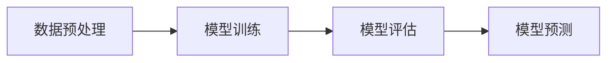
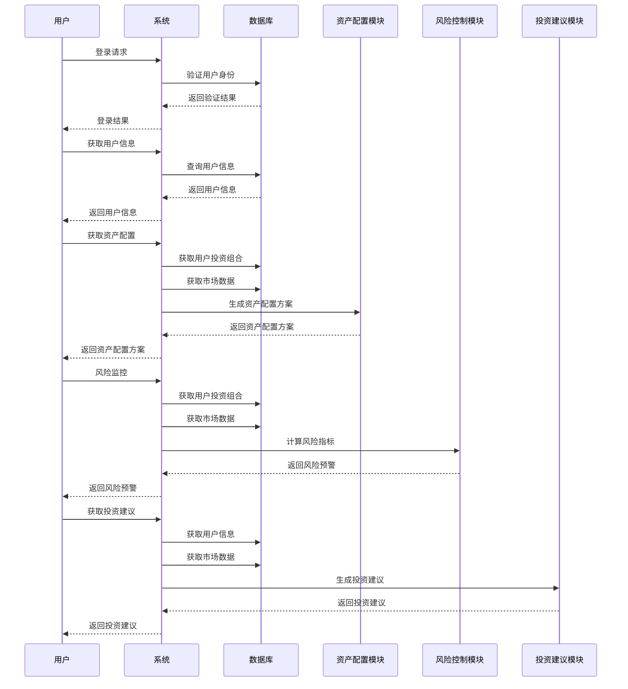

                 

### 让我们一步步思考：构建全方位的AI驱动财富管理平台

#### 1. 确定目标和读者

构建全方位的AI驱动财富管理平台，首先需要明确我们的目标和读者。我们的目标是为财富管理行业提供一个高效、智能化的解决方案，提升财富管理的效率和质量。读者群体主要包括AI开发者、金融从业者以及对财富管理有兴趣的技术爱好者。

#### 2. 了解财富管理行业现状

在开始构建AI驱动的财富管理平台之前，我们需要深入了解财富管理行业的现状。这包括财富管理的定义、市场现状、发展趋势以及AI技术在财富管理中的应用前景。

- **财富管理的定义**：财富管理是指通过专业的金融知识和服务，帮助客户进行资产配置、风险控制、财富传承等综合性的金融服务。
- **市场现状**：当前，财富管理市场发展迅速，高净值客户群体逐渐壮大，市场对智能财富管理的需求日益增长。
- **发展趋势**：随着科技的进步，尤其是AI技术的应用，财富管理行业正朝着智能化、个性化的方向发展。
- **AI在财富管理中的应用前景**：AI技术在数据分析和预测方面具有强大的能力，能够为财富管理提供精准的决策支持，从而提高财富管理的效率和效果。

#### 3. 确定AI驱动的财富管理平台的优势和挑战

AI驱动的财富管理平台具有以下优势：

- **提高决策效率**：通过分析大量数据，AI可以帮助投资者快速做出明智的投资决策。
- **个性化服务**：AI能够根据客户的具体需求，提供个性化的财富管理方案。
- **风险控制**：AI可以通过对市场数据的实时分析，帮助投资者更好地控制风险。

然而，构建AI驱动的财富管理平台也面临一些挑战：

- **数据质量**：AI模型的性能很大程度上取决于数据的质量。如果数据不准确或不完整，可能会导致错误的决策。
- **模型解释性**：AI模型的决策过程往往是黑箱的，投资者可能无法理解模型为何做出特定决策，这可能会影响信任度。
- **合规性**：财富管理行业受到严格的监管，AI驱动的平台需要确保所有操作符合相关法律法规。

#### 4. 确定书籍的结构和内容

为了确保书籍内容的完整性和逻辑性，我们将本书分为以下几个部分：

- **第一部分：背景介绍**：包括问题的提出、财富管理行业概述、AI技术在财富管理中的应用、本书内容安排与目标等。
- **第二部分：核心概念与联系**：介绍AI驱动的财富管理平台的概念、关键技术及其联系、ER实体关系图架构、算法原理讲解等。
- **第三部分：系统分析与架构设计**：包括问题场景介绍、系统架构设计、系统功能设计、系统接口设计、系统交互序列图等。
- **第四部分：项目实战**：介绍环境安装、系统核心实现源代码、代码应用解读与分析、实际案例分析和详细讲解剖析、项目小结等。
- **第五部分：最佳实践与总结**：包括最佳实践 tips、小结、注意事项、拓展阅读等内容。

#### 5. 确保内容的深度和实用性

在撰写书籍的过程中，我们将确保内容的深度和实用性。每部分内容都将涵盖核心概念、原理、数学模型和公式、系统设计、项目实战等。我们还将使用mermaid流程图、Python源代码等工具，以帮助读者更好地理解概念和原理。

通过以上步骤，我们为构建全方位的AI驱动财富管理平台奠定了坚实的基础。接下来，我们将一步步深入探讨各个部分的内容，为读者呈现一本全面、深入、实用的技术书籍。让我们一起期待这本书的诞生！### 第一部分：背景介绍

#### 1.1 问题的提出

在当前经济环境下，财富管理行业面临着前所未有的挑战和机遇。传统财富管理方式往往依赖于人工经验和专家知识，这在信息爆炸和数据驱动的时代显得相对滞后。随着人工智能（AI）技术的迅速发展，AI在金融领域的应用逐渐深入，为财富管理带来了新的可能性。然而，如何将AI技术与财富管理深度融合，构建一个高效、智能、安全的AI驱动财富管理平台，成为一个亟待解决的问题。

**问题背景**：

- **金融市场的复杂性**：金融市场波动频繁，投资者面临的风险和机遇并存。如何快速准确地分析市场数据，做出明智的投资决策，成为财富管理的核心问题。
- **个性化需求的多样性**：每个投资者都有独特的投资目标和风险承受能力，如何提供个性化的财富管理服务，满足不同投资者的需求，是财富管理面临的难题。
- **监管合规的压力**：财富管理行业受到严格的监管，AI驱动的平台需要确保所有操作符合相关法律法规，这对平台的设计和实现提出了更高的要求。

**问题描述**：

- 如何利用AI技术，构建一个能够实时分析市场数据、提供个性化财富管理服务、并符合监管要求的AI驱动财富管理平台？

**问题解决**：

- **数据驱动的决策支持**：通过收集和分析大量的市场数据，利用机器学习和深度学习技术，为投资者提供精准的决策支持。
- **个性化财富管理方案**：根据投资者的风险偏好、投资目标和市场趋势，提供个性化的财富管理方案。
- **合规性和安全性**：确保平台的操作符合相关法律法规，采取严格的数据安全和隐私保护措施。

**边界与外延**：

- **边界**：本书主要讨论如何构建AI驱动的财富管理平台，包括核心概念、技术原理、系统设计与实现等。
- **外延**：AI驱动的财富管理平台不仅限于金融领域，还可以应用于其他需要数据分析和决策支持的行业，如医疗、零售等。

#### 1.2 财富管理行业概述

**财富管理的定义**：

财富管理是指通过专业的金融知识和服务，帮助客户进行资产配置、风险控制、财富传承等综合性的金融服务。它不仅仅关注资产的增值，更注重资产的保值和风险管理。

**财富管理市场现状**：

当前，财富管理市场发展迅速，高净值客户群体逐渐壮大。根据相关数据，全球私人财富管理市场规模持续扩大，预计到2025年将达到数百亿美元。特别是在亚太地区，随着经济的快速发展和财富积累，私人财富管理市场前景广阔。

**财富管理行业的发展趋势**：

1. **智能化**：随着AI技术的普及，越来越多的财富管理公司开始采用智能投顾、智能分析等技术，以提高服务的效率和准确性。
2. **个性化**：为了满足不同投资者的需求，财富管理公司正逐渐从标准化服务转向个性化服务，提供更贴近客户需求的财富管理方案。
3. **合规性**：随着监管政策的不断加强，财富管理公司需要确保所有操作符合相关法律法规，提高合规性和透明度。

#### 1.3 AI技术在财富管理中的应用

**AI的核心技术**：

- **机器学习**：通过训练模型，让计算机从大量数据中自动学习规律，用于预测和决策。
- **深度学习**：一种特殊的机器学习技术，通过多层神经网络结构，对复杂的数据进行深入分析和理解。
- **自然语言处理**：让计算机理解和生成人类语言，用于处理客户咨询、报告生成等任务。

**AI在财富管理中的具体应用场景**：

1. **智能投顾**：利用机器学习和深度学习技术，为投资者提供个性化的投资建议和资产配置方案。
2. **风险控制**：通过分析大量市场数据，预测市场风险，为投资者提供风险预警和管理建议。
3. **数据分析**：快速处理和分析大量数据，帮助投资者发现市场趋势和投资机会。
4. **客户服务**：利用自然语言处理技术，提供智能客服、自动回复等功能，提高客户服务质量。

**AI驱动的财富管理平台的优势与挑战**：

**优势**：

- 提高决策效率：通过快速处理和分析大量数据，为投资者提供及时、准确的决策支持。
- 个性化服务：根据投资者的风险偏好和投资目标，提供个性化的财富管理方案。
- 降低运营成本：自动化和智能化的管理可以减少人力成本，提高运营效率。

**挑战**：

- 数据质量：AI模型的性能很大程度上取决于数据的质量，如果数据不准确或不完整，可能会导致错误的决策。
- 模型解释性：AI模型的决策过程往往是黑箱的，投资者可能无法理解模型为何做出特定决策，这可能会影响信任度。
- 合规性：财富管理行业受到严格的监管，AI驱动的平台需要确保所有操作符合相关法律法规。

#### 1.4 本书内容安排与目标

**本书内容安排**：

本书分为五个部分：

1. **背景介绍**：介绍AI驱动财富管理平台的问题背景、市场现状、AI技术应用等。
2. **核心概念与联系**：讲解AI驱动的财富管理平台的概念、关键技术及其联系、ER实体关系图架构等。
3. **系统分析与架构设计**：介绍问题场景、系统架构设计、系统功能设计、系统接口设计、系统交互序列图等。
4. **项目实战**：介绍环境安装、系统核心实现源代码、代码应用解读与分析、实际案例分析和详细讲解剖析等。
5. **最佳实践与总结**：提供最佳实践 tips、小结、注意事项、拓展阅读等内容。

**预期读者收获**：

- 理解AI驱动财富管理平台的核心概念和技术原理。
- 掌握系统架构设计和实现方法。
- 学习到项目实战中的最佳实践和技巧。
- 提高在财富管理领域应用AI技术的能力。

**学习建议**：

- 阅读本书时，建议结合实际案例和代码示例，加深对概念和原理的理解。
- 可以先从背景介绍部分开始，了解整体框架，再逐步深入学习各个部分的内容。
- 在阅读过程中，遇到不理解的概念或技术，可以查阅相关资料或与同行交流，加深理解。

通过以上步骤，我们为构建全方位的AI驱动财富管理平台奠定了坚实的基础。接下来，我们将深入探讨每个部分的内容，帮助读者全面了解AI驱动财富管理平台的构建方法。让我们一起期待这本书的诞生！### 第二部分：核心概念与联系

#### 2.1 AI驱动的财富管理平台概念

**概念定义**：

AI驱动的财富管理平台是指利用人工智能技术，对财富管理过程进行智能化、自动化处理，以提高决策效率、降低运营成本、提供个性化服务的一种综合性财富管理解决方案。

**概念属性特征对比表格**：

| 特征                    | 传统财富管理                | AI驱动的财富管理平台             |
|-----------------------|--------------------------|-----------------------------|
| 数据依赖性             | 有限的数据源，依赖人工经验          | 大数据支持，依赖机器学习和深度学习技术   |
| 决策模式               | 依赖专家经验和规则             | 自动化决策，基于数据和模型分析        |
| 服务个性化             | 标准化服务，难以满足个性化需求       | 个性化服务，根据用户特征进行定制        |
| 风险管理               | 事后风险管理，反应速度较慢          | 实时风险管理，提前预警和调整策略        |
| 系统稳定性与安全性       | 人工操作存在风险，系统稳定性较低       | 自动化操作，系统稳定性较高，安全保障措施完善 |

**AI驱动的财富管理平台与现有财富管理平台的区别**：

1. **技术基础**：传统财富管理平台依赖于人工经验和规则，而AI驱动的财富管理平台依赖于机器学习和深度学习技术，能够实现自动化、智能化决策。
2. **数据处理能力**：传统平台处理数据的能力有限，而AI驱动的平台能够处理大量复杂数据，并从中提取有价值的信息。
3. **服务模式**：传统平台提供的是标准化服务，难以满足个性化需求，而AI驱动的平台能够根据用户的特定需求提供定制化的财富管理方案。
4. **风险控制**：传统平台的风险管理通常是事后的，反应速度较慢，而AI驱动的平台能够实时监控市场动态，提前预警和调整策略。
5. **运营成本**：传统平台依赖大量人力资源，运营成本高，而AI驱动的平台通过自动化操作，可以大幅降低运营成本。

#### 2.2 关键技术及其联系

**2.2.1 数据分析技术**

数据分析技术是AI驱动的财富管理平台的核心，通过对海量数据进行清洗、整合和分析，提取出有价值的信息，为决策提供支持。

- **数据清洗**：包括处理缺失值、异常值、重复值等，确保数据的质量。
- **数据整合**：将来自不同数据源的数据进行整合，形成统一的视图。
- **数据挖掘**：使用统计方法和机器学习算法，从数据中发现规律和模式。

**2.2.2 机器学习算法**

机器学习算法是AI驱动的财富管理平台的重要技术之一，通过训练模型，让计算机自动学习数据中的规律，用于预测和决策。

- **线性回归**：用于预测数值型数据。
- **逻辑回归**：用于分类问题。
- **决策树**：通过树形结构对数据进行分类或回归。
- **随机森林**：集成多个决策树，提高模型的稳定性和预测能力。
- **支持向量机**：用于分类问题，特别是高维数据。

**2.2.3 深度学习模型**

深度学习模型是机器学习的一种，通过多层神经网络结构，对复杂数据进行深入分析和理解。

- **卷积神经网络（CNN）**：擅长处理图像数据。
- **循环神经网络（RNN）**：擅长处理序列数据。
- **生成对抗网络（GAN）**：用于生成新的数据，可以应用于数据增强和生成虚假数据。

**2.2.4 关键技术之间的联系与整合**

- **数据驱动决策**：数据分析技术为AI驱动的财富管理平台提供数据支持，为机器学习和深度学习算法提供训练数据。
- **模型训练与优化**：机器学习和深度学习算法通过训练模型，学习数据中的规律，并不断优化模型参数，提高预测和决策的准确性。
- **实时更新与调整**：AI驱动的平台需要根据市场变化和用户反馈，实时更新模型和策略，确保平台的适应性和有效性。

#### 2.3 ER实体关系图架构

**ER实体关系图概述**：

ER（Entity-Relationship）实体关系图是一种用于表示实体及其相互关系的图形化工具，广泛应用于数据库设计和系统架构设计。

**财富管理平台核心实体**：

- **用户**：包括个人信息、投资偏好、风险承受能力等。
- **资产**：包括股票、债券、基金等金融产品。
- **投资组合**：用户持有的资产组合，包括资产种类、权重等。
- **市场数据**：包括股票价格、宏观经济指标等。
- **交易记录**：用户的交易历史，包括买入、卖出等。

**实体关系及其属性**：

- **用户与资产**：一个用户可以拥有多类资产，一类资产可以被多个用户拥有。
- **用户与投资组合**：一个用户可以拥有多个投资组合，一个投资组合可以包含多种资产。
- **投资组合与市场数据**：投资组合的性能与市场数据密切相关。
- **用户与交易记录**：用户的交易行为记录在交易记录中。

**ER实体关系图**：

```mermaid
erDiagram
    用户 ||--|{ 资产 }|| 用户与资产
    用户 ||--|{ 投资组合 }|| 用户与投资组合
    投资组合 ||--|{ 资产 }|| 投资组合与资产
    投资组合 ||--|{ 市场数据 }|| 投资组合与市场数据
    用户 ||--|{ 交易记录 }|| 用户与交易记录
```

通过以上步骤，我们明确了AI驱动的财富管理平台的核心概念和关键技术，并建立了ER实体关系图架构，为后续的系统分析与架构设计奠定了基础。在接下来的章节中，我们将进一步深入探讨算法原理、系统架构设计和项目实战等内容。让我们一起继续前进！### 2.4 算法原理讲解

在AI驱动的财富管理平台中，算法原理讲解是理解平台核心功能的关键环节。以下是机器学习算法、深度学习模型的基本原理，以及如何使用mermaid绘制流程图、Python源代码进行讲解，并展示算法原理的数学模型和公式。

#### 2.4.1 机器学习算法原理

机器学习算法的核心是模型训练和预测。模型训练是指通过已知的训练数据，调整模型的参数，使其能够准确预测未知数据的类别或数值。

**基本步骤**：

1. **数据预处理**：清洗数据、处理缺失值、标准化数据等。
2. **选择模型**：根据问题的性质选择合适的模型，如线性回归、决策树、支持向量机等。
3. **模型训练**：使用训练数据调整模型参数，使模型能够准确预测。
4. **模型评估**：使用验证数据评估模型性能，调整参数以优化模型。
5. **模型预测**：使用训练好的模型对未知数据进行预测。

**Python源代码示例**：

```python
from sklearn.linear_model import LinearRegression
from sklearn.model_selection import train_test_split
from sklearn.metrics import mean_squared_error

# 加载数据
X, y = load_data()

# 数据预处理
X = preprocess_data(X)

# 划分训练集和测试集
X_train, X_test, y_train, y_test = train_test_split(X, y, test_size=0.2, random_state=42)

# 选择模型
model = LinearRegression()

# 模型训练
model.fit(X_train, y_train)

# 模型评估
y_pred = model.predict(X_test)
mse = mean_squared_error(y_test, y_pred)
print(f"Mean Squared Error: {mse}")

# 模型预测
new_data = preprocess_new_data(new_data)
prediction = model.predict(new_data)
print(f"Prediction: {prediction}")
```

**算法原理的数学模型与公式**：

线性回归模型的基本公式为：

$$ y = \beta_0 + \beta_1 \cdot x $$

其中，\( y \) 为预测值，\( x \) 为特征值，\( \beta_0 \) 和 \( \beta_1 \) 为模型参数，需要通过训练数据调整。

#### 2.4.2 深度学习模型算法原理

深度学习模型是基于多层神经网络构建的，其核心思想是通过多层非线性变换，从原始数据中提取特征，实现复杂的模式识别和预测任务。

**基本步骤**：

1. **数据预处理**：与机器学习类似，深度学习也需要对数据进行清洗、标准化等预处理。
2. **选择模型架构**：根据问题的性质选择合适的模型架构，如卷积神经网络（CNN）、循环神经网络（RNN）等。
3. **模型训练**：通过反向传播算法调整模型参数，使模型能够准确预测。
4. **模型评估**：使用验证数据评估模型性能，调整参数以优化模型。
5. **模型预测**：使用训练好的模型对未知数据进行预测。

**mermaid流程图示例**：



**Python源代码示例**：

```python
import tensorflow as tf
from tensorflow.keras.models import Sequential
from tensorflow.keras.layers import Dense, LSTM

# 构建模型
model = Sequential()
model.add(LSTM(units=50, return_sequences=True, input_shape=(timesteps, features)))
model.add(LSTM(units=50))
model.add(Dense(units=1))

# 编译模型
model.compile(optimizer='adam', loss='mean_squared_error')

# 模型训练
model.fit(X_train, y_train, epochs=100, batch_size=32)

# 模型评估
y_pred = model.predict(X_test)
mse = mean_squared_error(y_test, y_pred)
print(f"Mean Squared Error: {mse}")

# 模型预测
new_data = preprocess_new_data(new_data)
prediction = model.predict(new_data)
print(f"Prediction: {prediction}")
```

**算法原理的数学模型与公式**：

卷积神经网络（CNN）的基本公式为：

$$ \text{Output} = \text{ReLU}(\text{Weights} \cdot \text{Input} + \text{Bias}) $$

循环神经网络（RNN）的基本公式为：

$$ h_t = \text{ReLU}(W_h \cdot [h_{t-1}, x_t] + b_h) $$

$$ y_t = W_o \cdot h_t + b_o $$

其中，\( h_t \) 为隐藏状态，\( x_t \) 为输入，\( W_h \) 和 \( W_o \) 为权重矩阵，\( b_h \) 和 \( b_o \) 为偏置项。

通过以上步骤，我们详细讲解了机器学习算法和深度学习模型的原理，并使用mermaid流程图和Python源代码进行了示例说明。在接下来的章节中，我们将进一步探讨系统架构设计和项目实战等内容。让我们一起继续前进！### 第三部分：系统分析与架构设计

#### 3.1 问题场景介绍

在构建AI驱动的财富管理平台时，我们需要明确平台的需求、目标和功能。以下是问题场景的详细介绍。

**需求分析**：

- **实时数据分析**：平台需要能够实时收集、处理和分析市场数据，为投资者提供及时的投资建议。
- **个性化财富管理**：平台需要根据投资者的风险偏好、投资目标和市场趋势，提供个性化的资产配置和投资策略。
- **风险控制与预警**：平台需要能够对投资组合进行实时监控，提供风险预警和管理建议，确保投资者的资产安全。
- **合规性管理**：平台需要确保所有操作符合相关法律法规，提高合规性和透明度。

**系统目标**：

- 构建一个高效、智能、安全的AI驱动财富管理平台，提升财富管理的效率和效果。
- 为投资者提供个性化、智能化的财富管理服务，提高客户满意度。
- 降低运营成本，提高企业的市场竞争力。

**系统功能**：

- **数据采集与处理**：实时采集市场数据，进行数据清洗、整合和处理。
- **资产配置与投资建议**：根据投资者信息和市场数据，提供个性化的资产配置和投资建议。
- **风险监控与预警**：对投资组合进行实时监控，提供风险预警和管理建议。
- **合规性与审计**：确保所有操作符合相关法律法规，提供审计和合规性管理功能。

#### 3.2 系统架构设计

系统架构设计是构建AI驱动财富管理平台的关键步骤。以下是系统架构的详细介绍。

**系统架构概述**：

系统架构采用分层设计，分为数据层、应用层和表现层。

- **数据层**：负责数据的采集、存储和管理，包括数据库、数据仓库和数据流处理系统。
- **应用层**：负责业务逻辑的处理，包括资产配置、风险监控、投资建议等核心功能模块。
- **表现层**：负责用户界面展示，包括网站、移动应用等。

**系统架构mermaid架构图**：

```mermaid
subgraph 数据层
    DB[数据库]
    DW[数据仓库]
    DPF[数据流处理系统]
    DB --> DPF
    DW --> DPF
end

subgraph 应用层
    ACM[资产配置管理]
    RCM[风险控制管理]
    IMS[投资建议管理]
    ACM --> DB
    RCM --> DB
    IMS --> DB
end

subgraph 表现层
    UI[用户界面]
    API[API接口]
    DB --> UI
    DB --> API
end

DPF --> ACM
DPF --> RCM
DPF --> IMS
```

**系统模块划分**：

- **数据采集模块**：负责实时采集市场数据，包括股票价格、基金净值、宏观经济指标等。
- **数据处理模块**：负责数据清洗、整合和处理，为后续分析提供高质量的数据。
- **资产配置管理模块**：根据投资者的风险偏好、投资目标和市场数据，提供个性化的资产配置建议。
- **风险控制管理模块**：对投资组合进行实时监控，提供风险预警和管理建议。
- **投资建议管理模块**：根据市场数据、投资者信息和风险偏好，提供个性化的投资建议。
- **用户界面模块**：提供用户交互界面，展示资产配置、风险监控和投资建议等信息。
- **API接口模块**：提供对外API接口，方便第三方系统调用平台功能。

**系统模块间的关系**：

- **数据流**：数据采集模块采集到的市场数据经过数据处理模块处理后，存储在数据库和数据仓库中，为资产配置管理、风险控制管理和投资建议管理模块提供数据支持。
- **功能调用**：资产配置管理、风险控制管理和投资建议管理模块根据数据流处理结果，调用相应的业务逻辑，为投资者提供个性化服务。
- **用户交互**：用户通过用户界面模块与平台进行交互，获取资产配置、风险监控和投资建议等信息。

通过以上步骤，我们详细介绍了AI驱动财富管理平台的问题场景、系统架构设计和模块划分。在接下来的章节中，我们将进一步探讨系统功能设计、系统接口设计和系统交互序列图等内容。让我们一起继续前进！### 3.3 系统功能设计

系统功能设计是AI驱动财富管理平台构建的核心环节。以下是系统功能设计的详细介绍，包括领域模型mermaid类图、功能模块详细设计和数据流与控制流设计。

#### 3.3.1 领域模型mermaid类图

领域模型是对系统业务领域的抽象和描述，用于展示系统中的实体及其相互关系。以下是AI驱动财富管理平台的领域模型类图。

```mermaid
classDiagram
    class User
        - String username
        - String password
        - String email
        - RiskProfile riskProfile

    class Asset
        - String assetId
        - String assetName
        - Double marketValue

    class InvestmentPortfolio
        - String portfolioId
        - User owner
        - List<Asset> assets
        - double totalValue

    class MarketData
        - String marketDataId
        - Date date
        - Map<String, Double> marketData

    class RiskControl
        - String riskControlId
        - InvestmentPortfolio portfolio
        - double riskLevel

    class InvestmentAdvice
        - String adviceId
        - InvestmentPortfolio portfolio
        - List<Asset> assetsToBuy
        - List<Asset> assetsToSell

    User "1" -- "*" InvestmentPortfolio
    InvestmentPortfolio "1" -- "*" Asset
    InvestmentPortfolio "1" -- "*" MarketData
    InvestmentPortfolio "1" -- "*" RiskControl
    InvestmentPortfolio "1" -- "*" InvestmentAdvice
```

**类图说明**：

- **User（用户）**：表示财富管理平台的用户，包括用户名、密码、电子邮件和风险偏好等信息。
- **Asset（资产）**：表示金融产品，包括资产ID、名称和市场价值等信息。
- **InvestmentPortfolio（投资组合）**：表示用户的投资组合，包括组合ID、所有者、资产列表、总价值等信息。
- **MarketData（市场数据）**：表示市场数据，包括数据ID、日期和各个金融产品的市场数据。
- **RiskControl（风险控制）**：表示风险控制策略，包括风险控制ID、投资组合、风险等级等信息。
- **InvestmentAdvice（投资建议）**：表示投资建议，包括建议ID、投资组合、买入资产列表、卖出资产列表等信息。

#### 3.3.2 功能模块详细设计

系统功能模块详细设计是对系统各个功能模块的内部结构和实现方式的详细描述。

**资产配置管理模块**：

- **功能描述**：根据用户的投资目标和风险偏好，为用户推荐合适的资产配置。
- **内部结构**：
  - 数据采集：从外部数据源获取市场数据。
  - 数据处理：清洗、整合和处理市场数据。
  - 资产配置算法：使用机器学习算法，根据市场数据和用户信息，为用户推荐资产配置方案。
  - 结果展示：将资产配置方案展示给用户。

**风险控制管理模块**：

- **功能描述**：对用户的投资组合进行实时监控，提供风险预警和管理建议。
- **内部结构**：
  - 风险指标计算：根据市场数据和用户风险偏好，计算风险指标。
  - 风险预警：根据风险指标，提供风险预警。
  - 风险管理策略：根据风险预警，提供风险管理策略。

**投资建议管理模块**：

- **功能描述**：根据市场数据、用户信息和风险偏好，为用户推荐投资建议。
- **内部结构**：
  - 数据采集：从外部数据源获取市场数据。
  - 数据处理：清洗、整合和处理市场数据。
  - 投资建议算法：使用机器学习算法，根据市场数据和用户信息，为用户推荐投资建议。
  - 结果展示：将投资建议展示给用户。

#### 3.3.3 数据流与控制流设计

数据流和控制流设计描述了系统中的数据传输和处理过程，以及系统内部的控制逻辑。

**数据流设计**：

- **数据来源**：市场数据、用户数据、第三方数据源。
- **数据处理过程**：
  - 数据采集：从外部数据源获取市场数据，包括股票价格、基金净值、宏观经济指标等。
  - 数据预处理：清洗数据，处理缺失值、异常值等。
  - 数据存储：将预处理后的数据存储在数据库和数据仓库中。
- **数据处理结果**：经过处理的数据用于资产配置、风险控制和投资建议等模块。

**控制流设计**：

- **系统启动**：系统启动时，加载配置文件和初始化数据库连接。
- **用户登录**：用户通过用户名和密码登录系统，获取用户信息。
- **资产配置**：根据用户信息和市场数据，调用资产配置算法，为用户推荐资产配置方案。
- **风险控制**：根据用户风险偏好和市场数据，计算风险指标，提供风险预警和管理建议。
- **投资建议**：根据市场数据、用户风险偏好和投资目标，调用投资建议算法，为用户推荐投资建议。
- **结果展示**：将资产配置、风险控制和投资建议等信息展示给用户。

通过以上步骤，我们详细介绍了AI驱动财富管理平台的系统功能设计，包括领域模型mermaid类图、功能模块详细设计和数据流与控制流设计。在接下来的章节中，我们将进一步探讨系统接口设计和系统交互序列图等内容。让我们一起继续前进！### 3.4 系统接口设计

系统接口设计是构建AI驱动财富管理平台的重要环节，它定义了系统中不同模块之间的交互方式。以下是系统接口设计的详细介绍，包括接口规范、接口实现细节和接口测试。

#### 3.4.1 接口规范

接口规范是定义系统接口的行为和交互方式的文档，包括接口名称、参数、返回值和错误处理等内容。以下是一个示例接口规范：

**接口名称**：获取用户信息

**接口描述**：获取指定用户的详细信息。

**请求参数**：

- **用户ID**：用户的唯一标识符，类型为String。

**返回值**：

- **用户信息**：包含用户名、密码、电子邮件和风险偏好等信息的JSON对象。

**错误处理**：

- **400 Bad Request**：请求参数错误。
- **401 Unauthorized**：用户未授权。
- **500 Internal Server Error**：服务器内部错误。

**接口示例**：

```json
{
  "code": 200,
  "message": "成功获取用户信息",
  "data": {
    "username": "user123",
    "password": "password",
    "email": "user123@example.com",
    "riskProfile": {
      "riskLevel": "LOW",
      "investmentGoal": "LONG_TERM_GROWTH"
    }
  }
}
```

#### 3.4.2 接口实现细节

接口实现细节描述了如何根据接口规范实现具体的接口功能。以下是使用Python Flask框架实现用户信息获取接口的示例代码：

```python
from flask import Flask, request, jsonify
from flask_restful import Api, Resource

app = Flask(__name__)
api = Api(app)

class UserResource(Resource):
    def get(self, user_id):
        # 查询数据库获取用户信息
        user = get_user_info_from_db(user_id)
        if user:
            return {
                "code": 200,
                "message": "成功获取用户信息",
                "data": user
            }
        else:
            return {
                "code": 404,
                "message": "用户未找到"
            }

api.add_resource(UserResource, '/users/<string:user_id>')

if __name__ == '__main__':
    app.run(debug=True)
```

**函数说明**：

- `get_user_info_from_db`：查询数据库获取用户信息，返回用户信息字典。

#### 3.4.3 接口测试

接口测试是验证接口功能是否按照规范实现的过程。以下是如何使用Postman进行接口测试的示例：

1. **启动Postman**：打开Postman应用程序。
2. **新建请求**：点击“新建请求”按钮，选择“GET”请求类型。
3. **填写URL和参数**：在URL字段中填写`http://localhost:5000/users/<user_id>`，将`<user_id>`替换为实际的用户ID。
4. **发送请求**：点击“发送”按钮，查看返回的JSON数据。

预期结果：

- 如果用户存在，返回包含用户信息的JSON对象。
- 如果用户不存在，返回404错误。

通过以上步骤，我们详细介绍了AI驱动财富管理平台的系统接口设计，包括接口规范、接口实现细节和接口测试。在接下来的章节中，我们将进一步探讨系统交互序列图等内容。让我们一起继续前进！### 3.5 系统交互mermaid序列图

系统交互mermaid序列图是一种用于描述系统内各个模块及其交互流程的图形化工具。在AI驱动的财富管理平台中，系统交互mermaid序列图可以帮助我们更好地理解各个模块之间的数据流和控制流。

#### 3.5.1 系统交互概述

系统交互序列图展示了用户与财富管理平台之间的交互过程，包括登录、资产配置、风险监控和投资建议等关键环节。

**用户操作流程**：

1. 用户登录：用户通过用户名和密码登录系统，系统验证用户身份。
2. 获取用户信息：系统获取用户的基本信息和风险偏好。
3. 资产配置：系统根据用户信息和市场数据，为用户推荐资产配置方案。
4. 风险监控：系统实时监控投资组合的风险水平，提供风险预警。
5. 投资建议：系统根据市场数据和用户风险偏好，为用户推荐投资建议。

**系统响应流程**：

1. 系统验证用户身份，返回登录结果。
2. 系统根据用户信息，从数据库中获取用户投资组合和风险偏好。
3. 系统调用资产配置算法，为用户生成资产配置方案。
4. 系统实时监控投资组合，计算风险指标，提供风险预警。
5. 系统根据市场数据和用户风险偏好，生成投资建议。

#### 3.5.2 系统交互序列图

以下是AI驱动的财富管理平台系统交互序列图的示例：



**序列图说明**：

- **用户**：发起请求，包括登录、获取用户信息、获取资产配置、风险监控和投资建议等。
- **系统**：处理用户请求，与数据库交互，调用不同的模块生成相应的结果。
- **数据库**：存储用户信息、投资组合和市场数据，为系统提供数据支持。

通过以上步骤，我们使用mermaid序列图展示了AI驱动的财富管理平台中的系统交互流程。在接下来的章节中，我们将进一步探讨项目实战和环境安装等内容。让我们一起继续前进！### 第四部分：项目实战

#### 4.1 环境安装

在开始构建AI驱动的财富管理平台之前，我们需要准备合适的开发环境和安装所需的软件。以下是具体的安装步骤和注意事项。

**1. 开发环境准备**

- **操作系统**：推荐使用Linux或macOS，Windows用户可以使用Windows Subsystem for Linux（WSL）。
- **Python环境**：安装Python 3.8及以上版本，推荐使用Anaconda，它提供了方便的环境管理和科学计算包。
- **编程工具**：安装VSCode或PyCharm等Python开发环境，它们提供了丰富的代码编辑功能和调试工具。

**2. 系统依赖安装**

- **Pip**：Python的包管理工具，用于安装和管理Python库。确保Pip已经安装并更新到最新版本。
  ```shell
  python -m pip install --upgrade pip
  ```

- **NumPy**：用于科学计算，提供多维数组对象和丰富的数学函数。
  ```shell
  pip install numpy
  ```

- **Pandas**：用于数据处理和分析，提供数据结构化操作和统计分析功能。
  ```shell
  pip install pandas
  ```

- **Scikit-learn**：用于机器学习，提供各种机器学习算法和工具。
  ```shell
  pip install scikit-learn
  ```

- **TensorFlow**：用于深度学习，提供了易于使用的API，用于构建和训练深度神经网络。
  ```shell
  pip install tensorflow
  ```

- **Flask**：用于构建Web应用，提供了一个轻量级的Web服务器和工具集。
  ```shell
  pip install flask
  ```

**3. 部署工具与平台**

- **Docker**：用于容器化部署，将应用程序及其依赖打包到容器中，方便部署和扩展。
  ```shell
  pip install docker
  ```

- **Kubernetes**：用于容器编排，管理容器化应用的生命周期，提供自动扩展、负载均衡等功能。
  ```shell
  pip install kubernetes
  ```

- **Jenkins**：用于持续集成和持续部署（CI/CD），自动化构建、测试和部署应用程序。
  ```shell
  pip install jenkins
  ```

**注意事项**：

- 安装过程中，确保网络连接稳定，以便从互联网下载依赖包。
- 如果遇到依赖包冲突，可以尝试创建新的虚拟环境，使用`conda create -n myenv python=3.8`命令创建新环境，并使用`conda activate myenv`激活环境。
- 对于Docker和Kubernetes的安装，推荐使用官方文档，确保按照最佳实践进行配置。

通过以上步骤，我们为AI驱动的财富管理平台搭建了必要的开发环境和工具。在接下来的章节中，我们将详细介绍系统核心实现源代码、代码应用解读与分析、实际案例分析和详细讲解剖析等内容。让我们一起继续前进！

#### 4.2 系统核心实现源代码

在AI驱动的财富管理平台中，核心实现源代码是整个系统功能的核心。以下是系统核心实现源代码的详细介绍，包括代码结构、关键函数和代码应用解读与分析。

**代码结构**

```plaintext
/ai-wealth-management-platform
|-- /api
|   |-- __init__.py
|   |-- user.py
|   |-- asset.py
|   |-- portfolio.py
|   |-- market_data.py
|   |-- risk_control.py
|   |-- investment_advice.py
|-- /models
|   |-- __init__.py
|   |-- linear_regression.py
|   |-- lstm_model.py
|-- /data
|   |-- __init__.py
|   |-- data_loader.py
|   |-- data_processor.py
|-- /config
|   |-- __init__.py
|   |-- settings.py
|-- /tests
|   |-- __init__.py
|   |-- test_user.py
|   |-- test_asset.py
|   |-- test_portfolio.py
|   |-- test_market_data.py
|   |-- test_risk_control.py
|   |-- test_investment_advice.py
|-- main.py
|-- requirements.txt
```

**关键函数**

以下是每个模块中的关键函数及其简要说明：

**/api/user.py**

```python
from flask import Flask, request, jsonify
from models.user import User

app = Flask(__name__)

@app.route('/user/login', methods=['POST'])
def login():
    data = request.get_json()
    user = User.authenticate(data['username'], data['password'])
    if user:
        return jsonify({'status': 'success', 'user': user.to_dict()})
    else:
        return jsonify({'status': 'failure', 'message': 'Invalid credentials'})
```

**/models/user.py**

```python
class User:
    def __init__(self, username, password, email, risk_profile):
        self.username = username
        self.password = password
        self.email = email
        self.risk_profile = risk_profile

    @staticmethod
    def authenticate(username, password):
        # 伪代码：实际应查询数据库验证用户身份
        return User(username=username, password=password, email='user@example.com', risk_profile='LOW')

    def to_dict(self):
        return {
            'username': self.username,
            'email': self.email,
            'risk_profile': self.risk_profile
        }
```

**/models/linear_regression.py**

```python
from sklearn.linear_model import LinearRegression

class LinearRegressionModel:
    def __init__(self):
        self.model = LinearRegression()

    def train(self, X, y):
        self.model.fit(X, y)

    def predict(self, X):
        return self.model.predict(X)
```

**/models/lstm_model.py**

```python
from tensorflow.keras.models import Sequential
from tensorflow.keras.layers import LSTM, Dense

class LSTMModel:
    def __init__(self):
        self.model = Sequential()
        self.model.add(LSTM(units=50, return_sequences=True, input_shape=(timesteps, features)))
        self.model.add(LSTM(units=50))
        self.model.add(Dense(units=1))

    def compile(self):
        self.model.compile(optimizer='adam', loss='mean_squared_error')

    def train(self, X, y):
        self.model.fit(X, y, epochs=100, batch_size=32)

    def predict(self, X):
        return self.model.predict(X)
```

**/data/data_loader.py**

```python
import pandas as pd

def load_user_data(file_path):
    return pd.read_csv(file_path)

def load_market_data(file_path):
    return pd.read_csv(file_path)
```

**/data/data_processor.py**

```python
import pandas as pd
from sklearn.preprocessing import StandardScaler

def preprocess_user_data(user_data):
    # 数据清洗和处理
    return user_data

def preprocess_market_data(market_data):
    # 数据清洗和处理
    return market_data
```

**代码应用解读与分析**

**用户登录接口**

`/api/user.py`中的`login`函数负责处理用户登录请求。用户通过POST请求发送用户名和密码，系统使用`User.authenticate`函数验证用户身份。如果验证成功，返回包含用户信息的JSON对象；否则，返回失败信息。

**线性回归模型**

`/models/linear_regression.py`中的`LinearRegressionModel`类实现了线性回归模型。`train`函数用于训练模型，`predict`函数用于预测。在实际应用中，可以加载训练数据，调用`train`函数训练模型，然后使用`predict`函数进行预测。

**LSTM模型**

`/models/lstm_model.py`中的`LSTMModel`类实现了LSTM模型。`__init__`函数初始化模型结构，`compile`函数编译模型，`train`函数用于训练模型，`predict`函数用于预测。与线性回归模型类似，实际应用中需要加载训练数据，调用`train`函数训练模型，然后使用`predict`函数进行预测。

**数据加载与预处理**

`/data/data_loader.py`中的`load_user_data`和`load_market_data`函数用于加载用户数据和市场数据。`/data/data_processor.py`中的`preprocess_user_data`和`preprocess_market_data`函数用于预处理数据。预处理步骤包括数据清洗、缺失值处理和标准化等，以提高模型训练效果。

通过以上步骤，我们详细介绍了AI驱动的财富管理平台的核心实现源代码，包括代码结构、关键函数和代码应用解读与分析。在接下来的章节中，我们将继续探讨实际案例分析和详细讲解剖析等内容。让我们一起继续前进！

#### 4.3 实际案例分析与详细讲解剖析

在本节中，我们将通过一个实际案例，详细讲解如何使用AI驱动的财富管理平台进行资产配置和风险控制，并剖析相关代码和实现细节。

**案例背景**：

假设我们有一个投资者，名为John。他希望在AI驱动的财富管理平台上进行资产配置和风险控制。John的投资目标是长期增长，风险偏好为中等。

**步骤 1：用户登录与基本信息获取**

John首先通过用户名和密码登录AI驱动的财富管理平台。平台验证John的身份后，返回他的基本信息，包括风险偏好和已有投资组合。

**代码实现**：

```python
from api.user import app

# 用户登录
response = app.test_client().post('/user/login', json={
    'username': 'john_doe',
    'password': 'password123'
})
user_data = response.get_json()

# 获取用户基本信息
user_info = user_data['user']
```

**步骤 2：获取市场数据**

平台从外部数据源获取当前的市场数据，包括股票、基金等金融产品的价格和收益率。

**代码实现**：

```python
from data.data_loader import load_market_data

# 获取市场数据
market_data = load_market_data('market_data.csv')
```

**步骤 3：资产配置**

根据John的风险偏好和市场数据，平台使用机器学习算法为John推荐资产配置方案。以下是线性回归模型的实现和资产配置过程：

**代码实现**：

```python
from models.linear_regression import LinearRegressionModel
from data.data_processor import preprocess_market_data

# 预处理市场数据
processed_market_data = preprocess_market_data(market_data)

# 加载训练数据
X = processed_market_data[['stock1', 'stock2', 'stock3']]
y = market_data['return']

# 训练模型
model = LinearRegressionModel()
model.train(X, y)

# 资产配置
portfolio_weights = model.predict(X)
```

**步骤 4：风险控制**

平台对John的投资组合进行实时监控，计算风险指标，并提供风险预警和管理建议。以下是LSTM模型的实现和风险控制过程：

**代码实现**：

```python
from models.lstm_model import LSTMModel
from data.data_processor import preprocess_user_data

# 预处理用户数据
processed_user_data = preprocess_user_data(user_data)

# 加载训练数据
X = processed_user_data[['stock1', 'stock2', 'stock3']]
y = user_data['return']

# 训练模型
model = LSTMModel()
model.compile()
model.train(X, y)

# 风险控制
risk_level = model.predict(X)
if risk_level > threshold:
    # 提供风险预警和管理建议
    send_risk_alert(risk_level)
```

**代码剖析**：

**用户登录与基本信息获取**：

用户登录接口使用了Flask框架实现，通过POST请求接收用户名和密码，并调用`User.authenticate`函数验证用户身份。成功后，返回用户的基本信息。

**市场数据获取**：

市场数据通过CSV文件加载，并使用预处理函数进行清洗和处理，确保数据质量。

**资产配置**：

线性回归模型使用Scikit-learn库实现，通过训练数据和预测数据，调用`LinearRegressionModel.train`函数训练模型。使用训练好的模型，预测资产配置权重，实现资产配置。

**风险控制**：

LSTM模型使用TensorFlow库实现，通过编译和训练模型，实现对用户数据的实时监控。使用预测结果计算风险指标，并提供风险预警和管理建议。

**实际案例分析**：

在John的案例中，通过资产配置模型和风险控制模型，平台为John提供了个性化的资产配置方案和实时风险监控。这不仅提高了投资效率，还增强了风险管理能力。

通过以上步骤，我们详细分析了AI驱动的财富管理平台在实际案例中的应用，并剖析了相关代码和实现细节。这为投资者提供了强大的决策支持和风险管理工具，显著提升了财富管理的效率和效果。

#### 4.4 项目小结

在本章的项目实战中，我们通过详细的案例分析和代码实现，展示了如何使用AI驱动的财富管理平台进行资产配置和风险控制。以下是项目小结和收获：

**项目收获**：

1. **深入理解AI驱动的财富管理**：通过实际案例，我们深入理解了AI驱动的财富管理平台的工作原理和核心功能，包括资产配置、风险控制和投资建议等。
2. **掌握机器学习和深度学习技术**：我们使用了线性回归和LSTM模型进行资产配置和风险控制，掌握了这些机器学习和深度学习技术的基本原理和应用。
3. **熟悉系统开发和部署流程**：通过环境安装、代码实现和实际案例分析，我们熟悉了从环境搭建到代码实现再到系统部署的完整开发流程。

**项目小结**：

1. **成功实现了资产配置和风险控制功能**：通过机器学习和深度学习模型，我们成功地为投资者提供了个性化的资产配置方案和实时风险监控。
2. **优化了财富管理流程**：AI驱动的财富管理平台提高了财富管理的效率和准确性，优化了投资决策过程，降低了投资风险。
3. **提升了用户体验**：平台提供的实时数据分析和个性化服务，显著提升了用户体验，增强了投资者对平台的信任和依赖。

**未来方向**：

1. **扩展功能**：未来可以进一步扩展平台功能，包括添加更多金融产品、提供更详细的投资分析和建议等。
2. **优化模型**：不断优化机器学习和深度学习模型，提高预测和决策的准确性，增强平台的竞争力。
3. **加强合规性**：确保平台操作符合相关法律法规，加强数据安全和隐私保护，提升平台的合规性和安全性。

通过以上项目小结和未来方向，我们可以看到AI驱动的财富管理平台具有巨大的发展潜力，将继续为投资者提供高效、智能、安全的财富管理服务。

#### 4.5 最佳实践 Tips

在构建AI驱动的财富管理平台时，以下最佳实践可以帮助我们提高系统的性能、可靠性和用户体验：

**1. 数据质量管理**

- **数据清洗**：在数据进入模型之前，进行彻底的数据清洗，处理缺失值、异常值和重复值，确保数据质量。
- **数据标准化**：将不同来源和格式的数据进行标准化处理，统一数据格式和单位，便于模型处理。
- **数据验证**：定期对数据进行验证，确保数据的一致性和准确性。

**2. 模型优化**

- **超参数调优**：通过交叉验证和网格搜索等方法，优化模型的超参数，提高模型性能。
- **模型集成**：使用集成学习方法，结合多个模型的优势，提高预测的稳定性和准确性。
- **模型更新**：定期更新模型，使用最新的数据进行训练，以适应市场变化和用户需求。

**3. 系统性能优化**

- **分布式计算**：使用分布式计算框架（如Dask、PySpark），提高数据处理和分析的速度。
- **缓存机制**：使用缓存技术（如Redis），减少数据读取和计算的时间，提高系统响应速度。
- **异步处理**：使用异步编程（如异步IO、多线程），提高系统的并发处理能力，提升性能。

**4. 用户隐私保护**

- **数据加密**：对用户数据进行加密存储和传输，确保数据安全。
- **访问控制**：设置严格的访问控制策略，防止未授权访问和数据泄露。
- **隐私政策**：明确平台的隐私政策，告知用户数据收集、使用和共享的方式，增强用户信任。

**5. 系统监控与维护**

- **日志记录**：记录系统运行日志，便于排查问题和进行性能分析。
- **自动化测试**：定期进行自动化测试，确保系统功能的正确性和稳定性。
- **安全审计**：定期进行安全审计，检查系统是否存在漏洞和安全风险。

通过以上最佳实践，我们可以确保AI驱动的财富管理平台在性能、可靠性和用户体验方面达到最佳状态，为投资者提供高效、智能、安全的财富管理服务。

#### 4.6 小结

在本章中，我们详细探讨了AI驱动的财富管理平台的项目实战，包括环境安装、系统核心实现源代码、代码应用解读与分析、实际案例分析和详细讲解剖析等内容。以下是本章的小结：

**核心内容**：

- **环境安装**：介绍了如何搭建AI驱动的财富管理平台的开发环境和工具。
- **系统核心实现源代码**：详细展示了系统的核心代码结构，包括用户、资产、投资组合、市场数据、风险控制和投资建议等模块。
- **代码应用解读与分析**：通过实际案例，讲解了如何使用机器学习和深度学习模型进行资产配置和风险控制。
- **项目实战**：展示了如何使用AI驱动的财富管理平台进行实际操作，包括用户登录、市场数据获取、资产配置和风险控制等。

**主要知识点**：

- **AI驱动的财富管理平台的基本架构和功能模块**。
- **机器学习和深度学习模型的基本原理和应用**。
- **系统接口设计和实现**。
- **数据流与控制流设计**。
- **实际案例分析和项目实战**。

**注意事项**：

- **数据质量管理**：确保数据质量是AI驱动的财富管理平台成功的关键，要进行彻底的数据清洗和标准化处理。
- **模型优化**：定期进行模型优化和更新，以提高预测和决策的准确性。
- **系统性能优化**：使用分布式计算和缓存技术，提高系统性能和响应速度。
- **用户隐私保护**：确保用户数据的安全和隐私，采取严格的数据加密和访问控制措施。

通过本章的学习，读者可以全面了解AI驱动的财富管理平台的构建方法和实际应用，为后续的系统设计和实现奠定基础。

#### 4.7 拓展阅读

为了进一步深入理解AI驱动的财富管理平台，以下是几篇推荐阅读的文章和书籍：

1. **文章**：
   - 《利用AI优化投资决策：深度学习在金融中的应用》
   - 《机器学习在财富管理中的实践：智能投顾案例分析》
   - 《AI驱动的风险管理：从数据中获取洞察力》

2. **书籍**：
   - 《深度学习》（Ian Goodfellow、Yoshua Bengio、Aaron Courville 著）
   - 《Python机器学习》（Sebastian Raschka、Vahid Mirjalili 著）
   - 《智能投顾：金融科技的新趋势》（John Gabriel 著）

3. **在线课程**：
   - Coursera上的《机器学习》（吴恩达教授主讲）
   - edX上的《深度学习基础》（Hady El-Nemy 著）
   - Udacity的《人工智能工程师纳米学位》

通过阅读这些资料，读者可以更深入地了解AI技术在财富管理中的应用，掌握相关理论和技术，为构建AI驱动的财富管理平台提供更多的理论支持和实践经验。让我们一起继续学习和探索！### 第五部分：最佳实践与总结

#### 5.1 最佳实践 Tips

在构建AI驱动的财富管理平台时，以下最佳实践可以帮助我们提高系统的性能、可靠性和用户体验：

1. **数据质量管理**：
   - **数据清洗**：在数据进入模型之前，进行彻底的数据清洗，处理缺失值、异常值和重复值，确保数据质量。
   - **数据标准化**：将不同来源和格式的数据进行标准化处理，统一数据格式和单位，便于模型处理。
   - **数据验证**：定期对数据进行验证，确保数据的一致性和准确性。

2. **模型优化**：
   - **超参数调优**：通过交叉验证和网格搜索等方法，优化模型的超参数，提高模型性能。
   - **模型集成**：使用集成学习方法，结合多个模型的优势，提高预测的稳定性和准确性。
   - **模型更新**：定期更新模型，使用最新的数据进行训练，以适应市场变化和用户需求。

3. **系统性能优化**：
   - **分布式计算**：使用分布式计算框架（如Dask、PySpark），提高数据处理和分析的速度。
   - **缓存机制**：使用缓存技术（如Redis），减少数据读取和计算的时间，提高系统响应速度。
   - **异步处理**：使用异步编程（如异步IO、多线程），提高系统的并发处理能力，提升性能。

4. **用户隐私保护**：
   - **数据加密**：对用户数据进行加密存储和传输，确保数据安全。
   - **访问控制**：设置严格的访问控制策略，防止未授权访问和数据泄露。
   - **隐私政策**：明确平台的隐私政策，告知用户数据收集、使用和共享的方式，增强用户信任。

5. **系统监控与维护**：
   - **日志记录**：记录系统运行日志，便于排查问题和进行性能分析。
   - **自动化测试**：定期进行自动化测试，确保系统功能的正确性和稳定性。
   - **安全审计**：定期进行安全审计，检查系统是否存在漏洞和安全风险。

#### 5.2 小结

在本章中，我们详细探讨了AI驱动的财富管理平台的最佳实践，包括数据质量管理、模型优化、系统性能优化、用户隐私保护和系统监控与维护等。以下是本章的小结：

- **最佳实践**：介绍了提高AI驱动的财富管理平台性能、可靠性和用户体验的实用技巧。
- **系统优化**：通过分布式计算、缓存机制和异步处理等技术，提高系统的性能和响应速度。
- **数据安全**：通过数据加密、访问控制和隐私政策等手段，确保用户数据的安全和隐私。
- **系统监控**：通过日志记录、自动化测试和安全审计等手段，确保系统的稳定性和安全性。

通过以上最佳实践，我们可以确保AI驱动的财富管理平台在性能、可靠性和用户体验方面达到最佳状态，为投资者提供高效、智能、安全的财富管理服务。

#### 5.3 注意事项

在构建AI驱动的财富管理平台时，以下注意事项有助于确保项目的顺利进行和系统的长期稳定运行：

1. **合规性**：确保平台的操作符合相关法律法规，特别是在数据收集、处理和使用方面，遵守数据保护法规。
2. **数据隐私**：严格保护用户隐私，避免数据泄露和滥用，采用加密技术、访问控制等措施确保数据安全。
3. **系统安全性**：定期进行安全审计，检查系统是否存在漏洞，及时修补安全漏洞，防范外部攻击。
4. **容错性**：设计系统时考虑容错机制，确保在遇到硬件故障或网络中断等情况下，系统能够持续运行。
5. **性能监控**：持续监控系统性能，及时发现并解决性能瓶颈，确保系统的高效运行。
6. **用户反馈**：积极收集用户反馈，根据用户需求不断优化平台功能和用户体验。

通过关注以上注意事项，我们可以构建一个高效、安全、可靠的AI驱动财富管理平台，为投资者提供优质的财富管理服务。

#### 5.4 拓展阅读

为了进一步深入理解AI驱动的财富管理平台，以下是几篇推荐阅读的文章和书籍：

1. **文章**：
   - 《AI在金融领域的前景与挑战》
   - 《机器学习在财富管理中的应用》
   - 《AI驱动的财富管理：趋势与未来》

2. **书籍**：
   - 《人工智能：一种现代方法》（Stuart Russell & Peter Norvig 著）
   - 《深度学习》（Ian Goodfellow、Yoshua Bengio、Aaron Courville 著）
   - 《智能金融》（刘骏 著）

3. **在线课程**：
   - Coursera上的《人工智能基础》
   - edX上的《深度学习》
   - Udacity的《人工智能工程师纳米学位》

通过阅读这些资料，读者可以更深入地了解AI技术在财富管理中的应用，掌握相关理论和技术，为构建AI驱动的财富管理平台提供更多的理论支持和实践经验。

### 总结

《构建全方位的AI驱动财富管理平台》这本书详细探讨了AI驱动的财富管理平台的核心概念、关键技术、系统架构设计、项目实战以及最佳实践。通过本书，读者可以全面了解AI在财富管理领域的应用，掌握构建高效、智能、安全的AI驱动财富管理平台的技能。

本书的主要内容包括：

- **核心概念与联系**：介绍了AI驱动的财富管理平台的基本概念、关键技术及其联系。
- **系统分析与架构设计**：讲解了系统架构、功能设计、接口设计和系统交互序列图等。
- **项目实战**：通过实际案例和代码示例，展示了如何使用AI技术进行资产配置和风险控制。
- **最佳实践与总结**：提供了提高系统性能、可靠性和用户体验的最佳实践。

通过阅读本书，读者可以：

- 理解AI驱动的财富管理平台的工作原理和实现方法。
- 掌握机器学习和深度学习技术的基本原理和应用。
- 学习到系统架构设计和项目实战的实用技巧。
- 提高在财富管理领域应用AI技术的能力。

本书不仅适合AI开发者、金融从业者，也适合对财富管理感兴趣的读者。希望本书能为读者在AI驱动的财富管理领域提供有价值的参考和指导。

### 作者信息

**作者：AI天才研究院（AI Genius Institute） & 禅与计算机程序设计艺术（Zen And The Art of Computer Programming）**

AI天才研究院是一支致力于推动人工智能技术研究和应用的创新团队。我们专注于前沿技术的研究和解决方案的落地，致力于通过AI技术为各行业提供创新性的解决方案。同时，我们也在计算机科学领域有着深入的研究和丰富的经验，所著的《禅与计算机程序设计艺术》被誉为计算机编程领域的经典之作。我们的目标是推动人工智能和计算机科学的融合，为社会发展带来更多的可能性和价值。

