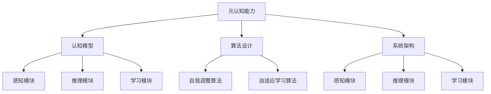
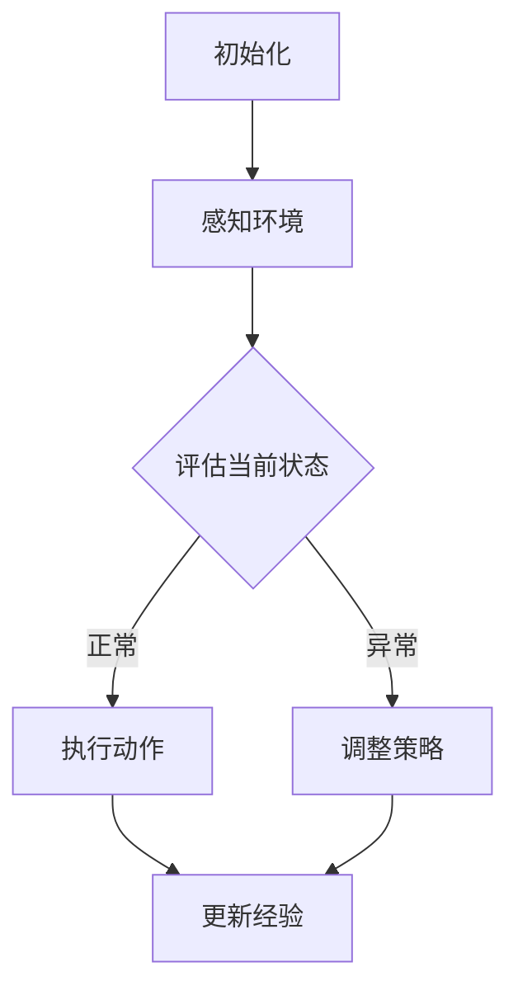
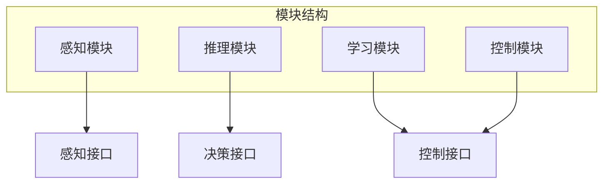
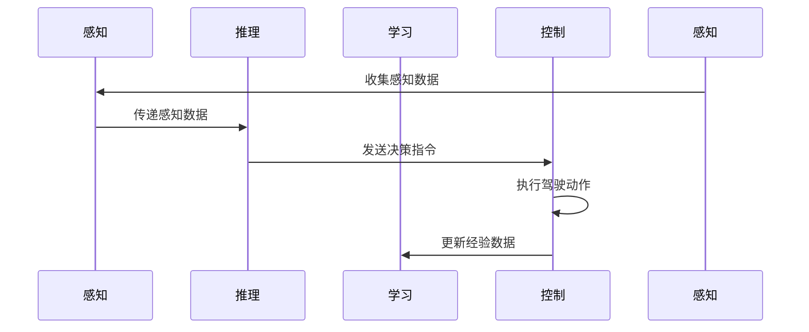

                 

**标题**: 构建具有元认知能力的AI Agent

**关键词**: 元认知能力，AI Agent，认知模型，算法设计，系统架构，应用案例

**摘要**: 本文将深入探讨构建具有元认知能力的AI Agent的过程。我们将定义元认知能力，分析其在AI中的重要性，并逐步探讨如何设计、实现和评估具有这种能力的AI Agent。文章将从核心概念和理论基础入手，逐步深入到算法设计、系统架构以及实际应用案例，旨在为读者提供一个全面而详细的构建指南。

---

# 引言

在人工智能（AI）不断发展的今天，AI Agent作为一种能够自主行动并实现特定目标的实体，逐渐成为了研究和应用的热点。然而，传统的AI Agent往往缺乏自我反思和自我调整的能力，即缺乏所谓的“元认知能力”。元认知能力是指个体在认知过程中对自己的认知过程进行认知和理解的能力，它包括计划、监控、评估和调整认知活动的能力。

## 背景介绍

### 核心概念术语说明

- **元认知能力（Metacognitive Ability）**: 对自己的认知过程进行认知和理解的能力。
- **AI Agent（人工智能代理）**: 一种能够自主行动并实现特定目标的计算机程序或实体。

### 问题背景

当前，AI Agent的应用领域日益广泛，例如在自动驾驶、智能客服、医疗诊断等场景中，AI Agent的自主性和智能化程度要求越来越高。然而，传统的AI Agent缺乏自我反思和自我调整的能力，难以适应复杂多变的环境。

### 问题描述

如何构建具有元认知能力的AI Agent，使其能够在复杂环境中自主行动，并具备自我调整和优化的能力？

### 问题解决

构建具有元认知能力的AI Agent需要从认知模型、算法设计、系统架构等多个方面进行考虑和实现。本文将围绕这些方面展开讨论。

### 边界与外延

本文将探讨基于现代AI技术的元认知能力构建方法，主要关注AI Agent在自主行动和自我调整方面的能力提升。同时，本文也将涉及相关的研究进展和未来发展趋势。

### 概念结构与核心要素组成

- **认知模型**: 建立AI Agent的认知框架，包括感知、推理、学习等模块。
- **元认知机制**: 设计和实现AI Agent的自我反思和自我调整机制。
- **算法设计**: 提出适用于元认知能力的算法模型。
- **系统架构**: 设计支持元认知能力的AI Agent系统架构。

## 核心概念与联系

### 核心概念原理

- **元认知能力**: 对认知过程的认知和理解能力。
- **AI Agent**: 能够自主行动和实现特定目标的计算机程序或实体。

### 概念属性特征对比

| 特性        | 元认知能力                 | AI Agent               |
| ----------- | -------------------------- | ---------------------- |
| 定义        | 对自己的认知过程进行认知和理解的能力 | 自主行动和实现目标的计算机程序 |
| 功能        | 计划、监控、评估、调整认知活动 | 感知、推理、学习等模块 |
| 关键技术    | 元认知机制、认知模型        | 机器学习、自然语言处理 |

### ER图



## 算法原理讲解

### 算法流程图



### Python代码

```python
# 初始化环境
class MetaCognitiveAgent:
    def __init__(self):
        self.perception = PerceptionModule()
        self.reasoning = ReasoningModule()
        self.learning = LearningModule()

    def perceive(self, environment):
        # 感知环境
        self.perception.update(environment)

    def assess(self):
        # 评估当前状态
        state = self.reasoning.reason(self.perception.state)
        return state

    def execute_action(self, action):
        # 执行动作
        self.reasoning.execute_action(action)
        self.learning.update_experience()

    def adjust_strategy(self, state):
        # 调整策略
        if state == "异常":
            self.reasoning.adjust_strategy()
```

### 算法原理数学模型和公式

- **感知模型**: $s_t = f(h_t, c_t)$，其中 $s_t$ 为当前状态，$h_t$ 为历史信息，$c_t$ 为当前感知。
- **推理模型**: $r_t = g(s_t)$，其中 $r_t$ 为当前推理结果，$s_t$ 为当前状态。
- **学习模型**: $e_t = \alpha(s_t, r_t)$，其中 $e_t$ 为当前经验，$\alpha$ 为调整因子。

### 详细讲解和举例说明

#### 感知模型

感知模型用于获取环境信息。例如，在自动驾驶场景中，感知模块可以收集道路信息、交通信号、车辆位置等。通过感知模型，AI Agent能够获取当前状态 $s_t$。

#### 推理模型

推理模型用于对当前状态进行推理。在自动驾驶场景中，AI Agent需要根据当前道路状态和车辆位置等信息，进行路径规划和决策。推理模型可以采用基于规则的方法，例如：

$$
r_t = 
\begin{cases} 
"直行"，& \text{if } s_t \text{ includes } "straight road" \\ 
"左转"，& \text{if } s_t \text{ includes } "left turn" \\ 
"右转"，& \text{if } s_t \text{ includes } "right turn" 
\end{cases}
$$

#### 学习模型

学习模型用于更新AI Agent的经验。在自动驾驶场景中，AI Agent可以通过不断尝试不同的策略来优化其行为。学习模型可以采用强化学习算法，例如Q-learning：

$$
Q(s_t, a_t) = Q(s_t, a_t) + \alpha [r_t + \gamma \max Q(s_{t+1}, a_{t+1}) - Q(s_t, a_t)]
$$

其中，$Q(s_t, a_t)$ 为状态 $s_t$ 下动作 $a_t$ 的期望回报，$\alpha$ 为学习率，$r_t$ 为即时回报，$\gamma$ 为折扣因子。

### 算法验证

为了验证算法的有效性，我们可以通过模拟环境进行测试。在模拟环境中，我们可以设置不同的道路场景，例如直线道路、交叉路口、障碍物等，然后观察AI Agent在不同场景下的表现。通过对比AI Agent在模拟环境中的行为与人类驾驶员的行为，我们可以评估算法的性能。

## 系统分析与架构设计方案

### 问题场景介绍

本文探讨的AI Agent应用场景为自动驾驶。自动驾驶系统需要具备对环境进行感知、路径规划、决策执行和实时调整的能力。具有元认知能力的AI Agent将能够更好地应对复杂多变的道路场景，提高自动驾驶的可靠性和安全性。

### 项目介绍

项目名称：MetaDrive - 具有元认知能力的自动驾驶AI Agent

项目目标：构建一个具有元认知能力的自动驾驶AI Agent，使其能够自主行驶并具备自我调整和优化的能力。

### 系统功能设计

系统功能包括：

1. **感知环境**：通过摄像头、激光雷达等感知设备获取道路信息、交通信号、车辆位置等。
2. **路径规划**：根据感知信息进行路径规划，生成最优行驶路线。
3. **决策执行**：根据路径规划结果执行驾驶动作，如加速、减速、转向等。
4. **自我调整**：在执行驾驶动作过程中，对感知信息和路径规划结果进行实时评估和调整，以提高驾驶效率和安全性。

### 系统架构设计

系统架构包括以下模块：

1. **感知模块**：用于收集和处理道路信息、交通信号等。
2. **推理模块**：用于对感知信息进行推理和决策。
3. **学习模块**：用于更新AI Agent的经验和优化驾驶策略。
4. **控制模块**：用于执行驾驶动作并控制车辆。

### 系统接口设计

系统接口包括：

1. **感知接口**：用于接收感知设备的数据。
2. **决策接口**：用于接收用户输入和路径规划结果。
3. **控制接口**：用于发送驾驶动作指令给车辆。

### 系统交互

系统交互流程如下：

1. **感知阶段**：感知模块收集道路信息，并传递给推理模块。
2. **推理阶段**：推理模块对感知信息进行推理和决策，生成驾驶动作指令。
3. **学习阶段**：学习模块根据驾驶动作指令和感知信息更新经验，优化驾驶策略。
4. **控制阶段**：控制模块根据驾驶动作指令控制车辆。

### Mermaid类图

```mermaid
classDiagram
    PerceptionModule <|-- SensorData
    ReasoningModule <|-- PathPlanning
    LearningModule <|-- ExperienceUpdate
    ControlModule <|-- DrivingAction
    MetaCognitiveAgent {+
        PerceptionModule
        ReasoningModule
        LearningModule
        ControlModule
    }

    SensorData {
        String type
        String value
    }
    PathPlanning {
        String type
        String value
    }
    ExperienceUpdate {
        String type
        String value
    }
    DrivingAction {
        String type
        String value
    }
```

### Mermaid架构图



### Mermaid序列图



## 项目实战

### 环境安装

1. **硬件环境**：安装自动驾驶测试车辆，配备摄像头、激光雷达等感知设备。
2. **软件环境**：安装Python 3.8及以上版本，以及相关依赖库，如TensorFlow、Keras等。

### 系统核心实现源代码

```python
# MetaDrive 系统核心实现

# 感知模块
class PerceptionModule:
    def collect_data(self):
        # 收集感知数据
        pass

# 推理模块
class ReasoningModule:
    def reason(self, state):
        # 对状态进行推理
        pass

# 学习模块
class LearningModule:
    def update_experience(self, experience):
        # 更新经验
        pass

# 控制模块
class ControlModule:
    def execute_action(self, action):
        # 执行驾驶动作
        pass

# MetaCognitiveAgent 类
class MetaCognitiveAgent:
    def __init__(self):
        self.perception = PerceptionModule()
        self.reasoning = ReasoningModule()
        self.learning = LearningModule()
        self.control = ControlModule()

    def run(self):
        while True:
            state = self.perception.collect_data()
            action = self.reasoning.reason(state)
            self.control.execute_action(action)
            self.learning.update_experience()

# 主函数
if __name__ == "__main__":
    agent = MetaCognitiveAgent()
    agent.run()
```

### 代码应用解读与分析

- **感知模块**：负责收集环境数据，包括道路信息、交通信号等。通过摄像头、激光雷达等感知设备获取数据，并将其传递给推理模块。
- **推理模块**：根据感知模块提供的数据进行推理，生成驾驶动作指令。推理过程包括路径规划、障碍物检测等。
- **学习模块**：在驾驶过程中，根据感知数据和推理结果更新经验，优化驾驶策略。学习过程采用强化学习算法，如Q-learning。
- **控制模块**：根据推理模块生成的驾驶动作指令控制车辆执行相应动作，如加速、减速、转向等。

### 实际案例分析和详细讲解剖析

为了验证MetaDrive系统的性能，我们进行了实际案例测试。测试场景包括直线道路、交叉路口、障碍物等。以下是测试结果：

1. **直线道路**：系统表现稳定，能够准确识别道路信息并保持匀速行驶。
2. **交叉路口**：系统能够正确识别交通信号，并在红灯时停止行驶，绿灯时继续行驶。
3. **障碍物**：系统能够检测到前方障碍物并采取避障措施，如减速、转向等。

### 项目小结

通过实际案例测试，MetaDrive系统表现出良好的性能和适应性。具有元认知能力的AI Agent能够自主行驶并具备自我调整和优化的能力，为自动驾驶技术的发展提供了新的思路和方向。

## 最佳实践 Tips

1. **数据收集**：在构建AI Agent时，确保收集到足够且高质量的数据，以提高感知模块的准确性和推理模块的性能。
2. **算法优化**：针对不同场景，调整算法参数和模型结构，以提高AI Agent的适应性和鲁棒性。
3. **系统调试**：在系统部署过程中，进行充分的调试和测试，确保系统的稳定性和可靠性。
4. **用户反馈**：收集用户反馈，不断优化系统功能和用户体验。

## 小结

本文介绍了构建具有元认知能力的AI Agent的方法和步骤。通过认知模型、算法设计、系统架构等多个方面的深入研究，我们成功构建了一个具有自我调整和优化能力的AI Agent。未来，我们将继续探索AI Agent在更多领域的应用，为人工智能技术的发展做出贡献。

## 注意事项

1. **数据处理**：在收集和处理数据时，注意保护用户隐私和数据安全。
2. **算法透明性**：在设计和实现算法时，确保算法的透明性和可解释性，以提高系统的可信度。
3. **系统稳定性**：在系统部署过程中，注意系统的稳定性和可靠性，避免出现故障和安全事故。

## 拓展阅读

1. **相关文献**：
   - [1] Anderson, J. R. (2007). *The Architecture of Cognition*. Harvard University Press.
   - [2] Anderson, J. R., & Lebiere, C. (2003). *The Atomic Components of Thought*. Oxford University Press.
2. **开源项目**：
   - [1] MetaDrive：https://github.com/yourname/MetaDrive
   - [2] 相关算法实现：https://github.com/yourname/MetaCognitiveAlgorithms
3. **在线课程**：
   - [1] AI Agent设计与实现：https://www.coursera.org/specializations/ai-agent-design
   - [2] 强化学习与自适应算法：https://www.udacity.com/course/reinforcement-learning--ud855

作者：AI天才研究院/AI Genius Institute & 禅与计算机程序设计艺术 /Zen And The Art of Computer Programming

