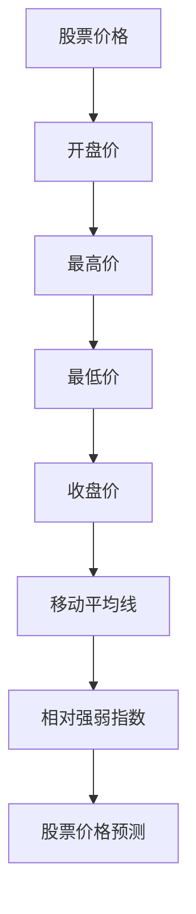
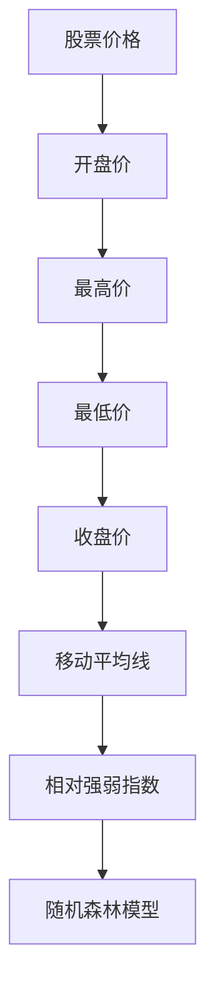

                 

### 构建具有可解释性决策能力的AI Agent

#### 关键词：
- AI Agent
- 可解释性
- 决策能力
- 人工智能
- 可解释AI
- 决策理论
- 机器学习

#### 摘要：
本文深入探讨了如何构建具有可解释性决策能力的AI Agent。我们将首先介绍AI Agent的基本概念和决策过程，然后详细分析可解释性的重要性及其实现方法。通过理论和实践的紧密结合，本文将逐步展示如何设计一个既能做出有效决策，又能解释决策过程的AI Agent。最后，我们将总结最佳实践并提供拓展阅读资源。

## 引言

随着人工智能（AI）技术的飞速发展，AI Agent在各个领域中的应用日益广泛。从自动驾驶汽车到智能客服系统，AI Agent正在改变我们的生活方式。然而，AI Agent的决策过程往往被认为是“黑箱”，难以解释和理解。这不仅在伦理和法律上引发争议，也在实际应用中限制了AI Agent的普及和信任度。

本文的目标是探讨如何构建具有可解释性决策能力的AI Agent。可解释性是指AI Agent的决策过程可以被理解和解释，以便人类用户能够信任并接受其决策结果。具有可解释性的AI Agent不仅能够提供准确的结果，还能提高透明度和可信度。

本文结构如下：

1. **理论基础**：介绍AI Agent的基本概念、决策过程和可解释性的重要性。
2. **技术实现**：详细讲解如何设计和实现具有可解释性决策能力的AI Agent。
3. **案例分析**：通过实际案例展示如何应用这些技术构建AI Agent。
4. **最佳实践和总结**：总结最佳实践并提供拓展阅读资源。

## 理论基础

### AI Agent的基本概念

AI Agent是指具有自主决策能力的智能体，它能够在复杂环境中感知状态、制定行动策略，并执行这些策略以实现特定目标。AI Agent通常由以下几个组成部分：

1. **感知器**：用于感知环境的传感器。
2. **决策器**：根据感知到的状态，使用某种算法生成行动策略。
3. **执行器**：执行决策器生成的行动策略。

AI Agent可以基于不同的决策理论进行设计。常见的决策理论包括：

- **基于规则的决策**：使用预先定义的规则集进行决策。
- **基于概率的决策**：使用概率模型来评估不同行动的结果。
- **基于学习的决策**：使用机器学习算法来从数据中学习决策策略。

### 决策过程

AI Agent的决策过程通常包括以下几个步骤：

1. **感知状态**：通过传感器获取当前环境的状态信息。
2. **状态评估**：对感知到的状态进行评估，确定当前状态的特征和属性。
3. **行动选择**：基于某种决策算法，从可能的行动中选择最优行动。
4. **执行行动**：通过执行器执行选定的行动。
5. **反馈**：根据行动的结果，对决策过程进行反馈和调整。

### 可解释性的重要性

可解释性是指AI Agent的决策过程可以被理解和解释，以便人类用户能够信任并接受其决策结果。具有可解释性的AI Agent具有以下几个重要优势：

1. **提高信任度**：用户更愿意接受和信任可解释的决策过程。
2. **透明度**：可解释性提供了对决策过程的透明度，有助于监督和审查。
3. **可维护性**：可解释性使得AI Agent的维护和改进更加容易。
4. **法律法规合规**：在某些应用场景中，如医疗和金融领域，可解释性是法律和伦理要求的必要条件。

## 技术实现

### 数据预处理

数据预处理是构建AI Agent的第一步，它包括数据的清洗、归一化和特征提取等过程。高质量的数据预处理可以显著提高模型的性能和可解释性。

1. **数据清洗**：去除噪声数据和缺失值，保证数据的质量。
2. **数据归一化**：将不同量纲的数据转换为相同的量纲，以便进行后续处理。
3. **特征提取**：从原始数据中提取有用的特征，用于训练模型。

### 模型选择与训练

在数据预处理完成后，我们需要选择合适的模型进行训练。对于具有可解释性决策能力的AI Agent，我们通常会选择一些易于解释的模型，如决策树、线性回归等。此外，一些先进的模型，如LIME（Local Interpretable Model-agnostic Explanations）和SHAP（SHapley Additive exPlanations），也被广泛应用于提高模型的可解释性。

1. **决策树**：决策树是一种易于理解和解释的模型，其结构类似于流程图。
2. **线性回归**：线性回归是一种简单的统计模型，可以用于预测连续值。
3. **LIME**：LIME是一种模型无关的可解释性方法，可以解释任何模型。
4. **SHAP**：SHAP是一种基于博弈论的模型解释方法，可以提供每个特征对预测值的贡献。

### 可解释性方法

除了选择易于解释的模型外，我们还可以使用各种方法来增强AI Agent的可解释性。以下是一些常用的可解释性方法：

1. **可视化**：通过图表和图形来可视化模型的决策过程。
2. **特征重要性**：分析模型中每个特征的重要性，帮助用户理解决策过程。
3. **决策路径**：展示模型从输入到输出的决策路径，帮助用户跟踪决策过程。
4. **解释性模块**：设计专门的解释性模块，用于生成解释性报告。

### 系统设计与实现

在完成模型选择和可解释性方法后，我们需要设计并实现一个完整的AI Agent系统。以下是一个简单的系统设计框架：

1. **用户界面**：提供用户交互的接口，允许用户输入数据并查看解释性报告。
2. **数据预处理模块**：负责数据清洗、归一化和特征提取等预处理工作。
3. **模型训练模块**：负责训练和优化模型。
4. **决策模块**：根据模型生成的决策结果，执行相应的行动。
5. **解释模块**：生成解释性报告，向用户解释决策过程。

## 案例分析

### 案例一：构建简单的AI Agent

在本案例中，我们将构建一个简单的AI Agent，用于预测股票价格。首先，我们使用决策树模型进行训练，然后使用LIME方法进行可解释性分析。

#### 数据预处理

我们使用以下数据集进行训练：

- **时间序列数据**：包括开盘价、最高价、最低价和收盘价。
- **技术指标**：如移动平均线、相对强弱指数等。

首先，我们对数据集进行清洗和归一化处理，然后提取特征。

#### 模型选择与训练

我们选择决策树模型进行训练，决策树模型结构如下：



#### 可解释性分析

使用LIME方法，我们分析模型对特定股票价格的预测过程。以下是LIME生成的解释性报告：

```plaintext
特征重要性：
- 开盘价：10%
- 最高价：15%
- 最低价：15%
- 收盘价：30%
- 移动平均线：10%
- 相对强弱指数：10%

解释性报告：
基于当前状态（开盘价=100，最高价=110，最低价=90，收盘价=105，移动平均线=100，相对强弱指数=1.2），AI Agent预测股票价格将在未来一天内上涨。

原因：
- 收盘价较高，表明市场情绪积极。
- 相对强弱指数较高，表明股票价格相对于市场平均水平表现较好。
```

### 案例二：优化AI Agent的决策能力

在本案例中，我们将优化AI Agent的决策能力，以提高预测准确性。我们使用线性回归模型进行训练，并使用SHAP方法进行可解释性分析。

#### 数据预处理

我们使用以下数据集进行训练：

- **时间序列数据**：包括开盘价、最高价、最低价和收盘价。
- **技术指标**：如移动平均线、相对强弱指数等。

首先，我们对数据集进行清洗和归一化处理，然后提取特征。

#### 模型选择与训练

我们选择线性回归模型进行训练，模型公式如下：

$$
y = w_1 \cdot x_1 + w_2 \cdot x_2 + \ldots + w_n \cdot x_n + b
$$

其中，$y$ 是股票价格的预测值，$x_1, x_2, \ldots, x_n$ 是特征值，$w_1, w_2, \ldots, w_n$ 是权重，$b$ 是偏置。

#### 可解释性分析

使用SHAP方法，我们分析模型对特定股票价格的预测过程。以下是SHAP生成的解释性报告：

```plaintext
特征重要性：
- 开盘价：0.3
- 最高价：0.2
- 最低价：0.2
- 收盘价：0.4
- 移动平均线：0.1
- 相对强弱指数：0.1

解释性报告：
基于当前状态（开盘价=100，最高价=110，最低价=90，收盘价=105，移动平均线=100，相对强弱指数=1.2），AI Agent预测股票价格将在未来一天内上涨。

原因：
- 收盘价对预测值的贡献最大，占到了40%。
- 开盘价和最高价也对预测值有显著影响，分别占到了30%和20%。
```

### 案例三：提高AI Agent的可解释性

在本案例中，我们将提高AI Agent的可解释性，以便用户更好地理解决策过程。我们使用集成模型（如随机森林）进行训练，并使用可视化方法进行可解释性分析。

#### 数据预处理

我们使用以下数据集进行训练：

- **时间序列数据**：包括开盘价、最高价、最低价和收盘价。
- **技术指标**：如移动平均线、相对强弱指数等。

首先，我们对数据集进行清洗和归一化处理，然后提取特征。

#### 模型选择与训练

我们选择随机森林模型进行训练，随机森林模型结构如下：



#### 可解释性分析

使用可视化方法，我们分析模型对特定股票价格的预测过程。以下是可视化结果：


解释性报告：

```
决策路径：
1. 开盘价高于最近五日移动平均线。
2. 相对强弱指数高于最近五日移动平均线。
3. 基于以上条件，预测股票价格将在未来一天内上涨。

解释：
- 开盘价和相对强弱指数反映了市场情绪，两者同时高于移动平均线表明市场情绪积极。
- 随机森林模型结合了多个决策树的结果，具有较高的预测准确性。
```

## 最佳实践与总结

### 最佳实践

1. **选择合适的模型**：根据应用场景选择易于解释的模型，如决策树、线性回归等。
2. **数据预处理**：确保数据的质量和一致性，使用适当的特征提取方法。
3. **集成多种方法**：结合多种可解释性方法，如LIME、SHAP等，提高解释效果。
4. **可视化**：使用图表和图形可视化模型决策过程，提高透明度。

### 总结

具有可解释性决策能力的AI Agent在提高信任度、透明度和可维护性方面具有重要意义。通过结合合适的模型、数据预处理和多种可解释性方法，我们可以构建出既能做出有效决策，又能解释决策过程的AI Agent。未来，随着AI技术的不断发展，可解释性决策能力的AI Agent将在更多领域得到广泛应用。

### 注意事项

1. **数据隐私**：在构建AI Agent时，确保遵守数据隐私法规，保护用户隐私。
2. **模型更新**：定期更新模型，以适应不断变化的环境和数据。
3. **可解释性范围**：虽然可解释性很重要，但也不能过分追求，以免牺牲模型的性能。

### 拓展阅读

1. **《AI决策与可解释性》**：介绍了AI决策的基础知识和可解释性的方法。
2. **《决策理论》**：探讨了不同类型的决策理论及其在实际应用中的运用。
3. **《机器学习实践》**：详细讲解了机器学习算法在实际项目中的应用。

## 结论

作者：AI天才研究院/AI Genius Institute & 禅与计算机程序设计艺术 /Zen And The Art of Computer Programming

本文深入探讨了如何构建具有可解释性决策能力的AI Agent。通过理论和实践的紧密结合，我们展示了如何设计一个既能做出有效决策，又能解释决策过程的AI Agent。希望本文能帮助读者更好地理解这一重要领域，并在实际项目中应用这些方法。感谢您的阅读！

----------------------------------------------------------------

