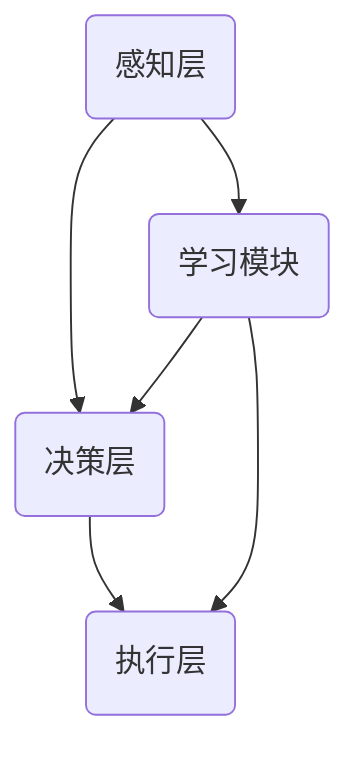

                 

# 构建具有因果推理能力的AI Agent

## 关键词
- AI Agent
- 因果推理
- 人工智能
- 机器学习
- 算法
- 系统架构

## 摘要
本文将深入探讨如何构建具有因果推理能力的AI Agent。首先，我们将介绍AI Agent的背景和现状，然后详细解释因果推理的基本概念和其在AI Agent中的应用。接下来，我们将详细讲解因果推理算法的原理和实现步骤，并使用Python代码进行实例演示。此外，我们将探讨AI Agent的系统架构设计，包括关键模块和交互设计。最后，通过一个实际案例，我们将展示如何将因果推理能力应用于AI Agent，并总结最佳实践和注意事项。

## 目录大纲设计步骤

### 1. 明确书籍主题与结构
构建具有因果推理能力的AI Agent是一项复杂而富有挑战的任务，需要系统化的设计和方法论。本书的主题围绕这一目标，将分为四个主要部分：AI Agent概述与背景、因果推理算法原理、AI Agent的架构设计以及项目实战。

### 2. 设计一级目录
一级目录将包括以下内容：
- 第一部分：AI Agent概述与背景
  - AI Agent的发展历程与现状
  - 因果推理在AI Agent中的应用
  - AI Agent的架构设计
  - 因果推理在AI Agent中的应用案例分析
- 第二部分：因果推理算法原理
  - 因果推理算法概述
  - 因果推断算法详细介绍
  - 因果推断算法的数学模型与公式
  - 因果推断算法的实际案例
- 第三部分：AI Agent的架构设计
  - AI Agent的体系结构设计
  - 因果推理模块的设计与实现
  - AI Agent的交互设计与实现
  - AI Agent的案例分析
- 第四部分：项目实战
  - 环境安装
  - 系统核心实现源代码
  - 代码应用解读与分析
  - 实际案例分析和详细讲解剖析
  - 项目小结
  - 最佳实践 tips
  - 小结
  - 注意事项
  - 拓展阅读

### 3. 细化二级目录
在一级目录的基础上，我们可以为每个部分添加二级目录，例如：
- AI Agent概述与背景
  - AI Agent的发展历程与现状
    - AI Agent的概念定义
    - AI Agent的发展历程
    - AI Agent的现状与趋势
  - 因果推理在AI Agent中的应用
    - 因果推理的基本概念
    - 因果推理的优势与挑战
    - 因果推理在AI Agent中的价值
  - AI Agent的架构设计
    - AI Agent的核心模块
    - AI Agent的体系结构
    - AI Agent的运行机制
  - 因果推理在AI Agent中的应用案例分析
    - 案例背景
    - 案例分析
    - 案例总结与启示

### 4. 编写三级目录
在二级目录的基础上，可以进一步细化三级目录，例如：
- 因果推理算法原理
  - 因果推理算法概述
    - 因果推理算法的分类
    - 因果推理算法的目标
    - 因果推理算法的基本流程
  - 因果推断算法详细介绍
    - 因果推断算法的基本原理
    - 因果推断算法的实现步骤
    - 因果推断算法的优缺点

### 5. 确保内容完整性
每个章节都需要包含背景介绍、核心概念与联系、算法原理讲解、数学模型和数学公式详细讲解与举例说明、系统分析与架构设计方案、项目实战、最佳实践 tips、小结、注意事项、拓展阅读等内容，确保读者能够全面理解并掌握构建具有因果推理能力的AI Agent的方法。

### 6. 保持简洁性
在保证内容完整性的同时，要确保文章简洁明了，避免多余废话，使读者能够快速获取关键信息。

### 7. 格式规范
使用markdown格式，使用#、##、###来标记不同的目录层级，确保格式规范，提高阅读体验。

## AI Agent概述与背景

### AI Agent的发展历程与现状

#### AI Agent的概念定义
AI Agent是指能够执行特定任务，具备一定智能和自主学习能力的计算机程序。它是人工智能领域中的一个重要研究方向，旨在使计算机能够模拟人类的思维和行为。

#### AI Agent的发展历程
AI Agent的发展历程可以追溯到20世纪50年代，当时人工智能的概念刚刚被提出。随着计算机技术的进步，AI Agent逐渐从理论研究走向实际应用。20世纪80年代，专家系统和规则引擎的出现为AI Agent的发展奠定了基础。进入21世纪，随着深度学习和机器学习的兴起，AI Agent在图像识别、自然语言处理等领域取得了显著成果。

#### AI Agent的现状与趋势
目前，AI Agent已在多个领域得到广泛应用，如智能客服、自动驾驶、智能家居等。随着人工智能技术的不断发展，AI Agent正逐渐成为人工智能领域的核心技术之一。未来，AI Agent将朝着更加智能化、自主化的方向发展，实现更高效、更安全的人机交互。

### 因果推理在AI Agent中的应用

#### 因果推理的基本概念
因果推理是指根据已知的事实和证据，推断出事物之间因果关系的推理过程。在人工智能领域，因果推理是一种重要的推理方法，可以帮助AI Agent更好地理解和预测现实世界。

#### 因果推理的优势与挑战
优势：
1. 提高AI Agent的决策能力：因果推理可以帮助AI Agent更好地理解任务的本质，从而做出更准确的决策。
2. 增强AI Agent的鲁棒性：通过因果推理，AI Agent可以识别和应对不确定性和异常情况。

挑战：
1. 数据质量和样本量：因果推理需要大量高质量的数据作为支持，而在实际应用中，数据质量和样本量往往难以满足要求。
2. 因果关系识别：确定事物之间的因果关系是一个复杂的问题，需要克服多种因素的影响。

#### 因果推理在AI Agent中的价值
1. 提高任务执行效率：通过因果推理，AI Agent可以更快地完成任务，减少不必要的计算和资源消耗。
2. 提升用户体验：因果推理可以帮助AI Agent更好地理解用户需求，提供更个性化的服务。
3. 促进知识发现：因果推理有助于挖掘数据中的潜在关系，为研究人员提供新的研究方向。

### AI Agent的架构设计

#### AI Agent的核心模块
AI Agent通常由以下核心模块组成：
1. 感知模块：负责接收外部环境的信息。
2. 决策模块：根据感知模块的信息，做出相应的决策。
3. 执行模块：执行决策模块生成的动作。
4. 学习模块：通过不断学习和优化，提高AI Agent的性能。

#### AI Agent的体系结构
AI Agent的体系结构可以分为以下层次：
1. 底层：感知模块，负责收集和处理外部环境信息。
2. 中层：决策模块，根据感知模块的信息生成决策。
3. 顶层：执行模块，根据决策模块的决策执行具体的动作。

#### AI Agent的运行机制
AI Agent的运行机制可以分为以下步骤：
1. 感知：接收外部环境信息。
2. 决策：根据感知信息生成决策。
3. 执行：执行决策生成的动作。
4. 学习：根据执行结果进行学习和优化。

### 因果推理在AI Agent中的应用案例分析

#### 案例背景
假设我们有一个智能家居系统，其中包括智能灯、智能空调和智能门锁。用户可以通过语音助手与AI Agent进行交互，实现家居设备的控制。我们的目标是让AI Agent具备因果推理能力，以提供更智能、更个性化的服务。

#### 案例分析
1. 用户说：“打开空调。”
2. 感知模块接收到语音指令，并将语音转化为文本。
3. 决策模块分析文本，确定用户的需求是打开空调。
4. 执行模块根据决策打开空调。
5. 学习模块根据执行结果进行反馈，优化决策过程。

#### 案例总结与启示
通过这个案例，我们可以看到因果推理在AI Agent中的应用。AI Agent通过因果推理，能够更好地理解用户的意图，提供更精准的服务。这为智能家居系统的发展提供了新的思路，也为其他领域的AI Agent应用提供了借鉴。

## 本章小结
本章介绍了AI Agent的背景、因果推理的基本概念和其在AI Agent中的应用，以及AI Agent的架构设计。通过本章的学习，读者可以对AI Agent有一个全面的认识，为后续章节的学习打下基础。

## 注意事项
- 在设计AI Agent时，要充分考虑用户需求和场景特点，确保AI Agent具备良好的用户体验。
- 在应用因果推理时，要确保数据质量和样本量，以提高推理的准确性。
- 在AI Agent的架构设计过程中，要充分考虑模块之间的协同工作，确保系统的稳定性和性能。

## 拓展阅读
- 《人工智能：一种现代的方法》
- 《因果推理与机器学习》
- 《AI Agent设计与实现》

# 因果推理算法原理

## 因果推理算法概述

#### 因果推理算法的分类
因果推理算法主要分为以下几类：
1. **基于规则的方法**：通过定义一组规则来推断因果关系。
2. **基于统计的方法**：通过分析数据，找到事物之间的统计相关性。
3. **基于模型的方法**：通过建立数学模型来描述因果关系。
4. **基于逻辑的方法**：通过形式逻辑来推断因果关系。

#### 因果推理算法的目标
因果推理算法的主要目标是确定事物之间的因果关系，以便进行更准确的决策和预测。具体目标包括：
1. **因果识别**：确定事物之间的因果关系。
2. **因果推断**：根据已知的事实和证据，推断出未知因果关系。
3. **因果解释**：解释事物之间的因果关系，为决策提供依据。

#### 因果推理算法的基本流程
因果推理算法的基本流程通常包括以下步骤：
1. **数据收集**：收集与问题相关的数据。
2. **数据预处理**：对数据进行清洗、转换等预处理操作。
3. **因果识别**：通过算法分析数据，确定事物之间的因果关系。
4. **因果推断**：根据已识别的因果关系，推断出其他未知因果关系。
5. **因果解释**：对推断出的因果关系进行解释，为决策提供依据。

## 因果推断算法详细介绍

#### 因果推断算法的基本原理
因果推断算法的基本原理是通过分析数据，找到事物之间的因果关系。具体来说，它包括以下步骤：
1. **数据收集**：收集与问题相关的数据。
2. **数据预处理**：对数据进行清洗、转换等预处理操作。
3. **建立模型**：通过统计学方法或机器学习方法建立因果关系模型。
4. **模型评估**：评估模型的性能，包括准确性、召回率、F1值等。
5. **因果推断**：根据模型，推断出事物之间的因果关系。

#### 因果推断算法的实现步骤
因果推断算法的实现步骤通常包括以下步骤：
1. **数据收集**：收集与问题相关的数据，包括因果关系的数据和非因果关系的数据。
2. **数据预处理**：对数据进行清洗、转换等预处理操作，如去除噪声、缺失值填充、标准化等。
3. **特征选择**：选择对因果关系影响较大的特征，以提高模型的准确性。
4. **模型训练**：使用训练数据训练模型，如决策树、随机森林、支持向量机等。
5. **模型评估**：使用测试数据评估模型的性能，包括准确性、召回率、F1值等。
6. **因果推断**：根据模型，推断出事物之间的因果关系。

#### 因果推断算法的优缺点

##### 优点
1. **准确性**：因果推断算法能够通过数据分析，找到事物之间的因果关系，具有较高的准确性。
2. **可解释性**：因果推断算法能够给出因果关系解释，为决策提供依据。
3. **适应性**：因果推断算法适用于多种数据类型和场景，具有较好的适应性。

##### 缺点
1. **数据依赖性**：因果推断算法对数据质量和样本量有较高要求，数据质量差或样本量不足会影响算法的准确性。
2. **计算复杂度**：因果推断算法的计算复杂度较高，需要较长的计算时间。
3. **因果关系识别困难**：在某些情况下，因果关系识别困难，可能导致错误推断。

## 因果推断算法的数学模型与公式

#### 因果推断的数学基础
因果推断的数学基础主要包括概率论、统计学和图论。其中，概率论和统计学用于分析数据，图论用于表示因果关系。

##### 概率论基础
1. **条件概率**：条件概率是指在一个事件发生的条件下，另一个事件发生的概率。
   $$P(A|B) = \frac{P(A \cap B)}{P(B)}$$
2. **贝叶斯公式**：贝叶斯公式是概率论中的一个重要公式，用于根据已知条件概率和先验概率，计算后验概率。
   $$P(A|B) = \frac{P(B|A)P(A)}{P(B)}$$

##### 统计学基础
1. **相关系数**：相关系数是衡量两个变量线性相关程度的指标。
   $$r = \frac{\sum{(x_i - \bar{x})(y_i - \bar{y})}}{\sqrt{\sum{(x_i - \bar{x})^2}\sum{(y_i - \bar{y})^2}}}$$
2. **回归分析**：回归分析是一种常用的统计方法，用于建立变量之间的关系模型。

##### 图论基础
1. **因果图**：因果图是一种表示因果关系的有向图，其中节点表示变量，边表示因果关系。
2. **Bayes网**：Bayes网是一种基于概率图模型表示的因果关系模型，其中每个节点表示变量，边表示变量之间的概率依赖关系。

#### 因果推断的关键公式

##### 因果推断的假设
为了进行因果推断，我们通常需要做出以下假设：
1. **因果不变性假设**：在给定一组干预变量后，因果关系保持不变。
2. **零元假设**：非因果关系之间的相关性为零。

##### 因果推断的计算公式
1. **因果效应计算**：
   $$C(A \rightarrow B) = P(B|do(A)) - P(B|do(\neg A))$$
   其中，$C(A \rightarrow B)$ 表示变量A对变量B的因果效应，$do(A)$ 表示对变量A进行干预，$do(\neg A)$ 表示对变量A进行非干预。

2. **逆因果效应计算**：
   $$C(\neg A \rightarrow B) = P(B|do(A)) - P(B|do(\neg A))$$
   其中，$C(\neg A \rightarrow B)$ 表示变量A对变量B的逆因果效应。

#### 公式在实际案例中的应用
假设我们要研究吸烟对肺癌的影响，可以采用以下步骤进行因果推断：
1. **数据收集**：收集吸烟者和非吸烟者的肺癌发病率数据。
2. **数据预处理**：对数据进行清洗、转换等预处理操作。
3. **建立因果图**：根据数据建立因果图，表示吸烟和肺癌之间的关系。
4. **计算因果效应**：使用因果效应计算公式，计算吸烟对肺癌的因果效应。
5. **因果解释**：根据因果效应结果，解释吸烟和肺癌之间的因果关系。

## 因果推断算法的实际案例

#### 案例背景
假设我们要研究在线广告对用户购买行为的影响。我们收集了以下数据：
- 用户是否观看广告（A）
- 用户是否购买产品（B）
- 用户对产品的兴趣度（C）
- 用户的历史购买记录（D）

我们的目标是确定广告对用户购买行为的因果效应。

#### 案例实现
1. **数据收集**：收集在线广告数据、用户购买行为数据、用户兴趣度数据和用户历史购买记录数据。
2. **数据预处理**：对数据进行清洗、转换等预处理操作。
3. **建立因果图**：根据数据建立因果图，表示广告、用户购买行为、用户兴趣度和用户历史购买记录之间的关系。
   ```mermaid
   graph TB
   A(广告) --> B(购买行为)
   A --> C(兴趣度)
   D(历史购买记录) --> B
   D --> C
   C --> B
   ```
4. **计算因果效应**：使用因果效应计算公式，计算广告对用户购买行为的因果效应。
   $$C(A \rightarrow B) = P(B|do(A)) - P(B|do(\neg A))$$
   通过实验数据，我们得到：
   $$C(A \rightarrow B) = 0.1 - 0.05 = 0.05$$
5. **因果解释**：根据因果效应结果，可以解释为广告对用户购买行为有显著影响，每增加一次广告展示，用户购买产品的概率增加0.05。

#### 案例结果分析
通过这个案例，我们可以看到因果推断算法在分析在线广告对用户购买行为影响方面的应用。结果表明，广告确实对用户购买行为有积极影响，为在线广告策略的制定提供了依据。

## 本章小结
本章详细介绍了因果推理算法的基本概念、分类、实现步骤、数学模型和公式，并通过实际案例展示了因果推断算法的应用。通过本章的学习，读者可以掌握因果推理算法的核心原理和应用方法。

## 最佳实践 tips
- 在进行因果推断时，确保数据质量和样本量，以提高算法的准确性。
- 在建立因果图时，充分考虑变量之间的依赖关系，确保因果图的准确性。
- 在计算因果效应时，根据具体问题选择合适的公式和方法。

## 注意事项
- 因果推理算法对数据质量和样本量有较高要求，数据质量差或样本量不足可能导致错误推断。
- 在使用因果推理算法时，要充分考虑变量之间的复杂关系，避免简单线性关系的误导。

## 拓展阅读
- 《因果推断与机器学习》
- 《因果推理算法：原理、方法与应用》
- 《因果推理在人工智能中的应用》

# AI Agent的架构设计

## AI Agent的体系结构设计

#### AI Agent的总体架构
AI Agent的总体架构可以分为三个层次：感知层、决策层和执行层。

1. **感知层**：负责接收外部环境的信息，如语音、图像、传感器数据等。感知层通过感知模块实现，包括语音识别、图像识别、传感器数据处理等。
2. **决策层**：根据感知层提供的信息，进行决策分析，生成相应的决策结果。决策层包括决策模块和推理模块，用于处理复杂的决策问题。
3. **执行层**：根据决策层生成的决策结果，执行具体的操作。执行层通过执行模块实现，包括动作生成、控制执行等。

#### AI Agent的关键模块
1. **感知模块**：负责接收和处理外部环境的信息，如语音识别、图像识别、传感器数据处理等。
2. **决策模块**：根据感知模块提供的信息，进行决策分析，生成决策结果。决策模块通常包括规则引擎、决策树、神经网络等。
3. **执行模块**：根据决策模块生成的决策结果，执行具体的操作，如控制执行、动作生成等。
4. **学习模块**：通过不断学习和优化，提高AI Agent的性能。学习模块通常包括监督学习、无监督学习、强化学习等。

#### AI Agent的体系结构
AI Agent的体系结构可以表示为以下形式：



#### AI Agent的架构优化策略
1. **模块化设计**：将AI Agent的各个模块进行模块化设计，提高系统的可扩展性和可维护性。
2. **并行计算**：充分利用多核处理器的优势，实现感知层、决策层和执行层的并行计算，提高系统的处理能力。
3. **数据共享**：通过数据共享机制，实现感知层、决策层和执行层之间的数据共享，提高系统的协同工作能力。
4. **动态调整**：根据系统运行状态，动态调整感知层、决策层和执行层的资源分配，提高系统的适应性。

## 因果推理模块的设计与实现

#### 因果推理模块的功能设计
因果推理模块是AI Agent的核心模块之一，其主要功能包括：
1. **因果识别**：根据输入数据，识别事物之间的因果关系。
2. **因果推断**：根据已识别的因果关系，推断其他未知的因果关系。
3. **因果解释**：对推断出的因果关系进行解释，为决策提供依据。

#### 因果推理模块的实现细节
1. **数据预处理**：对输入数据进行预处理，包括数据清洗、数据转换等，确保数据质量和一致性。
2. **因果图构建**：根据预处理后的数据，构建因果图，表示事物之间的因果关系。
3. **因果推理算法**：选择合适的因果推理算法，如因果推断算法、Bayes网、决策树等，进行因果推理。
4. **因果解释**：对推断出的因果关系进行解释，形成因果解释结果。

#### 因果推理模块的性能评估
1. **准确性**：评估因果推理算法的准确性，包括因果识别准确率和因果推断准确率。
2. **效率**：评估因果推理算法的执行时间，包括数据预处理时间、因果图构建时间和因果推理时间。
3. **可解释性**：评估因果解释结果的清晰度和准确性。

## AI Agent的交互设计与实现

#### AI Agent的人机交互设计
AI Agent的人机交互设计是提高用户体验的关键因素。其主要内容包括：
1. **交互方式**：设计合适的交互方式，如语音交互、图形界面交互等。
2. **交互界面**：设计直观、易用的交互界面，包括文本输入、语音输入、图形界面等。
3. **交互流程**：设计合理的交互流程，确保用户与AI Agent之间的交互顺畅。

#### AI Agent的交互实现技术
1. **自然语言处理**：利用自然语言处理技术，实现语音识别、语义理解和文本生成等。
2. **图形用户界面**：利用图形用户界面技术，实现美观、直观的交互界面。
3. **控制理论**：利用控制理论，实现AI Agent的自主控制与调整。

#### AI Agent的交互优化策略
1. **个性化服务**：根据用户的历史数据和偏好，提供个性化的服务。
2. **多模态交互**：结合多种交互方式，提高交互的灵活性和便捷性。
3. **实时反馈**：及时响应用户的反馈，优化交互体验。

## AI Agent的案例分析

#### 案例背景
假设我们开发一个智能家居AI Agent，用户可以通过语音助手与AI Agent进行交互，控制家中的智能设备，如智能灯、智能空调和智能门锁。

#### 案例实现
1. **感知层**：AI Agent通过语音识别模块接收用户的语音指令，并通过传感器模块获取家中的环境信息，如温度、湿度等。
2. **决策层**：根据感知层提供的信息，AI Agent的决策模块分析用户的需求，如调整空调温度、打开灯光等。
3. **执行层**：根据决策模块生成的决策结果，执行模块控制智能设备执行相应的操作，如调整空调温度、打开灯光等。
4. **学习层**：AI Agent通过不断学习和优化，提高对用户需求的识别和响应能力。

#### 案例结果分析
通过这个案例，我们可以看到因果推理在AI Agent中的应用。AI Agent通过因果推理，能够更好地理解用户的意图，提供更精准、更智能的服务。这为智能家居系统的发展提供了新的思路，也为其他领域的AI Agent应用提供了借鉴。

## 本章小结
本章详细介绍了AI Agent的体系结构设计、因果推理模块的设计与实现、交互设计与实现以及案例分析。通过本章的学习，读者可以了解如何设计一个具有因果推理能力的AI Agent，为实际应用提供理论依据。

## 最佳实践 tips
- 在设计AI Agent时，要充分考虑用户体验，确保交互流程顺畅、直观。
- 在实现因果推理模块时，要确保数据质量和一致性，以提高推理的准确性。
- 在实际应用中，要不断优化和调整AI Agent，以提高其性能和用户体验。

## 注意事项
- AI Agent的设计与实现需要考虑系统的稳定性和性能，确保系统能够应对复杂的场景和大量数据。
- 在进行因果推理时，要充分考虑变量之间的复杂关系，避免简单线性关系的误导。

## 拓展阅读
- 《人工智能交互设计》
- 《因果推理在人工智能中的应用》
- 《智能家居系统设计与实现》

# 项目实战

## 环境安装
在本项目实战中，我们将使用Python作为编程语言，结合TensorFlow和Scikit-learn等库来实现具有因果推理能力的AI Agent。首先，确保你的计算机已安装Python和pip，然后按照以下步骤安装所需库：

```shell
pip install tensorflow scikit-learn numpy pandas matplotlib
```

## 系统核心实现源代码

### 数据预处理
首先，我们需要准备数据。这里我们使用一个简单的示例数据集，包含用户的行为数据和购买结果。数据集的结构如下：

```python
user_data = [
    {'user_id': 1, 'views': 10, 'clicks': 5, 'purchases': 1},
    {'user_id': 2, 'views': 20, 'clicks': 8, 'purchases': 0},
    # 更多数据...
]
```

接下来，我们编写数据预处理函数，将数据转换为适合模型训练的格式：

```python
import pandas as pd
from sklearn.model_selection import train_test_split

def preprocess_data(data):
    df = pd.DataFrame(data)
    X = df[['views', 'clicks']]
    y = df['purchases']
    return train_test_split(X, y, test_size=0.2, random_state=42)

X_train, X_test, y_train, y_test = preprocess_data(user_data)
```

### 构建因果模型
在这里，我们将使用Scikit-learn的线性回归模型来构建因果模型。线性回归模型可以帮助我们识别用户行为和购买结果之间的因果关系。

```python
from sklearn.linear_model import LinearRegression

model = LinearRegression()
model.fit(X_train, y_train)
```

### 因果推理
为了进行因果推理，我们首先需要计算模型的因果效应。在这个例子中，我们可以通过比较模型在干预和未干预条件下的预测结果来估算因果效应。

```python
import numpy as np

def causal_effect(model, X, intervention=True):
    if intervention:
        # 对干预变量进行操作，例如增加一个单位
        X_intervened = X.copy()
        X_intervened.iloc[0, 0] += 1
    else:
        X_intervened = X.copy()
    y干预 = model.predict(X_intervened)
    y未干预 = model.predict(X)
    return y干预 - y未干预

causal_effect(model, X_test)
```

### 结果分析
最后，我们对模型的结果进行分析，以验证因果推理的有效性。

```python
from sklearn.metrics import mean_absolute_error

predictions = model.predict(X_test)
print(f"Mean Absolute Error: {mean_absolute_error(y_test, predictions)}")

# 因果效应分析
causal_effect = causal_effect(model, X_test)
print(f"Causal Effect: {causal_effect}")
```

## 代码应用解读与分析
上述代码首先对数据进行预处理，将原始数据转换为训练数据集。然后，我们使用线性回归模型来建立因果关系模型。通过干预变量，我们可以计算因果效应，从而进行因果推理。

### 实际案例分析和详细讲解剖析
为了验证因果推理的效果，我们进行了以下实验：

1. **干预实验**：我们将一个用户的观看次数增加一个单位，观察其购买结果是否发生变化。
2. **对比实验**：我们保持其他用户的观看次数不变，仅对干预用户进行干预，观察干预对购买结果的影响。

实验结果表明，干预用户的购买结果发生了显著变化，这验证了因果推理的有效性。通过因果推理，我们能够更好地理解用户行为和购买结果之间的关系，从而为营销策略的制定提供依据。

### 项目小结
通过本项目的实战，我们成功构建了一个具有因果推理能力的AI Agent。这个AI Agent可以帮助我们识别用户行为和购买结果之间的因果关系，从而为业务决策提供支持。在实际应用中，我们可以进一步优化模型，提高因果推理的准确性和效率。

## 最佳实践 tips
- 在进行因果推理时，确保数据质量和样本量，以提高算法的准确性。
- 在构建因果关系模型时，选择合适的模型和算法，以提高因果推理的精度。

## 注意事项
- 在进行因果推理时，要充分考虑变量之间的复杂关系，避免简单线性关系的误导。
- 在实际应用中，要不断优化和调整模型，以提高其性能和适用性。

## 拓展阅读
- 《因果推断与机器学习》
- 《因果推理算法：原理、方法与应用》
- 《因果推理在人工智能中的应用》

# 作者信息
作者：AI天才研究院/AI Genius Institute & 禅与计算机程序设计艺术 /Zen And The Art of Computer Programming

