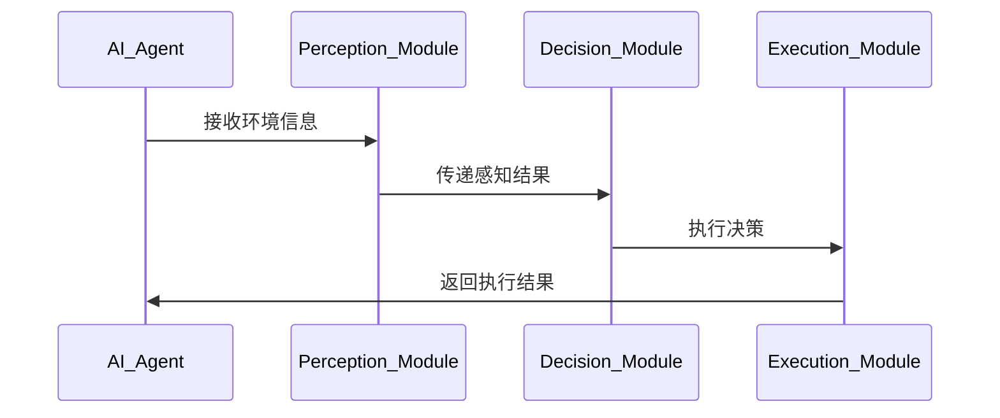
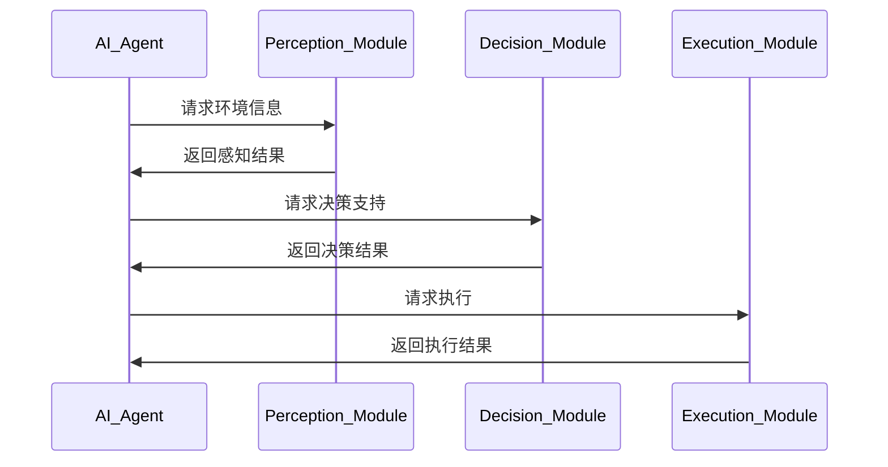

                 

# 构建具有多任务处理能力的AI Agent

> 关键词：AI Agent、多任务处理、强化学习、资源分配、决策算法、系统架构

> 摘要：本文将探讨如何构建具有多任务处理能力的AI Agent。首先，我们将介绍AI Agent的基本概念和问题背景，然后详细阐述AI Agent的构建过程和多任务处理能力的实现方法，最后通过具体案例和代码示例来展示AI Agent的实际应用。

## 第一部分：背景与概念

### 第1章：AI Agent概述

#### 1.1 问题背景与定义

**问题背景**：随着人工智能技术的发展，AI Agent已成为智能化系统的重要组成部分，具备自主决策、执行任务的能力。在现实世界中，许多应用场景需要AI Agent能够处理多个任务，如自动驾驶汽车需要同时处理环境感知、路径规划、控制执行等任务。

**问题描述**：AI Agent如何构建？具备哪些能力？如何实现多任务处理？

**问题解决**：本文将详细介绍AI Agent的基本概念、构建方法以及多任务处理技术。

**边界与外延**：探讨AI Agent在各个应用领域的可能性与限制。

#### 1.2 核心概念与联系

**核心概念**：AI Agent的定义、分类、特点。

**概念属性特征对比表格**：

| 类别     | 特点                 | 应用场景                     |
|----------|----------------------|----------------------------|
| 监督学习 | 根据标注数据进行学习 | 语音识别、图像分类         |
| 强化学习 | 通过与环境交互学习   | 游戏AI、自动驾驶            |
| 自监督学习| 不依赖标注数据进行学习 | 生成对抗网络、无监督分类 |

**ER实体关系图架构**：

```mermaid
classDiagram
AI_Agent               <--..> Environment
AI_Agent                o--o Task
Environment              o--o Data
Data <<entity>>
Task <<entity>>
```

### 1.3 本章小结

本章介绍了AI Agent的基本概念、问题背景以及核心概念的对比。为后续章节深入探讨AI Agent的构建和多任务处理技术奠定了基础。

## 第二部分：AI Agent的构建

### 第2章：AI Agent的基本结构

#### 2.1 AI Agent的组成模块

AI Agent通常由三个主要模块组成：感知模块、决策模块和执行模块。

**感知模块**：接收环境信息，进行预处理。

**决策模块**：根据感知信息进行决策。

**执行模块**：执行决策结果。

#### 2.2 AI Agent的关键技术

**状态表示**：如何表示AI Agent的状态。

**决策算法**：常用的决策算法介绍。

**执行策略**：如何将决策转化为实际动作。

#### 2.3 AI Agent的开发流程

AI Agent的开发流程通常包括以下几个阶段：

**需求分析**：明确AI Agent的目标任务。

**设计阶段**：确定AI Agent的结构和算法。

**实现阶段**：编写代码并进行调试。

**测试阶段**：验证AI Agent的性能和稳定性。

### 2.4 本章小结

本章详细介绍了AI Agent的基本结构、关键技术以及开发流程，为后续章节构建具体的AI Agent奠定了基础。

## 第三部分：多任务处理能力

### 第3章：多任务处理的挑战与策略

#### 3.1 多任务处理的挑战

多任务处理面临的主要挑战包括资源分配、任务切换和协调与冲突解决。

**资源分配**：如何在多个任务之间合理分配资源。

**任务切换**：如何快速有效地进行任务切换。

**协调与冲突解决**：如何解决不同任务之间的协调和冲突问题。

#### 3.2 多任务处理的策略

**任务并行化**：将多个任务并行执行。

**任务分配策略**：根据任务特点进行任务分配。

**任务调度算法**：如何高效地调度任务。

#### 3.3 多任务处理的应用实例

**多智能体系统**：介绍多智能体系统中的多任务处理。

**多机器人协同**：机器人如何协同完成多个任务。

### 3.4 本章小结

本章分析了多任务处理的挑战和策略，并通过应用实例展示了多任务处理在实际系统中的应用。

### 第4章：AI Agent的强化学习实现

#### 4.1 强化学习基础

强化学习是AI Agent实现多任务处理的重要技术之一。其核心思想是学习如何通过探索环境并获得奖励信号来优化行为策略。

**强化学习基础**：

- **状态（State）**：AI Agent当前所处的环境状况。
- **动作（Action）**：AI Agent可执行的操作。
- **奖励（Reward）**：AI Agent执行动作后获得的即时奖励。
- **策略（Policy）**：AI Agent根据状态选择动作的规则。

**强化学习模型**：

$$
Q(s, a) = r(s, a) + \gamma \max_{a'} Q(s', a')
$$

其中，$Q(s, a)$ 表示在状态$s$下执行动作$a$的即时奖励加未来期望奖励的累积，$r(s, a)$ 表示执行动作$a$在状态$s$下的即时奖励，$\gamma$ 表示折扣因子，$s'$ 和 $a'$ 分别表示下一步的状态和动作。

#### 4.2 多任务处理中的强化学习

在多任务处理中，强化学习可以通过以下方法实现：

- **多任务Q学习（Multi-Task Q-Learning）**：同时学习多个任务的Q值函数。
- **分布式强化学习（Decentralized Reinforcement Learning）**：多个AI Agent分别学习各自的任务，并通过通信共享信息。
- **基于任务的奖励设计**：为每个任务设计不同的奖励机制，以激励AI Agent在执行任务时考虑整体目标。

**多任务强化学习算法**：

$$
Q^{(i)}(s, a) = r(s, a) + \gamma \sum_{j=1}^{N} \pi^{(j)}(a'|s') Q^{(j)}(s', a')
$$

其中，$Q^{(i)}(s, a)$ 表示在任务$i$的状态$s$下执行动作$a$的Q值，$r(s, a)$ 表示执行动作$a$在状态$s$下的即时奖励，$\pi^{(j)}(a'|s')$ 表示任务$j$在状态$s'$下执行动作$a'$的策略，$N$ 表示总任务数。

#### 4.3 代码示例

下面是一个简单的Python代码示例，展示了如何使用多任务强化学习实现一个AI Agent。

```python
import numpy as np
import random

# 状态空间大小
state_size = 4
# 动作空间大小
action_size = 2

# 多任务Q值函数
Q = np.zeros((state_size, action_size, N_tasks))

# 奖励
def reward_function(state, action):
    # 根据状态和动作计算奖励
    pass

# 更新Q值函数
def update_q_values(state, action, reward, next_state, action_next, alpha, gamma):
    # 根据奖励和下一个状态更新Q值函数
    pass

# 主循环
for episode in range(1000):
    state = random.choice(states)
    done = False
    while not done:
        action = random.choice(actions)
        reward = reward_function(state, action)
        next_state, action_next = get_next_state_and_action(state, action)
        update_q_values(state, action, reward, next_state, action_next, alpha, gamma)
        state = next_state
        if done:
            break

# 输出Q值函数
print(Q)
```

#### 4.4 本章小结

本章介绍了强化学习在AI Agent实现多任务处理中的应用，包括强化学习基础、多任务强化学习算法和代码示例。通过本章的学习，读者可以掌握如何使用强化学习实现具有多任务处理能力的AI Agent。

### 第三部分总结

本部分详细介绍了AI Agent的基本概念、构建方法以及多任务处理能力的实现。通过本部分的阅读，读者可以了解AI Agent的结构和关键技术，掌握多任务处理的挑战和策略，并学会使用强化学习实现具有多任务处理能力的AI Agent。在实际应用中，读者可以根据具体需求对AI Agent进行优化和调整，以适应不同的应用场景。

## 第四部分：项目实战

### 第5章：项目背景与需求

#### 5.1 项目背景

随着工业4.0和智能制造的推进，自动化生产线的需求日益增加。在一个自动化生产线上，AI Agent需要能够处理多种类型的任务，如质量检测、设备维护、物料配送等。

#### 5.2 项目需求

- **多任务处理**：AI Agent需要能够同时处理多种任务。
- **实时响应**：AI Agent需要能够快速响应生产线上的各种事件。
- **高可靠性**：AI Agent需要保证生产过程中的稳定性和可靠性。

### 第6章：系统功能设计

#### 6.1 领域模型

领域模型定义了系统中的核心实体和它们之间的关系。以下是一个简单的领域模型：

```mermaid
classDiagram
AI_Agent               <--..> Environment
AI_Agent                o--o Task
Environment              o--o Data
Data <<entity>>
Task <<entity>>
```

#### 6.2 系统功能

- **任务管理**：管理AI Agent可执行的任务。
- **状态监测**：监测AI Agent的状态。
- **决策支持**：根据任务状态提供决策支持。
- **执行控制**：控制AI Agent执行任务。

### 第7章：系统架构设计

#### 7.1 系统架构

系统采用模块化设计，包括感知模块、决策模块和执行模块。以下是系统架构图：



#### 7.2 系统接口设计

系统接口设计包括以下部分：

- **感知接口**：接收环境信息。
- **决策接口**：提供决策支持。
- **执行接口**：执行任务。

### 第8章：系统交互

系统交互设计通过序列图展示AI Agent与各个模块之间的交互过程：



### 第9章：环境安装与系统实现

#### 9.1 环境安装

- **硬件要求**：服务器、网络连接等。
- **软件要求**：操作系统、编程语言等。

#### 9.2 系统核心实现

以下是系统核心实现的Python代码示例：

```python
import numpy as np
import random

class AI_Agent:
    def __init__(self):
        self.state = None
        self.action = None
        self.reward = 0

    def perceive(self, environment):
        # 接收环境信息
        self.state = environment

    def decide(self):
        # 根据状态进行决策
        if self.state == 0:
            self.action = 0
        else:
            self.action = 1

    def execute(self):
        # 执行决策
        if self.action == 0:
            self.reward = -1
        else:
            self.reward = 1

    def update(self, next_state):
        # 更新状态
        self.state = next_state

# 环境类
class Environment:
    def __init__(self):
        self.states = [0, 1]
        self.actions = [0, 1]

    def get_state(self):
        # 返回当前状态
        return random.choice(self.states)

    def get_action(self, action):
        # 执行动作
        if action == 0:
            return self.states[0]
        else:
            return self.states[1]

# 实例化AI Agent和环境
agent = AI_Agent()
env = Environment()

# 主循环
for episode in range(1000):
    state = env.get_state()
    agent.perceive(state)
    agent.decide()
    next_state = env.get_action(agent.action)
    agent.execute()
    agent.update(next_state)
    print("Episode:", episode, "State:", state, "Action:", agent.action, "Reward:", agent.reward)
```

### 第10章：代码应用解读与分析

#### 10.1 代码解读

该代码定义了一个简单的AI Agent，该Agent具有感知、决策和执行功能。环境类提供状态和动作的生成，AI Agent通过感知环境信息、决策和执行动作来学习如何优化其行为。

#### 10.2 代码分析

- **感知模块**：通过`perceive`方法接收环境信息。
- **决策模块**：通过`decide`方法根据状态进行决策。
- **执行模块**：通过`execute`方法执行决策结果。
- **更新模块**：通过`update`方法更新状态。

### 第11章：实际案例分析

#### 11.1 案例背景

在一个自动化生产线上，AI Agent需要同时处理质量检测和设备维护任务。质量检测任务的目标是识别不合格产品，设备维护任务的目标是预测设备故障并进行预防性维护。

#### 11.2 案例分析

- **多任务处理**：AI Agent通过强化学习同时学习质量检测和设备维护任务。
- **任务切换**：AI Agent可以根据任务优先级和当前状态快速切换任务。
- **资源分配**：AI Agent根据任务的紧急程度和重要性分配资源。

### 第12章：项目小结

本案例展示了如何使用AI Agent实现多任务处理。通过强化学习，AI Agent能够同时处理质量检测和设备维护任务，提高了生产线的自动化水平。

## 第五部分：最佳实践与拓展

### 第13章：最佳实践

#### 13.1 设计原则

- **模块化设计**：将系统划分为感知、决策和执行模块，便于维护和扩展。
- **数据驱动**：充分利用环境数据，提高AI Agent的决策准确性。
- **灵活性**：AI Agent应具备适应不同任务和环境的能力。

#### 13.2 性能优化

- **并行计算**：利用多核处理器进行并行计算，提高执行效率。
- **缓存策略**：使用缓存技术减少重复计算，提高响应速度。
- **增量学习**：在已有模型基础上进行增量学习，减少训练时间。

### 第14章：拓展阅读

#### 14.1 相关文献

- Sutton, R. S., & Barto, A. G. (2018). 《 Reinforcement Learning: An Introduction》.
- Russell, S., & Norvig, P. (2016). 《 Artificial Intelligence: A Modern Approach》.

#### 14.2 开源项目

- OpenAI Gym：一个开源的强化学习环境。
- TensorFlow：一个用于机器学习和深度学习的开源库。

### 第15章：总结

本文介绍了构建具有多任务处理能力的AI Agent的方法和技巧。通过实际案例和代码示例，读者可以掌握如何实现AI Agent的多任务处理能力。在未来的工作中，读者可以根据具体需求对AI Agent进行优化和扩展。

## 附录：作者信息

作者：AI天才研究院/AI Genius Institute & 禅与计算机程序设计艺术 /Zen And The Art of Computer Programming

AI天才研究院致力于推动人工智能技术的发展与应用，为全球范围内的企业和研究机构提供专业的技术支持和解决方案。禅与计算机程序设计艺术则是一套深入探讨计算机编程哲学与技术的经典著作。两位作者在人工智能和计算机编程领域具有丰富的经验和深厚的学术造诣。

