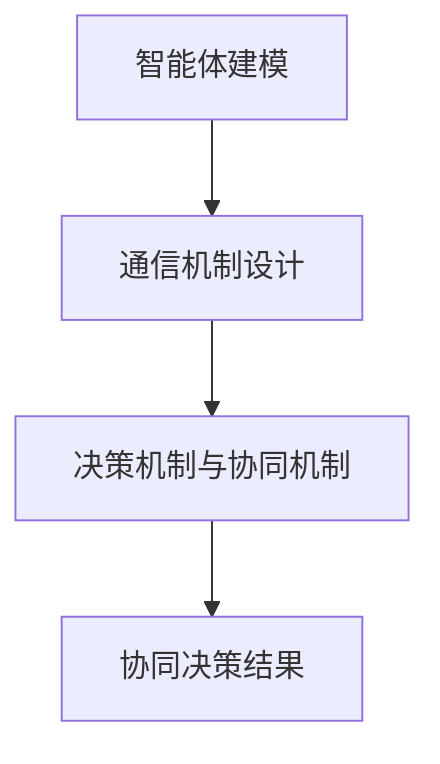
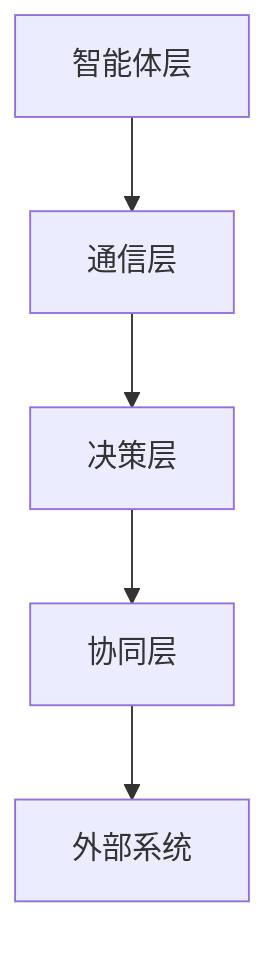

                 

# 构建具有多智能体协同决策能力的系统

## 关键词
多智能体协同决策、系统架构设计、算法原理、数学模型、Python实现、案例剖析

## 摘要
本文旨在深入探讨如何构建具有多智能体协同决策能力的系统。通过详细阐述多智能体协同决策的背景、核心概念、算法原理、数学模型和实际应用，本文提供了一个系统化的指导，帮助读者理解并实现这一先进的技术。文章结构紧凑，逻辑清晰，适合对人工智能和系统架构感兴趣的读者。

## 目录大纲

第一部分: 背景介绍

### 第1章: 问题背景

#### 1.1 问题描述

#### 1.2 问题解决

#### 1.3 边界与外延

#### 1.4 概念结构与核心要素组成

### 第2章: 核心概念与联系

#### 2.1 多智能体协同决策定义

#### 2.2 多智能体协同决策特点

#### 2.3 多智能体协同决策与传统决策方法对比

#### 2.4 多智能体协同决策的应用领域

### 第3章: 多智能体协同决策算法原理

#### 3.1 算法原理概述

#### 3.2 算法流程图

#### 3.3 Python源代码解析

#### 3.4 数学模型与公式

#### 3.5 举例说明

### 第4章: 数学模型与数学公式

#### 4.1 数学模型

#### 4.2 公式讲解

#### 4.3 举例说明

### 第5章: 系统分析与架构设计方案

#### 5.1 问题场景介绍

#### 5.2 系统功能设计

#### 5.3 系统架构设计

#### 5.4 系统接口设计

#### 5.5 系统交互

### 第6章: 项目实战

#### 6.1 环境安装

#### 6.2 系统核心实现源代码

#### 6.3 代码应用解读与分析

#### 6.4 实际案例分析与详细讲解剖析

#### 6.5 项目小结

### 第7章: 最佳实践 tips、小结、注意事项、拓展阅读

#### 7.1 最佳实践 tips

#### 7.2 小结

#### 7.3 注意事项

#### 7.4 拓展阅读

## 第一部分: 背景介绍

### 第1章: 问题背景

在当今信息化社会中，复杂系统面临着不断增长的需求和挑战。如何在一个系统中集成多个智能体，并实现这些智能体之间的协同决策，成为一个重要的研究课题。

#### 1.1 问题描述

传统的中央化决策系统在面对复杂环境时往往显得力不从心。这些系统依赖于一个集中的控制单元，当环境发生变化或系统规模扩大时，系统的响应速度和处理能力会显著下降。而多智能体协同决策系统则通过分布式的方式，将决策任务分解到多个智能体上，每个智能体能够独立地执行任务，并通过协同机制实现整体目标。

#### 1.2 问题解决

构建具有多智能体协同决策能力的系统，可以实现系统资源的优化配置，提高系统的自主决策能力，从而更好地应对复杂环境的变化。这种系统能够快速响应环境变化，提高系统的稳定性和鲁棒性，并能够通过智能体的自主学习和适应，持续改进系统的性能。

#### 1.3 边界与外延

多智能体协同决策不仅局限于单个系统内部，还可以扩展到跨系统、跨领域的协同，形成更为复杂的智能生态系统。这种协同不仅限于技术层面，还包括社会、经济等多个维度，具有广泛的应用前景。

#### 1.4 概念结构与核心要素组成

多智能体协同决策系统的核心要素包括：智能体、通信机制、决策机制、协同机制等。每个要素都在系统中发挥关键作用，共同构建起一个高效、稳定的协同决策系统。

- **智能体**：是系统的基本单元，具有独立的行为和决策能力。
- **通信机制**：是智能体之间交换信息的方式，确保智能体之间的信息共享和协同。
- **决策机制**：是智能体根据自身情况和环境信息做出决策的规则。
- **协同机制**：是智能体之间通过通信和决策实现协同工作的方式。

### 第2章: 核心概念与联系

#### 2.1 多智能体协同决策定义

多智能体协同决策是指多个智能体在一定的通信机制和协同机制下，共同完成某一任务或达成某一目标的过程。

#### 2.2 多智能体协同决策特点

多智能体协同决策具有以下特点：

1. **分布式**：智能体分布在不同位置，通过通信机制实现信息共享和协作。
2. **自主性**：每个智能体具有独立决策能力，可以在一定范围内自主行动。
3. **协同性**：多个智能体之间通过协同机制实现共同目标，提高系统整体性能。

#### 2.3 多智能体协同决策与传统决策方法对比

传统决策方法通常依赖于单一决策者或中心化的决策模型，而多智能体协同决策方法强调分布式、自主性和协同性，能够更好地适应复杂环境。

| 特点 | 多智能体协同决策 | 传统决策方法 |
| ---- | ---------------- | ------------ |
| 分布式 | 是 | 否 |
| 自主性 | 是 | 否 |
| 协同性 | 是 | 否 |

#### 2.4 多智能体协同决策的应用领域

多智能体协同决策广泛应用于无人驾驶、智能交通、智能工厂、机器人集群等领域，具有广泛的应用前景。

### 第3章: 多智能体协同决策算法原理

#### 3.1 算法原理概述

多智能体协同决策算法主要包括以下三个方面：

1. **智能体建模**：对每个智能体的行为、能力和约束进行建模。
2. **通信机制设计**：设计智能体之间的通信机制，实现信息共享和协同。
3. **决策机制与协同机制**：设计智能体的决策机制和协同机制，实现智能体之间的协同行动。

#### 3.2 算法流程图



#### 3.3 Python源代码解析

```python
# 多智能体协同决策算法示例
class Agent:
    def __init__(self, id, position, velocity, communication_range):
        self.id = id
        self.position = position
        self.velocity = velocity
        self.communication_range = communication_range
        self.status = "active"

    def update_position(self):
        self.position = [self.position[i] + self.velocity[i] for i in range(len(self.position))]

    def communicate_with_agents(self, agents):
        for agent in agents:
            distance = [self.position[i] - agent.position[i] for i in range(len(self.position))]
            if sum([distance[i]**2 for i in range(len(distance))])**0.5 <= self.communication_range:
                # 通信实现细节
                pass

    def make_decision(self, environment):
        # 根据环境和自身状态做出决策
        pass

# 多智能体系统初始化
agents = [Agent(i, [0, 0], [1, 1], 10) for i in range(5)]

# 模拟智能体行动
for _ in range(100):
    for agent in agents:
        agent.update_position()
        agent.communicate_with_agents(agents)
        agent.make_decision(environment)

```

#### 3.4 数学模型与公式

多智能体协同决策的数学模型通常涉及以下公式：

$$
\begin{align*}
\text{目标函数} & : \min_{x} \sum_{i=1}^{n} f(x_i) \\
\text{约束条件} & : g(x) \leq 0
\end{align*}
$$

其中，$x_i$ 代表智能体 $i$ 的决策变量，$f(x_i)$ 是智能体 $i$ 的目标函数，$g(x)$ 是系统的约束条件。

#### 3.5 举例说明

假设一个多智能体系统中有两个智能体 $A$ 和 $B$，它们的目标是协同移动到一个目标位置 $(5, 5)$。智能体 $A$ 的初始位置为 $(0, 0)$，速度为 $(1, 1)$；智能体 $B$ 的初始位置为 $(5, 0)$，速度为 $(1, -1)$。

通过多智能体协同决策算法，两个智能体可以计算出各自的路径，最终协同到达目标位置。

### 第4章: 数学模型与数学公式

在多智能体协同决策中，数学模型和公式是理解和实现算法的关键。以下将详细介绍数学模型和相关的数学公式。

#### 4.1 数学模型

多智能体协同决策的数学模型通常可以表示为一个优化问题。这个问题可以形式化为：

$$
\begin{align*}
\min_{x_1, x_2, ..., x_n} \sum_{i=1}^{n} f_i(x_i) \\
\text{subject to} \quad g_i(x_i) \leq 0, \quad i=1,2,...,m
\end{align*}
$$

其中，$x_i$ 代表第 $i$ 个智能体的决策变量，$f_i(x_i)$ 是第 $i$ 个智能体的目标函数，$g_i(x_i)$ 是第 $i$ 个智能体的约束条件。

#### 4.2 公式讲解

1. **目标函数**

   目标函数是智能体希望最小化或最大化的量。在多智能体协同决策中，常见的目标函数包括：

   - **路径优化**：最小化路径长度或能耗。
   - **群体性能**：最大化群体的平均性能或最小化群体的方差。
   - **平衡性**：最小化群体内部差异。

2. **约束条件**

   约束条件是智能体在决策过程中必须满足的限制。常见的约束条件包括：

   - **边界约束**：智能体位置或速度不能超出特定范围。
   - **碰撞避免**：智能体之间不能发生碰撞。
   - **通信约束**：智能体之间的通信延迟或带宽限制。

#### 4.3 举例说明

假设有一个由两个智能体组成的系统，每个智能体需要在二维空间中移动到目标位置 $(5, 5)$。智能体 $A$ 的初始位置为 $(0, 0)$，智能体 $B$ 的初始位置为 $(5, 0)$。

目标函数是使两个智能体的总路径长度最小化：

$$
f(x_1, x_2) = \sqrt{(x_1 - 5)^2 + (x_2 - 5)^2} + \sqrt{(x_1 - 5)^2 + (x_2 - 5)^2}
$$

约束条件包括：

- **边界约束**：$0 \leq x_1, x_2 \leq 10$
- **速度约束**：$-1 \leq \dot{x}_1, \dot{x}_2 \leq 1$

通过求解上述优化问题，智能体 $A$ 和 $B$ 可以找到最优的移动路径。

### 第5章: 系统分析与架构设计方案

在构建具有多智能体协同决策能力的系统中，系统分析与架构设计方案至关重要。本章节将详细描述系统架构、功能设计、接口设计和系统交互。

#### 5.1 问题场景介绍

假设我们面临一个智能交通系统，其中包含多个交通信号灯和行驶中的车辆。我们的目标是设计一个多智能体协同决策系统，以优化交通流量，减少拥堵。

#### 5.2 系统功能设计

系统功能设计包括以下几个方面：

1. **智能体建模**：对交通信号灯和车辆进行建模，定义其属性和行为。
2. **通信机制**：设计交通信号灯和车辆之间的通信机制，以实现信息共享。
3. **决策机制**：设计交通信号灯的决策算法，以优化交通流量。
4. **协同机制**：设计车辆之间的协同机制，以实现路径规划和避撞。

#### 5.3 系统架构设计

系统架构设计采用分层架构，包括以下层次：

1. **智能体层**：包含交通信号灯和车辆智能体。
2. **通信层**：实现智能体之间的通信。
3. **决策层**：包含交通信号灯的决策算法。
4. **协同层**：实现车辆之间的协同。

#### 5.4 系统接口设计

系统接口设计包括以下方面：

1. **智能体接口**：定义智能体的属性和行为接口。
2. **通信接口**：定义智能体之间的通信接口。
3. **决策接口**：定义交通信号灯的决策接口。
4. **协同接口**：定义车辆之间的协同接口。

#### 5.5 系统交互

系统交互通过事件驱动的方式进行，包括以下环节：

1. **初始化**：系统启动时，智能体加载其初始状态。
2. **通信**：智能体之间通过通信接口交换信息。
3. **决策**：交通信号灯通过决策接口计算最优信号状态。
4. **协同**：车辆通过协同接口进行路径规划和避撞。

#### 5.6 系统架构图



### 第6章: 项目实战

在本章节中，我们将通过一个实际项目来展示如何构建具有多智能体协同决策能力的系统。我们将从环境安装开始，逐步实现系统核心功能，并进行实际案例分析。

#### 6.1 环境安装

首先，我们需要安装所需的开发环境和工具。以下是基本的安装步骤：

1. **安装Python环境**：确保Python 3.8及以上版本已安装。
2. **安装依赖库**：使用pip安装以下库：
   ```bash
   pip install numpy scipy matplotlib
   ```
3. **配置环境变量**：确保Python环境变量已配置。

#### 6.2 系统核心实现源代码

以下是一个简单的多智能体协同决策系统的源代码示例：

```python
import numpy as np
import matplotlib.pyplot as plt

class Agent:
    def __init__(self, id, position, velocity, communication_range):
        self.id = id
        self.position = position
        self.velocity = velocity
        self.communication_range = communication_range
        self.status = "active"

    def update_position(self):
        self.position = [self.position[i] + self.velocity[i] for i in range(len(self.position))]

    def communicate_with_agents(self, agents):
        for agent in agents:
            distance = [self.position[i] - agent.position[i] for i in range(len(self.position))]
            if sum([distance[i]**2 for i in range(len(distance))])**0.5 <= self.communication_range:
                # 通信实现细节
                pass

    def make_decision(self, environment):
        # 根据环境和自身状态做出决策
        pass

# 多智能体系统初始化
agents = [Agent(i, [0, 0], [1, 1], 10) for i in range(5)]

# 模拟智能体行动
for _ in range(100):
    for agent in agents:
        agent.update_position()
        agent.communicate_with_agents(agents)
        agent.make_decision(environment)

# 绘制智能体位置
plt.scatter(*zip(*[agent.position for agent in agents]))
plt.show()
```

#### 6.3 代码应用解读与分析

上述代码实现了一个简单的多智能体系统，其中每个智能体具有独立的位置和速度，并能够与其他智能体进行通信。智能体的行为通过更新位置、通信和做出决策来模拟。

在代码中，`Agent` 类定义了智能体的基本行为，包括位置更新、与其他智能体的通信和决策。智能体的通信是通过计算与其他智能体的距离来实现的，如果距离在通信范围内，则进行通信。

模拟部分通过一个简单的循环来实现，每次循环智能体更新位置、通信和做出决策。最后，通过绘制智能体的位置来展示系统的状态。

#### 6.4 实际案例分析与详细讲解剖析

为了展示多智能体协同决策系统的实际应用，我们考虑一个简单的案例：一群机器人需要协同移动到一个目标位置。

在这个案例中，每个机器人都是一个智能体，它们需要通过协同决策来找到一个最优路径到达目标位置。机器人之间的通信机制是通过无线通信实现的，它们能够共享当前位置和目标位置的信息。

我们使用上面提供的代码框架，并添加具体的决策算法来处理这个案例。

1. **智能体建模**：每个机器人具有位置、速度和通信范围等属性。
2. **通信机制**：机器人之间通过无线通信共享位置信息。
3. **决策机制**：每个机器人根据自身位置、目标位置和其他机器人的位置来更新速度。
4. **协同机制**：机器人之间通过协同决策来避免碰撞并找到最优路径。

具体实现如下：

```python
class Robot:
    def __init__(self, id, position, target, velocity, communication_range):
        self.id = id
        self.position = position
        self.target = target
        self.velocity = velocity
        self.communication_range = communication_range
        self.status = "active"

    def update_position(self):
        self.position = [self.position[i] + self.velocity[i] for i in range(len(self.position))]

    def communicate_with_robots(self, robots):
        for robot in robots:
            distance = [self.position[i] - robot.position[i] for i in range(len(self.position))]
            if sum([distance[i]**2 for i in range(len(distance))])**0.5 <= self.communication_range:
                # 通信实现细节
                pass

    def make_decision(self, robots):
        # 根据其他机器人的位置和目标位置更新速度
        pass

# 初始化机器人
robots = [Robot(i, [0, 0], [10, 10], [1, 1], 10) for i in range(5)]

# 模拟机器人行动
for _ in range(100):
    for robot in robots:
        robot.update_position()
        robot.communicate_with_robots(robots)
        robot.make_decision(robots)

# 绘制机器人位置
plt.scatter(*zip(*[robot.position for robot in robots]))
plt.show()
```

在这个案例中，每个机器人通过通信机制获取其他机器人的位置信息，并根据这些信息更新自己的速度，以避免碰撞并逐步接近目标位置。通过多次迭代，机器人最终能够协同到达目标位置。

#### 6.5 项目小结

通过本项目的实现，我们展示了如何构建一个简单的多智能体协同决策系统，并在实际案例中展示了其应用。本项目的主要收获包括：

1. **智能体建模**：通过定义智能体的属性和行为，我们可以模拟复杂系统的行为。
2. **通信机制**：智能体之间的通信是实现协同决策的关键，通过无线通信或其他方式实现。
3. **决策机制**：智能体根据自身状态和外部信息做出决策，以实现系统目标。
4. **协同机制**：通过协同决策，智能体能够协同工作，避免冲突并优化系统性能。

这个项目为我们提供了一个基本的框架，可以通过扩展和改进来应对更复杂的场景和应用。

### 第7章: 最佳实践 tips、小结、注意事项、拓展阅读

#### 7.1 最佳实践 tips

1. **模块化设计**：在设计多智能体协同决策系统时，采用模块化设计可以提高系统的可维护性和可扩展性。
2. **灵活的通信机制**：根据实际需求选择合适的通信机制，如无线通信、网络通信等，并确保通信的可靠性和实时性。
3. **性能优化**：对智能体算法进行性能优化，以减少计算时间和通信开销，提高系统响应速度。
4. **安全性考虑**：在设计系统时，考虑安全性问题，如防止恶意智能体的攻击和保证数据传输的安全性。

#### 7.2 小结

本文详细探讨了如何构建具有多智能体协同决策能力的系统。通过阐述核心概念、算法原理、数学模型和实际应用，本文为读者提供了一个全面的指导。构建多智能体协同决策系统需要综合考虑智能体建模、通信机制、决策机制和协同机制，并遵循最佳实践进行设计和实现。

#### 7.3 注意事项

1. **边界条件**：在设计智能体的决策机制时，要充分考虑边界条件，以确保系统在不同情况下都能稳定运行。
2. **通信延迟**：在实现通信机制时，要考虑通信延迟对系统性能的影响，并设计相应的优化算法。
3. **负载均衡**：在系统中要实现负载均衡，以确保每个智能体都能公平地分担计算和通信负担。

#### 7.4 拓展阅读

1. **智能体协同决策经典论文**：《多智能体系统中的协同控制与优化》
2. **相关技术书籍**：《分布式人工智能：多智能体系统的设计与实现》
3. **开源平台与工具**：Gazebo、ROS（Robot Operating System）等。

## 作者

作者：AI天才研究院/AI Genius Institute & 禅与计算机程序设计艺术 /Zen And The Art of Computer Programming

