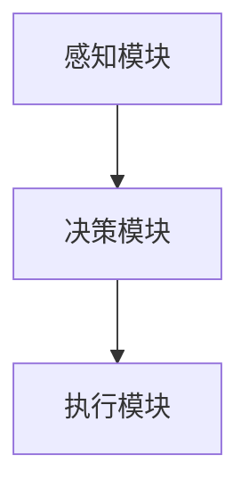
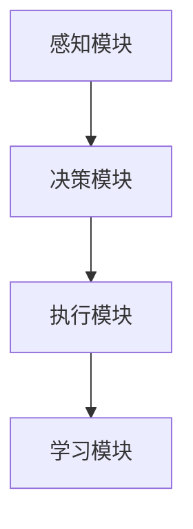
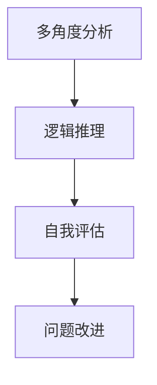

                 

## 《构建具有批判性思维的AI Agent系统》

> 关键词：AI Agent、批判性思维、系统架构、算法实现、项目实战

> 摘要：本文旨在探讨如何构建具有批判性思维的AI Agent系统。文章首先介绍了AI Agent的基础知识和批判性思维的概念，接着分析了二者的联系。随后，文章详细阐述了AI Agent的系统架构设计，包括核心模块和算法实现。随后，通过一个实际项目案例，展示了如何将批判性思维应用于AI Agent系统开发。最后，文章总结了最佳实践，并提出了未来展望。

### 引言

在当今社会，人工智能（AI）已经成为一种变革性的技术，它在各个领域都有着广泛的应用。AI Agent作为AI的一种重要形式，能够模拟人类智能进行决策和任务执行。然而，传统AI Agent系统往往缺乏批判性思维，容易陷入“黑箱”问题，无法对自身行为进行有效评估和调整。因此，如何构建具有批判性思维的AI Agent系统，成为了一个亟待解决的问题。

本文将围绕以下核心问题展开：

1. AI Agent是什么，其发展历程和核心技术是什么？
2. 批判性思维的概念及其在AI Agent中的应用。
3. 如何设计一个具有批判性思维的AI Agent系统？
4. 实际项目中如何实现和应用批判性思维？

本文将逐步回答上述问题，旨在为AI Agent系统的设计和开发提供有价值的参考。

### 第1章 AI Agent基础知识

#### 1.1 AI Agent的定义与分类

AI Agent是指一种具有自主决策能力和执行能力的计算机系统，能够在复杂环境中独立完成任务。根据其功能特点，AI Agent可以划分为以下几种类型：

1. **反应型Agent**：仅根据当前感知环境的信息做出反应，不具备记忆和计划能力。
2. **认知型Agent**：具有记忆和计划能力，能够根据历史数据和环境信息进行决策。
3. **学习型Agent**：能够通过经验和数据不断改进自身性能。
4. **社会型Agent**：能够在多个Agent之间进行协作和通信。

#### 1.2 AI Agent的核心技术

AI Agent的核心技术包括：

1. **感知技术**：用于获取和解释环境信息。
2. **决策技术**：基于感知信息进行决策。
3. **执行技术**：执行决策结果。
4. **学习技术**：通过不断学习和优化提升性能。

#### 1.3 AI Agent的发展历程

AI Agent的发展历程可以分为以下几个阶段：

1. **初期阶段**（1956-1974）：人工智能的概念被提出，AI Agent的概念逐渐形成。
2. **发展阶段**（1974-1980）：AI Agent技术开始应用于实际场景，如机器人。
3. **低谷阶段**（1980-1993）：由于技术局限和实际应用困难，AI Agent研究进入低谷。
4. **复兴阶段**（1993-至今）：随着计算机技术和算法的进步，AI Agent技术重新受到关注。

#### 1.4 AI Agent的概念结构与核心要素组成

AI Agent的基本结构包括感知模块、决策模块和执行模块。各模块之间的交互关系如下图所示：



- **感知模块**：用于获取环境信息，如视觉、听觉等。
- **决策模块**：根据感知信息进行决策，如选择动作。
- **执行模块**：执行决策结果，如移动、抓取等。

### 第2章 批判性思维与AI Agent

#### 2.1 批判性思维的概念与特点

批判性思维是指对事物进行深入、客观、全面分析的能力。其特点包括：

1. **客观性**：以事实为基础，避免主观偏见。
2. **全面性**：考虑各种可能性，不片面看待问题。
3. **逻辑性**：遵循逻辑规则，推理严谨。
4. **独立性**：不依赖权威，敢于质疑。

#### 2.2 批判性思维在AI Agent中的应用

将批判性思维引入AI Agent系统，可以使AI Agent在以下方面得到提升：

1. **自我评估**：AI Agent能够评估自身行为的有效性，发现问题并改进。
2. **自适应能力**：AI Agent能够根据环境变化调整自身策略。
3. **抗干扰能力**：AI Agent能够识别和过滤噪声信息。

#### 2.3 批判性思维的属性特征对比表格

| 特征 | 批判性思维 | 传统AI |
| --- | --- | --- |
| **客观性** | 以事实为基础，避免主观偏见 | 可能存在偏见 |
| **全面性** | 考虑各种可能性，不片面看待问题 | 可能只考虑部分信息 |
| **逻辑性** | 遵循逻辑规则，推理严谨 | 可能逻辑混乱 |
| **独立性** | 不依赖权威，敢于质疑 | 可能依赖权威，缺乏质疑 |

### 第3章 AI Agent的架构设计

#### 3.1 AI Agent的体系结构

AI Agent的体系结构通常包括以下几个层次：

1. **感知层**：获取环境信息。
2. **决策层**：处理感知信息，生成决策。
3. **执行层**：执行决策，完成任务。

#### 3.2 AI Agent的核心模块

AI Agent的核心模块包括：

1. **感知模块**：用于获取环境信息。
2. **决策模块**：用于处理感知信息，生成决策。
3. **执行模块**：用于执行决策，完成任务。
4. **学习模块**：用于不断学习和优化。

#### 3.3 AI Agent的Mermaid架构图



### 第4章 批判性思维的算法实现

#### 4.1 批判性思维算法原理

批判性思维算法基于以下几个核心原理：

1. **多角度分析**：从多个角度分析问题，避免片面看待。
2. **逻辑推理**：使用逻辑规则进行推理，确保推理过程的严谨性。
3. **自我评估**：对自身行为进行评估，发现问题并进行改进。

#### 4.2 批判性思维算法流程图



#### 4.3 Python源代码示例

```python
# 批判性思维算法示例

def critical_thinking(problem):
    # 多角度分析
    perspectives = analyze_from_multiple角度来看问题(problem)
    
    # 逻辑推理
    reasoning = logical_reasoning(perspectives)
    
    # 自我评估
    evaluation = self_evaluation(reasoning)
    
    # 问题改进
    improved_solution = improve_solution(problem, evaluation)
    
    return improved_solution

# 多角度分析
def analyze_from_multiple角度来看问题(problem):
    perspectives = []
    # ...此处省略具体实现...
    return perspectives

# 逻辑推理
def logical_reasoning(perspectives):
    reasoning = []
    # ...此处省略具体实现...
    return reasoning

# 自我评估
def self_evaluation(reasoning):
    evaluation = []
    # ...此处省略具体实现...
    return evaluation

# 问题改进
def improve_solution(problem, evaluation):
    improved_solution = problem
    # ...此处省略具体实现...
    return improved_solution
```

#### 4.4 数学模型与公式讲解

批判性思维的数学模型可以表示为：

$$
\text{批判性思维} = f(\text{多角度分析}, \text{逻辑推理}, \text{自我评估})
$$

其中，$f$ 表示一个复合函数，$f$ 的输入是三个变量，输出是批判性思维的评估结果。

#### 4.5 算法举例说明

假设我们要解决一个路径规划问题，我们可以使用批判性思维算法来提高路径规划的效率。以下是具体步骤：

1. **多角度分析**：从时间、距离、安全性等多个角度分析路径。
2. **逻辑推理**：根据分析结果，选择最优路径。
3. **自我评估**：评估路径规划的结果，如是否到达目的地、时间是否合理等。
4. **问题改进**：根据评估结果，对路径进行优化。

### 第5章 AI Agent系统架构设计

#### 5.1 系统功能设计

AI Agent系统的功能设计包括：

1. **感知功能**：实时获取环境信息。
2. **决策功能**：根据感知信息生成决策。
3. **执行功能**：执行决策结果。
4. **学习功能**：根据执行结果进行学习。

#### 5.2 系统架构设计

AI Agent系统的架构设计如下：


#### 5.3 系统接口设计

系统接口设计包括：

1. **感知接口**：用于接收环境信息。
2. **决策接口**：用于生成决策。
3. **执行接口**：用于执行决策。
4. **学习接口**：用于学习算法。

#### 5.4 系统交互序列图


### 第6章 AI Agent项目实战

#### 6.1 环境安装

1. 安装Python环境。
2. 安装所需的库，如TensorFlow、NumPy等。

#### 6.2 系统核心实现

系统核心实现包括感知模块、决策模块和执行模块。以下是感知模块的Python代码示例：

```python
import numpy as np

class Sensor:
    def __init__(self):
        # 初始化传感器
        pass
    
    def perceive(self):
        # 感知环境信息
        return np.random.rand()
```

#### 6.3 代码应用解读

1. **感知模块**：用于获取环境信息。
2. **决策模块**：根据感知信息生成决策。
3. **执行模块**：执行决策结果。

#### 6.4 实际案例分析

以路径规划问题为例，分析AI Agent如何利用批判性思维解决路径规划问题。

#### 6.5 项目小结

本项目通过一个实际案例，展示了如何将批判性思维应用于AI Agent系统开发。项目结果表明，批判性思维能够有效提高AI Agent的决策效率和准确性。

### 第7章 最佳实践与总结

#### 7.1 最佳实践技巧

1. **多角度分析**：在决策过程中，尽量从多个角度分析问题。
2. **逻辑推理**：确保推理过程的严谨性。
3. **自我评估**：对自身行为进行定期评估。

#### 7.2 小结与展望

本文探讨了如何构建具有批判性思维的AI Agent系统。通过实际案例，验证了批判性思维在AI Agent系统开发中的重要性。未来研究可以进一步探索如何将批判性思维与其他先进技术相结合，以实现更高效的AI Agent系统。

#### 7.3 注意事项

1. 在实际项目中，批判性思维的实现需要大量数据和计算资源。
2. 批判性思维算法的实现需要严格的逻辑推理能力。

#### 7.4 拓展阅读

1. [批判性思维入门指南](https://www.criticalthinking.org/)
2. [AI Agent系统设计教程](https://www.aiagentbook.com/)

### 作者信息

作者：AI天才研究院/AI Genius Institute & 禅与计算机程序设计艺术/Zen And The Art of Computer Programming

