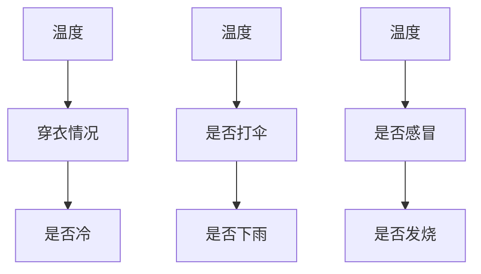
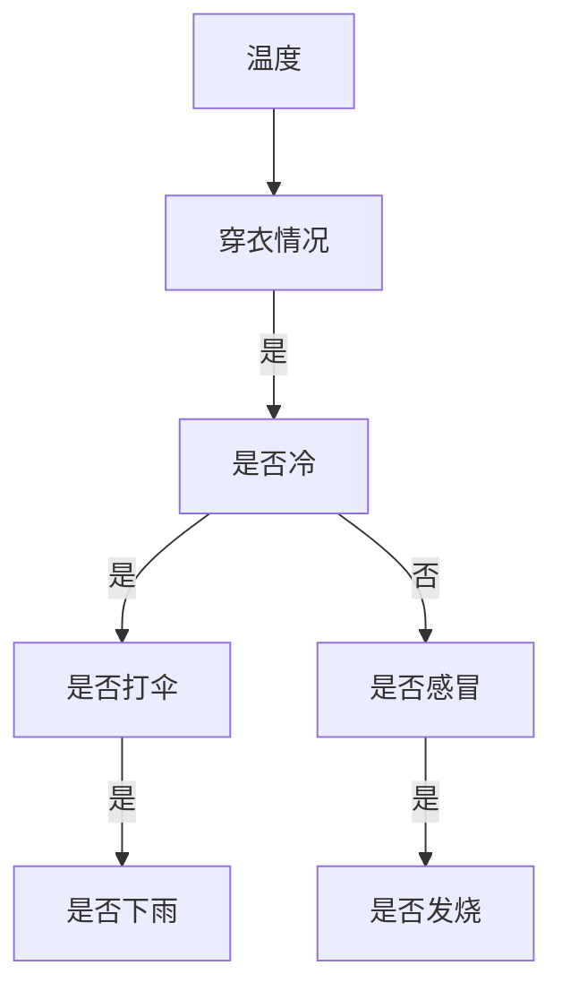

                 


# 构建具有自动机器学习能力的AI Agent

> 关键词：自动机器学习，AI Agent，架构设计，算法，应用，未来趋势

> 摘要：本文旨在探讨如何构建具有自动机器学习能力的人工智能（AI）代理（Agent）。文章首先介绍了自动机器学习的背景和重要性，然后深入分析了AI Agent的架构和功能，探讨了自动机器学习算法及其应用。最后，文章展望了AI Agent的未来发展趋势，并提供了相关开发工具和框架。通过本文，读者可以全面了解AI Agent的构建原理和应用场景。

## 目录大纲

----------------------------------------------------------------

# 第一部分: AI Agent基础

## 第1章: 自动机器学习概述

### 1.1 自动机器学习的背景和重要性

### 1.2 自动机器学习的关键概念

### 1.3 自动机器学习的挑战和解决方案

## 第2章: AI Agent的架构和功能

### 2.1 AI Agent的架构概述

### 2.2 AI Agent的核心功能

### 2.3 AI Agent的通信机制

## 第3章: 自动机器学习算法

### 3.1 概率图模型

#### 3.1.1 贝叶斯网络

#### 3.1.2 决策树

#### 3.1.3 支持向量机

### 3.2 强化学习

#### 3.2.1 基本概念

#### 3.2.2 Q-Learning算法

#### 3.2.3 Deep Q-Networks

### 3.3 自适应机器学习

#### 3.3.1 模型更新策略

#### 3.3.2 数据流处理

## 第4章: AI Agent的实际应用

### 4.1 AI Agent在智能客服中的应用

### 4.2 AI Agent在智能推荐系统中的应用

### 4.3 AI Agent在自动驾驶中的应用

## 第5章: AI Agent的开发工具和框架

### 5.1 自动机器学习的工具和库

### 5.2 AI Agent的开发框架

### 5.3 开发流程和最佳实践

## 第6章: AI Agent的未来发展趋势

### 6.1 自动机器学习的未来趋势

### 6.2 AI Agent的潜在应用领域

### 6.3 挑战与机遇

## 第7章: 总结与展望

### 7.1 本书的主要内容总结

### 7.2 AI Agent的发展方向

### 7.3 读者建议与拓展阅读

----------------------------------------------------------------

## 第1章: 自动机器学习概述

### 1.1 自动机器学习的背景和重要性

自动机器学习（Automated Machine Learning，简称AutoML）是近年来人工智能（AI）领域的一个重要研究方向。它旨在通过自动化方法来提高机器学习（Machine Learning，简称ML）的效率，降低对专业知识和技能的要求。自动机器学习的背景主要源于以下几个方面：

1. **数据量爆炸式增长**：随着互联网和物联网的发展，数据量呈现指数级增长，这给传统的机器学习模型带来了巨大的挑战。自动机器学习通过自动化特征选择、模型选择和超参数调优，能够更快地处理大量数据。

2. **机器学习应用场景多样化**：在金融、医疗、制造、零售等多个领域，机器学习技术已经被广泛应用。然而，这些领域往往需要定制化的解决方案，传统的机器学习方法难以满足多样化的需求。自动机器学习通过自动化优化，能够快速适应不同的应用场景。

3. **专家资源有限**：尽管机器学习技术取得了巨大的进展，但仍然需要大量的专业知识和技能。自动机器学习的目标是让更多的人能够参与到机器学习中来，提高整个社会对机器学习的利用效率。

自动机器学习的重要性主要体现在以下几个方面：

1. **提高开发效率**：自动机器学习能够自动化地处理特征选择、模型选择和超参数调优等繁琐的任务，大大提高了机器学习开发效率。

2. **降低门槛**：自动机器学习降低了机器学习入门的门槛，让更多的人能够理解和应用机器学习技术。

3. **优化性能**：自动机器学习通过自动化优化，能够找到更好的模型和参数配置，从而提高机器学习模型的性能。

### 1.2 自动机器学习的关键概念

在深入探讨自动机器学习之前，我们需要了解一些关键概念：

1. **特征工程**：特征工程是机器学习过程中的一项重要任务，它涉及到如何从原始数据中提取出对模型训练有帮助的特征。在自动机器学习中，特征工程通常被自动化处理。

2. **模型选择**：模型选择是机器学习中的一项关键任务，它涉及到如何选择最适合问题的模型。自动机器学习通过自动化方法来选择模型。

3. **超参数调优**：超参数是机器学习模型中的参数，它们需要在模型训练过程中进行调整。超参数调优是机器学习过程中的一项重要任务，它涉及到如何选择最优的超参数。在自动机器学习中，超参数调优通常被自动化处理。

4. **模型评估**：模型评估是机器学习中的一项重要任务，它涉及到如何评估模型的性能。自动机器学习通过自动化方法来评估模型。

### 1.3 自动机器学习的挑战和解决方案

尽管自动机器学习具有许多优势，但在实际应用中仍然面临着一系列挑战：

1. **计算资源消耗**：自动机器学习通常需要大量的计算资源来处理数据、训练模型和进行超参数调优。这给实际应用带来了巨大的计算资源消耗。

   **解决方案**：使用分布式计算和云计算技术来降低计算资源消耗。例如，Google的AutoML平台使用了分布式计算技术来提高计算效率。

2. **模型解释性**：自动机器学习模型通常是由多个复杂模型组合而成的，这使得模型的解释性变得困难。这给模型的可解释性和透明性带来了挑战。

   **解决方案**：开发可解释的自动机器学习模型，例如，使用LIME（Local Interpretable Model-agnostic Explanations）来解释模型。

3. **数据质量**：自动机器学习对数据质量有很高的要求。如果数据质量不好，自动机器学习的效果可能会大打折扣。

   **解决方案**：使用数据预处理技术来提高数据质量，例如，使用数据清洗和数据归一化技术。

4. **算法选择**：自动机器学习需要选择适合问题的算法。不同的算法在处理不同类型的数据时会有不同的效果。

   **解决方案**：使用自动化方法来选择算法，例如，使用遗传算法来选择最优的算法。

通过解决这些挑战，自动机器学习有望在未来发挥更大的作用，为各行各业带来更多的价值。

## 第2章: AI Agent的架构和功能

### 2.1 AI Agent的架构概述

AI Agent，即人工智能代理，是一种能够自主执行任务、与环境交互并不断自我优化的智能体。AI Agent的架构通常由以下几个核心组成部分构成：

1. **感知模块**：感知模块负责接收外部环境的信息，并将其转换为内部表示。这些信息可以包括文本、图像、声音等不同类型的数据。感知模块通常包括自然语言处理（NLP）、计算机视觉（CV）和语音识别（ASR）等技术。

2. **决策模块**：决策模块负责根据感知模块收集到的信息，生成行动计划。决策模块通常采用机器学习算法和深度学习模型来实现。它需要能够处理不确定性、动态变化和复杂情境。

3. **执行模块**：执行模块负责将决策模块生成的行动计划转化为实际操作。执行模块可以是机械臂、机器人、自动驾驶系统等。它需要具备高精度、高速度和高可靠性的特点。

4. **学习模块**：学习模块负责对AI Agent的行为进行评估和优化。通过不断学习，AI Agent能够自我改进，提高任务完成的效率和质量。学习模块通常包括强化学习（Reinforcement Learning，RL）、迁移学习（Transfer Learning）和元学习（Meta-Learning）等技术。

### 2.2 AI Agent的核心功能

AI Agent的核心功能包括以下几个方面：

1. **任务执行**：AI Agent能够根据任务需求，自主执行相应的操作。例如，在智能客服场景中，AI Agent可以回答用户的问题；在自动驾驶场景中，AI Agent可以控制车辆。

2. **环境交互**：AI Agent能够与环境进行实时交互，收集环境信息，并根据环境变化调整自身行为。这种交互能力使得AI Agent能够适应动态环境，提高任务完成率。

3. **自主学习**：AI Agent能够通过不断学习，自我优化行为策略。例如，通过强化学习，AI Agent可以在游戏中不断尝试，找到最优策略。

4. **多任务处理**：AI Agent能够同时处理多个任务，实现任务并行处理。这种能力使得AI Agent能够更好地应对复杂场景。

5. **自适应调整**：AI Agent能够根据任务需求和环境变化，自适应调整自身参数和策略。这种自适应能力使得AI Agent能够在不同场景下保持高效性能。

### 2.3 AI Agent的通信机制

AI Agent的通信机制是其架构中至关重要的一部分。它决定了AI Agent如何与其他系统、设备和用户进行交互。以下是几种常见的AI Agent通信机制：

1. **消息队列**：消息队列是一种异步通信机制，它允许AI Agent与其他系统或设备进行消息传递。消息队列可以确保消息的顺序和可靠性，但可能存在一定的延迟。

2. **RESTful API**：RESTful API是一种基于HTTP协议的通信机制，它允许AI Agent通过HTTP请求和响应与其他系统进行交互。这种机制简单易用，但可能存在性能瓶颈。

3. **WebSocket**：WebSocket是一种全双工通信机制，它允许AI Agent与其他系统或设备进行实时、双向通信。这种机制具有较高的实时性和稳定性，但实现相对复杂。

4. **MQTT**：MQTT是一种轻量级的消息队列协议，它适用于物联网（IoT）场景。MQTT协议通过发布/订阅模式实现消息传递，具有低功耗、低带宽的特点。

通过合理的通信机制设计，AI Agent可以更好地实现任务执行、环境交互和自主学习等功能。

## 第3章: 自动机器学习算法

### 3.1 概率图模型

概率图模型是一类强大的机器学习算法，它通过构建概率图来描述变量之间的关系。概率图模型主要包括贝叶斯网络、决策树和支持向量机等。

#### 3.1.1 贝叶斯网络

贝叶斯网络是一种基于概率图表示的知识模型，它将变量之间的关系表示为条件概率分布。贝叶斯网络的优点包括：

1. **可解释性**：贝叶斯网络通过概率图直观地展示了变量之间的关系，使得模型易于理解和解释。

2. **概率推理**：贝叶斯网络能够进行概率推理，通过条件概率计算得出变量的概率分布。

3. **不确定性处理**：贝叶斯网络能够处理不确定性问题，通过概率分布来描述变量之间的关系。

贝叶斯网络的构建过程包括以下几个步骤：

1. **变量定义**：首先，定义需要建模的变量。

2. **依赖关系确定**：根据领域知识，确定变量之间的依赖关系。

3. **条件概率分布估计**：根据训练数据，估计每个变量的条件概率分布。

4. **概率图构建**：将变量和条件概率分布表示为概率图。

以下是一个贝叶斯网络的示例：



在这个示例中，温度是所有变量的根节点，其他变量与温度之间存在条件依赖关系。

#### 3.1.2 决策树

决策树是一种基于特征分割的树形结构模型，它通过递归地将数据集分割成子集，直到满足停止条件。决策树的优点包括：

1. **可解释性**：决策树通过树形结构直观地展示了特征与目标变量之间的关系。

2. **易于实现**：决策树实现相对简单，易于理解和实现。

3. **分类和回归**：决策树既可以用于分类任务，也可以用于回归任务。

决策树的构建过程包括以下几个步骤：

1. **特征选择**：选择一个最佳特征作为分割标准。

2. **数据分割**：根据最佳特征，将数据集分割成子集。

3. **递归构建**：对每个子集继续进行特征选择和分割，直到满足停止条件。

以下是一个决策树的示例：



在这个示例中，温度是最佳特征，它将数据集分割成两个子集，即是否冷。

#### 3.1.3 支持向量机

支持向量机（Support Vector Machine，SVM）是一种基于最大间隔分类的线性分类模型。SVM的优点包括：

1. **分类效果优异**：SVM通过最大化分类间隔来实现分类，具有较高的分类准确率。

2. **可扩展性**：SVM可以应用于高维空间，适用于大型数据集。

3. **支持向量**：支持向量是模型训练过程中最重要的样本点，它们对模型的影响最大。

SVM的构建过程包括以下几个步骤：

1. **特征提取**：将原始特征映射到高维空间。

2. **间隔最大化**：找到使得分类间隔最大的分类边界。

3. **支持向量选择**：选择支持向量作为分类决策的依据。

以下是一个支持向量机的示例：


在这个示例中，温度和穿衣情况是最佳特征，它们将数据集分割成两个类别。

### 3.2 强化学习

强化学习（Reinforcement Learning，RL）是一种通过试错学习来优化决策过程的机器学习算法。强化学习的主要特点包括：

1. **奖励机制**：强化学习通过奖励机制来引导学习过程，使得模型能够找到最优策略。

2. **试错学习**：强化学习通过不断尝试和错误，逐步优化策略。

3. **动态适应性**：强化学习能够根据环境变化自适应调整策略。

#### 3.2.1 基本概念

强化学习的主要概念包括：

1. **状态（State）**：状态是强化学习中的基本概念，它描述了系统的当前状态。

2. **动作（Action）**：动作是强化学习中的基本操作，它描述了系统可以执行的操作。

3. **奖励（Reward）**：奖励是强化学习中的反馈信号，它描述了系统执行动作后的效果。

4. **策略（Policy）**：策略是强化学习中的决策规则，它描述了系统在不同状态下的最优动作。

5. **价值函数（Value Function）**：价值函数是强化学习中的评估指标，它描述了系统在不同状态下的预期奖励。

#### 3.2.2 Q-Learning算法

Q-Learning是一种常用的强化学习算法，它通过迭代更新Q值来找到最优策略。Q-Learning的主要步骤包括：

1. **初始化Q值**：初始化Q值为0。

2. **选择动作**：根据当前状态，选择一个动作。

3. **执行动作**：在环境中执行所选动作。

4. **更新Q值**：根据当前状态、执行的动作和获得的奖励，更新Q值。

5. **更新状态**：根据执行的动作，更新当前状态。

以下是一个Q-Learning算法的示例：

```python
import numpy as np

# 初始化Q值矩阵
Q = np.zeros((n_states, n_actions))

# 设定学习率α、折扣因子γ和探索率ε
alpha = 0.1
gamma = 0.9
epsilon = 0.1

# Q-Learning算法
for episode in range(n_episodes):
    state = env.reset()
    done = False
    
    while not done:
        if np.random.rand() < epsilon:
            action = env.action_space.sample()
        else:
            action = np.argmax(Q[state])
        
        next_state, reward, done, _ = env.step(action)
        
        Q[state, action] = Q[state, action] + alpha * (reward + gamma * np.max(Q[next_state]) - Q[state, action])
        
        state = next_state
```

在这个示例中，我们初始化了一个Q值矩阵，并使用Q-Learning算法来更新Q值。通过不断迭代，我们能够找到最优策略。

#### 3.2.3 Deep Q-Networks

Deep Q-Networks（DQN）是一种基于深度学习的强化学习算法，它使用深度神经网络来近似Q值函数。DQN的主要步骤包括：

1. **初始化网络**：初始化深度神经网络。

2. **选择动作**：根据当前状态，使用深度神经网络预测Q值，并选择一个动作。

3. **执行动作**：在环境中执行所选动作。

4. **更新网络**：根据当前状态、执行的动作和获得的奖励，更新深度神经网络。

5. **经验回放**：将经验样本存储在经验回放记忆中，用于训练深度神经网络。

以下是一个DQN算法的示例：

```python
import tensorflow as tf
import numpy as np

# 初始化深度神经网络
def create_network():
    input_layer = tf.keras.layers.Input(shape=(n_states,))
    hidden_layer = tf.keras.layers.Dense(units=64, activation='relu')(input_layer)
    output_layer = tf.keras.layers.Dense(units=n_actions, activation='linear')(hidden_layer)
    model = tf.keras.Model(inputs=input_layer, outputs=output_layer)
    return model

# 初始化DQN算法
def dqnalgorithm():
    model = create_network()
    optimizer = tf.keras.optimizers.Adam(learning_rate=0.001)
    loss_function = tf.keras.losses.MeanSquaredError()

    # DQN算法
    for episode in range(n_episodes):
        state = env.reset()
        done = False

        while not done:
            action = np.argmax(model.predict(state))
            next_state, reward, done, _ = env.step(action)

            target_q = reward + (1 - done) * gamma * np.max(model.predict(next_state))

            with tf.GradientTape() as tape:
                q_value = model.predict(state)[0, action]
                loss = loss_function(tf.expand_dims(target_q, 0), tf.expand_dims(q_value, 0))

            gradients = tape.gradient(loss, model.trainable_variables)
            optimizer.apply_gradients(zip(gradients, model.trainable_variables))

            state = next_state
```

在这个示例中，我们初始化了一个深度神经网络，并使用DQN算法来更新网络。通过不断迭代，我们能够找到最优策略。

### 3.3 自适应机器学习

自适应机器学习是一种通过动态调整模型参数来适应环境变化的机器学习技术。它主要包括模型更新策略和数据流处理。

#### 3.3.1 模型更新策略

模型更新策略包括以下几种：

1. **在线学习**：在线学习是一种实时更新模型的方法，它通过不断接收新的数据来更新模型。在线学习的优点是能够快速适应环境变化，但可能导致模型稳定性下降。

2. **批量学习**：批量学习是一种将新数据与历史数据合并后更新模型的方法。批量学习的优点是能够提高模型稳定性，但可能导致模型更新速度较慢。

3. **增量学习**：增量学习是一种将新数据分批更新模型的方法，它通过分批计算梯度来更新模型。增量学习的优点是能够在保持模型稳定性的同时，提高模型更新速度。

4. **迁移学习**：迁移学习是一种将已有模型在新数据上训练的方法。通过迁移学习，可以减少对新数据的训练时间，提高模型更新速度。

#### 3.3.2 数据流处理

数据流处理是一种实时处理大规模数据的方法，它能够实时更新模型并适应环境变化。数据流处理的主要步骤包括：

1. **数据采集**：采集来自传感器、网络等不同来源的数据。

2. **数据预处理**：对数据进行清洗、归一化等预处理操作。

3. **模型更新**：使用预处理后的数据来更新模型。

4. **模型评估**：评估模型在新数据上的性能，并根据评估结果调整模型。

5. **模型发布**：将更新后的模型发布到生产环境中，供实际应用使用。

通过数据流处理，自适应机器学习能够实现实时更新和优化，提高模型适应环境变化的能力。

## 第4章: AI Agent的实际应用

### 4.1 AI Agent在智能客服中的应用

智能客服是AI Agent的一个重要应用领域，它通过自动化处理客户问题，提供高效、准确的咨询服务。以下是AI Agent在智能客服中的具体应用场景：

1. **问题分类**：AI Agent可以自动分类客户提出的问题，将其归类到相应的类别。这有助于提高客服效率，缩短响应时间。

2. **自动回复**：AI Agent可以自动生成回复文本，回答客户的问题。这大大减轻了人工客服的工作负担，提高了客服效率。

3. **上下文理解**：AI Agent可以理解客户问题的上下文，提供更加精准的回复。例如，当客户询问产品使用方法时，AI Agent可以提供详细的使用说明和注意事项。

4. **个性化服务**：AI Agent可以根据客户的历史问题和偏好，提供个性化的服务。例如，对于经常购买某类产品的客户，AI Agent可以主动推荐相关产品。

5. **多渠道交互**：AI Agent可以与客户通过多种渠道进行交互，如聊天机器人、语音助手等。这有助于提高客户满意度，增加客户粘性。

### 4.2 AI Agent在智能推荐系统中的应用

智能推荐系统是另一个重要的AI Agent应用领域，它通过分析用户行为和偏好，为用户推荐相关商品、内容和服务。以下是AI Agent在智能推荐系统中的具体应用场景：

1. **行为分析**：AI Agent可以分析用户的行为数据，如浏览历史、购买记录等，以了解用户的偏好。

2. **协同过滤**：AI Agent可以使用协同过滤算法，根据用户的行为和偏好，为用户推荐相似的商品和服务。

3. **基于内容的推荐**：AI Agent可以分析商品和内容的特征，根据用户的兴趣和偏好，为用户推荐相关的商品和内容。

4. **实时推荐**：AI Agent可以实时分析用户的行为和偏好，为用户推荐最新的商品和内容。

5. **个性化推荐**：AI Agent可以根据用户的个性化需求，为用户推荐个性化的商品和服务。

通过智能推荐系统，AI Agent能够提高用户的购物体验，增加销售额，提高用户满意度。

### 4.3 AI Agent在自动驾驶中的应用

自动驾驶是AI Agent的另一个重要应用领域，它通过自动化驾驶技术，实现车辆的自主驾驶。以下是AI Agent在自动驾驶中的具体应用场景：

1. **环境感知**：AI Agent可以感知周围环境，包括道路、交通信号、行人等，并根据环境信息进行驾驶决策。

2. **路径规划**：AI Agent可以根据目标地点和交通状况，规划最优驾驶路径。

3. **驾驶控制**：AI Agent可以控制车辆的加速、制动、转向等动作，实现自主驾驶。

4. **应急处理**：AI Agent可以应对突发情况，如障碍物、交通事故等，采取相应的应急措施。

5. **人机交互**：AI Agent可以与驾驶员和乘客进行交互，提供导航信息、娱乐等服务。

通过自动驾驶技术，AI Agent能够提高交通安全，减少交通事故，提高驾驶效率。

## 第5章: AI Agent的开发工具和框架

### 5.1 自动机器学习的工具和库

自动机器学习（AutoML）的工具和库极大地简化了机器学习模型的选择、训练和调优过程。以下是一些流行的自动机器学习工具和库：

1. **Google AutoML**：Google AutoML 是一款面向非专业人士的自动机器学习平台，提供了多种预训练模型和自动特征工程功能。

2. **H2O.ai**：H2O.ai 是一款开源的自动机器学习平台，支持多种机器学习算法，包括深度学习、随机森林和集成方法。

3. **AutoKeras**：AutoKeras 是一个自动深度学习库，能够自动搜索深度学习模型的架构和超参数，以实现最优性能。

4. **TPOT**：TPOT 是一款基于遗传算法的自动机器学习优化工具，能够自动搜索和优化机器学习流水线。

5. **Auto-Sklearn**：Auto-Sklearn 是一个基于轻量级机器学习库Scikit-learn的自动机器学习框架，支持自动化特征选择和模型选择。

### 5.2 AI Agent的开发框架

AI Agent的开发框架通常需要支持感知、决策、执行和学习等核心功能。以下是一些流行的AI Agent开发框架：

1. **PyTorch**：PyTorch 是一款流行的深度学习框架，提供了丰富的工具和库来支持AI Agent的开发，包括感知模块（如PyTorch Video和Image）和决策模块（如TorchScript）。

2. **TensorFlow**：TensorFlow 是另一款流行的深度学习框架，提供了完整的AI Agent开发工具，包括感知模块（如TensorFlow Object Detection API）和决策模块（如TensorFlow Agents）。

3. **OpenAI Gym**：OpenAI Gym 是一个开源的AI模拟环境库，提供了多种预定义的AI Agent模拟环境，用于测试和训练AI Agent。

4. **React-BabylonJS**：React-BabylonJS 是一款基于WebGL的3D游戏和模拟引擎，适用于开发交互式AI Agent。

5. **Unity ML-Agents**：Unity ML-Agents 是一款基于Unity游戏引擎的机器学习框架，支持开发虚拟世界中的AI Agent。

### 5.3 开发流程和最佳实践

构建具有自动机器学习能力的AI Agent的开发流程通常包括以下步骤：

1. **需求分析**：明确AI Agent的应用场景和目标任务，确定所需的感知、决策和执行模块。

2. **环境搭建**：搭建适合AI Agent开发的环境，包括深度学习框架、模拟环境和计算资源。

3. **数据准备**：收集和预处理AI Agent所需的训练数据，包括图像、文本和传感器数据。

4. **模型设计**：设计AI Agent的模型架构，包括感知模块、决策模块和执行模块。

5. **模型训练**：使用自动机器学习工具和库，训练和调优AI Agent的模型。

6. **集成测试**：在模拟环境中测试AI Agent的性能，确保其能够适应不同的应用场景。

7. **部署上线**：将训练好的AI Agent部署到生产环境中，进行实际应用。

最佳实践包括：

- **数据驱动**：确保数据质量，使用多样化的数据集进行训练和测试。

- **模块化设计**：将AI Agent的功能模块化，以提高代码的可维护性和可扩展性。

- **持续学习**：定期更新和优化AI Agent的模型，以适应环境变化。

- **安全性与隐私**：确保AI Agent的开发和使用遵循相关安全性和隐私标准。

## 第6章: AI Agent的未来发展趋势

### 6.1 自动机器学习的未来趋势

自动机器学习（AutoML）作为人工智能（AI）领域的重要分支，正在不断发展和创新。以下是自动机器学习的一些未来趋势：

1. **算法自动优化**：随着深度学习模型变得越来越复杂，自动优化算法将变得越来越重要。未来的AutoML系统将能够自动搜索和优化深度学习模型的架构和超参数，以实现更高的性能。

2. **可解释性增强**：自动机器学习模型的可解释性是当前研究的热点问题。未来的AutoML系统将致力于提高模型的可解释性，使得模型决策过程更加透明，增强用户对模型的信任。

3. **联邦学习**：联邦学习（Federated Learning）是一种在多个设备上进行协同训练的方法，未来的AutoML系统将能够更好地支持联邦学习，以处理分布式数据。

4. **迁移学习和自适应学习**：自动机器学习将更加强调迁移学习和自适应学习的能力，以便更好地应对新环境和任务。

5. **实时优化**：未来的AutoML系统将能够实现实时优化，动态适应数据分布和环境变化，提供更高效、更准确的预测。

### 6.2 AI Agent的潜在应用领域

AI Agent在未来的应用领域将更加广泛和深入，以下是一些潜在的应用领域：

1. **智能医疗**：AI Agent可以在医疗领域发挥重要作用，如辅助诊断、个性化治疗、药物研发等。

2. **智能家居**：AI Agent可以与智能家居设备集成，提供智能化的家居控制、安全监控、能源管理等功能。

3. **智慧城市**：AI Agent可以在智慧城市建设中发挥作用，如交通管理、环境监测、公共安全等。

4. **工业自动化**：AI Agent可以应用于工业自动化领域，如生产线监控、故障预测、设备维护等。

5. **金融科技**：AI Agent可以应用于金融科技领域，如风险管理、智能投顾、反欺诈等。

6. **游戏和娱乐**：AI Agent可以在游戏和娱乐领域提供更加逼真的虚拟环境和互动体验。

### 6.3 挑战与机遇

尽管AI Agent具有巨大的潜力，但在其发展过程中仍面临一系列挑战：

1. **计算资源消耗**：AI Agent的开发和运行通常需要大量的计算资源，这对于资源有限的场景是一个挑战。

2. **数据隐私和安全**：AI Agent在处理数据时可能涉及用户隐私，如何确保数据安全和隐私保护是一个重要问题。

3. **模型解释性**：当前许多AI Agent模型缺乏可解释性，这对于需要透明决策的场景是一个挑战。

4. **伦理和社会影响**：AI Agent的广泛应用可能带来伦理和社会问题，如就业影响、责任归属等。

然而，这些挑战也伴随着机遇：

1. **技术创新**：随着技术的不断进步，AI Agent将变得更加高效、智能和可靠。

2. **产业升级**：AI Agent的广泛应用将推动各行业实现智能化升级，提高生产效率和创新能力。

3. **社会进步**：AI Agent的普及将带来更加便捷、高效的生活方式，推动社会进步。

总之，AI Agent的未来发展趋势充满机遇与挑战，需要持续的技术创新和伦理探讨，以实现其最大潜力。

## 第7章: 总结与展望

### 7.1 本书的主要内容总结

本书全面探讨了构建具有自动机器学习能力的人工智能（AI）代理（Agent）的原理和方法。首先，我们介绍了自动机器学习的背景和重要性，并深入分析了AI Agent的架构和功能。接着，我们详细讲解了自动机器学习算法，包括概率图模型、强化学习算法和自适应机器学习策略。此外，我们还探讨了AI Agent的实际应用场景，如智能客服、智能推荐系统和自动驾驶。最后，我们展望了AI Agent的未来发展趋势，并介绍了相关的开发工具和框架。

### 7.2 AI Agent的发展方向

AI Agent的发展方向将集中在以下几个方面：

1. **智能化水平提升**：通过不断优化算法和模型，提高AI Agent的智能水平，使其能够更好地理解复杂环境和执行复杂任务。

2. **跨领域应用**：AI Agent将向更多领域扩展，如医疗、金融、教育等，提供定制化的智能服务。

3. **可解释性和透明性**：提高AI Agent模型的可解释性，增强用户对模型决策过程的信任。

4. **实时自适应能力**：增强AI Agent的实时自适应能力，使其能够快速适应环境变化。

5. **安全性保障**：加强AI Agent的数据隐私和安全保护，确保其在不同场景下的可靠性。

### 7.3 读者建议与拓展阅读

对于读者，本书提供了从基础到高级的全面内容，建议读者在学习过程中：

1. 实践应用：通过实际项目来加深对AI Agent的理解和应用。

2. 深入研究：关注AI Agent领域的最新研究成果和发展趋势。

3. 拓展知识：学习相关的编程语言、框架和工具，如Python、TensorFlow、PyTorch等。

拓展阅读：

- [《机器学习》（周志华 著）》
- [《深度学习》（Ian Goodfellow、Yoshua Bengio、Aaron Courville 著）》
- [《强化学习基础》（Richard S. Sutton、Andrew G. Barto 著）》
- [《自然语言处理综论》（Daniel Jurafsky、James H. Martin 著）》

作者：AI天才研究院/AI Genius Institute & 禅与计算机程序设计艺术 /Zen And The Art of Computer Programming

