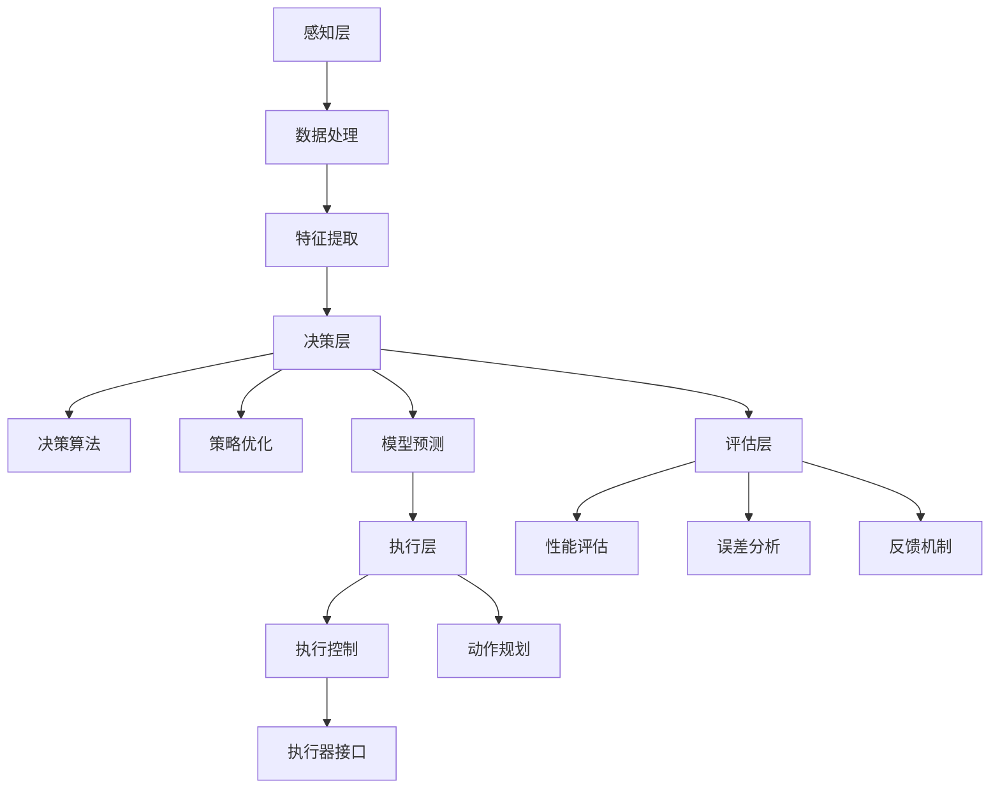
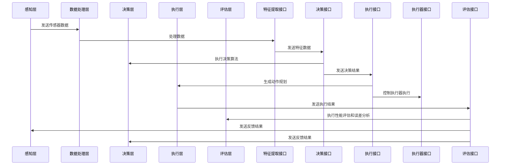

                 

### 构建具有自我评估与优化能力的AI Agent系统

> 关键词：AI Agent，自我评估，优化能力，系统架构，算法设计

> 摘要：本文将探讨如何构建具有自我评估与优化能力的AI Agent系统。通过详细解析AI Agent系统的核心概念、设计原理、算法实现和实际应用，文章旨在为读者提供一个全面而深入的指导，帮助他们在AI领域中进行实践和创新。

随着人工智能（AI）技术的迅猛发展，AI Agent作为AI系统中的一个重要组成部分，正逐渐成为研究与应用的热点。AI Agent是一种具备自主决策和执行能力的智能体，能够在复杂环境中模拟人类的行为，完成特定的任务。自我评估与优化能力是AI Agent的重要组成部分，它使得AI Agent能够不断改进自身性能，提高任务执行效率。

自我评估能力允许AI Agent对自身的性能进行监测和评价，识别存在的问题和不足。而优化能力则通过多种算法和策略，帮助AI Agent自动调整行为，以达到最佳性能。本文将围绕这两个核心概念，详细探讨构建具有自我评估与优化能力的AI Agent系统的方法。

本文首先介绍AI Agent系统的基本概念和背景，包括AI Agent的定义、发展历史和主要类型。接着，我们将深入探讨自我评估和优化的核心原理，包括相关的算法和技术。随后，文章将重点介绍AI Agent系统的设计原则和架构设计，涵盖系统架构的各个层面和模块。在系统实现部分，我们将展示如何使用Python等编程语言实现AI Agent系统的核心功能，并提供详细的算法原理讲解和数学模型说明。最后，文章将通过实际案例展示AI Agent系统的应用场景和效果，并总结最佳实践和注意事项。

通过对本文的阅读，读者将能够全面了解构建具有自我评估与优化能力的AI Agent系统的全过程，从而为后续的实践和研究打下坚实的基础。文章旨在为AI领域的从业者提供一个系统而实用的参考，帮助他们在AI技术的发展和应用中取得更大的成就。

### AI Agent系统的基础知识

#### 定义与发展历史

AI Agent是指能够感知环境，根据环境反馈采取行动，并通过学习不断优化自身行为的智能体。AI Agent的概念最早可以追溯到人工智能（AI）的早期研究，当时研究人员开始探索如何使计算机系统能够模拟人类的决策过程。1950年，艾伦·图灵提出了著名的图灵测试，旨在评估机器是否具备人类智能。这一理论的提出为AI Agent的研究奠定了基础。

随着时间的推移，AI Agent的研究逐渐从理论走向实践。1970年代，人工智能领域出现了第一批实际应用的AI Agent，如游戏中的智能对手和自动导航系统。进入21世纪，随着计算能力的提升和大数据技术的发展，AI Agent的应用范围大大扩展，从工业自动化、金融交易到智能家居、无人驾驶等各个领域。

#### 主要类型

AI Agent根据其能力和行为方式，可以分为以下几种类型：

1. **基于规则的AI Agent**：这类Agent通过预定义的规则来决策。规则通常由专家系统生成，用于指导Agent在特定环境中的行为。优点是简单直观，缺点是灵活性和适应能力较弱。

2. **基于模型的AI Agent**：这类Agent利用数学模型来模拟环境，并通过模型预测和决策。常见的模型包括决策树、支持向量机（SVM）等。优点是能够处理复杂问题，缺点是对模型依赖较强。

3. **基于学习的AI Agent**：这类Agent通过机器学习算法从数据中学习，并自主调整行为。常见的算法包括深度学习、强化学习等。优点是能够自主适应环境变化，缺点是需要大量数据进行训练。

4. **混合型AI Agent**：这类Agent结合了上述几种类型的优势，通过多种算法和策略进行决策。优点是能够适应不同场景的需求，缺点是设计和管理较为复杂。

#### 自我评估与优化能力

自我评估能力是AI Agent的一个重要特征，它使得Agent能够实时监测自身的行为和性能，并识别潜在的问题。自我评估可以通过以下几种方式进行：

1. **性能指标监测**：Agent定期收集和计算一系列性能指标，如准确率、响应时间等，并基于这些指标进行自我评估。

2. **误差分析和反馈**：Agent在执行任务时，记录执行结果与预期目标的差异，通过误差分析来识别问题所在。

3. **专家系统评估**：对于基于规则和模型的Agent，可以使用专家系统对行为进行评估，识别规则和模型的有效性。

优化能力是AI Agent实现自我提升的关键，它通过一系列算法和策略来调整Agent的行为。常见的优化方法包括：

1. **遗传算法**：通过模拟自然选择过程，对Agent的行为进行优化。

2. **强化学习**：通过奖励和惩罚机制，引导Agent逐渐学习最优策略。

3. **混合优化**：结合多种优化方法，如遗传算法和强化学习，以实现更高效的学习和优化。

### 主要功能和应用场景

AI Agent的主要功能包括感知、决策和行动。通过感知环境数据，AI Agent能够获取环境信息，并基于这些信息进行决策。最终，Agent将根据决策结果采取行动，实现任务目标。

AI Agent的应用场景非常广泛，涵盖了各个领域：

1. **工业自动化**：AI Agent在工业自动化领域被广泛应用于生产线监控、质量检测和设备维护等任务。

2. **金融交易**：AI Agent在金融交易中用于市场预测、风险评估和自动交易等任务。

3. **医疗诊断**：AI Agent在医疗诊断中用于图像识别、疾病预测和治疗方案推荐等任务。

4. **无人驾驶**：AI Agent在无人驾驶领域中负责感知环境、路径规划和决策控制等任务。

5. **智能家居**：AI Agent在智能家居中用于环境监控、设备控制和用户交互等任务。

通过对AI Agent系统的基础知识进行深入探讨，读者可以更好地理解AI Agent的定义、类型和应用场景。这为后续深入探讨自我评估和优化能力提供了重要的背景知识。

### 自我评估机制

自我评估是AI Agent实现自我提升和优化的重要手段，通过自我评估，AI Agent能够实时监测自身的性能和表现，识别存在的不足，并制定相应的改进策略。自我评估机制的实现涉及多个方面，包括性能指标监测、误差分析和反馈机制。

#### 性能指标监测

性能指标监测是自我评估的基础，通过监测和计算一系列关键性能指标（KPI），AI Agent能够了解自身的表现。这些性能指标通常包括：

1. **准确率**：准确率是衡量AI Agent在任务执行中的正确程度。例如，在图像识别任务中，准确率反映了Agent识别图像的准确性。

2. **响应时间**：响应时间是指AI Agent从接收到任务到完成任务的时长。低响应时间意味着Agent具有更高的效率。

3. **资源利用率**：资源利用率反映了Agent在执行任务时对系统资源的消耗情况，包括CPU、内存和带宽等。

4. **任务完成率**：任务完成率是指AI Agent成功完成任务的比例。对于一些高风险任务，如无人驾驶中的路径规划，任务完成率尤为重要。

通过监测这些性能指标，AI Agent可以实时了解自身的表现，识别潜在的问题。例如，如果准确率突然下降，Agent可能会怀疑自身算法的准确性，并考虑调整模型参数或重新训练模型。

#### 误差分析

误差分析是自我评估的重要步骤，通过分析任务执行过程中产生的误差，AI Agent能够深入了解自身的行为和表现。误差分析通常包括以下几个方面：

1. **输入数据误差**：AI Agent的输入数据可能存在误差，这些误差可能来源于传感器的不准确或数据噪声。通过分析输入数据的误差，Agent可以识别数据质量问题，并采取相应的措施，如数据清洗和预处理。

2. **算法误差**：AI Agent的算法可能存在缺陷或过时，导致任务执行不准确。通过分析算法误差，Agent可以识别算法存在的问题，并尝试优化算法或采用更先进的算法。

3. **环境误差**：环境因素可能对任务执行产生影响，如噪声干扰、天气变化等。通过分析环境误差，Agent可以了解环境对任务执行的影响，并采取相应的策略，如调整行为模式或增加冗余措施。

#### 反馈机制

反馈机制是自我评估的核心，通过接收用户或其他系统的反馈，AI Agent能够不断调整自身的行为，提高任务执行效果。反馈机制通常包括以下几个方面：

1. **用户反馈**：用户对AI Agent的任务执行结果进行评价，例如通过评分或评论。这些反馈可以帮助Agent了解用户满意度，并识别自身存在的不足。

2. **系统监控**：系统通过监控Agent的行为和表现，提供实时反馈。例如，监控Agent的响应时间和资源利用率，帮助Agent了解自身的工作效率。

3. **自我记录**：AI Agent通过记录自身的行为和表现，进行自我分析。这些记录可以用于未来的评估和优化，帮助Agent积累经验，提高性能。

通过性能指标监测、误差分析和反馈机制，AI Agent能够实现有效的自我评估，识别自身存在的问题，并采取相应的优化措施。自我评估机制不仅有助于AI Agent提高任务执行效果，还能提高其自主学习和适应能力，为AI Agent系统的持续改进提供支持。

### 优化技术

优化技术是AI Agent自我评估后的关键步骤，它通过一系列算法和策略帮助AI Agent不断改进其性能，达到最优状态。以下将介绍几种常见的优化技术，包括遗传算法、进化计算和强化学习，并探讨它们的基本原理和应用。

#### 遗传算法

遗传算法（Genetic Algorithm，GA）是一种基于自然选择和遗传学原理的优化算法。它模拟生物进化过程，通过选择、交叉和变异等操作，不断优化解空间中的个体，直至找到最优解。

1. **基本原理**：
   - **选择**：从当前解空间中选择适应度较高的个体，用于生成下一代解。
   - **交叉**：随机选择两个个体，交换其部分基因，生成新的个体。
   - **变异**：对个体进行随机修改，增加解空间的多样性。

2. **应用**：
   - **组合优化问题**：如旅行商问题（TSP）、任务调度等，通过优化路径和资源分配，提高任务完成效率。
   - **参数调优**：在深度学习和强化学习中，用于自动调整模型的超参数，以提高模型性能。

#### 进化计算

进化计算（Evolutionary Computation）是一类基于进化论的优化算法，包括遗传算法、遗传规划、进化策略等。这些算法通过模拟生物进化过程，优化问题的解。

1. **基本原理**：
   - **种群初始化**：随机生成一组初始解。
   - **适应度评估**：评估每个解的适应度，适应度越高，生存机会越大。
   - **选择、交叉和变异**：与遗传算法类似，通过这些操作生成下一代解。

2. **应用**：
   - **函数优化问题**：寻找函数的最大值或最小值。
   - **多目标优化问题**：同时优化多个相互冲突的目标。

#### 强化学习

强化学习（Reinforcement Learning，RL）是一种通过试错和奖励机制学习最优策略的算法。与监督学习和无监督学习不同，强化学习强调从环境中学习，并通过不断试错积累经验。

1. **基本原理**：
   - **状态-动作-奖励**：学习过程中，AI Agent根据当前状态选择动作，并获取奖励，通过奖励信号调整策略。
   - **策略更新**：基于奖励信号，调整Agent的行为策略，以提高未来收益。

2. **应用**：
   - **自动驾驶**：通过环境感知和决策，实现车辆自主驾驶。
   - **游戏AI**：如围棋、象棋等，通过不断学习和试错，提高游戏水平。
   - **资源调度**：如数据中心资源分配、能源管理等，通过优化资源使用，提高系统效率。

#### 总结

优化技术为AI Agent提供了不断改进性能的手段，通过遗传算法、进化计算和强化学习等算法，AI Agent能够实现自我优化。这些优化技术在组合优化、函数优化、多目标优化等不同场景中有着广泛的应用，为AI Agent系统的持续改进提供了强有力的支持。

在实际应用中，AI Agent可以通过自我评估机制识别自身存在的问题，然后利用优化技术进行优化。例如，在自动驾驶场景中，AI Agent可以通过强化学习不断优化驾驶策略，提高行车安全性；在工业生产中，AI Agent可以通过遗传算法优化生产流程，提高生产效率。通过这些优化技术，AI Agent能够实现自我提升，持续满足不断变化的应用需求。

### AI Agent系统的设计原则

设计一个具有自我评估与优化能力的AI Agent系统，需要遵循一系列设计原则，以确保系统的高效性、稳定性和可扩展性。以下是几个关键的设计原则：

#### 分层架构

分层架构是将系统分为多个层次，每个层次负责特定的功能。这种设计原则有助于系统模块化，提高代码的可维护性和可扩展性。常见的分层架构包括：

1. **感知层**：负责接收和处理来自环境的数据，如传感器数据、图像、文本等。
2. **决策层**：根据感知层提供的信息，利用算法进行决策，生成行动计划。
3. **执行层**：将决策层的行动计划转化为实际操作，如移动、控制设备等。
4. **评估层**：评估执行层的结果，并反馈给感知层和决策层，用于自我优化。

#### 模块化设计

模块化设计是将系统划分为多个功能模块，每个模块独立实现特定功能。这种设计原则有助于提高系统的可重用性和可扩展性。模块化的实现方式包括：

1. **组件化**：将系统功能划分为独立的组件，每个组件实现特定功能，如感知组件、决策组件、执行组件等。
2. **接口定义**：明确各组件之间的接口，确保组件之间的松耦合，降低模块间的依赖关系。
3. **标准化接口**：采用标准化的接口协议，如RESTful API，简化组件之间的通信。

#### 灵活性与适应性

AI Agent系统需要在不断变化的环境中保持灵活性和适应性。为此，系统设计应考虑以下因素：

1. **动态配置**：系统应支持动态配置，允许用户根据需求调整系统参数和功能。
2. **自适应算法**：采用自适应算法，使系统能够根据环境变化自动调整行为和策略。
3. **学习与进化**：系统应具备学习能力，通过不断学习和进化，提高适应复杂环境的能力。

#### 自我优化机制

自我优化机制是AI Agent系统的核心组成部分，它通过自我评估和优化技术，提高系统性能。实现自我优化机制的关键原则包括：

1. **实时监测**：系统应具备实时监测功能，监测系统的性能指标，如响应时间、资源利用率等。
2. **自适应调整**：根据监测结果，系统应能够自动调整行为和策略，如优化算法参数、调整资源分配等。
3. **反馈循环**：建立反馈循环机制，将系统的输出反馈给输入，用于不断优化系统的行为。

#### 高可用性与容错性

高可用性和容错性是确保系统稳定运行的关键。为此，系统设计应考虑以下原则：

1. **冗余设计**：通过冗余设计，如数据备份、硬件冗余等，提高系统的可靠性。
2. **故障检测与恢复**：系统应具备故障检测和恢复功能，能够在检测到故障时自动切换到备用系统。
3. **负载均衡**：通过负载均衡技术，合理分配系统资源，避免单点过载，提高系统的稳定性。

#### 安全性与隐私保护

在AI Agent系统中，数据安全和隐私保护至关重要。设计原则包括：

1. **数据加密**：对系统中的敏感数据进行加密，确保数据传输和存储安全。
2. **访问控制**：实现严格的访问控制机制，确保只有授权用户能够访问系统资源。
3. **安全审计**：建立安全审计机制，记录系统操作日志，以便在发生安全事件时进行追踪和调查。

通过遵循以上设计原则，AI Agent系统能够实现高效、稳定、灵活和可靠的运行，为各种复杂应用场景提供强大的支持。这些设计原则不仅有助于系统的构建，还为系统的持续优化和扩展提供了坚实的基础。

### 系统架构设计

系统架构设计是构建具有自我评估与优化能力的AI Agent系统的关键环节，它决定了系统的性能、可扩展性和维护性。以下将详细描述系统架构的各个层面和模块，包括系统功能、架构设计和实现细节。

#### 系统功能

AI Agent系统的核心功能包括感知、决策、执行和评估，具体功能如下：

1. **感知**：感知层负责接收来自环境的数据，如传感器数据、图像和文本等。感知层模块包括传感器接口、数据处理和特征提取等。
2. **决策**：决策层根据感知层提供的信息，通过算法进行决策，生成行动计划。决策层模块包括决策算法、策略优化和模型预测等。
3. **执行**：执行层将决策层的行动计划转化为实际操作，如移动、控制设备等。执行层模块包括执行控制、动作规划和执行器接口等。
4. **评估**：评估层负责评估执行层的结果，并反馈给感知层和决策层，用于自我优化。评估层模块包括性能评估、误差分析和反馈机制等。

#### 系统架构设计

AI Agent系统的架构设计采用分层架构，包括感知层、决策层、执行层和评估层，各层之间通过接口进行通信。以下是对各层的详细设计：

1. **感知层**：
   - **传感器接口**：接收各种传感器数据，如温度传感器、摄像头、GPS等。
   - **数据处理**：对原始传感器数据进行预处理，如去噪、归一化和特征提取。
   - **特征提取**：将预处理后的数据转换为适用于决策算法的特征向量。

2. **决策层**：
   - **决策算法**：包括基于规则、模型和学习的多种算法，如遗传算法、深度学习和强化学习。
   - **策略优化**：利用优化算法，如遗传算法和强化学习，优化决策策略，提高决策质量。
   - **模型预测**：使用机器学习模型，如决策树、神经网络等，进行环境预测和决策。

3. **执行层**：
   - **执行控制**：根据决策层的行动计划，控制执行器执行具体动作，如电机、灯光等。
   - **动作规划**：生成具体的动作序列，确保执行层能够高效、准确地完成任务。
   - **执行器接口**：与各种执行器（如电机、传感器等）进行通信，实现任务执行。

4. **评估层**：
   - **性能评估**：评估执行层的结果，计算关键性能指标（KPI），如准确率、响应时间等。
   - **误差分析**：分析执行结果与预期目标之间的误差，识别问题来源。
   - **反馈机制**：将评估结果反馈给感知层和决策层，用于调整行为和优化策略。

#### 实现细节

系统架构的实现涉及多个模块和接口的设计与实现，以下是一些关键实现细节：

1. **模块化设计**：
   - **组件化**：将系统功能划分为多个独立组件，如感知组件、决策组件、执行组件等。
   - **接口定义**：采用标准化的接口协议，如RESTful API，确保组件之间的松耦合和可重用性。

2. **数据处理**：
   - **数据处理模块**：负责接收和处理传感器数据，包括去噪、归一化和特征提取。
   - **特征数据库**：存储处理后的特征数据，用于训练和测试机器学习模型。

3. **算法实现**：
   - **决策算法模块**：实现多种决策算法，如遗传算法、深度学习和强化学习。
   - **模型训练与优化**：使用训练数据训练模型，并通过交叉验证和优化算法参数，提高模型性能。

4. **执行控制**：
   - **执行器接口模块**：实现与各种执行器的通信和控制，确保任务执行的正确性和高效性。
   - **动作规划模块**：生成具体的动作序列，确保执行器能够按照预期执行任务。

5. **评估与反馈**：
   - **性能评估模块**：计算关键性能指标，如准确率、响应时间等，为优化提供依据。
   - **反馈机制模块**：实现反馈循环，将评估结果反馈给感知层和决策层，用于调整行为和优化策略。

#### 架构图

为了更好地展示系统架构，我们使用Mermaid绘制了一个简单的架构图：



通过上述系统架构设计，AI Agent系统能够实现高效、稳定和灵活的运行，为各种复杂应用场景提供强大的支持。系统架构的设计不仅考虑了功能模块的划分和接口定义，还注重模块化和可扩展性，为系统的持续优化和扩展提供了坚实的基础。

### 系统接口设计和交互

在AI Agent系统的设计过程中，系统接口设计和交互是关键环节，它决定了各模块之间的通信效率和系统的整体性能。以下是系统接口设计和交互的详细说明，包括接口定义、通信协议和交互流程。

#### 接口定义

系统接口是各模块之间通信的桥梁，为了确保接口的清晰性和一致性，我们采用标准化的接口定义。以下是系统中主要接口的定义：

1. **传感器接口**：用于接收和处理来自各种传感器的数据，如温度传感器、摄像头、GPS等。接口包括数据接收、预处理和特征提取等功能。
2. **数据处理接口**：用于对传感器数据进行预处理，如去噪、归一化和特征提取。接口包括数据输入、预处理算法和数据输出。
3. **特征提取接口**：用于将预处理后的数据转换为适用于决策算法的特征向量。接口包括特征提取算法和特征数据输出。
4. **决策接口**：用于接收感知层处理后的特征数据，并生成决策结果。接口包括特征数据输入、决策算法执行和决策结果输出。
5. **执行接口**：用于将决策结果转化为实际操作，控制执行器执行任务。接口包括决策数据输入、动作规划和执行器控制。
6. **评估接口**：用于评估执行结果，并反馈给感知层和决策层。接口包括执行结果输入、性能评估、误差分析和反馈机制。

#### 通信协议

为了确保系统接口的稳定性和高效性，我们采用基于HTTP/HTTPS的RESTful API作为通信协议。RESTful API具有以下优点：

1. **无状态**：每个请求都是独立的，不会影响后续请求，确保系统的稳定性和可扩展性。
2. **统一接口**：通过统一的接口定义，简化了各模块之间的通信，提高了系统的可维护性。
3. **安全性**：使用HTTPS协议，确保数据传输的安全性和隐私性。

#### 交互流程

系统各模块之间的交互流程如下：

1. **感知层与数据处理层**：传感器接口将采集到的数据发送到数据处理接口，进行处理后传递给特征提取接口。
2. **数据处理层与决策层**：特征提取接口将处理后的特征数据发送到决策接口，决策接口执行决策算法，生成决策结果。
3. **决策层与执行层**：决策接口将决策结果传递给执行接口，执行接口生成动作规划，并通过执行器接口控制执行器执行任务。
4. **执行层与评估层**：执行接口将执行结果发送到评估接口，评估接口执行性能评估和误差分析，生成反馈结果。
5. **评估层与感知层/决策层**：评估接口将反馈结果发送回感知层和决策层，感知层根据反馈结果调整感知策略，决策层根据反馈结果优化决策策略。

#### Mermaid序列图

为了更好地展示系统接口设计和交互流程，我们使用Mermaid绘制了一个简单的序列图：



通过上述系统接口设计和交互流程，AI Agent系统能够实现高效、稳定和灵活的运行，确保各模块之间的紧密协作和有效通信。这些设计原则和实现细节为系统的持续优化和扩展提供了坚实的基础。

### 实际案例分析与详细讲解

为了更好地展示构建具有自我评估与优化能力的AI Agent系统的实际应用，我们选择了一个典型的案例：自动驾驶系统。以下是对该案例的详细分析和讲解，包括系统环境安装、核心实现源代码解析、实际案例分析及详细讲解。

#### 系统环境安装

在开始构建自动驾驶系统之前，我们需要安装相关的开发环境和依赖库。以下是系统环境安装的步骤：

1. **Python环境**：确保Python版本为3.8或更高版本。
2. **安装ROS（Robot Operating System）**：ROS是一个用于机器人开发的开源框架，提供了一系列工具和库，用于处理传感器数据、执行控制和算法实现。安装ROS的详细步骤请参考ROS官方文档：[ROS安装指南](http://wiki.ros.org/ROS/Installation)。
3. **安装TensorFlow和PyTorch**：这两个深度学习框架是构建自动驾驶系统中常用的算法库。可以使用以下命令安装：
   ```bash
   pip install tensorflow
   pip install torch torchvision
   ```
4. **安装其他依赖库**：根据实际需求，安装其他必要的依赖库，如 NumPy、Pandas 等。

#### 核心实现源代码解析

自动驾驶系统的核心实现包括感知、决策和执行三个主要部分。以下是关键源代码的解析：

1. **感知模块**：
   ```python
   import rospy
   from sensor_msgs.msg import LaserScan
   
   class SensorReader:
       def __init__(self):
           rospy.init_node('sensor_reader')
           self.sub = rospy.Subscriber('/scan', LaserScan, self.callback)
       
       def callback(self, data):
           # 处理激光雷达数据
           angles = data.angle_min + data.angle_increment * np.arange(data.num Supplements)
           ranges = data.ranges
           # 特征提取
           features = self.extract_features(angles, ranges)
           return features

       def extract_features(self, angles, ranges):
           # 特征提取算法实现
           # ...
           return features
   ```

   感知模块负责接收和处理激光雷达数据，将其转换为用于决策的特征向量。

2. **决策模块**：
   ```python
   import torch
   from torch import nn
   from torchvision.models import resnet50
   
   class DecisionModule(nn.Module):
       def __init__(self):
           super(DecisionModule, self).__init__()
           self.model = resnet50(pretrained=True)
           self.model.fc = nn.Linear(self.model.fc.in_features, 1)  # 输出层只有一个神经元
   
       def forward(self, x):
           x = self.model(x)
           return x
   ```

   决策模块使用预训练的ResNet50模型进行特征分类，通过调整输出层实现决策功能。

3. **执行模块**：
   ```python
   import rospy
   from geometry_msgs.msg import Twist
   
   class Executor:
       def __init__(self):
           rospy.init_node('executor')
           self.pub = rospy.Publisher('/cmd_vel', Twist, queue_size=10)
       
       def move(self, action):
           twist = Twist()
           twist.linear.x = action  # 前进速度
           twist.angular.z = 0.0   # 旋转速度
           self.pub.publish(twist)
   ```

   执行模块将决策结果转换为具体的动作，通过控制车轮实现车辆的移动。

#### 实际案例分析

在自动驾驶系统中，我们使用仿真环境（如CARLA模拟器）进行测试。以下是实际案例的运行步骤：

1. **初始化环境**：
   - 启动CARLA模拟器。
   - 初始化ROS节点和传感器。

2. **感知与决策**：
   - 传感器模块不断接收激光雷达数据。
   - 决策模块处理感知数据，生成决策结果。

3. **执行任务**：
   - 执行模块根据决策结果控制车辆移动。

4. **评估与反馈**：
   - 评估模块计算执行结果，如路径偏离度、行驶速度等。
   - 根据评估结果调整感知和决策策略。

#### 详细讲解

1. **感知模块**：
   - 激光雷达数据是自动驾驶系统中最常用的感知数据来源。通过激光雷达，车辆能够获取周围环境的三维信息，包括障碍物位置、车辆速度等。
   - 特征提取是感知模块的关键，通过处理激光雷达数据，将其转换为适合决策模块处理的特征向量。特征提取算法可以根据具体应用场景进行调整，以提高系统的感知准确性。

2. **决策模块**：
   - 决策模块的核心是使用深度学习模型对感知数据进行分类和预测。在自动驾驶系统中，常见的任务包括路径规划、障碍物检测和避障等。
   - 我们使用预训练的ResNet50模型作为决策模块的基础，通过调整输出层实现特定任务的分类和预测。这种方法的优点是模型预训练效果较好，能够在短时间内获得较高的性能。

3. **执行模块**：
   - 执行模块负责将决策结果转换为具体的动作，通过控制车轮实现车辆的移动。在自动驾驶系统中，动作控制主要包括前进、转向和停车等。
   - 执行模块需要与传感器模块和决策模块紧密协作，确保车辆按照预期路径行驶。为了提高系统的灵活性，执行模块还可以根据实时感知数据动态调整动作策略。

4. **评估与反馈**：
   - 评估模块用于计算执行结果，如路径偏离度、行驶速度等。通过评估结果，系统能够识别存在的问题，并调整感知和决策策略。
   - 反馈机制是自动驾驶系统不断优化自身性能的关键。通过实时监测和反馈，系统能够不断调整行为，提高行驶安全性和效率。

通过上述实际案例分析，我们可以看到构建具有自我评估与优化能力的AI Agent系统在自动驾驶领域中的应用。系统通过感知、决策和执行三个环节，实现了自主驾驶功能。在实际运行中，系统通过不断自我评估和优化，提高了驾驶安全性和效率。未来，随着AI技术的进一步发展，自动驾驶系统将更加智能化和自动化，为人们的出行带来更多便利。

### 最佳实践与注意事项

在构建具有自我评估与优化能力的AI Agent系统时，遵循最佳实践和注意事项对于确保系统的稳定性、高效性和可靠性至关重要。以下是一些关键的最佳实践和建议：

#### 性能优化

1. **数据预处理**：在AI Agent系统构建过程中，数据预处理是一个关键步骤。通过合理的数据预处理，如去噪、归一化和特征提取，可以提高模型的准确性和效率。
2. **并行计算**：利用并行计算技术，如多线程和分布式计算，可以显著提高数据处理和模型训练的效率。在处理大规模数据时，并行计算能够显著缩短训练时间。

#### 系统稳定性

1. **容错机制**：在系统设计中，应考虑容错机制，如数据备份和冗余设计，以确保系统在出现故障时能够快速恢复。
2. **异常处理**：对于系统中的异常情况，应设计相应的异常处理机制，如错误检测、恢复和报警等，以防止系统崩溃。

#### 可维护性

1. **模块化设计**：采用模块化设计，将系统功能划分为独立的模块，可以提高系统的可维护性。每个模块应具备清晰的功能和接口，确保模块间的松耦合。
2. **代码规范**：遵循统一的代码规范和编程风格，如PEP8，有助于提高代码的可读性和可维护性。

#### 自我优化

1. **自适应算法**：在AI Agent系统中，应采用自适应算法，根据环境变化和任务需求，动态调整策略和参数。
2. **在线学习**：通过在线学习机制，系统能够在运行过程中不断学习和优化，提高任务执行效果。

#### 安全性

1. **数据加密**：对系统中的敏感数据进行加密，确保数据传输和存储的安全性。
2. **访问控制**：实现严格的访问控制机制，防止未授权用户访问系统资源和数据。

#### 测试与验证

1. **单元测试**：编写单元测试，对系统中的各个模块进行独立测试，确保每个模块的功能正确。
2. **集成测试**：在模块化设计的基础上，进行集成测试，验证系统各模块之间的协作和交互是否正常。

#### 持续改进

1. **用户反馈**：收集用户反馈，了解系统的实际使用情况和用户需求，不断优化和改进系统。
2. **持续学习**：通过持续学习和进化，系统能够不断提高自身能力和适应性，满足不断变化的应用需求。

遵循上述最佳实践和注意事项，能够有效提高AI Agent系统的稳定性、高效性和可靠性，为实际应用提供强有力的支持。

### 小结

本文通过详细的步骤和分析，探讨了如何构建具有自我评估与优化能力的AI Agent系统。从基础概念到核心算法，再到系统架构设计、实现细节和实际应用案例，文章逐步揭示了AI Agent系统的构建方法及其关键要素。以下是文章的总结和主要观点：

1. **AI Agent系统的核心概念**：AI Agent是一种具备自主决策和执行能力的智能体，其核心在于感知、决策和行动。自我评估和优化能力是AI Agent实现持续改进和适应复杂环境的重要保障。

2. **自我评估机制**：自我评估通过性能指标监测、误差分析和反馈机制，帮助AI Agent实时监测自身表现，识别问题和不足，并采取相应措施进行优化。

3. **优化技术**：优化技术包括遗传算法、进化计算和强化学习等，通过这些算法，AI Agent能够不断调整自身策略和行为，提高任务执行效果。

4. **系统架构设计**：AI Agent系统采用分层架构，包括感知层、决策层、执行层和评估层。每个层都有明确的职责和接口，确保系统模块化和高可扩展性。

5. **系统接口设计和交互**：系统接口设计和交互是确保各模块高效通信的关键。通过定义清晰的接口和采用标准化的通信协议，系统能够实现稳定、高效的数据交换。

6. **实际案例分析**：通过自动驾驶系统的实际案例，文章展示了AI Agent系统在复杂应用场景中的构建方法和效果。系统通过自我评估和优化，实现了高效的自主驾驶功能。

7. **最佳实践与注意事项**：为了确保AI Agent系统的稳定性和可靠性，遵循最佳实践和注意事项至关重要。这包括性能优化、系统稳定性、可维护性、自我优化、安全性和测试验证等方面。

通过本文的深入探讨，读者可以全面了解AI Agent系统的构建方法和关键要素，为未来的研究和应用提供有益的指导。AI Agent系统在多个领域的广泛应用，如工业自动化、金融交易、医疗诊断和无人驾驶等，正不断推动人工智能技术的发展和创新。

### 拓展阅读

1. **《人工智能：一种现代的方法》（第二版）** by Stuart J. Russell & Peter Norvig
   - 详细介绍了人工智能的基本原理和方法，包括感知、决策和执行等内容。

2. **《深度学习》（第二版）** by Ian Goodfellow、Yoshua Bengio和Aaron Courville
   - 深入探讨了深度学习算法的理论和实践，包括自我评估和优化技术。

3. **《机器人学：基础、算法和实现》** by Bruno Siciliano、 Lorenzo Sciavicco、 Luigi Villani、 Giuseppe Oriolo
   - 介绍了机器人学的基础知识，包括感知和执行系统的设计和实现。

4. **《AI Agent Systems: A Concise Introduction》** by Nils J. Nilsson
   - 提供了关于AI Agent系统的全面介绍，包括自我评估和优化机制。

5. **《强化学习入门》** by Richard S. Sutton和Barto A. Q.
   - 深入探讨了强化学习算法的基本原理和应用，包括自我评估和优化技术。

这些书籍和资料为构建具有自我评估与优化能力的AI Agent系统提供了丰富的理论支持和实践指导。通过深入学习这些资源，读者可以进一步扩展他们的知识和技能，为未来的研究和项目奠定坚实的基础。

