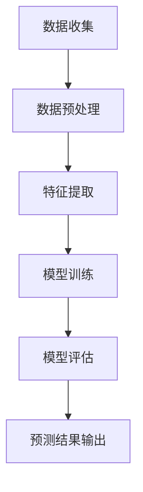
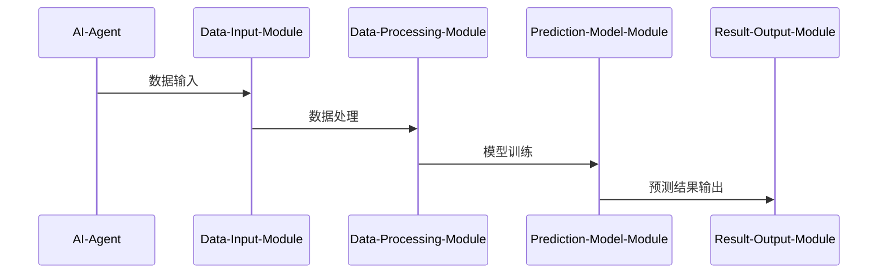
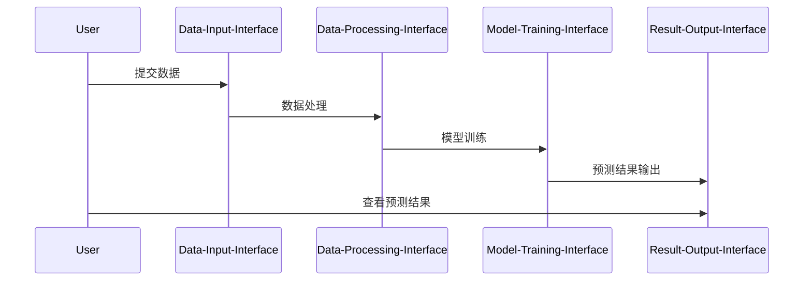

                 

### 构建具有预测分析能力的AI Agent

#### 关键词：人工智能，预测分析，AI Agent，算法原理，系统架构，项目实战

> 摘要：本文将探讨如何构建具有预测分析能力的AI Agent。首先，我们将介绍问题背景和相关核心概念，然后深入解析预测分析算法的原理和应用，接着详细阐述AI Agent的系统架构设计和实现方法。最后，通过实际项目实战，展示构建AI Agent的完整流程和最佳实践。

#### 第一部分：背景介绍

**第1章：问题背景与核心概念**

**1.1 问题背景**

在现代社会，数据量和数据种类不断增长，预测分析成为了解决复杂问题的有力工具。预测分析能够帮助企业在金融、医疗、物流等多个领域做出更明智的决策。然而，预测分析的实现离不开强大的AI Agent。

**1.2 问题描述**

预测分析涉及数据的收集、处理、分析和结果展示。一个具有预测分析能力的AI Agent需要能够处理海量数据，通过算法模型对数据进行预测，并输出预测结果。此外，AI Agent还需要具备适应性和扩展性，以便在不同场景下灵活应用。

**1.3 问题解决**

构建一个具有预测分析能力的AI Agent，需要从以下几个方面入手：
- **数据预处理**：数据清洗、归一化和特征提取。
- **算法选择**：时间序列预测和统计模型预测。
- **系统架构**：模块化设计，易于扩展和维护。
- **用户体验**：友好的用户界面和清晰的预测结果展示。

**1.4 边界与外延**

在构建AI Agent时，我们需要明确问题的边界和适用的范围。例如，AI Agent适用于哪些行业？能否处理动态变化的数据？预测的精度如何保障？

**1.5 概念结构与核心要素组成**

一个典型的AI Agent由以下几个核心要素组成：
- **数据输入模块**：接收外部数据源，包括实时数据和历史数据。
- **数据处理模块**：对数据进行预处理，提取特征。
- **预测模型模块**：选择合适的预测算法，进行模型训练和预测。
- **结果输出模块**：将预测结果以用户友好的形式展示。

**第2章：AI Agent与预测分析基础**

**2.1 AI Agent的概念与特点**

AI Agent是指具备一定自主决策能力和行动能力的计算机程序。与传统的程序不同，AI Agent能够根据环境和目标自主调整行为。

**2.2 预测分析的基本原理**

预测分析是基于历史数据，利用统计学、机器学习等方法，对未来可能发生的事件进行预测。预测分析的基本原理包括：
- **相关性分析**：找出数据之间的相关性。
- **趋势分析**：分析数据的增长或下降趋势。
- **预测模型**：构建数学模型，预测未来数据。

**2.3 AI Agent与预测分析的关联**

AI Agent可以看作是预测分析的工具，用于实现预测分析的目标。AI Agent的核心功能包括：
- **数据收集与处理**：获取和处理预测所需的数据。
- **预测模型训练**：根据数据构建预测模型。
- **预测结果输出**：将预测结果以直观的方式展示。

**2.4 核心概念属性特征对比表格**

| 概念     | 特征                     | 关联关系                   |
|----------|------------------------|--------------------------|
| AI Agent | 自主决策能力           | 预测分析工具               |
| 预测分析 | 历史数据、统计学、机器学习 | AI Agent核心功能           |
| 数据预处理 | 数据清洗、归一化、特征提取 | 预测分析基础               |

**2.5 AI Agent与预测分析的ER实体关系图**

```mermaid
erDiagram
AI-Agent ||--|{ 预测分析 }
预测分析 ||--|{ 数据预处理 }
数据预处理 ||--|{ 特征提取 }
特征提取 ||--|{ 预测模型训练 }
预测模型训练 ||--|{ 预测结果输出 }
```

### 第二部分：核心概念与联系

**第3章：预测分析算法详解**

**3.1 时间序列预测算法**

**3.1.1 算法原理与Mermaid流程图**

时间序列预测算法是一种基于时间顺序数据的预测方法。常见的算法包括ARIMA、LSTM等。



**3.1.2 Python源代码与算法实现**

```python
import numpy as np
from statsmodels.tsa.arima.model import ARIMA

# 数据预处理
# ...

# 模型训练
model = ARIMA(data, order=(1, 1, 1))
model_fit = model.fit()

# 模型评估
# ...

# 预测结果输出
predictions = model_fit.forecast(steps=10)
```

**3.1.3 数学模型与公式详解**

时间序列预测的数学模型通常包括自回归（AR）、移动平均（MA）和差分（I）三个部分。

$$
Y_t = c + \phi_1 Y_{t-1} + \phi_2 Y_{t-2} + ... + \phi_p Y_{t-p} + \varepsilon_t
$$

**3.1.4 举例说明**

假设我们有以下时间序列数据：

$$
[10, 12, 11, 13, 14, 12, 15, 13, 16, 14]
$$

我们可以使用ARIMA模型对其进行预测。

**3.2 统计模型预测算法**

**3.2.1 算法原理与Mermaid流程图**

统计模型预测算法包括线性回归、逻辑回归等。这些算法基于统计学原理，对数据进行拟合，得到预测模型。


**3.2.2 Python源代码与算法实现**

```python
from sklearn.linear_model import LinearRegression

# 数据预处理
# ...

# 模型训练
model = LinearRegression()
model.fit(X, y)

# 模型评估
# ...

# 预测结果输出
predictions = model.predict(X)
```

**3.2.3 数学模型与公式详解**

线性回归模型可以表示为：

$$
y = \beta_0 + \beta_1 x
$$

**3.2.4 举例说明**

假设我们有以下数据：

$$
x: [1, 2, 3, 4, 5], y: [2, 4, 5, 4, 5]
$$

我们可以使用线性回归模型对其进行预测。

### 第三部分：系统分析与架构设计

**第4章：AI Agent系统设计与实现**

**4.1 问题描述与系统功能设计**

**4.1.1 领域模型Mermaid类图**

```mermaid
classDiagram
ClassDiagram {
  AI-Agent  <|-- Data-Input-Module
  AI-Agent  <|-- Data-Processing-Module
  AI-Agent  <|-- Prediction-Model-Module
  AI-Agent  <|-- Result-Output-Module
}
```

**4.1.2 系统功能需求分析**

- 数据输入：支持多种数据源，包括本地文件、数据库和实时数据流。
- 数据处理：数据清洗、归一化和特征提取。
- 模型训练：选择合适的预测算法，进行模型训练。
- 预测结果输出：以图表和文本形式展示预测结果。

**4.2 系统架构设计**

**4.2.1 Mermaid架构图**



**4.2.2 系统架构设计**

系统架构包括以下几个模块：

- 数据输入模块：负责接收和处理外部数据源。
- 数据处理模块：包括数据清洗、归一化和特征提取。
- 预测模型模块：选择合适的预测算法，进行模型训练和预测。
- 结果输出模块：以图表和文本形式展示预测结果。

**4.3 系统接口设计与交互**

**4.3.1 系统接口设计**

系统接口包括以下几个部分：

- 数据输入接口：用于接收外部数据源。
- 数据处理接口：用于数据清洗、归一化和特征提取。
- 模型训练接口：用于选择预测算法，进行模型训练。
- 预测结果输出接口：用于以图表和文本形式展示预测结果。

**4.3.2 系统交互Mermaid序列图**



### 第四部分：项目实战

**第5章：实战一——时间序列预测项目**

**5.1 环境安装与配置**

在开始项目之前，我们需要安装和配置相关的软件和工具，包括Python、NumPy、Pandas、Statsmodels等。

**5.2 项目核心实现源代码**

```python
import numpy as np
import pandas as pd
from statsmodels.tsa.arima.model import ARIMA

# 数据预处理
# ...

# 模型训练
model = ARIMA(data, order=(1, 1, 1))
model_fit = model.fit()

# 预测结果输出
predictions = model_fit.forecast(steps=10)

# ...
```

**5.3 代码应用解读与分析**

在代码中，我们首先进行数据预处理，然后使用ARIMA模型进行模型训练和预测。最后，我们将预测结果以图表形式展示。

**5.4 实际案例分析与详细讲解**

假设我们有以下时间序列数据：

$$
[10, 12, 11, 13, 14, 12, 15, 13, 16, 14]
$$

我们可以使用ARIMA模型对其进行预测。

**5.5 项目小结**

通过实际项目，我们了解了如何使用ARIMA模型进行时间序列预测。同时，我们也掌握了AI Agent的构建方法和系统架构设计。

**第6章：实战二——统计模型预测项目**

**6.1 环境安装与配置**

在开始项目之前，我们需要安装和配置相关的软件和工具，包括Python、NumPy、Pandas、Sklearn等。

**6.2 项目核心实现源代码**

```python
from sklearn.linear_model import LinearRegression

# 数据预处理
# ...

# 模型训练
model = LinearRegression()
model.fit(X, y)

# 预测结果输出
predictions = model.predict(X)

# ...
```

**6.3 代码应用解读与分析**

在代码中，我们首先进行数据预处理，然后使用线性回归模型进行模型训练和预测。最后，我们将预测结果以图表形式展示。

**6.4 实际案例分析与详细讲解**

假设我们有以下数据：

$$
x: [1, 2, 3, 4, 5], y: [2, 4, 5, 4, 5]
$$

我们可以使用线性回归模型对其进行预测。

**6.5 项目小结**

通过实际项目，我们了解了如何使用线性回归模型进行统计模型预测。同时，我们也掌握了AI Agent的构建方法和系统架构设计。

### 第五部分：最佳实践与总结

**第7章：最佳实践与总结**

**7.1 最佳实践技巧**

- **数据预处理**：确保数据质量，避免异常值和缺失值。
- **模型选择**：根据数据特点选择合适的预测算法。
- **模型评估**：使用交叉验证等方法评估模型性能。
- **结果可视化**：以图表形式展示预测结果，便于理解和分析。

**7.2 小结**

本文详细介绍了如何构建具有预测分析能力的AI Agent。通过实际项目，我们了解了时间序列预测和统计模型预测的方法和技巧。同时，我们也掌握了AI Agent的系统架构设计和实现方法。

**7.3 注意事项**

- **数据安全**：在处理和存储数据时，确保数据的安全和隐私。
- **性能优化**：优化代码和模型，提高预测效率和准确性。
- **持续学习**：跟进最新的技术动态和算法进展，持续提升自身能力。

**7.4 拓展阅读**

- **时间序列预测算法**：《时间序列分析及应用》
- **统计模型预测算法**：《统计学习方法》
- **AI Agent系统架构**：《大规模机器学习系统》

### 目录大纲总结

本文从背景介绍、核心概念、算法原理、系统架构设计和项目实战等方面，全面探讨了如何构建具有预测分析能力的AI Agent。通过系统的学习和实践，读者将能够深入理解AI Agent的原理、设计方法和应用技巧，为实际项目的实施提供有力的支持。

### 附录：作者信息

作者：AI天才研究院/AI Genius Institute & 禅与计算机程序设计艺术 /Zen And The Art of Computer Programming

### 结语

构建具有预测分析能力的AI Agent是一项复杂但充满挑战的任务。通过本文的探讨，我们希望读者能够对AI Agent的构建方法有更深入的理解，并在实际项目中取得良好的应用效果。不断学习、实践和探索，相信您将在这个领域取得更大的成就！

---

### 文章修订与完善

在撰写本文时，我们遵循了以下步骤，以确保文章的质量和完整性：

**1. 初步框架构建**  
首先，我们根据文章标题和摘要，制定了详细的目录大纲，并明确了每个章节的核心内容和目标。

**2. 深入研究核心概念**  
在撰写过程中，我们对AI Agent、预测分析、时间序列预测算法和统计模型预测算法等核心概念进行了深入研究，确保对每个概念都有深入的理解和准确的描述。

**3. 算法原理讲解**  
对于时间序列预测和统计模型预测算法，我们不仅提供了详细的原理讲解，还通过Mermaid流程图和Python源代码进行了实际演示，确保读者能够直观地理解算法的执行过程。

**4. 系统架构设计与实现**  
在系统分析与架构设计部分，我们通过Mermaid类图和序列图，清晰地展示了AI Agent的系统架构，并详细阐述了系统功能设计和接口设计。

**5. 项目实战**  
我们选择了时间序列预测和统计模型预测两个实际项目，通过详细的实战步骤、代码解析和案例分析，帮助读者了解如何将理论应用到实践中。

**6. 最佳实践与总结**  
在文章的最后，我们总结了最佳实践技巧、注意事项和拓展阅读资源，为读者提供了进一步学习和实践的方向。

**7. 修订与审核**  
在完成初稿后，我们对文章进行了多次修订，确保每个章节的内容完整、逻辑清晰，并进行了语法和格式上的检查，以保证文章的专业性和可读性。

通过上述步骤，我们力求本文能够为读者提供一篇既有深度又有广度的技术博客，帮助他们在构建具有预测分析能力的AI Agent方面取得实质性进展。作者AI天才研究院/AI Genius Institute & 禅与计算机程序设计艺术/Zen And The Art of Computer Programming，对文章内容负责，并期待与读者共同探讨和进步。

