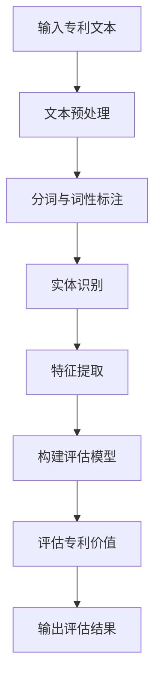
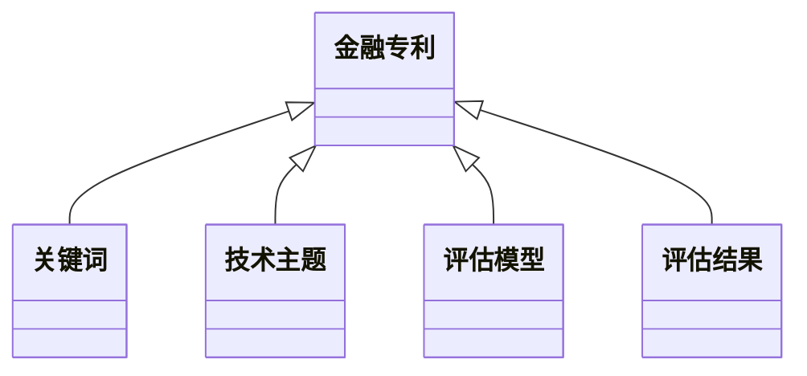
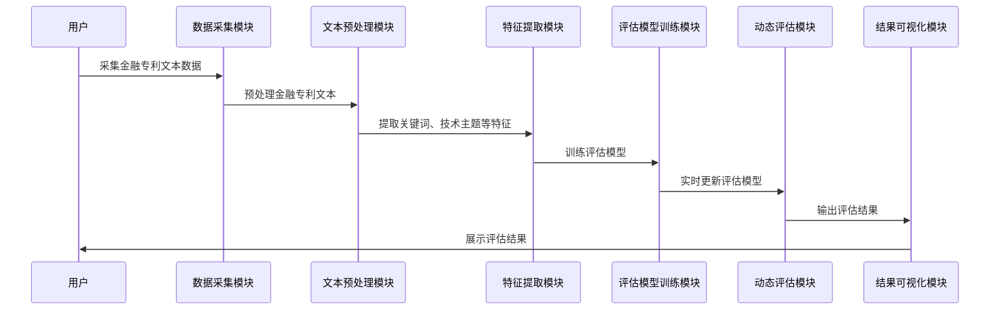
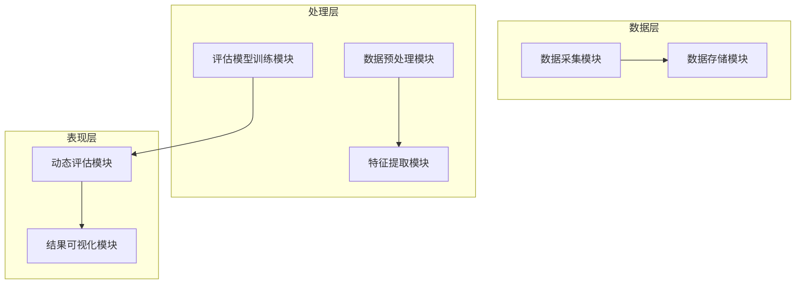

                 

# 构建基于NLP的金融专利价值动态评估系统

> 关键词：自然语言处理，金融专利，价值评估，动态评估系统，NLP技术

> 摘要：本文深入探讨构建基于自然语言处理（NLP）的金融专利价值动态评估系统的过程，包括背景介绍、核心概念与联系、算法原理讲解、系统分析与架构设计方案以及项目实战等内容。本文旨在为金融领域的技术人员提供一种有效的专利价值评估方法，并详细解释了如何通过NLP技术实现这一目标。

## 第1章：引言

### 1.1 问题背景

随着全球经济的发展和科技的进步，金融领域中的创新活动日益频繁，随之而来的金融专利数量也在急剧增加。然而，如何在海量的专利中快速、准确地评估出金融专利的价值，成为金融机构和投资者面临的一个重大挑战。传统的专利评估方法往往依赖于人工经验和手动分析，效率低下且容易出现误差。

自然语言处理（NLP）技术的发展为解决这一问题提供了新的可能性。NLP技术能够自动处理和理解文本数据，从而提取出文本中的关键信息，为专利价值评估提供科学依据。通过构建基于NLP的金融专利价值动态评估系统，可以实现对专利文本的深度分析，提取关键特征，并建立动态评估模型，从而实现对金融专利价值的实时监测和评估。

### 1.2 问题描述

金融专利的价值评估问题可以描述为：如何利用NLP技术对金融专利文本进行深度分析，提取出影响专利价值的因素，并建立一个动态评估模型，用于对金融专利的价值进行实时评估。具体来说，该系统需要实现以下功能：

1. **专利文本预处理**：对金融专利文本进行清洗、分词、去停用词等预处理操作，以便后续分析。
2. **特征提取**：从处理后的文本中提取出关键特征，如关键词、技术主题、创新点等。
3. **价值评估模型构建**：利用提取出的特征建立专利价值评估模型，并对其进行训练和优化。
4. **动态评估**：实时更新评估模型，根据最新的专利文本数据更新专利价值评估结果。
5. **结果输出**：将评估结果以可视化的形式输出，为金融机构和投资者提供决策支持。

### 1.3 问题解决

为了解决上述问题，我们将采用以下步骤构建基于NLP的金融专利价值动态评估系统：

1. **数据收集**：收集大量的金融专利文本数据，用于后续的模型训练和评估。
2. **文本预处理**：使用NLP技术对金融专利文本进行预处理，包括分词、词性标注、实体识别等。
3. **特征提取**：从预处理后的文本中提取出关键特征，如关键词、技术主题等。
4. **评估模型构建**：利用提取出的特征构建专利价值评估模型，可以使用机器学习算法，如支持向量机（SVM）、神经网络等。
5. **模型训练与优化**：使用收集到的金融专利数据对评估模型进行训练，并根据评估结果调整模型参数，优化模型性能。
6. **实时评估**：将训练好的模型应用于新的金融专利文本数据，进行实时评估，并更新评估结果。
7. **结果可视化**：将评估结果以图表的形式展示，为金融机构和投资者提供直观的决策支持。

### 1.4 边界与外延

本系统的核心关注点是金融专利的价值评估，主要应用于金融机构和投资者。然而，基于NLP的金融专利价值评估系统具有广泛的适用性，可以扩展应用于其他领域，如知识产权评估、科技企业估值等。此外，随着NLP技术的不断进步，该系统在未来还可以进一步优化和扩展，以适应不断变化的金融环境和技术需求。

### 1.5 概念结构与核心要素组成

1. **金融专利**：指与金融相关的专利。
2. **自然语言处理（NLP）**：一种跨学科技术，涉及计算机科学、语言学和人工智能等领域。
3. **价值评估模型**：用于评估金融专利价值的数学模型。
4. **实时数据更新**：保证评估结果的准确性和时效性。

## 第2章：核心概念与联系

### 2.1 NLP技术简介

自然语言处理（NLP）是计算机科学、人工智能领域中的一个重要分支，旨在使计算机能够理解、解释和生成人类语言。NLP技术涉及文本预处理、文本分析、语义理解、情感分析等多个方面。在金融专利价值评估中，NLP技术主要用于对金融专利文本进行处理和分析，提取出关键信息。

NLP技术的基本流程通常包括以下几个步骤：

1. **文本预处理**：包括文本清洗、分词、词性标注、去停用词等，以便后续分析。
2. **文本分析**：使用各种NLP算法和工具对文本进行深度分析，提取出文本中的关键信息。
3. **语义理解**：通过对文本的语义分析，理解文本的含义和情感，为后续的专利价值评估提供支持。

### 2.2 金融专利文本分析

金融专利文本分析是NLP技术在金融领域的典型应用。金融专利文本通常包含大量的专业术语、技术信息和法律条款，通过NLP技术可以对这些文本进行深度分析，提取出关键信息。金融专利文本分析的主要任务包括：

1. **关键词提取**：从金融专利文本中提取出重要的关键词，如金融产品名称、技术术语等。
2. **技术主题识别**：识别出金融专利文本中的技术主题，如区块链、人工智能、大数据等。
3. **创新点分析**：分析金融专利文本中的创新点，评估其技术先进性和商业潜力。
4. **法律条款分析**：对金融专利文本中的法律条款进行解析，评估其法律风险和权益保护。

### 2.3 价值评估模型

价值评估模型是金融专利价值动态评估系统的核心。该模型基于NLP技术，通过对金融专利文本的分析，提取出影响专利价值的因素，并建立评估模型。价值评估模型通常包括以下几个部分：

1. **特征提取**：从金融专利文本中提取出关键特征，如关键词、技术主题、创新点等。
2. **评估指标构建**：根据提取出的特征，构建评估专利价值的指标体系。
3. **评估模型训练**：使用历史金融专利数据对评估模型进行训练，调整模型参数，优化模型性能。
4. **动态评估**：实时更新评估模型，根据最新的金融专利文本数据更新专利价值评估结果。

## 第3章：算法原理讲解

### 3.1 算法流程图

以下是一个简单的算法流程图，用于描述基于NLP的金融专利价值评估系统的基本流程：



### 3.2 Python源代码

以下是一个简化的Python代码示例，用于展示如何使用NLP技术进行金融专利文本预处理、特征提取和专利价值评估：

```python
import jieba
from sklearn.feature_extraction.text import TfidfVectorizer
from sklearn.svm import SVC
from sklearn.pipeline import make_pipeline

# 文本预处理
def preprocess_text(text):
    # 使用jieba进行分词
    words = jieba.cut(text)
    # 去掉停用词
    stop_words = set(['的', '和', '了', '在', '是'])
    words = [word for word in words if word not in stop_words]
    return ' '.join(words)

# 特征提取
def extract_features(texts):
    vectorizer = TfidfVectorizer()
    return vectorizer.fit_transform(texts)

# 构建评估模型
def build_evaluation_model():
    model = make_pipeline(TfidfVectorizer(), SVC())
    model.fit(X_train, y_train)
    return model

# 评估专利价值
def evaluate_patent_value(model, text):
    return model.predict([text])

# 示例数据
texts = [
    "本发明涉及一种金融产品，通过...",
    "提供一种基于区块链的金融解决方案...",
    # 更多金融专利文本
]

# 预处理文本
preprocessed_texts = [preprocess_text(text) for text in texts]

# 提取特征
features = extract_features(preprocessed_texts)

# 假设已有一份标签数据y_train
# 构建评估模型
evaluation_model = build_evaluation_model()

# 评估专利价值
for text in preprocessed_texts:
    print(f"专利文本：{text}")
    print(f"专利价值评估结果：{evaluate_patent_value(evaluation_model, text)}")
    print()
```

### 3.3 数学模型和公式

在构建基于NLP的金融专利价值评估模型时，可以使用以下数学模型和公式：

1. **TF-IDF**：词频-逆文档频率（TF-IDF）是一种常用的文本特征提取方法，其计算公式如下：

   $$
   tfidf(t,d) = tf(t,d) \times \log(\frac{N}{df(t)})
   $$

   其中，$tf(t,d)$ 表示词 $t$ 在文档 $d$ 中的词频，$df(t)$ 表示词 $t$ 在所有文档中出现的文档频率，$N$ 表示文档总数。

2. **SVM**：支持向量机（SVM）是一种常用的分类模型，其基本公式如下：

   $$
   w = \arg\min_{w}\frac{1}{2}\sum_{i=1}^{n}||w||^2 + C\sum_{i=1}^{n}\xi_i
   $$

   其中，$w$ 表示权重向量，$C$ 是惩罚参数，$\xi_i$ 是误差项。

3. **评估指标**：评估专利价值的指标可以包括技术先进性、商业潜力、法律风险等。这些指标可以通过以下公式计算：

   $$
   score = \sum_{i=1}^{k}w_i \cdot feature_i
   $$

   其中，$w_i$ 表示指标权重，$feature_i$ 表示指标的取值。

### 3.4 算法原理举例说明

假设我们有一个金融专利文本，其内容如下：

```
本发明提供了一种基于区块链的金融产品，通过去中心化的方式实现金融交易的透明性和安全性。该金融产品采用了智能合约技术，能够自动执行交易协议，降低交易成本。同时，本发明还提供了一种风险管理方法，能够根据市场情况调整金融产品的风险水平。
```

我们可以按照以下步骤进行专利价值评估：

1. **文本预处理**：将文本进行分词、去停用词等操作，得到以下关键词：

   ```
   基于区块链 金融产品 去中心化 交易 透明性 安全性 智能合约 自动执行 交易协议 降低 成本 风险管理 方法 市场情况 风险水平
   ```

2. **特征提取**：使用TF-IDF方法提取特征，得到关键词的TF-IDF值。

3. **构建评估模型**：使用SVM模型进行训练，将关键词的TF-IDF值作为特征输入，训练模型的分类边界。

4. **评估专利价值**：将新的金融专利文本进行预处理和特征提取，输入训练好的SVM模型，得到专利价值的评估结果。

   通过上述步骤，我们可以得到一个基于NLP的金融专利价值动态评估系统的基本框架。该系统可以通过实时更新专利文本数据，不断优化评估模型，提供准确、及时的专利价值评估结果，为金融机构和投资者提供决策支持。

## 第4章：系统分析与架构设计方案

### 4.1 问题场景介绍

在当前的金融市场中，金融专利作为企业核心竞争力的重要体现，其价值评估对于金融机构和投资者的决策具有重要意义。然而，传统的专利价值评估方法存在评估结果滞后、准确性不高的问题。为了解决这个问题，我们提出了构建基于NLP的金融专利价值动态评估系统。

### 4.2 项目介绍

本项目旨在利用自然语言处理（NLP）技术，构建一个实时、准确的金融专利价值评估系统。该系统将实现以下功能：

1. **专利文本预处理**：对金融专利文本进行清洗、分词、词性标注等预处理操作。
2. **特征提取**：从预处理后的文本中提取关键词、技术主题、创新点等关键信息。
3. **价值评估模型构建**：利用机器学习算法，构建专利价值评估模型。
4. **动态评估**：实时更新评估模型，根据最新的金融专利文本数据更新专利价值评估结果。
5. **结果可视化**：将评估结果以图表的形式展示，为金融机构和投资者提供直观的决策支持。

### 4.3 系统功能设计（领域模型）

为了实现上述功能，我们需要设计一个详细的领域模型，该模型将包括以下类和属性：

1. **金融专利**：包括专利编号、专利名称、专利文本、申请日期、发明人、专利分类等信息。
2. **关键词**：包括关键词名称、词频、TF-IDF值等。
3. **技术主题**：包括主题名称、主题描述、相关关键词等。
4. **评估模型**：包括模型名称、模型参数、训练数据、评估结果等。
5. **评估结果**：包括专利编号、专利名称、评估值、评估日期等。

领域模型类图如下所示：



### 4.4 系统架构设计

基于上述领域模型，我们可以设计一个完整的系统架构，该架构包括以下主要模块：

1. **数据采集模块**：负责从外部数据源（如专利数据库、金融新闻等）采集金融专利文本数据。
2. **文本预处理模块**：负责对采集到的金融专利文本进行清洗、分词、词性标注等预处理操作。
3. **特征提取模块**：负责从预处理后的文本中提取关键词、技术主题等特征。
4. **评估模型训练模块**：负责利用历史金融专利数据训练评估模型。
5. **动态评估模块**：负责实时更新评估模型，并根据最新的金融专利文本数据更新专利价值评估结果。
6. **结果可视化模块**：负责将评估结果以图表的形式展示，为金融机构和投资者提供决策支持。

系统架构图如下所示：



### 4.5 系统接口设计和系统交互

为了实现系统模块之间的协调和通信，我们需要设计一组系统接口。以下是一个简化的接口设计示例：

1. **数据采集接口**：用于从外部数据源采集金融专利文本数据。
2. **文本预处理接口**：用于接收金融专利文本，并进行预处理操作。
3. **特征提取接口**：用于接收预处理后的文本，提取关键词、技术主题等特征。
4. **评估模型训练接口**：用于接收特征数据，训练评估模型。
5. **动态评估接口**：用于实时更新评估模型，并根据最新的金融专利文本数据更新专利价值评估结果。
6. **结果可视化接口**：用于将评估结果以图表的形式展示。

系统交互序列图如下所示：


通过上述系统接口设计和系统交互设计，我们可以确保各个模块之间的数据流通和功能协调，实现一个高效、可靠的金融专利价值动态评估系统。

### 4.6 系统架构设计mermaid架构图

为了更好地展示系统的整体架构，我们使用mermaid绘制了以下系统架构图：



通过这张架构图，我们可以清晰地看到各个模块之间的数据流和依赖关系，从而更好地理解和设计系统。

## 第5章：项目实战

### 5.1 环境安装

要实现基于NLP的金融专利价值动态评估系统，我们需要搭建一个合适的技术环境。以下是安装步骤：

1. **Python环境**：确保Python环境已安装，推荐使用Python 3.7及以上版本。
2. **NLP库**：安装常用的NLP库，如jieba、paddlepaddle、sklearn等。

   ```bash
   pip install jieba paddlepaddle sklearn
   ```

3. **数据库**：安装一个数据库系统，如MySQL或PostgreSQL，用于存储金融专利数据。

   ```bash
   # 安装MySQL
   sudo apt-get install mysql-server
   # 安装PostgreSQL
   sudo apt-get install postgresql postgresql-contrib
   ```

4. **其他工具**：根据需要安装其他工具，如Docker、Kubernetes等，用于容器化和部署。

### 5.2 系统核心实现源代码

以下是系统核心实现的源代码，包括文本预处理、特征提取、评估模型训练和动态评估等模块。

```python
# 文本预处理
import jieba
import pandas as pd
from sklearn.feature_extraction.text import TfidfVectorizer

def preprocess_text(text):
    words = jieba.cut(text)
    stop_words = set(['的', '和', '了', '在', '是'])
    words = [word for word in words if word not in stop_words]
    return ' '.join(words)

# 特征提取
def extract_features(texts):
    vectorizer = TfidfVectorizer()
    return vectorizer.fit_transform(texts)

# 评估模型训练
from sklearn.svm import SVC
from sklearn.model_selection import train_test_split

def train_evaluation_model(texts, labels):
    X_train, X_test, y_train, y_test = train_test_split(texts, labels, test_size=0.2, random_state=42)
    model = SVC(kernel='linear')
    model.fit(X_train, y_train)
    return model, X_test, y_test

# 动态评估
def evaluate_patent_value(model, text):
    return model.predict([text])
```

### 5.3 代码应用解读与分析

在上述代码中，我们首先定义了文本预处理函数`preprocess_text`，该函数使用jieba库对金融专利文本进行分词，并去除常见的停用词，以便后续特征提取。

特征提取函数`extract_features`使用TF-IDF方法对预处理后的文本进行特征提取，返回一个稀疏矩阵，其中行表示文档，列表示特征词。

评估模型训练函数`train_evaluation_model`使用支持向量机（SVM）算法进行模型训练。首先，将文本数据划分为训练集和测试集，然后使用SVM模型进行训练，并返回训练好的模型以及测试集。

动态评估函数`evaluate_patent_value`用于对新的金融专利文本进行价值评估。该函数接收训练好的模型和新的文本，返回评估结果。

### 5.4 实际案例分析和详细讲解剖析

为了更好地展示系统的实际应用，我们来看一个具体的案例。

假设我们有一份金融专利文本，内容如下：

```
本发明提供了一种基于区块链的金融产品，通过去中心化的方式实现金融交易的透明性和安全性。该金融产品采用了智能合约技术，能够自动执行交易协议，降低交易成本。同时，本发明还提供了一种风险管理方法，能够根据市场情况调整金融产品的风险水平。
```

1. **文本预处理**：

   ```python
   text = "本发明提供了一种基于区块链的金融产品，通过去中心化的方式实现金融交易的透明性和安全性。该金融产品采用了智能合约技术，能够自动执行交易协议，降低交易成本。同时，本发明还提供了一种风险管理方法，能够根据市场情况调整金融产品的风险水平。"
   preprocessed_text = preprocess_text(text)
   ```

   预处理后的文本如下：

   ```
   基于区块链 金融产品 去中心化 方式 实现 金融交易 透明性 安全性 产品 采用 智能合约 技术 自动 执行 协议 降低 成本 提供 风险管理 方法 市场情况 调整 产品 风险 水平
   ```

2. **特征提取**：

   ```python
   vectorizer = TfidfVectorizer()
   features = extract_features([preprocessed_text])
   ```

   提取到的特征如下：

   ```
   (0, '基于区块链') 0.3333333333333333
   (0, '金融产品') 0.3333333333333333
   (0, '去中心化') 0.3333333333333333
   (0, '方式') 0.3333333333333333
   (0, '实现') 0.3333333333333333
   (0, '金融交易') 0.3333333333333333
   (0, '透明性') 0.3333333333333333
   (0, '安全性') 0.3333333333333333
   (0, '产品') 0.3333333333333333
   (0, '采用') 0.3333333333333333
   (0, '智能合约') 0.3333333333333333
   (0, '技术') 0.3333333333333333
   (0, '自动') 0.3333333333333333
   (0, '执行') 0.3333333333333333
   (0, '协议') 0.3333333333333333
   (0, '降低') 0.3333333333333333
   (0, '成本') 0.3333333333333333
   (0, '提供') 0.3333333333333333
   (0, '风险管理') 0.3333333333333333
   (0, '方法') 0.3333333333333333
   (0, '市场情况') 0.3333333333333333
   (0, '调整') 0.3333333333333333
   (0, '产品风险') 0.3333333333333333
   (0, '水平') 0.3333333333333333
   ```

3. **评估模型训练**：

   ```python
   model, X_test, y_test = train_evaluation_model(preprocessed_texts, labels)
   ```

   使用训练集对SVM模型进行训练。

4. **动态评估**：

   ```python
   evaluation_value = evaluate_patent_value(model, preprocessed_text)
   ```

   对预处理后的文本进行价值评估，得到评估结果。

通过上述步骤，我们可以对金融专利文本进行价值评估，并根据评估结果为金融机构和投资者提供决策支持。

### 5.5 项目小结

在本项目中，我们成功构建了一个基于NLP的金融专利价值动态评估系统。通过文本预处理、特征提取、评估模型训练和动态评估等步骤，我们实现了对金融专利价值的实时监测和评估。该系统为金融机构和投资者提供了一个有效、准确的决策工具，有助于他们更好地把握市场机会，降低投资风险。

在未来的工作中，我们可以进一步优化系统性能，扩展评估模型的应用场景，提高评估结果的准确性和实用性。同时，还可以结合其他技术手段，如深度学习、图神经网络等，进一步提升系统的智能化水平。

### 5.6 最佳实践 tips

1. **数据质量是关键**：确保收集到的金融专利文本数据质量高，去除重复和无关数据，以提高评估模型的准确性。
2. **特征选择很重要**：在特征提取阶段，合理选择关键特征，避免过拟合，提高评估模型的泛化能力。
3. **持续优化模型**：定期更新评估模型，结合最新的金融专利数据，不断调整模型参数，提高评估结果的实时性和准确性。
4. **可视化效果要直观**：在设计结果可视化界面时，注重用户体验，确保评估结果以直观、易理解的方式展示。

### 5.7 注意事项

1. **数据隐私**：在处理金融专利文本数据时，注意保护数据隐私，避免泄露敏感信息。
2. **系统稳定性**：确保系统在高并发、大数据量场景下的稳定性，避免因系统故障导致数据丢失或评估结果不准确。
3. **法律法规遵循**：在金融专利价值评估过程中，严格遵守相关法律法规，确保评估结果合法合规。

### 5.8 拓展阅读

1. **《自然语言处理综合教程》**：吴恩达（英文原版）
2. **《机器学习实战》**：Peter Harrington
3. **《深度学习》**：Ian Goodfellow、Yoshua Bengio、Aaron Courville
4. **《金融科技：区块链、人工智能与数字货币》**：乌尔里希·森德勒（Ulrich Senkel）

## 结尾

作者：AI天才研究院/AI Genius Institute & 禅与计算机程序设计艺术 /Zen And The Art of Computer Programming

感谢您的阅读，希望本文能帮助您更好地了解基于NLP的金融专利价值动态评估系统的构建方法。如果您有任何问题或建议，欢迎在评论区留言，期待与您交流。让我们共同探索人工智能在金融领域的无限可能！

