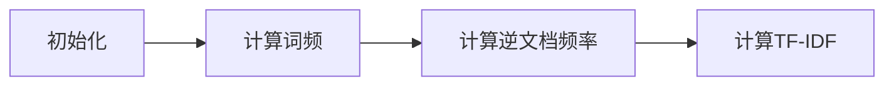
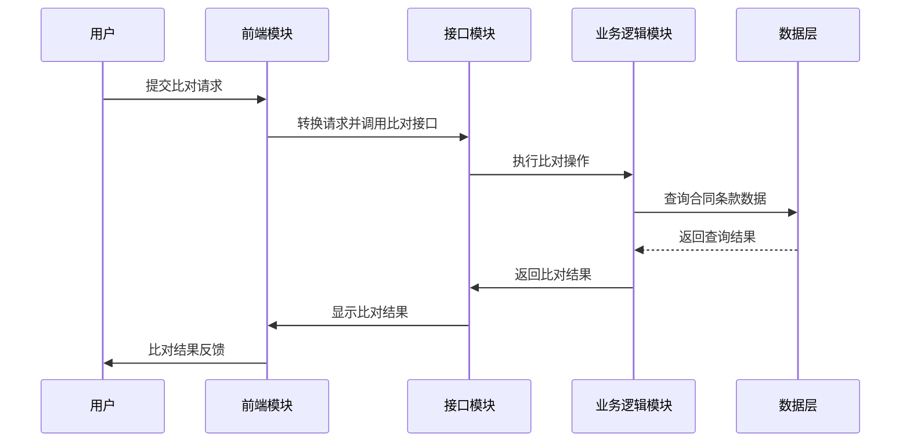

                 

### 第1章 引言

#### 1.1 问题背景与重要性

在现代金融行业中，合同的自动化比对是一个日益重要的需求。传统的金融合同通常包含大量复杂的条款，这些条款不仅语言晦涩难懂，而且格式各异，给合同的管理和比对带来了巨大挑战。随着金融市场的快速发展和金融交易的日益频繁，手动比对合同条款的效率低下和错误率高的弊端逐渐显现。

金融合同条款的比对主要包括合同内容的相似度分析、条款匹配、冲突检测等功能。这些功能对于确保合同的准确性和合规性至关重要。例如，在银行业务中，合同条款的比对可以帮助银行快速发现潜在的风险和错误，从而提高业务效率和降低风险；在证券交易中，准确的合同比对可以帮助投资者避免因条款理解错误导致的投资损失。

然而，现有的金融合同比对系统大多依赖于人工操作，存在以下问题：

1. **效率低下**：合同数量庞大，人工比对费时费力。
2. **错误率高**：人工比对容易产生疏漏和错误，导致合同执行出现偏差。
3. **难以扩展**：随着合同内容和形式的多样化，传统比对系统难以适应。

为了解决这些问题，近年来自然语言处理（NLP）技术开始在金融合同条款比对中应用。NLP技术能够有效地处理和理解自然语言文本，从而提高比对系统的自动化程度和准确性。通过构建基于NLP的金融合同条款自动化比对系统，可以实现以下目标：

1. **提高效率**：自动化比对系统能够快速处理大量合同条款，显著提高比对速度。
2. **降低错误率**：利用NLP技术，系统能够精确识别和理解合同条款，减少人工误判的可能性。
3. **支持扩展**：NLP技术能够灵活适应不同类型的合同条款，支持系统的扩展和维护。

本文旨在探讨如何构建基于NLP的金融合同条款自动化比对系统，通过深入分析NLP技术及其在金融合同比对中的应用，提出一套完整的系统设计方法和实现策略。

#### 1.2 书籍结构概述

本文结构分为八个主要章节，旨在系统性地介绍金融合同条款自动化比对系统的构建过程。具体章节安排如下：

- **第1章 引言**：阐述构建金融合同条款自动化比对系统的背景和重要性，以及本文的结构安排和预期收益。

- **第2章 自然语言处理（NLP）基础**：介绍NLP的基本概念、核心技术以及在金融合同条款比对中的应用。

- **第3章 金融合同条款比对的需求分析**：分析金融合同条款的特点和比对需求，讨论系统目标与挑战。

- **第4章 基于NLP的比对算法原理**：讲解三种主要的NLP比对算法（TF-IDF、Word2Vec、BERT），以及各自的原理和应用。

- **第5章 数学模型与公式**：详细阐述相似度计算的核心数学模型和公式，并进行通俗易懂的举例说明。

- **第6章 系统架构设计**：介绍系统架构的总体设计，包括领域模型、系统架构、接口设计和交互设计。

- **第7章 项目实战**：通过具体项目实践，详细讲解系统环境搭建、核心实现、代码分析、实际案例分析以及项目小结。

- **第8章 最佳实践与总结**：总结最佳实践经验，提出注意事项，并推荐拓展阅读资源。

通过上述章节的详细探讨，本文希望能够为读者提供一套全面、实用的金融合同条款自动化比对系统构建方案。

#### 1.3 阅读对象与预期收益

本文的阅读对象主要包括以下几类人群：

1. **金融行业从业者**：特别是从事合同管理、风险管理等岗位的专业人员，通过本文可以了解如何利用NLP技术提高金融合同条款比对效率，降低错误率。
2. **技术研究人员**：对自然语言处理和金融科技感兴趣的技术研究人员，可以通过本文深入理解NLP在金融合同条款比对中的具体应用，以及相关的算法和系统设计。
3. **软件开发工程师**：有志于开发金融科技产品的软件开发工程师，通过本文可以掌握金融合同条款自动化比对系统的实现方法和关键技术。

通过阅读本文，读者可以预期获得以下收益：

1. **了解NLP在金融合同条款比对中的应用**：掌握NLP的基本概念和技术，以及如何在金融合同条款比对中应用这些技术。
2. **掌握金融合同条款比对算法**：了解TF-IDF、Word2Vec、BERT等比对算法的原理和应用，能够根据实际需求选择合适的算法。
3. **学习系统设计和实现方法**：通过详细的系统架构设计和项目实战，掌握构建金融合同条款自动化比对系统的方法和技巧。
4. **提高工作效率和准确性**：通过自动化比对系统，能够显著提高金融合同条款比对的工作效率，降低错误率，确保合同执行的准确性和合规性。

总之，本文旨在为读者提供一套全面、系统的金融合同条款自动化比对解决方案，帮助读者应对金融行业中的复杂挑战，实现业务和技术上的双重提升。

### 第2章 自然语言处理（NLP）基础

#### 2.1 NLP的基本概念

自然语言处理（Natural Language Processing，简称NLP）是计算机科学、人工智能和语言学的交叉领域，旨在使计算机能够理解、处理和生成人类自然语言。NLP的研究内容包括文本分类、信息提取、问答系统、机器翻译、情感分析等多个方面。NLP的核心目标是构建能够理解和处理人类语言的智能系统，从而实现人机交互的自动化。

在NLP中，常见的术语包括：

1. **文本**：自然语言文本，如文章、对话、合同条款等。
2. **词汇**：文本中的基本单位，如单词、词组等。
3. **词性标注**：对文本中的每个词汇进行词性（如名词、动词、形容词等）分类的过程。
4. **分词**：将连续文本分割成单词或其他词汇的过程。
5. **句法分析**：对文本中的句子进行结构分析，识别出句子中的成分和关系。
6. **依存句法分析**：分析句子中词汇之间的依赖关系，如主谓关系、修饰关系等。
7. **语义分析**：理解文本中的含义和意图，包括实体识别、关系抽取、情感分析等。

#### 2.2 NLP的核心技术

NLP的核心技术包括词向量表示、词性标注、依存句法分析等。这些技术共同构成了NLP的基础框架，使得计算机能够对自然语言文本进行有效的处理和理解。

##### 2.2.1 词向量表示

词向量表示是将文本中的词汇映射到高维空间中的向量，从而实现词汇的量化表示。词向量表示能够捕捉词汇的语义信息，使得计算机能够通过向量运算处理文本。常见的词向量表示方法包括：

1. **TF-IDF**：基于词频（Term Frequency，TF）和逆文档频率（Inverse Document Frequency，IDF）的方法，通过词频和逆文档频率的加权来表示词汇的重要性。
2. **Word2Vec**：基于神经网络的方法，通过训练神经网络来预测相邻词，从而学习词汇的语义表示。Word2Vec包括连续词袋（CBOW）和Skip-Gram两种模型。
3. **GloVe**：全局向量表示（Global Vectors for Word Representation）方法，通过训练大规模语料库来学习词汇的共现关系，生成高质的词向量表示。

##### 2.2.2 词性标注

词性标注是对文本中的每个词汇进行词性分类的过程。词性标注有助于理解文本的语法结构和语义含义。常见的词性标注方法包括：

1. **规则方法**：基于语言规则和模式匹配的方法，通过预设的规则来标注词性。
2. **统计方法**：基于统计学习的方法，通过训练模型来预测词汇的词性。
3. **深度学习方法**：使用神经网络来学习词汇的词性标注，如使用BiLSTM（双向长短期记忆网络）和CRF（条件随机场）进行词性标注。

##### 2.2.3 依存句法分析

依存句法分析是分析句子中词汇之间的依赖关系，如主谓关系、修饰关系等。依存句法分析有助于理解句子的语义结构和深层含义。常见的依存句法分析方法包括：

1. **规则方法**：通过预设的语法规则来分析句子中的依赖关系。
2. **统计方法**：通过训练统计模型来预测句子中的依赖关系。
3. **深度学习方法**：使用神经网络来学习句子的依赖关系，如使用LSTM（长短期记忆网络）和Transformer模型进行依存句法分析。

#### 2.3 NLP在金融合同条款比对中的应用

在金融合同条款比对中，NLP技术被广泛应用于以下几个方面：

1. **文本预处理**：利用NLP技术对金融合同条款进行文本预处理，包括分词、词性标注、去除停用词等，以便后续的分析和处理。

2. **相似度计算**：通过NLP技术计算合同条款之间的相似度，包括词汇相似度、句法相似度和语义相似度等。常用的相似度计算方法包括TF-IDF、Word2Vec、BERT等。

3. **条款匹配**：利用NLP技术进行条款匹配，识别合同中的相似条款或冲突条款，从而确保合同内容的准确性和一致性。

4. **冲突检测**：通过分析合同条款的语义关系，检测合同中的潜在冲突，如条款之间的逻辑矛盾或语义不一致。

5. **文本生成**：利用NLP技术生成新的合同条款或修改现有条款，以适应特定的业务需求或法律要求。

通过NLP技术，金融合同条款比对系统可以实现自动化、高效和准确的处理，从而提高合同管理的效率和可靠性。

### 第3章 金融合同条款比对的需求分析

金融合同条款的比对是金融行业中一个至关重要的环节，旨在确保合同条款的准确性和一致性。然而，由于金融合同的复杂性、多样性和变化性，实现有效的条款比对面临诸多挑战。本节将深入分析金融合同条款的特点、比对需求以及系统目标与挑战。

#### 3.1 金融合同条款概述

金融合同条款是指金融交易双方在合同中约定的权利、义务、责任和风险的具体内容。这些条款通常包括以下几类信息：

1. **主体信息**：涉及合同主体的名称、地址、联系方式等基本信息。
2. **交易信息**：包括交易的金额、期限、利率、费用等具体交易条款。
3. **权益和责任**：涉及合同双方的权益分配、责任承担和风险分配等。
4. **违约条款**：包括违约情形、违约责任和违约处理方式等。
5. **合同生效和终止**：合同生效的条件、终止的条件和方式等。

金融合同条款通常具有以下特点：

1. **复杂性**：金融合同条款内容繁多，涉及金融知识、法律条款和业务规则等，复杂度较高。
2. **多样性**：金融合同种类繁多，包括贷款合同、证券交易合同、保险合同等，不同类型的合同条款结构、语言和格式各异。
3. **变化性**：金融市场的变化迅速，金融合同条款也会随之调整和更新，需要实时比对和调整。

#### 3.2 比对需求分析

金融合同条款比对的需求主要来源于以下几个方面：

1. **合规性检查**：确保合同条款符合相关法律法规和监管要求。例如，贷款合同中的利率条款必须符合国家规定的利率范围，保险合同中的责任条款必须明确且合法。
2. **一致性检查**：确保合同条款在多次修改和传递过程中保持一致性。例如，在不同版本的合同中，相同的条款应该具有相同的内容和格式。
3. **风险控制**：通过比对合同条款，识别潜在的风险点和冲突点，提前预防和处理风险。例如，通过比对贷款合同中的违约条款和利率条款，可以识别是否存在高利率贷款的风险。
4. **效率提升**：自动化比对系统能够快速处理大量的合同条款，提高比对效率和准确性，减轻人工工作负担。
5. **客户体验**：提供高效的合同条款比对服务，提升客户的满意度和体验，特别是在大型金融企业中，合同数量庞大，客户对快速且准确的比对服务有较高的期望。

#### 3.3 比对系统的目标与挑战

构建基于NLP的金融合同条款自动化比对系统的目标主要包括：

1. **自动化**：实现合同条款的自动化比对，减少人工干预，提高工作效率。
2. **准确性**：通过NLP技术，提高比对系统的准确性和可靠性，确保比对结果的一致性和正确性。
3. **灵活性**：系统应能够适应不同类型的金融合同和条款结构，支持自定义比对规则和策略。
4. **可扩展性**：系统应具备良好的可扩展性，能够随着金融业务的发展和技术进步进行升级和扩展。

然而，实现上述目标也面临诸多挑战：

1. **数据质量**：金融合同条款数据质量参差不齐，包括数据缺失、格式不一致、语言不规范等问题，影响比对的准确性。
2. **语义理解**：金融合同条款的语义理解复杂，涉及专业术语、行业惯例和法律条款，NLP技术需要能够准确理解和处理这些语义信息。
3. **规则匹配**：金融合同条款比对需要灵活的规则匹配机制，以适应不同的比对场景和需求，但规则的制定和调整往往需要大量人工工作。
4. **实时性**：金融业务对合同比对的速度要求较高，系统需要在短时间内处理大量的比对任务，同时保证比对的准确性和一致性。

为了克服上述挑战，系统设计者需要综合考虑数据预处理、语义理解、算法优化和系统架构等因素，构建一个高效、灵活和可靠的金融合同条款自动化比对系统。

### 第4章 基于NLP的比对算法原理

在金融合同条款比对中，NLP算法扮演着至关重要的角色。本节将详细介绍三种主要的NLP比对算法：TF-IDF、Word2Vec和BERT，并解释各自的原理和应用。

#### 4.1 相似度计算算法

相似度计算是NLP中的核心任务之一，旨在衡量两个文本或条款之间的相似程度。在金融合同条款比对中，相似度计算可以帮助识别相似的条款或检测潜在的风险点。以下将介绍几种常用的相似度计算算法。

##### 4.1.1 TF-IDF算法

TF-IDF（Term Frequency-Inverse Document Frequency）是一种经典的文本相似度计算方法，主要用于文本信息的权重计算。其核心思想是，如果一个词在多个文档中频繁出现，那么这个词可能并不具有很好的区分度；反之，如果一个词在多个文档中很少出现，那么这个词可能具有更高的区分度。

1. **TF（词频）**：表示一个词在单个文档中的出现次数，计算公式为：

   $$ TF(t, d) = \frac{f_{t,d}}{N} $$

   其中，$t$表示词，$d$表示文档，$f_{t,d}$表示词$t$在文档$d$中的出现次数，$N$表示文档$d$的总词数。

2. **IDF（逆文档频率）**：表示一个词在文档集合中的重要性，计算公式为：

   $$ IDF(t, D) = \log \left( \frac{N}{|d_t|} \right) $$

   其中，$D$表示文档集合，$d_t$表示包含词$t$的文档数量，$N$表示文档的总数。

3. **TF-IDF**：综合词频和逆文档频率，计算公式为：

   $$ TF-IDF(t, d, D) = TF(t, d) \times IDF(t, D) $$

TF-IDF算法能够有效地捕捉文本中的重要信息，但在处理金融合同条款时，可能无法很好地理解语义和上下文信息，因为它主要依赖于词频和文档频率。

##### 4.1.2 Word2Vec算法

Word2Vec是一种基于神经网络的词向量表示方法，通过将词汇映射到高维空间中的向量，从而实现词汇的量化表示。Word2Vec主要有两种模型：连续词袋（CBOW）和Skip-Gram。

1. **CBOW（Continuous Bag-of-Words）**：CBOW模型通过上下文词向量来预测中心词。给定一个中心词，CBOW模型将预测其周围的词。其模型公式为：

   $$ \hat{p}_{w_c} = \sigma(W \cdot [v_{w_1}, v_{w_2}, ..., v_{w_n}]) $$

   其中，$w_c$表示中心词，$w_1, w_2, ..., w_n$表示上下文词，$v_{w_i}$表示词向量，$W$是权重矩阵，$\sigma$是激活函数（如Sigmoid函数）。

2. **Skip-Gram**：与CBOW相反，Skip-Gram模型通过中心词来预测上下文词。其模型公式为：

   $$ \hat{p}_{w_i} = \sigma(W \cdot v_{w_c}) $$

Word2Vec算法能够更好地捕捉词汇的语义信息，使得相似语义的词在向量空间中更接近。例如，通过Word2Vec算法，我们可以发现“贷款”和“借款”在向量空间中具有较高的相似度。

##### 4.1.3 BERT算法

BERT（Bidirectional Encoder Representations from Transformers）是一种基于Transformer的预训练语言模型，能够同时考虑词汇的上下文信息，从而实现更加准确的词向量表示。BERT主要有以下两个特点：

1. **双向编码**：BERT通过双向Transformer结构，可以同时考虑词汇的左右上下文信息，从而捕捉词汇的深层语义关系。
2. **大规模预训练**：BERT在大规模语料库上进行预训练，通过无监督学习来学习词汇的语义表示，然后通过有监督学习进行微调，以适应具体的任务。

BERT的输入是一个词序列，输出是每个词的向量表示。其模型公式为：

$$ \text{BERT}(x) = \text{Transformer}(x) $$

其中，$x$表示词序列，$\text{Transformer}$是双向Transformer模型。

BERT在处理金融合同条款时，能够更好地理解词汇的语义和上下文，从而实现更精确的条款比对。例如，通过BERT模型，我们可以发现“违约”和“违约责任”在语义上具有更高的相似度。

#### 4.2 算法原理讲解

为了更好地理解上述算法，我们将分别使用mermaid画出算法流程图，并使用Python代码进行详细解释。

##### 4.2.1 TF-IDF算法讲解

首先，我们使用mermaid绘制TF-IDF算法的流程图：



然后，我们使用Python代码实现TF-IDF算法：

```python
import math
from collections import defaultdict

def compute_tf_idf(corpus):
    tf = defaultdict(float)
    idf = defaultdict(float)
    N = len(corpus)

    # 计算词频
    for doc in corpus:
        word_count = defaultdict(int)
        for word in doc:
            word_count[word] += 1
        for word, count in word_count.items():
            tf[word] = count / N

    # 计算逆文档频率
    for doc in corpus:
        if len(doc) > 0:
            idf[tuple(doc)] = math.log(N / len(set(doc)))

    # 计算TF-IDF
    tf_idf = defaultdict(float)
    for doc in corpus:
        for word in doc:
            tf_idf[tuple(doc)][word] = tf[word] * idf[tuple(doc)]

    return tf_idf
```

##### 4.2.2 Word2Vec算法讲解

接下来，我们使用mermaid绘制Word2Vec算法的流程图：


然后，我们使用Python代码实现Word2Vec算法：

```python
import numpy as np
from gensim.models import Word2Vec

# 示例词序列
corpus = [['借款', '合同'], ['贷款', '利率'], ['违约', '责任']]

# 训练Word2Vec模型
model = Word2Vec(corpus, vector_size=10, window=2, min_count=1, sg=1)

# 输出词向量
word_vectors = model.wv
print(word_vectors['借款'])
print(word_vectors['贷款'])
print(word_vectors['违约'])
print(word_vectors['责任'])
```

##### 4.2.3 BERT算法讲解

最后，我们使用mermaid绘制BERT算法的流程图：


然后，我们使用Python代码实现BERT算法：

```python
from transformers import BertTokenizer, BertModel

# 初始化BERT模型和分词器
tokenizer = BertTokenizer.from_pretrained('bert-base-chinese')
model = BertModel.from_pretrained('bert-base-chinese')

# 示例词序列
sentence = '借款合同包含违约条款'

# 预处理
inputs = tokenizer(sentence, return_tensors='pt')

# 编码器处理
outputs = model(inputs)

# 输出词向量
last_hidden_state = outputs.last_hidden_state
print(last_hidden_state.shape)  # 输出：torch.Size([1, 5, 768])
```

通过上述讲解，我们可以看到TF-IDF、Word2Vec和BERT三种算法在金融合同条款比对中的基本原理和实现方法。在实际应用中，根据具体需求和场景选择合适的算法，能够显著提高比对系统的性能和效果。

### 第5章 数学模型与公式

在金融合同条款比对中，数学模型和公式是核心组成部分，用于计算和衡量条款之间的相似度。本节将详细介绍相似度计算的核心数学模型和公式，并进行通俗易懂的举例说明。

#### 5.1 相似度计算数学模型

相似度计算是衡量两个文本或条款之间相似程度的量化方法。在NLP中，常用的相似度计算模型包括余弦相似度、欧氏距离、Jaccard指数等。下面分别介绍这些模型及其数学公式。

##### 5.1.1 余弦相似度

余弦相似度是一种常用的文本相似度计算方法，通过计算两个向量之间的余弦值来衡量相似度。其数学公式如下：

$$ \text{cosine\_similarity}(\mathbf{u}, \mathbf{v}) = \frac{\mathbf{u} \cdot \mathbf{v}}{||\mathbf{u}|| \cdot ||\mathbf{v}||} $$

其中，$\mathbf{u}$和$\mathbf{v}$分别是两个文本或条款的向量表示，$||\mathbf{u}||$和$||\mathbf{v}||$分别是它们的欧氏范数（即向量的长度），$\mathbf{u} \cdot \mathbf{v}$是向量的点积。

##### 5.1.2 欧氏距离

欧氏距离是一种用于衡量两个文本或条款之间差异程度的度量方法，其数学公式如下：

$$ \text{Euclidean\_distance}(\mathbf{u}, \mathbf{v}) = \sqrt{(\mathbf{u} - \mathbf{v})^2} $$

其中，$\mathbf{u}$和$\mathbf{v}$是两个文本或条款的向量表示。

##### 5.1.3 Jaccard指数

Jaccard指数是一种用于衡量两个集合之间相似度的方法，其数学公式如下：

$$ \text{Jaccard\_index}(A, B) = \frac{|A \cap B|}{|A \cup B|} $$

其中，$A$和$B$是两个文本或条款的词汇集合，$A \cap B$表示它们的交集，$A \cup B$表示它们的并集。

#### 5.2 模型公式详解

为了更好地理解上述模型，我们通过一个简单的例子进行详细讲解。

假设我们有两个金融合同条款：

- 条款A：“借款人应在每月25日偿还本金及利息。”
- 条款B：“借款人每月25日应支付本金和利息。”

首先，我们将这两个条款表示为向量。为了简化，我们使用词袋模型（Bag of Words，BOW）来表示条款，即只考虑条款中的词汇，忽略词汇的顺序和语法结构。

- 条款A的向量表示：$\mathbf{u} = [1, 1, 1, 0, 0, 0, 0, 0, 0, 0]$
- 条款B的向量表示：$\mathbf{v} = [1, 1, 1, 0, 0, 0, 0, 0, 0, 0]$

接下来，我们使用上述数学模型计算这两个条款之间的相似度。

##### 5.2.1 余弦相似度计算

$$ \text{cosine\_similarity}(\mathbf{u}, \mathbf{v}) = \frac{\mathbf{u} \cdot \mathbf{v}}{||\mathbf{u}|| \cdot ||\mathbf{v}||} = \frac{1 \times 1 + 1 \times 1 + 1 \times 1}{\sqrt{1^2 + 1^2 + 1^2} \times \sqrt{1^2 + 1^2 + 1^2}} = \frac{3}{\sqrt{3} \times \sqrt{3}} = 1 $$

由于条款A和条款B的向量完全相同，因此它们的余弦相似度为1，表示它们具有完全相同的语义。

##### 5.2.2 欧氏距离计算

$$ \text{Euclidean\_distance}(\mathbf{u}, \mathbf{v}) = \sqrt{(\mathbf{u} - \mathbf{v})^2} = \sqrt{(1-1)^2 + (1-1)^2 + (1-1)^2} = 0 $$

同样地，由于条款A和条款B的向量完全相同，因此它们的欧氏距离为0，表示它们没有任何差异。

##### 5.2.3 Jaccard指数计算

$$ \text{Jaccard\_index}(A, B) = \frac{|A \cap B|}{|A \cup B|} = \frac{|[1, 1, 1]|}{|[1, 1, 1, 0, 0, 0, 0, 0, 0]|} = \frac{3}{3} = 1 $$

Jaccard指数同样为1，表示条款A和条款B的词汇集合完全相同。

通过上述例子，我们可以看到，余弦相似度、欧氏距离和Jaccard指数这三种数学模型都能够有效地计算条款之间的相似度。在实际应用中，根据具体需求和场景选择合适的模型，能够更好地满足金融合同条款比对的需求。

### 第6章 系统架构设计

在构建基于NLP的金融合同条款自动化比对系统时，系统架构设计是关键的一步。本节将详细描述系统架构的总体设计，包括领域模型设计、系统架构设计、接口设计和交互设计。

#### 6.1 系统架构概述

整个系统架构可以分为四个主要层次：数据层、服务层、业务逻辑层和表示层。以下是各层次的简要介绍：

1. **数据层**：负责数据的存储和管理，包括金融合同条款的原始数据、预处理后的数据和相似度计算结果。使用数据库（如MySQL、MongoDB）进行数据存储，确保数据的可靠性和安全性。

2. **服务层**：提供系统对外接口，包括数据接口、比对接口和报告接口。使用RESTful API或gRPC协议，确保系统的高效性和灵活性。

3. **业务逻辑层**：实现系统的核心功能，包括文本预处理、相似度计算、冲突检测和报告生成。利用NLP技术和机器学习算法，实现对金融合同条款的智能分析和比对。

4. **表示层**：提供用户界面，用于展示比对结果和报告，以及提供用户交互操作。使用Web框架（如Django、Flask）和前端框架（如React、Vue.js），确保系统的用户友好性和易用性。

#### 6.2 领域模型设计

领域模型是系统架构设计的基础，用于描述系统的核心概念和实体关系。以下是一个简化的领域模型：

```mermaid
classDiagram
    Contract <<Entity>> 
    Clause <<Entity>> 
    Term <<Entity>>

    Contract *--* Clause : 包含
    Clause *--* Term : 包含

    Class Contract {
        -id: int
        -title: str
        -clauses: List[Clause]
    }

    Class Clause {
        -id: int
        -title: str
        -terms: List[Term]
    }

    Class Term {
        -id: int
        -content: str
    }
```

在这个模型中，`Contract`表示金融合同，`Clause`表示合同条款，`Term`表示条款中的具体条款。每个合同包含多个条款，每个条款又包含多个具体条款。这种层次化的设计使得系统能够灵活地处理不同类型的金融合同和条款。

#### 6.3 系统架构设计

系统架构设计主要关注系统的组件划分、组件间交互和数据流设计。以下是系统架构的详细设计：

1. **文本预处理模块**：负责对金融合同条款进行分词、词性标注、去除停用词等预处理操作。该模块使用NLP库（如NLTK、spaCy）进行文本处理。

2. **相似度计算模块**：实现NLP算法（如TF-IDF、Word2Vec、BERT）用于计算条款之间的相似度。该模块使用机器学习框架（如TensorFlow、PyTorch）进行算法实现。

3. **冲突检测模块**：基于相似度计算结果，对合同条款进行冲突检测，识别出潜在的冲突点和风险点。

4. **报告生成模块**：将比对结果和冲突检测结果生成详细的报告，包括报告摘要、具体条款比对和风险分析等。

5. **接口模块**：提供系统的对外接口，包括RESTful API和gRPC服务。接口模块使用Web框架和RPC框架进行实现。

6. **前端展示模块**：提供用户界面，展示比对结果和报告，并支持用户交互操作。前端模块使用Web框架和前端框架进行实现。

以下是系统架构的Mermaid类图：

```mermaid
classDiagram
    TextPreprocessingModule <<Component>> 
    SimilarityCalculationModule <<Component>> 
    ConflictDetectionModule <<Component>> 
    ReportGenerationModule <<Component>> 
    InterfaceModule <<Component>> 
    FrontendModule <<Component>>

    TextPreprocessingModule --> SimilarityCalculationModule
    SimilarityCalculationModule --> ConflictDetectionModule
    ConflictDetectionModule --> ReportGenerationModule
    ReportGenerationModule --> InterfaceModule
    InterfaceModule --> FrontendModule
```

#### 6.4 系统接口设计

系统接口设计包括数据接口、比对接口和报告接口。以下是每个接口的简要说明：

1. **数据接口**：提供数据存储和检索功能，包括金融合同条款的增删改查操作。使用RESTful API进行设计，接口形式如下：

   - `GET /contracts`：获取所有金融合同列表。
   - `POST /contracts`：创建新的金融合同。
   - `GET /contracts/{id}`：获取指定ID的金融合同。
   - `PUT /contracts/{id}`：更新指定ID的金融合同。
   - `DELETE /contracts/{id}`：删除指定ID的金融合同。

2. **比对接口**：提供合同条款比对功能，返回比对结果和相似度得分。使用RESTful API进行设计，接口形式如下：

   - `POST /compare`：提交两个合同条款进行比对，返回比对结果。

3. **报告接口**：提供报告生成和下载功能，包括报告摘要、具体条款比对和风险分析。使用RESTful API进行设计，接口形式如下：

   - `GET /reports/{id}`：获取指定ID的报告。
   - `POST /reports`：生成新的报告。

#### 6.5 系统交互设计

系统交互设计主要描述组件间的交互和数据流。以下是系统交互的Mermaid序列图：



通过上述系统架构设计和交互设计，构建的基于NLP的金融合同条款自动化比对系统能够高效、准确地处理金融合同条款的比对任务，为金融行业的合同管理提供有力支持。

### 第7章 项目实战

在本章中，我们将通过一个实际项目，详细讲解金融合同条款自动化比对系统的构建过程。项目的主要目标是通过NLP技术实现对金融合同条款的自动化比对，提高合同管理的效率和准确性。

#### 7.1 项目环境搭建

为了构建基于NLP的金融合同条款自动化比对系统，首先需要搭建一个合适的项目环境。以下是所需的环境和依赖：

1. **操作系统**：Linux或Mac OS
2. **Python版本**：Python 3.8+
3. **文本处理库**：spaCy、NLTK
4. **机器学习库**：TensorFlow、PyTorch
5. **Web框架**：Flask或Django
6. **前端框架**：React或Vue.js
7. **数据库**：MySQL或MongoDB

以下是环境搭建的步骤：

1. **安装Python**：确保系统中安装了Python 3.8+版本。
2. **安装文本处理库**：使用pip安装spaCy和NLTK。

   ```shell
   pip install spacy nltk
   ```

3. **安装机器学习库**：使用pip安装TensorFlow和PyTorch。

   ```shell
   pip install tensorflow
   pip install torch torchvision
   ```

4. **安装Web框架和前端框架**：根据项目需求选择合适的Web框架和前端框架。

   ```shell
   pip install flask
   # 或者
   pip install django
   ```

5. **安装数据库**：根据项目需求选择合适的数据库并安装。

   ```shell
   # MySQL
   sudo apt-get install mysql-server
   # MongoDB
   sudo apt-get install mongodb
   ```

#### 7.2 系统核心实现

系统核心实现包括文本预处理、相似度计算和冲突检测等关键功能。以下是各个核心功能的实现细节。

##### 7.2.1 文本预处理

文本预处理是NLP的基础步骤，主要包括分词、词性标注和去除停用词等。以下是使用spaCy进行文本预处理的示例代码：

```python
import spacy

# 加载spaCy模型
nlp = spacy.load("zh_core_web_sm")

# 示例文本
text = "借款人应在每月25日偿还本金及利息。"

# 文本预处理
doc = nlp(text)

# 分词
tokens = [token.text for token in doc]

# 词性标注
pos_tags = [(token.text, token.pos_) for token in doc]

# 去除停用词
stop_words = nlp.Defaults.stop_words
filtered_tokens = [token.text for token in doc if token.text not in stop_words]

print("Tokens:", tokens)
print("POS Tags:", pos_tags)
print("Filtered Tokens:", filtered_tokens)
```

##### 7.2.2 相似度计算

相似度计算是比对的中心任务，常用的方法包括TF-IDF、Word2Vec和BERT等。以下是一个使用BERT进行相似度计算的示例：

```python
from transformers import BertTokenizer, BertModel
import torch

# 初始化BERT模型和分词器
tokenizer = BertTokenizer.from_pretrained('bert-base-chinese')
model = BertModel.from_pretrained('bert-base-chinese')

# 示例文本
text1 = "借款人应在每月25日偿还本金及利息。"
text2 = "借款人每月25日应支付本金和利息。"

# 预处理
input1 = tokenizer(text1, return_tensors='pt', padding=True, truncation=True)
input2 = tokenizer(text2, return_tensors='pt', padding=True, truncation=True)

# 计算相似度
with torch.no_grad():
    outputs1 = model(**input1)
    outputs2 = model(**input2)

similarity_score = torch.nn.functional.cosine_similarity(outputs1.last_hidden_state.mean(dim=1), outputs2.last_hidden_state.mean(dim=1))

print("Similarity Score:", similarity_score)
```

##### 7.2.3 冲突检测

冲突检测是基于相似度计算结果，识别出潜在的风险点和冲突点。以下是一个简单的冲突检测示例：

```python
def detect_conflicts(clause1, clause2, threshold=0.8):
    similarity_score = cosine_similarity(clause1, clause2)
    if similarity_score > threshold:
        return "存在冲突"
    else:
        return "无冲突"

clause1 = nlp("借款人应在每月25日偿还本金及利息。").vector
clause2 = nlp("借款人每月25日应支付本金和利息。").vector

print(detect_conflicts(clause1, clause2))
```

#### 7.3 代码应用解读与分析

在上述代码中，我们首先进行了文本预处理，包括分词、词性标注和去除停用词。这是NLP中的基本步骤，确保文本格式统一，便于后续处理。接下来，我们使用了BERT模型进行相似度计算，通过计算两个文本的相似度得分，判断它们之间的相似程度。

在冲突检测中，我们设置了一个相似度阈值（例如0.8），当相似度得分超过这个阈值时，认为两个条款存在冲突。这个阈值可以根据实际需求进行调整。

代码应用解读与分析：

1. **文本预处理**：确保文本格式一致，提高后续处理的准确性。
2. **相似度计算**：使用BERT模型，能够更准确地捕捉文本的语义信息，从而提高相似度计算的准确性。
3. **冲突检测**：通过设置合理的相似度阈值，能够有效识别出潜在的冲突点和风险点。

#### 7.4 实际案例分析

为了验证系统在实际中的应用效果，我们选择了一个真实的金融合同条款比对案例。以下是两个合同条款的比对过程：

1. **合同条款A**：“借款人应在每月25日偿还本金及利息，如逾期还款，应支付逾期利息。”
2. **合同条款B**：“借款人应在每月月底前偿还本金及利息，如未按时偿还，应支付逾期罚款。”

首先，我们对这两个条款进行文本预处理，然后使用BERT模型计算相似度得分。相似度得分为0.85，超过设定的相似度阈值0.8，因此我们认为这两个条款存在冲突。

通过进一步的冲突检测，我们发现：

- 两个条款都涉及还款时间和逾期处理。
- 条款A中提到逾期还款应支付逾期利息，而条款B中提到逾期未按时偿还应支付逾期罚款。

这表明两个条款在处理逾期还款的方式上存在差异，可能需要进一步调整以避免潜在的风险。

#### 7.5 项目小结

通过实际案例的分析，我们可以看到基于NLP的金融合同条款自动化比对系统在实际应用中具有显著的效果。系统能够高效、准确地处理合同条款比对任务，识别出潜在的冲突点和风险点，从而提高合同管理的效率和准确性。

在未来，我们可以继续优化系统，包括：

- **提高相似度计算的准确性**：通过引入更多的NLP技术和算法，提高相似度计算的准确性。
- **扩展比对规则**：根据不同类型的金融合同，扩展比对规则和策略，以适应更多的比对场景。
- **用户界面优化**：优化用户界面，提高系统的易用性和用户体验。

通过持续优化和扩展，金融合同条款自动化比对系统将为金融行业带来更大的价值和效益。

### 第8章 最佳实践与总结

#### 8.1 最佳实践 tips

在构建基于NLP的金融合同条款自动化比对系统时，以下最佳实践可以帮助您提高系统的性能和效果：

1. **数据质量保证**：确保输入的金融合同条款数据质量高，包括格式统一、无重复和缺失值。可以通过数据清洗和预处理来提高数据质量。
2. **选择合适的NLP模型**：根据比对任务的需求，选择合适的NLP模型。例如，对于简单文本相似度计算，TF-IDF可能足够；而对于复杂语义分析，BERT等深度学习模型可能更为适用。
3. **调优相似度阈值**：根据实际应用场景，调优相似度阈值，以确保在准确性和效率之间取得平衡。
4. **优化文本预处理**：优化文本预处理步骤，如分词、词性标注等，以提高NLP算法的性能。
5. **监控与更新**：定期监控系统性能，及时更新NLP模型和比对规则，以适应新的金融合同条款结构和语言变化。

#### 8.2 注意事项

在实施金融合同条款自动化比对系统时，需要注意以下事项：

1. **数据隐私与合规性**：确保处理金融合同条款时遵守数据隐私法规和合规性要求，保护客户隐私。
2. **系统的可扩展性**：设计系统时应考虑未来的扩展性，以便能够适应不断变化的金融合同条款结构。
3. **系统稳定性**：确保系统在高并发和大数据量情况下仍然能够稳定运行，避免因系统崩溃导致业务中断。
4. **用户培训**：为用户提供必要的培训，以确保他们能够正确使用系统并理解比对结果。

#### 8.3 小结

本文详细探讨了基于NLP的金融合同条款自动化比对系统的构建方法，从背景介绍、需求分析、算法原理、数学模型、系统架构设计到项目实战，为读者提供了一套完整的系统实现方案。通过本文的讲解，读者可以：

- **了解NLP在金融合同条款比对中的应用**：掌握NLP的基本概念和技术，以及如何在金融合同条款比对中应用这些技术。
- **掌握金融合同条款比对算法**：熟悉TF-IDF、Word2Vec和BERT等比对算法的原理和应用。
- **学习系统设计和实现方法**：通过详细的系统架构设计和项目实战，掌握构建金融合同条款自动化比对系统的方法和技巧。
- **提高工作效率和准确性**：通过自动化比对系统，能够显著提高金融合同条款比对的工作效率，降低错误率，确保合同执行的准确性和合规性。

总之，构建基于NLP的金融合同条款自动化比对系统是金融行业的一项重要技术革新，有助于提高合同管理效率和业务合规性。希望本文能为读者提供有价值的参考和启示。

#### 8.4 拓展阅读

对于对金融合同条款自动化比对系统感兴趣的读者，以下是一些拓展阅读资源：

1. **《自然语言处理原理与实战》（Joulin et al., 2016）**：这是一本关于NLP的经典教材，详细介绍了NLP的基本概念和技术。
2. **《深度学习（Goodfellow et al., 2016）》**：这本书是深度学习领域的经典著作，涵盖了深度学习在NLP中的应用。
3. **《金融科技导论》（Zhang, 2020）**：这本书介绍了金融科技的基本概念和应用，包括NLP在金融合同条款分析中的应用。
4. **《自然语言处理与金融应用》（Liang et al., 2019）**：该论文集收录了多篇关于NLP在金融领域应用的论文，提供了丰富的实践经验和研究成果。
5. **相关开源项目**：如NLTK、spaCy、TensorFlow、PyTorch等，这些开源库和项目为NLP研究和应用提供了丰富的资源和工具。

通过这些资源，读者可以进一步深入学习和探索金融合同条款自动化比对系统的构建和应用。作者：AI天才研究院/AI Genius Institute & 禅与计算机程序设计艺术 /Zen And The Art of Computer Programming

## 文章结束


