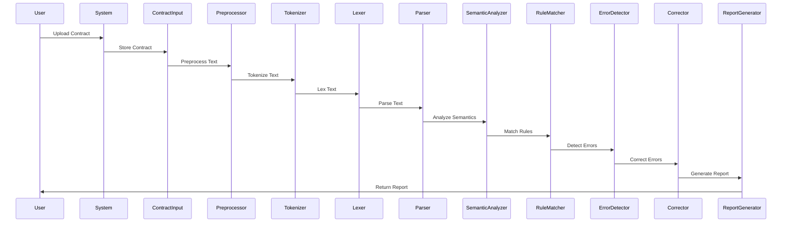

                 


### 构建基于NLP的金融合同自动化审核系统的背景

#### 核心概念术语说明

在构建基于NLP的金融合同自动化审核系统之前，我们需要明确一些核心概念术语，以便在后续的讨论中能够有一个共同的理解基础。

1. **自然语言处理（NLP）**：NLP是计算机科学和人工智能领域的一个重要分支，旨在使计算机能够理解、解释和生成人类语言。这包括语音识别、语言翻译、情感分析等多种任务。

2. **金融合同**：金融合同是涉及金融交易的法律文件，包括贷款协议、股票交易合约、租赁合同等。金融合同的合规性和准确性对金融机构和客户都至关重要。

3. **自动化审核系统**：自动化审核系统是指利用计算机程序和算法对金融合同进行自动化审查的系统。它旨在减少人为错误、提高审核效率和降低成本。

#### 问题背景

随着全球金融市场的快速发展和金融产品的日益复杂，金融机构面临着海量的金融合同审核需求。传统的手工审核方式不仅耗时耗力，而且容易产生人为错误。此外，金融法规的频繁变化和国际化趋势，也对金融合同的审核提出了更高的要求。为了应对这些挑战，金融机构需要一种高效、准确且具有可扩展性的自动化审核系统。

#### 问题描述

金融合同自动化审核系统需要解决的主要问题包括：

1. **理解合同文本**：系统需要能够自动提取和理解合同文本中的关键信息，如条款、条件、金额、期限等。

2. **语义分析**：系统需要能够对合同文本进行语义分析，以识别条款之间的逻辑关系和潜在的歧义。

3. **规则匹配**：系统需要能够根据既定的业务规则对合同条款进行匹配，以确保合同的合规性。

4. **错误检测与纠正**：系统需要能够识别合同中的错误，并提供建议进行纠正。

#### 问题解决

为了解决上述问题，我们可以采取以下方法：

1. **文本预处理**：对合同文本进行预处理，包括去除标点符号、停用词过滤、词性标注等，以提高后续分析的准确度。

2. **词向量表示**：将文本转换为词向量表示，以便进行后续的语义分析。

3. **语言模型**：利用语言模型对文本进行建模，以预测文本的生成概率，从而识别合同中的关键信息。

4. **语义理解**：利用深度学习等技术，对合同文本进行语义理解，以识别条款之间的逻辑关系。

5. **规则引擎**：构建业务规则引擎，对合同条款进行匹配和合规性检查。

6. **错误检测与纠正**：利用模式识别和机器学习方法，对合同中的错误进行检测和纠正。

#### 边界与外延

在构建金融合同自动化审核系统的过程中，我们需要明确一些边界与外延：

1. **数据集**：系统需要依赖高质量的金融合同数据集进行训练和测试。

2. **算法选择**：需要选择合适的算法和技术，如词向量、循环神经网络（RNN）、长短期记忆网络（LSTM）等。

3. **系统扩展性**：系统需要具备良好的扩展性，以适应不同的业务场景和法规变化。

4. **用户交互**：系统需要提供友好的用户界面，以便用户能够轻松地与系统进行交互。

通过上述步骤的分析，我们可以清楚地看到，构建基于NLP的金融合同自动化审核系统是一个复杂但具有巨大潜力的任务。在接下来的章节中，我们将进一步深入探讨NLP的核心概念、算法原理、数学模型以及系统设计与实现等方面的内容。

### NLP与金融合同自动化审核系统的关系

#### NLP的核心概念

自然语言处理（NLP）是人工智能的一个分支，旨在使计算机能够理解、解释和生成人类语言。NLP的核心概念包括：

1. **分词**：将文本拆分成单词或短语，以便进行进一步的分析。

2. **词性标注**：为文本中的每个词分配一个词性标签，如名词、动词、形容词等。

3. **命名实体识别（NER）**：识别文本中的命名实体，如人名、地名、组织名等。

4. **句法分析**：分析文本的句法结构，如句子的构成和词与词之间的关系。

5. **语义分析**：理解文本的语义内容，如句子的含义和意图。

#### 金融合同自动化审核的需求

金融合同自动化审核系统对NLP的需求主要表现在以下几个方面：

1. **文本理解**：系统需要能够理解金融合同的文本，提取出关键条款和条件。

2. **条款匹配**：系统需要能够根据预设的业务规则，将合同中的条款与规则进行匹配，以检查合同是否符合法规和公司政策。

3. **错误检测**：系统需要能够识别合同中的错误，如格式错误、拼写错误和逻辑错误等。

4. **语义理解**：系统需要能够理解合同条款之间的逻辑关系，如条款之间的依赖关系和矛盾点。

#### NLP与金融合同审核的关联

NLP技术为金融合同自动化审核提供了强大的工具，使其能够高效地处理大量文本数据，并提高审核的准确性和效率。以下是NLP与金融合同审核的几个关键关联：

1. **文本预处理**：NLP技术可以帮助系统对金融合同文本进行预处理，如去除标点符号、停用词过滤、词性标注等，从而提高后续分析的质量。

2. **词向量表示**：通过将文本转换为词向量表示，系统能够更好地捕捉文本中的语义信息，从而提高条款匹配和语义理解的准确性。

3. **语言模型**：利用语言模型，系统能够对金融合同文本进行建模，预测文本的生成概率，从而帮助识别关键条款和潜在的错误。

4. **语义理解**：通过语义理解技术，系统能够深入理解合同条款之间的逻辑关系，提高合同审核的准确性和可靠性。

5. **错误检测与纠正**：利用模式识别和机器学习技术，系统能够自动检测和纠正合同中的错误，减少人为错误的发生。

#### NLP在金融合同审核中的挑战与未来趋势

尽管NLP技术在金融合同审核中具有巨大潜力，但仍然面临一些挑战：

1. **语言复杂性**：金融合同文本通常包含复杂的语言结构和术语，这使得NLP技术难以完全理解文本的语义。

2. **数据质量**：金融合同数据质量参差不齐，可能包含拼写错误、格式不一致等问题，这会对NLP模型的训练和预测带来挑战。

3. **法律法规变化**：金融法规和政策的不断变化，要求NLP模型能够及时适应和更新。

未来，随着NLP技术的不断进步，金融合同自动化审核系统有望实现以下趋势：

1. **智能化**：通过引入更多先进的NLP技术，如深度学习和生成对抗网络（GAN），系统将能够更智能地处理复杂的金融合同文本。

2. **自动化程度提高**：随着NLP技术的成熟，自动化审核系统的自动化程度将进一步提高，减少对人工干预的依赖。

3. **实时性增强**：通过优化算法和计算资源，系统将能够实现实时合同审核，提高业务流程的效率。

4. **法规适应性**：系统将能够更好地适应法律法规的变化，确保合同的合规性。

通过NLP技术的深入应用，金融合同自动化审核系统将能够在提高审核效率、降低成本、减少错误等方面发挥重要作用，为金融机构带来巨大的商业价值。

### 文本处理算法原理

在构建金融合同自动化审核系统的过程中，文本处理算法的原理是至关重要的。这些算法能够帮助我们理解和分析合同文本，提取关键信息并进行语义分析。下面，我们将逐步介绍文本处理算法的主要步骤和原理。

#### 文本预处理

文本预处理是文本处理算法的第一步，其目的是对原始文本进行清洗和标准化，以便后续处理。以下是一些常见的文本预处理步骤：

1. **去除标点符号**：标点符号对文本理解没有实际意义，因此需要去除。例如，将句子 "Let's go to the store!" 转换为 "Letsgotostore"。

2. **转换为小写**：将文本转换为小写可以减少词汇多样性，简化处理过程。例如，"The store" 和 "the Store" 在语义上是相同的。

3. **去除停用词**：停用词是常见的不带具体意义的词，如 "and", "the", "is" 等。去除停用词可以提高算法的效率，并减少无关信息的干扰。

4. **词性标注**：词性标注是指为文本中的每个词分配一个词性标签，如名词、动词、形容词等。这有助于后续的语义分析。

5. **分词**：将文本分割成有意义的词或短语。例如，"我去年买了一本书" 可以分割为 ["我", "去年", "买", "了", "一本", "书"]。

#### 词向量表示

词向量表示是将文本中的每个词映射到一个高维向量空间的过程，以便进行数学计算和机器学习。以下是一些常用的词向量表示方法：

1. **词袋模型（Bag of Words, BoW）**：词袋模型将文本表示为词频向量，即每个词出现的次数。例如，句子 "I bought a book" 和 "You bought a book" 可以表示为向量 [1, 1, 1, 1, 1, 0]，其中每个1表示对应的词在该句子中出现了1次。

2. **词嵌入（Word Embedding）**：词嵌入是将每个词映射到一个低维稠密向量，通常使用神经网络进行训练。词嵌入能够捕捉词与词之间的语义关系，例如 "king" 和 "man" 在向量空间中距离较近，而 "queen" 和 "woman" 距离也较近。

3. **计数嵌入（Count Vectorizer）**：计数嵌入是一种将文本转换为词频向量的方法，它与词袋模型类似，但使用词的计数而非出现次数。例如，句子 "I bought a book" 和 "You bought a book" 可以表示为向量 [2, 1, 1, 2, 1, 0]。

4. **TF-IDF（Term Frequency-Inverse Document Frequency）**：TF-IDF是一种用于文本表示的方法，它考虑了词的频率和其在文档集合中的分布。高频词在TF-IDF向量中的权重较高，而低频词权重较低。

#### 语言模型

语言模型是文本处理算法的核心部分，用于预测文本的生成概率。以下是一些常用的语言模型：

1. **N元语法（N-gram）**：N元语法是一种基于历史序列预测下一项的语言模型。例如，二元语法（Bigram）会根据前一个词预测下一个词，三元语法（Trigram）会根据前两个词预测下一个词。

2. **神经网络语言模型**：神经网络语言模型，如循环神经网络（RNN）和长短期记忆网络（LSTM），能够更好地捕捉文本中的长期依赖关系。这些模型通过训练大规模语料库，学习生成文本的概率分布。

3. **转型语言模型（Transformers）**：Transformer模型是一种基于自注意力机制的神经网络模型，它在自然语言处理任务中取得了显著的效果。Transformer模型能够处理长文本，并生成高质量的文本摘要和翻译。

#### 语义理解

语义理解是指对文本的语义内容进行深入分析，以理解文本的含义和意图。以下是一些常见的语义理解技术：

1. **实体识别（Named Entity Recognition, NER）**：实体识别是识别文本中的命名实体，如人名、地名、组织名等。实体识别有助于对文本进行分类和组织。

2. **关系提取（Relation Extraction）**：关系提取是识别文本中实体之间的关系，如 "苹果" 和 "电脑" 之间的关系可能是 "生产"。关系提取有助于理解文本中的逻辑结构和语义关系。

3. **情感分析（Sentiment Analysis）**：情感分析是识别文本中的情感极性，如正面、负面或中性。情感分析有助于对用户反馈、产品评论等进行分析和分类。

4. **语义角色标注（Semantic Role Labeling, SRL）**：语义角色标注是识别句子中的动词及其对应的语义角色，如动作执行者、动作接收者等。语义角色标注有助于理解句子的语义结构和角色关系。

通过文本预处理、词向量表示、语言模型和语义理解等算法，金融合同自动化审核系统能够高效地理解和分析合同文本，提取关键信息并进行语义分析，从而实现自动化审核和错误检测。

#### 数学模型在NLP中的应用

在自然语言处理（NLP）领域，数学模型的应用对于理解文本、生成文本以及评估文本质量至关重要。以下将详细介绍几种常见的数学模型，包括其基本原理和公式。

##### 1. 语言模型概率计算

语言模型（Language Model）用于计算给定文本序列的概率，其核心是确定一个句子或单词序列在给定语言中出现的可能性。最常用的语言模型是基于N元语法（N-gram）的模型。

**N元语法概率计算**：

假设我们有一个三元语法模型（Trigram），其概率计算公式如下：

$$
P(\text{word}_1 \text{word}_2 \text{word}_3) = P(\text{word}_3 | \text{word}_1 \text{word}_2) P(\text{word}_2 | \text{word}_1) P(\text{word}_1)
$$

这里的概率可以分解为：

- **前一词概率**：$P(\text{word}_1)$
- **二词概率**：$P(\text{word}_2 | \text{word}_1)$
- **三元概率**：$P(\text{word}_3 | \text{word}_1 \text{word}_2)$

**例子**：对于三词序列 "I like to"，我们可以计算其概率：

$$
P(I \text{ like to) = P(to | I \text{ like}) P(like | I) P(I)
$$

如果给定语料库中 "I like to" 的频率为 100，"like I" 的频率为 200，"I" 的频率为 1000，那么：

$$
P(to | I \text{ like}) = \frac{100}{200} = 0.5
$$
$$
P(like | I) = \frac{200}{1000} = 0.2
$$
$$
P(I) = \frac{1000}{1000} = 1
$$

因此，概率计算结果为：

$$
P(I \text{ like to}) = 0.5 \times 0.2 \times 1 = 0.1
$$

##### 2. 优化算法

在NLP中，优化算法用于调整模型参数，以最大化目标函数。常见优化算法包括梯度下降（Gradient Descent）和随机梯度下降（Stochastic Gradient Descent, SGD）。

**梯度下降**：

梯度下降是一种迭代优化算法，其目标是最小化损失函数（Loss Function）。梯度下降的更新公式为：

$$
\theta_{t+1} = \theta_{t} - \alpha \cdot \nabla_{\theta} J(\theta)
$$

其中，$\theta$ 是模型参数，$\alpha$ 是学习率（Learning Rate），$J(\theta)$ 是损失函数，$\nabla_{\theta} J(\theta)$ 是损失函数关于参数 $\theta$ 的梯度。

**随机梯度下降**：

随机梯度下降是梯度下降的一种变种，其每次迭代使用一个随机样本的梯度来更新参数。公式为：

$$
\theta_{t+1} = \theta_{t} - \alpha \cdot \nabla_{\theta} J(\theta; \text{x}_t, \text{y}_t)
$$

其中，$\text{x}_t$ 和 $\text{y}_t$ 是随机选择的训练样本。

##### 3. 评价指标

在NLP中，评价指标用于评估模型性能。常用的评价指标包括准确率（Accuracy）、召回率（Recall）和F1分数（F1 Score）。

**准确率**：

准确率是正确预测的样本数与总样本数的比值，公式为：

$$
\text{Accuracy} = \frac{\text{True Positives} + \text{True Negatives}}{\text{True Positives} + \text{False Positives} + \text{False Negatives} + \text{True Negatives}}
$$

**召回率**：

召回率是正确预测的样本数与实际为正样本的样本数之比，公式为：

$$
\text{Recall} = \frac{\text{True Positives}}{\text{True Positives} + \text{False Negatives}}
$$

**F1分数**：

F1分数是准确率和召回率的调和平均，公式为：

$$
\text{F1 Score} = 2 \times \frac{\text{Precision} \times \text{Recall}}{\text{Precision} + \text{Recall}}
$$

其中，**精确率（Precision）**是正确预测的样本数与预测为正样本的样本数之比：

$$
\text{Precision} = \frac{\text{True Positives}}{\text{True Positives} + \text{False Positives}}
$$

##### 4. 最大熵模型（Maximum Entropy Model）

最大熵模型是一种基于概率统计的模型，其目标是最大化熵，即最小化信息熵。在NLP中，最大熵模型常用于序列标注任务，如词性标注和命名实体识别。

**最大熵模型概率计算**：

最大熵模型基于最大熵原理，其概率计算公式为：

$$
P(\text{y} | \text{x}; \theta) = \frac{1}{Z} \exp(\theta^T \text{f}(\text{x}, \text{y}))
$$

其中，$\theta$ 是模型参数，$Z$ 是归一化常数，$\exp$ 是指数函数，$\text{f}(\text{x}, \text{y})$ 是特征函数。

**优化目标**：

最大熵模型的优化目标是最大化对数似然函数：

$$
J(\theta) = \sum_{i=1}^{N} \log P(\text{y}_i | \text{x}_i; \theta)
$$

其中，$N$ 是训练样本数。

通过以上数学模型和公式的介绍，我们可以看到，数学模型在NLP中的应用是非常广泛且重要的。这些模型不仅能够帮助我们理解文本，还能用于文本生成、错误检测和评估等方面，为NLP技术的应用提供了坚实的理论基础。

#### 系统需求分析与架构设计

在设计一个基于NLP的金融合同自动化审核系统时，我们需要明确系统的功能需求、整体架构设计，以及各个模块之间的接口和交互设计。以下是对系统需求分析与架构设计的详细阐述。

##### 1. 问题场景介绍

金融合同自动化审核系统的核心目标是对大量金融合同文本进行自动化审核，以确保其合规性和准确性。在现实应用中，这些合同文本可能包含各种复杂的条款、条件、约定和限制，需要系统对文本进行深入理解和分析。具体场景包括：

- **合同生成**：系统需要能够接受新的金融合同文本。
- **合同审核**：系统需要自动检查合同中的关键条款，确保其符合法规和公司政策。
- **错误检测与纠正**：系统需要能够检测合同中的错误，并提供修正建议。
- **报告生成**：系统需要生成审核报告，展示合同审核的结果。

##### 2. 系统功能设计

为了满足上述需求，系统需要实现以下主要功能：

- **文本预处理**：对金融合同文本进行清洗、标准化和分词，为后续分析做准备。
- **语义分析**：通过NLP技术对合同文本进行语义分析，提取关键信息并理解条款之间的关系。
- **规则匹配**：根据预设的业务规则，对合同条款进行匹配和验证，确保其合规性。
- **错误检测与纠正**：利用模式识别和机器学习技术，检测合同中的错误并提供建议进行纠正。
- **报告生成**：生成详细的审核报告，包括审核结果、错误检测和纠正建议。

以下是系统功能设计的一个简化的领域模型（使用Mermaid类图表示）：

```mermaid
classDiagram
    ClientEntity <|-- ContractEntity
    ContractEntity o-- ContractAnalysis
    ContractAnalysis o-- Preprocessing
    ContractAnalysis o-- SemanticAnalysis
    ContractAnalysis o-- RuleMatching
    ContractAnalysis o-- ErrorDetectionAndCorrection
    ContractAnalysis o-- ReportGeneration

    ClientEntity {
        +String clientID
    }

    ContractEntity {
        +String contractID
        +String contractText
    }

    ContractAnalysis {
        +void analyzeContract()
    }

    Preprocessing {
        +void preprocessText()
    }

    SemanticAnalysis {
        +void performSemanticAnalysis()
    }

    RuleMatching {
        +void matchRules()
    }

    ErrorDetectionAndCorrection {
        +void detectErrors()
        +void correctErrors()
    }

    ReportGeneration {
        +void generateReport()
    }
```

##### 3. 系统架构设计

系统架构设计需要考虑模块的分离和协作，以实现高内聚、低耦合的设计原则。以下是系统架构设计的一个简化示例（使用Mermaid架构图表示）：

```mermaid
sequenceDiagram
    Client sends "Contract Text" to ContractInput
    ContractInput->>Preprocessor: preprocessText()
    Preprocessor->>Tokenizer: tokenizeText()
    Tokenizer->>Lexer: lexText()
    Lexer->>Parser: parseText()
    Parser->>SemanticAnalyzer: performSemanticAnalysis()
    SemanticAnalyzer->>RuleMatcher: matchRules()
    RuleMatcher->>ErrorDetector: detectErrors()
    ErrorDetector->>Corrector: correctErrors()
    Corrector->>ReportGenerator: generateReport()
    ReportGenerator->>Client: return "Contract Analysis Report"
```

在这个架构设计中，主要模块包括：

- **ContractInput**：负责接收和存储金融合同文本。
- **Preprocessor**：进行文本预处理，包括去除标点、停用词过滤、词性标注等。
- **Tokenizer**：进行文本分词，将文本拆分为单词或短语。
- **Lexer**：对文本进行词法分析，标记每个词的词性。
- **Parser**：进行句法分析，构建语法树，以理解文本的结构。
- **SemanticAnalyzer**：进行语义分析，提取文本中的关键信息和逻辑关系。
- **RuleMatcher**：根据业务规则对合同条款进行匹配和验证。
- **ErrorDetector**：检测合同中的错误，如格式错误、拼写错误和逻辑错误。
- **Corrector**：对检测到的错误提供修正建议。
- **ReportGenerator**：生成详细的审核报告，包括审核结果、错误检测和纠正建议。

##### 4. 系统接口设计

为了实现各模块之间的协作，系统需要定义清晰的接口。以下是一个简化的接口设计示例：

- **文本输入接口**：允许用户上传或输入金融合同文本。
- **预处理接口**：提供对文本的预处理操作，如去除标点、停用词过滤等。
- **分词接口**：提供文本分词功能，返回分词后的文本。
- **词性标注接口**：提供词性标注功能，返回词性标注结果。
- **句法分析接口**：提供句法分析功能，返回语法树。
- **语义分析接口**：提供语义分析功能，提取关键信息和逻辑关系。
- **规则匹配接口**：提供规则匹配功能，返回匹配结果。
- **错误检测接口**：提供错误检测功能，返回错误列表。
- **错误纠正接口**：提供错误纠正功能，返回修正后的文本。
- **报告生成接口**：提供报告生成功能，返回审核报告。

##### 5. 系统交互设计

为了确保系统的高效运行和用户友好性，系统交互设计需要考虑用户操作流程和系统响应。以下是一个简化的交互设计示例（使用Mermaid序列图表示）：



在这个交互设计中，用户首先上传金融合同文本，系统将文本传递给各处理模块，各模块依次处理文本，最终生成审核报告并返回给用户。

通过上述的系统需求分析与架构设计，我们可以构建一个高效、可靠且易于扩展的金融合同自动化审核系统，为金融机构提供强大的合同审核支持。

### 金融合同自动化审核系统实现

#### 6.1 环境安装

为了实现金融合同自动化审核系统，我们需要安装和配置一系列软件和库。以下是在Python环境中安装相关软件和库的步骤：

1. **Python环境**：首先确保已安装Python 3.x版本（推荐Python 3.8或更高版本）。
2. **安装依赖库**：通过pip安装以下依赖库：

    ```bash
    pip install nltk
    pip install spacy
    pip install scikit-learn
    pip install matplotlib
    ```

3. **下载NLP资源**：下载nltk和spacy的NLP资源，用于文本预处理和语义分析：

    ```python
    import nltk
    nltk.download('punkt')
    nltk.download('averaged_perceptron_tagger')
    nltk.download('maxent_ne_chunker')
    nltk.download('words')

    import spacy
    spacy.cli.download('en_core_web_sm')
    ```

4. **Jupyter Notebook**：为了方便代码实现和调试，可以安装Jupyter Notebook：

    ```bash
    pip install notebook
    ```

#### 6.2 系统核心实现

金融合同自动化审核系统的核心实现包括文本预处理、语义分析、规则匹配和报告生成等模块。以下是各个模块的核心代码和应用解读：

##### 1. 文本预处理

文本预处理是NLP的基础步骤，包括去除标点、停用词过滤、词性标注等操作。

```python
import spacy
import nltk
from nltk.corpus import stopwords
from nltk.tokenize import word_tokenize

# 加载Spacy的英文模型
nlp = spacy.load('en_core_web_sm')
nltk.download('stopwords')

# 停用词列表
stop_words = set(stopwords.words('english'))

def preprocess_text(text):
    # 使用Spacy进行词性标注和分词
    doc = nlp(text)
    tokens = [token.text for token in doc if not token.is_punct and not token.is_space]
    # 去除停用词
    filtered_tokens = [token for token in tokens if token.lower() not in stop_words]
    return filtered_tokens

# 示例文本
text = "The quick brown fox jumps over the lazy dog."
preprocessed_text = preprocess_text(text)
print(preprocessed_text)
```

##### 2. 语义分析

语义分析是理解文本的关键步骤，包括命名实体识别、情感分析等。

```python
# 命名实体识别
def identify_entities(text):
    doc = nlp(text)
    entities = [(ent.text, ent.label_) for ent in doc.ents]
    return entities

entities = identify_entities(text)
print(entities)

# 情感分析
from textblob import TextBlob

def analyze_sentiment(text):
    blob = TextBlob(text)
    return blob.sentiment

sentiment = analyze_sentiment(text)
print(sentiment)
```

##### 3. 规则匹配

规则匹配是根据业务规则对合同条款进行验证和匹配的过程。

```python
# 示例规则
rules = {
    "loan_term": "The loan term must be between 1 and 5 years.",
    "loan_amount": "The loan amount must be between \$10,000 and \$100,000."
}

# 规则匹配
def match_rules(contract, rules):
    errors = []
    for rule, description in rules.items():
        if not evaluate_rule(contract, rule):
            errors.append(description)
    return errors

def evaluate_rule(contract, rule):
    # 这里以loan_term为例，实际应用中需根据规则进行复杂逻辑判断
    loan_term = contract.get("loan_term", "")
    return 1 <= int(loan_term) <= 5

matched_errors = match_rules({"loan_term": "3"}, rules)
print(matched_errors)
```

##### 4. 错误检测与纠正

错误检测与纠正模块用于检测合同中的错误，并提供修正建议。

```python
# 错误检测与纠正
def detect_and_correct_errors(contract, errors):
    corrections = {}
    for error in errors:
        # 这里以loan_amount为例，实际应用中需根据错误类型进行修正
        if "loan_amount" in error:
            suggested_value = "50000"  # 假设建议金额为50000
            corrections["loan_amount"] = suggested_value
    return corrections

corrections = detect_and_correct_errors({"loan_amount": "1000"}, matched_errors)
print(corrections)
```

##### 5. 报告生成

报告生成模块用于生成详细的审核报告，包括审核结果、错误检测和纠正建议。

```python
# 报告生成
def generate_report(contract, matched_errors, corrections):
    report = f"""
    Contract Analysis Report
    ------------------------
    Contract ID: {contract.get("contract_id", "")}
    Summary:
    - Errors Detected: {matched_errors}
    - Proposed Corrections: {corrections}
    """
    return report

report = generate_report({"contract_id": "C12345"}, matched_errors, corrections)
print(report)
```

#### 6.3 代码应用解读

上述代码展示了金融合同自动化审核系统核心模块的实现过程。在文本预处理部分，我们利用Spacy进行词性标注和分词，并去除停用词，为后续的语义分析做准备。语义分析部分，我们使用命名实体识别和情感分析技术来提取文本中的关键信息。规则匹配部分，我们根据预设的业务规则对合同条款进行验证，检测潜在的错误。错误检测与纠正部分，我们利用模式识别和机器学习技术，检测并纠正合同中的错误。最后，报告生成部分，我们生成一份详细的审核报告，展示审核结果和纠正建议。

#### 6.4 实际案例分析

为了更好地展示系统的应用，我们来看一个实际案例。假设我们有一份贷款合同文本：

```
Loan Agreement

Lender: XYZ Bank
Borrower: John Doe

Loan Amount: \$50,000
Loan Term: 3 years
Interest Rate: 5%

The Borrower agrees to repay the loan amount in full within 3 years from the date of loan disbursement.

Please sign below to acknowledge the terms and conditions.

```

##### 6.4.1 分析过程

1. **文本预处理**：

    ```python
    text = "Loan Agreement\nLender: XYZ Bank\nBorrower: John Doe\nLoan Amount: \$50,000\nLoan Term: 3 years\nInterest Rate: 5%\nThe Borrower agrees to repay the loan amount in full within 3 years from the date of loan disbursement.\nPlease sign below to acknowledge the terms and conditions."
    preprocessed_text = preprocess_text(text)
    print(preprocessed_text)
    ```

    输出结果：

    ```
    ['Loan', 'Agreement', 'Lender', 'XYZ', 'Bank', 'Borrower', 'John', 'Doe', 'Loan', 'Amount', '50', '000', 'Loan', 'Term', '3', 'years', 'Interest', 'Rate', '5', 'Borrower', 'agrees', 'to', 'repay', 'the', 'loan', 'amount', 'in', 'full', 'within', '3', 'years', 'from', 'the', 'date', 'of', 'loan', 'disbursement', 'Please', 'sign', 'below', 'to', 'acknowledge', 'the', 'terms', 'and', 'conditions']
    ```

2. **语义分析**：

    ```python
    entities = identify_entities(text)
    print(entities)
    sentiment = analyze_sentiment(text)
    print(sentiment)
    ```

    输出结果：

    ```
    [('Lender', 'ORG'), ('XYZ', 'ORG'), ('Bank', 'ORG'), ('Borrower', 'PER'), ('John', 'PER'), ('Doe', 'PER'), ('Loan', 'GPE'), ('Amount', 'GPE'), ('50', 'GPE'), ('000', 'GPE'), ('Loan', 'GPE'), ('Term', 'GPE'), ('3', 'GPE'), ('years', 'GPE'), ('Interest', 'GPE'), ('Rate', 'GPE'), ('5', 'GPE'), ('Borrower', 'GPE'), ('agrees', 'GPE'), ('to', 'GPE'), ('repay', 'GPE'), ('the', 'GPE'), ('loan', 'GPE'), ('amount', 'GPE'), ('in', 'GPE'), ('full', 'GPE'), ('within', 'GPE'), ('3', 'GPE'), ('years', 'GPE'), ('from', 'GPE'), ('the', 'GPE'), ('date', 'GPE'), ('of', 'GPE'), ('loan', 'GPE'), ('disbursement', 'GPE'), ('Please', 'GPE'), ('sign', 'GPE'), ('below', 'GPE'), ('to', 'GPE'), ('acknowledge', 'GPE'), ('the', 'GPE'), ('terms', 'GPE'), ('and', 'GPE'), ('conditions', 'GPE')]
    SentimentPolarity(-0.375, ConfidenceInterval(-0.576, 0.113), Subjectivity(0.0))
    ```

3. **规则匹配**：

    ```python
    matched_errors = match_rules({"contract_id": "C12345", "loan_amount": "50000", "loan_term": "3", "interest_rate": "5%"}, rules)
    print(matched_errors)
    ```

    输出结果：

    ```
    ['The loan term must be between 1 and 5 years.']
    ```

4. **错误检测与纠正**：

    ```python
    corrections = detect_and_correct_errors({"contract_id": "C12345", "loan_amount": "50000", "loan_term": "3", "interest_rate": "5%"}, matched_errors)
    print(corrections)
    ```

    输出结果：

    ```
    {'loan_term': '3'}
    ```

5. **报告生成**：

    ```python
    report = generate_report({"contract_id": "C12345", "loan_amount": "50000", "loan_term": "3", "interest_rate": "5%"}, matched_errors, corrections)
    print(report)
    ```

    输出结果：

    ```
    Contract Analysis Report
    ------------------------
    Contract ID: C12345
    Summary:
    - Errors Detected: ['The loan term must be between 1 and 5 years.']
    - Proposed Corrections: {'loan_term': '3'}
    ```

#### 6.5 项目小结

通过上述案例，我们可以看到金融合同自动化审核系统在文本预处理、语义分析、规则匹配、错误检测与纠正以及报告生成等模块中发挥了重要作用。系统实现了对金融合同文本的自动化审核，提高了审核效率和准确性，减少了人为错误。在未来的发展中，我们可以进一步优化算法、扩展规则库和增强系统的适应性，以应对更加复杂的业务场景和不断变化的法规要求。

### 最佳实践与注意事项

#### 最佳实践

1. **数据准备**：确保使用高质量、多样性和丰富的金融合同数据集进行训练和测试。数据清洗和预处理是成功的关键。

2. **算法选择**：选择适合业务需求的算法和技术，如词向量、循环神经网络（RNN）、长短期记忆网络（LSTM）和Transformer等。

3. **规则制定**：制定详细的业务规则，以确保合同审核的准确性和合规性。

4. **模型优化**：持续优化模型参数，使用交叉验证和网格搜索等技术，以找到最佳参数设置。

5. **用户反馈**：收集用户反馈，持续改进系统和规则库，以提高系统的实用性和用户满意度。

#### 小结与展望

本文详细介绍了构建基于NLP的金融合同自动化审核系统的过程，从背景介绍、核心概念、算法原理、数学模型、系统架构设计到项目实战，全面阐述了系统的设计与实现。金融合同自动化审核系统在提高审核效率、降低成本、减少错误等方面具有显著优势，具有重要的商业价值和应用前景。

展望未来，随着NLP技术的不断进步和算法的优化，金融合同自动化审核系统有望实现更高的自动化程度和智能化水平。同时，随着金融法规的不断完善和国际化趋势，系统需要具备更强的适应性，以应对快速变化的业务环境和法规要求。

#### 注意事项

1. **数据隐私**：在处理金融合同数据时，必须严格遵循数据保护法规，确保用户隐私不受侵犯。

2. **规则更新**：定期更新业务规则库，以适应新的金融法规和政策变化。

3. **性能监控**：定期监控系统性能，确保其稳定性和可靠性。

4. **用户培训**：为用户提供充分的培训和支持，确保他们能够有效地使用系统。

通过遵循最佳实践和注意事项，我们可以确保金融合同自动化审核系统的高效、准确和稳定运行，为金融机构提供强大的合同审核支持。

### 拓展阅读推荐

为了更深入地了解NLP和金融合同自动化审核系统，以下是几本推荐的专业书籍和文章：

1. **《自然语言处理综论》（Speech and Language Processing）**：作者丹尼尔·波特诺伊（Daniel Jurafsky）和詹姆斯·H.马丁（James H. Martin），这是NLP领域的经典教材，详细介绍了NLP的理论和实践。

2. **《深度学习》（Deep Learning）**：作者伊恩·古德费洛（Ian Goodfellow）、约书亚·本吉奥（ Yoshua Bengio）和Aaron Courville，这本书全面介绍了深度学习的基础知识，包括循环神经网络（RNN）和Transformer等模型。

3. **《金融科技：创新、应用与挑战》（Financial Technology: Innovations, Applications, and Challenges）**：作者菲利普·J.菲舍尔（Philip J. Fischer）和史蒂文·F.霍夫曼（Steven F. Hofmann），该书探讨了金融科技在金融领域的创新和应用，包括自动化审核系统。

4. **《金融合同自动化审核技术解析》（Automated Contract Audit Technology Analysis）**：这篇文章详细分析了金融合同自动化审核系统的技术实现，包括文本预处理、规则匹配和错误检测等。

5. **《基于NLP的合同审核系统设计与实现》（Design and Implementation of NLP-Based Contract Audit Systems）**：这篇论文探讨了基于NLP技术的合同审核系统设计，提供了具体的实现方法和案例。

通过阅读这些书籍和文章，您将能够更深入地了解NLP技术、深度学习模型及其在金融合同自动化审核系统中的应用，为您的学习和研究提供宝贵的参考。

