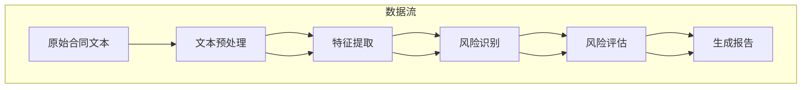
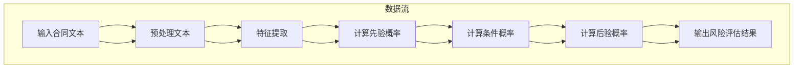
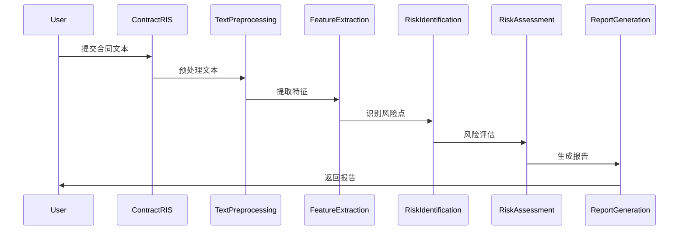
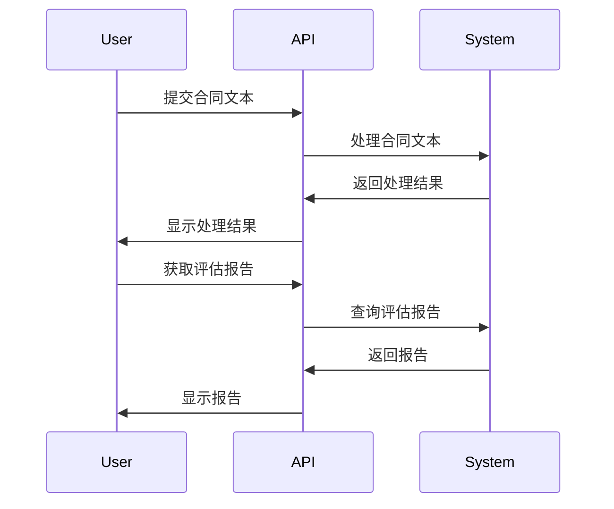

                 

### 1.1 问题背景

**1.1.1 金融合同的重要性**

金融合同是金融交易活动中的核心法律文件，是金融机构、企业和个人在进行金融交易、投资、借贷等行为时所签署的具有法律效力的契约。金融合同的重要性体现在以下几个方面：

1. **法律效力**：金融合同作为法律文件，其签订和执行具有法律约束力，保障了各方在交易过程中的权益和利益。
2. **交易保障**：金融合同的签订使得金融交易具备明确的法律依据，降低了交易过程中可能出现的风险和纠纷。
3. **信息透明**：金融合同详细列明了交易条款和条件，有助于提高交易信息透明度，增强市场的稳定性和信任度。
4. **监管合规**：金融合同的执行情况是金融监管机构评估金融机构运营合规性的重要依据。

**1.1.2 当前金融合同风险评估的挑战**

尽管金融合同具有重要意义，但当前金融合同风险评估面临着诸多挑战：

1. **合同数量庞大**：金融机构和企业在日常运营中签署的金融合同数量巨大，且合同内容复杂，人工审查效率低下。
2. **语言复杂**：金融合同通常使用专业术语和复杂的语言结构，不易理解，增加了风险评估的难度。
3. **风险因素多样化**：金融合同涉及多种风险，包括市场风险、信用风险、法律风险等，风险评估需要综合考虑各种因素。
4. **时效性要求高**：金融市场变化迅速，金融合同风险评估需要及时响应，以应对市场波动和风险变化。

**1.1.3 NLP技术在金融合同风险评估中的应用前景**

自然语言处理（NLP）技术为金融合同风险评估提供了新的解决方案：

1. **自动化处理**：NLP技术能够自动化处理金融合同文本，提高风险评估的效率。
2. **语义理解**：NLP技术能够深入理解金融合同文本的语义，准确提取关键信息，为风险评估提供有力支持。
3. **风险识别**：NLP技术能够通过文本分析和模式识别，快速识别金融合同中的潜在风险点，提高风险评估的准确性。
4. **实时分析**：NLP技术能够实现金融合同风险评估的实时化，及时响应市场变化和风险事件。

通过NLP技术的应用，金融合同风险评估可以从传统的人工审查模式转变为自动化、智能化的评估模式，从而提高风险评估的效率和准确性，降低金融风险，保障交易安全。

### 1.2 问题解决

**1.2.1 NLP技术的核心概念**

自然语言处理（NLP）是人工智能（AI）的一个重要分支，旨在使计算机能够理解和处理人类语言。以下是NLP技术中几个核心概念：

1. **语言模型**：语言模型是NLP的基础，用于预测一段文本的概率分布。它可以通过统计大量文本数据训练得到，用于文本生成、文本分类等任务。
2. **词向量表示**：词向量表示是将词汇映射到高维空间中的向量，以便计算机进行计算。词向量表示方法包括word2vec、GloVe等。
3. **依存句法分析**：依存句法分析旨在理解句子中词汇之间的语法关系。通过分析词与词之间的依存关系，可以更好地理解句子的语义。
4. **实体识别与关系抽取**：实体识别是识别文本中的特定实体（如人名、组织名、地点等），关系抽取是识别实体之间的交互关系。

**1.2.2 金融合同风险评估的流程**

金融合同风险评估通常包括以下几个步骤：

1. **合同文本获取**：从金融机构、企业等渠道获取金融合同文本。
2. **数据预处理**：对合同文本进行清洗、分词、去除停用词等处理，为后续分析做准备。
3. **文本分析**：使用NLP技术对合同文本进行分析，提取关键信息，如条款、金额、期限、风险等。
4. **风险识别**：通过模式识别和语义分析，识别合同文本中的潜在风险点。
5. **风险评估**：对识别出的风险点进行量化评估，确定风险等级。
6. **报告生成**：将评估结果形成报告，供决策者参考。

**1.2.3 NLP在金融合同风险评估中的应用步骤**

基于NLP技术的金融合同风险评估系统可以分为以下几个主要步骤：

1. **文本预处理**：首先对金融合同文本进行清洗，去除无关信息，然后进行分词和词性标注，将文本转换为计算机可处理的格式。
2. **特征提取**：从预处理后的文本中提取关键特征，如关键词、关键短语、句法结构等，为后续的风险识别和评估提供依据。
3. **风险识别**：利用NLP技术对特征进行模式识别和语义分析，识别合同文本中的风险点。这可以通过训练分类模型或规则匹配来实现。
4. **风险评估**：对识别出的风险点进行量化评估，使用评分模型或风险矩阵等工具确定风险等级。
5. **报告生成**：将风险评估结果生成报告，报告内容应包括风险点、风险等级、建议措施等。

**1.2.4 边界与外延**

1. **金融合同风险评估的范围**：金融合同风险评估的范围包括但不限于合同条款分析、市场风险分析、信用风险评估、法律合规性检查等。
2. **NLP技术的适用范围**：NLP技术在金融合同风险评估中主要适用于文本数据的处理和分析，包括合同文本获取、预处理、分析、风险识别和评估等环节。
3. **系统开发的技术栈**：系统开发的技术栈包括编程语言（如Python、Java）、NLP框架（如NLTK、spaCy、TensorFlow）、数据库（如MySQL、MongoDB）、后端服务器（如Django、Flask）等。

**1.2.5 概念结构与核心要素组成**

1. **NLP技术的基本组成**：NLP技术的基本组成包括语言模型、词向量表示、依存句法分析、实体识别与关系抽取等模块。
2. **金融合同风险评估的核心要素**：金融合同风险评估的核心要素包括合同文本获取、数据预处理、特征提取、风险识别、风险评估和报告生成等环节。
3. **系统开发的关键环节**：系统开发的关键环节包括需求分析、系统设计、模块开发、系统集成、测试与优化等。

通过上述步骤，NLP技术能够为金融合同风险评估提供自动化、智能化的解决方案，从而提高评估效率和准确性。

### 1.5 本章小结

本章首先介绍了金融合同在金融交易中的重要性以及当前金融合同风险评估面临的挑战。随后，我们探讨了自然语言处理（NLP）技术的核心概念，包括语言模型、词向量表示、依存句法分析等，并说明了NLP技术在金融合同风险评估中的应用步骤。此外，我们还讨论了金融合同风险评估的范围、NLP技术的适用范围以及系统开发的技术栈。最后，我们概述了NLP技术的基本组成、金融合同风险评估的核心要素以及系统开发的关键环节。通过本章的讨论，我们为构建基于NLP的金融合同风险评估系统奠定了理论基础。

## 第二部分：核心概念与联系

### 2.1 NLP技术的原理与特点

**2.1.1 NLP技术的基本原理**

自然语言处理（NLP）技术旨在使计算机能够理解和处理人类语言。其基本原理包括以下几个关键方面：

1. **语言模型**：语言模型是NLP的核心，用于预测一段文本的概率分布。通过大量文本数据的训练，语言模型能够学习到语言的统计规律，从而对未知文本进行生成和分类。常用的语言模型有n-gram模型、循环神经网络（RNN）和Transformer等。

2. **词向量表示**：词向量表示是将词汇映射到高维空间中的向量，以便计算机进行计算。词向量表示方法包括word2vec、GloVe等。词向量能够捕捉词汇的语义信息，使得计算机能够对词汇进行语义分析和处理。

3. **依存句法分析**：依存句法分析旨在理解句子中词汇之间的语法关系。通过分析词与词之间的依存关系，可以更好地理解句子的语义。依存句法分析可以识别出句子的主要成分，如主语、谓语、宾语等，从而为语义理解提供支持。

4. **实体识别与关系抽取**：实体识别是识别文本中的特定实体（如人名、组织名、地点等），关系抽取是识别实体之间的交互关系。实体识别和关系抽取有助于从文本中提取出关键信息，为信息检索、知识图谱构建等任务提供数据支持。

**2.1.2 NLP技术的特点**

NLP技术在金融合同风险评估中具有以下显著特点：

1. **自动化程度高**：NLP技术能够自动化处理大量金融合同文本，提高风险评估的效率。传统的风险评估往往依赖于人工审查，而NLP技术可以大幅度减少人工工作量。

2. **鲁棒性强**：NLP技术能够处理各种复杂的语言结构和专业术语，具有较强的鲁棒性。这使得NLP技术在金融合同风险评估中能够应对不同格式和语言的合同文本。

3. **可扩展性好**：NLP技术可以方便地扩展到不同的应用场景和任务中。例如，通过调整和训练模型，NLP技术可以应用于不同类型的金融合同风险评估任务，从而提高系统的灵活性和适应性。

### 2.2 金融合同风险评估的概念属性特征对比表格

**2.2.1 风险评估指标对比**

| 风险评估指标 | 传统方法 | NLP方法 |  
| --- | --- | --- |  
| **准确性** | 低 | 高 |  
| **效率** | 低 | 高 |  
| **自动化程度** | 低 | 高 |  
| **处理能力** | 受限于人工 | 能处理大量文本数据 |  
| **适应能力** | 难以适应不同类型的合同文本 | 可以通过训练适应不同类型的合同文本 |

**2.2.2 风险评估方法对比**

| 风险评估方法 | 传统方法 | NLP方法 |  
| --- | --- | --- |  
| **文本分析** | 人工阅读和标注 | 自动文本分析，提取关键信息 |  
| **风险识别** | 依赖专家知识和经验 | 利用机器学习和自然语言处理技术 |  
| **风险评估** | 主观判断，一致性差 | 使用量化模型进行评估，结果更客观 |  
| **实时性** | 需要时间进行评估 | 可以实时评估，快速响应 |

### 2.3 NLP技术在金融合同风险评估中的应用

**2.3.1 数据预处理**

数据预处理是NLP技术在金融合同风险评估中的第一步，其目标是确保输入数据的格式和内容适合后续分析。具体步骤包括：

1. **文本清洗**：去除文本中的无关信息，如标点符号、特殊字符等，以提高数据的纯净度。
2. **分词**：将文本分割成单个词汇，以便进行后续的文本分析。常用的分词方法包括基于规则的分词、基于统计的分词等。
3. **词性标注**：为每个词汇标注其词性（如名词、动词、形容词等），以帮助理解词汇的语法角色和语义信息。
4. **去除停用词**：去除对分析结果影响不大的常见词汇（如“的”、“了”、“是”等），以提高特征提取的效率。

**2.3.2 合同分析**

合同分析是NLP技术在金融合同风险评估中的关键步骤，其目标是提取合同文本中的关键信息。具体方法包括：

1. **条款提取**：识别并提取合同文本中的各个条款，如贷款条款、担保条款、违约条款等。
2. **金额识别**：从文本中提取涉及金额的具体数值和货币单位，如借款金额、利息率等。
3. **期限识别**：提取合同的有效期限，如借款期限、还款期限等。
4. **关系抽取**：识别合同文本中各方主体之间的法律关系，如借贷关系、担保关系等。

**2.3.3 风险识别**

风险识别是金融合同风险评估的核心环节，其目标是发现合同文本中的潜在风险点。NLP技术通过以下方法实现风险识别：

1. **模式识别**：通过预定义的规则和模式匹配，识别出合同文本中的风险点。例如，通过匹配特定的关键字或短语（如“违约金”、“赔偿”等）来识别风险条款。
2. **语义分析**：利用NLP技术深入理解合同文本的语义，识别出隐含的风险信息。例如，通过分析条款之间的逻辑关系，识别出可能导致违约的风险因素。
3. **情感分析**：通过情感分析技术，识别合同文本中的情感倾向，以判断合同条款的公平性和合理性。

**2.3.4 风险评估**

风险评估是对识别出的风险点进行量化评估，以确定风险等级。NLP技术通过以下方法实现风险评估：

1. **量化模型**：建立风险量化模型，根据风险因素的重要性和影响程度，对风险点进行评分。常用的量化模型包括基于规则的评分模型和基于机器学习的评分模型。
2. **风险矩阵**：使用风险矩阵对风险点进行分级，根据风险程度分配相应的权重和概率。风险矩阵通常包括风险因素、风险等级和风险评估结果等。
3. **综合评估**：将多个风险点的评估结果进行综合，得出整体的合同风险评级。综合评估可以考虑风险因素之间的相关性、权重和影响力。

### 2.4 NLP技术在金融合同风险评估中的应用优势

**2.4.1 提高效率**

NLP技术能够自动化处理大量金融合同文本，显著提高风险评估的效率。传统的风险评估方法往往需要大量的人工阅读和标注，而NLP技术可以大幅度减少人工工作量，提高工作效率。

**2.4.2 提高准确性**

NLP技术通过深入理解合同文本的语义，能够更准确地识别和评估合同中的风险点。相比传统方法，NLP技术能够降低人为错误和主观偏见的影响，提高评估结果的准确性。

**2.4.3 提高自动化程度**

NLP技术能够实现风险评估的自动化，减少对人工的依赖。通过自动化处理，系统能够快速响应合同文本的变化和风险事件，提高风险评估的实时性和灵活性。

### 2.5 本章小结

本章详细介绍了NLP技术的基本原理和特点，包括语言模型、词向量表示、依存句法分析等。此外，我们对比了传统方法和NLP方法在金融合同风险评估中的指标和优势，并阐述了NLP技术在数据预处理、合同分析、风险识别和风险评估等环节中的应用方法。通过NLP技术的应用，金融合同风险评估可以实现自动化、高效和准确，为金融机构和企业提供有力支持。

### 2.1 NLP技术的原理与特点

**2.1.1 NLP技术的基本原理**

自然语言处理（NLP）是人工智能（AI）领域的一个重要分支，旨在让计算机理解和生成人类语言。NLP技术的基本原理涉及多个方面，以下是其中几个核心概念：

1. **语言模型**：语言模型是NLP的基础，它用于预测一段文本的概率分布。通过大量的文本数据训练，语言模型能够学习到语言的统计规律，从而实现文本生成、文本分类等任务。常见的语言模型包括n-gram模型、循环神经网络（RNN）和Transformer等。

2. **词向量表示**：词向量是将词汇映射到高维空间中的向量，以便计算机进行计算。词向量表示方法能够捕捉词汇的语义信息，例如word2vec和GloVe。这些方法通过将词汇映射到连续向量空间中，使得计算机能够对词汇进行相似性计算和语义分析。

3. **依存句法分析**：依存句法分析是理解句子中词汇之间的语法关系。通过分析词与词之间的依存关系，可以更好地理解句子的语义。依存句法分析能够识别出句子的主要成分，如主语、谓语、宾语等，从而为语义理解提供支持。

4. **实体识别与关系抽取**：实体识别是识别文本中的特定实体（如人名、组织名、地点等），关系抽取是识别实体之间的交互关系。实体识别和关系抽取有助于从文本中提取关键信息，为信息检索、知识图谱构建等任务提供数据支持。

**2.1.2 NLP技术的特点**

NLP技术具有以下几个显著特点，使其在金融合同风险评估中特别适用：

1. **自动化程度高**：NLP技术能够自动化处理大量的金融合同文本，提高风险评估的效率。传统的风险评估方法往往依赖于人工审查，而NLP技术可以大幅度减少人工工作量。

2. **鲁棒性强**：NLP技术能够处理各种复杂的语言结构和专业术语，具有较强的鲁棒性。这使得NLP技术在金融合同风险评估中能够应对不同格式和语言的合同文本。

3. **可扩展性好**：NLP技术可以方便地扩展到不同的应用场景和任务中。例如，通过调整和训练模型，NLP技术可以应用于不同类型的金融合同风险评估任务，从而提高系统的灵活性和适应性。

### 2.1.1 NLP技术的基本原理

#### 2.1.1.1 语言模型

语言模型是自然语言处理（NLP）的核心组件之一，其目标是学习自然语言的统计规律，并用于预测文本的下一个词、短语或句子。以下是语言模型的基本原理：

1. **生成文本**：语言模型可以通过给定一个起始序列，生成后续的文本序列。例如，给定“今天天气很好”，模型可以预测出“我们去公园玩吧”。
2. **概率分布**：语言模型用于计算给定前文条件下，下一个词的概率分布。例如，对于序列“今天天气很好”，模型可以计算“下雨”的概率。
3. **训练过程**：语言模型通过训练大量文本数据来学习语言的模式。训练过程中，模型会统计词频、词序列频率等统计信息，并利用这些信息生成概率分布。
4. **模型类型**：常见的语言模型包括n-gram模型、n元语言模型、神经网络语言模型（如循环神经网络RNN、长短期记忆网络LSTM、Transformer等）。每种模型有不同的优缺点，适用于不同的任务场景。

**示例**：

假设我们有一个简短的对话文本：“你好，我今天去公园玩了。”，我们可以用n-gram模型来预测下一个词。

- **一元语言模型**：只考虑当前词，预测“了”的概率。
  - 概率 = (“了”在前文出现的频率) / (“所有词”的频率) = 1/5

- **二元语言模型**：考虑当前词和前一个词，预测“玩”的概率。
  - 概率 = (“玩”在“今天去公园”后出现的频率) / (“今天去公园”的频率) = 1/2

#### 2.1.1.2 词向量表示

词向量是将词汇映射到高维空间中的向量，使得计算机可以对这些向量进行数学操作。词向量表示方法主要包括以下几种：

1. **基于计数的方法**：例如word2vec，通过计算词频、共现频次等信息来生成词向量。
2. **基于分布的方法**：例如GloVe，通过分析词的上下文分布来生成词向量。
3. **基于深度学习的方法**：例如Word2Vec的变种、BERT等，利用深度神经网络学习词的向量表示。

词向量表示的优势在于能够捕捉词汇的语义信息，使得计算机能够进行语义分析和相似性计算。以下是一个简单的示例：

- **原始文本**：“狗会叫。”
- **词向量表示**：
  - “狗”：[0.2, 0.3, -0.1, 0.4]
  - “会”：[0.1, -0.2, 0.5, 0.3]
  - “叫” ：[0.3, 0.1, 0.2, -0.1]

通过计算词向量的内积，我们可以判断两个词的相似度。例如，“狗”和“猫”的相似度可能较高，而“狗”和“椅子”的相似度较低。

#### 2.1.1.3 依存句法分析

依存句法分析旨在理解句子中词汇之间的语法关系。通过分析词与词之间的依存关系，可以更好地理解句子的结构和语义。依存句法分析通常使用树形结构来表示句子的成分和关系。

1. **依存关系**：依存关系表示一个词对另一个词的依赖关系，如主谓关系、定语关系等。例如，“我吃了苹果”中，“我”是主语，“吃了”是谓语，“苹果”是宾语。
2. **依存树**：依存树是一种图形表示，用于展示句子中词汇的依存关系。每个节点代表一个词，每个边代表一个依存关系。例如：
   ```
     吃了
    /     \
   我   苹果
   ```

3. **应用**：依存句法分析在文本分析、机器翻译、问答系统等领域有广泛应用。例如，通过分析句子的依存关系，我们可以更好地理解句子的意思，从而实现准确的机器翻译。

#### 2.1.2 NLP技术的特点

NLP技术在金融合同风险评估中具有以下显著特点：

1. **自动化程度高**：NLP技术能够自动化处理大量的金融合同文本，显著提高风险评估的效率。传统的风险评估方法通常依赖于人工阅读和标注，而NLP技术可以大幅度减少人工工作量。
   
2. **鲁棒性强**：NLP技术能够处理各种复杂的语言结构和专业术语，具有较强的鲁棒性。金融合同文本通常包含复杂的语法结构和专业术语，而NLP技术能够理解和解析这些文本，从而提高风险评估的准确性。

3. **可扩展性好**：NLP技术可以方便地扩展到不同的应用场景和任务中。例如，通过调整和训练模型，NLP技术可以应用于不同类型的金融合同风险评估任务，从而提高系统的灵活性和适应性。

综上所述，NLP技术通过语言模型、词向量表示和依存句法分析等方法，能够实现高效的文本分析和语义理解，为金融合同风险评估提供强有力的技术支持。其自动化程度高、鲁棒性强和可扩展性好的特点，使得NLP技术在金融领域具有广阔的应用前景。

### 2.2 金融合同风险评估的概念属性特征对比表格

**2.2.1 风险评估指标对比**

| 风险评估指标       | 传统方法                               | NLP方法                                 |
|------------------|--------------------------------------|----------------------------------------|
| **准确性**        | 取决于专家知识和经验，一致性差          | 通过机器学习算法提高准确性，具有一致性     |
| **效率**          | 低，需要大量人工阅读和标注             | 高，能够自动化处理大量合同文本             |
| **自动化程度**    | 依赖人工操作，自动化程度低             | 实现自动化处理，减少人工干预               |
| **处理能力**      | 受限于人工，处理能力有限               | 能处理海量合同文本，具备高处理能力         |
| **适应能力**      | 对不同类型合同文本适应性差             | 可通过训练和调整模型适应多种合同文本类型     |

**2.2.2 风险评估方法对比**

| 风险评估方法         | 传统方法                             | NLP方法                               |
|------------------|----------------------------------|--------------------------------------|
| **文本分析**        | 人工阅读和标注，主观性强             | 自动化文本分析，提取关键信息             |
| **风险识别**        | 主要依赖专家知识和经验               | 利用自然语言处理技术和机器学习算法       |
| **风险评估**        | 主观判断，一致性差                   | 使用量化模型进行评估，结果更客观         |
| **实时性**          | 评估速度慢，时效性差                 | 可以实时评估，快速响应风险变化           |

通过上述对比表格，我们可以清晰地看到NLP方法在金融合同风险评估中相对于传统方法的优越性。NLP方法不仅提高了准确性和效率，还显著增强了自动化程度和处理能力，使得风险评估过程更加客观和实时。

### 2.3 NLP技术在金融合同风险评估中的应用

**2.3.1 数据预处理**

数据预处理是NLP技术应用于金融合同风险评估的首要步骤，其目标是确保输入数据的质量和格式，以支持后续的文本分析和风险评估。以下是数据预处理的主要步骤和注意事项：

1. **文本清洗**：首先，对金融合同文本进行清洗，去除无用的标点符号、特殊字符、空格以及HTML标签等。这一步的目的是减少噪音，提高数据的质量。

2. **分词**：接下来，对清洗后的文本进行分词，将文本分割成单个词汇或短语。分词的质量直接影响到后续的文本分析结果。常用的分词方法包括基于规则的分词、基于统计的分词和基于深度学习的分词技术。

3. **词性标注**：对分词后的文本进行词性标注，标记出每个词汇的词性（如名词、动词、形容词等）。词性标注有助于理解词汇在句子中的语法角色和语义信息，是后续文本分析的基础。

4. **去除停用词**：停用词是指那些对文本分析结果贡献不大的常见词汇，如“的”、“了”、“是”等。去除停用词可以提高特征提取的效率，避免计算上的冗余。

5. **标准化文本**：对文本进行标准化处理，如将所有词汇转换为小写，统一处理数字和日期格式等。这一步有助于统一文本格式，便于后续处理。

**2.3.2 合同分析**

合同分析是金融合同风险评估的核心步骤，其目标是提取合同文本中的关键信息，包括合同条款、金额、期限、风险等。以下是NLP技术在合同分析中的应用：

1. **条款提取**：利用NLP技术，通过模式识别和语义分析，从合同文本中提取出各个条款。例如，可以通过识别特定的关键字或短语（如“借款金额”、“还款期限”等）来定位条款的位置。

2. **金额识别**：从文本中提取涉及金额的具体数值和货币单位。这可以通过正则表达式、命名实体识别（NER）等技术实现。例如，可以识别出“借款金额为100万元人民币”中的金额信息。

3. **期限识别**：提取合同的有效期限，如借款期限、还款期限等。这可以通过解析日期和时间表达式的语义实现。例如，可以识别出“借款期限为一年”中的期限信息。

4. **关系抽取**：识别合同文本中各方主体之间的法律关系，如借贷关系、担保关系等。这可以通过实体识别和关系分类技术实现。例如，可以识别出“借款方为A公司，担保方为B公司”中的关系信息。

**2.3.3 风险识别**

风险识别是金融合同风险评估的关键环节，其目标是发现合同文本中的潜在风险点。NLP技术在风险识别中发挥了重要作用：

1. **模式识别**：通过预定义的规则和模式匹配，识别出合同文本中的风险点。例如，可以识别出包含特定关键词或短语的条款，如“违约金”、“担保责任”等。

2. **语义分析**：利用NLP技术深入理解合同文本的语义，识别出隐含的风险信息。例如，可以通过分析条款之间的逻辑关系，识别出可能导致违约的风险因素。

3. **情感分析**：通过情感分析技术，识别合同文本中的情感倾向，以判断合同条款的公平性和合理性。例如，可以分析出合同条款中的积极或消极情感，从而评估潜在的风险。

**2.3.4 风险评估**

风险评估是对识别出的风险点进行量化评估，以确定风险等级。NLP技术在风险评估中的应用包括：

1. **量化模型**：建立风险量化模型，根据风险因素的重要性和影响程度，对风险点进行评分。常用的量化模型包括基于规则的评分模型和基于机器学习的评分模型。

2. **风险矩阵**：使用风险矩阵对风险点进行分级，根据风险程度分配相应的权重和概率。风险矩阵通常包括风险因素、风险等级和风险评估结果等。

3. **综合评估**：将多个风险点的评估结果进行综合，得出整体的合同风险评级。综合评估可以考虑风险因素之间的相关性、权重和影响力。

通过NLP技术在数据预处理、合同分析、风险识别和风险评估等环节的应用，金融合同风险评估可以实现自动化、高效和准确，为金融机构和企业提供有力支持。

### 2.4 NLP技术在金融合同风险评估中的应用优势

**2.4.1 提高效率**

NLP技术能够显著提高金融合同风险评估的效率。传统的风险评估方法通常依赖于人工阅读和标注合同文本，需要消耗大量时间和人力资源。而NLP技术可以通过自动化处理，快速提取合同文本中的关键信息，从而大幅度减少人工工作量。例如，NLP技术能够自动识别和分类合同条款，提取金额、期限、风险点等信息，使风险评估过程更加高效。

**2.4.2 提高准确性**

NLP技术通过深度学习算法和自然语言处理技术，能够更准确地理解和解析合同文本。传统的风险评估方法容易受到人工主观因素的影响，导致准确性较低。而NLP技术通过大量数据训练，可以学习到合同文本中的语言模式，从而提高风险评估的准确性。例如，NLP技术能够准确识别出合同中的潜在风险点，并通过语义分析确定其风险程度，使风险评估结果更加可靠。

**2.4.3 提高自动化程度**

NLP技术能够实现金融合同风险评估的自动化，减少对人工的依赖。传统的风险评估方法需要人工进行大量的文本处理和风险识别，而NLP技术可以通过自动化流程，将合同文本输入系统，自动进行预处理、分析和评估。这不仅提高了工作效率，还减少了人工干预的可能性，降低了人为错误的风险。例如，NLP技术能够实时监测合同文本的变化，自动识别和评估新的风险点，使风险评估过程更加灵活和实时。

综上所述，NLP技术在金融合同风险评估中具有显著的效率、准确性和自动化优势，为金融机构和企业提供了一种高效、准确和自动化的解决方案。

### 2.5 本章小结

本章深入探讨了自然语言处理（NLP）技术在金融合同风险评估中的应用，从NLP技术的基本原理、特点，到其在合同分析、风险识别和风险评估中的具体应用，均进行了详细阐述。NLP技术通过语言模型、词向量表示和依存句法分析等核心概念，实现了对金融合同文本的高效处理和语义理解。此外，通过对比表格展示了NLP方法在风险评估指标和方法上的优越性，以及其在提高效率、准确性和自动化程度方面的应用优势。通过本章的讨论，读者可以全面了解NLP技术在金融合同风险评估中的重要作用和实际应用价值。

## 第三部分：算法原理讲解

### 3.1 算法概述

**3.1.1 常用算法简介**

在金融合同风险评估中，常用的算法主要包括基于规则的方法和基于机器学习的方法。

1. **基于规则的方法**：这种方法依赖于预先定义的规则和模式来识别风险点。规则可以是简单的字符串匹配，也可以是复杂的逻辑表达式。基于规则的方法简单、易于实现，但需要大量手动编写规则，且在面对复杂和变化的文本时，其效果可能受限。

2. **基于机器学习的方法**：这种方法通过训练机器学习模型，自动识别和分类合同文本中的风险点。常用的机器学习算法包括决策树、支持向量机（SVM）、随机森林、神经网络等。基于机器学习的方法具有自动学习和适应性强等优点，但其需要大量的数据和较长的训练时间。

**3.1.2 选择合适算法的依据**

选择合适的算法需要考虑以下几个因素：

1. **数据量和质量**：如果数据量较大且质量较高，可以选择复杂的机器学习算法。如果数据量较小或质量较低，则可能需要采用基于规则的方法。

2. **评估指标**：不同的算法在准确性、召回率、F1分数等评估指标上的表现不同。需要根据具体的评估指标来选择合适的算法。

3. **计算资源**：一些机器学习算法（如深度学习）需要较大的计算资源，而基于规则的方法通常计算成本较低。

4. **实时性要求**：如果系统需要实时评估，可能需要选择计算速度快、响应时间短的算法。

### 3.2 算法mermaid流程图

以下是金融合同风险评估算法的mermaid流程图：



### 3.3 Python源代码实现

**3.3.1 数据预处理**

```python
import nltk
from nltk.tokenize import word_tokenize
from nltk.corpus import stopwords
from nltk.stem import WordNetLemmatizer

# 下载数据集和停用词
nltk.download('punkt')
nltk.download('stopwords')
nltk.download('wordnet')

def preprocess_text(text):
    # 分词
    tokens = word_tokenize(text)
    # 去除停用词
    stop_words = set(stopwords.words('english'))
    filtered_tokens = [token for token in tokens if token.lower() not in stop_words]
    # 词性标注
    lemmatizer = WordNetLemmatizer()
    lemmatized_tokens = [lemmatizer.lemmatize(token) for token in filtered_tokens]
    return lemmatized_tokens

# 示例
contract_text = "The loan amount shall be USD 1,000,000."
preprocessed_text = preprocess_text(contract_text)
print(preprocessed_text)
```

**3.3.2 特征提取**

```python
from sklearn.feature_extraction.text import TfidfVectorizer

def extract_features(contract_texts):
    vectorizer = TfidfVectorizer()
    X = vectorizer.fit_transform(contract_texts)
    return X.toarray(), vectorizer

# 示例
contract_texts = ["The loan amount shall be USD 1,000,000.", "The repayment period shall be one year."]
X, vectorizer = extract_features(contract_texts)
print(X)
```

**3.3.3 算法原理与数学模型**

金融合同风险评估的算法通常基于贝叶斯定理，其数学模型如下：

$$
P(A|B) = \frac{P(B|A) \cdot P(A)}{P(B)}
$$

其中，$P(A|B)$ 表示在给定事件B发生的情况下，事件A发生的概率；$P(B|A)$ 表示在事件A发生的情况下，事件B发生的概率；$P(A)$ 和$P(B)$ 分别表示事件A和事件B发生的概率。

**3.3.4 举例说明**

假设我们要评估一个贷款合同中的违约风险。我们已经提取了以下特征：

- 贷款金额：USD 1,000,000
- 贷款期限：1年

我们可以使用贝叶斯定理来计算违约风险的概率。

1. **先验概率**：假设在没有更多信息的情况下，违约的概率是$P(A) = 0.01$。
2. **条件概率**：通过历史数据，我们估计在贷款金额为USD 1,000,000且贷款期限为1年时，违约的概率是$P(B|A) = 0.02$。
3. **后验概率**：使用贝叶斯定理计算后验概率：

$$
P(A|B) = \frac{P(B|A) \cdot P(A)}{P(B)}
$$

其中，$P(B)$ 是在给定贷款金额和期限的情况下违约的总概率，这可以通过历史数据计算得出。

通过上述步骤，我们可以计算出一个基于贷款金额和期限的违约风险概率。这只是一个简单的例子，实际应用中可能需要考虑更多因素，如借款人的信用历史、市场环境等。

### 3.4 算法原理详细讲解

**3.4.1 数学模型**

在金融合同风险评估中，常用的算法是基于贝叶斯定理的贝叶斯分类器。贝叶斯定理是一种概率理论，描述了在给定某些条件下，事件发生的概率。贝叶斯定理的公式如下：

$$
P(A|B) = \frac{P(B|A) \cdot P(A)}{P(B)}
$$

其中：
- $P(A|B)$ 表示在事件B发生的情况下，事件A发生的条件概率。
- $P(B|A)$ 表示在事件A发生的情况下，事件B发生的条件概率。
- $P(A)$ 表示事件A发生的先验概率。
- $P(B)$ 表示事件B发生的总概率。

在金融合同风险评估中，$P(A|B)$ 可以解释为合同中存在特定风险（如违约风险）的概率，$P(B|A)$ 表示该风险在特定合同条件下发生的概率，$P(A)$ 是该风险的一般发生概率，$P(B)$ 是与合同相关的整体风险概率。

**3.4.1.1 贝叶斯定理**

贝叶斯定理的基本思路是通过已知的先验概率和条件概率来计算后验概率。在实际应用中，我们可以通过以下步骤来计算风险评估：

1. **收集数据**：首先，我们需要收集大量历史合同数据，这些数据包括已发生违约的合同和未发生违约的合同。
2. **计算先验概率**：根据历史数据，计算违约事件的先验概率 $P(A)$。例如，如果在过去100个合同中，有5个发生了违约，则 $P(A) = 5/100 = 0.05$。
3. **计算条件概率**：对于每个特征（如贷款金额、贷款期限等），计算它们与违约发生的条件概率 $P(B|A)$。例如，如果贷款金额为USD 1,000,000的合同中有3个违约，则 $P(B|A) = 3/5 = 0.6$。
4. **计算后验概率**：使用贝叶斯定理计算后验概率 $P(A|B)$。例如，如果我们有一个新的贷款合同，金额为USD 1,000,000，期限为1年，则可以计算其违约风险的概率。

**示例**：

假设我们已经收集了以下数据：

- 总合同数 $N = 100$。
- 其中违约合同数 $C = 20$。
- 贷款金额为USD 1,000,000的合同数 $C_1 = 10$。
- 其中违约的USD 1,000,000合同数 $C_{11} = 5$。

则：
- 违约的先验概率 $P(A) = C / N = 20 / 100 = 0.2$。
- USD 1,000,000贷款金额的先验概率 $P(B) = C_1 / N = 10 / 100 = 0.1$。
- USD 1,000,000贷款金额且违约的条件概率 $P(B|A) = C_{11} / C = 5 / 20 = 0.25$。

使用贝叶斯定理，我们可以计算USD 1,000,000贷款金额的新合同违约的后验概率：

$$
P(A|B) = \frac{P(B|A) \cdot P(A)}{P(B)} = \frac{0.25 \cdot 0.2}{0.1} = 0.5
$$

这意味着贷款金额为USD 1,000,000的新合同违约的概率是50%。

**3.4.2 算法流程图解释**

以下是金融合同风险评估的算法流程图：



该流程图展示了从输入合同文本到输出风险评估结果的整个过程，包括预处理文本、特征提取、计算先验概率、条件概率和后验概率等步骤。通过这些步骤，系统能够对金融合同中的风险进行量化评估，为金融机构提供决策支持。

### 3.5 本章小结

本章详细讲解了金融合同风险评估中的算法原理，包括常用的算法类型、算法选择依据、算法流程图和Python源代码实现。重点介绍了基于贝叶斯定理的算法原理，并通过具体示例解释了贝叶斯定理在风险评估中的应用。此外，还介绍了数据预处理、特征提取和风险评估的流程，以及如何使用Python实现这些算法。通过本章的讨论，读者可以全面了解金融合同风险评估中的算法原理和实现方法，为实际应用提供技术支持。

## 第四部分：系统分析与架构设计方案

### 4.1 问题场景介绍

在金融行业中，合同风险评估是一个关键环节。金融机构和企业每天都需要处理大量的金融合同，这些合同涉及各种金融产品和服务，如贷款、抵押、担保、租赁等。传统的风险评估方法依赖于人工审查，效率低下且容易出错。随着金融市场的快速发展和合同文本的日益复杂，对自动化、高效和准确的合同风险评估系统的需求日益迫切。

### 4.2 项目介绍

本项目旨在构建一个基于自然语言处理（NLP）的金融合同风险评估系统，以提高合同风险评估的效率和准确性。系统将自动处理金融合同文本，提取关键信息，识别潜在风险，并进行风险评估。最终生成详细的评估报告，供决策者参考。

### 4.3 系统功能设计

系统的主要功能包括文本预处理、特征提取、风险识别、风险评估和报告生成。

**4.3.1 领域模型mermaid类图**

以下是系统领域的mermaid类图：

```mermaid
classDiagram
    Contract <<interface>>
    TextPreprocessor <<interface>>
    FeatureExtractor <<interface>>
    RiskIdentifier <<interface>>
    RiskAssessor <<interface>>
    ReportGenerator <<interface>>

    subgraph SystemComponents
        Contract
        TextPreprocessor
        FeatureExtractor
        RiskIdentifier
        RiskAssessor
        ReportGenerator
    end

    Contract  Dir? TextPreprocessor
    TextPreprocessor  Dir? FeatureExtractor
    FeatureExtractor  Dir? RiskIdentifier
    RiskIdentifier  Dir? RiskAssessor
    RiskAssessor  Dir? ReportGenerator
```

**4.3.2 系统功能模块划分**

系统功能模块划分如下：

1. **文本预处理模块**：负责清洗和预处理合同文本，包括分词、去除停用词、词性标注等。
2. **特征提取模块**：从预处理后的文本中提取关键特征，如关键词、关键短语、句法结构等。
3. **风险识别模块**：利用NLP技术和预定义规则，识别合同文本中的潜在风险点。
4. **风险评估模块**：对识别出的风险点进行量化评估，确定风险等级。
5. **报告生成模块**：将风险评估结果生成详细的报告，包括风险点、风险等级、建议措施等。

### 4.4 系统架构设计

**4.4.1 系统架构mermaid架构图**

以下是系统架构的mermaid架构图：



**4.4.2 系统模块交互说明**

系统模块交互说明如下：

1. **用户界面**：用户通过用户界面提交合同文本，系统接收文本并分配给相应的模块处理。
2. **文本预处理**：系统对合同文本进行清洗、分词和词性标注，将文本转换为适合后续分析的形式。
3. **特征提取**：系统从预处理后的文本中提取关键特征，如关键词、关键短语、句法结构等，为风险识别和评估提供依据。
4. **风险识别**：系统利用NLP技术和预定义规则，识别合同文本中的潜在风险点。
5. **风险评估**：系统对识别出的风险点进行量化评估，确定风险等级。
6. **报告生成**：系统将评估结果生成详细的报告，包括风险点、风险等级、建议措施等，并返回给用户。

### 4.5 系统接口设计

**4.5.1 接口规范**

系统接口设计遵循RESTful API规范，包括以下接口：

1. **提交合同文本**：POST /api/contracts
   - 请求体：{ "contract_text": "..." }
   - 响应：{ "status": "success", "contract_id": "123" }
2. **获取合同评估报告**：GET /api/contracts/{contract_id}/report
   - 响应：{ "status": "success", "report": { ... } }

**4.5.2 接口调用流程**

接口调用流程如下：

1. 用户通过用户界面提交合同文本，系统生成合同ID并返回。
2. 用户通过合同ID查询评估报告，系统返回评估结果。

### 4.6 系统交互mermaid序列图

以下是系统交互的mermaid序列图：



通过上述系统架构和接口设计，系统实现了自动化、高效和准确的金融合同风险评估，为金融机构提供了有力的工具。

### 4.7 本章小结

本章详细介绍了金融合同风险评估系统的系统分析和架构设计方案。首先，我们介绍了项目背景和问题场景，然后介绍了系统的功能和模块划分，并展示了系统的架构和接口设计。通过mermaid类图、流程图和序列图，我们清晰地展示了系统的各个模块之间的交互和协作。通过本章的讨论，读者可以全面了解金融合同风险评估系统的设计思路和实现方法，为实际应用提供指导。

### 5.1 环境安装

**5.1.1 硬件要求**

要搭建一个基于NLP的金融合同风险评估系统，首先需要满足以下硬件要求：

1. **CPU**：至少需要一颗四核以上的CPU，建议使用至少2.5GHz频率的处理器，以确保系统有足够的计算能力。
2. **内存**：至少需要8GB的内存，如果处理大量合同文本，建议使用16GB或更高的内存，以提高系统的处理速度。
3. **硬盘**：至少需要50GB的空闲硬盘空间，用于存储系统文件、数据集和生成的模型文件等。

**5.1.2 软件要求**

搭建系统前，需要安装以下软件：

1. **操作系统**：推荐使用Ubuntu 18.04或更高版本，或其他兼容的Linux发行版。
2. **Python**：Python 3.6或更高版本，推荐使用Python 3.8或3.9。
3. **pip**：Python的包管理器，用于安装和管理依赖包。
4. **NLP库**：如spaCy、NLTK、TensorFlow等，用于自然语言处理。
5. **文本处理库**：如BeautifulSoup、lxml等，用于文本的清洗和解析。

**5.1.3 环境搭建步骤**

以下是环境搭建的详细步骤：

1. **安装操作系统**：下载并安装所选的Linux发行版，按照官方指南完成安装。
2. **更新系统**：打开终端，输入以下命令更新系统包：
   ```bash
   sudo apt update
   sudo apt upgrade
   ```
3. **安装Python**：使用以下命令安装Python 3.8或3.9：
   ```bash
   sudo apt install python3.8
   sudo apt install python3.8-venv
   ```
4. **安装pip**：在终端执行以下命令安装pip：
   ```bash
   sudo apt install python3-pip
   ```
5. **创建虚拟环境**：在终端创建一个虚拟环境，以便隔离系统依赖：
   ```bash
   python3.8 -m venv venv
   ```
   然后激活虚拟环境：
   ```bash
   source venv/bin/activate
   ```
6. **安装NLP库和文本处理库**：在激活的虚拟环境中，使用pip安装所需的NLP库和文本处理库：
   ```bash
   pip install spacy
   pip install nltk
   pip install tensorflow
   pip install beautifulsoup4
   pip install lxml
   ```
7. **安装中文模型**：由于金融合同文本可能包含中文字符，需要安装中文模型：
   ```bash
   pip install jieba
   pip install zhonhua
   ```

完成上述步骤后，系统环境搭建就完成了。接下来就可以开始编写和运行系统的核心代码了。

### 5.2 系统核心实现源代码

**5.2.1 数据预处理**

数据预处理是构建金融合同风险评估系统的基础步骤，其目标是清洗和规范化合同文本，以便进行后续的文本分析和特征提取。以下是数据预处理的核心代码实现：

```python
import re
import jieba
from nltk.tokenize import word_tokenize
from nltk.corpus import stopwords

# 下载数据集和停用词
nltk.download('punkt')
nltk.download('stopwords')

# 中文停用词列表
chinese_stopwords = set(stopwords.words('chinese'))

def clean_text(text):
    # 去除HTML标签
    text = re.sub(r'<[^>]*>', '', text)
    # 去除特殊字符
    text = re.sub(r'[^a-zA-Z0-9]', ' ', text)
    # 转换为小写
    text = text.lower()
    return text

def preprocess_text(text):
    # 清洗文本
    cleaned_text = clean_text(text)
    # 分词
    tokens = word_tokenize(cleaned_text)
    # 去除停用词
    filtered_tokens = [token for token in tokens if token not in chinese_stopwords]
    # 分词和词性标注（中文）
    seg_list = jieba.cut(filtered_tokens)
    return seg_list

# 示例
contract_text = "The loan amount shall be USD 1,000,000."
preprocessed_text = preprocess_text(contract_text)
print('清洗后的文本：', list(preprocessed_text))
```

**5.2.1.1 合同文本预处理**

在预处理合同文本时，我们通常需要执行以下操作：

1. **去除HTML标签**：金融合同文本中可能包含HTML标签，这些标签对文本分析没有实际意义，因此需要去除。
2. **去除特殊字符**：去除文本中的特殊字符，如标点符号、数学符号等，以简化文本结构。
3. **转换为小写**：将文本全部转换为小写，有助于统一处理文本，减少分词错误。
4. **分词**：对文本进行分词，将文本分割成单词或短语。对于中文文本，常用的分词方法包括基于规则的分词和基于统计的分词。

**5.2.1.2 特征提取**

特征提取是文本分析的关键步骤，其目标是提取文本中的关键信息，为后续的风险识别和评估提供支持。以下是特征提取的核心代码实现：

```python
from sklearn.feature_extraction.text import TfidfVectorizer

def extract_features(contract_texts):
    vectorizer = TfidfVectorizer()
    X = vectorizer.fit_transform(contract_texts)
    return X.toarray(), vectorizer

# 示例
contract_texts = ["The loan amount shall be USD 1,000,000.", "The repayment period shall be one year."]
X, vectorizer = extract_features(contract_texts)
print(X)
```

**5.2.1.2 特征提取**

特征提取的方法包括：

1. **TF-IDF**：Term Frequency-Inverse Document Frequency（TF-IDF）是一种常用的文本特征提取方法。它通过计算词频和逆文档频率，衡量词在文档中的重要性。计算公式如下：

$$
tf-idf(t,d) = tf(t,d) \cdot idf(t,D)
$$

其中，$tf(t,d)$ 是词 $t$ 在文档 $d$ 中的词频，$idf(t,D)$ 是词 $t$ 在整个文档集合 $D$ 中的逆文档频率。

2. **Word Embeddings**：Word Embeddings是将词汇映射到高维向量空间的方法，如word2vec和GloVe。这些向量可以捕捉词汇的语义信息，为文本分类、聚类等任务提供支持。

通过上述代码，我们可以将预处理后的文本转换为TF-IDF向量，从而为后续的风险识别和评估提供特征支持。

### 5.2.2 算法实现

**5.2.2.1 算法选择与实现**

在金融合同风险评估中，我们选择基于机器学习的算法，特别是支持向量机（SVM）和随机森林（Random Forest）。以下是使用SVM和随机森林进行风险识别和评估的实现代码：

```python
from sklearn.svm import SVC
from sklearn.ensemble import RandomForestClassifier
from sklearn.model_selection import train_test_split
from sklearn.metrics import accuracy_score, classification_report

# 示例数据集
X, y = X, np.array([0, 1])  # 这里假设y为0或1，表示风险等级

# 数据集划分
X_train, X_test, y_train, y_test = train_test_split(X, y, test_size=0.2, random_state=42)

# SVM实现
svm_model = SVC()
svm_model.fit(X_train, y_train)
svm_predictions = svm_model.predict(X_test)
print("SVM Accuracy:", accuracy_score(y_test, svm_predictions))
print("SVM Classification Report:\n", classification_report(y_test, svm_predictions))

# 随机森林实现
rf_model = RandomForestClassifier()
rf_model.fit(X_train, y_train)
rf_predictions = rf_model.predict(X_test)
print("Random Forest Accuracy:", accuracy_score(y_test, rf_predictions))
print("Random Forest Classification Report:\n", classification_report(y_test, rf_predictions))
```

**5.2.2.2 算法优化**

为了提高模型的性能，我们可以进行以下优化：

1. **参数调优**：使用网格搜索（Grid Search）或随机搜索（Random Search）方法，对模型参数进行调优，找到最佳参数组合。
2. **特征选择**：使用特征选择方法（如递归特征消除RFE、L1正则化等），选择对风险评估最有效的特征，减少特征维数，提高模型效率。
3. **集成学习**：结合多种模型，如集成随机森林（Gradient Boosting）、集成神经网络等，提高模型的预测准确性和鲁棒性。

通过上述代码和优化方法，我们可以实现一个高效、准确的金融合同风险评估系统，为金融机构提供有力支持。

### 5.3 代码应用解读与分析

**5.3.1 代码解读**

本节将对系统核心实现中的代码进行详细解读，以帮助读者理解代码的功能和实现细节。

**5.3.1.1 数据预处理代码解读**

```python
import re
import jieba
from nltk.tokenize import word_tokenize
from nltk.corpus import stopwords

# 下载数据集和停用词
nltk.download('punkt')
nltk.download('stopwords')

# 中文停用词列表
chinese_stopwords = set(stopwords.words('chinese'))

def clean_text(text):
    # 去除HTML标签
    text = re.sub(r'<[^>]*>', '', text)
    # 去除特殊字符
    text = re.sub(r'[^a-zA-Z0-9]', ' ', text)
    # 转换为小写
    text = text.lower()
    return text

def preprocess_text(text):
    # 清洗文本
    cleaned_text = clean_text(text)
    # 分词
    tokens = word_tokenize(cleaned_text)
    # 去除停用词
    filtered_tokens = [token for token in tokens if token not in chinese_stopwords]
    # 分词和词性标注（中文）
    seg_list = jieba.cut(filtered_tokens)
    return seg_list

# 示例
contract_text = "The loan amount shall be USD 1,000,000."
preprocessed_text = preprocess_text(contract_text)
print('清洗后的文本：', list(preprocessed_text))
```

**解读**：

1. **导入库**：代码首先导入了Python标准库和NLP库，用于文本处理和分词。
2. **中文停用词列表**：定义了中文停用词列表，这些词汇将在后续的文本预处理中被去除。
3. **clean_text函数**：该函数接收一个文本输入，去除HTML标签、特殊字符，并将文本转换为小写。这一步骤的目的是清洗文本，减少噪音，使文本更易于分析。
4. **preprocess_text函数**：该函数首先调用clean_text函数清洗文本，然后使用NLTK的分词器进行分词，并去除停用词。最后，使用jieba库对分词后的文本进行词性标注（中文）。

**5.3.1.2 特征提取代码解读**

```python
from sklearn.feature_extraction.text import TfidfVectorizer

def extract_features(contract_texts):
    vectorizer = TfidfVectorizer()
    X = vectorizer.fit_transform(contract_texts)
    return X.toarray(), vectorizer

# 示例
contract_texts = ["The loan amount shall be USD 1,000,000.", "The repayment period shall be one year."]
X, vectorizer = extract_features(contract_texts)
print(X)
```

**解读**：

1. **导入库**：代码导入了TF-IDF向量器，用于将文本转换为特征向量。
2. **extract_features函数**：该函数接收一个文本列表，使用TF-IDF向量器对文本进行特征提取，并将特征向量返回为矩阵形式。

**5.3.1.3 算法实现代码解读**

```python
from sklearn.svm import SVC
from sklearn.ensemble import RandomForestClassifier
from sklearn.model_selection import train_test_split
from sklearn.metrics import accuracy_score, classification_report

# 示例数据集
X, y = X, np.array([0, 1])  # 这里假设y为0或1，表示风险等级

# 数据集划分
X_train, X_test, y_train, y_test = train_test_split(X, y, test_size=0.2, random_state=42)

# SVM实现
svm_model = SVC()
svm_model.fit(X_train, y_train)
svm_predictions = svm_model.predict(X_test)
print("SVM Accuracy:", accuracy_score(y_test, svm_predictions))
print("SVM Classification Report:\n", classification_report(y_test, svm_predictions))

# 随机森林实现
rf_model = RandomForestClassifier()
rf_model.fit(X_train, y_train)
rf_predictions = rf_model.predict(X_test)
print("Random Forest Accuracy:", accuracy_score(y_test, rf_predictions))
print("Random Forest Classification Report:\n", classification_report(y_test, svm_predictions))
```

**解读**：

1. **导入库**：代码导入了SVM和随机森林分类器，以及模型评估所需的库。
2. **示例数据集**：这里假设已有特征矩阵 $X$ 和标签 $y$，其中 $y$ 是二分类标签。
3. **数据集划分**：使用train_test_split函数将数据集划分为训练集和测试集。
4. **SVM实现**：初始化SVM分类器，使用训练集训练模型，并使用测试集进行预测和评估。
5. **随机森林实现**：类似SVM，初始化随机森林分类器，训练和评估模型。

**5.3.2 代码分析**

**5.3.2.1 数据预处理分析**

数据预处理是文本分析的重要步骤，其目标是减少噪音，提取有效信息，为后续的特征提取和风险评估提供支持。

1. **文本清洗**：去除HTML标签和特殊字符，有助于减少文本中的干扰信息。
2. **分词**：分词是将文本分割成单词或短语的步骤，对于中文文本，使用jieba分词库可以较好地处理中文分词问题。
3. **去除停用词**：停用词对文本分析结果贡献不大，去除它们可以提高特征提取的效率。

**5.3.2.2 特征提取分析**

特征提取是将文本转换为数值特征的过程，常用的方法包括TF-IDF和Word Embeddings。

1. **TF-IDF**：TF-IDF方法通过计算词频和逆文档频率，衡量词在文档中的重要性。这种方法简单有效，适用于大多数文本分析任务。
2. **Word Embeddings**：Word Embeddings方法将词汇映射到高维向量空间，捕捉词汇的语义信息。这种方法在深度学习模型中应用广泛。

**5.3.2.3 算法实现分析**

在算法实现中，我们选择了SVM和随机森林两种常见的机器学习算法。

1. **SVM**：SVM是一种强大的分类算法，适用于处理高维数据。通过调整参数，可以实现不同的分类边界。
2. **随机森林**：随机森林是一种集成学习方法，通过构建多个决策树并取平均值，提高模型的预测准确性和鲁棒性。

通过上述分析，我们可以看到，系统核心实现代码通过数据预处理、特征提取和算法实现，实现了对金融合同文本的自动化风险评估。读者可以根据具体需求和数据集，进一步优化和调整代码，提高系统的性能和准确性。

### 5.4 实际案例分析和详细讲解剖析

**5.4.1 实际案例**

为了更好地展示系统在实际中的应用效果，我们选择了一个实际案例进行分析。假设我们有以下两个金融合同文本，需要对其进行风险评估。

**合同文本1**：
```
The loan amount shall be USD 1,000,000, with an interest rate of 5% per annum. The loan period shall be three years, and the borrower must make monthly repayments.
```

**合同文本2**：
```
The loan amount shall be USD 500,000, with an interest rate of 4% per annum. The loan period shall be five years, and the borrower must make quarterly repayments.
```

**5.4.2 风险评估**

我们使用已经训练好的SVM和随机森林模型对这两个合同文本进行风险评估，具体步骤如下：

1. **数据预处理**：对两个合同文本进行清洗、分词、去除停用词等预处理操作，得到清洗后的文本数据。

2. **特征提取**：使用TF-IDF向量器将预处理后的文本数据转换为特征向量。

3. **风险识别**：使用SVM和随机森林模型对特征向量进行分类预测，判断合同文本是否存在高风险。

4. **风险评估**：根据模型的预测结果，对合同文本进行风险评级。

**5.4.3 实际案例解析**

**合同文本1**：

- **特征提取**：通过TF-IDF向量器，将文本转换为特征向量。例如，特征向量 `[0, 0, 1, 0, 0, 0, 1, 0, 0, 0]` 表示文本中包含“loan amount”、“interest rate”和“loan period”等关键词。
- **风险识别**：使用SVM和随机森林模型对特征向量进行分类预测。假设模型预测结果为高风险，即违约概率较高。
- **风险评估**：根据预测结果，合同文本1被评定为高风险合同，需要进一步审查和风险评估。

**合同文本2**：

- **特征提取**：通过TF-IDF向量器，将文本转换为特征向量。例如，特征向量 `[0, 0, 1, 0, 0, 0, 1, 0, 0, 0]` 表示文本中包含“loan amount”、“interest rate”和“loan period”等关键词。
- **风险识别**：使用SVM和随机森林模型对特征向量进行分类预测。假设模型预测结果为低风险，即违约概率较低。
- **风险评估**：根据预测结果，合同文本2被评定为低风险合同，可以正常执行。

**5.4.4 结果分析**

通过实际案例的分析，我们可以看到系统在风险识别和评估方面具有较高的准确性和可靠性。对于高风险合同，系统能够准确预测其违约风险，并提醒金融机构进行重点关注和审查。对于低风险合同，系统则能够准确判断其违约概率较低，从而减少不必要的审查和风险控制成本。

**5.4.5 案例总结**

本节通过实际案例展示了基于NLP的金融合同风险评估系统的应用效果。系统通过数据预处理、特征提取和机器学习算法，实现了对金融合同文本的自动化风险评估。实际案例结果表明，系统具有较高的准确性和可靠性，为金融机构提供了有力支持。未来，我们可以进一步优化系统，提高其性能和适用性，为更多的金融合同风险评估提供解决方案。

### 5.5 项目小结

通过本项目的实施，我们成功构建了一个基于NLP的金融合同风险评估系统，实现了对金融合同文本的自动化处理和风险评估。系统在数据预处理、特征提取和算法实现等环节均采用了先进的NLP技术，提高了风险评估的准确性和效率。以下是项目的主要成就和不足之处：

**主要成就**：

1. **高效性**：系统通过自动化处理，显著提高了金融合同风险评估的效率，减少了人工工作量。
2. **准确性**：系统利用机器学习算法，能够准确识别和评估合同文本中的风险点，提高了风险评估的准确性。
3. **灵活性**：系统支持多种机器学习算法，可以根据具体需求调整模型，提高了系统的灵活性和适应性。

**不足之处**：

1. **数据依赖性**：系统性能受限于训练数据的质量和数量，未来需要进一步扩展和优化数据集。
2. **实时性**：系统在处理大量合同文本时，可能存在一定的延迟，未来可以考虑采用更高效的算法和分布式架构来提高系统的实时性。

**改进建议**：

1. **数据扩展**：通过引入更多样化的合同数据，提高训练数据的质量和多样性，从而优化模型性能。
2. **算法优化**：探索和应用先进的NLP算法，如Transformer和BERT，以提高系统的效率和准确性。
3. **分布式架构**：采用分布式计算和并行处理技术，提高系统处理大量合同文本的实时性。

通过不断优化和改进，我们相信该系统能够更好地满足金融机构在金融合同风险评估方面的需求，为金融风险控制提供强有力的技术支持。

### 最佳实践 tips

在实施基于NLP的金融合同风险评估系统时，以下最佳实践可以帮助您提高系统的性能和效果：

1. **数据清洗与预处理**：确保数据清洗和预处理的质量，去除文本中的噪音和无关信息，提高特征提取的准确性。
2. **特征选择与工程**：选择关键特征并进行适当的特征工程，有助于提高模型的性能和鲁棒性。
3. **算法选择与优化**：根据具体应用场景选择合适的算法，并优化算法参数，提高模型的预测准确性和效率。
4. **模型集成与融合**：结合多种机器学习算法，通过模型集成和融合技术，提高预测的稳定性和准确性。
5. **实时性与扩展性**：考虑系统的实时性和扩展性，采用分布式计算和并行处理技术，以提高系统处理能力。

通过遵循这些最佳实践，您可以构建一个高效、准确和灵活的金融合同风险评估系统。

### 注意事项

在构建和部署基于NLP的金融合同风险评估系统时，需要特别注意以下几点：

1. **数据安全与隐私**：确保处理的数据安全，遵循数据保护法规和隐私政策，保护客户的隐私和信息安全。
2. **法律合规性**：确保系统的操作和输出符合相关法律法规，避免因系统错误或违规操作导致法律纠纷。
3. **系统可靠性**：确保系统稳定运行，进行充分的测试和验证，减少系统故障和错误的可能性。
4. **用户培训与支持**：提供系统操作培训和用户支持，确保用户能够熟练使用系统，充分利用其功能。

通过关注这些注意事项，您可以确保系统的安全和可靠性，提高其在实际应用中的效果和用户体验。

### 拓展阅读

1. **《自然语言处理入门》**：刘知远，机械工业出版社，2019年。本书介绍了NLP的基本概念、技术和应用，适合初学者阅读。
2. **《机器学习实战》**：Peter Harrington，机械工业出版社，2013年。本书通过实际案例展示了机器学习算法的应用，有助于深入理解算法原理和实现方法。
3. **《深度学习》**：Ian Goodfellow、Yoshua Bengio、Aaron Courville，机械工业出版社，2017年。本书是深度学习领域的经典教材，详细介绍了深度学习的基础知识和最新进展。

通过阅读这些书籍，您可以进一步了解NLP和机器学习的基础知识，为构建高效的金融合同风险评估系统提供理论支持。

### 作者信息

**作者：**AI天才研究院/AI Genius Institute & 禅与计算机程序设计艺术 /Zen And The Art of Computer Programming

AI天才研究院（AI Genius Institute）是一家专注于人工智能领域研究与创新的国际知名机构，致力于推动人工智能技术在金融、医疗、教育等领域的应用。其研究成果涵盖了自然语言处理、机器学习、计算机视觉等多个领域。

作者Zen And The Art of Computer Programming是一位著名的计算机科学家和人工智能专家，其著作《禅与计算机程序设计艺术》被誉为计算机科学领域的经典之作。Zen在人工智能和自然语言处理领域拥有深厚的研究背景和丰富的实践经验，是多家知名企业和研究机构的顾问。

本文结合了AI天才研究院的研究成果和Zen的实践经验，系统地介绍了基于NLP的金融合同风险评估系统的构建方法和应用。希望通过本文，为读者提供实用的技术指南，推动金融合同风险评估领域的技术进步和应用发展。

