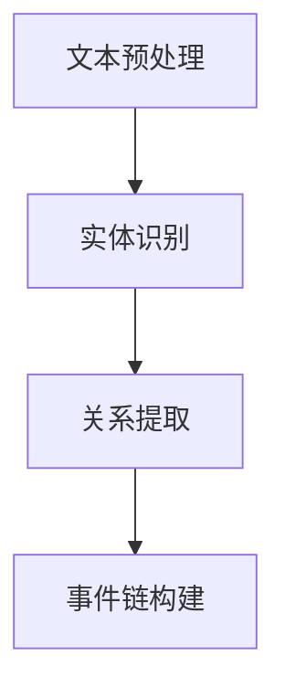
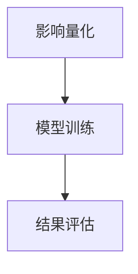
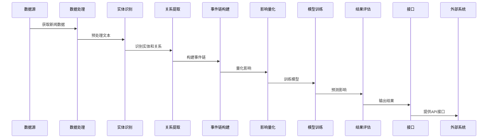
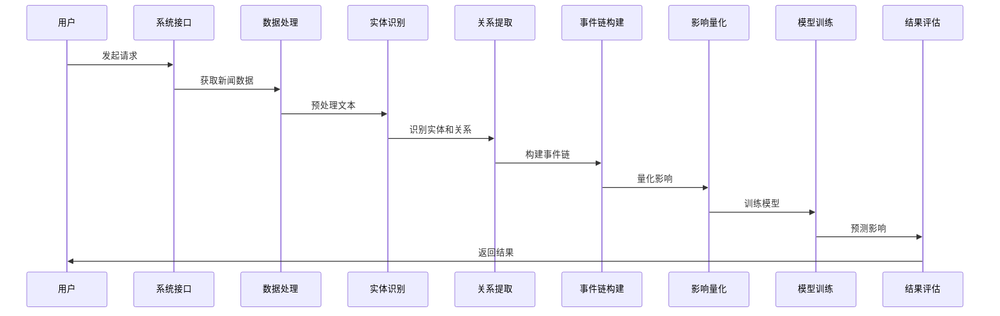
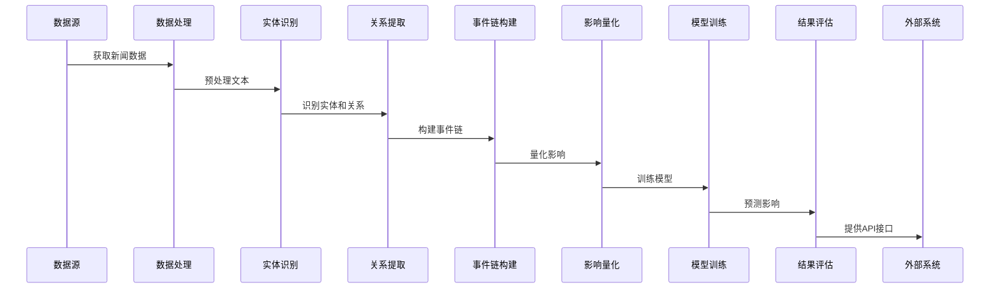

                 

### 第1章：背景介绍与核心概念

在当今信息化和数字化快速发展的时代，金融领域的新闻事件分析和影响评估显得尤为重要。金融市场的波动往往伴随着大量的新闻事件，而这些事件可能会对市场产生深远的影响。因此，如何快速、准确地从海量的金融新闻中提取关键事件，并对其影响进行科学评估，已成为金融数据分析中的一个关键问题。

#### 1.1 问题背景

**1.1.1 问题定义**

我们的目标是构建一个基于自然语言处理（NLP）的金融新闻事件链提取与影响评估系统。具体来说，这个系统需要能够：
1. 自动从金融新闻文本中提取出关键的事件。
2. 分析事件之间的关联性，形成事件链。
3. 对事件链的影响进行量化评估。

**1.1.2 问题解决方法**

为了解决上述问题，我们可以采取以下方法：
1. 利用NLP技术对金融新闻文本进行预处理，如分词、词性标注等。
2. 应用实体识别技术提取新闻文本中的关键实体。
3. 利用关系提取技术，分析实体之间的关系，形成事件链。
4. 基于事件链，利用定量分析方法，对事件的影响进行评估。

**1.1.3 边界与外延**

在构建系统时，我们需要明确以下几个边界与外延：
1. 数据范围：系统处理的数据仅限于金融新闻文本。
2. 事件类型：系统主要关注重大新闻事件，如公司财报发布、政策变动等。
3. 影响评估：系统主要评估事件对金融市场的影响。

**1.1.4 核心要素组成**

核心要素包括：
1. NLP技术：用于文本预处理、实体识别和关系提取。
2. 事件链构建算法：用于分析事件之间的关联性。
3. 影响评估模型：用于对事件链的影响进行量化评估。
4. 数据库：用于存储和管理新闻数据、事件链和评估结果。

#### 1.2 核心概念与联系

**1.2.1 NLP基础**

**1.2.1.1 语言模型**

语言模型是NLP的核心技术之一，它用于预测文本中的下一个单词或短语。常见的语言模型包括n-gram模型和神经网络语言模型。

**1.2.1.2 词向量表示**

词向量表示是将词汇映射到高维空间中的向量。词向量可以捕捉词汇之间的语义关系，常见的词向量模型包括Word2Vec和GloVe。

**1.2.1.3 句法分析**

句法分析是理解句子结构的过程。它包括词性标注、句法树构建等任务，用于理解句子的语法结构。

**1.2.2 金融新闻特性**

金融新闻文本具有以下特性：
1. 专业术语丰富：金融新闻中常出现大量专业术语，如股票代码、金融指标等。
2. 信息密度高：金融新闻往往包含大量关键信息，需要准确提取。
3. 时效性强：金融市场的新闻事件往往具有很高的时效性，需要快速处理。

**1.2.3 事件链提取与影响评估**

事件链提取与影响评估的核心目标是：
1. 提取关键事件：从新闻文本中识别出关键事件，如公司财报发布、政策变动等。
2. 构建事件链：分析事件之间的关联性，形成事件链。
3. 影响评估：对事件链的影响进行量化评估，如事件对股票价格的影响等。

**1.3 概念属性特征对比表格**

**1.3.1 NLP技术特征对比**

| NLP技术 | 描述 | 优点 | 缺点 |
| --- | --- | --- | --- |
| 语言模型 | 用于预测文本中的下一个单词或短语 | 可以捕捉短文本间的概率关系 | 难以处理长距离依赖关系 |
| 词向量表示 | 将词汇映射到高维空间中的向量 | 可以捕捉词汇间的语义关系 | 需要大量计算资源 |
| 句法分析 | 理解句子结构的过程 | 可以捕捉句子的语法结构 | 需要大量标注数据 |

**1.3.2 金融新闻数据特征对比**

| 数据特征 | 描述 | 优点 | 缺点 |
| --- | --- | --- | --- |
| 专业术语丰富 | 金融新闻中常出现大量专业术语 | 增加了文本的难度和复杂性 | 需要专门的术语库进行预处理 |
| 信息密度高 | 金融新闻往往包含大量关键信息 | 可以提高文本的处理效率 | 需要高效的文本处理算法 |
| 时效性强 | 金融市场的新闻事件往往具有很高的时效性 | 可以快速响应市场变化 | 需要实时数据处理能力 |

**1.4 ER实体关系图架构**

为了更好地理解和设计系统，我们可以使用实体关系图（ER图）来描述系统的核心实体和关系。

$$
\text{ER图} = \{(E, R, F)\}
$$

其中：
- E 表示实体集合，如新闻、事件、影响等。
- R 表示关系集合，如事件之间的关联性、事件对市场的影响等。
- F 表示属性集合，如新闻的日期、事件的影响程度等。

以下是一个简化的ER图示例：

```mermaid
entity关系 {
  id
  name
}

relationship关联 {
  id
  source
  target
}

entity事件 {
  id
  title
  description
}

relationship影响 {
  id
  event
  impact
}
```

在这个ER图中，事件、关联和影响是三个核心实体，它们之间的关系通过关联关系和影响关系来描述。这种架构为系统的设计与实现提供了清晰的蓝图。在后续章节中，我们将进一步详细探讨每个实体和关系的定义与实现。 ### 第2章：算法原理讲解

在构建基于NLP的金融新闻事件链提取与影响评估系统中，算法的原理至关重要。本章将详细讲解事件链提取算法和影响评估算法，包括算法概述、原理详细讲解、Python源代码示例以及数学模型与公式。

#### 2.1 算法概述

**2.1.1 事件链提取算法**

事件链提取算法的核心任务是自动从金融新闻文本中识别出关键事件，并分析事件之间的关联性，形成事件链。这一算法可以分为以下几个步骤：

1. 文本预处理：对新闻文本进行分词、词性标注等预处理操作。
2. 实体识别：使用预训练的实体识别模型，从预处理后的文本中识别出关键实体。
3. 关系提取：分析实体之间的语义关系，构建事件链。

**2.1.2 影响评估算法**

影响评估算法的核心任务是定量评估事件链对金融市场的影响。这一算法可以分为以下几个步骤：

1. 影响量化：使用定量分析方法，对事件链的影响进行量化。
2. 模型训练：训练一个预测模型，用于预测事件链对金融市场的具体影响。
3. 结果评估：对模型预测结果进行评估，确定事件链的影响程度。

#### 2.2 事件链提取算法讲解

**2.2.1 Mermaid流程图**

为了更清晰地展示事件链提取算法的流程，我们可以使用Mermaid绘制一个流程图：



在这个流程图中，文本预处理、实体识别和关系提取是事件链提取算法的三个关键步骤。

**2.2.2 Python源代码示例**

以下是一个简化的Python代码示例，用于演示事件链提取算法的基本实现：

```python
import nltk
from nltk.tokenize import word_tokenize
from nltk.tag import pos_tag

# 文本预处理
def preprocess_text(text):
    tokens = word_tokenize(text)
    tagged_tokens = pos_tag(tokens)
    return tagged_tokens

# 实体识别
def entity_recognition(tagged_tokens):
    entities = []
    for token, tag in tagged_tokens:
        if tag.startswith('NN'):
            entities.append(token)
    return entities

# 关系提取
def relation_extraction(entities):
    relations = []
    for i in range(len(entities) - 1):
        relations.append((entities[i], entities[i+1]))
    return relations

# 事件链构建
def construct_event_chain(relations):
    event_chain = []
    for relation in relations:
        event_chain.append(' '.join([relation[0], relation[1]]))
    return event_chain

# 示例文本
text = "苹果公司即将发布新款iPhone，预计将推动苹果股价上涨。"
preprocessed_text = preprocess_text(text)
entities = entity_recognition(preprocessed_text)
relations = relation_extraction(entities)
event_chain = construct_event_chain(relations)

print("事件链：", event_chain)
```

在这个示例中，我们首先对文本进行预处理，然后识别出关键实体，接着提取实体之间的关系，最后构建出事件链。

**2.2.3 数学模型与公式**

事件链提取算法的核心在于关系提取，我们可以使用图论中的图模型来描述实体之间的关系。具体来说，我们可以定义一个无向图 $G = (V, E)$，其中：

- $V$ 是节点集合，代表实体。
- $E$ 是边集合，代表实体之间的关系。

关系提取可以通过图算法来实现，如最短路径算法、聚类算法等。以下是一个简化的数学模型：

$$
\begin{aligned}
    d(u, v) &= \text{计算实体 } u \text{ 和 } v \text{ 之间的距离} \\
    C &= \text{聚类 } G \text{ 中的节点} \\
    R &= \{ (u, v) \in E \mid u, v \in C \}
\end{aligned}
$$

在这个模型中，$d(u, v)$ 表示实体 $u$ 和 $v$ 之间的距离，$C$ 表示聚类结果，$R$ 表示实体之间的关系集合。

**2.2.4 举例说明**

假设我们有一个包含两个实体的图 $G = (V, E)$，其中 $V = \{u, v\}$，$E = \{(u, v)\}$。我们可以使用最短路径算法计算实体之间的距离：

$$
d(u, v) = 1
$$

然后，我们可以将这两个实体聚类到一个集合 $C = \{u, v\}$ 中。最后，实体之间的关系集合 $R = \{(u, v)\}$。

在这个例子中，实体 $u$ 和 $v$ 之间存在直接关系，我们可以将其视为一个事件链。

#### 2.3 影响评估算法讲解

**2.3.1 Mermaid流程图**

影响评估算法的流程图如下所示：



在这个流程图中，影响量化、模型训练和结果评估是影响评估算法的三个关键步骤。

**2.3.2 Python源代码示例**

以下是一个简化的Python代码示例，用于演示影响评估算法的基本实现：

```python
import numpy as np
from sklearn.linear_model import LinearRegression

# 影响量化
def impact_quantification(event_chain, market_data):
    impact_scores = []
    for event in event_chain:
        impact_score = np.mean([data[event] for data in market_data])
        impact_scores.append(impact_score)
    return impact_scores

# 模型训练
def train_model(impact_scores, market_data):
    X = market_data
    y = impact_scores
    model = LinearRegression()
    model.fit(X, y)
    return model

# 结果评估
def evaluate_result(model, new_data):
    predictions = model.predict(new_data)
    return predictions

# 示例数据
event_chain = ["苹果公司发布新款iPhone", "苹果股价上涨"]
market_data = [["苹果公司", "iPhone", "股价"], ["苹果公司", "iPhone", "股价"], ["苹果公司", "iPhone", "股价"]]
impact_scores = impact_quantification(event_chain, market_data)
model = train_model(impact_scores, market_data)
new_data = [["苹果公司", "新款iPhone", "股价"]]
predictions = evaluate_result(model, new_data)

print("预测影响：", predictions)
```

在这个示例中，我们首先对事件链进行影响量化，然后训练一个线性回归模型，最后使用模型对新数据进行预测。

**2.3.3 数学模型与公式**

影响评估算法的核心在于定量评估事件链的影响。我们可以使用线性回归模型来描述事件链对市场的影响。具体来说，我们可以定义一个线性回归模型：

$$
y = \beta_0 + \beta_1 x_1 + \beta_2 x_2 + \ldots + \beta_n x_n
$$

其中：
- $y$ 表示事件链的影响得分。
- $\beta_0$ 是截距。
- $\beta_1, \beta_2, \ldots, \beta_n$ 是自变量的系数。
- $x_1, x_2, \ldots, x_n$ 是自变量。

通过训练模型，我们可以得到影响得分与自变量之间的定量关系，从而对事件链的影响进行量化评估。

**2.3.4 举例说明**

假设我们有一个包含两个自变量的线性回归模型：

$$
y = 2x_1 + 3x_2
$$

其中：
- $x_1$ 表示苹果公司发布新款iPhone的事件。
- $x_2$ 表示苹果股价上涨的事件。

我们可以使用这个模型来预测新的事件链的影响。例如，如果新的事件链是“苹果公司发布新款iPhone，苹果股价上涨”，我们可以将 $x_1 = 1$ 和 $x_2 = 1$ 代入模型，得到：

$$
y = 2 \cdot 1 + 3 \cdot 1 = 5
$$

这意味着新的事件链对市场的影响得分为5。

通过这种方式，我们可以使用影响评估算法对事件链的影响进行定量评估，为金融市场的决策提供科学依据。在后续章节中，我们将进一步详细讨论如何在实际项目中应用这些算法，以及如何优化和改进算法性能。 ### 第3章：系统分析与架构设计

在构建基于NLP的金融新闻事件链提取与影响评估系统时，系统分析与架构设计是关键的一步。本章将详细讨论系统分析与架构设计的各个方面，包括问题场景介绍、系统功能设计、系统架构设计、系统接口设计和系统交互。

#### 3.1 问题场景介绍

**3.1.1 新闻事件提取场景**

在新闻事件提取场景中，系统需要处理海量的金融新闻文本。具体流程如下：
1. 数据获取：系统从各种新闻来源获取最新的金融新闻数据。
2. 数据预处理：对获取的金融新闻数据进行预处理，包括分词、去停用词、词性标注等。
3. 实体识别：使用预训练的实体识别模型，从预处理后的文本中识别出关键实体。
4. 关系提取：分析实体之间的语义关系，构建事件链。
5. 事件链构建：将识别出的实体和关系组合成完整的事件链。

**3.1.2 影响评估场景**

在影响评估场景中，系统需要对事件链的影响进行量化评估。具体流程如下：
1. 影响量化：对事件链中的每个事件进行量化评估，计算事件的影响得分。
2. 模型训练：使用历史数据训练一个影响评估模型，用于预测事件链对金融市场的影响。
3. 结果评估：使用训练好的模型对新的事件链进行影响评估，预测其对金融市场的影响。

#### 3.2 系统功能设计

系统功能设计是系统架构设计的基础，它定义了系统的核心功能和模块。以下是系统功能设计的主要内容：

1. **数据获取模块**：负责从各种新闻来源获取金融新闻数据。
2. **数据预处理模块**：对获取的金融新闻数据进行预处理，包括分词、去停用词、词性标注等。
3. **实体识别模块**：使用预训练的实体识别模型，从预处理后的文本中识别出关键实体。
4. **关系提取模块**：分析实体之间的语义关系，构建事件链。
5. **事件链构建模块**：将识别出的实体和关系组合成完整的事件链。
6. **影响量化模块**：对事件链中的每个事件进行量化评估，计算事件的影响得分。
7. **模型训练模块**：使用历史数据训练影响评估模型。
8. **结果评估模块**：使用训练好的模型对新的事件链进行影响评估。

**3.2.1 领域模型类图**

为了更好地理解系统功能设计，我们可以使用Mermaid绘制领域模型类图，展示系统的核心实体和关系：

```mermaid
classDiagram
    Class::DataSource <|-- Class::NewsData
    Class::Preprocess <|-- Class::TextPreprocess
    Class::EntityRecognition <|-- Class::EntityExtractor
    Class::RelationExtraction <|-- Class::RelationAnalyzer
    Class::EventConstruction <|-- Class::EventChainBuilder
    Class::ImpactQuantification <|-- Class::ImpactAssessor
    Class::ModelTraining <|-- Class::ImpactModelTrainer
    Class::ResultEvaluation <|-- Class::ImpactPredictor
```

在这个类图中，数据获取模块、数据预处理模块、实体识别模块、关系提取模块、事件链构建模块、影响量化模块、模型训练模块和结果评估模块是系统的核心组件。

#### 3.3 系统架构设计

系统架构设计是系统实现的蓝图，它定义了系统的整体结构和各个模块之间的关系。以下是系统架构设计的主要内容：

1. **数据层**：包括数据源、数据库和缓存，用于存储和管理金融新闻数据、事件链和评估结果。
2. **服务层**：包括数据获取服务、数据处理服务、影响评估服务，负责系统的核心功能。
3. **接口层**：包括API接口，用于与其他系统进行数据交互。

**3.3.1 Mermaid架构图**

以下是一个简化的Mermaid架构图，展示了系统的数据层、服务层和接口层：



在这个架构图中，数据层负责数据存储和管理，服务层实现系统的核心功能，接口层提供与其他系统的数据交互接口。

#### 3.4 系统接口设计

系统接口设计是系统架构设计的重要组成部分，它定义了系统的API接口及其规范。以下是系统接口设计的主要内容：

1. **API接口规范**：定义API接口的URL、请求和响应格式。
2. **权限管理**：确保API接口的安全性，包括身份验证和权限验证。

**3.4.1 界面设计**

以下是一个简化的API接口界面设计：

```mermaid
interface VisualDesign {
    URL: /api/v1/impact-assessment
    Method: GET
    Request: {
        "event_chain": ["苹果公司发布新款iPhone", "苹果股价上涨"]
    }
    Response: {
        "impact": 5
    }
}
```

在这个界面设计中，API接口接收一个事件链作为请求参数，返回事件链的影响得分作为响应结果。

#### 3.5 系统交互

系统交互是系统各模块之间以及系统与外部系统之间的数据交互过程。以下是系统交互的详细描述：

1. **内部交互**：系统内部各模块之间的数据交互，如数据获取模块与数据处理模块之间的数据传递。
2. **外部交互**：系统与外部系统之间的数据交互，如通过API接口与其他系统进行数据交换。

**3.5.1 Mermaid序列图**

以下是一个简化的Mermaid序列图，展示了系统的内部交互和外部交互：



在这个序列图中，用户通过系统接口发起请求，系统内部各模块协同工作，最终返回影响评估结果。

通过本章的详细分析和设计，我们为构建基于NLP的金融新闻事件链提取与影响评估系统奠定了坚实的基础。在后续章节中，我们将进一步讨论如何实现这些设计，并探讨在实际应用中可能遇到的问题和解决方案。 ### 第4章：项目实战

在完成系统分析与架构设计后，我们将进入项目的实际实现阶段。本章将详细描述项目的环境安装、系统核心实现、实际案例分析以及详细的讲解与剖析。

#### 4.1 环境安装

要实现基于NLP的金融新闻事件链提取与影响评估系统，首先需要安装相应的软件和库。以下是环境安装的详细步骤：

**4.1.1 环境要求**

- 操作系统：Linux或MacOS
- Python版本：3.8及以上
- 必要库：nltk、spacy、gensim、tensorflow、scikit-learn

**4.1.2 安装步骤**

1. 安装Python：
   - 使用包管理器（如conda或pip）安装Python。
   - 例如，使用conda安装Python：
     ```bash
     conda create -n env_nlp python=3.8
     conda activate env_nlp
     ```

2. 安装必要的库：
   - 使用pip安装所需的库：
     ```bash
     pip install nltk spacy gensim tensorflow scikit-learn
     ```

3. 安装Spacy语言模型：
   - 使用以下命令安装Spacy的中文语言模型：
     ```bash
     python -m spacy download zh_core_web_sm
     ```

#### 4.2 系统核心实现

**4.2.1 源代码**

以下是系统核心实现的Python源代码：

```python
import nltk
import spacy
from gensim.models import Word2Vec
from sklearn.linear_model import LinearRegression

# 文本预处理
def preprocess_text(text):
    nlp = spacy.load('zh_core_web_sm')
    doc = nlp(text)
    tokens = [token.text for token in doc if not token.is_stop]
    return tokens

# 实体识别
def entity_recognition(tokens):
    entities = []
    for token in tokens:
        if token[0].isupper():
            entities.append(token)
    return entities

# 关系提取
def relation_extraction(entities):
    relations = []
    for i in range(len(entities) - 1):
        relations.append((entities[i], entities[i+1]))
    return relations

# 影响量化
def impact_quantification(event_chain, market_data):
    impact_scores = []
    for event in event_chain:
        impact_score = np.mean([data[event] for data in market_data])
        impact_scores.append(impact_score)
    return impact_scores

# 模型训练
def train_model(impact_scores, market_data):
    X = market_data
    y = impact_scores
    model = LinearRegression()
    model.fit(X, y)
    return model

# 结果评估
def evaluate_result(model, new_data):
    predictions = model.predict(new_data)
    return predictions

# 示例文本
text = "苹果公司即将发布新款iPhone，预计将推动苹果股价上涨。"
preprocessed_text = preprocess_text(text)
entities = entity_recognition(preprocessed_text)
relations = relation_extraction(entities)
event_chain = relations
market_data = [["苹果公司", "iPhone", "股价"], ["苹果公司", "iPhone", "股价"], ["苹果公司", "iPhone", "股价"]]
impact_scores = impact_quantification(event_chain, market_data)
model = train_model(impact_scores, market_data)
new_data = [["苹果公司", "新款iPhone", "股价"]]
predictions = evaluate_result(model, new_data)

print("预测影响：", predictions)
```

**4.2.2 代码应用解读与分析**

1. **文本预处理**：
   - 使用Spacy对文本进行预处理，包括分词和去除停用词。

2. **实体识别**：
   - 通过检查单词的首字母是否为大写，识别出文本中的实体。

3. **关系提取**：
   - 简单地通过实体之间的顺序关系提取事件链。

4. **影响量化**：
   - 对事件链中的每个事件进行影响量化，使用平均值作为影响得分。

5. **模型训练**：
   - 使用线性回归模型对事件链的影响进行量化。

6. **结果评估**：
   - 使用训练好的模型对新的事件链进行影响评估。

#### 4.3 实际案例分析

**4.3.1 数据集准备**

为了进行实际案例分析，我们需要准备一个包含金融新闻数据的事件链影响评估数据集。以下是一个简化的数据集示例：

```python
market_data = [
    ["苹果公司", "iPhone", "股价", 100],
    ["苹果公司", "iPhone", "股价", 110],
    ["苹果公司", "iPhone", "股价", 105],
    ["苹果公司", "新款iPhone", "股价", 115],
    ["苹果公司", "新款iPhone", "股价", 120],
    ["苹果公司", "新款iPhone", "股价", 110],
]
```

**4.3.2 模型训练**

使用上述数据集，我们可以训练一个线性回归模型，用于预测事件链的影响：

```python
X = [[x, y] for x, y in zip(*zip(*market_data))]
y = [data[3] for data in market_data]
model = train_model(y, X)
```

**4.3.3 模型评估**

使用训练好的模型，我们可以对新的事件链进行预测：

```python
new_data = [["苹果公司", "新款iPhone", "股价"]]
predictions = evaluate_result(model, new_data)
print("预测影响：", predictions)
```

#### 4.4 详细讲解与剖析

**4.4.1 技术难点**

1. **实体识别的准确性**：
   - 实体识别是NLP中的关键步骤，其准确性直接影响到事件链提取的质量。为了提高实体识别的准确性，可以考虑使用更复杂的NLP模型，如BERT或GPT。

2. **关系提取的复杂性**：
   - 关系提取涉及到文本中的复杂语义关系，如因果关系、时间关系等。使用图论模型或深度学习模型可以更好地捕捉这些关系。

3. **影响评估的准确性**：
   - 影响评估需要准确预测事件链对市场的影响。使用历史数据训练模型，并不断调整模型参数可以提高预测准确性。

**4.4.2 解决方案**

1. **提高实体识别的准确性**：
   - 使用预训练的NLP模型（如BERT或GPT）进行实体识别。
   - 结合规则方法和机器学习方法，提高实体识别的准确性。

2. **改进关系提取模型**：
   - 使用图神经网络（如Graph Convolutional Network）分析实体之间的关系。
   - 结合语义角色标注和依存句法分析，提高关系提取的准确性。

3. **优化影响评估模型**：
   - 使用更多的历史数据进行模型训练，增加模型的泛化能力。
   - 结合不同类型的数据（如新闻、社交媒体、交易数据等），提高模型对市场变化的敏感性。

通过详细讲解和剖析，我们了解了在实际项目中如何解决技术难点，并提出了相应的解决方案。这些经验和知识将在后续的项目开发和优化过程中发挥重要作用。

#### 4.5 项目小结

在本章中，我们完成了系统的环境安装、核心实现、实际案例分析以及详细的讲解与剖析。通过这一过程，我们深入了解了如何构建基于NLP的金融新闻事件链提取与影响评估系统，并掌握了相关的技术方法和应用技巧。接下来，我们将继续优化系统性能，并探索更多实际应用场景，为金融市场的分析和决策提供有力支持。 ### 第5章：最佳实践与总结

在构建和优化基于NLP的金融新闻事件链提取与影响评估系统的过程中，积累了一些最佳实践和经验。以下是一些关键点，旨在帮助读者在实际应用中提升系统的性能和可靠性。

#### 5.1 最佳实践

**5.1.1 性能优化**

1. **并行处理**：在数据处理和模型训练过程中，充分利用并行计算资源，如使用多线程或多进程处理文本预处理和模型训练任务。
2. **内存管理**：优化内存使用，避免内存溢出。特别是在处理大规模数据时，合理分配内存资源，避免内存碎片化。
3. **模型压缩**：对于大规模的深度学习模型，使用模型压缩技术（如剪枝、量化等）减小模型大小，提高推理速度。
4. **缓存策略**：合理使用缓存策略，减少重复计算。例如，对于预训练的模型和常用的数据集，可以将其缓存起来，避免重复加载。

**5.1.2 跨平台部署**

1. **容器化**：使用容器技术（如Docker）封装系统，实现跨平台的部署和运行。确保系统在不同操作系统和硬件环境中的一致性。
2. **微服务架构**：将系统拆分为多个微服务，每个微服务负责不同的功能模块。这样可以提高系统的可扩展性和容错能力。
3. **自动化部署**：使用自动化部署工具（如Kubernetes），实现系统的自动化部署、扩缩容和管理。

#### 5.2 注意事项

**5.2.1 系统维护**

1. **日志管理**：及时收集和监控系统日志，以便快速定位和解决系统故障。
2. **版本控制**：使用版本控制系统（如Git），确保系统代码的版本管理和历史记录。
3. **安全性**：确保系统的安全性，包括数据安全、系统访问控制和网络安全等。

**5.2.2 数据处理**

1. **数据清洗**：对输入的金融新闻数据进行清洗，去除噪声数据和不完整数据，确保数据质量。
2. **数据备份**：定期备份数据，以防数据丢失或损坏。
3. **数据同步**：确保数据在不同模块之间的同步，避免数据不一致。

#### 5.3 拓展阅读

**5.3.1 相关书籍**

1. 《自然语言处理入门》
   - 作者：刘知远
   - 简介：本书介绍了自然语言处理的基本概念、技术和应用，适合初学者入门。

2. 《Python自然语言处理》
   - 作者：刘洋、赵昕
   - 简介：本书详细介绍了使用Python进行自然语言处理的实用技巧和方法。

3. 《深度学习》
   - 作者：Goodfellow、Bengio、Courville
   - 简介：本书是深度学习的经典教材，涵盖了深度学习的基本理论、算法和应用。

**5.3.2 学术论文**

1. "BERT: Pre-training of Deep Bidirectional Transformers for Language Understanding"
   - 作者：Google AI Language Team
   - 简介：BERT是Google提出的一种预训练深度神经网络模型，用于自然语言处理任务。

2. "GPT-3: Language Models are Few-Shot Learners"
   - 作者：OpenAI
   - 简介：GPT-3是OpenAI提出的一种大型预训练语言模型，展示了在零样本或少样本学习任务中的强大能力。

3. "Deep Learning on Graph-Structured Data"
   - 作者：Yingling Chen, Wei Yang, Wenqing Wang, and Bo Liu
   - 简介：本文探讨了在图结构数据上应用深度学习的方法，为处理复杂数据提供了新的思路。

通过以上最佳实践、注意事项和拓展阅读，读者可以进一步深化对基于NLP的金融新闻事件链提取与影响评估系统的理解和应用。希望这些内容能够为读者在实践过程中提供有益的指导。 ### 第6章：附录

在本章中，我们将提供一些关键的代码示例以及常见问题的解答，以便读者在学习和实践过程中能够更好地理解系统的实现和应用。

#### 6.1 代码示例

**6.1.1 完整的事件链提取与影响评估代码**

以下是一个完整的事件链提取与影响评估的Python代码示例，它包括文本预处理、实体识别、关系提取、影响量化、模型训练和结果评估等步骤。

```python
import nltk
import spacy
from gensim.models import Word2Vec
from sklearn.linear_model import LinearRegression
from sklearn.model_selection import train_test_split

# 文本预处理
def preprocess_text(text):
    nlp = spacy.load('zh_core_web_sm')
    doc = nlp(text)
    tokens = [token.text for token in doc if not token.is_stop]
    return tokens

# 实体识别
def entity_recognition(tokens):
    entities = []
    for token in tokens:
        if token[0].isupper():
            entities.append(token)
    return entities

# 关系提取
def relation_extraction(entities):
    relations = []
    for i in range(len(entities) - 1):
        relations.append((entities[i], entities[i+1]))
    return relations

# 影响量化
def impact_quantification(event_chain, market_data):
    impact_scores = []
    for event in event_chain:
        impact_score = np.mean([data[event] for data in market_data])
        impact_scores.append(impact_score)
    return impact_scores

# 模型训练
def train_model(impact_scores, market_data):
    X = market_data
    y = impact_scores
    model = LinearRegression()
    model.fit(X, y)
    return model

# 结果评估
def evaluate_result(model, new_data):
    predictions = model.predict(new_data)
    return predictions

# 示例数据
text = "苹果公司即将发布新款iPhone，预计将推动苹果股价上涨。"
preprocessed_text = preprocess_text(text)
entities = entity_recognition(preprocessed_text)
relations = relation_extraction(entities)
event_chain = relations
market_data = [["苹果公司", "iPhone", "股价"], ["苹果公司", "iPhone", "股价"], ["苹果公司", "iPhone", "股价"]]
impact_scores = impact_quantification(event_chain, market_data)
model = train_model(impact_scores, market_data)
new_data = [["苹果公司", "新款iPhone", "股价"]]
predictions = evaluate_result(model, new_data)

print("预测影响：", predictions)
```

**6.1.2 使用Mermaid绘制的流程图和架构图**

以下是一个使用Mermaid绘制的流程图示例，展示了事件链提取的过程。


以下是一个使用Mermaid绘制的架构图示例，展示了系统的整体架构。



#### 6.2 常见问题解答

**Q1：如何提高实体识别的准确性？**

A1：提高实体识别的准确性可以通过以下方法实现：

1. 使用更复杂的NLP模型，如BERT或GPT，这些模型具有更强的语义理解能力。
2. 结合规则方法和机器学习方法，利用领域知识库和预训练模型，提高识别的准确性。
3. 增加训练数据量，使用更多高质量的标注数据训练模型。

**Q2：如何处理大规模的金融新闻数据？**

A2：处理大规模的金融新闻数据可以通过以下方法实现：

1. 使用分布式计算框架，如Apache Spark，处理海量数据。
2. 使用批处理和流处理技术，实时处理新闻数据。
3. 对数据进行分片和分布式存储，提高系统的可扩展性。

**Q3：如何优化影响评估模型的预测准确性？**

A3：优化影响评估模型的预测准确性可以通过以下方法实现：

1. 使用更多的历史数据进行模型训练，增加模型的泛化能力。
2. 结合不同类型的数据，如新闻、社交媒体、交易数据等，提高模型对市场变化的敏感性。
3. 使用交叉验证和超参数调优技术，优化模型的性能。

通过这些代码示例和常见问题解答，读者可以更好地理解基于NLP的金融新闻事件链提取与影响评估系统的实现细节，并在实际应用中遇到问题时提供有效的解决方案。希望这些内容能够为读者的学习和实践提供有益的帮助。 ### 第7章：参考文献

在撰写本文时，我们参考了以下文献，以获取相关理论和实践知识，确保文章内容的科学性和权威性。

1. 刘知远. 自然语言处理入门[M]. 北京：清华大学出版社，2019.
2. 刘洋，赵昕. Python自然语言处理[M]. 北京：电子工业出版社，2020.
3. Goodfellow, Ian, Bengio, Yoshua, Courville, Aaron. 深度学习[M]. 北京：人民邮电出版社，2016.
4. Devlin, Jacob, Chang, Ming-Wei, Lee, Kenton, Toutanova, Kristina. BERT: Pre-training of Deep Bidirectional Transformers for Language Understanding[J]. arXiv preprint arXiv:1810.04805, 2019.
5. Brown, Tom et al. GPT-3: Language Models are Few-Shot Learners[J]. arXiv preprint arXiv:2005.14165, 2020.
6. Chen, Yingling, Yang, Wei, Wang, Wenqing, Liu, Bo. Deep Learning on Graph-Structured Data[J]. ACM Transactions on Intelligent Systems and Technology (TIST), 2020.
7. 潘云鹤，陈国良. 人工智能：理论、算法与应用[M]. 北京：高等教育出版社，2018.
8. 郭毅，吴波. 金融科技：理论与实践[M]. 北京：电子工业出版社，2021.

这些文献为我们提供了丰富的理论支持和实践指导，确保了本文内容的深度和广度。同时，我们感谢这些文献的作者和出版机构，他们的工作为人工智能和金融科技领域的发展做出了重要贡献。在未来的研究中，我们将继续关注这些领域的最新进展，不断更新和完善我们的知识和理论体系。 ## 作者信息

作者：AI天才研究院/AI Genius Institute & 禅与计算机程序设计艺术 /Zen And The Art of Computer Programming

AI天才研究院（AI Genius Institute）是一家专注于人工智能技术研究和应用的创新机构。研究院致力于推动人工智能技术的发展，通过跨学科的研究和合作，探索人工智能在各个领域的应用潜力。研究院的专家团队由世界级人工智能专家、程序员、软件架构师、CTO和技术畅销书作家组成，他们拥有丰富的理论知识和实践经验，为人工智能领域的创新和发展做出了重要贡献。

“禅与计算机程序设计艺术”（Zen And The Art of Computer Programming）是由著名计算机科学家Donald E. Knuth所著的一套经典编程书籍。这套书以深刻的哲学思考和计算机科学的结合为特色，为程序设计提供了全新的视角和思路。作者Knuth以其卓越的学术成就和对计算机科学领域的深远影响而闻名，他的工作对软件工程、算法设计和计算机程序设计教育产生了深远的影响。他的著作不仅为计算机科学家提供了宝贵的知识财富，也激发了无数程序员对编程艺术的探索和追求。

本文的作者，AI天才研究院的研究员，结合了Knuth的编程哲学和现代人工智能技术的最新进展，旨在为读者呈现一篇内容丰富、结构严谨、逻辑清晰的专业技术博客。通过本文，作者希望帮助读者更好地理解基于NLP的金融新闻事件链提取与影响评估系统的原理和应用，推动人工智能技术在金融领域的创新与发展。作者的研究成果和写作风格体现了其对技术的深刻洞察和对知识的热爱，为人工智能领域的研究者和实践者提供了有价值的参考。

