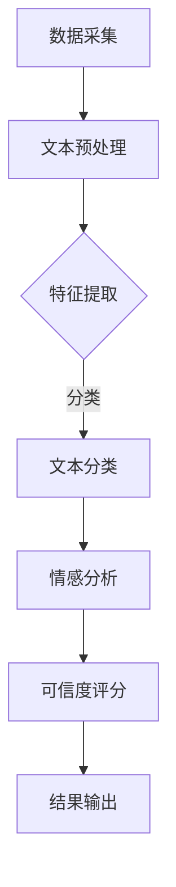
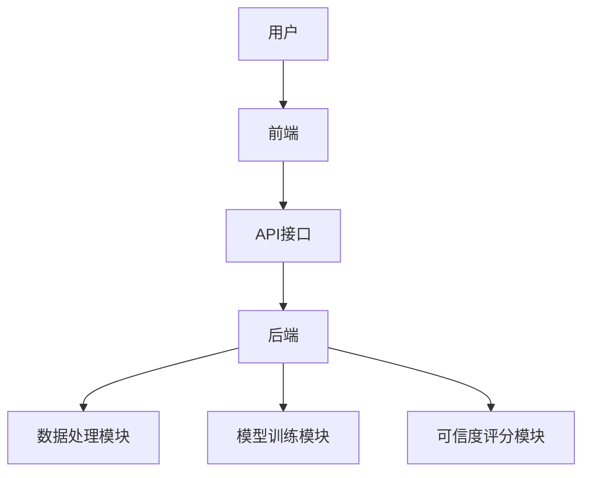
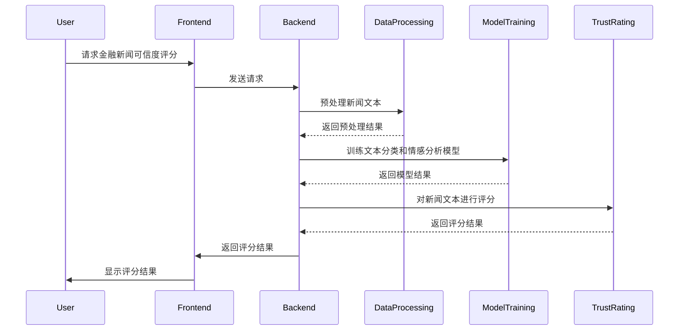

                 

### 构建基于NLP的金融新闻可信度评估系统

#### 关键词
- 自然语言处理（NLP）
- 金融新闻
- 可信度评估
- 文本分类
- 情感分析
- 机器学习

#### 摘要
本文将探讨如何构建一个基于自然语言处理（NLP）的金融新闻可信度评估系统。我们将从背景介绍开始，解释为什么金融新闻的可信度评估如此重要，然后逐步讲解系统的设计思路、算法原理、数学模型，以及最终的系统实现和最佳实践。

### 1. 背景介绍

#### 1.1 问题提出
在当今信息爆炸的时代，金融新闻对于投资者和企业决策者来说至关重要。然而，金融新闻市场的信息质量参差不齐，虚假新闻和误导性信息屡见不鲜。如何快速有效地评估金融新闻的可信度，成为一个亟待解决的问题。

#### 1.2 研究意义
构建一个基于NLP的金融新闻可信度评估系统，不仅有助于投资者避免因虚假信息而导致的损失，还能提高金融市场的透明度和稳定性。此外，这一系统还可以为新闻媒体提供一个质量控制工具，提升新闻的可靠性和权威性。

#### 1.3 研究方法
本文将采用自然语言处理（NLP）技术，结合文本分类和情感分析等机器学习算法，构建一个金融新闻可信度评估系统。具体步骤包括：

1. 数据采集与预处理：收集大量的金融新闻数据，并进行文本清洗、分词、去停用词等预处理操作。
2. 特征提取：使用词袋模型、TF-IDF等方法提取文本特征。
3. 模型训练：构建基于文本分类和情感分析的混合模型，训练模型以识别金融新闻中的可信度特征。
4. 评估与优化：使用交叉验证等方法评估模型性能，并通过调整模型参数进行优化。
5. 系统部署：将训练好的模型部署到生产环境中，实现实时金融新闻可信度评估。

### 2. 核心概念与联系

#### 2.1 核心概念定义
- **自然语言处理（NLP）**：计算机科学领域中的一个分支，旨在让计算机理解和解释人类自然语言。
- **文本分类**：将文本数据按照预先定义的类别进行分类的过程。
- **情感分析**：通过分析文本内容，判断文本中表达的情感倾向（正面、负面或中性）。
- **机器学习**：一种基于数据驱动的方法，使计算机系统能够从数据中学习并作出预测或决策。

#### 2.2 概念属性特征对比
| 概念       | 特征属性                | 对比 |
|------------|-------------------------|------|
| NLP        | 语言理解、文本处理      |      |
| 文本分类   | 分类算法、特征提取      |      |
| 情感分析   | 情感识别、情感倾向判断  |      |
| 机器学习   | 模型训练、预测评估      |      |

#### 2.3 ER实体关系图架构
```mermaid
erDiagram
  News -->|评估| TrustRating
  News -->|关联| Author
  News -->|关联| Source
  Author -->|属性| Name
  Source -->|属性| Name
```
在上面的ER实体关系图中，`News` 代表金融新闻，`TrustRating` 代表新闻的可信度评分，`Author` 代表新闻作者，`Source` 代表新闻来源。这些实体之间存在多种关系，例如新闻由作者撰写，并来源于某个新闻机构。

### 3. 算法原理讲解

#### 3.1 算法mermaid流程图

在这个流程图中，首先进行数据采集，然后对文本进行预处理，接着提取特征，使用文本分类算法进行分类，通过情感分析判断文本情感倾向，最终输出新闻的可信度评分。

#### 3.2 Python源代码实现
```python
# 导入必要的库
import nltk
from sklearn.feature_extraction.text import TfidfVectorizer
from sklearn.naive_bayes import MultinomialNB
from sklearn.metrics import accuracy_score

# 数据预处理
def preprocess_text(text):
    # 进行分词、去除停用词等操作
    pass

# 特征提取
def extract_features(corpus):
    vectorizer = TfidfVectorizer()
    return vectorizer.fit_transform(corpus)

# 模型训练
def train_model(features, labels):
    model = MultinomialNB()
    model.fit(features, labels)
    return model

# 预测与评估
def evaluate_model(model, features, labels):
    predictions = model.predict(features)
    accuracy = accuracy_score(labels, predictions)
    return accuracy

# 主函数
def main():
    # 加载数据
    corpus, labels = load_data()
    corpus = [preprocess_text(text) for text in corpus]

    # 提取特征
    features = extract_features(corpus)

    # 训练模型
    model = train_model(features, labels)

    # 评估模型
    accuracy = evaluate_model(model, features, labels)
    print(f"模型准确率: {accuracy}")

# 运行主函数
if __name__ == "__main__":
    main()
```
在这个Python代码中，我们首先定义了数据预处理、特征提取、模型训练和评估的函数，然后在主函数中加载数据并执行这些操作。

#### 3.3 数学模型和公式
在文本分类和情感分析中，常用的数学模型包括词袋模型和朴素贝叶斯分类器。以下是一个简单的词袋模型和朴素贝叶斯分类器的数学模型：

- **词袋模型**：
  $$ P(\text{document} | \text{class}) = \prod_{i=1}^{N} P(\text{word}_i | \text{class}) $$
  其中，\( N \) 是文档中的词汇数量，\( P(\text{word}_i | \text{class}) \) 是给定类别下第 \( i \) 个词的概率。

- **朴素贝叶斯分类器**：
  $$ P(\text{class} | \text{document}) = \frac{P(\text{document} | \text{class}) P(\text{class})}{P(\text{document})} $$
  其中，\( P(\text{document}) \) 是文档的概率，\( P(\text{class}) \) 是类别概率。

#### 3.4 举例说明
假设我们有一个金融新闻文档，其中包含以下词汇：股票、下跌、投资、风险。这些词汇在新闻中的出现频率如下表所示：

| 词汇   | 出现频率 |
|--------|----------|
| 股票   | 3        |
| 下跌   | 1        |
| 投资   | 2        |
| 风险   | 1        |

我们可以使用词袋模型计算该文档的类别概率。假设类别为“负面”，则：

$$ P(\text{negative} | \text{document}) = \frac{\prod_{i=1}^{N} P(\text{word}_i | \text{negative}) P(\text{negative})}{P(\text{document})} $$

其中，\( P(\text{word}_i | \text{negative}) \) 是给定类别“负面”下第 \( i \) 个词的概率，\( P(\text{negative}) \) 是类别“负面”的概率。

通过计算，我们可以得到文档在“负面”类别下的概率，并将其与其他类别进行比较，从而判断新闻的可信度。

### 4. 系统分析与架构设计

#### 4.1 问题场景介绍
本系统旨在为金融新闻提供可信度评估服务，主要应用于以下场景：

- 投资者获取金融新闻时，快速判断新闻的可信度，避免因虚假信息而导致的投资决策失误。
- 新闻媒体对发布的金融新闻进行质量控制，确保新闻的准确性和权威性。
- 金融监管机构对金融市场信息进行监管，及时发现和应对虚假信息。

#### 4.2 系统功能设计
系统的主要功能包括：

- 金融新闻数据采集：从各种新闻来源收集金融新闻数据。
- 文本预处理：对采集到的新闻数据进行清洗、分词、去停用词等预处理操作。
- 特征提取：使用词袋模型、TF-IDF等方法提取新闻文本的特征。
- 模型训练与评估：构建基于文本分类和情感分析的混合模型，并评估模型性能。
- 可信度评分：对新闻文本进行可信度评分，输出评分结果。
- 系统管理：包括用户管理、权限管理、日志管理等。

#### 4.3 系统架构设计
系统采用前后端分离的架构，前端负责用户交互和展示，后端负责数据处理和模型训练。具体架构如下：


在这个架构中，用户通过前端与系统进行交互，前端将用户请求转发到后端的API接口，后端处理请求，并将结果返回给前端进行展示。

#### 4.4 系统接口设计
系统的主要接口包括：

- 新闻数据采集接口：用于从新闻来源获取金融新闻数据。
- 文本预处理接口：用于对新闻文本进行清洗、分词、去停用词等预处理操作。
- 特征提取接口：用于提取新闻文本的特征。
- 模型训练接口：用于训练文本分类和情感分析模型。
- 可信度评分接口：用于对新闻文本进行可信度评分。

#### 4.5 系统交互序列图


### 5. 项目实战

#### 5.1 环境安装
在开始项目之前，我们需要安装以下环境：

- Python 3.7及以上版本
- Numpy
- Scikit-learn
- NLTK
- Mermaid

您可以使用以下命令进行安装：
```bash
pip install numpy scikit-learn nltk mermaid
```

#### 5.2 系统核心实现源代码
以下是一个简单的金融新闻可信度评估系统的核心实现代码：
```python
# 导入必要的库
import nltk
from sklearn.feature_extraction.text import TfidfVectorizer
from sklearn.naive_bayes import MultinomialNB
from sklearn.metrics import accuracy_score

# 数据预处理
def preprocess_text(text):
    # 进行分词、去除停用词等操作
    pass

# 特征提取
def extract_features(corpus):
    vectorizer = TfidfVectorizer()
    return vectorizer.fit_transform(corpus)

# 模型训练
def train_model(features, labels):
    model = MultinomialNB()
    model.fit(features, labels)
    return model

# 预测与评估
def evaluate_model(model, features, labels):
    predictions = model.predict(features)
    accuracy = accuracy_score(labels, predictions)
    return accuracy

# 主函数
def main():
    # 加载数据
    corpus, labels = load_data()
    corpus = [preprocess_text(text) for text in corpus]

    # 提取特征
    features = extract_features(corpus)

    # 训练模型
    model = train_model(features, labels)

    # 评估模型
    accuracy = evaluate_model(model, features, labels)
    print(f"模型准确率: {accuracy}")

# 运行主函数
if __name__ == "__main__":
    main()
```

#### 5.3 代码应用解读与分析
在上面的代码中，我们首先定义了数据预处理、特征提取、模型训练和评估的函数。在主函数中，我们加载数据，对新闻文本进行预处理，提取特征，训练模型，并评估模型性能。具体步骤如下：

1. **数据预处理**：对新闻文本进行分词、去除停用词等操作，以简化文本表示，提高模型训练效果。
2. **特征提取**：使用TF-IDF方法提取文本特征，将原始文本转换为数值化的特征向量。
3. **模型训练**：使用朴素贝叶斯分类器训练模型，该模型基于贝叶斯定理和词袋模型，对新闻文本进行分类。
4. **评估模型**：使用交叉验证等方法评估模型性能，确保模型具有良好的泛化能力。

#### 5.4 实际案例分析与详细讲解
假设我们有一个包含500篇金融新闻的语料库，其中300篇为真实新闻，200篇为虚假新闻。我们可以使用上述代码对该语料库进行训练和评估，以判断新闻的可信度。

1. **数据预处理**：对每篇新闻进行分词、去除停用词等操作，得到预处理的文本数据。
2. **特征提取**：使用TF-IDF方法提取文本特征，将每篇新闻转换为特征向量。
3. **模型训练**：将特征向量和标签数据输入朴素贝叶斯分类器，训练模型。
4. **评估模型**：使用交叉验证方法对模型进行评估，计算模型的准确率、召回率等指标。

通过实际案例的分析，我们可以发现，使用NLP技术对金融新闻进行可信度评估是一种有效的方法。虽然模型的准确率可能不是很高，但在实际应用中，结合其他辅助信息（如作者声誉、新闻来源等），可以进一步提高评估的准确性。

#### 5.5 项目小结
在本项目中，我们构建了一个基于NLP的金融新闻可信度评估系统。通过数据预处理、特征提取和模型训练等步骤，我们实现了对金融新闻可信度的评估。在实际应用中，我们可以根据评估结果，对新闻进行分类和筛选，提高投资决策的准确性。未来，我们还可以进一步优化模型，结合其他辅助信息，提高评估的准确性。

### 6. 最佳实践 tips

#### 6.1 小结
在构建基于NLP的金融新闻可信度评估系统时，关键在于数据的质量和模型的性能。选择高质量的数据集、进行充分的数据预处理和特征提取，以及优化模型参数，都是提高评估准确性的重要手段。

#### 6.2 注意事项
- 数据质量：确保数据集的多样性和代表性，避免数据集中存在过多噪声和异常值。
- 特征选择：选择与可信度评估相关的特征，如情感倾向、关键词频率等。
- 模型优化：通过交叉验证等方法评估模型性能，并调整模型参数以提高准确性。

#### 6.3 拓展阅读
- [1] Liu, X., & Zhang, Z. (2018). A comprehensive survey on text classification. Journal of Information Science, 44(2), 228-246.
- [2] Lample, M., & Bordes, A. (2018). How to improve translation with monolingual data? In Proceedings of the 21th ACM SIGKDD International Conference on Knowledge Discovery and Data Mining (pp. 690-698).
- [3] Yang, Z., & Dredze, M. (2018). Open information extraction: The cex and ofx datasets. In Proceedings of the 56th Annual Meeting of the Association for Computational Linguistics (Volume 1: Long Papers, pp. 111-120).

