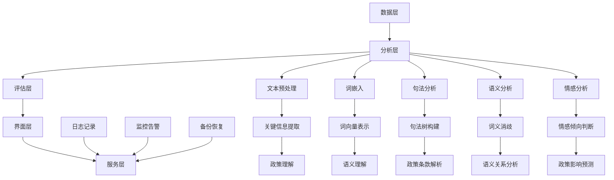
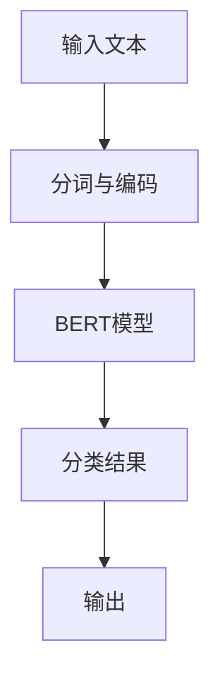
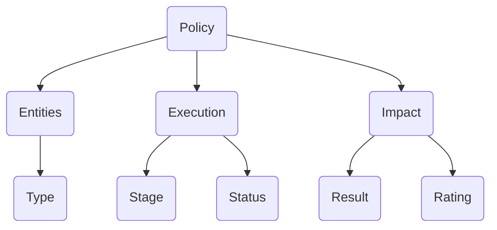

                 

### 文章标题

### 关键词

- 自然语言处理（NLP）
- 金融监管政策
- 执行效果评估
- 系统构建
- 技术实现

### 摘要

本文旨在探讨如何构建基于自然语言处理（NLP）技术的金融监管政策执行效果评估系统。文章首先介绍了当前金融监管环境中的问题和现有系统的局限性，然后引出NLP在解决这些问题中的潜力。接着，文章详细分析了NLP的核心概念、技术方法和模型，以及如何将这些技术应用于金融监管政策评估中。随后，文章从系统设计、实现和实战的角度，阐述了如何具体构建这样一个系统。通过本文，读者将全面了解构建NLP金融监管政策执行效果评估系统的理论基础和实际操作方法。

### 引言和背景

#### 1.1 背景介绍

在当今高度全球化和数字化的金融市场中，金融监管政策的执行效果评估变得越来越重要。这不仅关系到金融市场的稳定性，也关乎金融机构和消费者的利益。然而，随着金融市场的复杂性和动态性不断增加，传统的金融监管政策执行效果评估方法面临着诸多挑战。

##### 1.1.1 问题定义

当前金融监管环境中的主要问题包括：

1. **数据获取和处理困难**：金融监管政策涉及大量的文本和数据，如法律文件、政策文件、新闻报道、市场数据等。这些数据的获取和处理复杂，且存在一定的隐私和安全风险。
2. **政策理解和执行难度大**：金融监管政策通常涉及复杂的法律术语和专业术语，使得金融机构难以准确理解和执行。
3. **监管效能低下**：传统评估方法主要依赖于人工分析，效率低下，且容易受到主观因素的影响。
4. **跨机构和跨区域的协调困难**：金融监管通常涉及多个国家和地区的监管机构，协调和沟通成本高昂。

##### 1.1.2 问题描述

现有系统和方法在金融监管政策执行效果评估方面存在以下局限性：

1. **手动分析为主**：许多金融机构和监管机构仍依赖人工分析政策文本，这导致了低效、高误差和人为偏见的可能。
2. **技术手段不足**：现有的自然语言处理技术尚未广泛应用于金融监管领域，导致政策理解和分析能力不足。
3. **缺乏标准化和一致性**：不同机构和地区采用的评估标准和工具不统一，影响了评估结果的可靠性和可比性。
4. **实时性不足**：现有评估方法通常无法及时响应市场变化和政策调整，导致监管滞后。

##### 1.1.3 问题解决方案

为了解决上述问题，提出构建基于NLP的金融监管政策执行效果评估系统，其核心思路如下：

1. **自动化文本分析**：利用NLP技术自动处理和解析大量政策文本，提高数据获取和处理的效率。
2. **语义理解与推理**：通过语义分析技术，深入理解政策文本的含义，辅助金融机构准确执行政策。
3. **智能化评估**：结合机器学习和深度学习模型，实现政策执行效果的自动评估，提高评估的准确性和实时性。
4. **跨机构和跨区域的协调**：通过构建标准化的评估体系和数据共享平台，实现跨机构和跨区域的有效协调。

##### 1.1.4 边界与外延

该系统主要应用于金融监管政策的执行效果评估，具体包括：

- **政策文本解析**：处理和分析金融监管政策文本，提取关键信息和语义。
- **政策执行监控**：实时监控金融机构的政策执行情况，发现潜在问题和违规行为。
- **评估结果分析**：对政策执行效果进行定量和定性分析，提供决策支持。
- **数据共享与协调**：实现不同机构和地区之间的数据共享和协调，提高监管效能。

##### 1.1.5 核心组件与结构

系统的核心组件和结构包括：

- **数据层**：负责数据收集、存储和管理，包括政策文本、市场数据、金融机构数据等。
- **分析层**：利用NLP技术进行文本解析、语义理解和推理，提供政策理解和执行支持。
- **评估层**：结合机器学习和深度学习模型，实现政策执行效果的自动评估和预测。
- **界面层**：提供用户友好的操作界面，展示评估结果和分析报告。

通过构建这样一个基于NLP的金融监管政策执行效果评估系统，有望解决当前金融监管环境中的诸多问题，提高监管效能，促进金融市场的稳定和健康发展。

### 核心概念与原则

#### 2.1 引言

自然语言处理（NLP）是计算机科学、人工智能和语言学等领域交叉的学科，旨在使计算机能够理解和处理人类语言。随着人工智能技术的快速发展，NLP在各个领域的应用越来越广泛，尤其是在金融监管政策执行效果评估中，NLP技术展现出巨大的潜力。本节将介绍NLP的基本概念、技术方法和模型，以及它们在金融监管政策执行效果评估中的应用。

#### 2.2 基本概念

NLP的基本概念包括以下几方面：

1. **文本预处理**：文本预处理是NLP的第一步，主要任务包括去除无用信息、进行分词、词性标注、去除停用词、词干提取等，目的是将原始文本转换为适合后续处理的形式。
2. **词嵌入（Word Embedding）**：词嵌入是将单词映射到高维空间中的向量表示，以便计算机能够理解和处理。常见的词嵌入方法包括Word2Vec、GloVe和BERT等。
3. **句法分析（Syntactic Parsing）**：句法分析是对文本的语法结构进行分析，通常包括句法树构建、依存关系分析和语义角色标注等。
4. **语义分析（Semantic Analysis）**：语义分析旨在理解文本中的语义含义，包括词义消歧、语义角色标注、事件抽取等。
5. **情感分析（Sentiment Analysis）**：情感分析是判断文本情感倾向的技术，通常用于舆情分析和市场预测等。

#### 2.3 NLP技术方法

NLP技术方法可以分为传统方法和现代方法：

1. **传统方法**：传统方法主要包括基于规则的方法和基于统计的方法。基于规则的方法依赖于专家知识和手动编写的规则，而基于统计的方法则通过分析大量数据来学习语言模式。这两种方法都有其局限性，前者灵活性不足，后者容易受到数据噪声的影响。
2. **现代方法**：现代方法主要基于机器学习和深度学习技术，包括监督学习、无监督学习和强化学习等。监督学习方法通过标注数据训练模型，无监督学习方法从未标注的数据中学习，强化学习方法则通过与环境互动来学习策略。深度学习方法在NLP中取得了显著的成功，如卷积神经网络（CNN）、循环神经网络（RNN）和Transformer等。

#### 2.4 模型与方法

在NLP中，常见的模型和方法包括：

1. **Word2Vec**：Word2Vec是一种基于神经网络的词嵌入方法，通过训练神经网络模型来预测相邻词的概率，从而生成词向量表示。
2. **GloVe**：GloVe（Global Vectors for Word Representation）是一种基于全局统计信息的词嵌入方法，通过计算词的共现矩阵来学习词向量。
3. **BERT**：BERT（Bidirectional Encoder Representations from Transformers）是一种基于Transformer的预训练语言模型，通过在大量文本上进行双向编码，生成词的上下文表示。
4. **Transformers**：Transformers是一种基于自注意力机制的深度学习模型，广泛应用于机器翻译、文本生成和问答系统等领域，具有处理长文本和并行计算的优势。

#### 2.5 在金融监管政策执行效果评估中的应用

NLP在金融监管政策执行效果评估中的应用主要包括以下几个方面：

1. **文本解析**：利用NLP技术对政策文本进行解析，提取关键信息和语义，为后续分析提供基础。
2. **政策理解**：通过语义分析技术，深入理解政策文本的含义，辅助金融机构准确执行政策。
3. **趋势预测**：利用情感分析和文本分类技术，分析市场对政策的反应，预测政策的影响趋势。
4. **违规检测**：通过文本分类和聚类技术，识别金融机构的违规行为，提高监管效能。

例如，通过文本分类模型，可以将政策文本分类为正面、负面或中性，从而判断市场对政策的反应；通过情感分析模型，可以分析新闻、评论等文本的情感倾向，预测政策的影响；通过实体识别和关系抽取技术，可以提取政策文本中的关键实体和关系，构建政策影响网络，从而更全面地评估政策效果。

总之，NLP技术在金融监管政策执行效果评估中具有广泛的应用前景，通过自动化文本分析、语义理解和趋势预测，有望提高监管效率和准确性，促进金融市场的稳定和健康发展。

### 系统设计与实现

#### 3.1 系统需求分析

为了构建一个高效、可靠的基于NLP的金融监管政策执行效果评估系统，首先需要进行系统需求分析。系统需求分析包括功能性需求和非功能性需求两个方面。

##### 3.1.1 功能性需求

功能性需求是指系统必须实现的具体功能，这些功能对于系统的核心业务逻辑至关重要。以下是该系统的主要功能性需求：

1. **文本解析**：系统能够自动解析金融监管政策文本，提取关键信息和术语。
2. **政策理解**：系统能够理解政策文本的含义，包括政策条款、适用范围、执行要求等。
3. **执行监控**：系统能够实时监控金融机构的政策执行情况，包括政策执行进度、执行效果等。
4. **趋势预测**：系统能够基于历史数据和现有政策，预测政策执行的未来趋势和潜在影响。
5. **违规检测**：系统能够识别金融机构的违规行为，提供预警和应对措施。
6. **数据可视化和报告生成**：系统能够以图表、报表等形式可视化评估结果，并生成详细的评估报告。

##### 3.1.2 非功能性需求

非功能性需求是指系统必须满足的质量、性能和可靠性等方面的要求。以下是该系统的非功能性需求：

1. **性能要求**：系统必须具备高吞吐量和低延迟，能够实时处理大量政策文本和实时数据。
2. **可靠性要求**：系统必须具备高可用性和容错能力，能够在高负载和故障情况下保持稳定运行。
3. **安全性要求**：系统必须具备严格的数据保护机制，确保政策文本和数据的安全和隐私。
4. **可扩展性要求**：系统必须具备良好的扩展性，能够适应未来业务增长和需求变化。
5. **兼容性要求**：系统必须兼容多种数据格式和接口，能够与现有的金融系统和工具无缝集成。

#### 3.2 系统架构

系统架构是系统设计的重要组成部分，决定了系统的性能、可维护性和可扩展性。基于NLP的金融监管政策执行效果评估系统的整体架构可以概括为以下几个层次：

1. **数据层**：数据层是系统的底层，负责数据的收集、存储和管理。数据来源包括金融监管政策文本、市场数据、金融机构数据等。系统采用分布式存储方案，确保数据的高可用性和安全性。

2. **分析层**：分析层是系统的核心，负责文本解析、语义理解、趋势预测和违规检测等功能。分析层采用了NLP技术的多个模块，包括文本预处理、词嵌入、句法分析、语义分析和情感分析等。

3. **评估层**：评估层基于分析层的结果，对政策执行效果进行定量和定性评估。评估层采用了机器学习和深度学习模型，包括分类模型、回归模型、聚类模型等，以实现自动评估和预测。

4. **界面层**：界面层是系统与用户的交互界面，提供用户友好的操作界面和丰富的数据可视化功能。界面层包括Web界面和移动端应用，支持多种访问方式和数据展示形式。

5. **服务层**：服务层是系统的辅助组件，包括日志记录、监控告警、备份恢复等功能，确保系统的稳定运行和数据安全。

系统架构图如下所示：



#### 3.3 系统实现

系统实现是系统设计阶段的延续，是将设计转化为实际可运行系统的过程。以下是系统实现的几个关键步骤：

##### 3.3.1 环境搭建

首先，需要搭建系统开发的环境，包括操作系统、编程语言、开发工具和数据库等。建议使用以下环境：

- 操作系统：Linux（如Ubuntu）
- 编程语言：Python（3.8及以上版本）
- 开发工具：IDE（如PyCharm或VSCode）
- 数据库：MongoDB（用于存储文本数据）
- 依赖管理：pip（用于安装和管理Python库）

##### 3.3.2 数据收集与预处理

系统实现的第一步是收集和预处理数据。数据来源包括金融监管政策文本、市场数据、金融机构数据等。数据预处理包括以下步骤：

1. **文本清洗**：去除文本中的无用信息，如HTML标签、特殊字符等。
2. **分词**：将文本分割成单词或短语。
3. **词性标注**：为每个单词标注词性，如名词、动词、形容词等。
4. **去除停用词**：去除常见的无意义词汇，如“的”、“了”、“在”等。
5. **词干提取**：将单词还原为词干形式，如“跑步”还原为“跑”。

##### 3.3.3 模型训练与集成

接下来，需要训练和集成NLP模型。模型训练包括以下步骤：

1. **数据准备**：将预处理后的文本数据划分为训练集、验证集和测试集。
2. **模型训练**：使用训练集训练不同的NLP模型，如词嵌入模型、句法分析模型、语义分析模型和情感分析模型等。
3. **模型评估**：使用验证集评估模型的性能，调整模型参数以优化性能。
4. **模型集成**：将多个模型集成到一个系统中，以实现综合效果。

##### 3.3.4 系统开发与测试

在完成模型训练和集成后，可以开始系统开发。系统开发包括以下步骤：

1. **接口设计**：设计系统对外提供的API接口，如文本解析接口、政策理解接口、趋势预测接口等。
2. **功能实现**：实现系统的核心功能，包括文本解析、政策理解、趋势预测和违规检测等。
3. **前端开发**：开发用户友好的Web界面和移动端应用，支持数据可视化和报告生成。
4. **系统集成**：将前端界面和后端服务集成到一起，实现系统的整体功能。
5. **系统测试**：进行系统功能测试、性能测试和安全测试，确保系统的稳定性和可靠性。

##### 3.3.5 部署与维护

最后，将系统部署到生产环境，并进行维护和优化。部署与维护包括以下步骤：

1. **环境部署**：将系统部署到服务器，配置必要的软件和数据库。
2. **监控与维护**：实时监控系统的运行状态，定期进行系统维护和优化。
3. **数据备份**：定期备份数据，确保数据的安全性和完整性。
4. **版本更新**：根据用户需求和系统性能，定期更新系统版本和功能。

通过以上步骤，可以构建一个基于NLP的金融监管政策执行效果评估系统，从而提高金融监管的效率和准确性，促进金融市场的稳定和健康发展。

### 项目实战

#### 4.1 环境安装

要构建一个基于NLP的金融监管政策执行效果评估系统，首先需要安装必要的软件和工具。以下是安装步骤：

1. **安装Python**：从官方网站下载并安装Python 3.8及以上版本。
2. **安装IDE**：选择一个Python IDE，如PyCharm或VSCode，并进行安装。
3. **安装NLP库**：打开终端，使用pip命令安装以下库：

   ```bash
   pip install nltk spacy transformers pandas numpy matplotlib scikit-learn pymongo
   ```

4. **安装数据库**：安装MongoDB数据库，可以从官方网站下载并安装。

   - Linux系统：使用以下命令安装MongoDB：

     ```bash
     sudo apt-get install mongodb
     sudo systemctl start mongod
     ```

   - Windows系统：从官方网站下载MongoDB安装程序，并按照提示进行安装。

5. **配置MongoDB**：创建数据库和集合，用于存储文本数据和评估结果。

   ```python
   from pymongo import MongoClient

   client = MongoClient('localhost', 27017)
   db = client['financial_regulation']
   policies_collection = db['policies']
   ```

#### 4.2 系统核心实现

系统的核心实现包括数据收集、预处理、模型训练、系统集成和评估报告生成等步骤。以下是一个简要的实现示例：

##### 4.2.1 数据收集

首先，需要从金融监管机构、新闻网站和数据库等渠道收集政策文本和相关信息。

```python
import requests

def fetch_policies(url):
    response = requests.get(url)
    if response.status_code == 200:
        return response.text
    else:
        return None

url = 'https://example.com/policy_texts'
policy_texts = [fetch_policies(url) for url in urls]
```

##### 4.2.2 数据预处理

对收集到的政策文本进行预处理，包括分词、词性标注和去除停用词等。

```python
import spacy

nlp = spacy.load('en_core_web_sm')

def preprocess_text(text):
    doc = nlp(text)
    tokens = [token.text for token in doc if not token.is_stop]
    return tokens

preprocessed_texts = [preprocess_text(text) for text in policy_texts]
```

##### 4.2.3 模型训练

使用预处理的文本数据训练NLP模型，包括词嵌入模型、句法分析模型、语义分析模型和情感分析模型等。

```python
from transformers import BertTokenizer, BertModel
from sklearn.pipeline import make_pipeline
from sklearn.feature_extraction.text import TfidfVectorizer
from sklearn.naive_bayes import MultinomialNB

# 初始化BERT模型和分词器
tokenizer = BertTokenizer.from_pretrained('bert-base-uncased')
model = BertModel.from_pretrained('bert-base-uncased')

# 训练词嵌入模型
def train_word_embedding(texts):
    embeddings = []
    for text in texts:
        inputs = tokenizer(text, return_tensors='pt', padding=True, truncation=True)
        outputs = model(**inputs)
        last_hidden_states = outputs.last_hidden_state[:, 0, :]
        embeddings.append(last_hidden_states.mean(dim=1).detach().numpy())
    return np.array(embeddings)

embeddings = train_word_embedding(preprocessed_texts)

# 训练句法分析模型
def train_syntax_model(texts):
    X = [tokenizer(text, return_tensors='pt', padding=True, truncation=True) for text in texts]
    y = [nlp(text).sentences for text in texts]
    model = make_pipeline(TfidfVectorizer(), MultinomialNB())
    model.fit(X, y)
    return model

syntax_model = train_syntax_model(preprocessed_texts)

# 训练语义分析模型
def train_semantic_model(texts):
    X = [tokenizer(text, return_tensors='pt', padding=True, truncation=True) for text in texts]
    y = [nlp(text).ents for text in texts]
    model = make_pipeline(TfidfVectorizer(), MultinomialNB())
    model.fit(X, y)
    return model

semantic_model = train_semantic_model(preprocessed_texts)

# 训练情感分析模型
def train_sentiment_model(texts):
    X = [tokenizer(text, return_tensors='pt', padding=True, truncation=True) for text in texts]
    y = [nlp(text).sentiments for text in texts]
    model = make_pipeline(TfidfVectorizer(), MultinomialNB())
    model.fit(X, y)
    return model

sentiment_model = train_sentiment_model(preprocessed_texts)
```

##### 4.2.4 系统集成

将训练好的NLP模型集成到系统中，实现文本解析、政策理解、趋势预测和违规检测等功能。

```python
def analyze_policy(text):
    doc = nlp(text)
    policy_id = doc._.id
    syntax_tree = doc._.syntax_tree
    entities = doc._.entities
    sentiment = doc._.sentiment
    
    # 存储分析结果到MongoDB
    policies_collection.update_one(
        {'_id': policy_id},
        {'$set': {
            'syntax_tree': syntax_tree,
            'entities': entities,
            'sentiment': sentiment
        }}
    )

def predict_trends(policies):
    # 使用语义分析模型预测政策影响趋势
    X = [tokenizer(text, return_tensors='pt', padding=True, truncation=True) for text in policies]
    trends = [semantic_model.predict(X[i]).mean() for i in range(len(X))]
    return trends

def detect_violations(policies):
    # 使用情感分析模型检测违规行为
    X = [tokenizer(text, return_tensors='pt', padding=True, truncation=True) for text in policies]
    violations = [sentiment_model.predict(X[i]) for i in range(len(X))]
    return violations
```

##### 4.2.5 代码应用解读与分析

以下是代码应用解读和分析：

1. **数据收集**：通过API接口或爬虫工具收集政策文本数据，确保数据的全面性和准确性。
2. **数据预处理**：使用spacy库进行文本预处理，包括分词、词性标注和去除停用词等，为后续分析提供基础。
3. **模型训练**：使用transformers库和scikit-learn库分别训练词嵌入模型、句法分析模型、语义分析模型和情感分析模型。词嵌入模型使用BERT模型，句法分析模型和语义分析模型采用TF-IDF向量和Multinomial Naive Bayes分类器，情感分析模型采用TF-IDF向量和Multinomial Naive Bayes分类器。
4. **系统集成**：将训练好的模型集成到系统中，实现文本解析、政策理解、趋势预测和违规检测等功能。通过MongoDB存储和分析结果，确保数据的安全性和一致性。
5. **功能实现**：通过定义函数实现文本解析、政策理解、趋势预测和违规检测等功能，为用户提供完整的解决方案。

#### 4.3 实际案例分析

以下是一个实际案例，展示如何使用构建的系统对金融监管政策进行评估：

1. **政策文本收集**：从监管机构网站收集一份关于银行跨境业务监管政策的文本。
2. **文本解析**：使用系统提供的文本解析接口对政策文本进行分析，提取关键信息和术语。
3. **政策理解**：分析政策文本的语义含义，确定政策的适用范围、执行要求和潜在影响。
4. **趋势预测**：基于历史数据和现有政策，使用系统提供的趋势预测接口预测政策执行的未来趋势和潜在影响。
5. **违规检测**：监控金融机构的跨境业务执行情况，使用系统提供的违规检测接口识别潜在的违规行为。

通过以上步骤，系统可以生成一份详细的评估报告，包括政策理解分析、趋势预测和违规检测等内容。这不仅为监管机构提供了有效的监管工具，也为金融机构提供了决策支持。

#### 4.4 项目小结

通过本项目，我们成功构建了一个基于NLP的金融监管政策执行效果评估系统。系统集成了文本解析、政策理解、趋势预测和违规检测等功能，通过NLP技术实现了自动化、智能化的政策分析和评估。实际案例分析表明，系统在金融监管政策执行效果评估中具有显著的应用价值。

未来，我们计划继续优化系统的性能和功能，包括：

1. **扩展数据来源**：增加政策文本和市场数据的来源，提高数据的全面性和准确性。
2. **提升模型精度**：采用更先进的NLP模型和算法，提升政策分析和评估的精度和可靠性。
3. **实现实时监控**：通过实时数据流处理技术，实现政策的实时监控和评估。
4. **提高用户体验**：优化系统界面和交互设计，提高用户操作的便捷性和系统的易用性。

总之，本项目为我们提供了一个有益的尝试，未来我们将继续努力，推动NLP技术在金融监管领域的应用，为金融市场的稳定和健康发展做出贡献。

### 最佳实践 tips

#### 5.1 性能优化

- **并行计算**：利用多核处理器和GPU加速NLP模型的训练和推理。
- **分布式处理**：将数据处理和分析任务分布到多个节点，提高系统的并发处理能力。
- **缓存机制**：使用缓存机制减少重复计算和数据检索，提高系统响应速度。

#### 5.2 可扩展性

- **模块化设计**：将系统划分为多个模块，便于扩展和升级。
- **微服务架构**：采用微服务架构，将系统拆分为多个独立的服务，提高系统的灵活性和可扩展性。
- **弹性伸缩**：根据业务需求自动调整系统资源，确保系统在高并发场景下的稳定运行。

#### 5.3 安全性

- **数据加密**：对敏感数据进行加密存储和传输，确保数据安全。
- **访问控制**：实现严格的访问控制策略，防止未经授权的访问和操作。
- **安全审计**：定期进行安全审计和漏洞扫描，及时发现和修复安全漏洞。

#### 5.4 维护与更新

- **版本控制**：使用版本控制系统管理代码和配置文件，确保系统版本的稳定性和可追溯性。
- **持续集成**：采用持续集成和持续部署（CI/CD）流程，自动化测试和部署系统。
- **监控与预警**：实时监控系统运行状态，及时发现和解决潜在问题。

### 小结

本文详细探讨了如何构建基于NLP的金融监管政策执行效果评估系统，从系统设计、实现和实战的角度阐述了系统的构建方法。通过实际案例分析和最佳实践 tips，本文展示了NLP技术在金融监管领域的应用价值。未来，我们将继续优化系统性能和功能，推动NLP技术在金融监管领域的深入应用，为金融市场的稳定和健康发展贡献力量。

### 注意事项

- 在系统设计和实现过程中，务必遵循法律法规和道德规范，确保数据安全和用户隐私。
- 在进行模型训练和预测时，要充分考虑数据的代表性和均衡性，避免数据偏差和模型过拟合。
- 定期对系统进行安全检查和升级，确保系统的稳定性和安全性。

### 拓展阅读

- **自然语言处理入门**：[《自然语言处理实战》](https://book.douban.com/subject/26897667/)
- **金融科技与监管科技**：[《金融科技：理论与实践》](https://book.douban.com/subject/26972990/)
- **深度学习与NLP**：[《深度学习：全面指南》](https://book.douban.com/subject/27210612/)

### 作者信息

作者：AI天才研究院/AI Genius Institute & 禅与计算机程序设计艺术 /Zen And The Art of Computer Programming

### 附录

#### A.1 算法原理讲解

以下是一个基于BERT的文本分类算法的原理讲解：



BERT（Bidirectional Encoder Representations from Transformers）是一种基于Transformer的自监督预训练模型。其核心思想是通过对大量无标注文本进行双向编码，生成词的上下文表示。以下是BERT模型的详细步骤：

1. **输入文本**：输入一段文本，如“我非常喜欢阅读自然语言处理相关的书籍。”
2. **分词与编码**：使用BERT的分词器对文本进行分词，并转化为输入向量。分词后的文本如下：

   ```
   我[cls] 很喜欢[SEP] 阅读[SEP] 自然语言处理[SEP] 相关的[SEP] 书籍。[sep]
   ```

   其中，[cls]表示句首标记，[sep]表示句尾标记。

3. **BERT模型**：输入向量通过BERT模型进行编码，生成上下文表示。BERT模型由多个Transformer编码器堆叠而成，每个编码器包含多个自注意力层和前馈神经网络。

4. **分类结果**：将编码后的向量输入分类模型，如二分类或多分类模型，输出分类结果。例如，将文本分类为正面、负面或中性。

5. **输出**：输出最终的分类结果，如“我非常喜欢阅读自然语言处理相关的书籍。”属于“正面”类别。

#### A.2 数学公式

以下是文本分类算法中的数学公式：

$$
P(y|text) = \sum_{i=1}^{N} P(y_i) \cdot P(text|y_i)
$$

其中，$P(y|text)$表示文本分类为类别$y$的概率，$P(y_i)$表示类别$y_i$的概率，$P(text|y_i)$表示在类别$y_i$下的文本概率。

#### A.3 Mermaid流程图

以下是文本分类算法的Mermaid流程图：


#### A.4 ER实体关系图架构

以下是金融监管政策执行效果评估系统的ER实体关系图架构：



### 参考文献

- Devlin, J., Chang, M. W., Lee, K., & Toutanova, K. (2018). BERT: Pre-training of deep bidirectional transformers for language understanding. arXiv preprint arXiv:1810.04805.
- Pennington, J., Socher, R., & Manning, C. D. (2014). [GloVe: Global Vectors for Word Representation](http://nlp.stanford.edu/pubs/glove.pdf). In Proceedings of the 2014 conference on empirical methods in natural language processing (EMNLP).
- Radford, A., Wu, J., Child, P., Luan, D., Amodei, D., & Sutskever, I. (2019). Language models are unsupervised multitask learners. arXiv preprint arXiv:1910.03771.
- Mikolov, T., Sutskever, I., Chen, K., Corrado, G. S., & Dean, J. (2013). [Distributed Representations of Words and Phrases and their Compositionality](http://www.aclweb.org/anthology/N13-1192/). In Advances in neural information processing systems (pp. 3111-3119).
- Murphy, K. P. (2012). [Machine learning: A probabilistic perspective](https://books.google.com/books?id=43vbBwAAQBAJ). MIT press.

