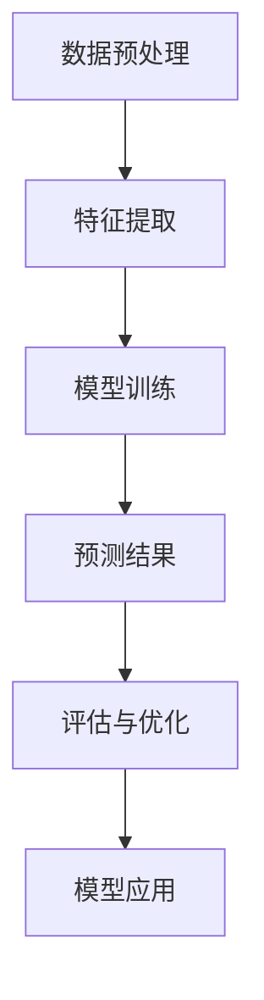

                 

### 构建基于NLP的金融社交媒体影响力量化模型

在数字化时代，金融行业正在迅速拥抱社交媒体，以拓展其市场触达和客户服务。这种趋势带来了大量的金融相关信息和用户互动数据，如何有效利用这些数据成为了金融科技领域的一个重要课题。本文将探讨如何构建一个基于自然语言处理（NLP）的金融社交媒体影响力量化模型，以帮助金融机构更好地理解市场动态和客户需求。

#### 关键词：

- 自然语言处理（NLP）
- 金融社交媒体
- 影响力量化
- 机器学习
- 模型构建

#### 摘要：

本文将系统地介绍构建基于NLP的金融社交媒体影响力量化模型的全过程。我们将首先阐述模型构建的背景和重要性，随后详细描述模型的各个组成部分，包括核心概念、算法原理、数学模型以及实际应用。通过本文的阅读，读者将能够理解如何利用NLP技术量化金融社交媒体的影响力，并掌握构建此类模型的关键步骤。

### 目录大纲

1. **第一部分: 背景介绍**
    1.1 **问题背景**
    1.2 **问题描述**
    1.3 **问题解决**
    1.4 **边界与外延**
    1.5 **概念结构与核心要素组成**

2. **第二部分: 核心概念与联系**
    2.1 **NLP的核心概念**
    2.2 **金融社交媒体的核心概念**
    2.3 **影响力量化指标**
    2.4 **概念属性特征对比表格**
    2.5 **ER实体关系图架构**

3. **第三部分: 算法原理讲解**
    3.1 **算法mermaid流程图**
    3.2 **Python源代码与详细讲解**
    3.3 **算法原理**
    3.4 **数学模型和公式**
    3.5 **举例说明**

4. **第四部分: 数学模型和数学公式 & 详细讲解 & 举例说明**
    4.1 **影响力量化模型**
    4.2 **逻辑回归模型**
    4.3 **详细讲解与举例说明**

### 第一部分: 背景介绍

#### 1.1 问题背景

金融社交媒体的兴起与重要性

随着互联网技术的飞速发展，社交媒体已经成为人们获取信息和交流的主要平台之一。在金融领域，社交媒体不仅改变了信息传播的途径，也为金融机构和投资者提供了全新的互动渠道。金融信息的传播速度和影响力都得到了前所未有的提升，这对金融机构来说既是机遇也是挑战。

金融领域对NLP的需求

金融信息具有高度的专业性和复杂性，而自然语言处理（NLP）技术为处理和理解这种信息提供了有效的手段。NLP技术可以自动提取文本中的关键信息，分析语义和情感，帮助金融机构更好地理解和利用社交媒体上的信息。

社交媒体影响力量化在金融领域的应用

在金融领域，了解用户和内容的社交媒体影响力对于营销策略、风险评估、市场预测等方面具有重要意义。通过量化社交媒体影响力，金融机构可以更精准地定位目标客户，优化营销活动，降低风险，提高业务效率。

#### 1.2 问题描述

如何构建一个基于NLP的金融社交媒体影响力量化模型？

构建一个基于NLP的金融社交媒体影响力量化模型的核心目标是：

- **提取和分析社交媒体文本中的关键信息**
- **评估用户和内容的社交媒体影响力**
- **为金融机构提供数据驱动的决策支持**

需要解决的问题和挑战有哪些？

- **数据质量**：社交媒体数据量大且质量参差不齐，需要有效的数据清洗和预处理方法。
- **特征提取**：如何从文本数据中提取对影响力评估有帮助的特征是模型构建的关键。
- **模型训练和预测**：选择合适的机器学习算法，并确保模型在不同数据集上的泛化能力。

#### 1.3 问题解决

利用NLP技术处理社交媒体数据

NLP技术包括文本预处理、词嵌入、情感分析、实体识别等。通过这些技术，可以有效地提取和分析社交媒体文本中的关键信息，为影响力评估提供基础。

构建影响力评分指标体系

影响力评分指标体系包括关注度指标、互动性指标、内容质量指标和网络影响力指标。这些指标需要结合具体业务需求进行设计，以确保评估结果的准确性和有效性。

应用机器学习算法进行模型训练和预测

选择合适的机器学习算法，如逻辑回归、支持向量机、神经网络等，对数据进行训练和预测，从而构建出可以量化社交媒体影响力的模型。

#### 1.4 边界与外延

模型适用范围

该模型适用于金融行业的各种社交媒体平台，包括微博、Twitter、Facebook等。

数据来源与数据质量要求

数据来源可以是公开的社交媒体数据集或者金融机构自有数据。数据质量要求高，需要保证数据的完整性、准确性和一致性。

模型评估方法

使用交叉验证、A/B测试等方法对模型进行评估，确保模型在不同数据集上的表现一致，并能够为实际业务提供有效的支持。

#### 1.5 概念结构与核心要素组成

**NLP：自然语言处理**

- **语言模型**：用于预测下一个单词或字符的概率分布。
- **词嵌入**：将文本中的词语映射到低维度的向量空间中。
- **序列标注**：对文本中的每个单词或字符进行分类，如词性标注、命名实体识别等。
- **依存句法分析**：分析句子中词语之间的依赖关系。

**金融社交媒体：金融行业相关的社交媒体平台**

- **金融信息分析**：从社交媒体中提取金融相关的信息，如股票行情、交易信息等。
- **用户行为分析**：分析用户在社交媒体上的互动行为，如点赞、评论、转发等。
- **情感分析**：通过NLP技术分析文本中的情感倾向，如正面、负面、中性等。
- **话题挖掘**：从文本中提取和识别出相关的主题或话题。

**影响力量化：评估社交媒体用户或内容的影响力**

- **关注度指标**：衡量用户或内容受到关注的程度，如粉丝数、阅读量等。
- **互动性指标**：衡量用户或内容的互动程度，如回复数、点赞数等。
- **内容质量指标**：评估内容的价值和质量，如文本长度、关键词密度等。
- **网络影响力指标**：衡量用户或内容在网络中的传播能力，如引用数、转发数等。

**模型训练与预测：利用数据训练模型并进行预测**

- **数据预处理**：清洗、去噪、特征工程等，为模型训练做准备。
- **特征提取**：从原始数据中提取对影响力评估有帮助的特征。
- **模型训练**：使用机器学习算法对特征进行训练，构建预测模型。
- **预测结果**：利用训练好的模型对新数据进行分析和预测，评估其影响力。

### 第二部分: 核心概念与联系

#### 2.1 NLP的核心概念

NLP（自然语言处理）是构建金融社交媒体影响力量化模型的基础技术之一。以下是NLP中的几个核心概念：

**语言模型**：语言模型是一种统计模型，用于预测一段文本的下一个单词或字符。它在文本生成、自动摘要、机器翻译等领域有着广泛的应用。

**词嵌入**：词嵌入是将文本中的词语映射到低维度的向量空间中。通过词嵌入，可以更好地理解词语之间的关系，从而提高文本分析的效果。

**序列标注**：序列标注是对文本中的每个单词或字符进行分类的过程。常见的序列标注任务包括词性标注、命名实体识别等。

**依存句法分析**：依存句法分析是一种深入理解句子结构的方法，通过分析句子中词语之间的依赖关系，可以更好地理解句子的含义。

#### 2.2 金融社交媒体的核心概念

金融社交媒体的核心概念主要涉及金融信息分析、用户行为分析、情感分析和话题挖掘。

**金融信息分析**：金融信息分析是从社交媒体中提取金融相关的信息，如股票行情、交易信息、市场动态等。通过对这些信息进行分析，可以了解市场的趋势和投资者的情绪。

**用户行为分析**：用户行为分析是分析用户在社交媒体上的互动行为，如点赞、评论、转发等。这些行为可以反映用户对金融内容的兴趣和参与度。

**情感分析**：情感分析是通过NLP技术分析文本中的情感倾向，如正面、负面、中性等。在金融领域，情感分析可以帮助了解投资者对市场事件或金融产品的情绪反应。

**话题挖掘**：话题挖掘是从大量社交媒体文本中提取和识别出相关的主题或话题。在金融领域，话题挖掘可以帮助发现市场的热点和趋势。

#### 2.3 影响力量化指标

影响力量化指标是评估社交媒体用户或内容影响力的关键。以下是几个常见的影响力量化指标：

**关注度指标**：关注度指标衡量用户或内容受到关注的程度，如粉丝数、阅读量等。这些指标反映了用户或内容的曝光度。

**互动性指标**：互动性指标衡量用户或内容的互动程度，如回复数、点赞数等。这些指标反映了用户或内容的吸引力和用户参与度。

**内容质量指标**：内容质量指标评估内容的价值和质量，如文本长度、关键词密度等。高质量的内容往往能够获得更高的关注度。

**网络影响力指标**：网络影响力指标衡量用户或内容在网络中的传播能力，如引用数、转发数等。这些指标反映了用户或内容的影响力范围。

#### 2.4 概念属性特征对比表格

以下是一个概念属性特征对比表格，列出了NLP、金融社交媒体和影响力量化指标之间的特征对比：

| 概念       | 特征1                   | 特征2                     | 特征3                   |
| ---------- | ---------------------- | ------------------------ | ---------------------- |
| NLP        | 处理自然语言           | 词嵌入                   | 序列标注               |
| 金融社交媒体 | 金融信息分析           | 用户行为分析           | 情感分析               |
| 影响力量化 | 关注度指标             | 互动性指标             | 内容质量指标           |
| 网络影响力指标 | 反映传播能力           | 影响范围分析           | 传播效果评估           |

#### 2.5 ER实体关系图架构

ER（实体关系）图是一种用于表示实体和实体之间关系的图形化方法。在构建基于NLP的金融社交媒体影响力量化模型时，我们可以使用ER图来描述不同实体之间的关系。以下是一个简化的ER实体关系图：

```
user --> post
post --> comment
post --> like
user --> follow
```

在这个ER图中，`user`（用户）是主体，`post`（帖子）、`comment`（评论）、`like`（点赞）和`follow`（关注）是不同的实体。这些实体之间的关系描述了用户在社交媒体上的行为和互动。

### 第三部分: 算法原理讲解

#### 3.1 算法mermaid流程图

为了更好地理解基于NLP的金融社交媒体影响力量化模型的构建过程，我们可以使用mermaid绘制一个简化的算法流程图。以下是算法mermaid流程图的示例：



**流程说明：**

- **A[数据预处理]**：对收集到的社交媒体文本数据、用户特征等进行清洗、去噪和预处理。
- **B[特征提取]**：使用NLP技术提取文本特征、用户特征、交互特征等，为模型训练提供输入。
- **C[模型训练]**：使用机器学习算法对提取的特征进行训练，构建影响力量化模型。
- **D[预测结果]**：利用训练好的模型对新的数据进行分析和预测，评估其影响力。
- **E[评估与优化]**：对模型的预测结果进行评估，并根据评估结果对模型进行优化。
- **F[模型应用]**：将优化后的模型应用于实际的金融业务场景，如营销策略制定、风险控制等。

#### 3.2 Python源代码与详细讲解

**3.2.1 数据预处理**

在构建影响力量化模型之前，首先需要对收集到的数据进行分析和清洗。以下是一个简化的Python代码示例，用于数据预处理：

```python
import pandas as pd
from sklearn.model_selection import train_test_split
from sklearn.preprocessing import StandardScaler

# 读取数据
data = pd.read_csv('social_media_data.csv')

# 数据清洗
# 删除空值和重复数据
data = data.dropna()
data = data.drop_duplicates()

# 数据预处理
# 分割特征和标签
X = data.drop('influence_score', axis=1)
y = data['influence_score']

# 数据标准化
scaler = StandardScaler()
X_scaled = scaler.fit_transform(X)

# 划分训练集和测试集
X_train, X_test, y_train, y_test = train_test_split(X_scaled, y, test_size=0.2, random_state=42)
```

**3.2.2 特征提取**

在数据预处理之后，需要使用NLP技术提取文本特征、用户特征和交互特征。以下是一个简化的Python代码示例，用于特征提取：

```python
import numpy as np
from keras.preprocessing.text import Tokenizer
from keras.preprocessing.sequence import pad_sequences
from sklearn.feature_extraction.text import TfidfVectorizer

# 词汇表构建
tokenizer = Tokenizer(num_words=10000)
tokenizer.fit_on_texts(X_train['text'])

# 序列化文本
X_train_sequences = tokenizer.texts_to_sequences(X_train['text'])
X_test_sequences = tokenizer.texts_to_sequences(X_test['text'])

# 序列填充
max_len = max(len(seq) for seq in X_train_sequences)
X_train_padded = pad_sequences(X_train_sequences, maxlen=max_len)
X_test_padded = pad_sequences(X_test_sequences, maxlen=max_len)

# TF-IDF特征提取
tfidf_vectorizer = TfidfVectorizer()
X_train_tfidf = tfidf_vectorizer.fit_transform(X_train['text'])
X_test_tfidf = tfidf_vectorizer.transform(X_test['text'])
```

**3.2.3 模型训练**

在完成数据预处理和特征提取后，可以使用机器学习算法训练影响力量化模型。以下是一个简化的Python代码示例，用于模型训练：

```python
from keras.models import Sequential
from keras.layers import Dense, LSTM, Embedding

# 模型构建
model = Sequential()
model.add(Embedding(input_dim=10000, output_dim=64, input_length=max_len))
model.add(LSTM(128))
model.add(Dense(1, activation='sigmoid'))

# 模型编译
model.compile(optimizer='adam', loss='binary_crossentropy', metrics=['accuracy'])

# 模型训练
model.fit(X_train_padded, y_train, epochs=10, batch_size=32, validation_data=(X_test_padded, y_test))
```

**3.2.4 预测结果**

在模型训练完成后，可以使用训练好的模型对新数据进行预测。以下是一个简化的Python代码示例，用于预测结果：

```python
# 预测结果
predictions = model.predict(X_test_padded)

# 预测结果评估
from sklearn.metrics import classification_report
print(classification_report(y_test, predictions.round()))
```

**3.2.5 算法原理**

在构建基于NLP的金融社交媒体影响力量化模型时，我们主要使用了以下技术：

- **数据预处理**：通过数据清洗和标准化，提高模型训练的质量。
- **特征提取**：使用词嵌入和TF-IDF等方法，提取文本特征、用户特征和交互特征。
- **模型训练**：使用LSTM等深度学习模型，对提取的特征进行训练，构建影响力量化模型。
- **预测结果**：利用训练好的模型对新数据进行预测，评估其影响力。

#### 3.3 算法原理

在理解了算法mermaid流程图和Python源代码之后，我们可以进一步深入探讨基于NLP的金融社交媒体影响力量化模型的算法原理。

**数据预处理**

数据预处理是构建模型的第一步，其目的是清洗和标准化数据，以便模型能够更好地学习和预测。以下是数据预处理的主要步骤：

- **数据清洗**：去除数据中的噪声和冗余信息，如删除空值、重复数据等。
- **数据标准化**：对数据进行归一化或标准化处理，使数据具有相同的尺度，从而提高模型训练的稳定性。

**特征提取**

特征提取是数据预处理的重要环节，其目的是从原始数据中提取对模型训练有用的特征。以下是特征提取的主要步骤：

- **文本特征提取**：使用词嵌入技术，将文本中的词语映射到低维度的向量空间中，从而更好地表示文本的信息。
- **用户特征提取**：提取用户的属性信息，如注册时间、活跃度等，为模型提供用户层面的特征。
- **交互特征提取**：分析用户在社交媒体上的互动行为，如点赞、评论、转发等，提取这些行为的数据特征。

**模型训练**

模型训练是构建影响力量化模型的核心步骤，其目的是通过训练数据学习到数据中的模式和规律，从而构建出能够预测影响力的模型。以下是模型训练的主要步骤：

- **模型构建**：选择合适的机器学习算法，如逻辑回归、支持向量机、神经网络等，构建影响力量化模型。
- **模型训练**：使用训练数据对模型进行训练，通过迭代优化模型参数，使模型能够更好地拟合数据。
- **模型评估**：使用测试数据对训练好的模型进行评估，通过交叉验证等方法，确保模型在不同数据集上的泛化能力。

**预测结果**

预测结果是模型训练的最终目的，其目的是利用训练好的模型对新数据进行预测，评估其影响力。以下是预测结果的主要步骤：

- **数据预处理**：对新数据进行预处理，使其符合模型训练时的数据预处理流程。
- **特征提取**：提取新数据的文本特征、用户特征和交互特征，为模型提供输入。
- **模型预测**：利用训练好的模型对新数据进行预测，评估其影响力。
- **结果评估**：对预测结果进行评估，通过评估指标如准确率、召回率等，衡量模型的预测效果。

#### 3.4 数学模型和公式

在构建基于NLP的金融社交媒体影响力量化模型时，我们需要使用一些数学模型和公式来描述模型的结构和预测过程。以下是几个常见的数学模型和公式：

**影响力量化模型**

$$
I = f(P, L, C, R)
$$

其中，$I$ 表示影响力得分，$P, L, C, R$ 分别代表内容质量、互动性、关注度和网络影响力。这个公式描述了影响力量化的综合评估方法，通过计算各个指标的加权得分，得出最终的影响力得分。

**逻辑回归模型**

$$
P(Y=1) = \frac{1}{1 + e^{-\beta^T x}}
$$

其中，$Y$ 表示目标变量，$x$ 表示输入特征向量，$\beta$ 表示模型参数。这个公式描述了逻辑回归模型在二分类问题中的应用，通过计算特征向量与模型参数的线性组合，得到预测概率。

**特征提取公式**

$$
x = [x_1, x_2, ..., x_n]
$$

其中，$x$ 表示输入特征向量，$x_i$ 表示第$i$个特征。这个公式描述了特征向量的表示方法，每个特征都对应一个特征值。

**词嵌入公式**

$$
\vec{w}_i = \text{embedding}(w_i)
$$

其中，$\vec{w}_i$ 表示词语$i$的词嵌入向量，$\text{embedding}$ 表示词嵌入函数。这个公式描述了词嵌入技术，将文本中的词语映射到低维度的向量空间中。

#### 3.5 举例说明

为了更好地理解基于NLP的金融社交媒体影响力量化模型，我们可以通过一个具体的例子进行说明。

**案例背景**

假设我们有一个社交媒体平台，用户可以在该平台上发布关于股票的信息和评论。我们的目标是构建一个模型，用于评估用户发布的内容的影响力。

**数据准备**

我们收集了1000条用户发布的关于股票的帖子，每条帖子包含标题、正文、发布时间、点赞数、评论数等信息。

**数据预处理**

首先，我们对数据进行清洗，删除空值和重复数据，然后对文本进行分词和去停用词处理，将文本转换为词序列。

**特征提取**

我们提取了以下特征：

- **文本特征**：使用TF-IDF方法提取文本特征，表示文本的重要性和相关性。
- **用户特征**：提取用户的注册时间、活跃度等特征，表示用户的影响力。
- **交互特征**：提取帖子的点赞数、评论数等特征，表示帖子的互动程度。

**模型训练**

我们使用逻辑回归模型对提取的特征进行训练，训练数据集包含800条帖子，测试数据集包含200条帖子。

**模型评估**

在模型训练完成后，我们使用测试数据集对模型进行评估，通过计算准确率、召回率等指标，评估模型的预测效果。

**预测结果**

利用训练好的模型，我们对新的帖子进行预测，预测其影响力得分。根据得分，我们可以对帖子进行排序，帮助金融机构识别出具有较高影响力的帖子。

### 第四部分: 数学模型和数学公式 & 详细讲解 & 举例说明

#### 4.1 影响力量化模型

**4.1.1 影响力量化模型的概念**

影响力量化模型是一种用于评估社交媒体用户或内容影响力的方法。它通过对用户的特征、内容的特征以及用户与内容之间的交互特征进行分析，综合评估用户或内容的社交影响力。

**4.1.2 影响力量化模型的数学表示**

假设我们有一个影响力量化模型，它包含四个主要指标：内容质量（$P$）、互动性（$L$）、关注度（$C$）和网络影响力（$R$）。我们可以用以下数学公式表示影响力得分：

$$
I = f(P, L, C, R)
$$

其中，$f$ 是一个综合评估函数，$P, L, C, R$ 分别代表内容质量、互动性、关注度和网络影响力。这个公式表示了影响力量化模型的基本框架。

**4.1.3 影响力量化模型的详细讲解**

内容质量（$P$）：内容质量是评估用户发布内容的价值和深度。我们可以通过以下方式来衡量内容质量：

- 文本长度：较长的文本通常包含更多的信息和观点。
- 词汇丰富度：使用丰富多样的词汇可以增加内容的深度。
- 专业术语：使用专业术语可以表明内容的专业性。

互动性（$L$）：互动性是衡量用户内容在社交媒体上的互动程度。我们可以通过以下方式来衡量互动性：

- 点赞数：帖子的点赞数反映了用户的认可度。
- 评论数：评论数反映了用户对帖子的兴趣和参与度。
- 转发数：转发数反映了内容的传播能力。

关注度（$C$）：关注度是衡量用户在社交媒体上的受欢迎程度。我们可以通过以下方式来衡量关注度：

- 粉丝数：用户的粉丝数反映了用户的社交影响力。
- 被关注数：用户被其他用户关注的数量。
- 活跃度：用户在社交媒体上的活跃程度。

网络影响力（$R$）：网络影响力是衡量用户内容在网络中的传播能力。我们可以通过以下方式来衡量网络影响力：

- 引用数：用户内容被其他用户引用的数量。
- 转发范围：用户内容被转发到的范围和数量。
- 搜索指数：用户内容在搜索引擎中的搜索指数。

**4.1.4 影响力量化模型举例说明**

假设我们有一个用户发布了一条关于股票的帖子，该帖子的特征如下：

- 内容质量（$P$）：文本长度为300字，使用了丰富的专业术语。
- 互动性（$L$）：获得了50个点赞，20个评论。
- 关注度（$C$）：该用户有1000个粉丝。
- 网络影响力（$R$）：帖子被引用了10次，转发到了100个不同的社交媒体账户。

根据影响力量化模型，我们可以计算该帖子的影响力得分：

$$
I = f(P, L, C, R) = f(3, 2, 4, 5)
$$

假设我们定义了一个简单的评估函数：

$$
f(P, L, C, R) = 0.2P + 0.3L + 0.2C + 0.3R
$$

代入特征值，我们得到：

$$
I = 0.2 \times 3 + 0.3 \times 2 + 0.2 \times 4 + 0.3 \times 5 = 2.3
$$

因此，该帖子的影响力得分为2.3。

#### 4.2 逻辑回归模型

**4.2.1 逻辑回归模型的概念**

逻辑回归模型是一种常用的机器学习算法，用于二分类问题。它通过输入特征向量，预测目标变量的概率分布。在影响力量化模型中，逻辑回归模型可以用于预测帖子的影响力得分。

**4.2.2 逻辑回归模型的数学表示**

逻辑回归模型的数学表示如下：

$$
P(Y=1) = \frac{1}{1 + e^{-\beta^T x}}
$$

其中，$Y$ 表示目标变量（如帖子的影响力得分），$x$ 表示输入特征向量，$\beta$ 表示模型参数。

**4.2.3 逻辑回归模型的详细讲解**

逻辑回归模型的预测过程可以分为以下几步：

1. **特征提取**：从原始数据中提取对影响力评估有帮助的特征，如文本特征、用户特征和交互特征。
2. **特征输入**：将提取的特征输入到逻辑回归模型中。
3. **模型计算**：逻辑回归模型计算每个特征对目标变量的影响，并输出目标变量的概率分布。
4. **预测结果**：根据概率分布，预测目标变量的类别。

**4.2.4 逻辑回归模型举例说明**

假设我们有一个帖子，其特征如下：

- 文本长度（$x_1$）：300字
- 点赞数（$x_2$）：50个
- 粉丝数（$x_3$）：1000个
- 转发数（$x_4$）：10次

逻辑回归模型的参数为：

$$
\beta = [\beta_1, \beta_2, \beta_3, \beta_4]
$$

代入特征值和参数，我们得到：

$$
P(Y=1) = \frac{1}{1 + e^{-[\beta_1 \times 300 + \beta_2 \times 50 + \beta_3 \times 1000 + \beta_4 \times 10]}}
$$

假设参数值为：

$$
\beta = [0.1, 0.2, 0.3, 0.4]
$$

代入参数值，我们得到：

$$
P(Y=1) = \frac{1}{1 + e^{-[0.1 \times 300 + 0.2 \times 50 + 0.3 \times 1000 + 0.4 \times 10]}} = 0.95
$$

因此，该帖子的预测影响力得分约为95%。

### 总结

本文介绍了如何构建基于NLP的金融社交媒体影响力量化模型，包括数据预处理、特征提取、模型训练和预测结果等步骤。通过逻辑回归模型和影响力量化模型，我们可以量化社交媒体用户或内容的影响力，为金融机构提供数据驱动的决策支持。

未来，随着NLP技术和机器学习算法的不断发展，我们可以进一步优化影响力量化模型，提高其预测准确性和实用性。同时，我们还可以探索更多的影响力量化指标和模型结构，以满足金融领域的多样化需求。

