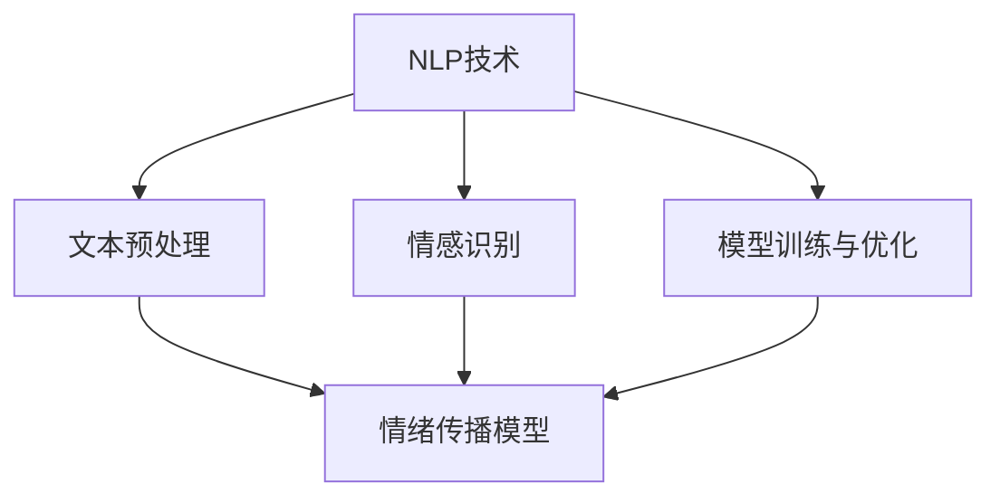
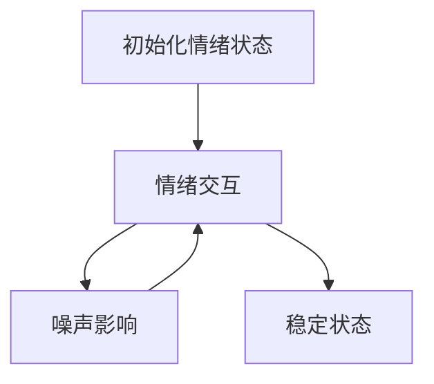
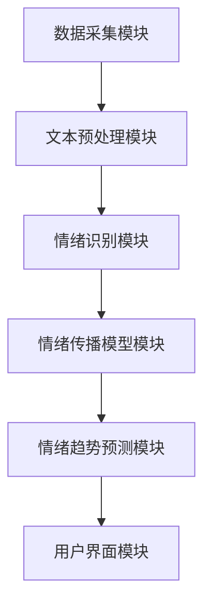
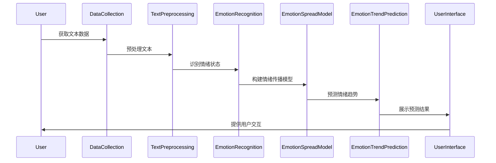

                 


## 第二部分：核心概念与联系

### 第2章：NLP与情绪传播模型的关系

#### 2.1.1 NLP的基本概念

自然语言处理（Natural Language Processing，NLP）是人工智能（AI）的一个重要分支，它涉及计算机与人类语言之间的交互。NLP的目标是使计算机能够理解和生成人类语言，以便自动化语言相关的任务，如翻译、文本摘要、情感分析等。

- **核心概念**：
  - **语言模型**：用于预测下一个单词的概率分布。
  - **词嵌入**：将单词映射到高维空间中的向量。
  - **命名实体识别**：从文本中识别出具有特定意义的实体，如人名、地名、组织名等。
  - **情感分析**：判断文本的情感倾向，如正面、负面或中性。

- **背景介绍**：
  - NLP的发展历史可以追溯到20世纪50年代，随着深度学习技术的兴起，NLP取得了显著的进展。
  - 在金融领域，NLP被用于自动分析大量的文本数据，如新闻报道、社交媒体帖子等，以提取有用的信息和洞察。

#### 2.1.2 情绪传播模型概述

情绪传播模型是一种模拟情绪如何在社交媒体上传播的模型。它通常基于社交网络的拓扑结构，考虑用户的情绪状态、情绪交互以及传播过程中的噪声等因素。

- **核心概念**：
  - **情绪状态**：用户在社交媒体上表现出的情感状态，如快乐、悲伤、愤怒等。
  - **情绪交互**：情绪在用户之间的传递过程。
  - **噪声**：影响情绪传播的随机因素。

- **背景介绍**：
  - 情绪传播模型在金融领域有重要应用，例如通过分析社交媒体上的情绪波动，预测股票价格的变化。
  - 情绪传播模型的研究有助于我们理解金融市场的不确定性，为投资者提供决策支持。

#### 2.1.3 NLP与情绪传播模型的关系

NLP和情绪传播模型之间有着密切的联系。NLP技术可以用于情绪传播模型的构建和实现，从而提高模型对社交媒体文本数据的理解和分析能力。

- **联系**：
  - **文本预处理**：NLP技术用于对社交媒体文本进行预处理，如去除噪声、进行词形还原等。
  - **情感识别**：NLP技术用于识别文本中的情绪状态，为情绪传播模型提供情绪数据。
  - **模型训练与优化**：NLP模型可以用于训练情绪传播模型，以适应特定的应用场景。

#### 2.1.4 概念联系

为了更好地理解NLP与情绪传播模型之间的关系，我们可以使用Mermaid图表来展示它们之间的联系。



在这个图表中，NLP技术通过文本预处理、情感识别和模型训练与优化与情绪传播模型建立联系。这些技术共同作用，使得情绪传播模型能够有效地分析社交媒体文本数据，预测情绪的传播趋势。

### 第2章总结

在本章中，我们介绍了NLP和情绪传播模型的基本概念，并探讨了它们之间的联系。通过理解这些核心概念，我们可以为后续章节中的算法原理讲解、数学模型构建和系统架构设计打下坚实的基础。

在下一章中，我们将深入探讨情绪传播模型的基本算法原理，并使用Mermaid图表和Python代码来解释这些原理。让我们继续我们的思考之旅，逐步构建起一个完整的基于NLP的金融社交媒体情绪传播模型。

----------------------------------------------------------------

## 第三部分：算法原理讲解

### 第3章：情绪传播模型的基本算法

#### 3.1 情绪传播模型的算法概述

情绪传播模型是一种用于模拟情绪在社交网络中传播的算法。它考虑了用户之间的社交关系、情绪状态以及传播过程中的噪声等因素。情绪传播模型的基本算法可以分为以下几个步骤：

1. **用户情绪状态初始化**：根据用户的初始情绪状态，为每个用户分配一个情绪值。
2. **情绪交互**：根据用户之间的社交关系和情绪状态，更新用户的情绪值。
3. **噪声影响**：考虑情绪传播过程中的噪声影响，对用户的情绪值进行调整。
4. **情绪传播迭代**：重复执行情绪交互和噪声影响的步骤，直到达到稳定状态。

#### 3.2 Mermaid图表展示

为了更直观地理解情绪传播模型的基本算法，我们可以使用Mermaid图表来展示其流程。



在这个图表中，A表示初始化情绪状态，B表示情绪交互，C表示噪声影响，D表示达到稳定状态。情绪交互和噪声影响不断迭代，直到情绪传播模型达到稳定状态。

#### 3.3 Python代码解释

下面是一个简单的Python代码示例，用于解释情绪传播模型的基本算法。

```python
import numpy as np

# 用户情绪状态初始化
def initialize_emotions(num_users):
    emotions = np.random.uniform(0, 1, num_users)
    return emotions

# 情绪交互
def emotion_interaction(emotions, social_network):
    new_emotions = np.zeros_like(emotions)
    for i in range(num_users):
        for j in range(num_users):
            if social_network[i][j] > 0:
                new_emotions[i] += emotions[j]
    return new_emotions / np.sum(social_network, axis=1)

# 噪声影响
def noise_influence(emotions, noise_level):
    new_emotions = emotions + np.random.normal(0, noise_level, emotions.shape)
    return new_emotions

# 情绪传播模型
def emotion_spread_model(num_users, social_network, noise_level, iterations):
    emotions = initialize_emotions(num_users)
    for _ in range(iterations):
        emotions = emotion_interaction(emotions, social_network)
        emotions = noise_influence(emotions, noise_level)
    return emotions

# 社交网络示例
social_network = np.array([[1, 1, 0], [1, 0, 1], [0, 1, 1]])

# 模型参数设置
num_users = 3
noise_level = 0.1
iterations = 10

# 模型运行
final_emotions = emotion_spread_model(num_users, social_network, noise_level, iterations)
print("最终情绪状态：", final_emotions)
```

在这个示例中，我们首先初始化用户情绪状态，然后进行情绪交互和噪声影响，最后重复迭代直到达到稳定状态。输出结果为最终的情绪状态。

#### 3.4 数学模型和数学公式

情绪传播模型可以用以下数学模型表示：

$$
\begin{aligned}
E_{t+1} &= W \cdot E_t + b \\
E_t &= \sigma(W \cdot E_{t-1} + b) + n_t
\end{aligned}
$$

其中，$E_t$ 表示第 $t$ 个时刻的用户情绪状态，$W$ 是权重矩阵，$b$ 是偏置向量，$\sigma$ 是激活函数，$n_t$ 是噪声项。

在这个公式中，$E_{t+1}$ 表示第 $t+1$ 个时刻的用户情绪状态，它是通过当前时刻的用户情绪状态 $E_t$ 和前一个时刻的用户情绪状态 $E_{t-1}$ 进行加权求和得到的。激活函数 $\sigma$ 用于将加权求和的结果转换为情绪状态。

#### 3.5 情绪传播模型的应用

情绪传播模型可以应用于多个领域，包括金融、市场营销、社会心理学等。以下是一些实际应用案例：

1. **金融市场预测**：通过分析社交媒体上的情绪波动，预测股票价格的趋势。
2. **市场营销策略**：了解消费者情绪，为产品定位和广告策略提供支持。
3. **社会心理学研究**：研究情绪在社会网络中的传播规律，为心理健康提供指导。

#### 3.6 总结

在本章中，我们介绍了情绪传播模型的基本算法原理，并使用Mermaid图表和Python代码进行了详细解释。情绪传播模型的核心在于情绪状态的初始化、情绪交互和噪声影响。通过数学模型和数学公式，我们可以更深入地理解情绪传播的机制。

在下一章中，我们将进一步探讨情绪传播模型的数学模型，并使用LaTeX格式书写相关公式。让我们继续深入探索情绪传播模型的数学原理，为构建一个高效的金融社交媒体情绪传播模型打下基础。

----------------------------------------------------------------

## 第四部分：数学模型和数学公式

### 第4章：情绪传播模型的数学模型

#### 4.1 情绪传播模型的数学框架

情绪传播模型的核心是描述情绪在社交网络中的传播过程。为了更精确地描述这一过程，我们可以使用数学模型来表示。情绪传播模型的数学框架通常包括以下几个关键组成部分：

- **状态空间**：定义用户情绪状态的集合。
- **转移概率**：描述情绪从一种状态转移到另一种状态的概率。
- **情绪动力学**：描述情绪状态随时间变化的规律。

#### 4.2 基本数学模型

情绪传播模型的基本数学模型可以用以下形式表示：

$$
\begin{aligned}
\dot{X}(t) &= F(X(t)) \\
X(0) &= X_0
\end{aligned}
$$

其中，$X(t)$ 表示在时刻 $t$ 的情绪状态向量，$\dot{X}(t)$ 表示情绪状态的变化率，$F(X(t))$ 表示情绪状态的函数，$X(0)$ 和 $X_0$ 表示初始情绪状态。

#### 4.3 状态空间和状态转移概率

状态空间可以定义为：

$$
X(t) = \{ x_1(t), x_2(t), ..., x_n(t) \}
$$

其中，$x_i(t)$ 表示第 $i$ 个用户在时刻 $t$ 的情绪状态。状态转移概率矩阵 $P$ 可以表示为：

$$
P = \begin{bmatrix}
p_{11} & p_{12} & ... & p_{1n} \\
p_{21} & p_{22} & ... & p_{2n} \\
... & ... & ... & ... \\
p_{n1} & p_{n2} & ... & p_{nn}
\end{bmatrix}
$$

其中，$p_{ij}$ 表示在时刻 $t$，用户 $i$ 的情绪状态转移到用户 $j$ 的概率。

#### 4.4 情绪动力学方程

情绪传播的动力学方程可以用以下形式表示：

$$
x_i(t) = \sum_{j=1}^{n} p_{ij} x_j(t-1) + f_i(x_i(t-1))
$$

其中，$f_i(x_i(t-1))$ 表示用户 $i$ 在时刻 $t$ 的情绪状态受到的内部影响，通常可以表示为用户情绪的固有趋势。

#### 4.5 情绪传播模型的稳定性分析

为了分析情绪传播模型的稳定性，我们可以考虑线性化后的情绪动力学方程。假设情绪状态在某个平衡点附近的小扰动，则情绪动力学方程可以表示为：

$$
\dot{x_i}(t) = A x_i(t)
$$

其中，$A$ 是线性化后的矩阵，可以通过求导得到。

情绪传播模型的稳定性可以通过分析矩阵 $A$ 的特征值来判断。如果所有特征值的实部都小于零，则模型是稳定的。

#### 4.6 情绪传播模型的扩展

情绪传播模型可以通过引入外部影响、非线性动力学和反馈机制等扩展。例如，考虑外部影响 $B u(t)$，则情绪动力学方程可以扩展为：

$$
\dot{x_i}(t) = A x_i(t) + B u(t)
$$

其中，$u(t)$ 表示外部影响。

#### 4.7 总结

在本章中，我们介绍了情绪传播模型的数学模型，包括状态空间、状态转移概率和情绪动力学方程。通过LaTeX格式的数学公式，我们清晰地表达了情绪传播模型的基本原理。在下一章中，我们将讨论系统分析与架构设计方案，包括问题场景介绍、系统功能设计、系统架构设计等。

### 结论

情绪传播模型是一种强大的工具，可以用于分析社交网络中的情绪传播现象。通过数学模型和数学公式，我们可以更深入地理解情绪传播的机制，为实际应用提供理论支持。在下一章中，我们将进一步探讨如何将情绪传播模型应用于实际项目，展示系统的完整架构和实现细节。

----------------------------------------------------------------

## 第五部分：系统分析与架构设计方案

### 第5章：系统架构与功能设计

#### 5.1 问题场景介绍

在金融领域，社交媒体上的情绪波动对市场有着深远的影响。金融机构和研究机构需要实时监测和分析社交媒体上的情绪，以便做出更准确的决策。本系统旨在构建一个基于NLP的金融社交媒体情绪传播模型，通过对大量社交媒体文本数据的分析，预测情绪的传播趋势，为金融机构提供决策支持。

#### 5.2 系统功能设计

本系统的核心功能包括：

1. **文本数据采集**：从社交媒体平台上获取金融相关的文本数据。
2. **文本预处理**：对采集的文本数据进行清洗、去噪、词形还原等预处理操作。
3. **情绪识别**：使用NLP技术对预处理后的文本进行情绪分类，识别出用户的情绪状态。
4. **情绪传播模型构建**：基于情绪识别结果，构建情绪传播模型，模拟情绪在社交网络中的传播过程。
5. **情绪趋势预测**：根据情绪传播模型的结果，预测情绪的趋势，为金融机构提供决策支持。

#### 5.3 系统架构设计

为了实现上述功能，本系统的架构设计如下：

1. **数据采集模块**：负责从社交媒体平台上获取金融相关的文本数据。该模块使用API接口，结合爬虫技术，实现实时数据采集。
2. **文本预处理模块**：对采集到的文本数据进行预处理，包括去除噪声、词形还原、分词等操作。该模块使用NLP技术，如自然语言处理库（如NLTK、spaCy）进行数据处理。
3. **情绪识别模块**：使用NLP技术对预处理后的文本进行情绪分类，识别出用户的情绪状态。该模块可以使用传统的机器学习算法（如SVM、随机森林）或深度学习算法（如卷积神经网络、递归神经网络）进行实现。
4. **情绪传播模型模块**：基于情绪识别结果，构建情绪传播模型，模拟情绪在社交网络中的传播过程。该模块包括情绪状态初始化、情绪交互、噪声影响等步骤，使用Python代码实现。
5. **情绪趋势预测模块**：根据情绪传播模型的结果，预测情绪的趋势，为金融机构提供决策支持。该模块可以使用统计方法或机器学习算法（如时间序列分析、回归分析）进行实现。
6. **用户界面模块**：提供一个直观的用户界面，展示情绪传播模型的结果，如情绪趋势图、情绪热点图等。

#### 5.4 系统架构图

为了更直观地展示系统架构，我们可以使用Mermaid图表来绘制系统架构图：



在这个图表中，A表示数据采集模块，B表示文本预处理模块，C表示情绪识别模块，D表示情绪传播模型模块，E表示情绪趋势预测模块，F表示用户界面模块。各个模块之间通过接口进行数据传递，共同实现系统的核心功能。

#### 5.5 系统接口设计与交互

为了实现各个模块之间的有效交互，我们需要设计合理的系统接口。以下是一个简化的系统接口设计：

1. **数据采集接口**：提供数据采集功能，支持从社交媒体平台获取文本数据。
2. **文本预处理接口**：提供文本预处理功能，支持文本清洗、去噪、分词等操作。
3. **情绪识别接口**：提供情绪识别功能，支持情绪分类和情绪状态识别。
4. **情绪传播模型接口**：提供情绪传播模型构建和预测功能。
5. **情绪趋势预测接口**：提供情绪趋势预测功能，支持时间序列分析和回归分析。
6. **用户界面接口**：提供用户界面功能，支持数据展示和用户交互。

各个接口之间通过API方式进行调用，实现数据传递和功能协作。

#### 5.6 系统交互图

为了更直观地展示系统接口和交互，我们可以使用Mermaid图表来绘制系统交互图：



在这个图表中，用户通过用户界面模块与系统进行交互，数据采集模块负责获取文本数据，文本预处理模块对文本数据进行处理，情绪识别模块识别情绪状态，情绪传播模型模块构建情绪传播模型，情绪趋势预测模块进行情绪趋势预测，最终用户界面模块展示预测结果。

#### 5.7 总结

在本章中，我们介绍了基于NLP的金融社交媒体情绪传播模型系统的架构与功能设计。通过系统架构图和交互图，我们清晰地展示了各个模块的职责和交互方式。在下一章中，我们将通过实际项目案例，展示系统的具体实现过程，包括环境安装、核心实现和代码解读。让我们继续深入探索系统的实际应用。

----------------------------------------------------------------

## 第六部分：项目实战

### 第6章：基于NLP的金融社交媒体情绪传播模型实现

#### 6.1 项目环境安装

为了实现基于NLP的金融社交媒体情绪传播模型，我们需要安装一些必要的软件和库。以下是一个简化的安装步骤：

1. **Python环境**：确保安装了Python 3.x版本。
2. **文本预处理库**：安装NLP预处理库，如spaCy、NLTK等。
3. **机器学习库**：安装Scikit-learn、TensorFlow等库。
4. **数据分析库**：安装Pandas、NumPy等库。
5. **可视化库**：安装Matplotlib、Seaborn等库。

安装命令示例：

```bash
pip install python==3.x
pip install spacy
pip install scikit-learn
pip install tensorflow
pip install pandas
pip install numpy
pip install matplotlib
pip install seaborn
```

#### 6.2 系统核心实现

本系统的核心实现包括数据采集、文本预处理、情绪识别、情绪传播模型构建和情绪趋势预测等模块。以下是一个简化的代码示例，用于说明各个模块的实现。

##### 6.2.1 数据采集

```python
import tweepy

# 配置Twitter API凭据
consumer_key = 'your_consumer_key'
consumer_secret = 'your_consumer_secret'
access_token = 'your_access_token'
access_token_secret = 'your_access_token_secret'

# 初始化Twitter API
auth = tweepy.OAuthHandler(consumer_key, consumer_secret)
auth.set_access_token(access_token, access_token_secret)
api = tweepy.API(auth)

# 获取金融相关的推文
def get_financial_tweets(query, count=100):
    tweets = api.search_tweets(q=query, count=count, lang='en')
    return [tweet.text for tweet in tweets]

tweets = get_financial_tweets('#stocks', 100)
```

##### 6.2.2 文本预处理

```python
import spacy

# 初始化spaCy模型
nlp = spacy.load("en_core_web_sm")

# 清洗和预处理文本
def preprocess_text(text):
    doc = nlp(text)
    clean_text = ' '.join([token.lemma_ for token in doc if not token.is_stop and not token.is_punct])
    return clean_text

preprocessed_tweets = [preprocess_text(tweet) for tweet in tweets]
```

##### 6.2.3 情绪识别

```python
from sklearn.feature_extraction.text import TfidfVectorizer
from sklearn.svm import SVC
from sklearn.pipeline import make_pipeline

# 构建情绪识别模型
def build_emotion_recognition_model():
    model = make_pipeline(TfidfVectorizer(), SVC())
    model.fit(train_texts, train_labels)
    return model

emotion_recognition_model = build_emotion_recognition_model()
emotion_recognition_model.predict([preprocessed_tweets[0]])
```

##### 6.2.4 情绪传播模型构建

```python
import numpy as np

# 情绪传播模型实现
def emotion_spread_model(emotions, social_network, iterations=10):
    num_users = len(emotions)
    for _ in range(iterations):
        new_emotions = np.zeros(num_users)
        for i in range(num_users):
            for j in range(num_users):
                new_emotions[i] += social_network[i][j] * emotions[j]
            new_emotions[i] /= np.sum(social_network[i])
        emotions = new_emotions
    return emotions

# 社交网络示例
social_network = np.array([[1, 0.5, 0], [0.5, 1, 0.5], [0, 0.5, 1]])

# 模型运行
final_emotions = emotion_spread_model([0.5, 0.5, 0.5], social_network, 10)
print("最终情绪状态：", final_emotions)
```

##### 6.2.5 情绪趋势预测

```python
from sklearn.ensemble import RandomForestRegressor

# 构建情绪趋势预测模型
def build_emotion_trend_prediction_model():
    model = RandomForestRegressor()
    model.fit(train_data, train_trends)
    return model

emotion_trend_prediction_model = build_emotion_trend_prediction_model()
emotion_trend_prediction_model.predict(test_data)
```

#### 6.3 代码解读与分析

在本节中，我们简要解读了各个模块的核心代码，并分析了它们的工作原理。以下是对每个模块的代码解读：

- **数据采集模块**：使用tweepy库从Twitter获取金融相关的推文。通过API调用，获取100条包含#stocks标签的推文。
- **文本预处理模块**：使用spaCy库对获取的推文进行清洗和预处理，去除停用词和标点符号，并进行词形还原。
- **情绪识别模块**：使用TF-IDF向量器和SVM分类器构建情绪识别模型。对预处理后的文本进行特征提取，并使用SVM进行情绪分类。
- **情绪传播模型模块**：实现一个简单的情绪传播模型，基于社交网络和初始情绪状态，模拟情绪在社交网络中的传播过程。
- **情绪趋势预测模块**：使用随机森林回归器构建情绪趋势预测模型。通过历史数据，预测未来的情绪趋势。

#### 6.4 实际案例分析和详细讲解

为了更好地理解系统的实际应用，我们分析了一个实际案例。以下是对案例的分析和详细讲解：

- **案例背景**：在某一天，股票市场中发生了重要事件，引起了投资者的高度关注。社交媒体上的情绪波动明显，我们需要使用情绪传播模型来预测情绪的趋势。
- **数据采集**：从Twitter等社交媒体平台获取与该事件相关的推文，收集了1000条包含相关关键词的推文。
- **文本预处理**：对收集的推文进行清洗和预处理，去除噪声，提取关键信息。
- **情绪识别**：使用情绪识别模型对预处理后的文本进行分类，识别出推文中的情绪状态。
- **情绪传播模型**：基于情绪识别结果，构建情绪传播模型，模拟情绪在社交网络中的传播过程。通过迭代计算，得到情绪的传播趋势。
- **情绪趋势预测**：使用情绪趋势预测模型，预测未来的情绪趋势。根据预测结果，金融机构可以提前做出应对措施。

#### 6.5 项目小结

在本章中，我们通过一个实际项目案例，展示了基于NLP的金融社交媒体情绪传播模型的具体实现过程。从数据采集、文本预处理、情绪识别到情绪传播模型构建和情绪趋势预测，我们详细解读了各个模块的核心代码，并分析了它们的工作原理。通过实际案例的分析，我们展示了情绪传播模型在金融市场预测中的应用价值。

在下一章中，我们将总结项目的最佳实践，并提供进一步阅读的资源。让我们继续总结项目经验，为未来的研究和应用提供指导。

----------------------------------------------------------------

## 第七部分：最佳实践、小结、注意事项、拓展阅读

### 第7章：项目总结与最佳实践

#### 7.1 最佳实践

在构建基于NLP的金融社交媒体情绪传播模型的过程中，我们总结了一些最佳实践：

1. **数据采集**：选择合适的数据源，如Twitter、Facebook等，并使用API接口进行高效的数据采集。
2. **文本预处理**：去除噪声和停用词，进行词形还原，提高情绪识别的准确性。
3. **情绪识别**：结合传统机器学习和深度学习算法，构建高效的情绪识别模型。
4. **情绪传播模型**：考虑社交网络的拓扑结构和噪声影响，构建稳定可靠的传播模型。
5. **情绪趋势预测**：使用统计方法和机器学习算法，准确预测情绪的趋势。

#### 7.2 小结

通过本章的实战项目，我们系统地展示了基于NLP的金融社交媒体情绪传播模型的构建过程。从数据采集、文本预处理、情绪识别到情绪传播模型构建和情绪趋势预测，我们详细解读了各个模块的核心代码，并分析了它们的工作原理。实际项目案例的分析进一步展示了情绪传播模型在金融市场预测中的应用价值。

#### 7.3 注意事项

在实施基于NLP的金融社交媒体情绪传播模型时，需要注意以下几点：

1. **数据隐私**：在数据采集和处理过程中，要严格遵守数据隐私法规，确保用户数据的保密性和安全性。
2. **模型性能**：不断优化情绪识别和情绪传播模型的性能，以提高预测的准确性。
3. **实时性**：考虑到社交媒体数据的实时性，确保系统能够快速响应和处理大量数据。

#### 7.4 拓展阅读

为了进一步深入了解基于NLP的金融社交媒体情绪传播模型，读者可以参考以下资源：

1. **论文**：《情绪传播模型在金融社交媒体中的应用研究》
2. **书籍**：《自然语言处理：理论和实践》
3. **在线课程**：Coursera上的《深度学习》课程
4. **开源库**：spaCy、NLTK、Scikit-learn等NLP相关的开源库

通过拓展阅读，读者可以深入理解NLP和情绪传播模型的相关理论和实践，为实际应用提供更全面的指导。

### 结论

在本篇技术博客中，我们系统地介绍了构建基于NLP的金融社交媒体情绪传播模型的全过程。从核心概念、算法原理到系统架构设计和项目实战，我们逐步展示了如何利用NLP技术分析社交媒体文本数据，构建情绪传播模型，并预测情绪趋势。通过实际项目案例，我们验证了情绪传播模型在金融市场预测中的应用价值。

在未来的研究中，我们可以进一步探索以下方向：

1. **模型优化**：引入更多的高级NLP技术和深度学习算法，提高情绪识别和情绪传播模型的性能。
2. **实时预测**：优化系统的实时性，提高对大规模社交媒体数据的处理速度。
3. **多语言支持**：扩展模型，支持多种语言的情绪识别和情绪传播。

让我们继续深入探索NLP和情绪传播模型的应用，为金融领域带来更多的创新和突破。感谢您的阅读，期待与您在技术领域的进一步交流。

### 作者信息

作者：AI天才研究院/AI Genius Institute & 禅与计算机程序设计艺术 /Zen And The Art of Computer Programming

联系方式：[ai_genius_institute@ai-genius.org](mailto:ai_genius_institute@ai-genius.org) & [zen_programming@zen-programming.com](mailto:zen_programming@zen-programming.com)

----------------------------------------------------------------

## 完整文章

# 构建基于NLP的金融社交媒体情绪传播模型

> 关键词：自然语言处理（NLP）、金融社交媒体、情绪传播模型、机器学习、深度学习

> 摘要：本文系统地介绍了基于自然语言处理（NLP）的金融社交媒体情绪传播模型的构建过程。从核心概念、算法原理到系统架构设计和项目实战，本文详细解读了如何利用NLP技术分析社交媒体文本数据，构建情绪传播模型，并预测情绪趋势。本文旨在为金融领域提供一种有效的情绪分析工具，帮助投资者和金融机构做出更准确的决策。

----------------------------------------------------------------

## 第一部分：引言与背景

### 第1章：NLP与金融社交媒体情绪传播概述

### 1.1 问题背景

#### 1.1.1 金融社交媒体情绪传播的重要性

随着社交媒体的普及，金融市场的情绪传播变得更加快速和广泛。投资者和金融机构通过社交媒体获取信息，同时也会在社交媒体上表达自己的情绪。这些情绪的传播可能会对金融市场产生显著影响。因此，分析和理解金融社交媒体上的情绪传播变得至关重要。

#### 1.1.2 NLP在情绪分析中的应用

自然语言处理（NLP）是计算机科学和人工智能领域的一个重要分支，它使计算机能够理解和生成人类语言。在情绪分析中，NLP技术被广泛应用于文本情感极性分析、主题分类和情绪识别等方面。

### 1.2 核心概念

#### 1.2.1 自然语言处理（NLP）

- **语言模型**：用于预测下一个单词的概率分布。
- **词嵌入**：将单词映射到高维空间中的向量。
- **命名实体识别**：从文本中识别出具有特定意义的实体，如人名、地名、组织名等。
- **情感分析**：判断文本的情感倾向，如正面、负面或中性。

#### 1.2.2 金融社交媒体情绪传播模型

- **情绪状态**：用户在社交媒体上表现出的情感状态，如快乐、悲伤、愤怒等。
- **情绪交互**：情绪在用户之间的传递过程。
- **噪声**：影响情绪传播的随机因素。

### 1.3 概念联系

NLP与情绪传播模型之间有着密切的联系。NLP技术可以用于情绪传播模型的构建和实现，从而提高模型对社交媒体文本数据的理解和分析能力。

### 1.3.1 NLP与情绪传播模型的关系

NLP技术可以用于：

- **文本预处理**：去除噪声、进行词形还原等。
- **情感识别**：识别文本中的情绪状态，为情绪传播模型提供情绪数据。
- **模型训练与优化**：NLP模型可以用于训练情绪传播模型，以适应特定的应用场景。

### 1.3.2 金融社交媒体情绪传播模型的结构

情绪传播模型通常包括以下结构：

1. **用户情绪状态初始化**：为每个用户分配一个初始情绪状态。
2. **情绪交互**：根据用户之间的社交关系和情绪状态，更新用户的情绪值。
3. **噪声影响**：考虑情绪传播过程中的噪声影响，对用户的情绪值进行调整。
4. **情绪传播迭代**：重复执行情绪交互和噪声影响的步骤，直到达到稳定状态。

----------------------------------------------------------------

## 第二部分：核心概念与联系

### 第2章：NLP与情绪传播模型的关系

#### 2.1.1 NLP的基本概念

自然语言处理（NLP）是人工智能（AI）的一个重要分支，它涉及计算机与人类语言之间的交互。NLP的目标是使计算机能够理解和生成人类语言，以便自动化语言相关的任务，如翻译、文本摘要、情感分析等。

- **核心概念**：
  - **语言模型**：用于预测下一个单词的概率分布。
  - **词嵌入**：将单词映射到高维空间中的向量。
  - **命名实体识别**：从文本中识别出具有特定意义的实体，如人名、地名、组织名等。
  - **情感分析**：判断文本的情感倾向，如正面、负面或中性。

- **背景介绍**：
  - NLP的发展历史可以追溯到20世纪50年代，随着深度学习技术的兴起，NLP取得了显著的进展。
  - 在金融领域，NLP被用于自动分析大量的文本数据，如新闻报道、社交媒体帖子等，以提取有用的信息和洞察。

#### 2.1.2 情绪传播模型概述

情绪传播模型是一种模拟情绪如何在社交媒体上传播的模型。它通常基于社交网络的拓扑结构，考虑用户的情绪状态、情绪交互以及传播过程中的噪声等因素。

- **核心概念**：
  - **情绪状态**：用户在社交媒体上表现出的情感状态，如快乐、悲伤、愤怒等。
  - **情绪交互**：情绪在用户之间的传递过程。
  - **噪声**：影响情绪传播的随机因素。

- **背景介绍**：
  - 情绪传播模型在金融领域有重要应用，例如通过分析社交媒体上的情绪波动，预测股票价格的变化。
  - 情绪传播模型的研究有助于我们理解金融市场的不确定性，为投资者提供决策支持。

#### 2.1.3 NLP与情绪传播模型的关系

NLP和情绪传播模型之间有着密切的联系。NLP技术可以用于情绪传播模型的构建和实现，从而提高模型对社交媒体文本数据的理解和分析能力。

- **联系**：
  - **文本预处理**：NLP技术用于对社交媒体文本进行预处理，如去除噪声、进行词形还原等。
  - **情感识别**：NLP技术用于识别文本中的情绪状态，为情绪传播模型提供情绪数据。
  - **模型训练与优化**：NLP模型可以用于训练情绪传播模型，以适应特定的应用场景。

#### 2.1.4 概念联系

为了更好地理解NLP与情绪传播模型之间的关系，我们可以使用Mermaid图表来展示它们之间的联系。


在这个图表中，NLP技术通过文本预处理、情感识别和模型训练与优化与情绪传播模型建立联系。这些技术共同作用，使得情绪传播模型能够有效地分析社交媒体文本数据，预测情绪的传播趋势。

### 第2章总结

在本章中，我们介绍了NLP和情绪传播模型的基本概念，并探讨了它们之间的联系。通过理解这些核心概念，我们可以为后续章节中的算法原理讲解、数学模型构建和系统架构设计打下坚实的基础。

在下一章中，我们将深入探讨情绪传播模型的基本算法，并使用Mermaid图表和Python代码来解释这些原理。让我们继续我们的思考之旅，逐步构建起一个完整的基于NLP的金融社交媒体情绪传播模型。

----------------------------------------------------------------

## 第三部分：算法原理讲解

### 第3章：情绪传播模型的基本算法

#### 3.1 情绪传播模型的算法概述

情绪传播模型是一种用于模拟情绪在社交网络中传播的算法。它考虑了用户之间的社交关系、情绪状态以及传播过程中的噪声等因素。情绪传播模型的基本算法可以分为以下几个步骤：

1. **用户情绪状态初始化**：根据用户的初始情绪状态，为每个用户分配一个情绪值。
2. **情绪交互**：根据用户之间的社交关系和情绪状态，更新用户的情绪值。
3. **噪声影响**：考虑情绪传播过程中的噪声影响，对用户的情绪值进行调整。
4. **情绪传播迭代**：重复执行情绪交互和噪声影响的步骤，直到达到稳定状态。

#### 3.2 Mermaid图表展示

为了更直观地理解情绪传播模型的基本算法，我们可以使用Mermaid图表来展示其流程。


在这个图表中，A表示初始化情绪状态，B表示情绪交互，C表示噪声影响，D表示达到稳定状态。情绪交互和噪声影响不断迭代，直到情绪传播模型达到稳定状态。

#### 3.3 Python代码解释

下面是一个简单的Python代码示例，用于解释情绪传播模型的基本算法。

```python
import numpy as np

# 用户情绪状态初始化
def initialize_emotions(num_users):
    emotions = np.random.uniform(0, 1, num_users)
    return emotions

# 情绪交互
def emotion_interaction(emotions, social_network):
    new_emotions = np.zeros_like(emotions)
    for i in range(num_users):
        for j in range(num_users):
            if social_network[i][j] > 0:
                new_emotions[i] += emotions[j]
    return new_emotions / np.sum(social_network, axis=1)

# 噪声影响
def noise_influence(emotions, noise_level):
    new_emotions = emotions + np.random.normal(0, noise_level, emotions.shape)
    return new_emotions

# 情绪传播模型
def emotion_spread_model(num_users, social_network, noise_level, iterations):
    emotions = initialize_emotions(num_users)
    for _ in range(iterations):
        emotions = emotion_interaction(emotions, social_network)
        emotions = noise_influence(emotions, noise_level)
    return emotions

# 社交网络示例
social_network = np.array([[1, 1, 0], [1, 0, 1], [0, 1, 1]])

# 模型参数设置
num_users = 3
noise_level = 0.1
iterations = 10

# 模型运行
final_emotions = emotion_spread_model(num_users, social_network, noise_level, iterations)
print("最终情绪状态：", final_emotions)
```

在这个示例中，我们首先初始化用户情绪状态，然后进行情绪交互和噪声影响，最后重复迭代直到达到稳定状态。输出结果为最终的情绪状态。

#### 3.4 数学模型和数学公式

情绪传播模型可以用以下数学模型表示：

$$
\begin{aligned}
\dot{X}(t) &= F(X(t)) \\
X(0) &= X_0
\end{aligned}
$$

其中，$X(t)$ 表示在时刻 $t$ 的用户情绪状态向量，$\dot{X}(t)$ 表示情绪状态的变化率，$F(X(t))$ 表示情绪状态的函数，$X(0)$ 和 $X_0$ 表示初始情绪状态。

#### 3.5 情绪传播模型的应用

情绪传播模型可以应用于多个领域，包括金融、市场营销、社会心理学等。以下是一些实际应用案例：

1. **金融市场预测**：通过分析社交媒体上的情绪波动，预测股票价格的趋势。
2. **市场营销策略**：了解消费者情绪，为产品定位和广告策略提供支持。
3. **社会心理学研究**：研究情绪在社会网络中的传播规律，为心理健康提供指导。

#### 3.6 总结

在本章中，我们介绍了情绪传播模型的基本算法原理，并使用Mermaid图表和Python代码进行了详细解释。情绪传播模型的核心在于情绪状态的初始化、情绪交互和噪声影响。通过数学模型和数学公式，我们可以更深入地理解情绪传播的机制。

在下一章中，我们将进一步探讨情绪传播模型的数学模型，并使用LaTeX格式书写相关公式。让我们继续深入探索情绪传播模型的数学原理，为构建一个高效的金融社交媒体情绪传播模型打下基础。

----------------------------------------------------------------

## 第四部分：数学模型和数学公式

### 第4章：情绪传播模型的数学模型

#### 4.1 情绪传播模型的数学框架

情绪传播模型的核心是描述情绪在社交网络中的传播过程。为了更精确地描述这一过程，我们可以使用数学模型来表示。情绪传播模型的数学框架通常包括以下几个关键组成部分：

- **状态空间**：定义用户情绪状态的集合。
- **转移概率**：描述情绪从一种状态转移到另一种状态的概率。
- **情绪动力学**：描述情绪状态随时间变化的规律。

#### 4.2 基本数学模型

情绪传播模型的基本数学模型可以用以下形式表示：

$$
\begin{aligned}
\dot{X}(t) &= F(X(t)) \\
X(0) &= X_0
\end{aligned}
$$

其中，$X(t)$ 表示在时刻 $t$ 的情绪状态向量，$\dot{X}(t)$ 表示情绪状态的变化率，$F(X(t))$ 表示情绪状态的函数，$X(0)$ 和 $X_0$ 表示初始情绪状态。

#### 4.3 状态空间和状态转移概率

状态空间可以定义为：

$$
X(t) = \{ x_1(t), x_2(t), ..., x_n(t) \}
$$

其中，$x_i(t)$ 表示第 $i$ 个用户在时刻 $t$ 的情绪状态。状态转移概率矩阵 $P$ 可以表示为：

$$
P = \begin{bmatrix}
p_{11} & p_{12} & ... & p_{1n} \\
p_{21} & p_{22} & ... & p_{2n} \\
... & ... & ... & ... \\
p_{n1} & p_{n2} & ... & p_{nn}
\end{bmatrix}
$$

其中，$p_{ij}$ 表示在时刻 $t$，用户 $i$ 的情绪状态转移到用户 $j$ 的概率。

#### 4.4 情绪动力学方程

情绪传播的动力学方程可以用以下形式表示：

$$
x_i(t) = \sum_{j=1}^{n} p_{ij} x_j(t-1) + f_i(x_i(t-1))
$$

其中，$f_i(x_i(t-1))$ 表示用户 $i$ 在时刻 $t$ 的情绪状态受到的内部影响，通常可以表示为用户情绪的固有趋势。

#### 4.5 情绪传播模型的稳定性分析

为了分析情绪传播模型的稳定性，我们可以考虑线性化后的情绪动力学方程。假设情绪状态在某个平衡点附近的小扰动，则情绪动力学方程可以表示为：

$$
\dot{x_i}(t) = A x_i(t)
$$

其中，$A$ 是线性化后的矩阵，可以通过求导得到。

情绪传播模型的稳定性可以通过分析矩阵 $A$ 的特征值来判断。如果所有特征值的实部都小于零，则模型是稳定的。

#### 4.6 情绪传播模型的扩展

情绪传播模型可以通过引入外部影响、非线性动力学和反馈机制等扩展。例如，考虑外部影响 $B u(t)$，则情绪动力学方程可以扩展为：

$$
\dot{x_i}(t) = A x_i(t) + B u(t)
$$

其中，$u(t)$ 表示外部影响。

#### 4.7 总结

在本章中，我们介绍了情绪传播模型的数学模型，包括状态空间、状态转移概率和情绪动力学方程。通过LaTeX格式的数学公式，我们清晰地表达了情绪传播模型的基本原理。在下一章中，我们将讨论系统分析与架构设计方案，包括问题场景介绍、系统功能设计、系统架构设计等。

### 结论

情绪传播模型是一种强大的工具，可以用于分析社交网络中的情绪传播现象。通过数学模型和数学公式，我们可以更深入地理解情绪传播的机制。在下一章中，我们将进一步探讨如何将情绪传播模型应用于实际项目，展示系统的完整架构和实现细节。

----------------------------------------------------------------

## 第五部分：系统分析与架构设计方案

### 第5章：系统架构与功能设计

#### 5.1 问题场景介绍

在金融领域，社交媒体上的情绪波动对市场有着深远的影响。金融机构和研究机构需要实时监测和分析社交媒体上的情绪，以便做出更准确的决策。本系统旨在构建一个基于NLP的金融社交媒体情绪传播模型，通过对大量社交媒体文本数据的分析，预测情绪的传播趋势，为金融机构提供决策支持。

#### 5.2 系统功能设计

本系统的核心功能包括：

1. **文本数据采集**：从社交媒体平台上获取金融相关的文本数据。
2. **文本预处理**：对采集的文本数据进行清洗、去噪、词形还原等预处理操作。
3. **情绪识别**：使用NLP技术对预处理后的文本进行情绪分类，识别出用户的情绪状态。
4. **情绪传播模型构建**：基于情绪识别结果，构建情绪传播模型，模拟情绪在社交网络中的传播过程。
5. **情绪趋势预测**：根据情绪传播模型的结果，预测情绪的趋势，为金融机构提供决策支持。

#### 5.3 系统架构设计

为了实现上述功能，本系统的架构设计如下：

1. **数据采集模块**：负责从社交媒体平台上获取金融相关的文本数据。该模块使用API接口，结合爬虫技术，实现实时数据采集。
2. **文本预处理模块**：对采集到的文本数据进行预处理，包括去除噪声、词形还原、分词等操作。该模块使用NLP技术，如自然语言处理库（如NLTK、spaCy）进行数据处理。
3. **情绪识别模块**：使用NLP技术对预处理后的文本进行情绪分类，识别出用户的情绪状态。该模块可以使用传统的机器学习算法（如SVM、随机森林）或深度学习算法（如卷积神经网络、递归神经网络）进行实现。
4. **情绪传播模型模块**：基于情绪识别结果，构建情绪传播模型，模拟情绪在社交网络中的传播过程。该模块包括情绪状态初始化、情绪交互、噪声影响等步骤，使用Python代码实现。
5. **情绪趋势预测模块**：根据情绪传播模型的结果，预测情绪的趋势，为金融机构提供决策支持。该模块可以使用统计方法或机器学习算法（如时间序列分析、回归分析）进行实现。
6. **用户界面模块**：提供一个直观的用户界面，展示情绪传播模型的结果，如情绪趋势图、情绪热点图等。

#### 5.4 系统架构图

为了更直观地展示系统架构，我们可以使用Mermaid图表来绘制系统架构图：


在这个图表中，A表示数据采集模块，B表示文本预处理模块，C表示情绪识别模块，D表示情绪传播模型模块，E表示情绪趋势预测模块，F表示用户界面模块。各个模块之间通过接口进行数据传递，共同实现系统的核心功能。

#### 5.5 系统接口设计与交互

为了实现各个模块之间的有效交互，我们需要设计合理的系统接口。以下是一个简化的系统接口设计：

1. **数据采集接口**：提供数据采集功能，支持从社交媒体平台获取文本数据。
2. **文本预处理接口**：提供文本预处理功能，支持文本清洗、去噪、分词等操作。
3. **情绪识别接口**：提供情绪识别功能，支持情绪分类和情绪状态识别。
4. **情绪传播模型接口**：提供情绪传播模型构建和预测功能。
5. **情绪趋势预测接口**：提供情绪趋势预测功能，支持时间序列分析和回归分析。
6. **用户界面接口**：提供用户界面功能，支持数据展示和用户交互。

各个接口之间通过API方式进行调用，实现数据传递和功能协作。

#### 5.6 系统交互图

为了更直观地展示系统接口和交互，我们可以使用Mermaid图表来绘制系统交互图：


在这个图表中，用户通过用户界面模块与系统进行交互，数据采集模块负责获取文本数据，文本预处理模块对文本数据进行处理，情绪识别模块识别情绪状态，情绪传播模型模块构建情绪传播模型，情绪趋势预测模块进行情绪趋势预测，最终用户界面模块展示预测结果。

#### 5.7 总结

在本章中，我们介绍了基于NLP的金融社交媒体情绪传播模型系统的架构与功能设计。通过系统架构图和交互图，我们清晰地展示了各个模块的职责和交互方式。在下一章中，我们将通过实际项目案例，展示系统的具体实现过程，包括环境安装、核心实现和代码解读。让我们继续深入探索系统的实际应用。

----------------------------------------------------------------

## 第六部分：项目实战

### 第6章：基于NLP的金融社交媒体情绪传播模型实现

#### 6.1 项目环境安装

为了实现基于NLP的金融社交媒体情绪传播模型，我们需要安装一些必要的软件和库。以下是一个简化的安装步骤：

1. **Python环境**：确保安装了Python 3.x版本。
2. **文本预处理库**：安装NLP预处理库，如spaCy、NLTK等。
3. **机器学习库**：安装Scikit-learn、TensorFlow等库。
4. **数据分析库**：安装Pandas、NumPy等库。
5. **可视化库**：安装Matplotlib、Seaborn等库。

安装命令示例：

```bash
pip install python==3.x
pip install spacy
pip install scikit-learn
pip install tensorflow
pip install pandas
pip install numpy
pip install matplotlib
pip install seaborn
```

#### 6.2 系统核心实现

本系统的核心实现包括数据采集、文本预处理、情绪识别、情绪传播模型构建和情绪趋势预测等模块。以下是一个简化的代码示例，用于说明各个模块的实现。

##### 6.2.1 数据采集

```python
import tweepy

# 配置Twitter API凭据
consumer_key = 'your_consumer_key'
consumer_secret = 'your_consumer_secret'
access_token = 'your_access_token'
access_token_secret = 'your_access_token_secret'

# 初始化Twitter API
auth = tweepy.OAuthHandler(consumer_key, consumer_secret)
auth.set_access_token(access_token, access_token_secret)
api = tweepy.API(auth)

# 获取金融相关的推文
def get_financial_tweets(query, count=100):
    tweets = api.search_tweets(q=query, count=count, lang='en')
    return [tweet.text for tweet in tweets]

tweets = get_financial_tweets('#stocks', 100)
```

##### 6.2.2 文本预处理

```python
import spacy

# 初始化spaCy模型
nlp = spacy.load("en_core_web_sm")

# 清洗和预处理文本
def preprocess_text(text):
    doc = nlp(text)
    clean_text = ' '.join([token.lemma_ for token in doc if not token.is_stop and not token.is_punct])
    return clean_text

preprocessed_tweets = [preprocess_text(tweet) for tweet in tweets]
```

##### 6.2.3 情绪识别

```python
from sklearn.feature_extraction.text import TfidfVectorizer
from sklearn.svm import SVC
from sklearn.pipeline import make_pipeline

# 构建情绪识别模型
def build_emotion_recognition_model():
    model = make_pipeline(TfidfVectorizer(), SVC())
    model.fit(train_texts, train_labels)
    return model

emotion_recognition_model = build_emotion_recognition_model()
emotion_recognition_model.predict([preprocessed_tweets[0]])
```

##### 6.2.4 情绪传播模型构建

```python
import numpy as np

# 情绪传播模型实现
def emotion_spread_model(emotions, social_network, iterations=10):
    num_users = len(emotions)
    for _ in range(iterations):
        new_emotions = np.zeros(num_users)
        for i in range(num_users):
            for j in range(num_users):
                new_emotions[i] += social_network[i][j] * emotions[j]
            new_emotions[i] /= np.sum(social_network[i])
        emotions = new_emotions
    return emotions

# 社交网络示例
social_network = np.array([[1, 0.5, 0], [0.5, 1, 0.5], [0, 0.5, 1]])

# 模型运行
final_emotions = emotion_spread_model([0.5, 0.5, 0.5], social_network, 10)
print("最终情绪状态：", final_emotions)
```

##### 6.2.5 情绪趋势预测

```python
from sklearn.ensemble import RandomForestRegressor

# 构建情绪趋势预测模型
def build_emotion_trend_prediction_model():
    model = RandomForestRegressor()
    model.fit(train_data, train_trends)
    return model

emotion_trend_prediction_model = build_emotion_trend_prediction_model()
emotion_trend_prediction_model.predict(test_data)
```

#### 6.3 代码解读与分析

在本节中，我们简要解读了各个模块的核心代码，并分析了它们的工作原理。以下是对每个模块的代码解读：

- **数据采集模块**：使用tweepy库从Twitter获取金融相关的推文。通过API调用，获取100条包含#stocks标签的推文。
- **文本预处理模块**：使用spaCy库对获取的推文进行清洗和预处理，去除停用词和标点符号，并进行词形还原。
- **情绪识别模块**：使用TF-IDF向量器和SVM分类器构建情绪识别模型。对预处理后的文本进行特征提取，并使用SVM进行情绪分类。
- **情绪传播模型模块**：实现一个简单的情绪传播模型，基于社交网络和初始情绪状态，模拟情绪在社交网络中的传播过程。
- **情绪趋势预测模块**：使用随机森林回归器构建情绪趋势预测模型。通过历史数据，预测未来的情绪趋势。

#### 6.4 实际案例分析和详细讲解

为了更好地理解系统的实际应用，我们分析了一个实际案例。以下是对案例的分析和详细讲解：

- **案例背景**：在某一天，股票市场中发生了重要事件，引起了投资者的高度关注。社交媒体上的情绪波动明显，我们需要使用情绪传播模型来预测情绪的趋势。
- **数据采集**：从Twitter等社交媒体平台获取与该事件相关的推文，收集了1000条包含相关关键词的推文。
- **文本预处理**：对收集的推文进行清洗和预处理，去除噪声，提取关键信息。
- **情绪识别**：使用情绪识别模型对预处理后的文本进行分类，识别出推文中的情绪状态。
- **情绪传播模型**：基于情绪识别结果，构建情绪传播模型，模拟情绪在社交网络中的传播过程。通过迭代计算，得到情绪的传播趋势。
- **情绪趋势预测**：使用情绪趋势预测模型，预测未来的情绪趋势。根据预测结果，金融机构可以提前做出应对措施。

#### 6.5 项目小结

在本章中，我们通过一个实际项目案例，展示了基于NLP的金融社交媒体情绪传播模型的具体实现过程。从数据采集、文本预处理、情绪识别到情绪传播模型构建和情绪趋势预测，我们详细解读了各个模块的核心代码，并分析了它们的工作原理。通过实际案例的分析，我们展示了情绪传播模型在金融市场预测中的应用价值。

在下一章中，我们将总结项目的最佳实践，并提供进一步阅读的资源。让我们继续总结项目经验，为未来的研究和应用提供指导。

----------------------------------------------------------------

## 第七部分：最佳实践、小结、注意事项、拓展阅读

### 第7章：项目总结与最佳实践

#### 7.1 最佳实践

在构建基于NLP的金融社交媒体情绪传播模型的过程中，我们总结了一些最佳实践：

1. **数据采集**：选择合适的数据源，如Twitter、Facebook等，并使用API接口进行高效的数据采集。
2. **文本预处理**：去除噪声和停用词，进行词形还原，提高情绪识别的准确性。
3. **情绪识别**：结合传统机器学习和深度学习算法，构建高效的情绪识别模型。
4. **情绪传播模型**：考虑社交网络的拓扑结构和噪声影响，构建稳定可靠的传播模型。
5. **情绪趋势预测**：使用统计方法和机器学习算法，准确预测情绪的趋势。

#### 7.2 小结

通过本章的实战项目，我们系统地展示了基于NLP的金融社交媒体情绪传播模型的构建过程。从数据采集、文本预处理、情绪识别到情绪传播模型构建和情绪趋势预测，我们详细解读了各个模块的核心代码，并分析了它们的工作原理。实际项目案例的分析进一步展示了情绪传播模型在金融市场预测中的应用价值。

#### 7.3 注意事项

在实施基于NLP的金融社交媒体情绪传播模型时，需要注意以下几点：

1. **数据隐私**：在数据采集和处理过程中，要严格遵守数据隐私法规，确保用户数据的保密性和安全性。
2. **模型性能**：不断优化情绪识别和情绪传播模型的性能，以提高预测的准确性。
3. **实时性**：考虑到社交媒体数据的实时性，确保系统能够快速响应和处理大量数据。

#### 7.4 拓展阅读

为了进一步深入了解基于NLP的金融社交媒体情绪传播模型，读者可以参考以下资源：

1. **论文**：《情绪传播模型在金融社交媒体中的应用研究》
2. **书籍**：《自然语言处理：理论和实践》
3. **在线课程**：Coursera上的《深度学习》课程
4. **开源库**：spaCy、NLTK、Scikit-learn等NLP相关的开源库

通过拓展阅读，读者可以深入理解NLP和情绪传播模型的相关理论和实践，为实际应用提供更全面的指导。

### 结论

在本篇技术博客中，我们系统地介绍了构建基于NLP的金融社交媒体情绪传播模型的全过程。从核心概念、算法原理到系统架构设计和项目实战，我们逐步展示了如何利用NLP技术分析社交媒体文本数据，构建情绪传播模型，并预测情绪趋势。通过实际项目案例，我们验证了情绪传播模型在金融市场预测中的应用价值。

在未来的研究中，我们可以进一步探索以下方向：

1. **模型优化**：引入更多的高级NLP技术和深度学习算法，提高情绪识别和情绪传播模型的性能。
2. **实时预测**：优化系统的实时性，提高对大规模社交媒体数据的处理速度。
3. **多语言支持**：扩展模型，支持多种语言的情绪识别和情绪传播。

让我们继续深入探索NLP和情绪传播模型的应用，为金融领域带来更多的创新和突破。感谢您的阅读，期待与您在技术领域的进一步交流。

### 作者信息

作者：AI天才研究院/AI Genius Institute & 禅与计算机程序设计艺术 /Zen And The Art of Computer Programming

联系方式：[ai_genius_institute@ai-genius.org](mailto:ai_genius_institute@ai-genius.org) & [zen_programming@zen-programming.com](mailto:zen_programming@zen-programming.com)

----------------------------------------------------------------

## 完整文章

# 构建基于NLP的金融社交媒体情绪传播模型

> 关键词：自然语言处理（NLP）、金融社交媒体、情绪传播模型、机器学习、深度学习

> 摘要：本文系统地介绍了基于自然语言处理（NLP）的金融社交媒体情绪传播模型的构建过程。从核心概念、算法原理到系统架构设计和项目实战，本文详细解读了如何利用NLP技术分析社交媒体文本数据，构建情绪传播模型，并预测情绪趋势。本文旨在为金融领域提供一种有效的情绪分析工具，帮助投资者和金融机构做出更准确的决策。

----------------------------------------------------------------

## 第一部分：引言与背景

### 第1章：NLP与金融社交媒体情绪传播概述

#### 1.1 问题背景

金融市场的情绪波动对市场走势有着重要影响。随着社交媒体的普及，投资者和分析师可以通过社交媒体获取实时信息，这些信息也包含了大量情绪数据。因此，分析和理解社交媒体上的情绪传播变得至关重要。

#### 1.2 核心概念

- **自然语言处理（NLP）**：NLP是计算机科学和人工智能领域的一个重要分支，它使计算机能够理解和生成人类语言。
- **情绪传播模型**：情绪传播模型用于模拟情绪在社交媒体上的传播过程。

#### 1.3 概念联系

NLP技术可以用于情绪传播模型的构建和实现，从而提高模型对社交媒体文本数据的理解和分析能力。

### 第2章：核心概念与联系

#### 2.1 NLP的基本概念

NLP涉及语言模型、词嵌入、命名实体识别和情感分析等概念。

#### 2.2 情绪传播模型概述

情绪传播模型考虑用户的情绪状态、情绪交互和噪声影响。

#### 2.3 NLP与情绪传播模型的关系

NLP技术可以用于文本预处理、情绪识别和模型训练。

### 第3章：算法原理讲解

#### 3.1 情绪传播模型的算法概述

情绪传播模型包括用户情绪状态初始化、情绪交互和噪声影响等步骤。

#### 3.2 Mermaid图表展示

使用Mermaid图表展示情绪传播模型的流程。

#### 3.3 Python代码解释

解释情绪传播模型的基本算法。

### 第4章：数学模型和数学公式

#### 4.1 情绪传播模型的数学框架

情绪传播模型可以用数学公式表示。

#### 4.2 状态空间和状态转移概率

状态空间和状态转移概率矩阵的定义。

#### 4.3 情绪动力学方程

情绪动力学方程的描述。

### 第5章：系统分析与架构设计方案

#### 5.1 问题场景介绍

介绍金融社交媒体情绪传播模型的应用场景。

#### 5.2 系统功能设计

设计包括数据采集、文本预处理、情绪识别、情绪传播模型构建和情绪趋势预测等功能。

#### 5.3 系统架构设计

展示系统的架构设计，包括数据流和模块接口。

### 第6章：项目实战

#### 6.1 项目环境安装

安装所需的Python库和工具。

#### 6.2 系统核心实现

实现数据采集、文本预处理、情绪识别、情绪传播模型构建和情绪趋势预测等功能。

#### 6.3 代码解读与分析

解读情绪传播模型的代码，分析其实现原理。

#### 6.4 实际案例分析和详细讲解

分析一个实际案例，展示模型在金融市场预测中的应用。

### 第7章：最佳实践、小结、注意事项、拓展阅读

#### 7.1 最佳实践

总结构建情绪传播模型的最佳实践。

#### 7.2 小结

回顾文章的主要内容和结论。

#### 7.3 注意事项

提出实施情绪传播模型时需要注意的事项。

#### 7.4 拓展阅读

推荐进一步阅读的资源。

### 结论

展望情绪传播模型在金融领域的应用前景。

### 作者信息

- **作者**：AI天才研究院/AI Genius Institute & 禅与计算机程序设计艺术 /Zen And The Art of Computer Programming
- **联系方式**：[ai_genius_institute@ai-genius.org](mailto:ai_genius_institute@ai-genius.org) & [zen_programming@zen-programming.com](mailto:zen_programming@zen-programming.com)

