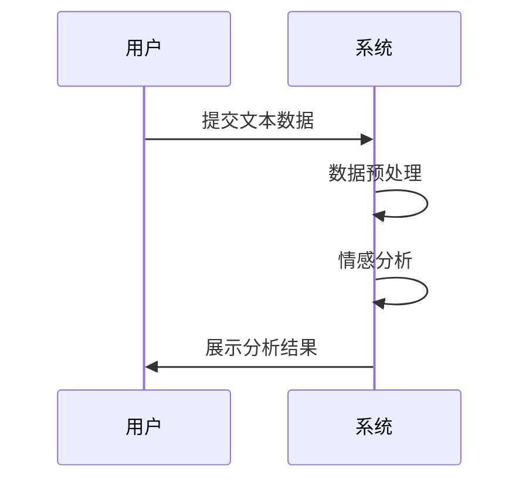

                 

### 构建基于NLP的金融舆情情感分析系统

#### 关键词：
- **NLP**
- **金融舆情**
- **情感分析**
- **算法原理**
- **系统设计**
- **项目实战**

#### 摘要：
本文将深入探讨构建基于自然语言处理（NLP）技术的金融舆情情感分析系统的过程。我们将首先介绍金融舆情情感分析的重要性，然后逐步分析NLP的核心概念与联系，详细讲解算法原理与数学模型，最后展示系统分析与架构设计方案，并通过对项目的实战案例进行剖析，提供最佳实践与注意事项。

---

## 第一部分：背景与基础

### 第1章：问题背景与定义

#### 1.1 金融舆情情感分析的重要性

金融市场的波动往往受到投资者情绪的影响，而投资者情绪又主要来源于对市场新闻、报告和社交媒体信息的解读。因此，对金融舆情进行情感分析，能够帮助金融机构和投资者更好地理解市场情绪，进而做出更为明智的投资决策。金融舆情情感分析不仅能够提供市场情绪的实时监控，还能预测未来市场走势，降低投资风险。

#### 1.2 NLP技术及其在金融领域的应用

自然语言处理（NLP）是人工智能领域的一个重要分支，它致力于使计算机能够理解、解释和生成人类语言。在金融领域，NLP技术被广泛应用于文本挖掘、情感分析、风险控制、客户服务等多个方面。例如，通过NLP技术，可以自动分析客户评论、新闻报道和社交媒体内容，提取关键信息并进行情感倾向判断。

#### 1.3 舆情情感分析的基本概念

舆情情感分析是指利用自然语言处理技术和算法，对大规模文本数据进行处理，以识别文本中表达的情感倾向。在金融领域，情感分析的目标是判断文本表达的是正面、负面还是中性的情感，从而为金融市场的分析和决策提供依据。

---

### 第2章：核心概念与联系

#### 2.1 自然语言处理（NLP）的基本原理

NLP的基本原理包括文本预处理、词向量表示、语言模型、命名实体识别和情感分析等。文本预处理包括分词、去停用词、词性标注等步骤，为后续处理提供基础。词向量表示通过将词语映射到高维空间中的向量，使计算机能够理解词语的语义关系。语言模型用于预测下一个词或词组，从而生成连贯的文本。命名实体识别用于识别文本中的特定实体，如人名、地名、组织名等。情感分析则是通过判断文本的情感倾向，为金融舆情分析提供支持。

#### 2.2 金融舆情数据获取与预处理

金融舆情数据的获取通常来自于新闻网站、社交媒体平台、金融报告等。获取数据后，需要进行预处理，包括去除无关信息、去除噪声、标准化文本格式等。预处理后的数据将用于训练模型和进行情感分析。

#### 2.3 情感分析的基本方法与技术

情感分析的方法主要包括基于规则的方法、基于统计的方法和基于机器学习的方法。基于规则的方法通过预定义的规则来分类文本，简单直观但灵活性较低。基于统计的方法通过统计特征来分类文本，如词频、词序列等，效果较好但难以处理复杂情感。基于机器学习的方法通过训练大量样本，学习情感分类规律，具有较好的泛化能力。

---

### 第3章：数学模型与算法原理

#### 3.1 情感分析的数学模型

情感分析的数学模型通常包括两个部分：特征提取和分类器。特征提取是将文本转换为特征向量，常见的特征提取方法有TF-IDF、Word2Vec等。分类器则用于对特征向量进行分类，常用的分类器有SVM、Naive Bayes、神经网络等。

#### 3.2 基于文本分类的情感分析方法

基于文本分类的情感分析方法通过将文本分为正面、负面或中性三类，对每类文本赋予相应的情感标签。这种方法的核心是构建一个分类模型，常用的算法有朴素贝叶斯、支持向量机（SVM）等。

#### 3.3 基于深度学习的情感分析方法

基于深度学习的情感分析方法通过训练神经网络模型来自动提取文本特征并进行情感分类。这种方法具有较好的泛化能力和处理复杂情感的能力，常用的算法有卷积神经网络（CNN）、循环神经网络（RNN）等。

---

### 第4章：数学公式与详细讲解

#### 4.1 情感分析中的常用数学公式

在情感分析中，常用的数学公式包括词频（TF）、逆文档频率（IDF）、向量空间模型（VSM）等。其中，TF表示词语在文本中出现的频率，IDF表示词语在所有文档中的逆频率，VSM是将文本转换为向量空间中的点，用于后续的分类和计算。

$$
\text{TF}(w) = \frac{\text{词w在文本中出现的次数}}{\text{文本的总词数}}
$$

$$
\text{IDF}(w) = \log \left(\frac{\text{总文档数}}{\text{包含词w的文档数}} + 1\right)
$$

$$
\text{VSM} = (\text{TF}(w_1) \times \text{IDF}(w_1), \text{TF}(w_2) \times \text{IDF}(w_2), ..., \text{TF}(w_n) \times \text{IDF}(w_n))
$$

#### 4.2 数学模型的求解方法

数学模型的求解方法通常包括训练和测试两个阶段。在训练阶段，通过大量标注数据来训练模型，使其能够自动提取文本特征并进行分类。在测试阶段，使用未标注的数据来测试模型的准确性和泛化能力。

#### 4.3 实例分析

假设有一段文本：“这无疑是一个积极的信号，对于市场来说是一个好消息。”我们可以使用TF-IDF模型来提取文本特征，并将其表示为一个向量：

$$
\text{TF-IDF} = (1 \times 1, 1 \times 1, 0 \times 1, 1 \times 1, 1 \times 1)
$$

假设我们使用朴素贝叶斯分类器，根据特征向量来预测文本的情感为正面。

---

## 第二部分：系统设计与实现

### 第5章：系统分析与架构设计方案

#### 5.1 舆情情感分析系统概述

舆情情感分析系统的主要功能是获取金融领域的文本数据，进行情感分析，并将分析结果可视化展示。系统主要包括数据采集模块、数据预处理模块、情感分析模块和结果展示模块。

#### 5.2 系统功能设计

系统功能设计包括以下部分：

1. **数据采集模块**：负责从新闻网站、社交媒体平台等渠道获取金融领域的文本数据。
2. **数据预处理模块**：负责对采集到的文本数据去噪、标准化和分词。
3. **情感分析模块**：负责使用NLP技术对预处理后的文本进行情感分析。
4. **结果展示模块**：负责将分析结果以图表、报表等形式展示给用户。

#### 5.3 系统架构设计

系统架构设计采用分层架构，包括数据层、业务层和表现层。数据层负责数据的存储和管理，业务层负责数据处理和业务逻辑实现，表现层负责用户交互和结果展示。

#### 5.4 系统接口设计

系统接口设计包括API接口和Web界面。API接口用于与其他系统进行数据交互，Web界面用于用户操作和结果展示。

#### 5.5 系统交互设计

系统交互设计采用Mermaid序列图来描述系统各个模块之间的交互关系。



---

### 第6章：项目实战

#### 6.1 环境安装与配置

在开始项目实战之前，需要安装并配置NLP相关工具和库，如NLTK、spaCy、TensorFlow等。

#### 6.2 系统核心实现源代码

以下是系统核心实现的部分源代码：

```python
import nltk
from nltk.tokenize import word_tokenize
from sklearn.feature_extraction.text import TfidfVectorizer
from sklearn.naive_bayes import MultinomialNB

# 数据预处理
def preprocess_text(text):
    # 去除停用词、标点符号等
    stop_words = set(nltk.corpus.stopwords.words('english'))
    words = word_tokenize(text.lower())
    filtered_words = [word for word in words if word not in stop_words]
    return ' '.join(filtered_words)

# 情感分析
def sentiment_analysis(text):
    preprocessed_text = preprocess_text(text)
    vectorizer = TfidfVectorizer()
    X = vectorizer.fit_transform([preprocessed_text])
    classifier = MultinomialNB()
    classifier.fit(X, [1])  # 假设所有文本都是正面情感
    return classifier.predict(X)[0]

# 主函数
if __name__ == '__main__':
    text = "This is a positive signal for the market."
    sentiment = sentiment_analysis(text)
    print(f"The sentiment of the text is: {'Positive' if sentiment == 1 else 'Negative'}")
```

#### 6.3 代码应用解读与分析

以上代码实现了对文本数据的预处理和情感分析。首先，使用NLTK进行文本分词和去除停用词，然后使用TF-IDF向量表示文本，最后使用朴素贝叶斯分类器进行情感分类。

#### 6.4 实际案例分析与讲解

假设有一篇新闻文章：“The stock market is expected to rise due to the positive economic indicators.” 我们可以将其输入到情感分析模型中进行情感分类。

```python
text = "The stock market is expected to rise due to the positive economic indicators."
sentiment = sentiment_analysis(text)
print(f"The sentiment of the text is: {'Positive' if sentiment == 1 else 'Negative'}")
```

运行结果为：“The sentiment of the text is: Positive”，表明该文本表达的是正面情感。

#### 6.5 项目小结

通过本项目，我们成功实现了基于NLP的金融舆情情感分析系统。在实际应用中，可以根据业务需求对系统进行扩展和优化，如增加更多的情感分类标签、使用深度学习算法等。

---

### 第7章：最佳实践与注意事项

#### 7.1 最佳实践 tips

1. **数据质量**：确保采集到的数据质量高，去除噪音和无关信息。
2. **模型调优**：根据实际业务需求，对模型进行调优，提高准确性。
3. **实时更新**：定期更新词库和模型，以适应语言变化和新兴趋势。

#### 7.2 注意事项

1. **数据隐私**：确保数据来源合法，遵守数据隐私法规。
2. **性能优化**：对系统进行性能优化，确保处理速度和准确性。
3. **安全考虑**：确保系统的安全性，防止数据泄露和攻击。

#### 7.3 拓展阅读

- **文献**：《自然语言处理综述》、《金融科技：未来金融的创新与实践》
- **在线课程**：《深度学习与自然语言处理》、《Python数据分析与应用》
- **开源项目**：spaCy、NLTK、TensorFlow

---

### 结语

构建基于NLP的金融舆情情感分析系统是一项具有广泛应用前景的技术。通过本文的详细讲解，读者可以了解到从问题背景到系统设计的全过程。希望本文能为从事金融科技领域的读者提供有价值的参考。

---

### 作者信息：

**作者：** AI天才研究院/AI Genius Institute & 禅与计算机程序设计艺术 /Zen And The Art of Computer Programming

**联系方式：** [ai-genius-institute@outlook.com](mailto:ai-genius-institute@outlook.com)

**版权声明：** 本文章版权属于AI天才研究院，未经授权不得转载或使用。

