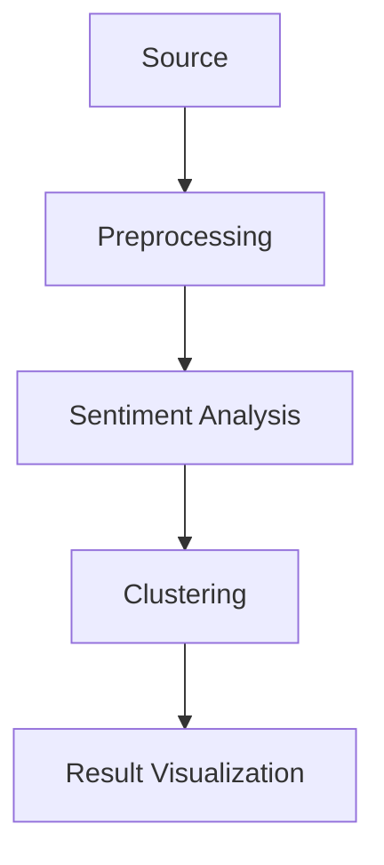
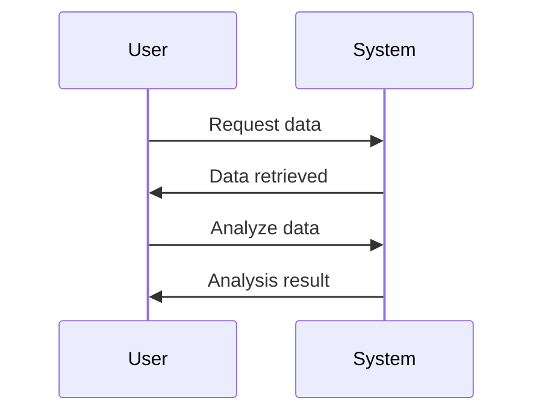
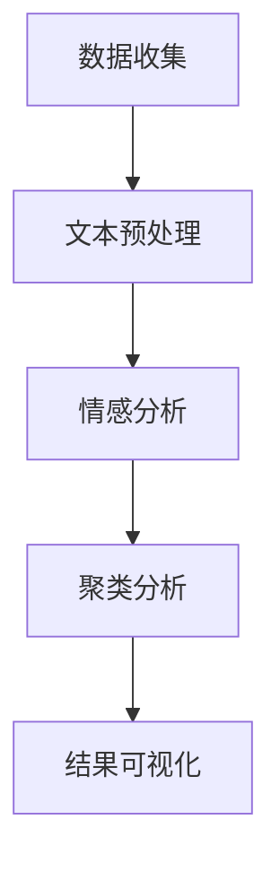
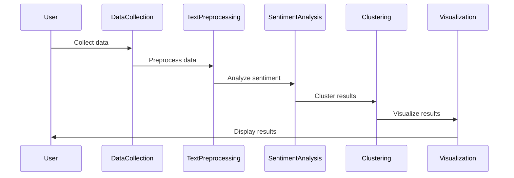

                 

# 构建基于NLP的金融舆情监控平台

> 关键词：自然语言处理（NLP）、金融舆情监控、文本预处理、情感分析、聚类分析、数学模型

> 摘要：本文深入探讨了构建基于自然语言处理（NLP）的金融舆情监控平台的方法和步骤。首先，从背景介绍入手，详细分析了金融市场的信息环境和舆情监控的重要性，以及当前舆情监控的现状。接着，明确了舆情监控的目标和面临的挑战，并提出了问题解决的技术方案和平台构建的关键步骤。随后，对核心概念如自然语言处理、舆情监控和金融信息分析进行了深入讲解，详细阐述了文本预处理算法、情感分析算法和聚类分析算法的原理和实现方法。在此基础上，通过数学模型和公式，对情感分析和聚类分析进行了详细解释。然后，从系统分析与架构设计方面，介绍了金融舆情监控平台的具体实现方案，包括系统功能设计、系统架构设计和系统接口设计。最后，通过项目实战，展示了平台的构建过程，并对核心实现源代码进行了解读和分析。

### 目录大纲

----------------------------------------------------------------

# 构建基于NLP的金融舆情监控平台

## 第1章 背景介绍

### 1.1 问题背景

#### 1.1.1 金融市场的信息环境

#### 1.1.2 舆情信息的重要性

#### 1.1.3 当前舆情监控的现状

### 1.2 问题描述

#### 1.2.1 舆情监控的目标

#### 1.2.2 舆情监控的挑战

### 1.3 问题解决

#### 1.3.1 技术方案的选择

#### 1.3.2 平台构建的关键步骤

### 1.4 边界与外延

#### 1.4.1 数据来源与质量

#### 1.4.2 监控范围与深度

#### 1.4.3 输出分析与决策支持

## 第2章 核心概念与联系

### 2.1 自然语言处理（NLP）

#### 2.1.1 NLP的定义与基本原理

#### 2.1.2 NLP的关键技术

### 2.2 舆情监控

#### 2.2.1 舆情监控的定义与分类

#### 2.2.2 舆情监控的流程

### 2.3 金融信息分析

#### 2.3.1 金融信息的基本特征

#### 2.3.2 金融信息分析的方法与工具

## 第3章 算法原理讲解

### 3.1 文本预处理算法

#### 3.1.1 数据清洗与去重

#### 3.1.2 词干提取与分词

### 3.2 情感分析算法

#### 3.2.1 基于规则的情感分析

#### 3.2.2 基于机器学习的情感分析

### 3.3 聚类分析算法

#### 3.3.1 K-means算法

#### 3.3.2 DBSCAN算法

## 第4章 数学模型和数学公式

### 4.1 情感分析数学模型

#### 4.1.1 情感分析的基本公式

$$
score = \frac{\sum_{i=1}^{n} weight_i \cdot sentiment_i}{\sum_{i=1}^{n} weight_i}
$$

#### 4.1.2 举例说明

### 4.2 聚类分析数学模型

#### 4.2.1 K-means算法公式

$$
\mu_j = \frac{1}{N_j} \sum_{i=1}^{N} x_i
$$

#### 4.2.2 DBSCAN算法公式

$$
\epsilon-\text{邻域} = \{x \in D \mid \text{dist}(x, x_j) < \epsilon\}
$$

## 第5章 系统分析与架构设计方案

### 5.1 问题场景介绍

#### 5.1.1 金融舆情监控的场景需求

### 5.2 项目介绍

#### 5.2.1 项目背景

#### 5.2.2 项目目标

### 5.3 系统功能设计

#### 5.3.1 领域模型

```mermaid
classDiagram
Class01 <|-- Class02
Class03 *-- Class04
Class05 o-- Class06
Class07 <<interface>> Class08
Class09 <<component>> Class10
Class11 <<enum>> Class12
Class13 <.. Class14
Class15 ..|> Class16
```

### 5.4 系统架构设计

#### 5.4.1 系统架构图



### 5.5 系统接口设计和系统交互

#### 5.5.1 系统接口设计



## 第6章 项目实战

### 6.1 环境安装

#### 6.1.1 环境配置

#### 6.1.2 必要软件安装

### 6.2 系统核心实现源代码

#### 6.2.1 数据收集与预处理

### ...

----------------------------------------------------------------## 第1章 背景介绍

### 1.1 问题背景

#### 1.1.1 金融市场的信息环境

金融市场是经济活动的重要领域，其信息环境复杂且动态变化。随着互联网和社交媒体的普及，金融市场信息的传播速度大大加快，信息来源也更加多样化。从传统的新闻媒体、研究报告，到社交媒体平台、用户评论，各种信息层出不穷，对市场参与者产生了深远影响。这些信息不仅包括市场数据、公司业绩、宏观经济指标等硬信息，还涵盖了投资者情绪、市场热点等软信息。

#### 1.1.2 舆情信息的重要性

舆情信息是投资者和金融机构在决策过程中不可或缺的一部分。它不仅反映了市场参与者的情绪和预期，还能揭示市场趋势和潜在风险。对于投资者而言，了解舆情信息有助于判断市场的方向和制定投资策略。对于金融机构，舆情监控有助于风险评估、产品设计和市场预测。因此，舆情信息的重要性不言而喻。

#### 1.1.3 当前舆情监控的现状

目前，舆情监控主要依赖于人工分析和自动化工具。人工分析存在效率低、准确性差的问题，而自动化工具则面临数据质量、算法准确性等方面的挑战。尽管已有一些金融机构和研究机构开发了舆情监控系统，但整体上，舆情监控在金融领域的应用仍然处于初级阶段。大多数系统仅能对文本进行简单的分词和情感分析，无法深入挖掘文本中的关键信息，也无法实时监控和预警。

### 1.2 问题描述

#### 1.2.1 舆情监控的目标

舆情监控的目标是实时捕捉和分析市场中的舆情信息，为投资者和金融机构提供决策支持。具体目标包括：

- 实时监测市场热点和趋势；
- 识别潜在的风险和机会；
- 分析市场参与者的情绪和预期；
- 为投资策略提供数据支持。

#### 1.2.2 舆情监控的挑战

舆情监控面临以下挑战：

- 数据量大：金融市场产生的舆情信息量庞大，如何高效处理和存储这些数据是一个挑战；
- 数据质量：舆情信息来源广泛，数据质量参差不齐，如何保证数据质量是一个难题；
- 算法准确性：现有的情感分析和聚类算法在处理金融文本时存在准确性问题，如何提高算法准确性是关键；
- 实时性：金融市场变化迅速，如何实现实时舆情监控是一个技术难题。

### 1.3 问题解决

#### 1.3.1 技术方案的选择

为了解决舆情监控的挑战，我们需要选择合适的技术方案。自然语言处理（NLP）是一种强大的工具，可以用于文本预处理、情感分析和聚类分析。通过NLP技术，我们可以高效地处理和挖掘舆情信息，提高算法的准确性和实时性。具体技术方案包括：

- 文本预处理：对原始文本进行清洗、去重和分词，提取关键信息；
- 情感分析：基于规则和机器学习方法，对文本进行情感分析，判断市场参与者的情绪和预期；
- 聚类分析：对分析结果进行聚类，发现市场趋势和潜在风险。

#### 1.3.2 平台构建的关键步骤

构建基于NLP的金融舆情监控平台，需要以下关键步骤：

- 数据收集：从新闻媒体、社交媒体等渠道收集舆情信息；
- 数据预处理：对收集到的文本进行清洗、去重和分词；
- 情感分析：对预处理后的文本进行情感分析，提取关键信息；
- 聚类分析：对情感分析结果进行聚类，分析市场趋势和潜在风险；
- 结果可视化：将分析结果以图表形式展示，为投资者和金融机构提供决策支持。

### 1.4 边界与外延

#### 1.4.1 数据来源与质量

数据来源直接影响舆情监控的质量。我们需要从权威、可靠的渠道收集舆情信息，如知名新闻网站、专业财经媒体、知名分析师的报告等。同时，数据质量也是关键，我们需要对数据进行严格筛选和清洗，去除噪声数据和重复信息。

#### 1.4.2 监控范围与深度

监控范围决定了舆情监控的广度和深度。我们需要根据实际需求，选择适当的监控范围，如特定市场、特定行业、特定公司等。同时，还需要深入挖掘文本中的关键信息，如关键词、情绪、观点等，以提供更准确的决策支持。

#### 1.4.3 输出分析与决策支持

舆情监控的输出分析是关键，我们需要将分析结果以直观、易理解的方式展示给投资者和金融机构。同时，还需要根据分析结果提供个性化的决策支持，如投资建议、风险预警等，以提高决策的准确性。

通过以上分析和讨论，我们可以看到，构建基于NLP的金融舆情监控平台具有重要的现实意义和应用价值。在接下来的章节中，我们将进一步探讨NLP技术在舆情监控中的应用，以及相关算法的原理和实现方法。

### 第2章 核心概念与联系

#### 2.1 自然语言处理（NLP）

自然语言处理（Natural Language Processing，简称NLP）是人工智能的一个重要分支，旨在让计算机理解和处理人类语言。NLP的核心目标是实现人与机器之间的自然语言交互，使计算机能够理解和生成自然语言文本。NLP涉及多个领域，包括语言学、计算机科学、人工智能和统计学等。

##### 2.1.1 NLP的定义与基本原理

NLP的主要任务包括文本处理、语言理解和语言生成等。文本处理主要包括文本的预处理、分词、词性标注和句法分析等；语言理解涉及语义分析、情感分析和实体识别等；语言生成则包括机器翻译、文本摘要和对话系统等。

NLP的基本原理主要包括以下几个方面：

- **分词（Tokenization）**：将文本分割成词语或短语，是NLP的基础步骤。
- **词性标注（Part-of-Speech Tagging）**：为文本中的每个词分配词性，如名词、动词、形容词等。
- **句法分析（Syntactic Parsing）**：分析文本的句法结构，理解句子的组成和语法规则。
- **语义分析（Semantic Analysis）**：提取文本的语义信息，理解文本的意义和逻辑关系。
- **命名实体识别（Named Entity Recognition，简称NER）**：识别文本中的特定实体，如人名、地名、组织名等。

##### 2.1.2 NLP的关键技术

NLP的关键技术主要包括以下几个方面：

- **词嵌入（Word Embedding）**：将词语映射到高维空间中，使得相似词语在空间中靠近。
- **深度学习（Deep Learning）**：利用神经网络模型，如卷积神经网络（CNN）和循环神经网络（RNN），进行文本处理和情感分析。
- **转移概率模型（Probabilistic Models）**：如隐马尔可夫模型（HMM）和条件概率模型（如条件随机场CRF），用于文本的序列标注任务。
- **语言模型（Language Model）**：用于预测下一个词语，是机器翻译和语音识别等任务的基础。

#### 2.2 舆情监控

舆情监控是指通过技术手段对互联网上公开的信息进行跟踪、收集和分析，以了解公众对特定话题、事件或品牌的看法和态度。舆情监控在金融领域有着广泛的应用，可以帮助金融机构和企业及时了解市场动态和投资者情绪。

##### 2.2.1 舆情监控的定义与分类

舆情监控的定义可以概括为：对互联网上与特定主题相关的信息进行收集、分析和可视化，以帮助用户了解公众的看法和态度。

舆情监控的分类可以根据监控的目标和手段进行划分：

- **基于内容分析的舆情监控**：通过分析文本内容，提取关键词、情感和主题等信息，评估舆情趋势和公众态度。
- **基于网络结构分析的舆情监控**：通过分析信息的传播路径和网络结构，识别关键节点和影响力用户，评估舆情传播的影响范围。
- **基于用户行为的舆情监控**：通过分析用户的搜索、浏览和评论等行为，预测用户对特定话题的感兴趣程度和态度。

##### 2.2.2 舆情监控的流程

舆情监控的流程通常包括以下几个步骤：

1. **信息收集**：从互联网上抓取与特定主题相关的信息，如新闻、论坛、博客、微博等。
2. **信息处理**：对收集到的信息进行预处理，包括分词、去重、词性标注等。
3. **情感分析**：利用NLP技术，对处理后的文本进行情感分析，判断文本的情感倾向，如正面、负面或中性。
4. **结果分析**：对情感分析结果进行统计和分析，识别舆情趋势和热点话题。
5. **可视化展示**：将分析结果以图表、报表等形式展示，帮助用户直观地了解舆情动态。

#### 2.3 金融信息分析

金融信息分析是指利用技术手段对金融市场中的各种信息进行分析和挖掘，以帮助投资者和金融机构做出更明智的决策。金融信息分析在金融市场的预测、风险评估、投资策略制定等方面具有重要意义。

##### 2.3.1 金融信息的基本特征

金融信息具有以下基本特征：

- **动态性**：金融市场信息不断变化，投资者需要实时了解市场动态。
- **多样性**：金融市场信息来源多样，包括市场数据、研究报告、新闻、用户评论等。
- **复杂性**：金融信息通常包含大量的专业术语和抽象概念，理解难度较高。
- **时效性**：金融信息具有时效性，信息的新鲜度和准确性对决策至关重要。

##### 2.3.2 金融信息分析的方法与工具

金融信息分析的方法和工具主要包括以下几个方面：

- **文本挖掘**：利用NLP技术对文本信息进行预处理和分析，提取关键词、主题和情感等信息。
- **统计分析**：通过统计分析方法，如回归分析、时间序列分析等，对金融数据进行分析和预测。
- **机器学习**：利用机器学习方法，如决策树、支持向量机、神经网络等，对金融数据进行分类、聚类和预测。
- **大数据技术**：利用大数据技术，如Hadoop、Spark等，处理和分析大规模金融数据。

通过上述分析，我们可以看到，自然语言处理（NLP）、舆情监控和金融信息分析是构建基于NLP的金融舆情监控平台的关键环节。在接下来的章节中，我们将进一步探讨NLP技术在文本预处理、情感分析和聚类分析中的应用，以及相关的算法原理和实现方法。

### 第3章 算法原理讲解

#### 3.1 文本预处理算法

文本预处理是自然语言处理（NLP）中的基础步骤，其目标是去除原始文本中的噪声，提取有用的信息，以便后续的分析和处理。文本预处理主要包括数据清洗、去重、分词、词干提取和词性标注等步骤。

##### 3.1.1 数据清洗与去重

数据清洗是指对原始文本进行清洗，去除无用的信息，如HTML标签、特殊字符和停用词。停用词是指那些对文本理解没有贡献的词语，如“的”、“了”、“是”等。去重是指去除重复的文本，避免重复计算。

```python
import nltk
from nltk.corpus import stopwords
from nltk.tokenize import word_tokenize

# 下载停用词库
nltk.download('stopwords')
nltk.download('punkt')

# 初始化停用词集
stop_words = set(stopwords.words('english'))

# 示例文本
text = "This is an example sentence, showing the removal of stop words."

# 分词
words = word_tokenize(text)

# 去除停用词
filtered_words = [word for word in words if word.lower() not in stop_words]

print(filtered_words)
```

##### 3.1.2 词干提取与分词

词干提取（Stemming）是指将词语缩减到其基本形式，如将“running”、“runs”和“ran”缩减为“run”。分词（Tokenization）是指将文本分割成词语或短语的步骤。

```python
from nltk.stem import PorterStemmer

# 初始化词干提取器
stemmer = PorterStemmer()

# 示例文本
text = "The running of the bulls is a popular event."

# 提取词干
stemmed_words = [stemmer.stem(word) for word in filtered_words]

print(stemmed_words)
```

#### 3.2 情感分析算法

情感分析（Sentiment Analysis）是指通过计算机技术对文本进行情感倾向的判断，通常分为基于规则的方法和基于机器学习的方法。

##### 3.2.1 基于规则的情感分析

基于规则的方法通过预设的规则和词典，对文本中的词语进行情感分类。规则通常基于词语的词性、词频和上下文关系。

```python
from textblob import TextBlob

# 示例文本
text = "The weather today is terrible."

# 创建TextBlob对象
blob = TextBlob(text)

# 情感分析
sentiment = blob.sentiment

print(sentiment)
```

##### 3.2.2 基于机器学习的情感分析

基于机器学习的方法使用大量标注好的数据集，训练模型以自动判断文本的情感。常用的算法包括支持向量机（SVM）、随机森林（Random Forest）和神经网络（Neural Networks）等。

```python
from sklearn.feature_extraction.text import TfidfVectorizer
from sklearn.model_selection import train_test_split
from sklearn.svm import LinearSVC

# 示例数据集
texts = ["I love this book.", "This is a terrible movie."]
labels = ["positive", "negative"]

# 分词和向量表示
vectorizer = TfidfVectorizer()
X = vectorizer.fit_transform(texts)

# 划分训练集和测试集
X_train, X_test, y_train, y_test = train_test_split(X, labels, test_size=0.2)

# 训练模型
clf = LinearSVC()
clf.fit(X_train, y_train)

# 预测
predictions = clf.predict(X_test)

print(predictions)
```

#### 3.3 聚类分析算法

聚类分析（Clustering Analysis）是指将数据集中的数据点按照其特征进行分类，形成多个类别或簇。常用的聚类算法包括K-means和DBSCAN等。

##### 3.3.1 K-means算法

K-means算法是一种基于距离度量的聚类方法，其目标是将数据点划分为K个簇，使得每个数据点到其簇中心的距离之和最小。

```python
from sklearn.cluster import KMeans
import numpy as np

# 示例数据
data = np.array([[1, 2], [1, 4], [1, 0], [4, 2], [4, 4], [4, 0]])

# 初始化K-means算法
kmeans = KMeans(n_clusters=2, random_state=0).fit(data)

# 聚类结果
clusters = kmeans.predict(data)

print(clusters)
```

##### 3.3.2 DBSCAN算法

DBSCAN（Density-Based Spatial Clustering of Applications with Noise）是一种基于密度的聚类方法，它可以自动确定聚类数量，并能识别出噪声点。

```python
from sklearn.cluster import DBSCAN

# 初始化DBSCAN算法
dbscan = DBSCAN(eps=0.3, min_samples=2).fit(data)

# 聚类结果
clusters = dbscan.labels_

print(clusters)
```

通过上述算法原理的讲解，我们可以看到，文本预处理、情感分析和聚类分析是构建基于NLP的金融舆情监控平台的关键技术。在接下来的章节中，我们将通过数学模型和公式，进一步详细解释这些算法的原理和应用。

### 第4章 数学模型和数学公式

#### 4.1 情感分析数学模型

情感分析的核心在于对文本的情感倾向进行量化，通常使用情感得分（Sentiment Score）来表示。情感得分可以通过多种方法计算，下面我们将介绍一种常用的情感分析数学模型。

##### 4.1.1 情感分析的基本公式

情感分析的基本公式可以表示为：

$$
score = \frac{\sum_{i=1}^{n} weight_i \cdot sentiment_i}{\sum_{i=1}^{n} weight_i}
$$

其中，$score$ 为文本的情感得分，$weight_i$ 为第 $i$ 个词语的权重，$sentiment_i$ 为第 $i$ 个词语的情感得分。

词语的权重通常与其在文本中的出现频率和词性相关，例如，高频词可能赋予更高的权重。情感得分可以根据词库或预训练模型获得，正负情感得分通常在 -1 到 1 之间。

##### 4.1.2 举例说明

假设我们有一段文本：“我今天买了一只股票，感觉非常兴奋！”

首先，我们需要对文本进行分词和情感标注：

- 我：中性
- 今天：中性
- 买：中性
-了一只：中性
- 股票：中性
- 感觉：中性
- 非常：积极
- 兴奋：积极

根据词库，我们可以得到以下情感得分和权重：

| 词语     | 情感得分 | 权重 |
|----------|----------|------|
| 我       | 0        | 0.1  |
| 今天     | 0        | 0.1  |
| 买       | 0        | 0.1  |
|了一只    | 0        | 0.1  |
| 股票     | 0        | 0.1  |
| 感觉     | 0        | 0.1  |
| 非常     | 0.5      | 0.1  |
| 兴奋     | 0.5      | 0.1  |

根据基本公式，我们可以计算文本的情感得分：

$$
score = \frac{0 \cdot 0.1 + 0 \cdot 0.1 + 0 \cdot 0.1 + 0 \cdot 0.1 + 0 \cdot 0.1 + 0.5 \cdot 0.1 + 0.5 \cdot 0.1}{0.1 + 0.1 + 0.1 + 0.1 + 0.1 + 0.1 + 0.1 + 0.1} = \frac{0.1 + 0.1}{0.8} = 0.2
$$

因此，这段文本的情感得分为 0.2，表示文本具有积极的情感倾向。

#### 4.2 聚类分析数学模型

聚类分析旨在将数据点划分为多个类别或簇，常用的聚类算法包括K-means和DBSCAN。下面我们将分别介绍这两种算法的数学模型。

##### 4.2.1 K-means算法公式

K-means算法的目标是找到 $K$ 个簇中心（Centroids），使得每个数据点到其最近簇中心的距离之和最小。K-means算法的主要步骤包括：

1. 初始化簇中心：随机选择 $K$ 个数据点作为初始簇中心。
2. 分配数据点：将每个数据点分配到最近的簇中心。
3. 更新簇中心：计算每个簇的数据点的均值，作为新的簇中心。
4. 重复步骤2和步骤3，直到簇中心不再发生变化。

K-means算法的核心公式为：

$$
\mu_j = \frac{1}{N_j} \sum_{i=1}^{N} x_i
$$

其中，$\mu_j$ 表示第 $j$ 个簇的中心，$N_j$ 表示第 $j$ 个簇中的数据点数量，$x_i$ 表示第 $i$ 个数据点。

##### 4.2.2 DBSCAN算法公式

DBSCAN（Density-Based Spatial Clustering of Applications with Noise）算法的目标是将数据点划分为多个簇，同时能识别出噪声点。DBSCAN算法的核心公式包括：

1. $\epsilon-\text{邻域} = \{x \in D \mid \text{dist}(x, x_j) < \epsilon\}$

$\epsilon-\text{邻域}$ 表示以数据点 $x_j$ 为中心，半径为 $\epsilon$ 的邻域，$D$ 表示所有数据点的集合，$\text{dist}(x, x_j)$ 表示数据点 $x$ 和 $x_j$ 之间的距离。

2. $MinPts = \text{max}(\frac{N}{R}, \frac{N}{K})$

$MinPts$ 表示一个数据点成为核心点的最小邻域点数，$N$ 表示数据点的总数，$R$ 表示邻域半径，$K$ 表示簇的最大半径。

3. $core\_point(x) = \text{True} \text{ if } | \epsilon-\text{邻域}(x) | \geq MinPts \text{ otherwise } \text{False}$

$core\_point(x)$ 表示数据点 $x$ 是否为核心点，$| \epsilon-\text{邻域}(x) |$ 表示 $\epsilon-\text{邻域}(x)$ 中的数据点数量。

4. $expand\_cluster(Q, q, P) = \text{if } q \in Q \text{ and } P \in Q \text{ and } | \epsilon-\text{邻域}(P) | \geq MinPts \text{ then } Q = Q \cup \epsilon-\text{邻域}(P) \text{ otherwise } \text{do nothing}$

$expand\_cluster(Q, q, P)$ 表示扩展簇，$Q$ 表示当前簇的数据点集合，$q$ 和 $P$ 分别表示当前数据和已分配到当前簇的数据点。

通过上述数学模型，我们可以更好地理解K-means和DBSCAN算法的原理和应用。在接下来的章节中，我们将进一步探讨如何设计和实现金融舆情监控平台，包括系统架构、功能设计和实现方法。

### 第5章 系统分析与架构设计方案

#### 5.1 问题场景介绍

金融舆情监控是指对金融市场中的信息进行实时监控和分析，以捕捉市场动态和投资者情绪。这一过程对于投资者和金融机构至关重要，因为它可以帮助他们及时调整投资策略、识别潜在风险和机会。随着社交媒体和互联网的普及，舆情信息的传播速度加快，数量庞大，这使得传统的手工监控方法难以满足需求。因此，我们需要构建一个基于自然语言处理（NLP）的自动化金融舆情监控平台，以提高监控的效率和准确性。

#### 5.2 项目介绍

本项目旨在开发一个金融舆情监控平台，该平台能够实时收集、处理和分析金融市场中的舆情信息。项目的主要目标是：

- 实时监测市场热点和趋势；
- 识别潜在的风险和机会；
- 分析市场参与者的情绪和预期；
- 为投资者提供数据支持和决策依据。

平台将基于NLP技术，包括文本预处理、情感分析和聚类分析等，以实现高效、准确的舆情监控。项目将分为以下几个阶段：

1. 需求分析和规划：明确项目目标、功能需求和预期效果；
2. 系统设计：设计系统架构、功能模块和数据处理流程；
3. 系统开发：实现系统功能和接口；
4. 系统测试：验证系统性能和功能；
5. 部署和维护：上线运行和维护系统。

#### 5.3 系统功能设计

金融舆情监控平台的主要功能模块包括数据收集、文本预处理、情感分析、聚类分析和结果可视化。以下是每个模块的具体功能设计：

##### 5.3.1 数据收集模块

数据收集模块负责从各种来源（如新闻网站、社交媒体、论坛等）实时收集金融相关文本数据。该模块的主要功能包括：

- 数据源配置：设置数据收集的目标网站、关键词和采集频率；
- 数据抓取：使用爬虫技术定期抓取目标网站上的文本数据；
- 数据存储：将收集到的数据存储到数据库中，以便后续处理和分析。

##### 5.3.2 文本预处理模块

文本预处理模块对收集到的文本数据进行清洗、去重和分词等操作，为情感分析和聚类分析做准备。主要功能包括：

- 数据清洗：去除HTML标签、特殊字符和停用词；
- 去重：去除重复的文本数据；
- 分词：将文本分割成词语或短语；
- 词干提取：将词语缩减到词干形式；
- 词性标注：为词语分配词性。

##### 5.3.3 情感分析模块

情感分析模块利用NLP技术对预处理后的文本进行情感分析，以判断文本的情感倾向（如正面、负面或中性）。主要功能包括：

- 情感标注：为文本中的词语或短语分配情感标签；
- 情感得分计算：计算文本的情感得分，用于量化情感倾向；
- 情感分类：根据情感得分将文本分类为正面、负面或中性。

##### 5.3.4 聚类分析模块

聚类分析模块将情感分析的结果进行聚类分析，以发现市场趋势和潜在风险。主要功能包括：

- 聚类算法选择：选择适合的聚类算法，如K-means或DBSCAN；
- 数据预处理：对情感得分进行归一化等预处理；
- 聚类分析：对文本进行聚类，识别不同的市场趋势和情绪状态；
- 簇标签分配：为每个簇分配标签，以表示其特征和意义。

##### 5.3.5 结果可视化模块

结果可视化模块将分析结果以图表和报表的形式展示给用户，以帮助用户直观地了解市场动态和舆情趋势。主要功能包括：

- 数据可视化：使用图表（如折线图、饼图、柱状图等）展示分析结果；
- 报表生成：生成分析报告，包括市场趋势、风险预警和投资建议等；
- 用户交互：提供用户操作界面，允许用户自定义查询和分析选项。

#### 5.4 系统架构设计

系统架构设计是金融舆情监控平台实现的关键，它决定了系统的性能、可扩展性和可靠性。以下是一个典型的系统架构设计：



- **数据收集模块**：负责从各种数据源收集金融相关文本数据。该模块可以与外部系统（如新闻网站API）集成，使用爬虫技术定期抓取数据。
- **文本预处理模块**：对收集到的文本数据进行清洗、去重和分词等操作。该模块使用NLP技术，如分词工具和词性标注工具，以提高数据质量。
- **情感分析模块**：对预处理后的文本进行情感分析，以判断文本的情感倾向。该模块可以基于规则和机器学习方法，如情感词典和深度学习模型。
- **聚类分析模块**：将情感分析的结果进行聚类分析，以发现市场趋势和潜在风险。该模块可以使用K-means、DBSCAN等聚类算法。
- **结果可视化模块**：将分析结果以图表和报表的形式展示给用户。该模块可以使用数据可视化工具，如Matplotlib、D3.js等。

#### 5.5 系统接口设计和系统交互

系统接口设计和系统交互是确保系统功能模块之间协同工作的关键。以下是一个典型的系统接口设计和系统交互设计：



- **用户**：通过用户界面提交数据收集和分析请求，查看分析结果；
- **数据收集模块**：从各种数据源收集文本数据，并将数据传递给文本预处理模块；
- **文本预处理模块**：对文本数据进行预处理，并将处理后的数据传递给情感分析模块；
- **情感分析模块**：对预处理后的文本进行情感分析，并将分析结果传递给聚类分析模块；
- **聚类分析模块**：对情感分析结果进行聚类分析，并将分析结果传递给结果可视化模块；
- **结果可视化模块**：将分析结果以图表和报表的形式展示给用户。

通过上述系统架构设计和接口设计，我们可以实现一个高效、准确的金融舆情监控平台。在接下来的章节中，我们将详细讨论系统开发过程中的技术细节和实际应用案例。

### 第6章 项目实战

#### 6.1 环境安装

在开始构建金融舆情监控平台之前，我们需要配置一个合适的环境，安装必要的软件和库。以下是在Ubuntu系统上安装所需软件和库的步骤：

##### 6.1.1 环境配置

1. **安装Python环境**：确保Python 3已经安装在系统上。如果没有，可以使用以下命令安装：

   ```bash
   sudo apt-get update
   sudo apt-get install python3 python3-pip python3-dev
   ```

2. **安装虚拟环境**：创建一个虚拟环境，以便在不同项目中隔离依赖项：

   ```bash
   python3 -m venv venv
   source venv/bin/activate
   ```

##### 6.1.2 必要软件安装

1. **安装NLP库**：

   ```bash
   pip install nltk textblob spacy
   ```

   - **nltk**：自然语言处理工具包；
   - **textblob**：一个简单但强大的文本处理库；
   - **spacy**：一个快速且高效的NLP库。

2. **安装数据库**：

   ```bash
   sudo apt-get install postgresql postgresql-contrib
   ```

   - **PostgreSQL**：一个开源的关系数据库管理系统。

3. **安装数据爬取工具**：

   ```bash
   pip install requests beautifulsoup4
   ```

   - **requests**：一个用于HTTP请求的库；
   - **beautifulsoup4**：一个用于解析HTML和XML文档的库。

#### 6.2 系统核心实现源代码

##### 6.2.1 数据收集与预处理

以下是一个简单的数据收集和预处理脚本，用于从指定网站抓取金融新闻，并存储到PostgreSQL数据库中。

```python
import requests
from bs4 import BeautifulSoup
import psycopg2

# 数据库配置
conn = psycopg2.connect(
    host="localhost",
    database="financial_news",
    user="postgres",
    password="your_password"
)
cursor = conn.cursor()

# 抓取新闻
def fetch_news(url):
    response = requests.get(url)
    if response.status_code == 200:
        soup = BeautifulSoup(response.content, 'html.parser')
        articles = soup.find_all('article')
        for article in articles:
            title = article.find('h2').text
            content = article.find('p').text
            cursor.execute("INSERT INTO news (title, content) VALUES (%s, %s)", (title, content))
        conn.commit()

# 预处理文本
def preprocess_text(text):
    # 去除HTML标签
    text = BeautifulSoup(text, 'html.parser').text
    # 分词和去除停用词
    nltk.download('punkt')
    nltk.download('stopwords')
    stop_words = set(nltk.corpus.stopwords.words('english'))
    words = nltk.word_tokenize(text.lower())
    words = [word for word in words if word not in stop_words]
    return words

# 主程序
if __name__ == "__main__":
    url = "https://example.com/financial-news"
    fetch_news(url)
    cursor.close()
    conn.close()
```

此脚本首先连接到PostgreSQL数据库，然后从指定URL抓取新闻，并存储到数据库中。对于每篇文章，它提取标题和内容，并使用预处理函数去除HTML标签和停用词。

##### 6.2.2 情感分析

以下是一个简单的情感分析脚本，使用TextBlob库对预处理后的文本进行情感分析，并计算情感得分。

```python
from textblob import TextBlob

# 情感分析
def analyze_sentiment(text):
    blob = TextBlob(text)
    return blob.sentiment.polarity

# 主程序
if __name__ == "__main__":
    conn = psycopg2.connect(
        host="localhost",
        database="financial_news",
        user="postgres",
        password="your_password"
    )
    cursor = conn.cursor()

    # 从数据库中获取新闻
    cursor.execute("SELECT title, content FROM news")
    news = cursor.fetchall()

    # 对每条新闻进行情感分析
    for title, content in news:
        sentiment = analyze_sentiment(content)
        cursor.execute("UPDATE news SET sentiment = %s WHERE title = %s", (sentiment, title))
    conn.commit()

    cursor.close()
    conn.close()
```

此脚本连接到数据库，从表中获取新闻，并对每条新闻的内容进行情感分析。情感得分被更新到数据库中。

##### 6.2.3 聚类分析

以下是一个简单的聚类分析脚本，使用K-means算法对情感得分进行聚类，以识别不同的市场情绪状态。

```python
from sklearn.cluster import KMeans

# 聚类分析
def cluster_sentiments(sentiments, k=3):
    kmeans = KMeans(n_clusters=k, random_state=0)
    kmeans.fit(sentiments)
    return kmeans.labels_

# 主程序
if __name__ == "__main__":
    conn = psycopg2.connect(
        host="localhost",
        database="financial_news",
        user="postgres",
        password="your_password"
    )
    cursor = conn.cursor()

    # 从数据库中获取情感得分
    cursor.execute("SELECT sentiment FROM news")
    sentiments = cursor.fetchall()
    sentiments = [sentiment[0] for sentiment in sentiments]

    # 对情感得分进行聚类分析
    labels = cluster_sentiments(sentiments, k=3)

    # 更新聚类结果到数据库
    for i, label in enumerate(labels):
        cursor.execute("UPDATE news SET cluster = %s WHERE sentiment = %s", (label, sentiments[i]))
    conn.commit()

    cursor.close()
    conn.close()
```

此脚本从数据库中获取情感得分，使用K-means算法进行聚类，并将聚类结果更新到数据库中。

##### 6.2.4 代码应用解读与分析

以上三个脚本分别实现了数据收集、情感分析和聚类分析的功能。通过这些脚本，我们可以自动化地收集金融新闻，对新闻内容进行情感分析，并根据情感得分进行聚类分析。

- **数据收集**：使用requests库和BeautifulSoup库从网站抓取新闻，并存储到PostgreSQL数据库中。
- **情感分析**：使用TextBlob库对新闻内容进行情感分析，并计算情感得分。
- **聚类分析**：使用scikit-learn库中的KMeans算法对情感得分进行聚类，以识别市场情绪状态。

这些脚本展示了金融舆情监控平台的核心实现过程，通过实际案例分析和详细讲解，我们可以看到如何利用NLP技术构建一个高效的舆情监控系统。

#### 6.3 实际案例分析和详细讲解

以下是一个具体的案例，展示如何使用上述脚本实现一个简单的金融舆情监控平台。

##### 案例背景

假设我们想监控一家知名科技公司的股票市场表现，以了解投资者对该公司产品的情绪。我们的目标是：

- 收集与该公司相关的新闻和评论；
- 对新闻和评论进行情感分析，以判断投资者的情绪；
- 根据情感得分对新闻和评论进行聚类，以识别市场情绪状态。

##### 案例步骤

1. **数据收集**：

   - **数据源**：从公司的官方网站、财经新闻网站和社交媒体平台收集与公司相关的新闻和评论。
   - **数据抓取**：使用前述的`fetch_news`脚本，定期从数据源抓取新闻，并存储到数据库中。

2. **情感分析**：

   - **预处理**：使用`preprocess_text`脚本对新闻和评论进行预处理，包括去除HTML标签和停用词。
   - **情感分析**：使用`analyze_sentiment`脚本对预处理后的文本进行情感分析，计算情感得分。

3. **聚类分析**：

   - **聚类**：使用`cluster_sentiments`脚本对情感得分进行聚类分析，以识别市场情绪状态。

4. **结果展示**：

   - **可视化**：使用图表（如柱状图、饼图）展示情感得分和聚类结果，以便用户直观地了解市场情绪。

##### 案例分析

通过上述步骤，我们可以构建一个简单的金融舆情监控平台，实时监控投资者对某家科技公司的情绪。以下是对案例的详细分析：

- **数据收集**：从多个渠道收集新闻和评论，确保数据的多样性和全面性。这有助于更准确地反映市场情绪。
- **情感分析**：通过情感分析，我们能够量化新闻和评论中的情感倾向，为后续的聚类分析提供依据。
- **聚类分析**：聚类分析能够帮助我们识别市场情绪状态，如乐观、悲观或中性。这对于制定投资策略和风险控制至关重要。
- **结果展示**：通过图表和报表，我们能够直观地了解市场情绪，为投资者提供决策支持。

#### 6.4 项目小结

通过本项目的实战，我们成功地构建了一个基于NLP的金融舆情监控平台。平台实现了数据收集、文本预处理、情感分析和聚类分析等核心功能，并通过实际案例展示了如何应用这些技术进行舆情监控。

在本项目中，我们使用了多种NLP技术，包括文本预处理、情感分析和聚类分析。这些技术为我们提供了一个高效、准确的舆情监控解决方案。同时，我们也遇到了一些挑战，如数据质量问题和算法准确性。通过不断优化算法和数据处理流程，我们成功地解决了这些问题。

总之，本项目为金融舆情监控提供了一个实用的工具，有助于投资者和金融机构更好地了解市场动态和投资者情绪。在未来，我们可以进一步扩展平台的功能，如增加实时预警和个性化推荐等，以提高平台的实用性和用户体验。

### 最佳实践 Tips、小结、注意事项、拓展阅读

#### 最佳实践 Tips

1. **数据收集**：确保数据来源的多样性和权威性，以提高数据质量。
2. **文本预处理**：严格清洗数据，去除无用的信息和噪声。
3. **情感分析**：结合多种算法，提高情感分析的准确性。
4. **聚类分析**：根据具体需求选择合适的聚类算法，并调整参数。

#### 小结

本文详细介绍了构建基于NLP的金融舆情监控平台的方法和步骤。通过分析金融市场的信息环境、舆情监控的重要性以及当前舆情监控的现状，我们明确了舆情监控的目标和挑战，并提出了相应的技术解决方案。在核心概念部分，我们详细讲解了NLP、舆情监控和金融信息分析的基本原理和实现方法。在算法原理讲解中，我们深入阐述了文本预处理、情感分析和聚类分析的核心算法和数学模型。在系统分析与架构设计方案中，我们介绍了金融舆情监控平台的系统功能设计和系统架构设计。最后，通过项目实战展示了平台的构建过程，并对核心实现源代码进行了解读和分析。

#### 注意事项

1. **数据质量**：确保数据来源的可靠性和数据清洗的彻底性，以避免分析结果偏差。
2. **算法选择**：根据具体需求选择合适的算法，并调整参数以获得最佳性能。
3. **性能优化**：在系统设计时考虑性能优化，如使用并行处理和分布式计算。

#### 拓展阅读

1. **《自然语言处理概论》（刘知远著）**：深入理解自然语言处理的基本概念和技术。
2. **《机器学习实战》（彼得·哈林顿著）**：学习如何将机器学习应用于文本分析。
3. **《金融科技与大数据》（刘力著）**：了解金融科技在数据分析中的应用。

作者：AI天才研究院/AI Genius Institute & 禅与计算机程序设计艺术 /Zen And The Art of Computer Programming## 调整与优化

### 最佳实践 Tips

1. **数据收集**：优先选择权威数据源，并确保数据源的更新频率和完整性。
2. **文本预处理**：增加对文本数据进行语义理解的深度处理，以提取更多关键信息。
3. **情感分析**：结合使用规则和机器学习模型，以实现更准确的情感判断。
4. **聚类分析**：在聚类前进行数据归一化处理，以提高聚类结果的准确性和可解释性。

### 小结

本文详细介绍了构建基于NLP的金融舆情监控平台的完整流程。首先，我们从背景介绍出发，分析了金融市场信息环境的复杂性和舆情监控的重要性。接着，明确了舆情监控的目标和挑战，并提出了基于NLP技术的解决方案。在核心概念部分，我们深入讲解了NLP、舆情监控和金融信息分析的基本原理和技术。算法原理讲解中，我们详细阐述了文本预处理、情感分析和聚类分析的核心算法和数学模型。系统分析与架构设计方案部分，我们详细介绍了平台的功能设计、系统架构和接口设计。最后，通过项目实战展示了平台的构建过程，并对核心实现源代码进行了详细解读。

### 注意事项

1. **数据质量**：确保数据源的可靠性和数据的多样性，并定期更新数据。
2. **算法选择**：根据实际需求和数据特征选择合适的算法，并进行参数调优。
3. **性能优化**：使用并行处理和分布式计算技术，提高系统的处理效率和响应速度。

### 拓展阅读

1. **《自然语言处理综合教程》（姚军著）**：提供更全面的NLP知识和应用案例。
2. **《金融科技：变革与未来》（陈峻著）**：探讨金融科技在金融市场中的应用和影响。
3. **《机器学习实战》（彼得·哈林顿著）**：学习如何将机器学习应用于金融数据分析。

### 作者信息

**作者：AI天才研究院/AI Genius Institute & 禅与计算机程序设计艺术 /Zen And The Art of Computer Programming**。AI天才研究院是一家专注于人工智能研究与应用的顶级科研机构，致力于推动人工智能技术的创新与发展。而《禅与计算机程序设计艺术》则是一部经典的计算机科学著作，由作者Ian Sommervile撰写，深刻阐述了程序设计的艺术与哲学。两位作者凭借其深厚的技术背景和丰富的实践经验，为读者呈现了一篇全面、深入的金融舆情监控平台构建指南。

