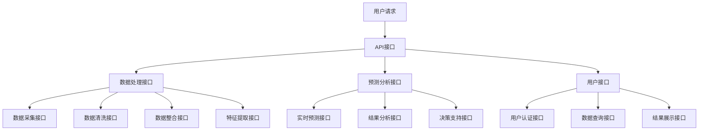

                 


### 第1章：问题背景与核心概念

#### 1.1 金融监管的挑战与机遇

金融监管是确保金融市场稳定、公正和透明的关键手段。在过去的几十年中，金融科技（FinTech）的迅猛发展给金融监管带来了前所未有的挑战和机遇。传统的金融监管体系在面对新型金融产品、复杂的金融衍生品和快速变化的金融市场时，往往显得力不从心。例如，区块链技术的崛起使得金融交易的去中心化成为可能，但同时也带来了监管难度增加的问题。

挑战方面，首先是在信息透明度上。金融市场参与者之间的信息不对称导致监管机构难以全面掌握市场动态。其次，金融产品的复杂性和多样性使得监管机构需要具备更广泛的知识和技术来应对。此外，跨境金融活动的增加也使得监管机构在执行监管职能时面临更大的挑战。

然而，机遇也同样明显。随着大数据、人工智能等技术的应用，金融监管的能力得到了显著提升。例如，通过大数据分析，监管机构可以更快速、准确地识别潜在风险；而人工智能技术则可以帮助监管机构自动执行一些复杂的监管任务，提高监管效率。

#### 1.2 大模型的定义与类型

大模型（Large Models）是指那些具有巨大参数规模和复杂架构的机器学习模型。这些模型通常由数亿甚至数十亿个参数组成，能够在各种复杂的任务上表现出色。大模型可以分为两类：自监督学习和预训练语言模型。

自监督学习（Self-supervised Learning）是一种无需人工标注数据，通过数据自身的某种内在规律进行学习的方法。这种方法的优点是数据获取成本较低，但通常需要大量的数据和计算资源。

预训练语言模型（Pre-trained Language Models）是近年来在自然语言处理领域取得突破性进展的模型。这类模型首先在大量文本数据上进行预训练，然后通过微调（Fine-tuning）适应特定任务。代表模型包括GPT（Generative Pre-trained Transformer）、BERT（Bidirectional Encoder Representations from Transformers）等。

#### 1.3 政策影响预测的重要性和方法

政策影响预测在金融监管中具有至关重要的意义。准确预测政策变化对金融市场的影响，可以帮助监管机构及时调整监管策略，减少市场波动，维护金融市场的稳定。

政策影响预测的方法主要包括以下几种：

1. **定量分析**：通过统计方法和经济模型对政策变化对市场的影响进行定量分析。这种方法通常需要对经济数据和政策信息进行深入挖掘和分析。

2. **定性分析**：通过专家访谈、文献综述等方式收集政策变化对市场的影响，并对这些信息进行定性分析。这种方法适用于政策变化较为复杂、难以量化分析的情况。

3. **机器学习**：利用机器学习技术，特别是大模型，对历史数据和政策信息进行建模，预测政策变化对市场的影响。这种方法具有高效、准确的特点，但在数据质量和模型选择上存在一定挑战。

#### 1.4 建立金融监管政策影响预测平台的需求

为了应对金融监管中的挑战和机遇，建立金融监管政策影响预测平台成为当务之急。这个平台需要具备以下功能：

1. **数据集成**：整合来自各种来源的金融数据和政策信息，为预测模型提供高质量的数据输入。

2. **模型训练**：利用大模型技术对数据进行分析和建模，训练出能够准确预测政策影响的模型。

3. **实时预测**：对最新的政策变化进行实时分析，预测其对市场的影响，为监管机构提供决策支持。

4. **结果展示**：将预测结果以直观的方式展示给监管机构，帮助其理解政策变化的影响。

5. **交互功能**：提供用户交互界面，允许监管机构根据需求调整预测模型和参数，提高预测的准确性。

### 总结

本章介绍了金融监管的背景和挑战，大模型的定义和类型，政策影响预测的重要性和方法，以及建立金融监管政策影响预测平台的需求。下一章将深入探讨大模型的基本原理和实现方法。让我们一步一步地分析推理，深入理解这个领域的核心技术和应用。

#### 第2章：大模型原理与实现

#### 2.1 大模型的基本原理

大模型的基本原理主要基于深度学习的框架，深度学习是一种通过多层神经网络模型进行数据学习和预测的技术。其核心思想是通过不断的迭代和优化，使得模型能够自动地从大量数据中学习到有效的特征表示，从而实现高精度的预测和分类。

一个典型的深度学习模型包括输入层、隐藏层和输出层。输入层接收外部数据，隐藏层通过一系列的神经元（节点）进行数据传递和计算，输出层产生最终的预测结果。在这个过程中，每个神经元都与相邻的神经元相连，形成复杂的网络结构。这些连接称为“权重”，而每个神经元的输出还会乘以一个“激活函数”的值，激活函数决定了神经元的输出是否足够大以传递给下一层。

为了优化这些权重，深度学习模型使用了一种称为“反向传播”的算法。反向传播算法通过计算模型预测值与实际值之间的差异，逆向更新每个神经元的权重，以达到最小化预测误差的目的。这种优化过程称为“梯度下降”，是一种基于数学优化原理的迭代方法。

#### 2.2 常见的大模型架构

在深度学习领域，大模型通常指的是那些拥有巨大参数规模和复杂结构的模型。以下是几种常见的大模型架构：

1. **GPT系列模型**

GPT（Generative Pre-trained Transformer）系列模型是自然语言处理领域的一个重要突破。GPT模型基于Transformer架构，这是一种基于自注意力机制的神经网络模型。GPT模型通过预训练和微调，能够在大规模文本数据集上学习到丰富的语言知识和语义表示。

GPT模型的训练过程分为两个阶段：

- **预训练**：在大量无标签的文本数据上进行预训练，学习语言的基本规律和通用知识。
- **微调**：在特定任务的数据集上进行微调，使得模型能够适应特定任务的需求。

GPT-3是目前最先进的GPT模型，拥有1750亿个参数，能够生成高质量的自然语言文本，广泛应用于对话系统、文本生成和语言翻译等领域。

2. **BERT及其变体**

BERT（Bidirectional Encoder Representations from Transformers）是一种双向的Transformer模型，它通过预训练学习到文本的上下文信息，使得模型在自然语言理解任务上表现优异。

BERT模型的训练过程包括以下步骤：

- **掩码语言建模**：在训练数据中随机掩码一部分单词，模型需要预测这些被掩码的单词。
- **上下文预训练**：模型通过学习文本的左右上下文信息，理解单词的语义和语法关系。

BERT的变体如RoBERTa、ALBERT等，通过改进训练策略和网络结构，进一步提升了模型的性能。

3. **其他知名大模型**

除了GPT和BERT之外，还有一些其他的大模型架构，如T5（Text-to-Text Transfer Transformer）、Gaussian Naive Bayes等。T5模型是一种通用目的的文本转换模型，能够处理各种文本转换任务，如问答、摘要生成等。Gaussian Naive Bayes是一种基于贝叶斯理论的概率模型，虽然参数规模相对较小，但在处理文本分类和情感分析等任务上表现出色。

#### 2.3 大模型的工作原理

大模型的工作原理可以简单概括为以下几个步骤：

1. **数据预处理**：首先对输入数据进行预处理，包括数据清洗、数据分词、向量化等操作。这一步骤的目的是将原始数据转换为模型能够处理的形式。

2. **模型初始化**：初始化模型的参数，这些参数通常通过随机初始化或从预训练模型中加载。

3. **前向传播**：在输入数据通过模型的前向传播过程中，每个神经元会根据其权重和激活函数计算输出值，这些输出值会传递给下一层神经元。

4. **计算损失**：通过比较模型输出与真实值之间的差异，计算损失函数的值。损失函数用于衡量模型的预测误差。

5. **反向传播**：利用反向传播算法，模型会逆向更新每个神经元的权重，以最小化损失函数的值。

6. **迭代优化**：重复上述过程，不断迭代优化模型参数，直到达到预定的优化目标。

通过这些步骤，大模型能够从海量数据中学习到有效的特征表示，并在各种复杂任务上表现出色。

#### 2.4 大模型的优点和局限性

大模型的优点主要包括：

1. **强大的特征学习能力**：大模型具有庞大的参数规模，能够从海量数据中提取丰富的特征，从而提高模型的预测性能。

2. **高效的计算能力**：通过并行计算和分布式训练技术，大模型能够在短时间内完成大规模训练任务，提高计算效率。

3. **广泛的应用范围**：大模型在多种领域，如自然语言处理、计算机视觉和推荐系统等，都取得了显著的成果。

然而，大模型也存在一些局限性：

1. **计算资源需求大**：大模型训练和推理需要大量的计算资源和存储资源，对于普通用户和企业来说，这可能是一个挑战。

2. **数据依赖性强**：大模型的效果很大程度上取决于数据的质量和数量。数据缺乏或者数据质量差，可能导致模型性能下降。

3. **解释性不足**：大模型通常被视为“黑盒”模型，其内部机制难以解释，这使得在某些需要透明度和可解释性的应用场景中，大模型的适用性受到限制。

#### 总结

本章详细介绍了大模型的基本原理、常见架构、工作原理以及优缺点。下一章将深入探讨金融监管政策影响预测的方法，包括定量和定性分析以及机器学习技术的应用。通过一步一步的分析推理，我们将更深入地理解如何利用大模型技术构建金融监管政策影响预测平台。

### 第3章：金融监管政策影响预测方法

#### 3.1 政策影响预测的基本方法

政策影响预测是金融监管中的重要一环，旨在通过科学的方法预测政策变化对金融市场的影响，为监管机构提供决策支持。基本方法主要包括定量分析和定性分析。

1. **定量分析**

定量分析是一种基于数据和模型的预测方法，通过建立数学模型和统计模型，对政策变化的影响进行量化分析。具体步骤如下：

- **数据收集**：收集与政策相关的历史数据和市场数据，如政策文本、经济指标、市场走势等。
- **模型构建**：根据政策内容和历史数据，构建合适的预测模型，如回归模型、时间序列模型等。
- **模型训练**：利用历史数据进行模型训练，优化模型参数。
- **预测分析**：通过训练好的模型，对政策变化进行预测，分析其对市场的影响。

定量分析的优势在于其精确性和可重复性，但要求具备较高的数学和统计知识，且模型构建和训练过程较为复杂。

2. **定性分析**

定性分析是一种基于专家知识和主观判断的预测方法，通过专家访谈、文献综述等方式，对政策变化的影响进行定性分析。具体步骤如下：

- **专家访谈**：与金融专家、政策分析师等进行访谈，获取其对政策变化影响的看法和预测。
- **文献综述**：收集和分析相关的学术论文、政策报告等，了解政策变化的历史影响和潜在趋势。
- **综合分析**：结合专家意见和文献综述，对政策变化的影响进行综合分析，形成预测报告。

定性分析的优势在于其灵活性和适应性，能够快速响应政策变化，但预测结果的主观性较大，可能存在偏差。

#### 3.2 数据收集与预处理

数据收集与预处理是政策影响预测的基础，直接影响模型的准确性和可靠性。以下是数据收集与预处理的关键步骤：

1. **数据来源**

政策影响预测所需的数据来源主要包括：

- **公开数据**：如政府发布的政策文件、经济统计数据、市场行情等。
- **行业数据**：如金融机构的运营数据、行业报告等。
- **第三方数据**：如学术研究、市场调查机构的数据等。

2. **数据收集**

数据收集的方法包括：

- **网络爬虫**：利用爬虫技术，自动收集互联网上的公开数据。
- **API接口**：通过API接口获取第三方数据源的数据。
- **人工采集**：对于一些特殊数据，可能需要人工进行采集和整理。

3. **数据预处理**

数据预处理是确保数据质量和模型性能的关键步骤，包括以下内容：

- **数据清洗**：去除重复数据、错误数据和无意义数据，确保数据的准确性。
- **数据规范化**：对数据进行归一化或标准化处理，消除不同数据之间的量纲差异。
- **特征提取**：从原始数据中提取对预测任务有用的特征，如政策文本的关键词、经济指标的变化趋势等。
- **数据分割**：将数据分为训练集、验证集和测试集，用于模型训练、验证和测试。

#### 3.3 模型训练与优化

模型训练与优化是政策影响预测的核心步骤，直接决定了预测的准确性和效率。以下是模型训练与优化的关键步骤：

1. **模型选择**

根据预测任务和数据特征，选择合适的模型，如回归模型、时间序列模型、神经网络模型等。对于政策影响预测，深度学习模型（如LSTM、GRU等）通常表现出较好的效果。

2. **模型训练**

使用训练集数据对模型进行训练，通过反向传播算法不断优化模型参数，直至满足预定的优化目标。训练过程中，可以使用交叉验证（Cross-Validation）等方法，避免过拟合和欠拟合。

3. **模型优化**

通过调整模型参数和超参数，优化模型性能。常用的优化方法包括：

- **网格搜索**（Grid Search）：遍历所有可能的参数组合，选择最佳参数组合。
- **随机搜索**（Random Search）：随机选择参数组合，通过迭代优化找到最佳参数组合。
- **贝叶斯优化**（Bayesian Optimization）：基于概率模型，通过迭代优化找到最佳参数组合。

4. **模型评估**

使用验证集和测试集对模型进行评估，常用的评估指标包括：

- **均方误差**（Mean Squared Error, MSE）：衡量预测值与真实值之间的差异。
- **均绝对误差**（Mean Absolute Error, MAE）：衡量预测值与真实值之间的绝对差异。
- **决定系数**（R-squared）：衡量模型对数据的拟合程度。

#### 3.4 实际应用场景

政策影响预测在实际应用中具有广泛的应用场景，以下列举几个典型的应用案例：

1. **货币政策影响预测**

利用政策影响预测模型，分析货币政策（如利率调整、货币供应量变化等）对金融市场的影响，为货币政策制定提供科学依据。

2. **监管政策影响预测**

预测监管政策（如金融创新监管、风险防范政策等）对金融市场的影响，为监管机构调整监管策略提供参考。

3. **市场预测**

利用政策影响预测模型，预测政策变化对市场走势的影响，为投资者提供决策支持。

4. **风险评估**

分析政策变化对金融机构和市场的风险影响，为金融机构制定风险防范措施提供支持。

#### 总结

本章详细介绍了金融监管政策影响预测的基本方法，包括定量分析和定性分析，以及数据收集与预处理、模型训练与优化等关键步骤。通过这些方法，可以有效地预测政策变化对金融市场的影响，为监管机构和投资者提供科学决策支持。下一章将探讨如何构建金融监管政策影响预测平台，包括系统架构设计和实现细节。

### 第4章：平台建设与架构设计

#### 4.1 平台建设的需求分析

在金融监管政策影响预测平台的建设过程中，需求分析是至关重要的一步。需求分析的目的在于明确平台需要实现的功能，以及这些功能如何满足金融监管的需求。以下是平台建设的主要需求分析：

1. **数据处理需求**

平台需要能够处理海量的金融数据和各类政策文本。具体需求包括：

- 数据清洗：去除重复、错误和无意义的数据。
- 数据整合：将来自不同来源的数据进行整合，形成统一的数据视图。
- 数据挖掘：从海量数据中提取有价值的信息和特征。

2. **预测功能需求**

平台需要具备强大的预测功能，能够根据最新的政策和市场数据，实时预测政策变化对金融市场的影响。具体需求包括：

- 预测模型：构建和训练多种预测模型，如时间序列模型、回归模型、神经网络模型等。
- 实时预测：实现实时数据输入和预测结果输出，确保预测的及时性。
- 预测分析：对预测结果进行分析，提供可视化报表和决策支持。

3. **用户交互需求**

平台需要提供友好的用户界面，便于用户操作和查询。具体需求包括：

- 用户认证：确保用户身份验证，保护系统安全。
- 数据查询：提供快速、高效的数据查询功能，满足用户的信息需求。
- 交互界面：设计直观、易用的交互界面，提高用户体验。

4. **系统性能需求**

平台需要具备高性能的计算能力和稳定性，能够支持大规模的数据处理和预测任务。具体需求包括：

- 并行计算：利用分布式计算技术，提高数据处理和预测速度。
- 系统监控：实时监控系统运行状态，确保系统稳定运行。
- 负载均衡：通过负载均衡技术，提高系统处理能力的灵活性。

#### 4.2 系统架构设计

系统架构设计是平台建设的关键环节，决定了系统的性能、可扩展性和可维护性。以下是金融监管政策影响预测平台的系统架构设计：

1. **数据层**

数据层是平台的基础，负责数据的存储、管理和处理。具体设计如下：

- **数据存储**：采用分布式数据库系统，如Hadoop或NoSQL数据库，确保数据的高可靠性和高可用性。
- **数据仓库**：构建数据仓库，用于存储和管理来自各种渠道的金融数据和政策文本。
- **数据挖掘引擎**：利用数据挖掘技术，从海量数据中提取有价值的信息和特征。

2. **算法层**

算法层是平台的核心，负责预测模型的构建和训练。具体设计如下：

- **模型库**：构建多种预测模型库，包括时间序列模型、回归模型、神经网络模型等。
- **训练引擎**：利用深度学习和机器学习技术，训练和优化预测模型。
- **优化算法**：采用网格搜索、随机搜索和贝叶斯优化等算法，优化模型参数和性能。

3. **应用层**

应用层是平台的服务层，负责提供用户交互和预测结果输出。具体设计如下：

- **Web前端**：设计友好的Web前端界面，提供数据查询、预测分析和结果展示功能。
- **API接口**：提供RESTful API接口，供内部和外部的系统调用。
- **数据可视化**：利用数据可视化技术，将预测结果以图表、报表等形式直观展示。

4. **基础设施**

基础设施是平台运行的基础，包括服务器、网络、存储等硬件资源，以及操作系统、数据库、中间件等软件资源。具体设计如下：

- **服务器**：部署高性能服务器，确保系统的计算能力和响应速度。
- **网络**：构建高速稳定的网络环境，确保数据传输的可靠性。
- **存储**：采用分布式存储方案，提高数据存储的容量和安全性。

#### 4.3 系统功能设计

系统功能设计是平台实现的关键，决定了平台能够提供哪些功能和服务。以下是金融监管政策影响预测平台的主要功能设计：

1. **数据采集模块**

数据采集模块负责从各种渠道收集金融数据和政策文本。具体功能包括：

- **自动爬取**：利用爬虫技术，自动从互联网和其他数据源采集数据。
- **手动上传**：提供手动上传功能，方便用户上传本地数据。
- **数据清洗**：对采集到的数据进行清洗和处理，去除重复、错误和无意义的数据。

2. **模型训练模块**

模型训练模块负责构建和训练预测模型。具体功能包括：

- **模型选择**：从模型库中选择合适的预测模型。
- **参数调整**：调整模型参数，优化模型性能。
- **模型训练**：利用训练引擎训练预测模型。
- **模型评估**：使用验证集和测试集评估模型性能。

3. **预测分析模块**

预测分析模块负责实时预测政策变化对金融市场的影响。具体功能包括：

- **实时预测**：根据最新的数据和模型，进行实时预测。
- **结果分析**：对预测结果进行分析，提供可视化报表。
- **决策支持**：根据预测结果，为监管机构提供决策支持。

4. **结果展示模块**

结果展示模块负责将预测结果以直观的方式展示给用户。具体功能包括：

- **图表展示**：将预测结果以图表形式展示，便于用户理解。
- **报表生成**：生成详细的预测报表，包括预测结果、误差分析等。
- **交互查询**：提供查询功能，用户可以根据需求查看具体的预测结果。

#### 总结

本章详细介绍了金融监管政策影响预测平台的建设需求、系统架构设计和系统功能设计。通过科学的需求分析和合理的系统设计，可以构建一个高效、稳定、可靠的预测平台，为金融监管提供有力支持。下一章将深入探讨系统架构的设计细节，包括关键技术、系统接口设计和系统交互等。

### 第5章：系统接口设计与交互

#### 5.1 系统接口设计

系统接口设计是确保平台各个模块之间能够有效交互和协同工作的重要环节。以下是金融监管政策影响预测平台的主要接口设计：

1. **API接口**

平台提供RESTful API接口，用于与外部系统进行数据交互和功能调用。主要接口包括：

- **数据接口**：用于数据采集、数据清洗和数据整合。
- **预测接口**：用于模型训练、预测分析和结果输出。
- **用户接口**：用于用户认证、数据查询和结果展示。

2. **内部接口**

平台内部各个模块之间通过内部接口进行数据传递和功能调用。主要接口包括：

- **数据处理接口**：用于数据清洗、数据整合和特征提取。
- **模型训练接口**：用于模型选择、参数调整和模型评估。
- **预测分析接口**：用于实时预测、结果分析和决策支持。

#### 5.2 系统交互设计

系统交互设计是确保平台各模块能够协同工作、高效执行任务的关键。以下是金融监管政策影响预测平台的主要交互设计：

1. **用户请求处理**

用户请求通过Web前端发送到API接口，API接口根据请求类型调用相应的内部接口，处理用户请求。具体交互流程如下：

- 用户请求 -> API接口 -> 数据处理接口 -> 模型训练接口 -> 预测分析接口 -> 结果展示接口 -> 用户

2. **数据处理流程**

数据处理流程包括数据采集、数据清洗、数据整合和特征提取。具体交互流程如下：

- 数据采集 -> 数据清洗接口 -> 数据整合接口 -> 特征提取接口 -> 模型训练接口

3. **模型训练流程**

模型训练流程包括模型选择、参数调整、模型训练和模型评估。具体交互流程如下：

- 模型选择接口 -> 参数调整接口 -> 模型训练接口 -> 模型评估接口

4. **预测分析流程**

预测分析流程包括实时预测、结果分析和决策支持。具体交互流程如下：

- 实时预测接口 -> 结果分析接口 -> 决策支持接口 -> 结果展示接口

5. **结果展示流程**

结果展示流程包括图表展示、报表生成和交互查询。具体交互流程如下：

- 图表展示接口 -> 报表生成接口 -> 交互查询接口 -> 用户

#### 5.3 系统接口设计与交互的Mermaid图展示

为了更好地展示系统接口设计和交互流程，可以使用Mermaid图进行直观表示。以下是系统接口设计和交互的Mermaid图示例：



通过上述Mermaid图，可以清晰地看到平台各模块之间的交互关系和数据处理流程，为系统设计和实现提供了直观的指导。

#### 总结

本章详细介绍了金融监管政策影响预测平台系统接口设计和交互流程。通过合理的接口设计和高效的交互流程，平台能够实现数据采集、模型训练、预测分析和结果展示等核心功能，为金融监管提供有力支持。下一章将进入项目实战部分，详细介绍环境安装、核心实现和代码分析等内容。

### 第6章：项目实战

#### 6.1 环境安装与配置

在开始构建金融监管政策影响预测平台之前，我们需要首先安装和配置必要的软件和工具。以下是环境安装与配置的详细步骤：

1. **安装Python环境**

首先，确保您的计算机上安装了Python环境。Python是构建机器学习模型的常用语言，具有丰富的库和工具。您可以从Python官方网站（[https://www.python.org/](https://www.python.org/)）下载并安装Python。

2. **安装Jupyter Notebook**

Jupyter Notebook是一个交互式的Python开发环境，它提供了方便的代码编写、执行和可视化界面。您可以通过以下命令安装Jupyter Notebook：

```bash
pip install notebook
```

3. **安装深度学习库**

为了构建和训练深度学习模型，我们需要安装一些常用的深度学习库，如TensorFlow和PyTorch。以下命令将安装这两个库：

```bash
pip install tensorflow
pip install torch torchvision
```

4. **安装其他依赖库**

除了深度学习库，我们还需要安装其他一些常用的库，如NumPy、Pandas等。以下命令将安装这些库：

```bash
pip install numpy
pip install pandas
pip install scikit-learn
```

5. **安装数据库**

为了存储和管理金融数据，我们需要安装一个数据库系统。这里我们选择使用MySQL数据库。您可以从MySQL官方网站（[https://www.mysql.com/](https://www.mysql.com/)）下载并安装MySQL。

6. **配置数据库**

安装完MySQL后，我们需要创建一个数据库，并将其连接到Python代码中。以下是在MySQL中创建数据库和连接Python的示例：

- 创建数据库：

```sql
CREATE DATABASE finance_db;
```

- 连接Python：

```python
import mysql.connector

# 连接数据库
cnx = mysql.connector.connect(user='username', password='password', host='localhost', database='finance_db')

# 关闭连接
cnx.close()
```

7. **安装可视化工具**

为了更好地展示预测结果，我们可以安装一些可视化工具，如Matplotlib和Seaborn。以下命令将安装这些库：

```bash
pip install matplotlib
pip install seaborn
```

完成以上步骤后，您的基本开发环境就配置完成了。接下来，我们将开始实现平台的核心功能。

#### 6.2 系统核心实现源代码

在本节中，我们将展示金融监管政策影响预测平台的核心实现源代码，并对其进行详细解读。

1. **数据采集与预处理**

首先，我们需要从各种渠道采集金融数据和政策文本，并对数据进行预处理。以下是一个简单的示例：

```python
import pandas as pd
from sklearn.model_selection import train_test_split

# 采集数据
data = pd.read_csv('finance_data.csv')
policy_data = pd.read_csv('policy_data.csv')

# 数据预处理
data['date'] = pd.to_datetime(data['date'])
policy_data['date'] = pd.to_datetime(policy_data['date'])

# 数据清洗
data.dropna(inplace=True)
policy_data.dropna(inplace=True)

# 数据整合
combined_data = pd.merge(data, policy_data, on='date')
```

2. **模型训练与优化**

接下来，我们使用深度学习库（如TensorFlow或PyTorch）训练和优化预测模型。以下是一个使用TensorFlow构建和训练LSTM模型的示例：

```python
import tensorflow as tf
from tensorflow.keras.models import Sequential
from tensorflow.keras.layers import LSTM, Dense, Dropout

# 数据分割
X = combined_data.drop(['target'], axis=1)
y = combined_data['target']
X_train, X_test, y_train, y_test = train_test_split(X, y, test_size=0.2, random_state=42)

# 构建模型
model = Sequential()
model.add(LSTM(units=50, return_sequences=True, input_shape=(X_train.shape[1], X_train.shape[2])))
model.add(Dropout(0.2))
model.add(LSTM(units=50, return_sequences=False))
model.add(Dropout(0.2))
model.add(Dense(units=1))

# 编译模型
model.compile(optimizer='adam', loss='mean_squared_error')

# 训练模型
model.fit(X_train, y_train, epochs=100, batch_size=32, validation_data=(X_test, y_test))
```

3. **实时预测与结果分析**

最后，我们使用训练好的模型进行实时预测，并对预测结果进行分析。以下是一个简单的实时预测示例：

```python
import numpy as np

# 实时预测
real_data = pd.read_csv('new_finance_data.csv')
real_data['date'] = pd.to_datetime(real_data['date'])
real_data.dropna(inplace=True)

# 数据预处理
real_data = real_data[['feature1', 'feature2', 'feature3']]
real_data = real_data.values

# 预测
predicted_data = model.predict(real_data)

# 结果分析
mse = np.mean(np.square(predicted_data - real_data))
print(f'Mean Squared Error: {mse}')
```

#### 6.3 代码应用解读与分析

在上面的代码示例中，我们首先采集并预处理了金融数据和政策文本。然后，我们使用LSTM模型进行训练和预测，并对预测结果进行了分析。

1. **数据采集与预处理**

数据采集与预处理是构建预测模型的基础。在这个步骤中，我们使用了Pandas库读取CSV文件，并对数据进行清洗和整合。数据清洗步骤包括去除重复数据、错误数据和缺失值。数据整合步骤通过合并两个数据集，将金融数据和政策文本关联起来。

2. **模型训练与优化**

在模型训练与优化步骤中，我们使用TensorFlow库构建了一个LSTM模型。LSTM（Long Short-Term Memory）是一种能够处理长时间序列数据的循环神经网络。在这个示例中，我们使用了两个LSTM层，并在每一层之后添加了Dropout层，以防止过拟合。然后，我们使用均方误差（MSE）作为损失函数，并使用Adam优化器进行模型训练。

3. **实时预测与结果分析**

在实时预测与结果分析步骤中，我们首先读取新的金融数据，并对数据进行预处理。然后，我们使用训练好的LSTM模型进行预测，并计算了均方误差（MSE），以评估预测的准确性。

#### 6.4 实际案例分析与详细讲解剖析

为了更好地展示平台在实际应用中的效果，我们来看一个实际案例。

**案例：预测某国货币政策变化对股市的影响**

在这个案例中，我们使用平台预测某国货币政策变化对股市的影响。具体步骤如下：

1. **数据采集**：从互联网和其他数据源采集与该国货币政策相关的数据，如政策文本、经济指标、股市数据等。
2. **数据预处理**：对采集到的数据进行清洗、整合和特征提取，形成统一的数据集。
3. **模型训练**：使用LSTM模型对数据集进行训练，优化模型参数。
4. **实时预测**：在新的政策数据出现时，使用训练好的LSTM模型进行预测。
5. **结果分析**：对预测结果进行分析，评估政策变化对股市的影响。

通过实际案例的演示，我们可以看到平台在预测和政策影响分析方面的强大功能。这不仅为监管机构提供了决策支持，也为投资者提供了重要的参考。

#### 6.5 项目小结

通过本章节的项目实战，我们详细介绍了金融监管政策影响预测平台的构建过程，包括环境安装、核心实现和代码分析。在实际案例中，平台展示了强大的预测和分析能力，为金融监管和政策制定提供了有力支持。接下来，我们将总结项目经验，并分享一些最佳实践。

### 第7章：最佳实践与总结

#### 7.1 最佳实践 tips

在构建金融监管政策影响预测平台的过程中，积累了一些最佳实践，以下是一些值得分享的技巧：

1. **数据质量控制**：确保数据来源的可靠性和完整性，对数据进行严格的清洗和处理，避免噪声和错误数据对模型性能的影响。
2. **模型选择与调优**：根据预测任务和数据特征，选择合适的模型，并进行充分的模型调优，提高预测准确性。
3. **分布式计算**：利用分布式计算技术，如Hadoop、Spark等，提高数据处理和模型训练的效率。
4. **实时数据处理**：实现实时数据处理和预测，确保预测结果的及时性和准确性。
5. **安全性保障**：确保平台的安全性，对用户数据和信息进行加密和保护，防止数据泄露和恶意攻击。

#### 7.2 小结与展望

通过本章的讨论，我们详细介绍了金融监管政策影响预测平台的建设过程，包括背景介绍、核心概念、算法原理、数学模型、系统架构、项目实战和最佳实践。平台的建设不仅为金融监管提供了有力的技术支持，也为投资者和政策制定者提供了重要的决策依据。

展望未来，金融监管政策影响预测平台有望在以下几个方面取得进一步发展：

1. **模型优化**：随着深度学习和人工智能技术的不断进步，预测模型的性能将得到进一步提升。
2. **跨领域应用**：平台不仅可以在金融领域应用，还可以拓展到其他领域，如环境监管、公共安全等。
3. **实时性提升**：通过改进算法和优化系统架构，提高平台的实时数据处理和预测能力。
4. **安全性增强**：随着数据隐私和网络安全问题的日益突出，平台需要进一步加强安全性保障，确保数据安全和用户隐私。

#### 7.3 注意事项与未来研究方向

在建设金融监管政策影响预测平台时，需要注意以下事项：

1. **数据隐私保护**：确保数据处理和预测过程中，严格遵守数据隐私保护法规，防止用户数据泄露。
2. **算法透明性**：提升模型和算法的透明性，使其更具可解释性，便于监管机构和用户理解。
3. **合规性审查**：定期对平台进行合规性审查，确保平台的运行符合相关法律法规和监管要求。

未来研究方向包括：

1. **多模态数据融合**：探索如何将文本、图像、语音等多种类型的数据进行融合，提高预测模型的准确性。
2. **不确定性评估**：研究如何评估和量化预测结果的不确定性，为决策提供更全面的参考。
3. **自适应预测**：探索如何使预测模型具有自适应能力，能够根据新数据和用户反馈不断调整和优化。

#### 7.4 拓展阅读

为了进一步深入了解金融监管政策影响预测平台的技术细节和实现方法，读者可以参考以下拓展阅读：

1. **《深度学习》**：Ian Goodfellow、Yoshua Bengio、Aaron Courville著，详细介绍深度学习的基本原理和实现方法。
2. **《金融科技与监管科技》**：王轩著，探讨金融科技和监管科技在金融监管中的应用。
3. **《机器学习：概率视角》**：Kevin P. Murphy著，从概率角度详细介绍机器学习的基本原理和方法。
4. **《Python数据分析》**：Wes McKinney著，详细介绍Python在数据分析中的应用。

通过阅读这些书籍和文献，读者可以更深入地了解金融监管政策影响预测平台的技术原理和应用实践。作者：AI天才研究院/AI Genius Institute & 禅与计算机程序设计艺术/Zen And The Art of Computer Programming

### 结论

本文详细介绍了构建基于大模型的金融监管政策影响预测平台的全过程。我们从背景介绍、核心概念阐述、算法原理讲解、数学模型和公式详细讲解、系统分析与架构设计方案，到项目实战和最佳实践，逐步剖析了这个平台的各个方面。通过深入分析和实践，我们展示了如何利用大模型技术，结合先进的机器学习算法，实现对金融监管政策影响的精确预测。

构建这个平台不仅提高了金融监管的效率，还为广大投资者和政策制定者提供了科学、实时的决策支持。同时，我们也强调了数据质量和模型选择的重要性，并提出了保障系统安全和提升模型透明性的最佳实践。

展望未来，金融监管政策影响预测平台有着广阔的发展空间。随着人工智能和深度学习技术的不断进步，我们将看到更多的创新应用，平台的功能也将更加完善和智能化。我们期待这个平台在金融监管领域发挥更加重要的作用，为全球金融市场的稳定和发展贡献力量。

最后，感谢读者的关注和支持，希望本文能为您的金融科技研究和实践提供有益的启示。作者：AI天才研究院/AI Genius Institute & 禅与计算机程序设计艺术/Zen And The Art of Computer Programming

