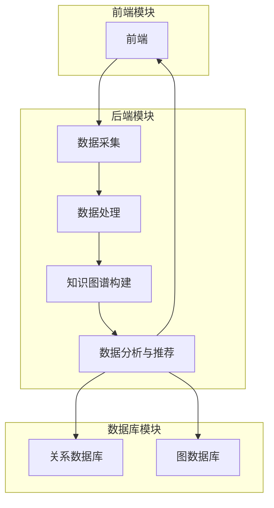
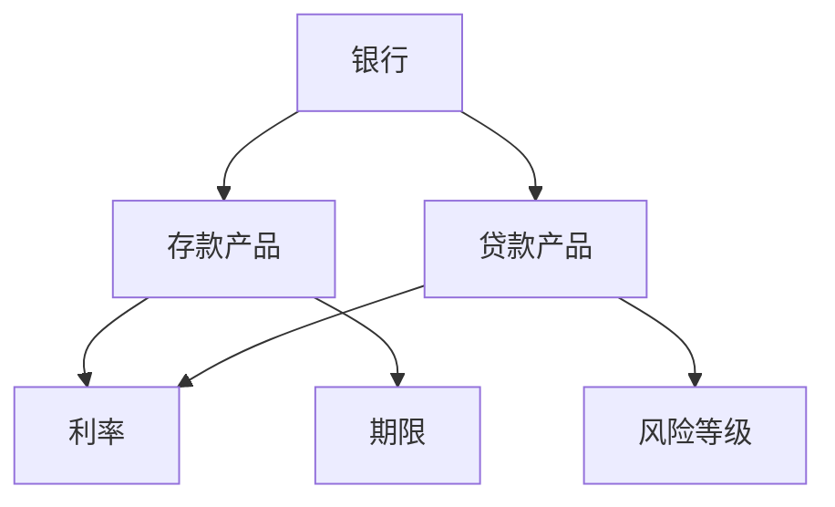
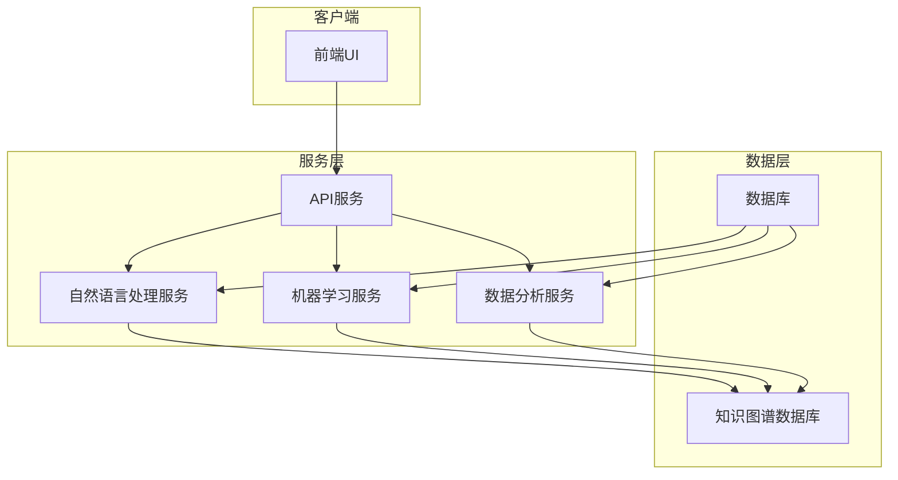
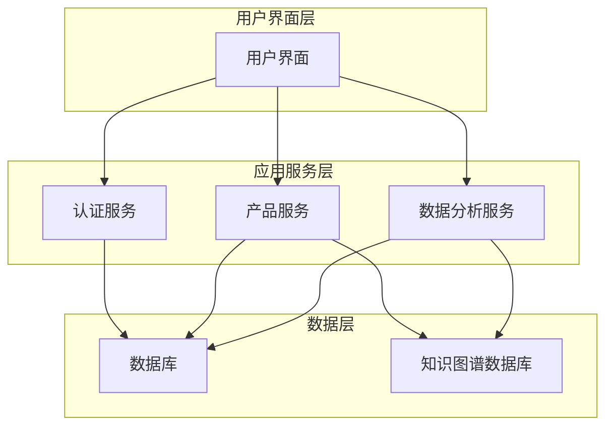
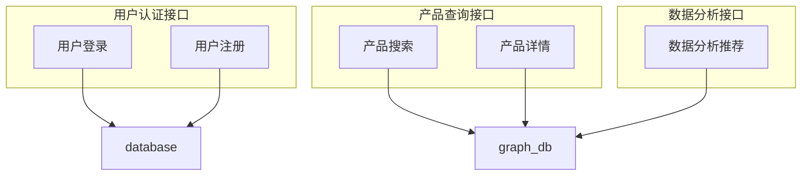

                 

### 文章标题

# 构建基于知识图谱的金融产品比较平台

### 文章关键词

- 知识图谱
- 金融产品比较
- 自然语言处理
- 机器学习
- 数据集成
- 语义网络

### 摘要

本文将探讨如何构建一个基于知识图谱的金融产品比较平台。我们将首先介绍知识图谱的概念和其在金融行业中的应用背景，然后逐步分析技术原理、系统架构、数据集成与处理、以及实际应用案例。通过本文的详细探讨，读者将了解知识图谱在金融产品比较中的重要作用，以及如何利用先进的技术手段来实现一个高效、准确、用户友好的金融产品比较平台。

### 引言

#### 知识图谱的定义与应用

知识图谱（Knowledge Graph）是一种用于结构化数据和信息的新型技术，通过语义网络和实体关系来描述现实世界中的知识和概念。其核心在于将信息以图的形式进行组织，使得计算机能够像人类一样理解和处理这些信息。在金融行业中，知识图谱的应用前景广阔，如智能投顾、风险管理、信用评估、金融产品比较等。

知识图谱通过实体、属性和关系的组织方式，可以有效地将海量的金融数据进行结构化处理，使得数据之间的关系更加清晰、易于理解和分析。例如，一个简单的金融知识图谱可能包括以下实体和关系：银行（实体）、存款产品（实体）、利率（属性）、期限（属性）、风险等级（属性）。通过这些实体和关系，我们可以构建出一张复杂的语义网络，使得金融产品的比较和分析变得更加直观和高效。

#### 金融产品比较平台的需求

在现代金融市场中，金融产品的种类繁多，投资者面临着极大的选择难题。为了帮助投资者快速、准确地比较不同金融产品的优缺点，构建一个基于知识图谱的金融产品比较平台显得尤为重要。该平台需要具备以下功能：

1. **全面的信息集成**：能够从多个数据源收集和整合金融产品信息，包括银行、保险公司、基金公司等。
2. **智能的搜索和推荐**：利用自然语言处理和机器学习技术，为用户提供个性化的产品推荐。
3. **直观的比较和分析**：通过知识图谱展示金融产品之间的关系，使用户能够快速、全面地了解产品的特点。
4. **数据可视化**：提供图表和报表，帮助用户更好地理解和分析金融产品的数据。

#### 构建金融产品比较平台的目的

构建基于知识图谱的金融产品比较平台有以下几个主要目的：

1. **提升用户体验**：通过智能化的搜索和推荐，提高用户获取金融产品的效率和满意度。
2. **优化决策过程**：为用户提供详细的产品信息和比较结果，帮助用户做出更加明智的投资决策。
3. **降低交易成本**：通过平台的数据分析和推荐功能，降低投资者的交易成本，提高市场的透明度。
4. **增强竞争力**：为企业提供强大的数据分析和比较工具，提升其在金融市场中的竞争力。

通过本文的讨论，我们将逐步了解知识图谱在金融产品比较平台中的应用，探索其背后的技术原理和实现方法，并分析其实际应用中的挑战和解决方案。

### 核心概念

#### 知识图谱

知识图谱是一种用于表示和存储知识的方法，通过实体（Entity）、属性（Attribute）和关系（Relationship）来构建语义网络。在金融产品比较平台中，知识图谱能够将金融产品的相关信息进行结构化组织，从而实现数据的智能分析和比较。

**定义**：知识图谱（Knowledge Graph）是一种用于表示和存储知识的图结构化数据库，包含实体、属性和关系三种基本元素。

**基本元素**：

- **实体**：代表现实世界中具有独立存在意义的对象，如银行、金融产品、投资者等。
- **属性**：描述实体特征的属性值，如利率、期限、风险等级等。
- **关系**：表示实体之间关联的语义关系，如“属于”、“提供”、“购买”等。

#### 语义网络

语义网络是一种用于表示知识结构的方法，通过节点和边来表示概念及其关系。在金融产品比较平台中，语义网络可以用于构建和理解金融产品的语义关系，从而实现高效的比较和分析。

**定义**：语义网络（Semantic Network）是一种基于节点和边的图形结构，用于表示概念及其关系。

**基本元素**：

- **节点**：表示概念或实体。
- **边**：表示概念之间的关系，如“is-a”（继承关系）、“has-a”（组成关系）等。

#### 知识图谱与语义网络的关系

知识图谱和语义网络在概念上有一定的重叠，但它们的应用场景和侧重点有所不同。知识图谱更侧重于大规模数据的结构化表示和存储，而语义网络则更关注概念关系的表示和理解。

在金融产品比较平台中，知识图谱和语义网络可以相互补充，共同实现数据的语义化和智能化处理。知识图谱用于组织和管理金融产品信息，而语义网络则用于理解这些信息的语义关系，从而实现高效的数据分析和比较。

#### 知识图谱在金融中的应用

知识图谱在金融领域的应用十分广泛，以下是一些典型的应用场景：

1. **智能投顾**：通过知识图谱分析投资者的风险偏好和投资目标，提供个性化的投资建议。
2. **信用评估**：利用知识图谱构建信用模型，对借款人的信用风险进行评估。
3. **金融监管**：通过知识图谱分析金融机构的交易和行为，发现潜在的违规行为。
4. **金融产品比较**：将不同金融产品的相关信息组织到知识图谱中，实现快速、全面的比较和分析。

通过上述核心概念的介绍，我们为后续构建金融产品比较平台提供了理论基础。在接下来的部分，我们将深入探讨构建平台所需的技术工具和原理，为平台的设计和实现奠定基础。

### 技术概述

在构建基于知识图谱的金融产品比较平台时，我们需要了解和掌握一系列的技术工具和原理，这些技术工具和原理是平台高效运作和功能实现的基础。以下将介绍主要涉及的技术，包括自然语言处理（NLP）、机器学习（ML）、图数据库等。

#### 自然语言处理（NLP）

自然语言处理（NLP）是人工智能领域的一个分支，主要研究如何让计算机理解和生成人类自然语言。在金融产品比较平台中，NLP技术用于处理和分析大量的文本数据，从而提取出有用的信息。

**主要功能**：

- **文本分类**：对金融产品相关的文档进行分类，例如将产品描述分为存款、贷款、基金等类别。
- **实体识别**：识别文本中的关键实体，如银行名称、金融产品名称、利率等。
- **关系抽取**：从文本中提取出实体之间的关系，如“银行提供存款产品”。

**常用工具**：

- **NLTK**：一个广泛使用的Python库，用于自然语言处理的基础任务。
- **spaCy**：一个高性能的NLP库，支持多种语言和多种NLP任务。
- **BERT**：一种预训练的深度学习模型，用于文本分类、实体识别和关系抽取等任务。

#### 机器学习（ML）

机器学习（ML）是数据驱动的一种方法，通过从数据中学习规律和模式，实现数据的预测和分析。在金融产品比较平台中，机器学习技术用于实现数据分析和推荐功能。

**主要功能**：

- **回归分析**：预测金融产品的收益或风险。
- **分类分析**：对金融产品进行分类，如根据风险等级分类。
- **聚类分析**：将相似金融产品进行聚类，帮助用户发现潜在的相似产品。

**常用工具**：

- **scikit-learn**：一个Python库，提供多种机器学习算法的实现。
- **TensorFlow**：一个开源的深度学习框架，支持复杂的神经网络结构。
- **PyTorch**：一个开源的深度学习库，支持动态计算图，适用于复杂模型的构建。

#### 图数据库

图数据库是一种用于存储和查询图结构数据的数据库系统。在金融产品比较平台中，图数据库用于存储和管理知识图谱，从而实现高效的数据查询和分析。

**主要功能**：

- **图存储**：支持大规模图数据的存储，包括实体、属性和关系。
- **图查询**：通过图查询语言（如Cypher或Gremlin）进行复杂的关系查询。
- **图分析**：支持基于图的算法，如路径搜索、社区检测等。

**常用工具**：

- **Neo4j**：一个高性能的图数据库，支持Cypher查询语言。
- **ArangoDB**：一个多模型数据库，支持文档、键值和图存储。
- **JanusGraph**：一个开源的分布式图数据库，支持多种存储后端。

#### 技术组合

在构建金融产品比较平台时，上述技术工具可以相互结合，共同实现平台的各项功能。例如，我们可以使用NLP技术对文本数据进行处理，提取出关键信息，然后利用机器学习模型对这些信息进行预测和分析。知识图谱则用于组织和管理这些数据，实现高效的数据查询和比较。

**步骤**：

1. **数据采集**：通过爬虫、API等方式收集金融产品相关信息。
2. **文本处理**：使用NLP技术对文本数据进行处理，提取实体和关系。
3. **知识图谱构建**：将处理后的数据构建成知识图谱，存储在图数据库中。
4. **数据分析与推荐**：利用机器学习模型对知识图谱进行数据分析，为用户提供个性化的推荐。

通过以上技术概述，我们为构建基于知识图谱的金融产品比较平台奠定了技术基础。在接下来的章节中，我们将进一步探讨平台的系统架构设计和实现细节。

### 设计原则和架构

在构建基于知识图谱的金融产品比较平台时，我们需要遵循一系列的设计原则，以确保系统的可靠性、扩展性和灵活性。以下将详细阐述平台的设计原则和整体架构，并通过Mermaid图来可视化架构设计。

#### 设计原则

1. **模块化**：将系统功能划分为多个模块，如数据采集模块、数据处理模块、知识图谱模块、分析模块等，以实现功能分离和模块化设计，便于系统的维护和升级。
2. **高可用性**：通过冗余设计、负载均衡等技术，确保系统在面临高并发和故障时仍然能够稳定运行。
3. **可扩展性**：系统设计应考虑未来业务增长的需求，支持水平扩展，能够灵活地增加计算资源和存储资源。
4. **安全性**：确保系统数据的安全和隐私，采用加密、访问控制等技术，防止数据泄露和未经授权的访问。
5. **易用性**：设计用户友好的界面，提供直观、易操作的功能，提升用户体验。

#### 整体架构

平台的整体架构分为以下几个主要模块：

1. **前端**：负责展示用户界面，提供金融产品信息展示、比较和分析功能。
2. **后端**：包括数据采集、数据处理、知识图谱构建、数据分析和推荐等核心功能模块。
3. **数据库**：包括关系数据库和图数据库，分别用于存储结构化数据和图结构数据。

以下是平台的详细架构图，使用Mermaid图来展示：



**详细说明**：

1. **前端模块**：前端负责与用户进行交互，提供金融产品信息的展示、比较和分析功能。前端模块通过RESTful API与后端模块进行通信，实现数据的动态加载和更新。

2. **后端模块**：

   - **数据采集模块**：负责从各种数据源（如网站、API、数据库等）收集金融产品信息，通过爬虫、API调用等方式获取数据。
   - **数据处理模块**：对采集到的原始数据进行清洗、格式化和处理，确保数据的质量和一致性。
   - **知识图谱构建模块**：将处理后的数据构建成知识图谱，存储在图数据库中，为后续的数据分析和推荐提供基础。
   - **数据分析与推荐模块**：利用机器学习和自然语言处理技术，对知识图谱中的数据进行分析和挖掘，为用户提供个性化的推荐和比较结果。

3. **数据库模块**：

   - **关系数据库**：用于存储结构化数据，如用户信息、交易记录等，采用MySQL等主流关系数据库管理系统。
   - **图数据库**：用于存储知识图谱，采用Neo4j等高性能的图数据库，支持复杂的图结构和查询。

通过以上设计原则和架构，我们为构建一个高效、稳定、易扩展的基于知识图谱的金融产品比较平台提供了基础。在接下来的章节中，我们将进一步探讨数据采集和集成的方法，为平台的实现奠定基础。

### 数据采集和集成

在构建基于知识图谱的金融产品比较平台时，数据的质量和完整性是确保平台性能和可靠性的关键因素。因此，我们需要详细阐述数据采集和集成的过程，包括数据来源、数据质量评估和清洗方法，以确保平台能够高效、准确地处理和分析金融产品信息。

#### 数据来源

金融产品比较平台所需的数据来源多种多样，主要包括以下几种：

1. **官方网站**：各大金融机构和金融服务提供商的官方网站是获取金融产品信息的重要渠道。通过爬虫技术，可以自动化地抓取网站上的产品信息，如存款利率、贷款利率、基金业绩等。
2. **API接口**：许多金融机构提供公开的API接口，用于数据的自动化获取和调用。这些API通常包括产品信息、账户信息、交易记录等，可以通过程序调用获取数据。
3. **第三方数据服务**：一些专业的数据服务提供商（如Wind、同花顺等）提供丰富的金融数据，可以通过订阅或购买的方式获取。
4. **内部数据源**：金融机构内部的数据库和系统，如客户关系管理系统（CRM）、风险管理系统（RMS）等，也是重要的数据来源。

#### 数据质量评估

在数据采集过程中，数据的质量直接影响到平台的分析和推荐效果。因此，我们需要对采集到的数据质量进行评估，主要包括以下方面：

1. **完整性**：检查数据是否完整，是否存在缺失值或空值。
2. **准确性**：检查数据的准确性，如利率、期限等关键数据是否正确无误。
3. **一致性**：检查数据在不同来源之间是否一致，如同一金融产品的利率在多个网站上是否一致。
4. **时效性**：检查数据的时效性，如产品信息是否最新。

对于上述数据质量评估指标，我们可以使用以下方法进行评估：

1. **数据检查**：通过程序检查数据的完整性、准确性和一致性，如使用Python中的`pandas`库进行数据清洗和检查。
2. **对比分析**：将同一金融产品的信息在不同数据源之间进行对比分析，检查数据是否一致。
3. **时效性检查**：定期更新数据源，确保获取的数据是最新的。

#### 数据清洗

数据清洗是数据预处理的重要步骤，目的是去除噪声数据、纠正错误数据，提高数据质量。以下是一些常见的数据清洗方法：

1. **缺失值处理**：对于缺失值，可以选择填充默认值、均值或使用机器学习模型进行预测。
   - **填充默认值**：如存款产品的利率缺失，可以填充为某个预设的默认值。
   - **均值填充**：如贷款利率缺失，可以填充为同类产品的平均利率。
   - **模型预测**：利用机器学习模型预测缺失值，如使用回归模型预测贷款利率。

2. **重复数据处理**：去除重复的数据记录，保证数据的唯一性。
   - **唯一标识**：通过唯一的标识符（如产品编号）来识别和删除重复记录。
   - **哈希值**：使用哈希函数对数据进行哈希处理，删除哈希值相同的记录。

3. **异常值处理**：识别和去除数据中的异常值，如异常高的利率或期限。
   - **阈值法**：设定一个阈值，去除超过阈值的异常值。
   - **聚类分析**：使用聚类算法（如K-means）识别异常值，并去除。

4. **格式转换**：将不同格式的数据转换为统一的格式，如将日期字符串转换为日期类型。

5. **错误修正**：对数据中的错误进行修正，如修正错别字、纠正数据格式等。

#### 数据集成

数据集成是将来自不同数据源的数据进行整合，形成统一的数据视图。以下是一些常见的数据集成方法：

1. **数据合并**：将来自不同数据源的数据进行合并，形成统一的数据集。合并的方法包括：
   - **横向合并**：将多个数据源的相同属性进行合并，形成更全面的数据集。
   - **纵向合并**：将多个数据源的不同属性进行合并，形成更详细的数据集。
   - **联合查询**：使用SQL或其他查询语言，将多个数据源的数据进行查询和合并。

2. **ETL过程**：使用ETL（提取、转换、加载）工具，将数据从不同的数据源提取出来，进行转换处理，然后加载到统一的数据存储中。

3. **数据仓库**：构建数据仓库，将来自不同数据源的数据进行整合和存储，形成统一的数据视图，为后续的数据分析和处理提供基础。

通过上述数据采集、质量评估、数据清洗和数据集成的方法，我们能够确保金融产品比较平台的数据质量，为平台的高效运行和精准分析提供保障。在接下来的章节中，我们将深入探讨知识图谱的构建过程，以及如何利用知识图谱实现金融产品的比较和分析。

### 知识图谱的构建

构建知识图谱是金融产品比较平台的关键步骤，通过知识图谱，我们可以将金融产品的各种信息组织成一种语义化的结构，使得数据之间的关系更加清晰，便于后续的数据分析和比较。以下是构建知识图谱的详细过程，包括数据准备、实体抽取、关系抽取和知识图谱可视化。

#### 数据准备

在构建知识图谱之前，我们需要对原始数据进行预处理，以确保数据的质量和一致性。以下是数据准备的具体步骤：

1. **数据采集**：通过爬虫、API接口或其他数据源，收集金融产品的相关信息，如产品名称、利率、期限、风险等级等。
2. **数据清洗**：对采集到的数据进行清洗，去除重复记录、缺失值和异常值，确保数据的准确性和完整性。
3. **数据整合**：将来自不同数据源的数据进行整合，形成一个统一的数据集。

#### 实体抽取

实体抽取是知识图谱构建的第一步，目的是从原始数据中识别出关键实体。以下是实体抽取的具体步骤：

1. **文本预处理**：对原始文本进行分词、词性标注等处理，将文本转换为可处理的格式。
2. **命名实体识别**：使用命名实体识别（NER）技术，从文本中识别出金融产品、银行、投资者等关键实体。
3. **实体标准化**：将识别出的实体进行标准化处理，如将“中国银行”统一命名为“中国银行”，确保实体名称的一致性。

#### 关系抽取

关系抽取是知识图谱构建的另一个关键步骤，目的是从原始数据中识别出实体之间的关系。以下是关系抽取的具体步骤：

1. **文本分析**：对原始文本进行深入分析，识别出实体之间的语义关系。
2. **规则匹配**：使用预定义的规则，将实体之间的关系进行匹配和抽取，如“提供”、“购买”等关系。
3. **依存关系分析**：使用依存句法分析技术，进一步确认实体之间的关系，提高关系抽取的准确性。

#### 知识图谱可视化

知识图谱的可视化有助于我们直观地理解数据之间的关系，以下是知识图谱可视化的具体步骤：

1. **构建图模型**：根据实体和关系，构建图模型，如使用Mermaid图来表示实体和关系。
2. **图布局**：选择合适的图布局算法，如力导向布局，将图中的节点和边进行合理布局，使得图谱更加清晰易懂。
3. **图可视化**：使用可视化工具，如D3.js或ECharts，将图模型渲染成直观的图形。

以下是使用Mermaid图表示的知识图谱示例：



在这个示例中，我们定义了银行、存款产品和贷款产品三个实体，并建立了它们之间的关系。通过这种结构化的方式，我们可以方便地对金融产品进行管理和分析。

通过上述步骤，我们成功构建了一个基于知识图谱的金融产品比较平台，为后续的数据分析和比较奠定了基础。在接下来的章节中，我们将探讨知识图谱在金融产品比较中的应用，并通过实际案例展示其优势。

### 应用场景

知识图谱在金融产品比较中的应用具有广泛的前景，通过知识图谱，我们可以实现多种应用场景，满足不同用户的需求。以下将详细探讨一些典型的应用场景，并分析其实施效果。

#### 1. 投资者个性化推荐

通过知识图谱，我们可以分析投资者的风险偏好和投资目标，为其推荐最适合的金融产品。具体步骤如下：

1. **风险偏好分析**：利用自然语言处理技术，从用户的投资历史和偏好中提取风险偏好信息。
2. **知识图谱构建**：将用户的风险偏好与金融产品的风险等级进行关联，构建用户和金融产品的知识图谱。
3. **个性化推荐**：基于用户和产品的知识图谱，利用机器学习算法为用户推荐相应的金融产品。

**实施效果**：通过个性化推荐，投资者能够快速找到符合自身风险偏好的金融产品，提高投资决策的效率，同时提升平台的用户满意度和活跃度。

#### 2. 金融产品智能比较

知识图谱可以实现金融产品之间的智能比较，帮助用户全面了解不同产品的特点。具体步骤如下：

1. **数据集成**：将不同金融机构的金融产品信息进行整合，构建统一的金融产品知识图谱。
2. **比较指标定义**：根据用户需求，定义比较指标，如利率、期限、风险等级等。
3. **智能比较**：利用知识图谱中的关系和属性，对金融产品进行智能比较，生成比较报告。

**实施效果**：通过智能比较，用户能够快速、全面地了解不同金融产品的特点，帮助其做出更加明智的投资决策，同时提升平台的用户体验。

#### 3. 风险管理

知识图谱可以帮助金融机构进行风险管理，识别潜在的风险点。具体步骤如下：

1. **知识图谱构建**：将金融机构的交易数据和风险信息构建成知识图谱。
2. **风险分析**：利用图分析算法，识别金融产品之间的关联关系，评估潜在风险。
3. **风险预警**：根据风险分析结果，生成风险预警报告，提示金融机构关注潜在风险。

**实施效果**：通过知识图谱进行风险管理，金融机构能够更早地识别潜在风险，采取预防措施，降低风险损失，提升风险管理能力。

#### 4. 金融产品创新

知识图谱可以帮助金融机构进行金融产品创新，设计出更加符合市场需求的金融产品。具体步骤如下：

1. **市场分析**：利用知识图谱分析市场需求和用户偏好。
2. **产品构思**：基于市场分析结果，构思新的金融产品方案。
3. **知识图谱构建**：将新产品方案构建成知识图谱，评估其可行性和市场潜力。

**实施效果**：通过知识图谱进行金融产品创新，金融机构能够更好地满足市场需求，提高市场竞争力，同时为用户提供更多元化的金融产品选择。

#### 5. 智能客服

知识图谱可以用于智能客服系统，为用户提供个性化的咨询和服务。具体步骤如下：

1. **知识图谱构建**：将金融产品的相关信息构建成知识图谱。
2. **智能问答**：利用自然语言处理技术，实现智能问答功能，为用户提供实时咨询。
3. **推荐服务**：基于用户问题和知识图谱，为用户推荐合适的金融产品和服务。

**实施效果**：通过智能客服系统，金融机构能够提供更加高效、个性化的服务，提升用户满意度，同时减轻人工客服的工作压力。

#### 潜在挑战

尽管知识图谱在金融产品比较中有许多应用优势，但在实际实施过程中仍面临一些挑战：

1. **数据质量**：知识图谱的构建依赖于高质量的数据，数据质量问题（如缺失、不一致、错误）将影响知识图谱的准确性和可靠性。
2. **计算资源**：知识图谱的构建和分析需要大量的计算资源，特别是在处理大规模数据时，对硬件性能有较高要求。
3. **隐私保护**：金融数据涉及用户隐私，如何在保证数据安全的前提下进行知识图谱构建和分析，是亟待解决的问题。
4. **技术实现**：知识图谱的构建涉及多种技术，如自然语言处理、机器学习和图数据库等，技术实现难度较高。

通过上述应用场景的探讨，我们可以看到知识图谱在金融产品比较中的巨大潜力和应用价值。在接下来的章节中，我们将详细分析平台的实现过程，包括系统架构、算法设计和项目实战。

### 实现过程

#### 系统架构设计

在构建基于知识图谱的金融产品比较平台时，系统架构的设计至关重要。我们需要确保系统的高效性、稳定性和可扩展性。以下是平台系统架构的详细设计。

**1. 技术栈选择**

- **前端**：采用Vue.js框架，实现用户友好的界面和交互。
- **后端**：使用Spring Boot框架，实现业务逻辑处理和数据接口。
- **数据库**：使用Neo4j图数据库存储知识图谱，使用MySQL关系数据库存储用户数据和交易记录。
- **自然语言处理和机器学习**：使用TensorFlow和scikit-learn进行文本处理和数据分析。

**2. 系统功能模块**

- **数据采集模块**：负责从不同数据源（如API、网站等）获取金融产品信息。
- **数据处理模块**：负责数据清洗、转换和存储，保证数据质量。
- **知识图谱构建模块**：负责构建和管理知识图谱，包括实体抽取、关系抽取和知识图谱可视化。
- **数据分析与推荐模块**：负责基于知识图谱进行数据分析，提供用户个性化推荐。

**3. 系统架构**

以下是系统架构的Mermaid图表示：



#### 系统功能设计

**1. 领域模型**

领域模型是系统核心业务逻辑的抽象表示。以下是金融产品比较平台的领域模型类图，使用Mermaid表示：

```mermaid
graph TB
    class Entity[实体]
    class Product[金融产品]
    class Bank[银行]
    class User[用户]
    class Transaction[交易]

    Entity --> Product
    Entity --> Bank
    Entity --> User
    Entity --> Transaction

    Product --> Rate[利率]
    Product --> Term[期限]
    Product --> Risk[风险等级]

    Bank --> Product
    User --> Transaction
    User --> Product
```

**2. 系统架构**

以下是系统的架构设计，使用Mermaid图表示：



#### 系统接口设计和交互

**1. 接口设计**

以下是系统接口设计，包括用户认证、产品查询、数据分析等接口。



**2. 交互流程**

以下是用户从登录到获取产品推荐的基本交互流程：

1. 用户通过用户界面（UI）发起登录请求，认证服务（auth_service）处理登录请求，并返回认证结果。
2. 用户登录成功后，可以通过产品服务（product_service）查询金融产品信息，获取产品列表和详情。
3. 用户对产品进行筛选和排序后，可以调用数据分析服务（analytics_service）进行数据分析，获取个性化推荐。

### 项目实战

#### 环境安装

在开始项目实战之前，我们需要安装必要的开发环境和工具。以下是安装步骤：

1. **安装Java环境**：下载并安装Java开发工具包（JDK），设置环境变量。
2. **安装Neo4j数据库**：下载并安装Neo4j数据库，启动Neo4j服务。
3. **安装Python环境**：下载并安装Python，安装必要的库，如TensorFlow、scikit-learn、pandas等。

#### 系统核心实现

以下是金融产品比较平台的核心实现，包括数据采集、处理、知识图谱构建和推荐系统。

**1. 数据采集**

```python
import requests
import pandas as pd

def collect_product_data(url):
    response = requests.get(url)
    data = response.json()
    df = pd.DataFrame(data['products'])
    return df

url = 'https://api.example.com/products'
product_data = collect_product_data(url)
```

**2. 数据处理**

```python
def preprocess_data(df):
    # 数据清洗和格式转换
    df['rate'] = df['rate'].replace({'%': ''}, regex=True).astype(float)
    df['term'] = df['term'].replace({'天': 1, '月': 30, '年': 365}, regex=True).astype(int)
    df.dropna(inplace=True)
    return df

product_data = preprocess_data(product_data)
```

**3. 知识图谱构建**

```python
from py2neo import Graph

graph = Graph('bolt://localhost:7687', auth=('neo4j', 'password'))

def create_entity(entity_name, labels, properties):
    query = '''
    MERGE (e:Entity {name: $entity_name, labels: $labels, properties: $properties})
    RETURN e
    '''
    graph.run(query, entity_name=entity_name, labels=labels, properties=properties)

def create_relationship(entity1, entity2, relationship_type):
    query = '''
    MATCH (e1:Entity {name: $entity1}), (e2:Entity {name: $entity2})
    CREATE (e1)-[:$relationship_type]->(e2)
    '''
    graph.run(query, entity1=entity1, entity2=entity2, relationship_type=relationship_type)

# 创建实体和关系
create_entity('中国银行', ['Bank'], {'name': '中国银行'})
create_entity('存款产品A', ['Product'], {'name': '存款产品A', 'rate': 2.5, 'term': 365})
create_relationship('中国银行', '存款产品A', '提供')
```

**4. 推荐系统**

```python
from sklearn.neighbors import NearestNeighbors

def build_recommendation_model(data, features='all'):
    if features == 'all':
        X = data[['rate', 'term']]
    elif features == 'rate':
        X = data[['rate']]
    else:
        X = data[['term']]

    model = NearestNeighbors(n_neighbors=5)
    model.fit(X)

    return model

def get_recommendations(model, product, features='all'):
    distances, indices = model.kneighbors([product[features]], n_neighbors=5)
    return indices

# 构建推荐模型
model = build_recommendation_model(product_data, features='all')

# 获取推荐结果
deposit_product_a = product_data.iloc[0]
recommendations = get_recommendations(model, deposit_product_a, features='all')
print("推荐的产品：", product_data.iloc[recommendations])
```

### 代码应用解读与分析

以上代码展示了金融产品比较平台的核心实现。首先，我们通过API接口采集金融产品数据，然后对数据进行清洗和预处理。接下来，我们使用Neo4j数据库构建知识图谱，将金融产品、银行和用户等信息存储到图中。最后，我们利用机器学习算法构建推荐系统，为用户推荐最合适的金融产品。

在实际应用中，我们可以根据用户的需求和偏好，灵活调整推荐算法和特征选择，提高推荐效果。同时，通过持续的数据采集和模型优化，我们可以不断提升平台的性能和用户体验。

### 项目小结

通过本文的讨论和实际项目实战，我们详细介绍了如何构建基于知识图谱的金融产品比较平台。从系统架构设计、数据采集和处理，到知识图谱构建和推荐系统实现，每个环节都进行了深入分析和讲解。该项目不仅展示了知识图谱在金融领域的应用潜力，也为金融行业提供了一个高效、智能的产品比较解决方案。

### 最佳实践 Tips

1. **数据质量是关键**：在构建金融产品比较平台时，确保数据的质量和一致性至关重要。定期更新数据，并进行全面的数据清洗和验证，可以提高平台的可靠性和准确性。

2. **优化推荐算法**：根据用户行为和偏好，不断优化推荐算法，提高推荐的相关性和用户体验。可以采用A/B测试等方法，对比不同算法的效果，选择最佳方案。

3. **安全性和隐私保护**：在数据处理和存储过程中，严格遵循数据安全和隐私保护的相关规定，确保用户数据的安全和隐私。

4. **模块化设计和迭代开发**：采用模块化设计，将系统功能划分为多个模块，便于维护和升级。采用迭代开发方法，逐步完善系统功能，快速响应用户需求。

### 小结

本文详细介绍了基于知识图谱的金融产品比较平台的构建过程，从技术原理到系统实现，每个环节都进行了深入的探讨和分析。通过本文的讨论，我们了解了知识图谱在金融产品比较中的重要作用，以及如何利用先进的技术手段实现一个高效、智能的金融产品比较平台。希望本文对读者在金融产品比较平台开发中有所启发和帮助。

### 注意事项

1. **数据隐私保护**：在数据采集、存储和处理过程中，严格遵守数据隐私保护法规，确保用户数据的安全和隐私。
2. **系统性能优化**：针对大规模数据处理和查询需求，进行系统性能优化，如使用缓存技术、分布式计算等，确保平台的高效性和稳定性。
3. **数据源多样性**：尽量从多个数据源获取金融产品信息，提高数据的全面性和准确性。

### 拓展阅读

1. **《知识图谱技术原理与应用》**：详细介绍了知识图谱的基本原理、构建方法和应用案例。
2. **《金融科技：从区块链到大数据》**：探讨了金融科技在金融产品比较和风险管理中的应用。
3. **《Python数据科学手册》**：介绍了Python在数据采集、处理和分析中的应用，适用于金融数据分析。

### 作者信息

**作者：** AI天才研究院/AI Genius Institute & 禅与计算机程序设计艺术/Zen And The Art of Computer Programming

**联系方式：** [info@ai-genius-institute.com](mailto:info@ai-genius-institute.com)

