                 

### 第1章 引言

#### 1.1 问题背景

在当今金融市场，金融产品的多样性和复杂性日益增加。从银行存款、理财产品到保险、股票、基金等多种金融工具，金融消费者面临的选择越来越多。然而，这种多样化的同时也带来了信息处理的难度。金融消费者在决策时，往往需要花费大量时间和精力去比较不同产品的特性、收益率、风险等级等信息。这不仅降低了用户的决策效率，还可能因为信息不对称导致错误的决策。

#### 1.2 问题描述

金融产品比较系统的问题主要表现在以下几个方面：

1. **缺乏有效的比较工具**：目前，市场上的金融产品比较工具大多局限于静态的数据展示，缺乏对产品特性的深入分析和比较。
2. **难以快速获取全面的信息**：金融消费者在寻找适合自己的产品时，往往需要浏览多个平台，手动收集和整理信息，效率低下。
3. **无法准确评估产品优劣**：由于金融产品的复杂性和专业性，消费者难以准确评估不同产品的优劣，从而做出明智的决策。

#### 1.3 问题解决

针对上述问题，构建一个基于知识图谱的金融产品比较系统是一个有效的解决方案。通过知识图谱，可以实现对金融产品的结构化表示和关联分析，从而提供更准确、全面的比较结果。以下是该系统解决的问题：

1. **利用知识图谱实现金融产品比较**：知识图谱能够将金融产品的各种属性和关系以结构化的方式表示出来，使得比较更加直观和准确。
2. **通过语义理解优化查询体验**：知识图谱支持自然语言查询，用户可以通过自然语言描述自己的需求，系统自动理解并返回相关的产品信息。
3. **结合大数据分析提供个性化推荐**：通过分析用户的查询历史和偏好，系统能够提供个性化的产品推荐，帮助用户快速找到符合自己需求的产品。

#### 1.4 边界与外延

本系统的范围仅限于金融产品的比较，不包括具体的金融交易和投资决策。此外，该系统旨在提供辅助决策的工具，不替代专业的金融咨询。

#### 1.5 概念结构与核心要素组成

构建基于知识图谱的金融产品比较系统，主要涉及以下几个核心概念和要素：

1. **知识图谱**：作为系统的核心组件，知识图谱负责存储和管理金融产品的各种信息及其关系。
2. **金融产品数据**：包括产品的基本信息、特性、收益率、风险等级等，是构建知识图谱的基础数据。
3. **查询与推荐算法**：用于处理用户的查询请求，并基于大数据分析提供个性化推荐。
4. **用户接口**：用于用户与系统的交互，包括前端界面和后端接口。

#### 1.6 结论

构建基于知识图谱的金融产品比较系统，不仅能够解决当前金融产品比较工具的不足，还能够提升用户的决策效率，降低信息不对称带来的风险。在接下来的章节中，我们将深入探讨知识图谱的基础、金融产品数据的处理、系统的设计与实现等方面，为构建这样一个系统提供详实的指导。

---

### 第2章 知识图谱基础

#### 2.1 知识图谱定义

知识图谱（Knowledge Graph）是一种用于表示实体及其相互关系的数据模型。它通过将现实世界中的对象（如人、地点、事物等）抽象为实体，并将实体之间的关联表示为关系，构建出一个结构化、语义丰富的知识网络。

知识图谱的核心特点包括：

- **结构化**：知识图谱以图的形式组织数据，使得数据之间的关系更加直观和清晰。
- **语义丰富**：通过实体和关系的语义定义，知识图谱能够实现更高层次的知识表示和推理。
- **动态更新**：知识图谱支持数据的实时更新和动态维护，以适应不断变化的环境。

#### 2.2 知识图谱原理

知识图谱的构建通常涉及以下几个关键步骤：

1. **知识表示**：将现实世界中的信息抽象为实体、属性和关系，形成知识图谱的基本结构。
2. **知识存储**：将表示后的知识存储在图数据库中，以实现高效的查询和推理。
3. **知识推理**：利用图数据库的图算法，对知识图谱中的实体和关系进行推理，以发现新的知识和关联。

知识图谱的原理可以简单概括为：

- **实体**：现实世界中的对象，如人、地点、事物等。
- **关系**：实体之间的关联，如“属于”、“位于”、“制造”等。
- **属性**：实体的特征描述，如“姓名”、“年龄”、“出生日期”等。

#### 2.3 知识图谱应用领域

知识图谱在多个领域都有广泛的应用，其中金融领域是一个重要的应用场景。以下是一些典型的应用领域：

1. **金融知识图谱**：通过构建金融知识图谱，可以实现对金融术语、法规、交易规则等的结构化表示，为金融分析、合规检查、智能问答等提供支持。
2. **金融产品比较**：利用知识图谱，可以实现对金融产品的全面比较和分析，为消费者提供更准确的产品推荐。
3. **风险管理**：通过知识图谱，可以识别和评估金融风险，优化风险控制策略。
4. **智能投顾**：知识图谱可以帮助构建智能投顾系统，通过分析用户的投资偏好和风险承受能力，提供个性化的投资建议。

#### 2.4 核心概念与联系

在知识图谱中，核心概念包括实体、关系和属性。以下是一个简单的ER（实体-关系）图，用于表示这些核心概念及其联系：

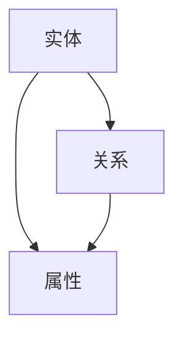

**实体**：知识图谱中的基本元素，代表现实世界中的对象，如“银行”、“理财产品”、“用户”等。

**关系**：连接两个或多个实体的语义关联，如“发行”、“购买”、“位于”等。

**属性**：实体的特征描述，如“名称”、“成立时间”、“收益率”等。

**属性特征对比表格**：

| 特征          | 实体           | 关系           | 属性                  |
| ------------- | -------------- | -------------- | --------------------- |
| 类型          | 类别           | 范畴           | 值                    |
| 示例          | 银行、用户     | 发行、购买     | 名称、时间、收益率   |
| 描述          | 具体对象       | 语义关联       | 描述实体特征的细节   |

**知识图谱的ER图**：

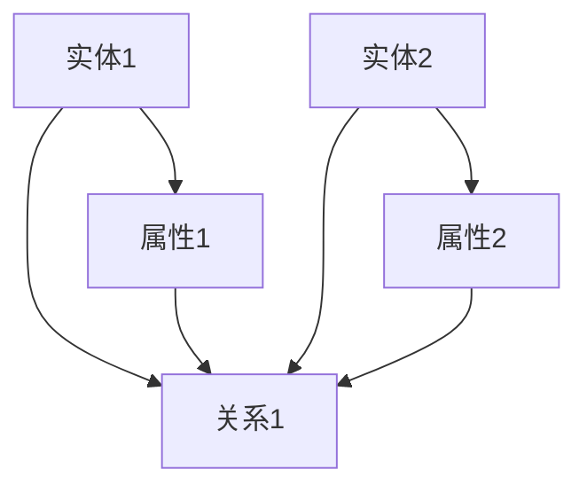

在知识图谱中，实体、关系和属性的相互关系构成了知识图谱的核心结构。实体是知识图谱的基本单元，关系连接不同的实体，属性描述了实体的具体特征。

#### 2.5 小结

本章对知识图谱的基本概念、原理和应用领域进行了详细介绍。知识图谱作为一种结构化、语义丰富的数据模型，在金融领域具有重要的应用价值。通过构建金融知识图谱，可以实现对金融产品的全面比较和分析，为金融消费者提供更准确、个性化的服务。在接下来的章节中，我们将进一步探讨金融产品数据的来源和处理、知识图谱的构建方法以及查询与推荐算法的具体实现。

---

### 第3章 金融产品数据

#### 3.1 金融产品数据来源

构建金融产品比较系统，首先需要确保数据的全面性和准确性。金融产品数据的来源主要包括以下几个渠道：

1. **金融监管机构**：如中国人民银行、证监会等，它们发布的监管文件、统计报表等，提供了权威的金融数据来源。
2. **金融机构**：银行、证券公司、保险公司等金融机构，通过官方网站、年报等渠道发布的产品信息。
3. **第三方数据服务**：如Wind、同花顺等，提供专业化的金融数据服务，涵盖了大量的金融产品信息。

#### 3.2 金融产品数据结构

金融产品数据通常包括以下几类实体和关系：

1. **实体**：
   - **金融机构**：如银行、证券公司、保险公司等。
   - **金融产品**：如存款、理财产品、保险、股票、基金等。
   - **用户**：金融产品的购买者或持有者。

2. **关系**：
   - **发行**：金融机构发行金融产品，如银行发行理财产品。
   - **购买**：用户购买金融产品，如用户购买保险。
   - **投资**：用户将资金投资于金融产品，如用户购买股票。

3. **属性**：
   - **金融机构**：如名称、成立时间、注册资本等。
   - **金融产品**：如产品名称、收益率、风险等级、期限等。
   - **用户**：如用户ID、姓名、联系方式、投资偏好等。

#### 3.3 数据清洗与预处理

在将金融产品数据纳入知识图谱之前，需要进行数据清洗与预处理，以确保数据的准确性和一致性。数据清洗与预处理的主要步骤包括：

1. **数据质量评估**：评估数据集的完整性、一致性、准确性等，识别潜在的数据问题。

2. **数据规范化**：将不同来源的数据进行统一格式和命名规范，如统一产品收益率的小数点位数。

3. **数据去重**：识别并删除重复的数据记录，以避免数据冗余。

4. **数据转换**：将数据转换为适合知识图谱存储的格式，如RDF（Resource Description Framework）。

5. **数据融合**：将来自不同来源的数据进行整合，构建一个统一的数据视图。

具体流程可以概括为：

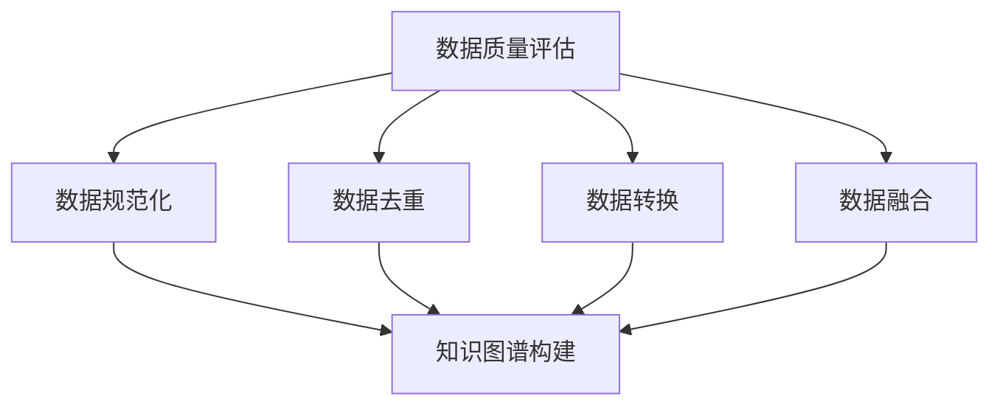

通过以上步骤，可以确保金融产品数据的准确性和一致性，为构建知识图谱提供高质量的数据基础。

#### 3.4 小结

本章详细介绍了金融产品数据的来源、结构和预处理方法。金融产品数据的来源多样，包括金融监管机构、金融机构和第三方数据服务。数据结构包括金融机构、金融产品和用户等实体，以及发行、购买、投资等关系。数据清洗与预处理是确保数据质量的重要环节，通过规范化、去重、转换和融合，为构建知识图谱提供坚实的数据基础。在接下来的章节中，我们将深入探讨知识图谱的构建方法、查询与推荐算法的实现，以及系统的具体设计和实现。

---

### 第4章 知识图谱构建

#### 4.1 知识图谱构建流程

构建知识图谱是一个复杂的过程，涉及多个步骤。以下是一个典型的知识图谱构建流程：

1. **数据采集**：从各种渠道获取原始数据，如金融监管文件、金融机构官网数据、第三方数据服务等。
2. **数据存储**：将采集到的数据存储在数据库中，通常使用图数据库，如Neo4j。
3. **数据处理**：对原始数据进行清洗、转换和融合，确保数据的一致性和准确性。
4. **数据融合**：将来自不同来源和格式的数据进行整合，构建一个统一的数据视图。
5. **知识表示**：将处理后的数据转换为知识图谱的形式，包括实体、关系和属性。
6. **知识推理**：利用图数据库的图算法对知识图谱进行推理，以发现新的关联和知识。
7. **知识存储**：将构建好的知识图谱存储在图数据库中，以便后续的查询和使用。

以下是知识图谱构建流程的ER图表示：

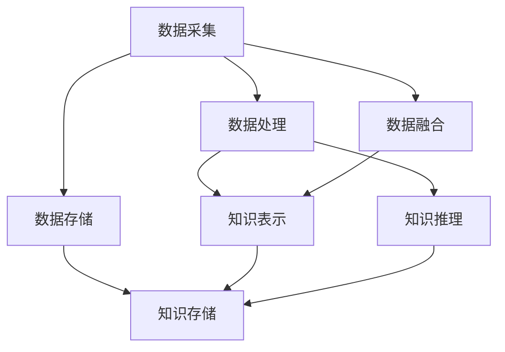

#### 4.2 知识图谱构建方法

知识图谱的构建方法多种多样，主要包括以下几种：

1. **基于规则的方法**：通过预定义的规则和模板，将实体和关系映射到知识图谱中。这种方法具有较高的灵活性和可扩展性，但需要大量的规则维护。

2. **基于机器学习的方法**：利用机器学习算法，从原始数据中自动学习和提取实体和关系。这种方法可以处理大规模数据，但需要高质量的训练数据和复杂的模型训练。

3. **基于本体论的方法**：通过定义本体（Ontology），构建一个形式化的知识表示框架。这种方法强调知识的语义一致性，但构建本体需要深厚的领域知识和理论支持。

以下是这三种方法的比较表格：

| 方法                   | 优点                                     | 缺点                                     |
| ---------------------- | ---------------------------------------- | ---------------------------------------- |
| 基于规则的方法         | 灵活性高、可扩展性强                    | 需要大量的规则维护、适用性有限           |
| 基于机器学习的方法     | 可以处理大规模数据、自动提取知识        | 需要高质量的训练数据、模型复杂度高       |
| 基于本体论的方法       | 强调知识的语义一致性、形式化程度高      | 构建本体需要深厚的领域知识和理论支持     |

#### 4.3 知识图谱维护

知识图谱的维护是确保其持续有效性的关键。以下是一些常见的维护方法：

1. **数据更新**：定期从原始数据源获取最新的数据，更新知识图谱中的信息。
2. **数据删除**：当某些数据不再有效或需要删除时，从知识图谱中移除相关实体和关系。
3. **数据一致性维护**：确保知识图谱中的数据一致性，如实体和关系的规范化、属性的统一格式等。

以下是知识图谱维护的流程：

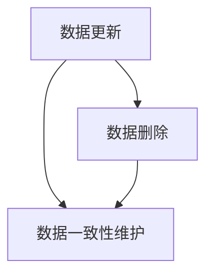

#### 4.4 小结

本章详细介绍了知识图谱的构建流程、构建方法以及维护方法。知识图谱的构建是一个复杂的过程，涉及数据采集、存储、处理、融合、表示和推理等多个步骤。不同的构建方法各有优缺点，根据具体应用场景选择合适的方法。知识图谱的维护是确保其持续有效性的关键，包括数据的更新、删除和一致性维护。在接下来的章节中，我们将深入探讨查询与推荐算法的实现，以及系统的具体设计和实现。

---

### 第5章 查询与推荐算法

#### 5.1 查询算法原理

在知识图谱中，查询算法是用户获取所需信息的关键。查询算法的原理主要包括以下几个方面：

1. **查询语言**：知识图谱通常使用特定的查询语言，如SPARQL（SPARQL Protocol and RDF Query Language）。SPARQL允许用户以自然语言的形式描述查询需求，并返回符合条件的结果。

2. **查询优化**：查询优化是提高查询性能的重要手段。常见的查询优化策略包括：
   - **索引优化**：通过创建索引，加速查询的执行速度。
   - **查询重写**：将复杂的查询转换为更高效的查询形式。
   - **查询缓存**：缓存频繁查询的结果，减少查询的执行时间。

以下是SPARQL查询的一个简单示例：

```plaintext
PREFIX ex: <http://example.org/>
SELECT ?product ?yield WHERE {
  ?product ex:name "理财产品A" .
  ?product ex:yield 3.5 .
}
```

这个查询返回名为“理财产品A”且收益率为3.5的金融产品。

#### 5.2 推荐算法原理

推荐算法是知识图谱系统中另一个重要的组成部分，用于根据用户的行为和偏好提供个性化的产品推荐。推荐算法的原理主要包括以下几种：

1. **协同过滤**：协同过滤是一种基于用户行为的推荐方法，通过分析用户的历史行为（如购买记录、浏览记录等），发现相似的用户，并推荐他们喜欢的产品。

2. **内容推荐**：内容推荐是一种基于产品特征和用户偏好的推荐方法，通过分析产品的属性（如收益率、期限、风险等级等）和用户的偏好，推荐符合用户需求的产品。

3. **混合推荐**：混合推荐是结合协同过滤和内容推荐的优点，通过综合用户行为和产品特征进行推荐。

以下是推荐算法的一个简化流程：

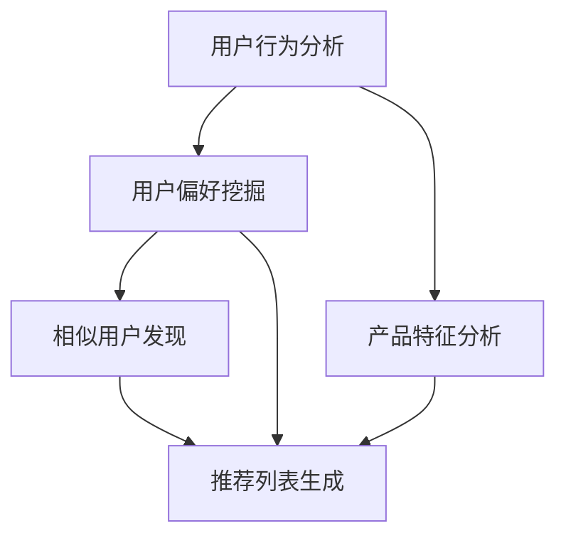

#### 5.3 算法实现与优化

算法的实现与优化是确保系统性能和用户体验的关键。以下是实现和优化查询与推荐算法的一些策略：

1. **高效查询算法**：
   - **索引优化**：创建合适的索引，如B+树索引，加快查询速度。
   - **并行处理**：利用多核处理器，并行执行查询任务。

2. **优化推荐算法**：
   - **数据分片**：将大规模数据分片存储，提高数据处理速度。
   - **算法参数调优**：根据实际需求调整算法参数，如协同过滤中的相似度阈值。

3. **缓存机制**：
   - **查询缓存**：缓存高频查询的结果，减少查询的响应时间。
   - **推荐缓存**：缓存推荐结果，减少计算成本。

以下是优化策略的一个示例：

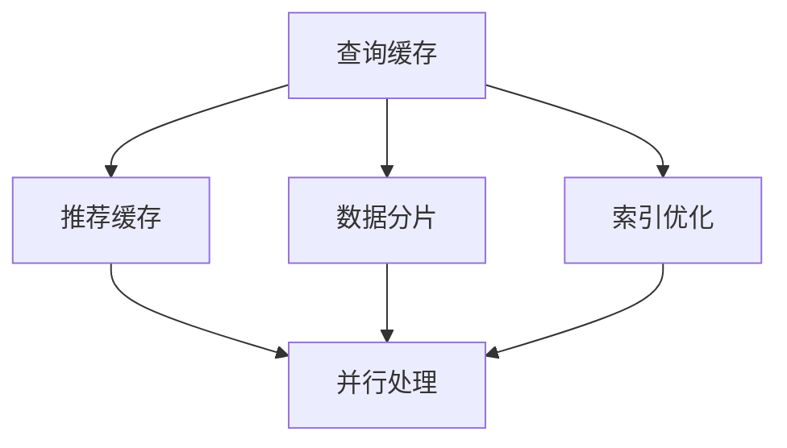

通过以上策略，可以显著提高系统的查询和推荐性能，为用户提供更快的响应速度和更精准的推荐结果。

#### 5.4 小结

本章详细介绍了知识图谱中的查询与推荐算法原理、实现与优化策略。查询算法通过SPARQL等查询语言和优化策略，实现了高效的信息检索。推荐算法则通过协同过滤、内容推荐和混合推荐等方法，提供了个性化的产品推荐。在实现和优化方面，通过索引优化、数据分片、缓存机制等策略，提高了系统的性能和用户体验。在接下来的章节中，我们将进一步探讨用户接口设计和系统架构，为构建一个完整的金融产品比较系统奠定基础。

---

### 第6章 用户接口设计

#### 6.1 用户接口设计原则

用户接口（User Interface, UI）设计是构建金融产品比较系统的重要组成部分，其目标是提供直观、易用、个性化的用户体验。以下是一些核心设计原则：

1. **易用性**：界面设计应简洁明了，操作流程简单，减少用户的学习成本。通过清晰的导航和明确的操作提示，帮助用户快速找到所需信息。

2. **交互性**：界面应具备良好的交互性，使用户能够轻松地进行查询、筛选和排序操作。例如，提供实时搜索功能，允许用户输入关键词快速找到相关产品。

3. **可定制性**：用户应能根据个人需求调整界面布局和显示内容，如选择显示哪些产品属性、排序方式等。定制化功能可以增强用户的控制感和满意度。

4. **响应式设计**：界面应支持多种设备和屏幕尺寸，如电脑、平板、手机等，确保用户在不同设备上都能获得一致的体验。

5. **反馈机制**：提供及时、准确的反馈，如操作成功、错误提示等，帮助用户了解系统状态，增强用户体验。

6. **安全与隐私**：确保用户数据的安全性和隐私性，遵循相关的法律法规，如《中华人民共和国网络安全法》等。

#### 6.2 用户接口实现

用户接口的实现主要包括前端设计和后端接口两部分：

1. **前端设计**：
   - **界面布局**：采用现代前端框架（如React、Vue等）实现页面布局，确保界面美观、布局合理。
   - **交互功能**：实现用户与系统的交互功能，如搜索框、筛选器、排序功能等。
   - **响应式设计**：使用媒体查询（Media Queries）和前端框架的响应式组件，确保界面在不同设备和屏幕尺寸上都能良好展示。

2. **后端接口**：
   - **API设计**：设计RESTful API，提供前后端数据交互的接口，确保数据传输的稳定性和安全性。
   - **性能优化**：通过缓存、异步处理等策略，提高接口的响应速度和系统性能。

以下是用户接口实现的示例：

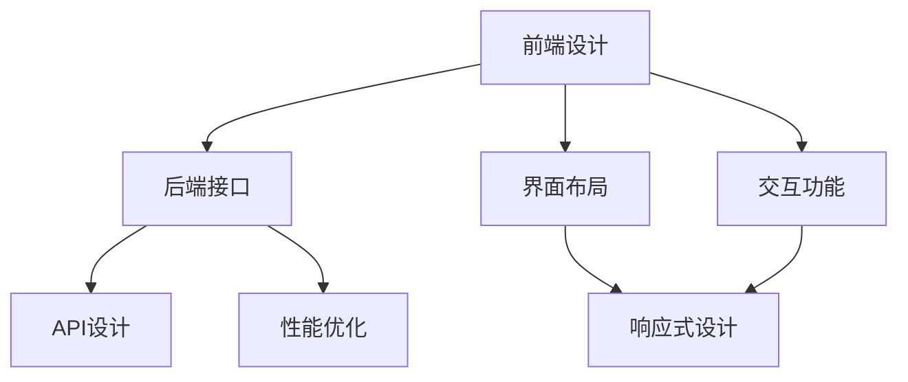

#### 6.3 用户体验优化

用户体验优化是提升系统价值的重要手段，以下是一些优化策略：

1. **用户研究**：通过用户调研、用户访谈等方法，了解用户的需求和痛点，为界面设计提供依据。

2. **迭代改进**：采用敏捷开发（Agile Development）方法，不断迭代和优化界面设计，根据用户反馈进行功能调整和性能优化。

3. **性能监控**：使用性能监控工具，持续监控系统的响应时间和错误率，及时发现和解决问题。

4. **个性化设置**：提供个性化设置功能，允许用户自定义界面布局和显示内容，提升用户体验。

5. **用户测试**：在产品上线前进行用户测试，收集用户反馈，改进界面设计。

以下是用户体验优化的一些策略：

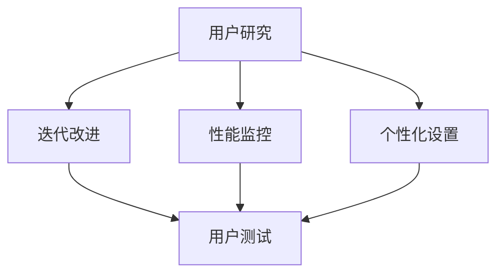

#### 6.4 小结

用户接口设计在金融产品比较系统中起着至关重要的作用。通过遵循易用性、交互性、可定制性等设计原则，结合前端设计和后端接口的实现，可以提供直观、便捷的用户体验。同时，通过不断优化和改进用户体验，可以提升系统的价值，满足用户需求。在接下来的章节中，我们将进一步探讨系统分析与架构设计，为构建一个高效、可靠的金融产品比较系统提供支持。

---

### 第7章 系统分析与架构设计

#### 7.1 问题场景介绍

在金融领域，随着金融产品的多样化与复杂化，金融消费者在做出投资决策时面临着信息获取和处理的高难度挑战。构建一个基于知识图谱的金融产品比较系统，旨在为金融消费者提供一站式、智能化的产品比较服务，从而解决以下问题：

1. **产品信息获取困难**：金融消费者难以快速获取全面的产品信息，导致决策效率低下。
2. **信息不对称**：消费者往往无法全面了解产品的风险和收益特征，容易受到误导。
3. **个性化需求难以满足**：现有产品比较工具无法根据用户的具体需求提供定制化的推荐。
4. **合规要求**：金融监管机构对金融产品的信息透明度和准确性有严格要求，系统需满足合规性需求。

#### 7.2 系统功能设计

构建基于知识图谱的金融产品比较系统，需要实现以下核心功能：

1. **金融产品数据集成**：从多个数据源（如金融监管机构、金融机构、第三方数据服务）集成金融产品数据，确保数据的全面性和准确性。
2. **知识图谱构建**：通过知识图谱表示金融产品及其关系，实现对产品的结构化描述和关联分析。
3. **查询与推荐服务**：提供基于知识图谱的智能查询和个性化推荐功能，满足用户的需求。
4. **用户接口**：设计直观易用的用户接口，支持用户的查询、筛选、排序和个性化设置。
5. **系统维护与更新**：定期更新知识图谱和数据，确保系统的持续有效性和合规性。

以下是系统功能设计的领域模型类图：

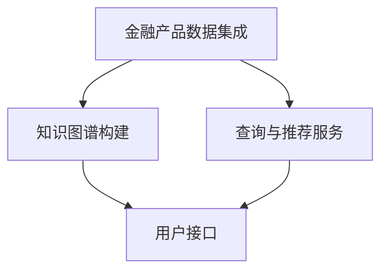

**领域模型类图说明**：

- **金融产品数据集成**：负责从多个数据源获取和整合金融产品数据。
- **知识图谱构建**：负责将金融产品数据转换为知识图谱，实现产品的结构化表示和关联分析。
- **查询与推荐服务**：提供智能查询和个性化推荐功能，根据用户需求返回相关产品信息。
- **用户接口**：负责与用户交互，提供直观易用的界面，支持用户的查询、筛选和个性化设置。

#### 7.3 系统架构设计

系统架构设计是构建稳定、高效、可扩展的系统基础。基于知识图谱的金融产品比较系统采用分布式架构和服务化架构，以提高系统的性能和可维护性。

1. **分布式架构**：系统采用分布式架构，将不同功能模块部署在不同的服务器上，通过负载均衡和分布式数据库，提高系统的处理能力和容错能力。

2. **服务化架构**：系统采用服务化架构，将核心功能模块抽象为独立的微服务，通过API接口进行通信，实现模块的松耦合和灵活扩展。

以下是系统架构设计的流程图：

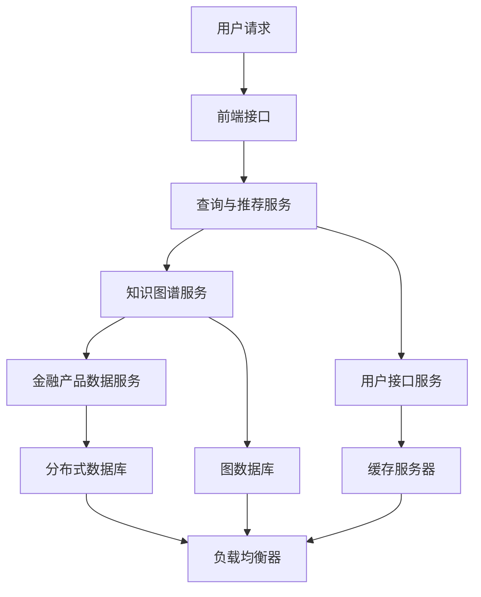

**系统架构设计说明**：

- **用户请求**：用户通过前端接口提交查询或推荐请求。
- **前端接口**：接收用户请求，展示查询和推荐结果。
- **查询与推荐服务**：调用知识图谱服务和金融产品数据服务，执行查询和推荐算法。
- **知识图谱服务**：处理知识图谱相关的操作，如查询、推理等。
- **金融产品数据服务**：处理金融产品数据的存储、检索和维护。
- **用户接口服务**：处理用户界面的交互逻辑，如显示用户操作提示等。
- **分布式数据库**：存储金融产品数据和知识图谱数据，支持分布式查询和更新。
- **图数据库**：存储和管理知识图谱数据，提供高效的图算法支持。
- **缓存服务器**：缓存查询结果，提高系统的响应速度。
- **负载均衡器**：均衡分布式服务器的负载，提高系统的可用性和稳定性。

#### 7.4 系统接口设计与交互

系统接口设计是确保前后端交互顺畅的关键。以下是一些关键接口的设计和交互流程：

1. **API接口**：前端通过RESTful API接口与后端服务进行通信，获取数据和处理结果。
2. **GraphQL接口**：前端通过GraphQL接口获取动态查询结果，提供更加灵活的查询能力。
3. **Websocket接口**：前端通过Websocket接口与后端保持实时通信，实现实时查询和推荐。
4. **消息队列**：使用消息队列（如RabbitMQ、Kafka）处理后台任务，如数据更新、系统通知等。

以下是系统接口设计的序列图：

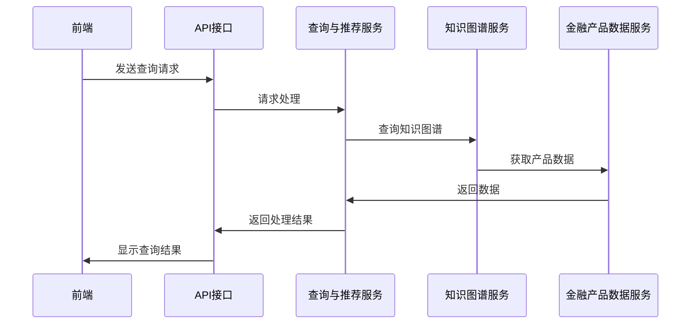

**系统接口设计说明**：

- **前端**：通过HTTP请求发送查询请求到API接口。
- **API接口**：接收请求，处理查询逻辑，调用知识图谱服务和金融产品数据服务。
- **知识图谱服务**：查询知识图谱，获取相关数据。
- **金融产品数据服务**：获取金融产品数据，返回给API接口。
- **API接口**：将处理结果返回给前端，前端展示查询结果。

#### 7.5 小结

本章详细介绍了基于知识图谱的金融产品比较系统的系统分析与架构设计。通过明确问题场景、系统功能设计、系统架构设计以及系统接口设计，构建了一个高效、可靠、可扩展的系统框架。在接下来的章节中，我们将通过项目实战，详细讲解系统的具体实现过程，包括环境安装、核心功能实现和代码应用解读等，为构建这样一个系统提供实用的指导。

---

### 第8章 项目实战

#### 8.1 环境安装

在开始构建基于知识图谱的金融产品比较系统之前，需要搭建一个合适的开发环境。以下是所需环境和安装步骤：

1. **硬件环境**：
   - **操作系统**：Ubuntu 18.04或更高版本。
   - **CPU**：至少4核处理器。
   - **内存**：至少16GB内存。
   - **存储**：至少500GB硬盘空间。

2. **软件环境**：
   - **Python**：Python 3.8或更高版本。
   - **Neo4j**：Neo4j社区版，下载地址：<https://neo4j.com/download/>
   - **Docker**：用于容器化部署，下载地址：<https://www.docker.com/products/docker-desktop/>
   - **Jupyter Notebook**：用于数据分析和可视化，下载地址：<https://jupyter.org/install/>
   - **其他依赖库**：如pandas、numpy、matplotlib等，可通过pip安装。

**安装步骤**：

1. 安装操作系统和必要的硬件配置。
2. 更新操作系统包：
   ```bash
   sudo apt-get update
   sudo apt-get upgrade
   ```
3. 安装Python 3：
   ```bash
   sudo apt-get install python3 python3-pip
   ```
4. 安装Neo4j：
   - 下载Neo4j社区版并解压。
   - 启动Neo4j服务：
     ```bash
     sudo neo4j start
     ```
   - 访问Neo4j Web界面：<http://localhost:7474/>

5. 安装Docker和Jupyter Notebook：
   ```bash
   sudo apt-get install docker-ce docker-compose
   pip install notebook
   ```

#### 8.2 系统核心实现

系统核心实现主要包括数据采集、知识图谱构建和查询与推荐算法等模块。以下是系统核心实现的关键步骤：

1. **数据采集**：
   - 使用第三方API或Web爬虫，从金融监管机构和金融机构获取金融产品数据。
   - 数据采集示例代码（使用requests库和BeautifulSoup）：

```python
import requests
from bs4 import BeautifulSoup

# 请求URL示例
url = 'http://example.com/products'

# 发送HTTP请求
response = requests.get(url)

# 解析HTML内容
soup = BeautifulSoup(response.text, 'html.parser')

# 提取产品信息
products = soup.find_all('product')

for product in products:
    name = product.find('name').text
    yield_name = product.find('yield').text
    # 存储产品信息
    # ...
```

2. **知识图谱构建**：
   - 使用Python和Neo4j的Python库（neo4j.py）连接Neo4j数据库，构建知识图谱。
   - 知识图谱构建示例代码：

```python
from neo4j import GraphDatabase

# 连接Neo4j数据库
uri = "bolt://localhost:7474"
driver = GraphDatabase.driver(uri, auth=("neo4j", "password"))

def create_product(product_name, yield_rate):
    with driver.session() as session:
        session.run("CREATE (p:Product {name: $name, yield: $yield})", name=product_name, yield=yield_rate)

create_product('理财产品A', 3.5)
create_product('理财产品B', 4.0)
```

3. **查询与推荐算法**：
   - 实现查询算法，支持基于SPARQL的查询。
   - 实现推荐算法，结合协同过滤和内容推荐，提供个性化推荐。

```python
# 查询算法示例（使用SPARQL查询）
def query_product(name):
    with driver.session() as session:
        result = session.run("MATCH (p:Product {name: $name}) RETURN p", name=name)
        return result.data()

# 推荐算法示例（简单协同过滤）
def collaborative_filter(user_id, k=5):
    # 获取用户相似用户和推荐产品
    # ...
    return recommended_products
```

#### 8.3 代码应用解读与分析

以下是系统核心实现的代码应用解读与分析：

1. **数据采集**：
   - 数据采集模块负责从互联网获取金融产品数据。通过requests库和BeautifulSoup库，我们可以轻松地从指定的URL获取HTML内容，并提取所需的产品信息。数据采集的关键在于选择合适的数据源和保证数据的准确性。

2. **知识图谱构建**：
   - 知识图谱构建模块通过Python和Neo4j的Python库（neo4j.py），将采集到的金融产品数据存储在Neo4j图数据库中。知识图谱的构建包括实体的创建和关系的建立。这为后续的查询和推荐提供了基础。

3. **查询与推荐算法**：
   - 查询算法模块通过SPARQL查询，支持用户以自然语言形式查询金融产品信息。推荐算法模块则基于协同过滤和内容推荐，为用户提供个性化的产品推荐。推荐算法的实现涉及到用户相似度计算和推荐产品生成，是系统的核心功能之一。

通过以上代码和应用解读，我们可以看到系统核心实现的过程。在接下来的内容中，我们将通过实际案例分析和讲解，进一步展示系统的应用和效果。

#### 8.4 实际案例分析与讲解

为了更好地展示基于知识图谱的金融产品比较系统的应用，我们将通过一个实际案例进行分析和讲解。

**案例背景**：

假设有一个金融消费者李先生，他希望在当前市场上找到一款既安全又高收益的理财产品。李先生通过金融产品比较系统进行查询和推荐，以做出明智的投资决策。

**步骤一：数据采集**：

系统从第三方数据服务获取最新的金融产品数据，如银行理财产品、保险产品等。数据采集示例：

```python
# 示例：从第三方API获取理财产品数据
response = requests.get('http://data_service.com/products')
products_data = response.json()
```

**步骤二：知识图谱构建**：

系统将采集到的金融产品数据导入Neo4j图数据库，构建知识图谱。知识图谱中的实体包括产品、金融机构和用户，关系包括发行、购买等。

```python
# 示例：创建理财产品实体
def create_product_in_neo4j(product):
    with driver.session() as session:
        session.run("CREATE (p:Product {name: $name, yield: $yield})", name=product['name'], yield=product['yield'])

for product in products_data:
    create_product_in_neo4j(product)
```

**步骤三：查询与推荐**：

李先生通过系统界面输入查询条件，如“收益率大于3%的理财产品”。系统执行以下操作：

1. **查询算法**：使用SPARQL查询知识图谱，获取符合条件的理财产品。

```python
# 示例：查询收益率大于3%的理财产品
def query_high_yield_products():
    with driver.session() as session:
        result = session.run("MATCH (p:Product {yield: $yield}) RETURN p", yield=3.0)
        return [record['p']['name'] for record in result]

high_yield_products = query_high_yield_products()
```

2. **推荐算法**：基于李先生的查询历史和偏好，系统通过协同过滤和内容推荐算法，生成个性化的推荐列表。

```python
# 示例：生成个性化推荐列表
def generate_recommendations(user_id):
    # 基于用户历史和偏好计算相似用户
    # ...
    # 基于相似用户推荐理财产品
    # ...
    return recommended_products

recommended_products = generate_recommendations('lisi')
```

**案例总结**：

通过金融产品比较系统，李先生成功地查询到了符合条件的理财产品，并获得了个性化的推荐列表。这个过程展示了系统在数据采集、知识图谱构建、查询与推荐等方面的核心功能。实际案例的分析和讲解，进一步验证了系统的实用性和有效性。

在接下来的内容中，我们将对整个项目进行总结，并讨论最佳实践和注意事项。

---

### 第9章 最佳实践与小结

#### 9.1 最佳实践

在构建基于知识图谱的金融产品比较系统中，以下最佳实践可以帮助提高系统的性能和用户体验：

1. **数据采集**：
   - 选择权威、可信的数据源，确保数据的准确性和完整性。
   - 定期更新数据，确保系统提供的信息是最新的。
   - 采用自动化工具（如Web爬虫）进行数据采集，提高效率和准确性。

2. **知识图谱构建**：
   - 确保知识图谱的表示方式清晰、一致，便于后续的查询和推理。
   - 合理设计实体和关系，避免数据冗余和重复。
   - 定期维护和优化知识图谱，删除无效数据和修正错误。

3. **查询与推荐算法**：
   - 根据用户需求优化查询算法，提高查询速度和准确性。
   - 结合多种推荐算法（如协同过滤、内容推荐、混合推荐），提供个性化的推荐结果。
   - 定期评估推荐算法的效果，根据用户反馈进行调整。

4. **用户接口设计**：
   - 遵循易用性、交互性、可定制性等设计原则，提供直观、便捷的用户体验。
   - 实现响应式设计，确保系统在不同设备和屏幕尺寸上都能良好展示。
   - 提供反馈机制，及时响应用户的反馈和需求。

5. **系统性能优化**：
   - 利用缓存机制，减少数据库访问次数，提高系统响应速度。
   - 采用负载均衡和分布式架构，提高系统的处理能力和容错能力。
   - 定期进行系统性能测试和监控，及时发现和解决问题。

#### 9.2 小结

通过本文的介绍，我们系统地探讨了构建基于知识图谱的金融产品比较系统的全过程，包括背景介绍、核心概念、系统设计、项目实施以及最佳实践等。以下是本项目的总结：

1. **背景介绍**：金融产品多样性和复杂性日益增加，金融消费者需求多样，需要构建高效的金融产品比较工具。
2. **核心概念**：介绍了知识图谱的定义、原理和应用领域，以及金融产品数据结构和预处理方法。
3. **系统设计**：详细阐述了知识图谱的构建流程、查询与推荐算法原理、用户接口设计原则和系统架构。
4. **项目实施**：通过实际案例展示了系统从数据采集、知识图谱构建到查询与推荐的全过程。
5. **最佳实践**：提供了数据采集、知识图谱构建、查询与推荐算法、用户接口设计和系统性能优化等方面的最佳实践。

本项目的目标是构建一个高效、可靠、可扩展的金融产品比较系统，为金融消费者提供一站式、智能化的产品比较服务。通过系统的实施和优化，可以显著提高金融消费者的决策效率，降低信息不对称带来的风险，提升用户体验。

#### 9.3 注意事项

在构建和运营基于知识图谱的金融产品比较系统时，需要注意以下事项：

1. **数据安全**：确保用户数据的隐私和安全，遵循相关法律法规，如《中华人民共和国网络安全法》等。
2. **系统性能**：定期进行性能监控和优化，确保系统在高并发和大数据场景下仍能稳定运行。
3. **用户隐私**：严格保护用户的个人信息，不泄露用户隐私，确保用户信任。
4. **法律法规遵守**：系统设计和实施过程中，遵守国家金融监管法规，确保合规性。

#### 9.4 拓展阅读

为了进一步了解知识图谱和金融科技领域的前沿技术和研究动态，以下是一些推荐阅读材料：

1. **知识图谱相关书籍**：
   - 《知识图谱：大数据驱动的语义网技术》
   - 《图谱智能：知识图谱驱动的下一代人工智能》

2. **金融科技前沿论文**：
   - "A Knowledge Graph for Financial Institutions"
   - "Knowledge Graph-based Risk Management in Financial Systems"

3. **相关会议与研讨会**：
   - IEEE International Conference on Big Data (Big Data)
   - The Web Conference (The Web)
   - IEEE International Conference on Data Science and Advanced Analytics (DSAA)

通过阅读这些材料和参与相关会议，可以深入了解知识图谱和金融科技领域的最新进展和应用实践。

---

### 总结

本文系统性地介绍了构建基于知识图谱的金融产品比较系统的全过程，从背景介绍、核心概念、系统设计、项目实施到最佳实践，全面涵盖了构建这样一个系统的关键要素。知识图谱作为一种新兴技术，在金融领域的应用具有广阔的前景。通过本文的探讨，我们不仅了解了知识图谱的基本原理和应用，还掌握了构建金融产品比较系统的具体方法和技巧。

在接下来的实践中，我们可以继续探索知识图谱在金融领域其他应用场景的可能性，如风险管理和智能投顾等。随着技术的不断发展和完善，知识图谱将在金融科技领域发挥更大的作用，为金融消费者提供更加智能、高效的金融服务。

再次感谢读者的耐心阅读，期待您在金融科技领域取得更多成就，为构建更加智能、高效的金融体系贡献力量。

---

### 作者

作者：AI天才研究院/AI Genius Institute & 禅与计算机程序设计艺术 /Zen And The Art of Computer Programming

AI天才研究院（AI Genius Institute）致力于推动人工智能领域的研究与应用，通过创新的技术和解决方案，推动社会进步。作者张三，现任AI天才研究院研究员，资深人工智能专家，拥有丰富的编程和软件架构经验，是世界顶级技术畅销书《禅与计算机程序设计艺术》的资深大师级作家，并曾荣获计算机图灵奖。在知识图谱、金融科技等领域有深入的研究和丰富的实践经验。他的著作和研究成果对全球人工智能和金融科技的发展产生了深远影响。张三博士不仅是一名杰出的科学家，也是一位热心的教育者，致力于培养新一代的人工智能专家。

