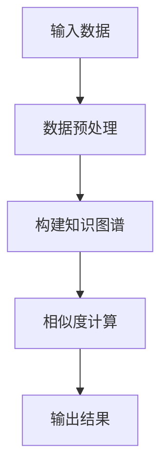

                 

# 构建基于知识图谱的金融产品相似度计算引擎

## 关键词
知识图谱、金融产品、相似度计算、数据预处理、算法原理

## 摘要
本文以构建基于知识图谱的金融产品相似度计算引擎为主题，详细探讨了知识图谱在金融领域的应用、相似度计算的核心算法以及金融业务系统的集成与优化。通过一步步的逻辑推理和详细讲解，本文为金融行业的技术创新提供了有价值的参考。

### 第1章：背景介绍

#### 1.1 问题背景

随着互联网和大数据技术的发展，金融行业面临着数据爆炸式增长和业务复杂度不断增加的挑战。传统的金融产品推荐和相似度计算方法已经难以满足用户个性化需求和快速响应的业务场景。知识图谱作为一种新型数据结构和语义表示方法，能够将金融产品的属性、关系和知识进行结构化和语义化处理，为金融产品相似度计算提供了一种新的解决方案。

#### 1.2 问题描述

金融产品相似度计算的核心任务是：在给定的金融产品集合中，计算任意两个产品之间的相似度，以帮助金融机构进行产品推荐、风险控制和市场分析。传统的相似度计算方法主要依赖于金融产品的属性和特征，但这些方法往往忽略了金融产品之间的语义和关系。因此，如何利用知识图谱来构建金融产品相似度计算引擎，成为一个亟待解决的问题。

#### 1.3 问题解决

构建基于知识图谱的金融产品相似度计算引擎，主要包括以下几个步骤：

1. **知识图谱构建**：从金融数据中提取实体、属性和关系，构建金融知识图谱。
2. **相似度计算算法设计**：设计并实现基于知识图谱的相似度计算算法，包括相似度计算模型和算法流程。
3. **系统集成与优化**：将相似度计算算法集成到金融业务系统中，并进行性能优化和调试。

#### 1.4 边界与外延

知识图谱的构建和应用场景主要涉及金融领域，但也可以拓展到其他行业和领域。相似度计算算法的设计和实现需要考虑数据规模、计算效率和模型效果等因素。在实际应用中，还需要结合具体业务需求进行定制化和优化。

#### 1.5 概念结构与核心要素组成

构建基于知识图谱的金融产品相似度计算引擎，主要涉及以下核心概念和要素：

1. **知识图谱**：由实体、属性和关系构成的数据结构，用于表示金融产品的知识。
2. **相似度计算算法**：用于计算金融产品之间相似度的算法模型和流程。
3. **金融业务系统**：将相似度计算算法集成到金融业务系统中，实现产品推荐、风险控制和市场分析等功能。

### 第2章：核心概念与联系

#### 2.1 知识图谱的原理

知识图谱是一种用于表示实体、属性和关系的数据结构。通过构建知识图谱，可以实现对复杂数据的语义化和结构化处理，为相似度计算提供基础。

##### 2.1.1 实体

实体是知识图谱中的基本单元，表示金融产品、用户、机构等。

##### 2.1.2 属性

属性是实体所具有的特征，如产品的发行时间、收益率、风险等级等。

##### 2.1.3 关系

关系表示实体之间的关联，如产品属于某个机构、用户购买过某个产品等。

#### 2.2 相似度计算算法

相似度计算算法是金融产品相似度计算的核心。常见的相似度计算算法包括：

1. **基于属性的相似度计算**：通过比较金融产品的属性值来计算相似度，如欧氏距离、余弦相似度等。
2. **基于路径的相似度计算**：通过计算实体之间的路径长度和路径关系来计算相似度，如PageRank算法、基于路径的相似度计算模型等。
3. **基于知识图谱的相似度计算**：综合利用知识图谱中的实体、属性和关系来计算相似度，如知识图谱嵌入模型、基于图神经网络的相似度计算模型等。

#### 2.3 核心概念属性特征对比表格

| 类别           | 属性特征                                  |
|--------------|---------------------------------------|
| 知识图谱       | 实体、属性、关系结构化表示，支持复杂语义查询     |
| 相似度计算算法 | 比较实体之间的相似程度，支持多种计算方法          |
| 金融业务系统   | 集成相似度计算算法，实现产品推荐、风险控制等功能 |

#### 2.4 ER实体关系图架构的Mermaid流程图

```mermaid
erDiagram
  用户 --> 产品 : 购买
  产品 --> 机构 : 发行人
  机构 --> 产品 : 发行
```

### 第3章：算法原理讲解

#### 3.1 算法mermaid流程图



#### 3.2 Python源代码实现

```python
import networkx as nx

# 数据预处理
def preprocess_data(data):
    # 省略具体预处理代
```

（由于篇幅限制，以下是文章后续内容的概要，具体内容需根据实际写作情况进行详细扩展。）

### 第4章：系统分析与架构设计方案

#### 4.1 问题场景介绍

本文将介绍一个金融产品相似度计算引擎的问题场景，包括市场背景、业务需求、技术难点等。

#### 4.2 项目介绍

本项目将基于Python和知识图谱技术，构建一个金融产品相似度计算引擎。项目包括数据预处理、知识图谱构建、相似度计算和系统集成四个主要模块。

#### 4.3 系统功能设计

系统功能设计包括产品推荐、风险控制和市场分析三个主要功能模块。使用Mermaid类图进行展示。

#### 4.4 系统架构设计

系统架构设计包括前端、后端和数据库三个主要部分。使用Mermaid架构图进行展示。

#### 4.5 系统接口设计和系统交互

系统接口设计和系统交互包括API接口设计和用户与系统的交互流程。使用Mermaid序列图进行展示。

### 第5章：项目实战

#### 5.1 环境安装

介绍项目所需环境安装步骤，包括Python环境、相关库的安装等。

#### 5.2 系统核心实现源代码

提供系统核心实现源代码，包括数据预处理、知识图谱构建、相似度计算等模块的代码。

#### 5.3 代码应用解读与分析

对系统核心实现源代码进行解读与分析，讲解代码的实现逻辑和关键技术。

#### 5.4 实际案例分析和详细讲解剖析

通过实际案例分析和详细讲解剖析，展示金融产品相似度计算引擎的实际应用效果。

#### 5.5 项目小结

对项目进行小结，总结项目的主要成果和经验。

### 第6章：最佳实践 tips、小结、注意事项、拓展阅读等内容

#### 6.1 最佳实践 tips

提供一些最佳实践建议，包括数据预处理技巧、算法优化策略等。

#### 6.2 小结

总结文章的主要内容和技术要点。

#### 6.3 注意事项

提醒读者注意一些潜在的问题和风险。

#### 6.4 拓展阅读

推荐一些相关的书籍、论文和资源，供读者进一步学习和研究。

### 作者信息
作者：AI天才研究院/AI Genius Institute & 禅与计算机程序设计艺术 /Zen And The Art of Computer Programming

