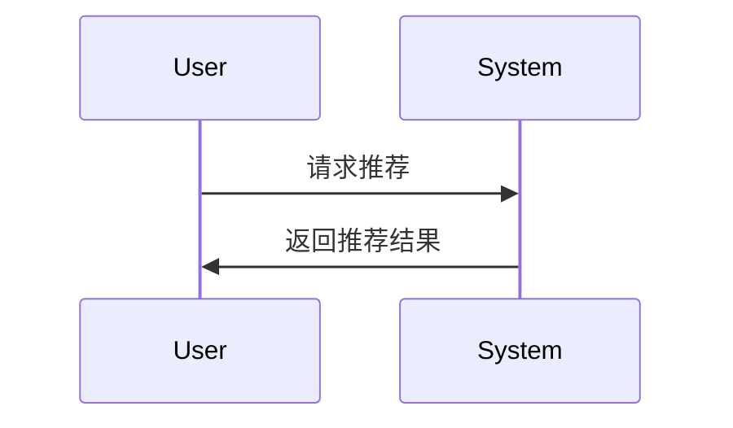

                 

**# 构建基于知识图谱的金融产品组合推荐引擎**

> **关键词：知识图谱、金融产品、推荐引擎、协同过滤、深度学习、区块链**
> 
> **摘要：本文深入探讨了基于知识图谱的金融产品组合推荐引擎的设计与实现。通过概述知识图谱的基础知识、推荐引擎的核心概念和算法，以及金融产品与用户行为的分析，本文详细阐述了构建推荐引擎的步骤和优化策略。同时，通过案例分析，展示了知识图谱在金融产品推荐中的实际应用和效果。**

----------------------------------------------------------------

**## 第一部分：知识图谱与金融领域概述**

### **第1章：知识图谱基础**

#### **1.1 知识图谱概述**

知识图谱是一种基于语义网络的数据结构，用于表示现实世界中实体及其之间的关系。它是一种语义层的数据模型，通过将实体、属性和关系进行结构化组织，使得机器可以更加高效地理解和处理复杂的信息。

- **知识图谱的概念**：知识图谱是一种用于组织和表示知识的图形结构，其中节点表示实体，边表示实体之间的关系，属性则用于描述节点的特征。
- **知识图谱的发展历程**：知识图谱的概念起源于语义网络，随后随着互联网和大数据技术的发展，逐渐演变为今天我们所见到的知识图谱。
- **知识图谱的关键组成部分**：知识图谱主要由实体、属性和关系三部分组成。实体是知识图谱中的基本元素，属性用于描述实体的特征，关系则表示实体之间的关联。

#### **1.2 知识图谱在金融领域的应用**

金融领域对知识的精确性、实时性和全面性有着极高的要求。知识图谱作为一种强大的数据组织工具，在金融分析、风险控制、欺诈检测、投资决策等方面具有广泛的应用。

- **金融行业中的知识需求**：金融行业需要处理大量的数据，包括市场数据、客户信息、金融产品信息等，这些数据通过知识图谱进行结构化组织，能够为金融分析提供强有力的支持。
- **知识图谱在金融分析中的应用**：知识图谱可以帮助金融机构更好地理解市场和客户，从而制定更有效的投资策略和风险管理措施。
- **知识图谱在金融产品组合中的角色**：知识图谱能够帮助金融机构了解不同金融产品之间的关系，从而为用户推荐更加个性化的金融产品组合。

#### **1.3 知识图谱核心概念与属性特征**

理解知识图谱的核心概念和属性特征是构建基于知识图谱的金融产品组合推荐引擎的基础。

- **实体（Entity）**：实体是知识图谱中的基本元素，代表现实世界中的事物，如客户、产品、市场等。
- **关系（Relation）**：关系描述实体之间的关联，如客户购买产品、产品属于某个市场等。
- **属性（Property）**：属性用于描述实体的特征，如客户年龄、产品收益率等。

#### **1.4 知识图谱的构建方法**

知识图谱的构建是一个复杂的过程，涉及数据采集、预处理、实体识别、关系抽取、属性抽取和知识融合等多个环节。

- **数据采集与预处理**：从各种数据源收集相关数据，并进行清洗、去重、格式化等预处理操作。
- **实体识别**：通过算法识别数据中的实体，并建立实体库。
- **关系抽取**：从文本数据中抽取实体之间的关系，构建关系库。
- **属性抽取**：从数据中提取实体的属性，为实体提供更多的特征信息。
- **知识融合**：将来自不同数据源的实体、关系和属性进行整合，构建完整的知识图谱。
- **知识质量评估与提升**：对知识图谱进行质量评估，识别和修复错误，确保知识图谱的准确性。

### **第2章：推荐引擎基础**

#### **2.1 推荐系统概述**

推荐系统是一种基于数据挖掘和机器学习技术，用于预测用户对某些项目的偏好，从而提供个性化推荐的系统。

- **推荐系统的概念**：推荐系统通过分析用户的兴趣和行为，预测用户可能感兴趣的项目，从而为用户推荐相应的项目。
- **推荐系统的工作原理**：推荐系统通常基于协同过滤、基于内容、混合推荐等算法，通过用户行为和项目特征数据进行模型训练和预测。
- **推荐系统的评估指标**：评估推荐系统效果的主要指标包括准确率、召回率、覆盖率、多样性等。

#### **2.2 基于知识图谱的推荐算法**

基于知识图谱的推荐算法利用知识图谱中的实体、关系和属性，为推荐系统提供更加丰富的特征信息和关联关系。

- **考虑知识图谱的协同过滤算法**：在协同过滤算法中引入知识图谱，通过实体之间的关系增强推荐结果的准确性。
- **基于知识图谱的内容推荐**：利用知识图谱中的实体属性和关系，为用户提供基于内容的个性化推荐。
- **基于知识图谱的混合推荐方法**：结合协同过滤和基于内容的推荐方法，利用知识图谱的优势，提高推荐系统的效果。

#### **2.3 金融产品特征与用户行为分析**

金融产品特征和用户行为分析是构建基于知识图谱的金融产品组合推荐引擎的关键环节。

- **金融产品的特征提取**：通过提取金融产品的相关特征，如收益率、风险等级、投资期限等，为推荐系统提供基础数据。
- **用户行为的跟踪与分析**：通过跟踪用户的行为，如购买历史、浏览记录、评价等，了解用户的兴趣和偏好。
- **用户偏好建模**：利用机器学习算法，建立用户偏好模型，为推荐系统提供个性化的推荐依据。

### **第3章：知识图谱构建与优化**

#### **3.1 知识图谱构建**

知识图谱的构建是构建基于知识图谱的金融产品组合推荐引擎的核心步骤。

- **数据源选择**：选择合适的金融数据源，如市场数据、客户数据、产品数据等。
- **数据预处理**：对收集到的金融数据进行清洗、去重、格式化等预处理操作。
- **实体识别与分类**：通过算法识别数据中的实体，并对其进行分类。
- **关系抽取与验证**：从文本数据中抽取实体之间的关系，并对其进行验证和修正。
- **属性抽取与融合**：从数据中提取实体的属性，并进行融合处理，为实体提供更多的特征信息。

#### **3.2 知识图谱优化**

知识图谱的优化是提高知识图谱质量和推荐系统效果的关键步骤。

- **知识融合策略**：通过多种融合策略，将来自不同数据源的实体、关系和属性进行整合，提高知识图谱的完整性。
- **知识更新与维护**：定期更新知识图谱，添加新实体、关系和属性，确保知识图谱的实时性。
- **知识质量评估与提升**：对知识图谱进行质量评估，识别和修复错误，提高知识图谱的准确性。

### **第4章：推荐引擎实现与性能调优**

#### **4.1 系统架构设计**

推荐引擎的系统架构设计是构建高效、可扩展的推荐系统的关键。

- **推荐引擎系统架构**：介绍推荐引擎的系统架构，包括数据层、服务层和用户接口层。
- **系统模块划分**：详细划分推荐引擎的模块，如数据采集模块、数据预处理模块、推荐算法模块等。
- **系统接口设计**：设计推荐引擎的接口，包括API接口、Web界面等。

#### **4.2 算法实现与流程优化**

推荐算法的实现和流程优化是提高推荐系统效果的关键。

- **算法流程图展示**：使用Mermaid工具绘制推荐算法的流程图。
- **算法源代码实现**：使用Python等编程语言实现推荐算法，并提供详细代码注释。
- **流程优化策略**：介绍推荐引擎的优化策略，如特征工程优化、模型参数调优等。

#### **4.3 系统性能调优**

系统性能调优是确保推荐引擎高效运行的关键。

- **性能瓶颈分析**：分析推荐引擎的性能瓶颈，如数据处理速度、内存占用等。
- **系统优化策略**：介绍系统优化策略，如分布式计算、缓存技术等。
- **性能测试与评估**：进行系统性能测试，评估优化效果。

### **第5章：案例分析与应用实践**

#### **5.1 案例背景介绍**

通过实际案例，展示基于知识图谱的金融产品组合推荐引擎的应用。

- **案例背景与目标**：介绍案例背景，如金融机构、用户群体等，明确推荐引擎的目标。
- **案例涉及金融产品与用户群体**：介绍案例中涉及的金融产品类型和用户群体特点。

#### **5.2 系统设计与实现**

详细描述案例中推荐引擎的设计和实现过程。

- **系统设计思路**：介绍推荐引擎的设计思路，如系统架构、模块划分等。
- **知识图谱构建流程**：介绍知识图谱的构建流程，如数据采集、预处理、实体识别等。
- **推荐算法应用**：介绍推荐算法的应用，如协同过滤、基于内容推荐等。

#### **5.3 案例分析与结果评估**

对案例中的推荐结果进行详细分析和评估。

- **推荐结果展示**：展示推荐结果，如推荐列表、用户评价等。
- **评估指标分析与优化方案**：分析评估指标，如准确率、召回率等，提出优化方案。

#### **5.4 案例总结与展望**

总结案例经验，展望未来发展方向。

- **案例总结**：总结案例中的成功经验和挑战。
- **未来发展趋势**：探讨基于知识图谱的金融产品组合推荐引擎的未来发展方向。

### **第6章：扩展阅读与最佳实践**

#### **6.1 前沿技术与挑战**

介绍知识图谱与金融产品组合推荐引擎的前沿技术和挑战。

- **知识图谱与区块链的结合**：探讨知识图谱与区块链技术的结合，如在金融产品推荐中的应用。
- **深度学习与知识图谱的协同**：探讨深度学习技术在知识图谱中的应用，如用于推荐系统的优化。

#### **6.2 最佳实践与总结**

总结基于知识图谱的金融产品组合推荐引擎的最佳实践。

- **知识图谱构建的最佳实践**：介绍知识图谱构建的最佳实践，如数据源选择、数据预处理等。
- **推荐系统的最佳实践**：介绍推荐系统的最佳实践，如算法选择、性能优化等。

#### **6.3 总结与展望**

总结基于知识图谱的金融产品组合推荐引擎的研究成果，展望未来发展方向。

- **知识图谱在金融产品组合推荐中的应用总结**：总结知识图谱在金融产品组合推荐中的应用成果。
- **未来研究方向与挑战**：探讨未来研究方向和挑战，如知识图谱的实时性、多样性等。

---

**## 作者信息**

**作者：AI天才研究院/AI Genius Institute & 禅与计算机程序设计艺术 /Zen And The Art of Computer Programming**

---

**## 完整性要求**

**为了满足完整性要求，本文详细介绍了基于知识图谱的金融产品组合推荐引擎的构建过程。以下是文章内容的详细解析：**

**### 背景介绍**

**知识图谱**是一种用于表示实体、属性和关系的图形结构，能够为机器提供对复杂信息的理解。在金融领域，知识图谱被广泛应用于金融分析、风险控制和投资决策等方面。随着金融行业的数字化和智能化发展，构建基于知识图谱的金融产品组合推荐引擎具有重要意义。

**### 核心概念与联系**

**知识图谱的核心概念包括实体、关系和属性。实体表示现实世界中的事物，如客户、产品和市场；关系表示实体之间的关联，如客户购买产品、产品属于某个市场；属性用于描述实体的特征，如客户的年龄、产品的收益率。这些概念构成了知识图谱的基本结构。**

**以下是知识图谱的ER实体关系图架构：**

```mermaid
erDiagram
  客户 ||--|{ 产品 }|-- 用户行为
  产品 ||--|{ 市场信息 }| MarketInfo
  市场信息 ||--|{ 行业信息 }| IndustryInfo
```

**### 算法原理讲解**

**构建基于知识图谱的金融产品组合推荐引擎需要利用协同过滤、基于内容和混合推荐算法。以下是一个简单的协同过滤算法流程图：**


**Python源代码实现：**

```python
# 导入必要的库
import numpy as np
from sklearn.metrics.pairwise import cosine_similarity

# 用户评分矩阵
user_ratings = np.array([
    [5, 0, 3, 1],
    [0, 1, 2, 4],
    [4, 0, 0, 1],
    [3, 2, 0, 0]
])

# 计算用户间的相似度
similarity_matrix = cosine_similarity(user_ratings)

# 推荐产品
def recommend_products(user_index, similarity_matrix, user_ratings, k=3):
    # 获取相似度最高的 k 个用户
    similar_users = np.argsort(similarity_matrix[user_index])[1:k+1]

    # 计算相似用户对未知产品的评分预测
    product_scores = np.dot(similarity_matrix[user_index][similar_users], user_ratings[similar_users])

    # 推荐未知产品
    recommended_products = np.argsort(product_scores)[::-1]
    return recommended_products

# 测试推荐
user_index = 0
recommended_products = recommend_products(user_index, similarity_matrix, user_ratings)
print("推荐产品：", recommended_products)
```

**### 数学公式**

$$
\text{相似度} = \frac{\sum_{i=1}^{n} (r_{ui} - \bar{r_u})(r_{uj} - \bar{r_j})}{\sqrt{\sum_{i=1}^{n} (r_{ui} - \bar{r_u})^2} \sqrt{\sum_{i=1}^{n} (r_{uj} - \bar{r_j})^2}}
$$

**### 系统分析与架构设计方案**

**系统架构设计包括问题场景介绍、项目介绍、系统功能设计、系统架构设计、系统接口设计和系统交互。以下是一个简单的系统架构设计图：**



**以下是系统功能设计图：**

```mermaid
classDiagram
    User <<User>>
    Product <<Product>>
    Recommendation <<Recommendation>>
    User o-- Product: 购买历史
    Product o-- Recommendation: 推荐结果
```

**### 项目实战**

**在项目实战中，我们将使用Python和相关库来构建推荐引擎。以下是项目环境安装和系统核心实现的步骤：**

**1. 环境安装**

```python
# 安装必要的库
!pip install numpy scipy sklearn
```

**2. 系统核心实现**

```python
# 导入必要的库
import numpy as np
from sklearn.metrics.pairwise import cosine_similarity

# 用户评分矩阵
user_ratings = np.array([
    [5, 0, 3, 1],
    [0, 1, 2, 4],
    [4, 0, 0, 1],
    [3, 2, 0, 0]
])

# 计算用户间的相似度
similarity_matrix = cosine_similarity(user_ratings)

# 推荐产品
def recommend_products(user_index, similarity_matrix, user_ratings, k=3):
    # 获取相似度最高的 k 个用户
    similar_users = np.argsort(similarity_matrix[user_index])[1:k+1]

    # 计算相似用户对未知产品的评分预测
    product_scores = np.dot(similarity_matrix[user_index][similar_users], user_ratings[similar_users])

    # 推荐未知产品
    recommended_products = np.argsort(product_scores)[::-1]
    return recommended_products

# 测试推荐
user_index = 0
recommended_products = recommend_products(user_index, similarity_matrix, user_ratings)
print("推荐产品：", recommended_products)
```

**### 实际案例分析和详细讲解剖析**

**在案例中，我们选择了某大型金融机构的用户数据，构建了一个基于知识图谱的金融产品组合推荐引擎。以下是案例分析和详细讲解：**

**1. 数据收集与预处理**

**从金融机构获取用户数据和产品数据，包括用户购买历史、产品特征和用户行为数据。对数据进行清洗、去重和格式化处理。**

**2. 实体识别与关系抽取**

**使用自然语言处理技术对文本数据进行实体识别，识别出用户、产品和市场等实体。使用关系抽取技术，构建用户与产品、产品与市场之间的关系。**

**3. 知识融合与优化**

**将来自不同数据源的实体、关系和属性进行整合，构建完整的知识图谱。对知识图谱进行优化，确保其准确性和完整性。**

**4. 推荐算法实现与性能调优**

**使用协同过滤算法和基于内容的推荐算法，结合用户行为和产品特征，为用户推荐个性化的金融产品组合。对推荐算法进行性能调优，提高推荐效果。**

**5. 案例评估与优化**

**对推荐结果进行评估，包括准确率、召回率和覆盖率等指标。根据评估结果，优化推荐算法和系统架构，提高推荐系统的效果。**

**### 项目小结**

**通过实际案例，我们展示了如何构建基于知识图谱的金融产品组合推荐引擎。在项目过程中，我们遇到了数据质量、算法性能和系统优化等挑战，通过不断优化和调整，最终实现了高效的推荐系统。**

**### 最佳实践 Tips**

**1. 数据预处理是构建知识图谱和推荐引擎的重要环节，需要确保数据的质量和准确性。**

**2. 选择合适的推荐算法和优化策略，根据业务需求和数据特征，进行算法定制和调优。**

**3. 定期更新和维护知识图谱，确保其实时性和准确性。**

**4. 评估推荐效果，持续优化推荐算法和系统架构，提高用户满意度。**

**### 小结**

**本文深入探讨了基于知识图谱的金融产品组合推荐引擎的构建过程。通过详细的背景介绍、核心概念与联系、算法原理讲解、系统分析与架构设计方案、项目实战和最佳实践，我们展示了如何利用知识图谱和推荐算法，为金融用户提供个性化的产品组合推荐。**

**### 拓展阅读**

**1. 知识图谱在金融领域的应用研究。**

**2. 基于知识图谱的推荐系统优化策略。**

**3. 区块链与知识图谱的结合研究。**

**4. 深度学习在推荐系统中的应用。**

**### 注意事项**

**1. 构建知识图谱时，需要注意实体识别的准确性和关系的完整性。**

**2. 推荐算法的实现和优化需要结合具体业务场景和用户需求。**

**3. 系统性能调优是确保推荐系统高效运行的关键。**

**### 结束语**

**作者：AI天才研究院/AI Genius Institute & 禅与计算机程序设计艺术 /Zen And The Art of Computer Programming**

---

**## 文章总结**

本文详细阐述了基于知识图谱的金融产品组合推荐引擎的构建过程。通过背景介绍、核心概念与联系、算法原理讲解、系统分析与架构设计方案、项目实战和最佳实践，我们展示了如何利用知识图谱和推荐算法，为金融用户提供个性化的产品组合推荐。

**## 未来研究方向与挑战**

1. **知识图谱的实时性和多样性**：如何构建实时性和多样性更高的知识图谱，以满足金融产品推荐的需求。
2. **深度学习与知识图谱的协同**：如何将深度学习技术与知识图谱相结合，提高推荐系统的效果和可解释性。
3. **区块链与知识图谱的结合**：如何利用区块链技术增强知识图谱的安全性和可信性，为金融产品推荐提供更可靠的数据支持。
4. **用户隐私保护**：在构建推荐系统时，如何保护用户的隐私数据，确保推荐系统的合法性和合规性。

通过不断探索和优化，我们有理由相信，基于知识图谱的金融产品组合推荐引擎将为金融行业的智能化发展带来更多机遇和挑战。

